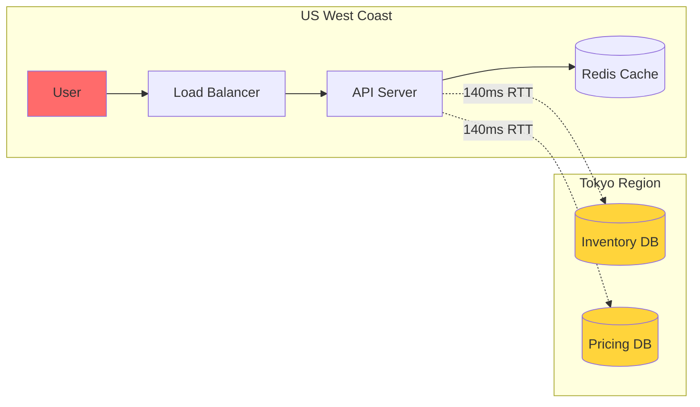
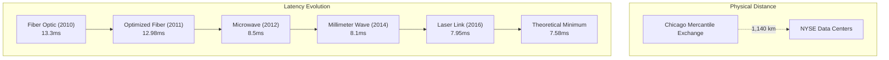
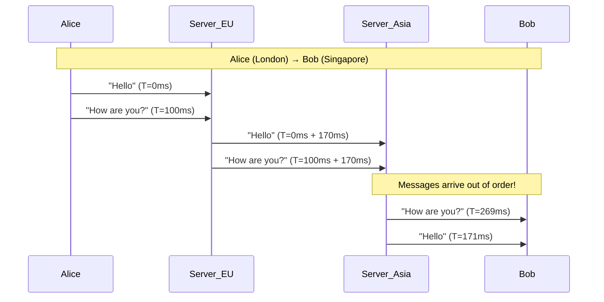
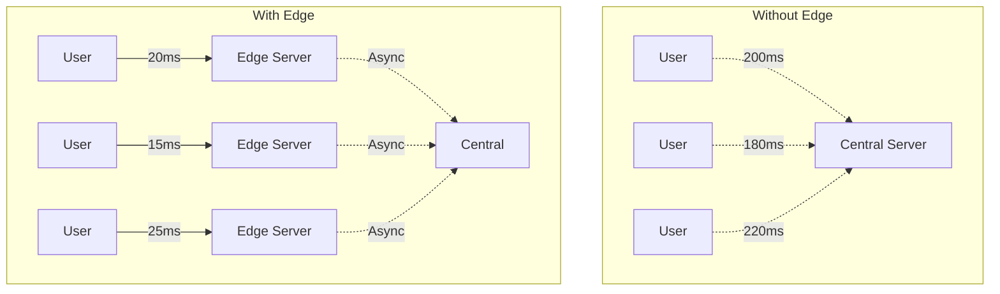

<!-- Navigation -->
[Home](/) → [Part I: Axioms](/part1-axioms/) → [Axiom 1](index.md) → **Latency Examples**

# Latency Examples

**Understanding the speed of causality through real-world failures and patterns**

---

## 🌏 Real-World Case Studies

### Case 1: The Tokyo Checkout Disaster (2019)

**Company**: Major US E-commerce Platform  
**Impact**: $4.2M lost revenue in 4 hours  
**Root Cause**: Cross-pacific latency in synchronous checkout flow

#### The Setup



#### What Happened

<div class="responsive-table" markdown>

| Time | Event | Latency Impact |
|------|-------|----------------|
| **T+0ms** | User clicks "Buy Now" | Checkout begins |
| **T+20ms** | API checks local cache | ❌ Cache miss (new product) |
| **T+160ms** | Query Tokyo inventory | 140ms RTT + 20ms processing |
| **T+300ms** | Query Tokyo pricing | Another 140ms RTT |
| **T+450ms** | Calculate shipping | Depends on inventory location |
| **T+610ms** | Return to user | **Total: 610ms** |

</div>


#### The Problem Cascade

```yaml
Normal Load (1000 req/s):
  - Checkout latency: 610ms
  - Users waiting: ~610 concurrent
  - Connection pool: 1000 (sufficient)

Black Friday (5000 req/s):
  - Checkout latency: 610ms (physics doesn't scale!)
  - Users waiting: ~3050 concurrent
  - Connection pool: 1000 (exhausted!)
  - Result: Timeouts → Retries → More load → Cascade failure
```

#### The Fix

```python
# Before: Synchronous cross-region calls
def checkout(user_id, product_id):
    inventory = tokyo_db.check_inventory(product_id)  # 140ms
    price = tokyo_db.get_price(product_id)           # 140ms
    shipping = calculate_shipping(inventory.location) # 150ms
    return create_order(user_id, price, shipping)

# After: Local read replicas + async validation
def checkout_v2(user_id, product_id):
# Read from local replicas (5ms each)
    inventory_snapshot = local_cache.get_inventory(product_id)
    price_snapshot = local_cache.get_price(product_id)
    
# Optimistic checkout
    order = create_provisional_order(user_id, price_snapshot)
    
# Async validation (user doesn't wait)
    queue.push(validate_order, order.id)
    
    return order  # Total: 25ms
```

**Lesson**: You can't negotiate with the speed of light. Design around it.

---

### Case 2: The HFT Arms Race

**Industry**: High-Frequency Trading  
**Stakes**: Microseconds = Millions  
**Physics Battle**: Chicago ↔ New Jersey

#### The Geography of Finance



#### The Million-Dollar Millisecond

<div class="responsive-table" markdown>

| Technology | One-way Latency | Cost to Build | Advantage Window |
|------------|----------------|---------------|------------------|
| **Standard Fiber** | 6.65ms | $1M | Baseline |
| **Dark Fiber** | 6.55ms | $10M | 100μs = $50K/day |
| **Microwave** | 4.25ms | $30M | 2.3ms = $1.2M/day |
| **Millimeter Wave** | 4.05ms | $50M | 200μs = $100K/day |
| **Theoretical Limit** | 3.79ms | ∞ | Physics says no |

</div>


#### Real Trading Impact

```python
# Market arbitrage example
class LatencyArbitrage:
    def __init__(self, latency_ms):
        self.latency = latency_ms
        self.opportunities_per_day = 50000
        self.avg_profit_per_trade = 0.02  # 2 cents
        
    def calculate_capture_rate(self, competitor_latency):
        """Probability of winning the trade"""
        if self.latency < competitor_latency:
# Winner takes all in HFT
            advantage = competitor_latency - self.latency
            capture_rate = min(0.95, advantage / competitor_latency)
            return capture_rate
        else:
# You lose most trades
            return 0.05
    
    def daily_profit(self, competitor_latency):
        capture_rate = self.calculate_capture_rate(competitor_latency)
        trades_won = self.opportunities_per_day * capture_rate
        return trades_won * self.avg_profit_per_trade

# Fiber vs Microwave
fiber_trader = LatencyArbitrage(6.55)
microwave_trader = LatencyArbitrage(4.25)

print(f"Fiber daily profit vs microwave: ${fiber_trader.daily_profit(4.25):,.0f}")
print(f"Microwave daily profit vs fiber: ${microwave_trader.daily_profit(6.55):,.0f}")
# Output:
# Fiber daily profit vs microwave: $50
# Microwave daily profit vs fiber: $47,500
```

**Lesson**: In competitive systems, relative latency matters more than absolute latency.

---

### Case 3: WhatsApp's Global Message Ordering

**Challenge**: 2 billion users, 100 billion messages/day  
**Constraint**: Messages must appear in correct order despite global distances

#### The Global Latency Matrix

```yaml
Datacenter Locations:
  US-East: Virginia
  US-West: Oregon  
  EU: Ireland
  Asia: Singapore
  South-America: São Paulo

Latency Matrix (ms):
         US-E  US-W   EU   Asia   SA
  US-E     0    70    85   230   120
  US-W    70     0   150   165   190  
  EU      85   150     0   170   200
  Asia   230   165   170     0   320
  SA     120   190   200   320     0
```

#### Message Ordering Problem



#### WhatsApp's Solution

```python
class MessageOrdering:
    def __init__(self):
        self.buffer_window_ms = 200  # Max expected reorder window
        self.pending_messages = {}  # seq_num -> message
        self.next_expected = 0
        
    def receive_message(self, message, current_time):
        seq_num = message['sequence_number']
        
        if seq_num == self.next_expected:
# In order, deliver immediately
            self.deliver(message)
            self.next_expected += 1
            
# Check if we can deliver buffered messages
            while self.next_expected in self.pending_messages:
                buffered = self.pending_messages.pop(self.next_expected)
                self.deliver(buffered)
                self.next_expected += 1
        
        elif seq_num > self.next_expected:
# Out of order, buffer it
            self.pending_messages[seq_num] = {
                'message': message,
                'received_at': current_time
            }
            
# Set timeout for forced delivery
            self.schedule_timeout(seq_num, self.buffer_window_ms)
    
    def on_timeout(self, seq_num):
        """Force delivery after buffer window"""
        if seq_num in self.pending_messages:
# Deliver what we have, accept the gap
            self.mark_missing(self.next_expected, seq_num - 1)
            self.deliver_from(seq_num)
```

**Lesson**: You can trade latency for correctness, but physics sets the minimum buffer time.

---

## Latency Patterns Gallery

### Pattern 1: Edge Computing



<div class="responsive-table" markdown>

| Metric | Without Edge | With Edge | Improvement |
|--------|-------------|-----------|-------------|
| P50 Latency | 200ms | 20ms | 90% |
| P99 Latency | 250ms | 40ms | 84% |
| Central Load | 100% | 20% | 80% reduction |
| Cost | $X | $3X | 3x increase |

</div>


### Pattern 2: Predictive Prefetching

```python
class PredictiveCDN:
    def __init__(self):
        self.user_patterns = {}  # user_id -> access_pattern
        self.edge_caches = {}     # location -> cache
        
    def analyze_user_behavior(self, user_id, current_content):
        """Predict what user will request next"""
        pattern = self.user_patterns.get(user_id, [])
        
# Common patterns
        predictions = {
            'video_episode': self.predict_next_episode,
            'photo_album': self.predict_nearby_photos,
            'news_article': self.predict_related_articles,
            'product_page': self.predict_recommendations
        }
        
        content_type = self.classify_content(current_content)
        next_items = predictions[content_type](pattern, current_content)
        
        return next_items[:5]  # Top 5 predictions
    
    def prefetch_strategy(self, user_location, predictions):
        """Decide what to prefetch based on latency budget"""
        edge = self.find_nearest_edge(user_location)
        
        for content_id in predictions:
            current_latency = self.measure_latency(edge, content_id)
            
            if current_latency > 100:  # 100ms threshold
# Prefetch to edge
                self.schedule_prefetch(edge, content_id)
```

### Pattern 3: Latency-Based Routing

```yaml
Real-Time Routing Decision Tree:
  
  1. Measure current latencies:
     Server_A: 45ms (healthy)
     Server_B: 180ms (degraded)
     Server_C: 35ms (optimal)
     
  2. Apply routing weights:
     if latency < 50ms:
       weight = 1.0
     elif latency < 100ms:
       weight = 0.5
     elif latency < 200ms:
       weight = 0.1
     else:
       weight = 0.0
       
  3. Route distribution:
     Server_A: 40% (weight 1.0)
     Server_B: 4%  (weight 0.1)
     Server_C: 56% (weight 1.0)
```

---

## 🛠 Implementation Examples

### Example 1: Adaptive Timeout System

```python
import numpy as np
from collections import deque
import time

class AdaptiveTimeout:
    """
    Dynamically adjust timeouts based on observed latencies
    """
    def __init__(self, initial_timeout_ms=1000):
        self.base_timeout = initial_timeout_ms
        self.latency_history = deque(maxlen=1000)
        self.timeout_multiplier = 3.0  # P99.9 ≈ mean + 3*stddev
        
    def record_latency(self, latency_ms):
        """Record observed latency"""
        self.latency_history.append(latency_ms)
        
    def calculate_timeout(self):
        """Calculate appropriate timeout based on recent latencies"""
        if len(self.latency_history) < 10:
            return self.base_timeout
            
        latencies = np.array(self.latency_history)
        
# Calculate percentiles
        p50 = np.percentile(latencies, 50)
        p95 = np.percentile(latencies, 95)
        p99 = np.percentile(latencies, 99)
        
# Adaptive timeout based on distribution
        if p99 / p50 > 10:
# High variance - use conservative timeout
            timeout = p99 * 2
        elif p95 / p50 > 5:
# Moderate variance
            timeout = p99 * 1.5
        else:
# Low variance - tight timeout
            timeout = p99 * 1.2
            
# Apply bounds
        return max(100, min(timeout, 30000))  # 100ms - 30s

# Usage example
adaptive = AdaptiveTimeout()

def make_request(url):
    start = time.time()
    timeout = adaptive.calculate_timeout() / 1000  # Convert to seconds
    
    try:
        response = requests.get(url, timeout=timeout)
        latency = (time.time() - start) * 1000
        adaptive.record_latency(latency)
        return response
    except requests.Timeout:
# Timeout occurred - system is slower than expected
        adaptive.record_latency(timeout * 1000)
        raise
```

### Example 2: Geographic Load Balancer

```python
class GeographicLoadBalancer:
    def __init__(self):
        self.datacenters = {
            'us-east': {'lat': 38.7, 'lon': -77.5, 'capacity': 1000},
            'us-west': {'lat': 45.5, 'lon': -122.6, 'capacity': 800},
            'eu-west': {'lat': 53.4, 'lon': -6.2, 'capacity': 900},
            'asia-pac': {'lat': 1.3, 'lon': 103.8, 'capacity': 1200}
        }
        self.speed_of_light_km_ms = 200  # in fiber
        
    def calculate_distance(self, lat1, lon1, lat2, lon2):
        """Calculate great circle distance between two points"""
        from math import radians, sin, cos, sqrt, atan2
        
        R = 6371  # Earth's radius in km
        lat1, lon1, lat2, lon2 = map(radians, [lat1, lon1, lat2, lon2])
        
        dlat = lat2 - lat1
        dlon = lon2 - lon1
        
        a = sin(dlat/2)**2 + cos(lat1) * cos(lat2) * sin(dlon/2)**2
        c = 2 * atan2(sqrt(a), sqrt(1-a))
        
        return R * c
    
    def estimate_latency(self, user_lat, user_lon, dc_name):
        """Estimate RTT latency to datacenter"""
        dc = self.datacenters[dc_name]
        distance = self.calculate_distance(user_lat, user_lon, dc['lat'], dc['lon'])
        
# Theoretical minimum
        min_latency = distance / self.speed_of_light_km_ms
        
# Add realistic overhead (routing, processing)
        overhead_factor = 1.5
        estimated_rtt = min_latency * 2 * overhead_factor
        
        return estimated_rtt
    
    def select_datacenter(self, user_lat, user_lon, health_status):
        """Select optimal datacenter for user"""
        candidates = []
        
        for dc_name, dc_info in self.datacenters.items():
            if health_status.get(dc_name, 'healthy') != 'healthy':
                continue
                
            latency = self.estimate_latency(user_lat, user_lon, dc_name)
            load = self.get_current_load(dc_name)
            
# Score based on latency and available capacity
            score = 1000 / latency * (1 - load / dc_info['capacity'])
            
            candidates.append({
                'datacenter': dc_name,
                'latency': latency,
                'score': score
            })
        
# Return best option
        return max(candidates, key=lambda x: x['score'])

# Example usage
lb = GeographicLoadBalancer()

# User in Tokyo
user_lat, user_lon = 35.6, 139.7
health = {'us-east': 'healthy', 'us-west': 'degraded', 'eu-west': 'healthy', 'asia-pac': 'healthy'}

best_dc = lb.select_datacenter(user_lat, user_lon, health)
print(f"Route user to: {best_dc['datacenter']} (latency: {best_dc['latency']:.1f}ms)")
```

### Example 3: Optimistic UI with Rollback

```javascript
// Optimistic UI pattern to hide latency
class OptimisticUI {
    constructor() {
        this.pendingOperations = new Map();
        this.rollbackTimeout = 5000; // 5 seconds
    }
    
    async likePost(postId) {
        // 1. Update UI immediately (0ms perceived latency)
        const previousState = this.getPostState(postId);
        this.updateUI(postId, { liked: true, likes: previousState.likes + 1 });
        
        // 2. Generate unique operation ID
        const operationId = `like-${postId}-${Date.now()}`;
        
        // 3. Store rollback information
        this.pendingOperations.set(operationId, {
            action: 'like',
            postId: postId,
            previousState: previousState,
            timestamp: Date.now()
        });
        
        try {
            // 4. Make actual API call (happens in background)
            const response = await fetch(`/api/posts/${postId}/like`, {
                method: 'POST',
                headers: { 'X-Operation-ID': operationId }
            });
            
            if (!response.ok) {
                throw new Error('Like failed');
            }
            
            // 5. Confirm the optimistic update
            const result = await response.json();
            this.confirmOperation(operationId, result);
            
        } catch (error) {
            // 6. Rollback on failure
            this.rollbackOperation(operationId);
            this.showError('Could not like post. Please try again.');
        }
    }
    
    rollbackOperation(operationId) {
        const operation = this.pendingOperations.get(operationId);
        if (!operation) return;
        
        // Restore previous state
        this.updateUI(operation.postId, operation.previousState);
        
        // Clean up
        this.pendingOperations.delete(operationId);
        
        // Add visual indicator of rollback
        this.flashElement(operation.postId, 'rollback');
    }
    
    // Periodic cleanup of old pending operations
    cleanupPendingOperations() {
        const now = Date.now();
        
        for (const [operationId, operation] of this.pendingOperations) {
            if (now - operation.timestamp > this.rollbackTimeout) {
                // Operation timed out - assume failure
                this.rollbackOperation(operationId);
            }
        }
    }
}
```

---

## Latency Measurement Tools

### Building a Latency Dashboard

```yaml
Key Metrics to Track:
  
  Service Level:
    - P50 (median): Normal operating latency
    - P95: Typical worst case
    - P99: Edge cases
    - P99.9: Extreme outliers
    
  Geographic Breakdown:
    - Per-region latencies
    - Cross-region penalties
    - Edge cache performance
    
  Component Analysis:
    - Network RTT
    - Service processing time
    - Database query time
    - Queue wait time
    
  Business Impact:
    - Latency vs conversion rate
    - Latency vs user engagement
    - SLA compliance percentage
```

### Sample Prometheus Queries

```promql
# P95 latency by endpoint
histogram_quantile(0.95, 
  sum(rate(http_request_duration_seconds_bucket[5m])) 
  by (endpoint, le)
)

# Latency by geographic region
avg by (region) (
  http_request_duration_seconds
)

# Requests exceeding SLA (>200ms)
sum(rate(http_request_duration_seconds_bucket{le="0.2"}[5m])) /
sum(rate(http_request_duration_seconds_count[5m]))

# Component breakdown
sum by (component) (
  label_replace(
    rate(operation_duration_seconds_sum[5m]),
    "component", "$1", "operation", "(.*)_.*"
  )
)
```

---

## Key Takeaways

### The Laws of Latency

1. **You cannot exceed the speed of light** (299,792 km/s in vacuum, ~200,000 km/s in fiber)
2. **Every hop adds overhead** (switches, routers, processing)
3. **Distance always matters** (even at light speed)
4. **Latency doesn't scale** (adding servers doesn't reduce physics)
5. **User perception has thresholds**:
   - <100ms: Instant
   - 100-300ms: Noticeable
   - 300-1000ms: Sluggish
   - >1000ms: Broken

### Design Principles

<div class="responsive-table" markdown>

| Principle | Implementation | Example |
|-----------|----------------|---------||
| **Cache aggressively** | Store data close to users | CDN for static assets |
| **Compute at the edge** | Process near the user | Cloudflare Workers |
| **Design for async** | Don't block on remote calls | Message queues |
| **Batch operations** | Amortize round trips | GraphQL vs REST |
| **Predict and prefetch** | Get data before needed | Video buffering |

</div>


---

**Previous**: [Overview](./) | **Next**: [Exercises](exercises.md)

**Related**: [Timeout](/patterns/timeout) • [Circuit Breaker](/patterns/circuit-breaker) • [Caching Strategies](/patterns/caching-strategies)