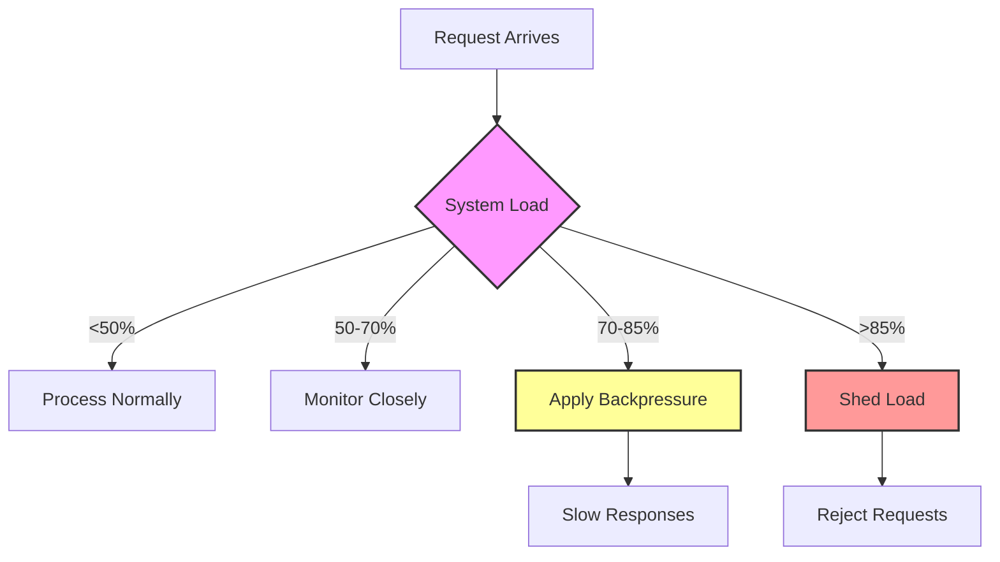

<!-- Navigation -->
[Home](/) → [Part I: Axioms](/part1-axioms/) → [Axiom 2](index.md) → **Axiom 2: Finite Capacity**

# Axiom 2: Finite Capacity

> **Learning Objective**: Every resource has a breaking point; find it before production does.


## The Constraint

### The Fundamental Limit

**Every resource has a maximum throughput or storage limit**

This constraint emerges from **Thermodynamics: energy and matter are finite**. No amount of engineering can violate this fundamental principle—we can only work within its boundaries.

### Physics Foundation

The practical manifestation of this constraint:
- **Theoretical basis**: Thermodynamics: energy and matter are finite
- **Practical limit**: CPU cycles, memory bytes, network bandwidth, disk IOPS
- **Real-world impact**: Systems hit hard limits and degrade non-linearly beyond 70-80% utilization

### Why This Constraint Exists

Unlike software bugs or implementation details, this is a fundamental law of our universe. Understanding this constraint helps us:

1. **Set realistic expectations** - Know what's physically impossible
2. **Make better trade-offs** - Optimize within the possible
3. **Design robust systems** - Work with the constraint, not against it
4. **Avoid false solutions** - Don't chase impossible optimizations

!!! warning "Common Misconception"
    This constraint cannot be "solved" or "eliminated"—only managed and optimized within its boundaries.

---

## Why It Matters

Systems hit hard limits and degrade non-linearly beyond 70-80% utilization

### Business Impact

This constraint directly affects:
- **User experience**: Performance and reliability
- **Development velocity**: Time-to-market and maintenance
- **Operational costs**: Infrastructure and support
- **Competitive advantage**: System capabilities and scalability

### Technical Implications

Every engineering decision must account for this constraint:
- **Architecture patterns**: Choose designs that work with the constraint
- **Technology selection**: Pick tools that optimize within the boundaries
- **Performance optimization**: Focus on what's actually improvable
- **Monitoring and alerting**: Track metrics related to the constraint

---

## 🚫 Common Misconceptions

Many engineers hold false beliefs about this constraint:

1. **"Cloud resources are infinite"**
   - This violates the fundamental constraint
   - Reality: Cloud providers have finite capacity and you pay for what you use

2. **"Adding more servers always improves performance"**
   - This violates the fundamental constraint
   - Reality: Coordination overhead can make more servers slower

3. **"Capacity problems can be solved by better algorithms alone"**
   - This violates the fundamental constraint
   - Reality: Better algorithms help but can't exceed hardware limits


### Reality Check

The constraint is absolute—these misconceptions arise from:
- **Wishful thinking**: Hoping engineering can overcome physics
- **Local optimization**: Solving one problem while creating others
- **Vendor marketing**: Oversimplified claims about complex systems
- **Incomplete understanding**: Not seeing the full system implications

---

## Practical Implications

How this constraint shapes real system design:

1. **Monitor utilization AND saturation metrics**
2. **Implement backpressure and load shedding**
3. **Plan capacity with safety margins (70% rule)**
4. **Design for graceful degradation**


### Engineering Guidelines

When designing systems, always:
- **Start with the constraint**: Acknowledge it in your architecture
- **Measure the constraint**: Monitor relevant metrics
- **Design around the constraint**: Use patterns that work with it
- **Communicate the constraint**: Help stakeholders understand limitations

### Success Patterns

Teams that respect this constraint:
- Set realistic performance goals
- Choose appropriate architectural patterns
- Invest in proper monitoring and observability
- Make trade-offs explicit and data-driven

---


## Quick Links

- **Navigation**: [Examples](examples.md) • [Exercises](exercises.md)
- **Related Patterns**: [Bulkhead](/patterns/bulkhead) • [Load Shedding](/patterns/load-shedding) • [Auto-scaling](/patterns/auto-scaling)
- **Case Studies**: [Amazon DynamoDB](/case-studies/amazon-dynamo)
- **Quantitative**: [Capacity Planning](/quantitative/capacity-planning) • [Queueing Theory](/quantitative/queueing-models)

---

## Level 1: Intuition (Start Here) 🌱

### The Elevator Metaphor

Imagine an office building elevator:
- **Capacity**: 10 people or 2,000 lbs
- **What happens with 11 people?** Someone waits
- **What happens with 15 people trying?** Chaos, delays, frustration
- **What happens at 100 people?** System breakdown

**Your servers are elevators.** They have:
- Maximum passengers (connections)
- Weight limits (memory)
- Speed limits (CPU)
- Door cycle time (I/O)

### Real-World Analogy: Highway Traffic

```text
Traffic Flow vs Cars on Road:

Flow │     ╱──────── Optimal flow (~70% capacity)
(MPH)│    ╱ \
  60 │   ╱   \
  40 │  ╱     \_______ Congestion collapse
  20 │ ╱              \___
   0 └─────────────────────────
     0%    70%    100%  120%
           Capacity Usage
```

**Key Insight**: Systems don't slow down linearly—they hit a cliff.

### Your First Capacity Experiment

```python
# capacity_demo.py - See what "full" looks like
import time
import threading

def slow_function():
    """Simulates work that takes 1 second"""
    time.sleep(1)
    return "done"

# Test 1: Sequential (baseline)
start = time.time()
for i in range(10):
    slow_function()
print(f"Sequential: {time.time() - start:.1f} seconds")
# Expected: ~10 seconds

# Test 2: Parallel with reasonable threads
start = time.time()
threads = []
for i in range(10):
    t = threading.Thread(target=slow_function)
    t.start()
    threads.append(t)
for t in threads:
    t.join()
print(f"10 threads: {time.time() - start:.1f} seconds")
# Expected: ~1 second (10x speedup!)

# Test 3: Too many threads
start = time.time()
threads = []
for i in range(1000):  # Way too many!
    t = threading.Thread(target=slow_function)
    t.start()
    threads.append(t)
for t in threads:
    t.join()
print(f"1000 threads: {time.time() - start:.1f} seconds")
# Expected: Much slower due to overhead!
```

### The Beginner's Capacity Checklist

For every service you build, know these numbers:
1. **How many requests can it handle?** (requests/second)
2. **How much memory does each request use?** (MB)
3. **How many database connections do you have?** (pool size)
4. **What's your bandwidth limit?** (Mbps)
5. **How long to get more capacity?** (minutes? hours?)

---

## Level 2: Foundation (Understand Why) 🌿

### Core Principle: Resources Are Finite

### The Thermodynamics Angle

> "Just as energy cannot be created or destroyed, computational capacity cannot be materialized from nothing. It can only be moved (migration), transformed (optimization), or purchased (scaling)."

Capacity follows conservation laws:
1. **Conservation**: Total work = Σ(CPU + Memory + I/O)
2. **Transformation**: Trade memory for CPU (caching)
3. **Distribution**: Spread load across machines
4. **Limits**: Speed of light constrains coordination

### Failure Vignette: Black Friday Database Meltdown

**Company**: Major Retailer, $2B Revenue
**Date**: Black Friday 2021, 6:00 AM EST
**Impact**: $50M lost sales

**The Timeline**:
```dockerfile
06:00 - Marketing sends "50% off everything" email
06:01 - 2M users click simultaneously
06:02 - API servers scale from 100 to 1,000 pods
06:03 - Each pod opens 10 connections to DB
06:04 - Database connection limit: 5,000
06:05 - 10,000 connections attempted
06:06 - Database rejects new connections
06:07 - Health checks fail, cascading restarts
06:15 - Site completely down
08:00 - Manual intervention restores service
```

**Root Cause**: Scaled compute, forgot DB connections are finite

**Fix**: Connection pooling, admission control, backpressure

**Lesson**: Every resource has a limit. Find yours before your customers do.

## The Capacity Staircase



## Decision Framework

!!! tip "🎯 Capacity Decision Framework"
    **When to Scale Up:**
    - Sustained utilization > 70% for 15+ minutes
    - Response time degradation > 20%
    - Queue depth growing unbounded
    - Error rate increasing

    **When to Scale Out:**
    - Single resource maxed (CPU, memory, network)
    - Need geographic distribution
    - Require fault isolation
    - Cost-effective at scale

    **When to Optimize:**
    - Scaling costs exceed business value
    - Hit fundamental limits (speed of light)
    - Complexity overwhelming team
    - Diminishing returns from hardware

## Capacity Arithmetic

```python
# Little's Law in practice
def calculate_capacity_needs(avg_request_rate, avg_response_time):
    """
    Little's Law: L = λW
    L = number of requests in system
    λ = arrival rate (requests/second)
    W = time in system (seconds)
    """
    concurrent_requests = avg_request_rate * avg_response_time
    
# Add safety margins
    peak_factor = 2.0  # Handle 2x average
    variance_factor = 1.5  # Handle variance
    
    required_capacity = concurrent_requests * peak_factor * variance_factor
    
    return {
        'average_load': concurrent_requests,
        'peak_capacity_needed': required_capacity,
        'servers_needed': math.ceil(required_capacity / server_capacity)
    }
```

## Try This: Find Your Breaking Point (DO NOT RUN IN PROD!)

```bash
# Terminal 1: Start a simple server
python -m http.server 8000

# Terminal 2: Find the limit
ab -n 10000 -c 100 http://localhost:8000/
# Watch for the cliff where latency spikes

# Terminal 3: Monitor resources
htop  # Watch CPU, memory
iftop # Watch network
iotop # Watch disk
```

**What you'll learn**: Systems don't degrade gracefully—they hit a cliff.

## Real Capacity Limits (2024)

<div class="law-box">
<h3>📊 Real-World Capacity Limits</h3>

**AWS EC2 Limits (2024):**
- Network: 100 Gbps (c5n.18xlarge)
- Memory: 24 TB (x1e.32xlarge) 
- Storage: 64,000 IOPS (io2)
- Connections: ~65K per IP

**Database Limits:**
- PostgreSQL: 32 TB table size
- MySQL: 65,535 columns per table
- Redis: 512 MB per key
- Cassandra: 2 billion cells per partition

**API Limits:**
- GitHub: 5,000 requests/hour
- Twitter: 300 posts/3 hours
- Stripe: 100 requests/second
- AWS API: Varies by service
</div>

## Counter-Intuitive Truth

!!! quote "💭 The 70% Rule"
    Systems behave predictably up to ~70% utilization, then chaos emerges:

    - **0-50%**: Linear performance, predictable behavior
    - **50-70%**: Slight degradation, manageable variance
    - **70-85%**: Non-linear degradation, queuing effects dominate
    - **85-100%**: Catastrophic failure, thrashing, deadlocks

    **Why?** Queuing theory shows wait time approaches infinity as utilization approaches 100%.

## Worked Example: Video Streaming

```python
# Calculate bandwidth needs for video streaming service
def video_streaming_capacity(users, quality_distribution):
    """
    Real example from a streaming platform
    """
    bitrates = {
        '4k': 25_000_000,   # 25 Mbps
        '1080p': 8_000_000,  # 8 Mbps
        '720p': 5_000_000,   # 5 Mbps
        '480p': 2_500_000    # 2.5 Mbps
    }
    
    total_bandwidth = 0
    for quality, percentage in quality_distribution.items():
        users_at_quality = users * percentage
        bandwidth = users_at_quality * bitrates[quality]
        total_bandwidth += bandwidth
    
# Add overhead
    protocol_overhead = 1.2  # TCP/IP headers, retransmits
    peak_factor = 1.5       # Evening peak
    
    required_bandwidth = total_bandwidth * protocol_overhead * peak_factor
    
# Calculate infrastructure needs
    cdn_node_capacity = 40_000_000_000  # 40 Gbps per node
    nodes_needed = math.ceil(required_bandwidth / cdn_node_capacity)
    
    return {
        'average_bandwidth_gbps': total_bandwidth / 1_000_000_000,
        'peak_bandwidth_gbps': required_bandwidth / 1_000_000_000,
        'cdn_nodes_needed': nodes_needed,
        'monthly_cost_estimate': nodes_needed * 15000  # $15k/node/month
    }

# Example: 1M concurrent viewers
result = video_streaming_capacity(1_000_000, {
    '4k': 0.15,
    '1080p': 0.50,
    '720p': 0.25,
    '480p': 0.10
})
print(f"Need {result['cdn_nodes_needed']} CDN nodes for {result['peak_bandwidth_gbps']:.0f} Gbps")
```

## Level 3: Deep Dive (Master the Patterns) 🌳

### Capacity Arithmetic: The Math That Matters

### The Backpressure Pattern: Your Safety Valve

```python
import asyncio
import time
from collections import deque
from typing import Optional, Callable

class BackpressureQueue:
    """Production-grade queue with multiple backpressure strategies"""

    def __init__(self,
                 max_size: int = 1000,
                 high_watermark: float = 0.8,
                 low_watermark: float = 0.6):
        self.queue = deque()
        self.max_size = max_size
        self.high_watermark = high_watermark
        self.low_watermark = low_watermark
        self.is_accepting = True
        self.waiters = []  # Waiting consumers
        self.metrics = {
            'accepted': 0,
            'rejected': 0,
            'processed': 0,
            'current_size': 0
        }

    async def put(self, item, timeout: Optional[float] = None):
        """Add item with backpressure"""
# Fast path: immediate reject if over capacity
        if not self.is_accepting and len(self.queue) > self.max_size:
            self.metrics['rejected'] += 1
            raise QueueFullError(f"Queue full: {len(self.queue)}/{self.max_size}")

# Slow path: wait for space
        start_time = time.time()
        while len(self.queue) >= self.max_size:
            if timeout and (time.time() - start_time) > timeout:
                self.metrics['rejected'] += 1
                raise TimeoutError("Timeout waiting for queue space")

            await asyncio.sleep(0.01)  # Yield to consumers

        self.queue.append(item)
        self.metrics['accepted'] += 1
        self.metrics['current_size'] = len(self.queue)

# Update acceptance state
        self._update_acceptance_state()

# Wake up waiters
        if self.waiters:
            self.waiters.pop(0).set()

    async def get(self) -> Optional[any]:
        """Get item from queue"""
        if not self.queue:
# Wait for item
            event = asyncio.Event()
            self.waiters.append(event)
            await event.wait()

        if self.queue:
            item = self.queue.popleft()
            self.metrics['processed'] += 1
            self.metrics['current_size'] = len(self.queue)
            self._update_acceptance_state()
            return item

        return None

    def _update_acceptance_state(self):
        """Hysteresis to prevent flapping"""
        queue_ratio = len(self.queue) / self.max_size

        if queue_ratio >= self.high_watermark:
            self.is_accepting = False
        elif queue_ratio <= self.low_watermark:
            self.is_accepting = True
# Between watermarks: maintain current state

    def get_pressure(self) -> float:
        """Get current backpressure level (0-1)"""
        return len(self.queue) / self.max_size

# Advanced: Adaptive backpressure based on consumer speed
class AdaptiveBackpressureQueue(BackpressureQueue):
    def __init__(self, **kwargs):
        super().__init__(**kwargs)
        self.consumer_rates = deque(maxlen=100)
        self.last_get_time = time.time()

    async def get(self):
# Track consumer rate
        now = time.time()
        if self.last_get_time:
            interval = now - self.last_get_time
            rate = 1.0 / interval if interval > 0 else float('inf')
            self.consumer_rates.append(rate)
        self.last_get_time = now

        return await super().get()

    def get_sustainable_input_rate(self) -> float:
        """Calculate sustainable input rate based on consumer speed"""
        if not self.consumer_rates:
            return float('inf')

# Use P50 of consumer rate as sustainable rate
        rates = sorted(self.consumer_rates)
        p50_index = len(rates) // 2
        consumer_p50 = rates[p50_index]

# Apply safety margin
        return consumer_p50 * 0.8
```

### Common Anti-Patterns (And How to Fix Them)

!!! danger "🚫 Anti-Pattern Gallery"
    **1. The Infinite Thread Pool**
    ```java
    // DON'T: Unbounded thread creation
    for (Request req : requests) {
        new Thread(() -> process(req)).start();  // 💥 OOM
    }

    // DO: Bounded thread pool
    ExecutorService executor = Executors.newFixedThreadPool(100);
    for (Request req : requests) {
        executor.submit(() -> process(req));
    }
    ```

    **2. The Connection Leak**
    ```python
    # DON'T: Forget to close connections
    def query_db(sql):
        conn = db.connect()  # Leaks on exception
        return conn.execute(sql)

    # DO: Always cleanup
    def query_db(sql):
        with db.connect() as conn:  # Auto-closes
            return conn.execute(sql)
    ```

    **3. The Retry Storm**
    ```javascript
    // DON'T: Immediate retry
    async function callAPI() {
        while (true) {
            try {
                return await fetch('/api');
            } catch (e) {
                // Hammers the server! 💥
            }
        }
    }

    // DO: Exponential backoff
    async function callAPI() {
        for (let i = 0; i < 5; i++) {
            try {
                return await fetch('/api');
            } catch (e) {
                await sleep(Math.pow(2, i) * 1000);
            }
        }
        throw new Error('API unavailable');
    }
    ```

## Level 4: Expert (Production Patterns) 🌲

### Real-World Case Study: The WhatsApp 900M User Architecture

```erlang
%% WhatsApp's approach to extreme capacity (simplified)
%% 900M users, 50 engineers, minimal servers

%% Key insight: Optimize per-connection memory
-module(connection_handler).
-behaviour(gen_server).

-record(state, {
    socket :: port(),
    user_id :: binary(),
    last_seen :: integer(),
    %% Critical: Store minimal state per connection
    %% Each field costs memory × 900M users!
}).

%% Memory optimization techniques:
%% 1. Binary sharing for common strings
%% 2. Hibernate processes when idle
%% 3. Compressed ETS tables for presence
%% 4. Off-heap message passing

handle_cast(hibernate, State) ->
    %% Reduce memory from 300KB to 1KB per connection
    {noreply, State, hibernate};

handle_info({tcp, Socket, Data}, State) ->
    %% Process inline, no queuing
    case process_message(Data) of
        {forward, UserId, Message} ->
            %% Direct socket-to-socket, no intermediate queues
            send_to_user(UserId, Message),
            {noreply, State};
        {store_offline, UserId, Message} ->
            %% Minimal offline storage
            store_minimal(UserId, Message),
            {noreply, State}
    end.

%% Result: 2M connections per server (typical: 10-50K)
```
### Advanced Capacity Patterns

#### 1. Adaptive Load Shedding
```python
def adaptive_load_shed(request, system_load):
    """
    Intelligently drop load based on request value
    """
# Prioritize by business value
    priorities = {
        'payment': 1.0,      # Never drop
        'login': 0.9,        # Rarely drop
        'search': 0.5,       # Drop under load
        'analytics': 0.1     # First to go
    }

    request_priority = priorities.get(request.type, 0.5)
    drop_probability = max(0, system_load - request_priority)

    if random.random() < drop_probability:
        raise ServiceUnavailable("System overloaded")

    return process_request(request)
```
#### 2. Resource Pools with Stealing
```python
class ResourcePoolWithStealing:
    """Advanced connection pool that 'steals' idle connections"""

    def __init__(self, min_size=10, max_size=100):
        self.pools = {}  # Per-service pools
        self.global_max = max_size
        self.steal_after_idle = 30  # seconds

    def get_connection(self, service):
# Try local pool first
        if service in self.pools:
            conn = self.pools[service].try_get()
            if conn:
                return conn

# Try stealing from other services
        for other_service, pool in self.pools.items():
            if other_service == service:
                continue

            idle_conn = pool.steal_idle_connection(self.steal_after_idle)
            if idle_conn:
# Reconfigure for new service
                idle_conn.reconfigure(service)
                return idle_conn

# Last resort: create new if under global limit
        if self.total_connections() < self.global_max:
            return self.create_new_connection(service)

        raise NoConnectionsAvailable()
```
### Measurement: Production Monitoring

```python
# Real capacity monitoring that prevents incidents

class CapacityMonitor:
    def __init__(self):
        self.thresholds = {
            'cpu': {'warning': 70, 'critical': 85},
            'memory': {'warning': 80, 'critical': 90},
            'connections': {'warning': 75, 'critical': 90},
            'disk_io': {'warning': 80, 'critical': 95}
        }
        self.predictions = {}  # ML-based predictions

    def check_capacity_health(self):
        alerts = []

        for resource, usage in self.get_current_usage().items():
# Current state
            if usage > self.thresholds[resource]['critical']:
                alerts.append(CriticalAlert(f"{resource} at {usage}%"))
            elif usage > self.thresholds[resource]['warning']:
                alerts.append(WarningAlert(f"{resource} at {usage}%"))

# Predictive (ML model output)
            predicted = self.predictions.get(resource, {})
            if predicted.get('hits_critical_in_minutes', float('inf')) < 30:
                alerts.append(PredictiveAlert(
                    f"{resource} will hit critical in {predicted['hits_critical_in_minutes']} minutes"
                ))

        return alerts

    def get_time_to_capacity(self, resource):
        """When will we run out?"""
        current = self.get_current_usage()[resource]
        growth_rate = self.calculate_growth_rate(resource)

        if growth_rate <= 0:
            return float('inf')

        time_to_limit = (100 - current) / growth_rate
        return time_to_limit
```
---

## Level 5: Mastery (Scale to Infinity) 🌴

### The YouTube Problem: Infinite Scale Architecture

```python
"""
YouTube's Challenge: 500 hours of video uploaded per minute
- Storage: 1 TB/minute (assuming 4K)
- Processing: Encode to 10 formats
- Distribution: Serve to 2B users
- Cost: Minimize while maintaining quality
"""

class InfiniteScaleVideoSystem:
    """
    Patterns from YouTube's architecture (simplified)
    """

    def __init__(self):
        self.upload_clusters = []  # Geographically distributed
        self.encoding_tiers = [
            'hot',     # GPU clusters for popular content
            'warm',    # CPU clusters for moderate content
            'cold'     # Spot instances for long-tail
        ]
        self.storage_hierarchy = [
            'ssd_cache',      # Last 24 hours
            'hdd_regional',   # Last 30 days
            'tape_archive'    # Everything else
        ]

    def handle_upload(self, video_stream, metadata):
# Step 1: Determine handling tier based on creator stats
        creator_tier = self.classify_creator(metadata['creator_id'])

# Step 2: Distributed upload with early termination
        closest_cluster = self.find_closest_cluster(metadata['source_ip'])
        upload_id = self.start_distributed_upload(
            video_stream,
            closest_cluster,
            replica_count=self.get_replica_count(creator_tier)
        )

# Step 3: Predictive encoding
        predicted_views = self.ml_predict_popularity(
            metadata['title'],
            metadata['creator_id'],
            metadata['category']
        )

        encoding_priority = self.calculate_encoding_priority(
            predicted_views,
            creator_tier
        )

# Step 4: Adaptive quality ladder
        quality_ladder = self.generate_quality_ladder(
            predicted_views,
            metadata['source_resolution']
        )

# Example: Unpopular video might only get 360p, 720p
# Popular video gets full ladder: 144p to 4K

        self.queue_encoding_job(
            upload_id,
            quality_ladder,
            encoding_priority
        )

        return upload_id

    def serve_video(self, video_id, user_context):
# Multi-tier serving strategy

# 1. Edge cache (city-level)
        edge_url = self.check_edge_cache(video_id, user_context['city'])
        if edge_url:
            return edge_url

# 2. Regional cache (country-level)
        regional_url = self.check_regional_cache(
            video_id,
            user_context['country']
        )
        if regional_url:
# Async populate edge for next time
            self.async_populate_edge(video_id, user_context['city'])
            return regional_url

# 3. Origin fetch (last resort)
        origin_url = self.fetch_from_origin(video_id)

# Async populate caches based on access pattern
        self.ml_decide_cache_population(
            video_id,
            user_context,
            access_count=self.get_access_count(video_id)
        )

        return origin_url

# The magic: Capacity planning at scale
class CapacityPlanningML:
    """
    ML-driven capacity planning that learns from:
    - Historical patterns
    - Viral content detection
    - Geographic trends
    - Seasonal variations
    """

    def predict_capacity_needs(self, timeframe_hours=24):
        features = self.extract_features()

# Features include:
# - Time of day/week/year
# - Recent viral videos
# - Major events calendar
# - Geographic activity patterns
# - Network capacity utilization

        predictions = {}

        for resource in ['bandwidth', 'storage', 'compute']:
            model = self.models[resource]

# Predict capacity needs
            predicted_usage = model.predict(features)

# Add safety margins based on prediction confidence
            confidence = model.predict_confidence(features)
            safety_margin = 1 + (1 - confidence) * 0.5  # Up to 50% margin

            predictions[resource] = {
                'predicted': predicted_usage,
                'recommended': predicted_usage * safety_margin,
                'confidence': confidence,
                'actions': self.generate_scaling_actions(
                    resource,
                    predicted_usage * safety_margin
                )
            }

        return predictions

# Theoretical limits: Shannon's Law applied to distributed systems
class TheoreticalCapacityLimits:
    """
    Information theory meets distributed systems
    """

    @staticmethod
    def calculate_coordination_overhead(nodes):
        """
        Coordination overhead grows as O(n²) for consensus
        O(n log n) for hierarchical
        O(n) for eventual consistency
        """
        consensus_overhead = nodes ** 2
        hierarchical_overhead = nodes * math.log(nodes)
        eventual_overhead = nodes

        return {
            'consensus': consensus_overhead,
            'hierarchical': hierarchical_overhead,
            'eventual': eventual_overhead
        }

    @staticmethod
    def calculate_theoretical_throughput(nodes, consistency_model):
        """
        Theoretical maximum throughput given physics constraints
        """
# Single node throughput (packets/sec)
        single_node = 10_000_000  # 10M pps for modern NICs

# Coordination overhead
        if consistency_model == 'strong':
# Consensus requires majority coordination
            overhead = 0.5 + (0.5 / nodes)  # Approaches 50% as n→∞
            return nodes * single_node * (1 - overhead)

        elif consistency_model == 'eventual':
# Gossip/anti-entropy overhead
            overhead = math.log(nodes) / nodes  # Logarithmic
            return nodes * single_node * (1 - overhead)

        elif consistency_model == 'none':
# Perfect parallelism (cache, CDN)
            return nodes * single_node
```
### War Story: Stack Overflow's 9 Servers

```csharp
// Stack Overflow serves 100M+ developers with 9 web servers
// Secret: Aggressive caching and denormalization

public class ExtremeOptimizationPatterns
{
    // Pattern 1: Precompute everything possible
    public class QuestionView
    {
        // Denormalized for single query
        public int Id { get; set; }
        public string Title { get; set; }
        public string Body { get; set; }
        public int ViewCount { get; set; }
        public int Score { get; set; }
        public string OwnerName { get; set; }  // Denormalized
        public int OwnerReputation { get; set; }  // Denormalized
        public List<string> Tags { get; set; }  // Denormalized
        public DateTime LastActivityDate { get; set; }

        // Cached computed fields
        public string CachedHtml { get; set; }  // Pre-rendered
        public string CachedMarkdown { get; set; }
    }

    // Pattern 2: Memory-mapped files for speed
    public class TagEngine
    {
        private readonly MemoryMappedFile tagIndex;

        public List<int> GetQuestionsByTag(string tag)
        {
            // Direct memory access, no deserialization
            var accessor = tagIndex.CreateViewAccessor();
            var offset = GetTagOffset(tag);

            // Read directly from memory-mapped structure
            var count = accessor.ReadInt32(offset);
            var questions = new List<int>(count);

            for (int i = 0; i < count; i++)
            {
                questions.Add(accessor.ReadInt32(offset + 4 + i * 4));
            }

            return questions;
        }
    }

    // Pattern 3: Eliminate allocations
    public struct VoteResult  // Struct, not class
    {
        public int NewScore;
        public bool Success;
        public VoteError Error;
    }

    public VoteResult CastVote(int postId, int userId, VoteType type)
    {
        // Stack-allocated, no GC pressure
        VoteResult result;

        // Direct SQL, no ORM overhead
        using (var conn = GetConnection())
        using (var cmd = new SqlCommand("Vote_Cast", conn))
        {
            cmd.CommandType = CommandType.StoredProcedure;
            cmd.Parameters.Add("@PostId", SqlDbType.Int).Value = postId;
            cmd.Parameters.Add("@UserId", SqlDbType.Int).Value = userId;
            cmd.Parameters.Add("@VoteType", SqlDbType.TinyInt).Value = (byte)type;

            using (var reader = cmd.ExecuteReader())
            {
                reader.Read();
                result.Success = reader.GetBoolean(0);
                result.NewScore = reader.GetInt32(1);
                result.Error = (VoteError)reader.GetByte(2);
            }
        }

        return result;  // No allocations!
    }
}
```
### The Capacity Optimization Cookbook

```python
# Production-tested optimization patterns

class CapacityOptimizationPatterns:
    """
    Patterns that have saved millions in infrastructure costs
    """

    @staticmethod
    def connection_pooling_strategy(expected_qps, query_time_ms):
        """
        Right-size connection pools mathematically
        """
# Little's Law: L = λW
# L = number of connections needed
# λ = arrival rate (QPS)
# W = time in system (query time)

        connections_needed = expected_qps * (query_time_ms / 1000.0)

# Add safety margin for variance
        variance_factor = 1.5

# Add burst capacity
        burst_factor = 2.0

        recommended_pool_size = int(
            connections_needed * variance_factor * burst_factor
        )

        return {
            'minimum': int(connections_needed),
            'recommended': recommended_pool_size,
            'maximum': recommended_pool_size * 2,
            'reasoning': f"Little's Law: {expected_qps} QPS × {query_time_ms}ms = {connections_needed:.1f} connections"
        }

    @staticmethod
    def memory_optimization_checklist():
        """
        Reduce memory usage by 10x with these patterns
        """
        return [
# Data structure optimization
            "Use arrays instead of objects when possible",
            "Intern strings (Java) or use string pools",
            "Pack booleans into bitfields",
            "Use primitive types, not boxed types",

# Caching optimization
            "Use off-heap caches (memory-mapped files)",
            "Implement cache admission policies (TinyLFU)",
            "Use compressed caches (Snappy, LZ4)",
            "Share immutable objects across requests",

# GC optimization
            "Use object pools for high-frequency allocations",
            "Prefer stack allocation (value types)",
            "Implement zero-copy patterns",
            "Use memory regions/arenas",

# Protocol optimization
            "Use binary protocols, not text (protobuf)",
            "Enable compression (gzip, brotli)",
            "Batch operations to amortize overhead",
            "Use column-oriented formats for analytics"
        ]

    @staticmethod
    def infinity_scale_architecture():
        """
        Patterns for systems with no upper bound
        """
        return {
            'storage': [
                "Content-addressed storage (deduplication)",
                "Hierarchical storage (hot/warm/cold)",
                "Erasure coding instead of replication",
                "Peer-to-peer for long-tail content"
            ],
            'compute': [
                "Function-as-a-Service for elastic scale",
                "Edge computing for geographic distribution",
                "GPU/TPU for parallel workloads",
                "Spot instances for batch processing"
            ],
            'network': [
                "Anycast for geographic load balancing",
                "QUIC for improved congestion control",
                "Multipath TCP for bandwidth aggregation",
                "P2P protocols for content distribution"
            ]
        }
```
## Summary: Key Takeaways by Level

### 🌱 Beginner
1. **Resources are limited** - Know your limits
2. **Systems hit cliffs** - Not gradual degradation
3. **Leave headroom** - 70% is the new 100%

### 🌿 Intermediate
1. **Backpressure is essential** - Fail fast and explicitly
2. **Monitor utilization AND saturation** - Both matter
3. **Capacity is your weakest link** - One bottleneck ruins all

### 🌳 Advanced
1. **Steal and share resources** - Dynamic > static allocation
2. **Predict, don't just react** - ML for capacity planning
3. **Business-aware shedding** - Drop low-value work first

### 🌲 Expert
1. **Theoretical limits matter** - Information theory applies
2. **Denormalize for capacity** - Space is cheaper than time
3. **Hierarchy beats flat** - Caching layers multiply capacity

### 🌴 Master
1. **Infinity requires compromise** - CAP theorem always wins
2. **Cost is a capacity limit** - Optimize for unit economics
3. **Human capacity matters most** - 9 servers beats 9000 if manageable

## Quick Reference Card

!!! tip "📋 Capacity Management Cheat Sheet"
    **Key Metrics to Monitor:**
    ```yaml
    # System Metrics
    - CPU: utilization, saturation, errors
    - Memory: used, available, swap usage
    - Disk: IOPS, throughput, latency
    - Network: bandwidth, packet loss, errors

    # Application Metrics
    - Request rate (QPS)
    - Response time (P50, P95, P99)
    - Error rate
    - Queue depth
    - Connection pool usage
    ```

    **Capacity Planning Formula:**
    ```text
    Required Capacity = 
        Current Load × 
        Growth Factor × 
        Peak Factor × 
        Safety Margin
    ```

    **Quick Actions When Near Capacity:**
    1. **Immediate**: Enable rate limiting
    2. **Quick**: Scale horizontally (add nodes)
    3. **Medium**: Optimize hot paths
    4. **Long**: Re-architect bottlenecks

    **Remember:**
    - Monitor at 50%, alert at 70%, panic at 85%
    - Capacity problems are easier to prevent than fix
    - The last 20% of capacity costs 80% of performance

---

**Next**: [Axiom 3: Failure →](/part1-axioms/archive-old-8-axiom-structure/axiom3-failure/)

*"The question is not IF you'll hit capacity limits, but WHEN."*

---

## Related Concepts

### Pillars Building on This Axiom
- [Work Distribution](/part2-pillars/work/) - Distributing work across finite resources efficiently
- [State Management](/part2-pillars/state/) - Managing state within memory and storage constraints
- [Control & Ordering](/part2-pillars/control/) - Controlling flow to prevent resource exhaustion
- [Intelligence & Learning](/part2-pillars/intelligence/) - ML-based capacity prediction and optimization

### Patterns Addressing Capacity Challenges
- [Auto-scaling](/patterns/auto-scaling) - Dynamically adjust resources based on demand
- [Load Balancing](/patterns/load-balancing) - Distribute load across available capacity
- [Sharding](/patterns/sharding) - Partition data to scale beyond single node limits
- [Bulkhead](/patterns/bulkhead) - Isolate resources to prevent total exhaustion
- [Load Shedding](/patterns/load-shedding) - Gracefully drop load when at capacity
- [Backpressure](/patterns/backpressure) - Signal upstream when approaching limits
- [Circuit Breaker](/patterns/circuit-breaker) - Stop overwhelming already-saturated resources

### Case Studies Demonstrating Capacity Management
- [Amazon DynamoDB](/case-studies/amazon-dynamo) - Predictable performance at scale through capacity management
- [Twitter Timeline](/case-studies/twitter-timeline) - Handling massive write amplification
- [Netflix Streaming](/case-studies/netflix-streaming) - Global capacity planning for video delivery

### Other Axioms That Interact
- [Axiom 1: Latency](/part1-axioms/archive-old-8-axiom-structure/axiom1-latency/) - Performance degrades as capacity limits are approached
- [Axiom 3: Partial Failure](/part1-axioms/archive-old-8-axiom-structure/axiom3-failure/) - Capacity exhaustion causes cascading failures
- [Axiom 4: Concurrency](/part1-axioms/archive-old-8-axiom-structure/axiom4-concurrency/) - Concurrent access to limited resources
- [Axiom 8: Economics](/part1-axioms/archive-old-8-axiom-structure/axiom8-economics/) - Cost optimization within capacity constraints

### Quantitative Tools
- [Capacity Planning Calculator](/quantitative/capacity-planning) - Interactive capacity estimation
- [Little's Law](/quantitative/littles-law) - Relationship between capacity, latency, and throughput
- [Queueing Theory](/quantitative/queueing-models) - Mathematical models for capacity and utilization
- [Scaling Laws](/quantitative/amdahl-gustafson) - How capacity scales with system size
- [Performance Testing](/quantitative/performance-testing) - Finding actual capacity limits

### Human Factors
- [SRE Practices](/part1-axioms/human-factors/sre-practices) - Managing capacity through SLOs and error budgets
- [Capacity Planning](/quantitative/capacity-planning) - Human aspects of predicting future needs
- [Incident Response](/part1-axioms/human-factors/incident-response) - Handling capacity-related outages

---

**Next**: [Examples](examples.md)

**Related**: [Auto Scaling](/patterns/auto-scaling) • [Load Balancing](/patterns/load-balancing) • [Sharding](/patterns/sharding)
