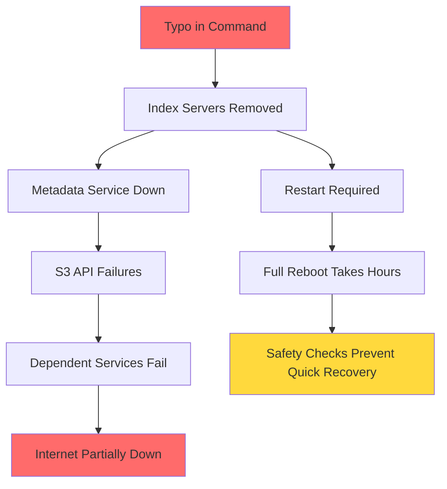

<!-- Navigation -->
[Home](/) → [Part I: Axioms](part1-axioms) → [Axiom 3](index.md) → **Partial Failure Examples**

# Axiom 3 Examples: When Systems Fail Spectacularly

## Real-World Production Disasters

### The GitHub Database Disaster (2018)

!!! danger "Split-Brain at Scale"
    **Date**: October 21, 2018  
    **Duration**: 24 hours  
    **Impact**: Degraded service for millions of developers  
    **Root Cause**: Network partition between data centers

On a seemingly normal Sunday evening, a routine maintenance operation triggered one of the most significant outages in GitHub's history¹.

#### The Timeline of Failure

```mermaid
gantt
    title GitHub Outage Timeline (October 21-22, 2018)
    dateFormat HH:mm
    axisFormat %H:%M
    
    section Events
    Network maintenance starts          :22:52, 1m
    Connectivity loss detected          :22:53, 1m
    Split-brain occurs                  :22:54, 43s
    Orchestrator promotes secondary     :crit, 22:54, 2m
    Data inconsistency begins           :crit, 22:56, 24h
    
    section Recovery
    Issue detected                      :23:02, 5m
    Emergency response activated        :23:07, 30m
    Recovery plan developed             :23:37, 2h
    Data reconciliation begins          :01:37, 20h
    Service restored                    :21:37, 1h
```



#### What Went Wrong

1. **Network Partition**: 43-second connectivity loss between US East Coast and West Coast data centers
2. **Orchestrator Confusion**: The MySQL orchestration system couldn't reach the primary cluster
3. **Wrong Promotion**: Secondary (West Coast) cluster was promoted to primary
4. **Split Brain**: Both clusters accepting writes simultaneously
5. **Data Divergence**: 1203 write operations occurred in the "wrong" primary

#### The Code That Failed

```python
# Simplified version of what went wrong
class DatabaseOrchestrator:
    def check_primary_health(self):
        try:
# This timeout was too aggressive
            response = self.ping_primary(timeout=5)  # 5 seconds
            return response.status == "healthy"
        except TimeoutError:
# DANGER: Assuming primary is dead!
            return False
    
    def handle_primary_failure(self):
        if not self.check_primary_health():
# This happened after just 43 seconds of network issues
            self.promote_secondary_to_primary()
# Now we have two primaries!
```

#### Lessons Learned

!!! info "Key Takeaways"
    1. **Network partitions are inevitable** - Design for them
    2. **Timeouts must be carefully tuned** - Too short = false positives
    3. **Consensus is hard** - Use proven algorithms (Raft/Paxos)
    4. **Monitor for split-brain** - Detect divergence quickly
    5. **Plan for data reconciliation** - You will need it

### The AWS S3 Outage: A Typo That Broke the Internet (2017)

!!! danger "When Debugging Goes Wrong"
    **Date**: February 28, 2017  
    **Duration**: 4 hours  
    **Impact**: Major portions of the internet down  
    **Root Cause**: Typo in a debug command  
    **Cost**: Estimated $150 million in losses²

#### The Fateful Command

```bash
# What the engineer meant to type:
$ aws s3api delete-objects --bucket debug-bucket --delete "Objects=[{Key=debug-logs/*}]"

# What was actually typed (simplified):
$ aws s3api delete-objects --bucket prod-index --delete "Objects=[{Key=*}]"
# ^^^^
# Wrong bucket!
```

#### Cascading Failure Analysis



#### Services That Failed
- **Slack**: Couldn't upload files
- **Trello**: Boards wouldn't load  
- **IFTTT**: Automation stopped
- **nest**: Thermostats offline
- **Many IoT devices**: Bricked temporarily

### The Knight Capital $440M Bug (2012)

!!! danger "45 Minutes to Bankruptcy"
    **Date**: August 1, 2012  
    **Duration**: 45 minutes  
    **Loss**: $440 million  
    **Root Cause**: Incomplete deployment + reused feature flag³

#### The Perfect Storm

```python
# Simplified representation of the bug
class TradingSystem:
    def __init__(self):
        self.feature_flags = {
            "SMARS": False,  # Old 2003 test code
            "RLP": True      # New 2012 retail liquidity program
        }
    
    def process_order(self, order):
        if self.feature_flags["SMARS"]:  # This flag was accidentally reused!
# Old test code from 2003 that generated child orders
            return self.generate_test_orders(order) * 1000  # Disaster!
        elif self.feature_flags["RLP"]:
# New production code
            return self.process_retail_liquidity(order)
```

#### Deployment Failure

```yaml
# Deployment status on August 1, 2012 at 9:30 AM
Servers:
  - server1: ✅ New code deployed
  - server2: ✅ New code deployed  
  - server3: ✅ New code deployed
  - server4: ✅ New code deployed
  - server5: ✅ New code deployed
  - server6: ✅ New code deployed
  - server7: ✅ New code deployed
  - server8: ❌ OLD CODE STILL RUNNING  # The killer
```

## Code Examples: Building Resilient Systems

### Circuit Breaker Implementation

```python
import time
import threading
from enum import Enum
from collections import deque
from datetime import datetime, timedelta

class CircuitState(Enum):
    CLOSED = "closed"      # Normal operation
    OPEN = "open"          # Failing, reject requests  
    HALF_OPEN = "half_open" # Testing if service recovered

class CircuitBreaker:
    """Production-grade circuit breaker implementation"""
    
    def __init__(self, 
                 failure_threshold=5,
                 recovery_timeout=60,
                 expected_exception=Exception):
        self.failure_threshold = failure_threshold
        self.recovery_timeout = recovery_timeout
        self.expected_exception = expected_exception
        
        self.failure_count = 0
        self.last_failure_time = None
        self.state = CircuitState.CLOSED
        self._lock = threading.Lock()
        
# Ring buffer for tracking success rate
        self.results = deque(maxlen=100)
        
    def call(self, func, *args, **kwargs):
        with self._lock:
            if self.state == CircuitState.OPEN:
                if self._should_attempt_reset():
                    self.state = CircuitState.HALF_OPEN
                else:
                    raise Exception("Circuit breaker is OPEN")
        
        try:
            result = func(*args, **kwargs)
            self._on_success()
            return result
        except self.expected_exception as e:
            self._on_failure()
            raise
    
    def _should_attempt_reset(self):
        return (self.last_failure_time and 
                time.time() - self.last_failure_time >= self.recovery_timeout)
    
    def _on_success(self):
        with self._lock:
            self.failure_count = 0
            self.results.append(True)
            if self.state == CircuitState.HALF_OPEN:
                self.state = CircuitState.CLOSED
    
    def _on_failure(self):
        with self._lock:
            self.failure_count += 1
            self.last_failure_time = time.time()
            self.results.append(False)
            
            if self.failure_count >= self.failure_threshold:
                self.state = CircuitState.OPEN
    
    def get_stats(self):
        """Get circuit breaker statistics"""
        with self._lock:
            total = len(self.results)
            if total == 0:
                success_rate = 100.0
            else:
                success_rate = (sum(self.results) / total) * 100
            
            return {
                "state": self.state.value,
                "failure_count": self.failure_count,
                "success_rate": success_rate,
                "total_calls": total
            }

# Usage example
breaker = CircuitBreaker(failure_threshold=3, recovery_timeout=30)

def risky_network_call():
# Simulate API call that might fail
    import random
    if random.random() < 0.3:  # 30% failure rate
        raise requests.exceptions.Timeout("Service timeout")
    return {"status": "success"}

try:
    result = breaker.call(risky_network_call)
except Exception as e:
    print(f"Call failed: {e}")
    print(f"Circuit stats: {breaker.get_stats()}")
```

### Bulkhead Pattern: Isolating Failures

```python
import concurrent.futures
import threading
import queue
import time

class Bulkhead:
    """Thread pool isolation to prevent resource exhaustion"""
    
    def __init__(self, name, pool_size=10, queue_size=100):
        self.name = name
        self.pool_size = pool_size
        self.queue_size = queue_size
        
# Separate thread pool for this bulkhead
        self.executor = concurrent.futures.ThreadPoolExecutor(
            max_workers=pool_size,
            thread_name_prefix=f"bulkhead-{name}-"
        )
        
# Bounded queue to prevent memory exhaustion
        self.pending_tasks = queue.Queue(maxsize=queue_size)
        self.rejected_count = 0
        self.completed_count = 0
        self._lock = threading.Lock()
        
    def execute(self, fn, *args, **kwargs):
        """Execute function in isolated thread pool"""
        try:
            future = self.executor.submit(fn, *args, **kwargs)
            return future
        except queue.Full:
            with self._lock:
                self.rejected_count += 1
            raise Exception(f"Bulkhead {self.name} queue full")
    
    def execute_async(self, fn, callback, *args, **kwargs):
        """Execute with async callback"""
        def wrapped_fn():
            try:
                result = fn(*args, **kwargs)
                with self._lock:
                    self.completed_count += 1
                callback(result, None)
            except Exception as e:
                callback(None, e)
        
        return self.execute(wrapped_fn)
    
    def get_stats(self):
        with self._lock:
            return {
                "name": self.name,
                "pool_size": self.pool_size,
                "active_threads": self.executor._threads,
                "completed_tasks": self.completed_count,
                "rejected_tasks": self.rejected_count
            }

# Example: Isolating different service calls
user_service_bulkhead = Bulkhead("user-service", pool_size=20)
payment_bulkhead = Bulkhead("payment-service", pool_size=10)
analytics_bulkhead = Bulkhead("analytics", pool_size=5)

def handle_request(user_id):
# User service gets more resources
    user_future = user_service_bulkhead.execute(
        fetch_user_data, user_id
    )
    
# Payment service is critical but limited
    payment_future = payment_bulkhead.execute(
        check_payment_status, user_id
    )
    
# Analytics can fail without affecting the request
    try:
        analytics_bulkhead.execute(track_event, "page_view")
    except Exception:
        pass  # Analytics failure is non-critical
    
    return {
        "user": user_future.result(timeout=5),
        "payment": payment_future.result(timeout=10)
    }
```

### Timeout Hierarchy: Preventing Cascade

```python
import asyncio
import functools
from contextlib import asynccontextmanager

class TimeoutHierarchy:
    """Coordinate timeouts across service layers"""
    
    def __init__(self):
# Define timeout hierarchy (in seconds)
        self.timeouts = {
            "user_request": 30.0,      # Total user request timeout
            "api_gateway": 28.0,       # Gateway timeout (less than user)
            "service_call": 10.0,      # Individual service timeout
            "database_query": 5.0,     # Database timeout
            "cache_lookup": 0.1,       # Cache timeout (very fast)
            "circuit_breaker": 1.0     # Quick fail for circuit breaker
        }
        
# Validate hierarchy
        self._validate_hierarchy()
    
    def _validate_hierarchy(self):
        """Ensure timeouts follow proper hierarchy"""
        assert self.timeouts["cache_lookup"] < self.timeouts["database_query"]
        assert self.timeouts["database_query"] < self.timeouts["service_call"]
        assert self.timeouts["service_call"] < self.timeouts["api_gateway"]
        assert self.timeouts["api_gateway"] < self.timeouts["user_request"]
    
    @asynccontextmanager
    async def timeout_context(self, operation_type):
        """Context manager for timeout enforcement"""
        timeout = self.timeouts.get(operation_type, 30.0)
        
        try:
            async with asyncio.timeout(timeout):
                yield
        except asyncio.TimeoutError:
            raise TimeoutError(
                f"{operation_type} timed out after {timeout}s"
            )

# Usage Example
timeout_hierarchy = TimeoutHierarchy()

async def fetch_user_data(user_id):
# API Gateway level
    async with timeout_hierarchy.timeout_context("api_gateway"):
        
# Try cache first (very fast)
        async with timeout_hierarchy.timeout_context("cache_lookup"):
            cached = await check_cache(user_id)
            if cached:
                return cached
        
# Database query (slower)
        async with timeout_hierarchy.timeout_context("database_query"):
            user_data = await query_database(user_id)
        
# External service call (slowest)
        async with timeout_hierarchy.timeout_context("service_call"):
            enriched_data = await call_enrichment_service(user_data)
        
        return enriched_data

# Demonstrate timeout propagation
async def handle_user_request(user_id):
    try:
        async with timeout_hierarchy.timeout_context("user_request"):
            return await fetch_user_data(user_id)
    except TimeoutError as e:
# Log which layer timed out
        logger.error(f"Request failed: {e}")
        return {"error": "Request timeout", "details": str(e)}
```

### Health Check Patterns

```python
import psutil
import aiohttp
from datetime import datetime
from typing import Dict, List, Tuple

class HealthChecker:
    """Comprehensive health checking system"""
    
    def __init__(self):
        self.checks = []
        self.register_default_checks()
    
    def register_default_checks(self):
        """Register standard health checks"""
        self.add_check("cpu", self.check_cpu, critical=True)
        self.add_check("memory", self.check_memory, critical=True)
        self.add_check("disk", self.check_disk, critical=False)
        self.add_check("database", self.check_database, critical=True)
        self.add_check("cache", self.check_cache, critical=False)
        self.add_check("downstream", self.check_downstream_services, critical=False)
    
    def add_check(self, name: str, check_func, critical: bool = False):
        """Register a health check"""
        self.checks.append({
            "name": name,
            "func": check_func,
            "critical": critical
        })
    
    async def check_cpu(self) -> Tuple[bool, Dict]:
        """Check CPU usage"""
        cpu_percent = psutil.cpu_percent(interval=0.1)
        healthy = cpu_percent < 80  # Threshold at 80%
        
        return healthy, {
            "cpu_percent": cpu_percent,
            "threshold": 80,
            "status": "healthy" if healthy else "degraded"
        }
    
    async def check_memory(self) -> Tuple[bool, Dict]:
        """Check memory usage"""
        memory = psutil.virtual_memory()
        healthy = memory.percent < 90  # Threshold at 90%
        
        return healthy, {
            "memory_percent": memory.percent,
            "available_gb": memory.available / (1024**3),
            "total_gb": memory.total / (1024**3),
            "status": "healthy" if healthy else "critical"
        }
    
    async def check_database(self) -> Tuple[bool, Dict]:
        """Check database connectivity and performance"""
        start_time = time.time()
        
        try:
# Simulate database health check
            async with get_db_connection() as conn:
                result = await conn.execute("SELECT 1")
                response_time = (time.time() - start_time) * 1000
                
                healthy = response_time < 100  # 100ms threshold
                
                return healthy, {
                    "response_time_ms": response_time,
                    "status": "healthy" if healthy else "slow",
                    "connection_pool_size": conn.pool.size(),
                    "connection_pool_available": conn.pool.available()
                }
                
        except Exception as e:
            return False, {
                "status": "unhealthy",
                "error": str(e),
                "response_time_ms": (time.time() - start_time) * 1000
            }
    
    async def run_all_checks(self) -> Dict:
        """Run all registered health checks"""
        results = {
            "timestamp": datetime.utcnow().isoformat(),
            "overall_status": "healthy",
            "checks": {}
        }
        
        for check in self.checks:
            try:
                healthy, details = await check["func"]()
                results["checks"][check["name"]] = {
                    "healthy": healthy,
                    "critical": check["critical"],
                    "details": details
                }
                
# If critical check fails, overall status is unhealthy
                if not healthy and check["critical"]:
                    results["overall_status"] = "unhealthy"
                elif not healthy and results["overall_status"] == "healthy":
                    results["overall_status"] = "degraded"
                    
            except Exception as e:
                results["checks"][check["name"]] = {
                    "healthy": False,
                    "critical": check["critical"],
                    "error": str(e)
                }
                
                if check["critical"]:
                    results["overall_status"] = "unhealthy"
        
        return results

# Kubernetes-style liveness and readiness probes
class KubernetesProbes:
    def __init__(self, health_checker: HealthChecker):
        self.health_checker = health_checker
        self.startup_time = datetime.utcnow()
        self.ready = False
    
    async def liveness_probe(self) -> Tuple[int, Dict]:
        """Is the service alive? (Should Kubernetes restart it?)"""
# Only check critical components for liveness
        critical_checks = ["cpu", "memory", "database"]
        
        for check_name in critical_checks:
            check = next(c for c in self.health_checker.checks 
                        if c["name"] == check_name)
            healthy, details = await check["func"]()
            
            if not healthy:
                return 503, {
                    "status": "failing",
                    "reason": f"{check_name} check failed",
                    "details": details
                }
        
        return 200, {"status": "alive"}
    
    async def readiness_probe(self) -> Tuple[int, Dict]:
        """Is the service ready to accept traffic?"""
# Check if service has been up for at least 10 seconds
        uptime = (datetime.utcnow() - self.startup_time).total_seconds()
        if uptime < 10:
            return 503, {
                "status": "starting",
                "uptime_seconds": uptime
            }
        
# Run all health checks for readiness
        health_results = await self.health_checker.run_all_checks()
        
        if health_results["overall_status"] == "healthy":
            self.ready = True
            return 200, {"status": "ready"}
        else:
            self.ready = False
            return 503, health_results
```

## Production Patterns

### Netflix's Hystrix Pattern

```python
# Simplified version of Netflix's Hystrix pattern
class HystrixCommand:
    """Command pattern with circuit breaker, timeout, and fallback"""
    
    def __init__(self, 
                 group_key: str,
                 command_key: str,
                 run_func,
                 fallback_func=None,
                 timeout=1000,  # milliseconds
                 circuit_breaker_threshold=50,
                 circuit_breaker_sleep_window=5000):
        
        self.group_key = group_key
        self.command_key = command_key
        self.run_func = run_func
        self.fallback_func = fallback_func
        self.timeout = timeout / 1000.0  # Convert to seconds
        
# Circuit breaker per command
        self.circuit_breaker = CircuitBreaker(
            failure_threshold=circuit_breaker_threshold,
            recovery_timeout=circuit_breaker_sleep_window / 1000.0
        )
        
# Metrics
        self.metrics = {
            "success": 0,
            "failure": 0,
            "timeout": 0,
            "fallback_success": 0,
            "fallback_failure": 0,
            "circuit_open": 0
        }
    
    async def execute(self):
        """Execute command with all protections"""
        try:
# Check circuit breaker first
            if self.circuit_breaker.state == CircuitState.OPEN:
                self.metrics["circuit_open"] += 1
                return await self._fallback("Circuit breaker open")
            
# Execute with timeout
            result = await asyncio.wait_for(
                self.circuit_breaker.call(self.run_func),
                timeout=self.timeout
            )
            
            self.metrics["success"] += 1
            return result
            
        except asyncio.TimeoutError:
            self.metrics["timeout"] += 1
            return await self._fallback("Command timeout")
            
        except Exception as e:
            self.metrics["failure"] += 1
            return await self._fallback(f"Command failed: {e}")
    
    async def _fallback(self, reason: str):
        """Execute fallback logic"""
        if self.fallback_func:
            try:
                result = await self.fallback_func(reason)
                self.metrics["fallback_success"] += 1
                return result
            except Exception as e:
                self.metrics["fallback_failure"] += 1
                raise Exception(f"Fallback also failed: {e}")
        else:
            raise Exception(f"No fallback available: {reason}")

# Usage example
async def get_user_recommendations(user_id):
    """Primary function - might be slow or fail"""
    response = await recommendation_service.get_recommendations(user_id)
    return response.json()

async def get_default_recommendations(reason):
    """Fallback - return cached or default recommendations"""
    logger.warning(f"Using fallback recommendations: {reason}")
    return await cache.get(f"default_recommendations") or []

# Wrap in Hystrix command
recommendation_command = HystrixCommand(
    group_key="recommendation-service",
    command_key="get-user-recommendations",
    run_func=lambda: get_user_recommendations(user_id),
    fallback_func=get_default_recommendations,
    timeout=500,  # 500ms timeout
    circuit_breaker_threshold=10  # Open after 10 failures
)

# Execute with all protections
recommendations = await recommendation_command.execute()
```

## Key Takeaways

!!! success "Failure Handling Best Practices"
    1. **Assume Failure is Normal** - Design for failure, not against it
    2. **Fail Fast** - Don't let failures propagate slowly
    3. **Isolate Failures** - Use bulkheads to contain damage
    4. **Provide Fallbacks** - Degraded service beats no service
    5. **Monitor Everything** - You can't fix what you can't see
    6. **Test Failure Scenarios** - Chaos engineering is essential
    7. **Learn from Failures** - Every outage is a learning opportunity

---

**Previous**: [Overview](index.md) | **Next**: [Exercises](exercises.md)

**Related**: [Circuit Breaker](patterns/circuit-breaker) • [Retry Backoff](patterns/retry-backoff) • [Bulkhead](patterns/bulkhead)

## References

¹ [GitHub Engineering: October 21 post-incident analysis](https://github.blog/2018-10-30-oct21-post-incident-analysis/)

² [AWS Service Event: Summary of the Amazon S3 Service Disruption](https://aws.amazon.com/message/41926/)

³ [SEC Filing: Knight Capital Group Provides Update Regarding August 1st Disruption](https://www.sec.gov/Archives/edgar/data/1060131/000119312512346593/d398788d8k.htm)
