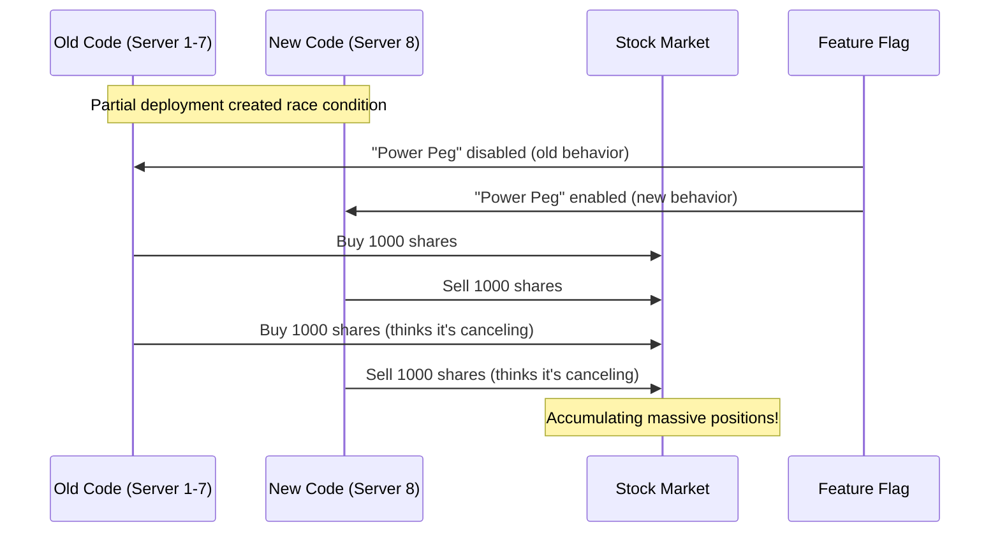
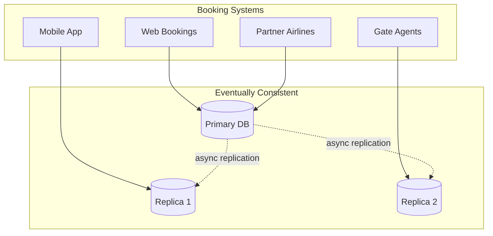
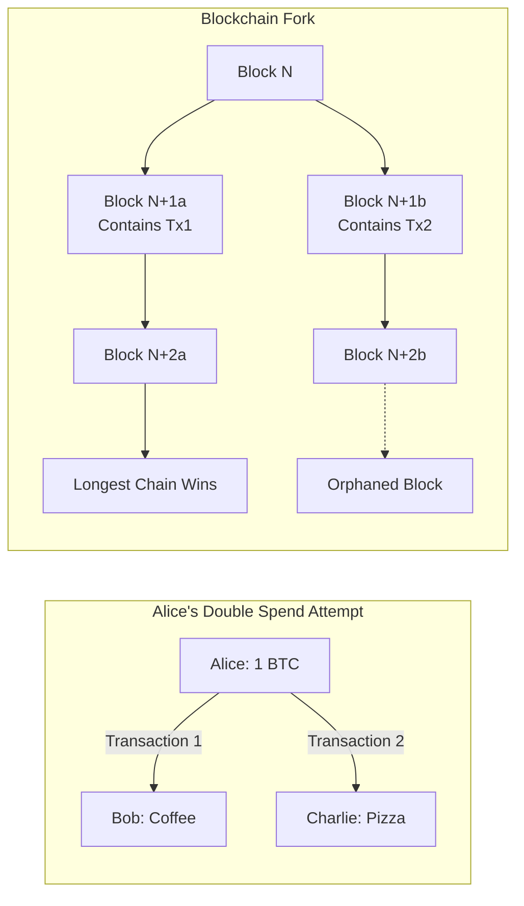
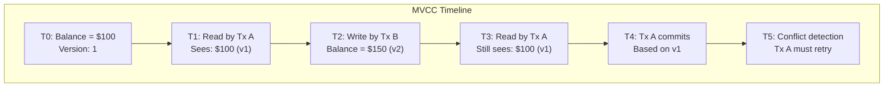

<!-- Navigation -->
[Home](/) → [Part I: Axioms](/part1-axioms/) → [Axiom 4](index.md) → **Concurrency Examples**

# Concurrency Examples

**Real-world race conditions, mind-bending paradoxes, and battle-tested solutions**

---

## 🌏 Real-World Case Studies

### Case 1: The Knight Capital Disaster (2012)

**Company**: Knight Capital Group  
**Impact**: $440 million loss in 45 minutes  
**Root Cause**: Race condition in trading system deployment

#### What Happened



#### The Race Condition

```python
# Simplified version of what went wrong
class TradingSystem:
    def __init__(self):
        self.feature_flags = {}
        self.positions = {}
        
    def process_order(self, symbol, quantity, server_id):
# RACE CONDITION: Feature flag checked at different times
        if self.feature_flags.get('power_peg_enabled', False):
# New logic (Server 8)
            self.new_trading_logic(symbol, quantity)
        else:
# Old logic (Servers 1-7)
            self.old_trading_logic(symbol, quantity)
            
    def old_trading_logic(self, symbol, quantity):
# Old code repurposed flag to mean "buy aggressively"
        if symbol in self.positions:
# BUG: Doesn't actually cancel, just adds more!
            self.place_order('BUY', symbol, quantity)
            
    def new_trading_logic(self, symbol, quantity):
# New code uses flag correctly
        if symbol in self.positions:
# Properly cancels by placing opposite order
            self.place_order('SELL', symbol, quantity)
```

#### The Timeline

<div class="responsive-table" markdown>

| Time | Event | Position | Loss |
|------|-------|----------|------|
| 9:30:00 | Market opens | 0 | $0 |
| 9:30:01 | Partial deploy starts | 0 | $0 |
| 9:30:15 | Servers out of sync | ±1000 shares | -$50K |
| 9:45:00 | 15 min in | ±4M shares | -$150M |
| 10:00:00 | 30 min in | ±7M shares | -$300M |
| 10:15:00 | HALT! | ±8M shares | -$440M |

</div>


**Lesson**: Distributed systems must coordinate deployments atomically or handle mixed versions gracefully.

---

### Case 2: The Double-Booking Disaster (United Airlines, 2017)

**System**: Seat reservation system  
**Impact**: Passenger forcibly removed, $1 billion market cap loss  
**Root Cause**: Eventually consistent overbooking + race conditions

#### The Architecture



#### The Race Condition Scenario

```python
class SeatReservationSystem:
    def __init__(self):
        self.seats = {}  # flight_id -> {seat_id -> passenger}
        self.replica_lag = 0.5  # 500ms typical replication lag
        
    async def reserve_seat(self, flight_id, seat_id, passenger, source_db):
# Check availability (on potentially stale replica)
        if self.is_seat_available(flight_id, seat_id, source_db):
# RACE WINDOW: Between check and reservation
            await asyncio.sleep(0.1)  # Network + processing time
            
# Reserve the seat
            self.seats[flight_id][seat_id] = passenger
            await self.replicate_to_others(flight_id, seat_id, passenger)
            return True
        return False
        
    def handle_overbooking(self, flight_id):
        """What happens when race condition is detected"""
        bookings = self.get_all_bookings(flight_id)
        seat_count = self.get_seat_count(flight_id)
        
        if len(bookings) > seat_count:
# Overbooking detected!
            overbooked_count = len(bookings) - seat_count
            
# Strategies:
# 1. Voluntary bumping (offer compensation)
# 2. Involuntary bumping (last to check in)
# 3. THE INCIDENT: Physical removal
```

#### Concurrent Booking Timeline

```yaml
Flight UA3411: 50 seats, 50 confirmed passengers

T+0ms:   Gate agent checks: 50/50 seats (on Replica 3)
T+50ms:  Crew booking system: "Need 4 seats for crew"
T+100ms: Mobile app user: "Checking in" (on Replica 2)  
T+150ms: Gate agent: "Assign crew to seats 1A-4A"
T+200ms: Mobile app: "Confirmed 1A" (CONFLICT!)
T+500ms: Replicas sync: DOUBLE BOOKING DETECTED
T+600ms: Resolution attempt: Ask for volunteers
T+30min: No volunteers: Involuntary bumping
T+45min: THE INCIDENT
```

**Lesson**: Eventually consistent systems need explicit conflict resolution strategies.

---

### Case 3: Bitcoin Double-Spend Attempts

**System**: Distributed ledger  
**Challenge**: Prevent spending same coin twice  
**Solution**: Consensus via proof-of-work

#### The Double-Spend Attack



#### How Bitcoin Prevents Double-Spending

```python
class BlockchainNode:
    def __init__(self):
        self.blockchain = []
        self.pending_transactions = []
        self.utxo_set = {}  # Unspent Transaction Outputs
        
    def validate_transaction(self, tx):
        """Prevent double-spending at transaction level"""
# Check 1: Are the inputs unspent?
        for input in tx.inputs:
            if input.txid not in self.utxo_set:
                return False, "Input already spent or doesn't exist"
                
# Check 2: Verify signatures
        if not self.verify_signatures(tx):
            return False, "Invalid signature"
            
# Check 3: Input amount >= Output amount
        if self.sum_inputs(tx) < self.sum_outputs(tx):
            return False, "Insufficient funds"
            
        return True, "Valid"
        
    def handle_concurrent_spends(self, tx1, tx2):
        """When two transactions spend same output"""
# Both transactions might be valid independently
        valid1, _ = self.validate_transaction(tx1)
        valid2, _ = self.validate_transaction(tx2)
        
        if valid1 and valid2 and self.shares_inputs(tx1, tx2):
# RACE CONDITION: Both spends propagating through network
# Solution: Wait for blockchain consensus
            
# Miners will include only one in a block
# 6 confirmations (~1 hour) makes reversal probability negligible
            return "Wait for confirmations"
```

#### Probability of Successful Double-Spend

<div class="responsive-table" markdown>

| Confirmations | Attacker has 10% hashrate | Attacker has 30% hashrate |
|---------------|---------------------------|---------------------------|
| 0 | 100% | 100% |
| 1 | 20.5% | 54.5% |
| 2 | 5.1% | 38.1% |
| 3 | 1.3% | 26.9% |
| 6 | 0.06% | 13.2% |
| 10 | 0.002% | 5.1% |

</div>


**Lesson**: Consensus protocols trade immediate consistency for probabilistic finality.

---

## 🧩 Concurrency Patterns Visualized

### Pattern 1: Optimistic Concurrency Control

```python
class OptimisticDataStore:
    """No locks - detect conflicts at commit time"""
    
    def __init__(self):
        self.data = {}
        self.versions = {}  # key -> version number
        
    def read(self, key):
        return {
            'value': self.data.get(key),
            'version': self.versions.get(key, 0)
        }
        
    def write(self, key, value, read_version):
        current_version = self.versions.get(key, 0)
        
        if current_version != read_version:
            raise ConflictError(f"Version mismatch: read {read_version}, current {current_version}")
            
# No conflict - proceed with write
        self.data[key] = value
        self.versions[key] = current_version + 1
        return current_version + 1

# Usage example showing retry logic
async def transfer_money(store, from_account, to_account, amount):
    max_retries = 3
    
    for attempt in range(max_retries):
        try:
# Read both accounts
            from_data = store.read(from_account)
            to_data = store.read(to_account)
            
# Compute new balances
            new_from_balance = from_data['value'] - amount
            new_to_balance = to_data['value'] + amount
            
# Try to commit both writes
            store.write(from_account, new_from_balance, from_data['version'])
            store.write(to_account, new_to_balance, to_data['version'])
            
            return "Success"
            
        except ConflictError:
            if attempt == max_retries - 1:
                raise
            await asyncio.sleep(random.uniform(0.01, 0.1))  # Backoff
```

### Pattern 2: Multi-Version Concurrency Control (MVCC)



```python
class MVCCDatabase:
    """Each transaction sees consistent snapshot"""
    
    def __init__(self):
        self.versions = defaultdict(list)  # key -> [(version, value, timestamp)]
        self.active_transactions = {}
        self.global_timestamp = 0
        
    def begin_transaction(self):
        tx_id = self.global_timestamp
        self.global_timestamp += 1
        self.active_transactions[tx_id] = {
            'start_time': tx_id,
            'reads': {},
            'writes': {}
        }
        return tx_id
        
    def read(self, tx_id, key):
        """Read the version visible to this transaction"""
        tx = self.active_transactions[tx_id]
        
# Check transaction's own writes first
        if key in tx['writes']:
            return tx['writes'][key]
            
# Find latest version before transaction started
        versions = self.versions[key]
        for version, value, timestamp in reversed(versions):
            if timestamp < tx['start_time']:
                tx['reads'][key] = version
                return value
                
        return None  # Key doesn't exist
        
    def write(self, tx_id, key, value):
        """Buffer write in transaction"""
        self.active_transactions[tx_id]['writes'][key] = value
```

### Pattern 3: Compare-and-Swap (CAS) Operations

```python
import threading

class AtomicCounter:
    """Thread-safe counter using CAS"""
    
    def __init__(self):
        self._value = 0
        self._lock = threading.Lock()
        
    def get(self):
        return self._value
        
    def compare_and_swap(self, expected, new_value):
        """Atomic CAS operation"""
        with self._lock:
            if self._value == expected:
                self._value = new_value
                return True
            return False
            
    def increment(self):
        """Lock-free increment using CAS"""
        while True:
            current = self.get()
            if self.compare_and_swap(current, current + 1):
                return current + 1
# CAS failed - retry with new value

# Benchmark: CAS vs Lock
import time

def benchmark_cas_vs_lock(num_threads=10, operations_per_thread=100000):
# CAS-based counter
    cas_counter = AtomicCounter()
    
# Lock-based counter
    lock_counter = 0
    lock = threading.Lock()
    
    def cas_worker():
        for _ in range(operations_per_thread):
            cas_counter.increment()
            
    def lock_worker():
        nonlocal lock_counter
        for _ in range(operations_per_thread):
            with lock:
                lock_counter += 1
                
# Benchmark CAS
    start = time.time()
    threads = [threading.Thread(target=cas_worker) for _ in range(num_threads)]
    for t in threads:
        t.start()
    for t in threads:
        t.join()
    cas_time = time.time() - start
    
    print(f"CAS: {cas_time:.2f}s for {cas_counter.get()} operations")
```

### Pattern 4: Vector Clocks for Causality

```python
class VectorClock:
    """Track causality in distributed systems"""
    
    def __init__(self, node_id, num_nodes):
        self.node_id = node_id
        self.clock = [0] * num_nodes
        
    def increment(self):
        """Increment local component"""
        self.clock[self.node_id] += 1
        return self.clock.copy()
        
    def update(self, other_clock):
        """Update with received clock"""
        for i in range(len(self.clock)):
            self.clock[i] = max(self.clock[i], other_clock[i])
        self.increment()  # Increment local component
        
    def happens_before(self, other):
        """Check if self happened before other"""
        for i in range(len(self.clock)):
            if self.clock[i] > other.clock[i]:
                return False
        return self.clock != other.clock
        
    def concurrent_with(self, other):
        """Check if events are concurrent"""
        return not self.happens_before(other) and not other.happens_before(self)

# Example: Distributed message ordering
class DistributedChat:
    def __init__(self, node_id, num_nodes):
        self.node_id = node_id
        self.clock = VectorClock(node_id, num_nodes)
        self.messages = []  # [(vector_clock, message)]
        
    def send_message(self, content):
        """Send a message with vector clock"""
        timestamp = self.clock.increment()
        message = {
            'sender': self.node_id,
            'content': content,
            'timestamp': timestamp
        }
        return message
        
    def receive_message(self, message):
        """Receive and order message"""
        self.clock.update(message['timestamp'])
        
# Insert message in causal order
        insertion_point = len(self.messages)
        for i, (existing_clock, _) in enumerate(self.messages):
            if message['timestamp'].happens_before(existing_clock):
                insertion_point = i
                break
                
        self.messages.insert(insertion_point, (message['timestamp'], message))
```

---

## Common Concurrency Bugs

### Bug Pattern 1: Lost Updates

```python
# BUGGY CODE - Lost Update
class BuggyCounter:
    def __init__(self):
        self.count = 0
        
    def increment(self):
# Race condition window!
        temp = self.count      # Thread 1 reads: 0
# Context switch here # Thread 2 reads: 0
        temp = temp + 1        # Thread 1: temp = 1
# Context switch # Thread 2: temp = 1
        self.count = temp      # Thread 1 writes: 1
# Final write # Thread 2 writes: 1
# LOST UPDATE: Should be 2, but is 1

# FIXED CODE - Atomic Operation
import threading

class FixedCounter:
    def __init__(self):
        self.count = 0
        self.lock = threading.Lock()
        
    def increment(self):
        with self.lock:
            self.count += 1  # Atomic with lock held
```

### Bug Pattern 2: Dirty Reads

```python
# BUGGY CODE - Dirty Read in Banking
class BuggyBank:
    def __init__(self):
        self.accounts = {'alice': 1000, 'bob': 1000}
        
    def transfer(self, from_acc, to_acc, amount):
        if self.accounts[from_acc] >= amount:
            self.accounts[from_acc] -= amount
# CRASH HERE: Money vanished!
# Other thread might read inconsistent state
            time.sleep(0.001)  # Simulate network delay
            self.accounts[to_acc] += amount

# FIXED CODE - Transactional
class FixedBank:
    def __init__(self):
        self.accounts = {'alice': 1000, 'bob': 1000}
        self.lock = threading.RLock()
        
    def transfer(self, from_acc, to_acc, amount):
        with self.lock:  # Both operations atomic
            if self.accounts[from_acc] >= amount:
                self.accounts[from_acc] -= amount
                self.accounts[to_acc] += amount
                return True
        return False
```

### Bug Pattern 3: Deadlocks

```python
# BUGGY CODE - Classic Deadlock
def transfer_deadlock(bank, from_acc, to_acc, amount):
    bank.locks[from_acc].acquire()
# Thread 1: locked 'alice', waiting for 'bob'
# Thread 2: locked 'bob', waiting for 'alice'
# DEADLOCK!
    bank.locks[to_acc].acquire()
    
# Transfer logic here
    
    bank.locks[to_acc].release()
    bank.locks[from_acc].release()

# FIXED CODE - Ordered Locking
def transfer_fixed(bank, from_acc, to_acc, amount):
# Always acquire locks in consistent order
    first, second = sorted([from_acc, to_acc])
    
    bank.locks[first].acquire()
    bank.locks[second].acquire()
    
    try:
# Transfer logic here
        pass
    finally:
        bank.locks[second].release()
        bank.locks[first].release()
```

---

## 🛠 Production-Ready Implementations

### Example 1: Distributed Rate Limiter

```python
import time
import redis
import hashlib

class DistributedRateLimiter:
    """Redis-based rate limiter using sliding window"""
    
    def __init__(self, redis_client, rate=100, window_seconds=60):
        self.redis = redis_client
        self.rate = rate
        self.window = window_seconds
        
    def is_allowed(self, key):
        """Check if request is allowed under rate limit"""
        now = time.time()
        window_start = now - self.window
        
# Use Redis sorted set for sliding window
        pipe = self.redis.pipeline()
        
# Remove old entries
        pipe.zremrangebyscore(key, 0, window_start)
        
# Count requests in current window
        pipe.zcard(key)
        
# Add current request
        pipe.zadd(key, {str(now): now})
        
# Set expiry
        pipe.expire(key, self.window + 1)
        
        results = pipe.execute()
        
        request_count = results[1]
        
        return request_count < self.rate

# Usage with retry logic
async def make_rate_limited_request(limiter, user_id, func):
    key = f"rate_limit:{user_id}"
    
    if limiter.is_allowed(key):
        return await func()
    else:
# Return cached response or error
        return {"error": "Rate limit exceeded", "retry_after": 60}
```

### Example 2: Distributed Lock Manager

```python
class RedisDistributedLock:
    """Distributed lock with safety properties"""
    
    def __init__(self, redis_client, key, timeout=10):
        self.redis = redis_client
        self.key = f"lock:{key}"
        self.timeout = timeout
        self.identifier = None
        
    def acquire(self, blocking=True, timeout=None):
        """Acquire lock with unique identifier"""
        identifier = str(uuid.uuid4())
        end_time = time.time() + (timeout or self.timeout)
        
        while time.time() < end_time:
# SET NX EX - atomic set-if-not-exists with expiry
            if self.redis.set(self.key, identifier, nx=True, ex=self.timeout):
                self.identifier = identifier
                return True
                
            if not blocking:
                return False
                
            time.sleep(0.001)  # Small delay before retry
            
        return False
        
    def release(self):
        """Release lock only if we own it"""
        if self.identifier is None:
            return
            
# Lua script for atomic check-and-delete
        lua_script = """
        if redis.call('get', KEYS[1]) == ARGV[1] then
            return redis.call('del', KEYS[1])
        else
            return 0
        end
        """
        
        self.redis.eval(lua_script, 1, self.key, self.identifier)
        self.identifier = None
        
    def __enter__(self):
        if not self.acquire():
            raise Exception("Could not acquire lock")
        return self
        
    def __exit__(self, exc_type, exc_val, exc_tb):
        self.release()

# Usage pattern
async def critical_section(redis_client):
    lock = RedisDistributedLock(redis_client, "resource_1")
    
    with lock:
# Only one process executes this at a time
        await perform_critical_operation()
```

---

## Key Takeaways

### The Fundamental Rules

1. **No Shared Mutable State Without Synchronization**
   - Every shared variable needs protection
   - Immutability is your friend

2. **Ordering is Not Guaranteed**
   - Operations can interleave in any way
   - Never assume sequential execution

3. **Conflicts are Inevitable**
   - Design for conflict resolution
   - Choose your consistency model wisely

4. **Deadlocks Lurk Everywhere**
   - Always acquire locks in same order
   - Use timeouts on lock acquisition
   - Consider lock-free algorithms

5. **Testing Concurrent Code is Hard**
   - Race conditions hide during testing
   - Use tools like ThreadSanitizer
   - Design for observability

### Concurrency Models Comparison

<div class="responsive-table" markdown>

| Model | Use When | Avoid When | Example |
|-------|----------|------------|---------||
| **Pessimistic Locking** | Conflicts common | High contention | Traditional RDBMS |
| **Optimistic Concurrency** | Conflicts rare | Write-heavy | Git, CouchDB |
| **MVCC** | Many readers | Limited memory | PostgreSQL |
| **Event Sourcing** | Audit needed | Simple CRUD | Banking ledgers |
| **CRDTs** | Partition tolerance | Strong consistency | Collaborative editing |

</div>


---

**Previous**: [Overview](index.md) | **Next**: [Exercises](exercises.md)

**Related**: [Distributed Lock](/patterns/distributed-lock) • [Leader Election](/patterns/leader-election) • [Saga](/patterns/saga) • [Consensus](/patterns/consensus)

## References

¹ [SEC Report on Knight Capital Group Trading Incident](https://www.sec.gov/Archives/edgar/data/1060131/000119312512346593/d398788d8k.htm)

² [United Airlines Incident: How a Overbooked Flight Turned into PR Disaster](https://www.nytimes.com/2017/04/10/business/united-flight-passenger-dragged.html)

³ [Bitcoin: A Peer-to-Peer Electronic Cash System - Satoshi Nakamoto](https://bitcoin.org/bitcoin.pdf)

⁴ [Time, Clocks, and the Ordering of Events in a Distributed System - Leslie Lamport](https://lamport.azurewebsites.net/pubs/time-clocks.pdf)

⁵ [The Art of Multiprocessor Programming - Maurice Herlihy & Nir Shavit](https://dl.acm.org/doi/10.5555/2385452)