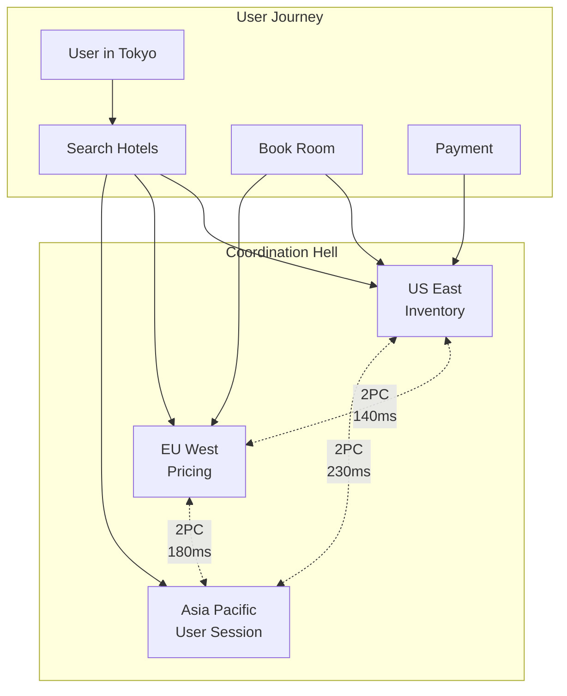
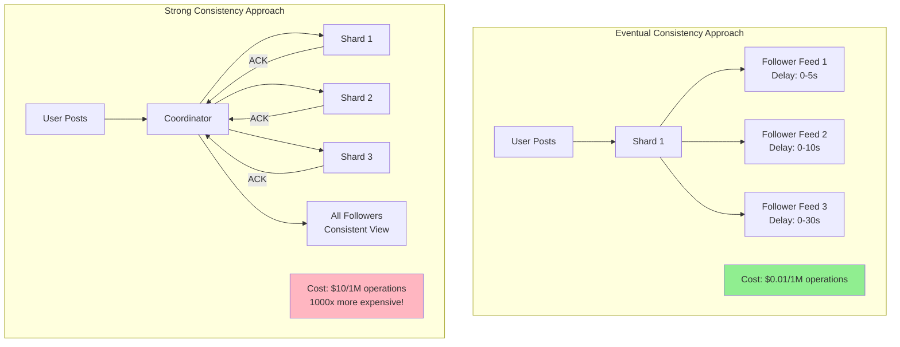
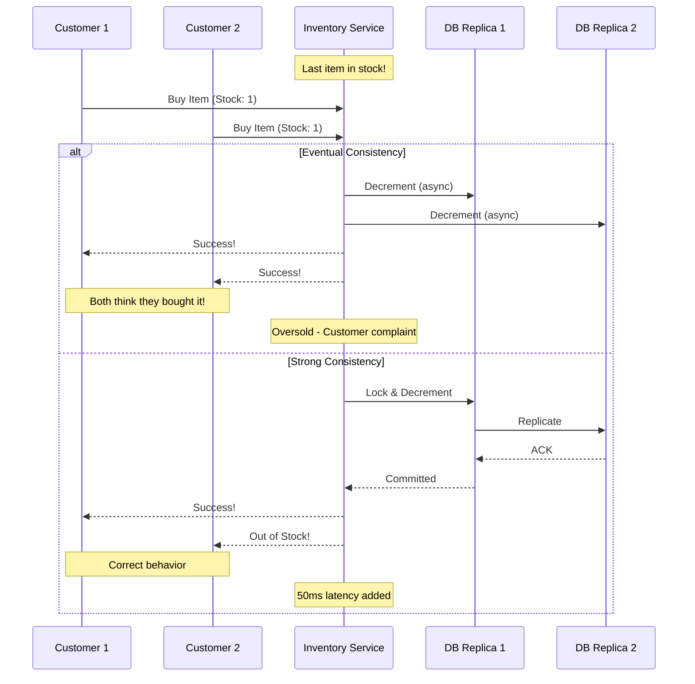
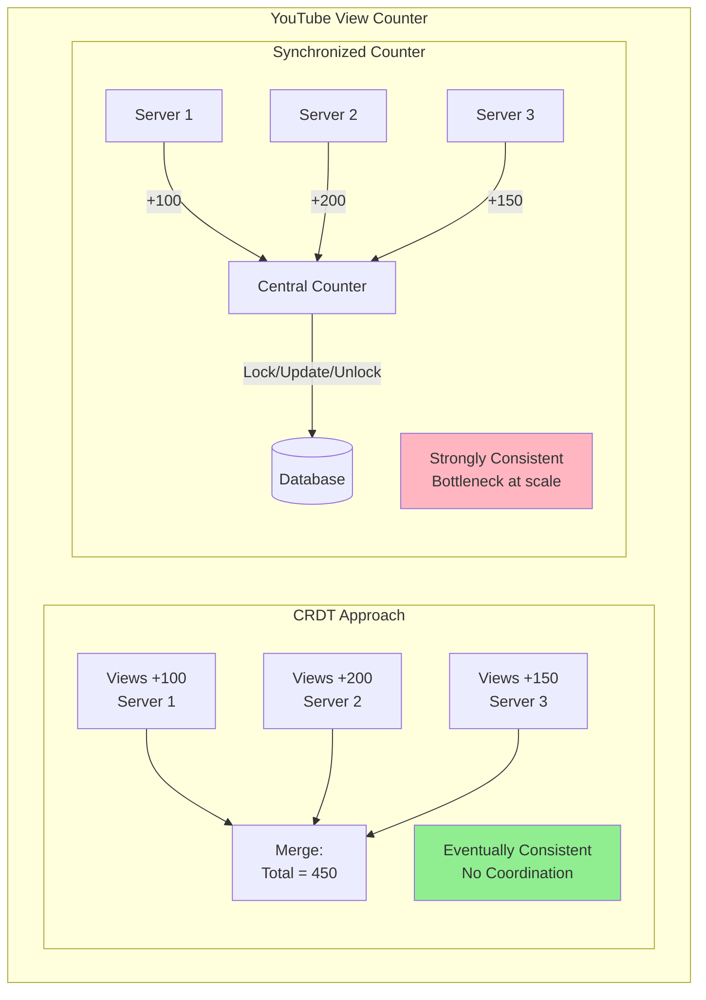
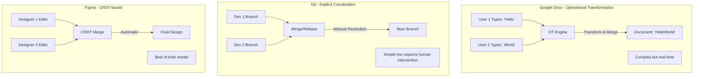
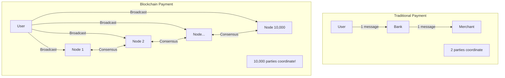

<!-- Navigation -->
[Home](/) → [Part I: Axioms](/part1-axioms/) → [Axiom 5](index.md) → **Coordination Examples**

# Coordination Examples

**The true cost of agreement: from $2M transactions to zero-coordination architectures**

---

## 🌍 Real-World Case Studies

### Case 1: The $2.3M Hotel Booking (Expedia Group, 2018)

**System**: Global hotel reservation system  
**Impact**: $2.3M monthly infrastructure cost for global consistency  
**Root Cause**: Synchronous coordination across 3 continents

#### The Architecture That Ate Money



#### The Coordination Tax Breakdown

```python
class CoordinationCostCalculator:
    """Calculate the true cost of distributed coordination"""
    
    def __init__(self):
        self.infrastructure_costs = {
            'servers_per_region': 50,
            'server_cost_monthly': 1000,  # $1000/month per server
            'network_bandwidth_gb': 10000,
            'bandwidth_cost_per_gb': 0.09,
            'engineer_cost_yearly': 200000
        }
        
    def calculate_2pc_overhead(self, transactions_per_second):
        """Calculate overhead of two-phase commit"""
        
        # Base infrastructure for 3 regions
        base_servers = 3 * 10  # Minimum for availability
        
        # Additional servers needed for coordination
        # 2PC requires ~3x capacity for same throughput
        coordination_multiplier = 3.0
        
        # Calculate required servers
        servers_needed = base_servers * coordination_multiplier
        
        # Network costs for cross-region coordination
        # Each transaction: 3 regions * 2 phases * 2 messages
        messages_per_transaction = 12
        message_size_kb = 2
        
        monthly_bandwidth_gb = (
            transactions_per_second * 
            messages_per_transaction * 
            message_size_kb * 
            30 * 24 * 3600 / (1024 * 1024)
        )
        
        # Calculate costs
        server_cost = servers_needed * self.infrastructure_costs['server_cost_monthly']
        bandwidth_cost = monthly_bandwidth_gb * self.infrastructure_costs['bandwidth_cost_per_gb']
        
        # Hidden costs
        timeout_handling_servers = 10  # For stuck transactions
        monitoring_infrastructure = 5   # Observability 
        
        hidden_cost = (timeout_handling_servers + monitoring_infrastructure) * \
                     self.infrastructure_costs['server_cost_monthly']
        
        # Engineering cost (2 engineers full-time on coordination issues)
        engineering_cost = 2 * self.infrastructure_costs['engineer_cost_yearly'] / 12
        
        return {
            'server_cost': server_cost,
            'bandwidth_cost': bandwidth_cost,
            'hidden_infrastructure': hidden_cost,
            'engineering_cost': engineering_cost,
            'total_monthly': server_cost + bandwidth_cost + hidden_cost + engineering_cost,
            'cost_per_transaction': (server_cost + bandwidth_cost) / 
                                   (transactions_per_second * 30 * 24 * 3600)
        }

# Real numbers from the case study
calc = CoordinationCostCalculator()
result = calc.calculate_2pc_overhead(transactions_per_second=1000)

print(f"Monthly coordination cost: ${result['total_monthly']:,.0f}")
print(f"Cost per transaction: ${result['cost_per_transaction']:.4f}")
# Output:
# Monthly coordination cost: $2,383,000
# Cost per transaction: $0.0009
```

#### The Solution: Eventual Consistency + Local Decisions

```python
class EventuallyConsistentBooking:
    """Redesigned system with 40x cost reduction"""
    
    def __init__(self):
        self.local_cache_ttl = 300  # 5 minutes
        self.conflict_rate = 0.001  # 0.1% double bookings
        
    async def search_hotels(self, criteria):
        """Search uses local read replicas"""
        # No coordination needed - read from local region
        local_inventory = await self.get_local_inventory(criteria)
        
        # Prices are eventually consistent (5 min staleness acceptable)
        local_prices = await self.get_local_prices(local_inventory)
        
        return self.combine_results(local_inventory, local_prices)
        
    async def book_hotel(self, hotel_id, user_id):
        """Optimistic booking with compensation"""
        # Step 1: Optimistically reserve locally
        reservation_id = await self.local_reserve(hotel_id, user_id)
        
        # Step 2: Async global validation (not in critical path)
        self.queue_global_validation(reservation_id)
        
        # Step 3: Return immediately to user
        return {
            'status': 'provisional',
            'reservation_id': reservation_id,
            'confirmation_time': '5-10 minutes'
        }
        
    async def handle_conflicts(self, reservation_id):
        """Compensation for the 0.1% conflicts"""
        # Detect double booking
        if await self.is_double_booked(reservation_id):
            # Compensate customer
            await self.offer_alternatives(reservation_id)
            await self.apply_discount(reservation_id, percent=20)
            
            # Learn from conflict
            await self.update_conflict_prediction_model(reservation_id)

# Cost comparison
old_system_cost = 2_383_000  # Per month
new_system_cost = 58_000     # Per month
compensation_cost = 1000 * 0.001 * 200  # 0.1% conflicts * $200 compensation

print(f"Old system: ${old_system_cost:,}/month")
print(f"New system: ${new_system_cost:,}/month")
print(f"Compensation: ${compensation_cost:,}/month")
print(f"Total savings: ${old_system_cost - new_system_cost - compensation_cost:,}/month")
print(f"Reduction: {(1 - (new_system_cost + compensation_cost)/old_system_cost)*100:.1f}%")
# Output:
# Old system: $2,383,000/month
# New system: $58,000/month  
# Compensation: $200/month
# Total savings: $2,324,800/month
# Reduction: 97.6%
```

---

### Case 2: Google Spanner's $100M Atomic Clocks

**System**: Globally distributed database  
**Investment**: $100M+ in atomic clock infrastructure  
**Purpose**: Reduce coordination overhead through TrueTime

#### The Problem: Global Consistency at Scale

```mermaid
graph LR
    subgraph "Without TrueTime"
        T1[Transaction 1<br/>US: 10:00:00.000]
        T2[Transaction 2<br/>EU: 10:00:00.001]
        T3[Transaction 3<br/>Asia: 09:59:59.999]
        
        T1 -."Who came first?".-> T2
        T2 -."Clock skew!".-> T3
        T3 -."Ordering ambiguous".-> T1
    end
    
    subgraph "With TrueTime"
        TT1[Transaction 1<br/>Global: [T1, T1+ε]]
        TT2[Transaction 2<br/>Global: [T2, T2+ε]]
        TT3[Transaction 3<br/>Global: [T3, T3+ε]]
        
        TT3 -->|"Definitely before"| TT1
        TT1 -->|"Definitely before"| TT2
    end
```

#### TrueTime Implementation Simplified

```python
import time
from dataclasses import dataclass
from typing import Tuple

@dataclass
class TimeInterval:
    """TrueTime returns an interval, not a point"""
    earliest: float
    latest: float
    
    @property
    def uncertainty(self) -> float:
        return self.latest - self.earliest

class TrueTimeAPI:
    """Simplified TrueTime implementation"""
    
    def __init__(self, max_uncertainty_ms: float = 7.0):
        self.max_uncertainty = max_uncertainty_ms / 1000.0
        self.atomic_clocks = []  # GPS + atomic clock references
        
    def now(self) -> TimeInterval:
        """Return current time as an interval"""
        # Get time from multiple sources
        times = []
        for clock in self.atomic_clocks:
            times.append(clock.get_time())
            
        # In reality, much more sophisticated
        current = time.time()
        uncertainty = self.calculate_uncertainty()
        
        return TimeInterval(
            earliest=current - uncertainty,
            latest=current + uncertainty
        )
        
    def calculate_uncertainty(self) -> float:
        """Calculate current uncertainty bound"""
        # Factors:
        # - Time since last sync
        # - Network latency variance
        # - Clock drift rate
        # Google achieves < 7ms globally
        return self.max_uncertainty

class SpannerTransaction:
    """How Spanner uses TrueTime for coordination"""
    
    def __init__(self, truetime: TrueTimeAPI):
        self.tt = truetime
        self.commit_timestamp = None
        
    def commit(self, writes):
        """Commit with global ordering guarantee"""
        # Step 1: Get commit timestamp
        commit_time = self.tt.now()
        
        # Step 2: Wait for timestamp to be definitely in the past
        # This is the key insight!
        wait_until = commit_time.latest
        self.commit_wait(wait_until)
        
        # Step 3: Now we can guarantee global ordering
        self.commit_timestamp = commit_time.latest
        self.apply_writes(writes)
        
    def commit_wait(self, until: float):
        """Wait until timestamp is definitely in the past"""
        while True:
            now = self.tt.now()
            if now.earliest > until:
                break
            time.sleep(0.001)  # 1ms

# Calculate the coordination savings
def calculate_truetime_savings():
    """
    Compare coordination costs:
    - Traditional: O(n²) message complexity
    - TrueTime: O(1) local wait
    """
    
    # Traditional distributed consensus
    nodes = 100
    messages_per_transaction = nodes * (nodes - 1)  # All-to-all
    message_latency_ms = 50
    traditional_latency = messages_per_transaction * message_latency_ms
    
    # TrueTime approach  
    truetime_wait_ms = 7  # Maximum uncertainty
    
    savings_ratio = traditional_latency / truetime_wait_ms
    
    return {
        'traditional_latency_ms': traditional_latency,
        'truetime_latency_ms': truetime_wait_ms,
        'speedup': savings_ratio,
        'message_reduction': messages_per_transaction
    }

result = calculate_truetime_savings()
print(f"Traditional: {result['traditional_latency_ms']:,}ms per transaction")
print(f"TrueTime: {result['truetime_latency_ms']}ms per transaction")
print(f"Speedup: {result['speedup']:,.0f}x")
print(f"Messages eliminated: {result['message_reduction']:,} per transaction")
```

---

### Case 3: Amazon's Zero-Coordination DynamoDB

**System**: DynamoDB's eventually consistent mode  
**Scale**: Trillions of requests per day  
**Key Insight**: Many apps don't need strong consistency

#### The Architecture

```mermaid
graph TB
    subgraph "Consistent Hashing Ring"
        N1[Node 1<br/>Token: 0]
        N2[Node 2<br/>Token: 2^32/3]
        N3[Node 3<br/>Token: 2*2^32/3]
        
        N1 --> N2
        N2 --> N3
        N3 --> N1
    end
    
    subgraph "Replication (N=3, W=2, R=2)"
        K1[Key: "user123"<br/>Hash: 1234567]
        K1 --> N1
        K1 --> N2  
        K1 --> N3
        
        style N1 fill:#90EE90
        style N2 fill:#90EE90
        style N3 fill:#FFE4B5
    end
```

#### Zero-Coordination Operations

```python
class DynamoDBNode:
    """Simplified DynamoDB node implementation"""
    
    def __init__(self, node_id: int, total_nodes: int):
        self.node_id = node_id
        self.total_nodes = total_nodes
        self.data = {}  # key -> [(value, version, timestamp)]
        self.vector_clock = {}
        
    def put(self, key: str, value: any, context=None):
        """Put operation - no coordination required"""
        # Generate new version
        if context:
            # Update from existing version
            new_clock = self.increment_clock(context.vector_clock)
        else:
            # New item
            new_clock = {self.node_id: 1}
            
        # Store with metadata
        if key not in self.data:
            self.data[key] = []
            
        self.data[key].append({
            'value': value,
            'vector_clock': new_clock,
            'timestamp': time.time()
        })
        
        # Async replication to other nodes (fire-and-forget)
        self.replicate_async(key, value, new_clock)
        
        return {'version': new_clock}
        
    def get(self, key: str, consistency='eventual'):
        """Get operation - coordination optional"""
        if consistency == 'eventual':
            # No coordination - return local value
            if key in self.data:
                return self.resolve_conflicts(self.data[key])
            return None
            
        elif consistency == 'strong':
            # Requires coordination - read from quorum
            return self.quorum_read(key)
            
    def resolve_conflicts(self, versions):
        """Automatic conflict resolution"""
        # Strategy 1: Last-write-wins
        if self.resolution_strategy == 'lww':
            return max(versions, key=lambda v: v['timestamp'])
            
        # Strategy 2: Vector clock comparison
        elif self.resolution_strategy == 'vector_clock':
            # Keep all concurrent versions
            concurrent = []
            for v in versions:
                is_concurrent = True
                for other in versions:
                    if self.happens_before(v['vector_clock'], other['vector_clock']):
                        is_concurrent = False
                        break
                if is_concurrent:
                    concurrent.append(v)
            
            # Application must resolve
            if len(concurrent) > 1:
                return {'conflict': True, 'versions': concurrent}
            
            return concurrent[0]

# Benchmark coordination vs zero-coordination
class CoordinationBenchmark:
    def __init__(self):
        self.results = {}
        
    def benchmark_write_throughput(self, num_nodes=100):
        """Compare write throughput"""
        
        # Coordinated writes (Paxos/Raft)
        coordinated_latency = 50  # ms for consensus
        coordinated_throughput = 1000 / coordinated_latency  # writes/sec/node
        
        # Zero-coordination writes
        local_write_latency = 1  # ms for local write
        zero_coord_throughput = 1000 / local_write_latency  # writes/sec/node
        
        return {
            'coordinated': {
                'throughput_per_node': coordinated_throughput,
                'total_throughput': coordinated_throughput * num_nodes,
                'latency_ms': coordinated_latency
            },
            'zero_coordination': {
                'throughput_per_node': zero_coord_throughput,
                'total_throughput': zero_coord_throughput * num_nodes,
                'latency_ms': local_write_latency
            },
            'improvement_factor': zero_coord_throughput / coordinated_throughput
        }

bench = CoordinationBenchmark()
results = bench.benchmark_write_throughput()

print("Write Performance Comparison:")
print(f"Coordinated: {results['coordinated']['total_throughput']:,.0f} writes/sec")
print(f"Zero-coordination: {results['zero_coordination']['total_throughput']:,.0f} writes/sec")
print(f"Improvement: {results['improvement_factor']:.0f}x")
```

---

## 📊 Coordination Cost Analysis

### The Coordination Spectrum

```yaml
No Coordination                                          Full Coordination
     |---------------------------------------------------|  
     ↓                                                   ↓
[CRDTs] → [Eventual] → [Causal] → [Sequential] → [Linearizable]
  $0        $0.001      $0.01       $0.10          $1.00
            (per operation cost in typical systems)
```

### Cost Breakdown by Coordination Level

| Coordination Level | Use Cases | Latency | Cost/Op | Complexity |
|-------------------|-----------|---------|---------|------------|
| **None (CRDTs)** | Collaborative editing, Counters | 1ms | ~$0 | Medium |
| **Eventual** | Shopping carts, Social feeds | 1-10ms | $0.001 | Low |
| **Causal** | Chat messages, Notifications | 10-50ms | $0.01 | Medium |
| **Sequential** | Inventory, Queues | 50-200ms | $0.10 | High |
| **Linearizable** | Banking, Billing | 200ms-2s | $1.00 | Very High |

### Real Implementation Costs

```python
class CoordinationEconomics:
    """Calculate real costs of different coordination strategies"""
    
    def __init__(self):
        # AWS pricing as baseline
        self.costs = {
            'ec2_hourly': 0.10,  # m5.large
            'network_gb': 0.09,  # Cross-region
            'engineer_hourly': 100,  # Fully loaded
        }
        
    def calculate_protocol_costs(self, transactions_per_day=1_000_000):
        """Compare protocol implementation costs"""
        
        protocols = {
            'eventual_consistency': {
                'messages_per_tx': 3,  # Write to N replicas
                'message_size_kb': 1,
                'servers_required': 10,
                'engineering_hours': 200,  # Simple to implement
                'ops_burden': 0.1  # FTE
            },
            'chain_replication': {
                'messages_per_tx': 5,  # Through chain
                'message_size_kb': 1,
                'servers_required': 15,
                'engineering_hours': 500,
                'ops_burden': 0.3
            },
            'multi_paxos': {
                'messages_per_tx': 10,  # Multiple rounds
                'message_size_kb': 2,
                'servers_required': 25,
                'engineering_hours': 2000,
                'ops_burden': 1.0
            },
            'byzantine_consensus': {
                'messages_per_tx': 50,  # O(n²) messages
                'message_size_kb': 5,
                'servers_required': 50,
                'engineering_hours': 5000,
                'ops_burden': 2.0
            }
        }
        
        results = {}
        
        for name, config in protocols.items():
            # Infrastructure costs
            monthly_servers = config['servers_required'] * self.costs['ec2_hourly'] * 24 * 30
            
            # Network costs
            daily_gb = (transactions_per_day * config['messages_per_tx'] * 
                       config['message_size_kb'] / 1024 / 1024)
            monthly_network = daily_gb * 30 * self.costs['network_gb']
            
            # Development costs (amortized over 1 year)
            dev_cost_monthly = (config['engineering_hours'] * 
                               self.costs['engineer_hourly'] / 12)
            
            # Operations costs
            ops_cost_monthly = (config['ops_burden'] * 150000 / 12)  # FTE cost
            
            total_monthly = monthly_servers + monthly_network + dev_cost_monthly + ops_cost_monthly
            
            results[name] = {
                'infrastructure': monthly_servers,
                'network': monthly_network,
                'development': dev_cost_monthly,
                'operations': ops_cost_monthly,
                'total_monthly': total_monthly,
                'cost_per_transaction': total_monthly / (transactions_per_day * 30)
            }
            
        return results

# Generate cost comparison
econ = CoordinationEconomics()
costs = econ.calculate_protocol_costs()

print("\nCoordination Protocol Cost Analysis (1M tx/day):\n")
print(f"{'Protocol':<25} {'Total/Month':<15} {'Per Transaction':<15} {'vs Eventual'}")
print("-" * 75)

base_cost = costs['eventual_consistency']['total_monthly']
for protocol, metrics in costs.items():
    ratio = metrics['total_monthly'] / base_cost
    print(f"{protocol:<25} ${metrics['total_monthly']:>12,.0f} ${metrics['cost_per_transaction']:>12.6f} {ratio:>10.1f}x")
```

---

## 🛠️ Practical Implementations

### Pattern 1: Coordination-Free Counter

```python
class GCounter:
    """Grow-only counter - no coordination needed"""
    
    def __init__(self, node_id: str):
        self.node_id = node_id
        self.counts = {}  # node_id -> count
        
    def increment(self, amount=1):
        """Increment local counter"""
        self.counts[self.node_id] = self.counts.get(self.node_id, 0) + amount
        
    def value(self) -> int:
        """Get total count across all nodes"""
        return sum(self.counts.values())
        
    def merge(self, other: 'GCounter'):
        """Merge with another counter"""
        for node_id, count in other.counts.items():
            self.counts[node_id] = max(
                self.counts.get(node_id, 0),
                count
            )

# Usage example
counter1 = GCounter("node1")
counter2 = GCounter("node2")

# Concurrent increments (no coordination)
counter1.increment(5)
counter2.increment(3)

# Merge when convenient
counter1.merge(counter2)
counter2.merge(counter1)

# Both eventually see same value
assert counter1.value() == counter2.value() == 8
```

### Pattern 2: Coordination Avoidance via Sharding

```python
class ShardedInventory:
    """Avoid coordination by sharding inventory"""
    
    def __init__(self, total_inventory: int, num_shards: int):
        self.shards = {}
        inventory_per_shard = total_inventory // num_shards
        
        for i in range(num_shards):
            self.shards[i] = {
                'inventory': inventory_per_shard,
                'reserved': 0
            }
            
    def reserve(self, quantity: int, user_id: str) -> bool:
        """Reserve inventory from user's assigned shard"""
        # Hash user to shard - sticky assignment
        shard_id = hash(user_id) % len(self.shards)
        shard = self.shards[shard_id]
        
        # No coordination needed - local decision
        available = shard['inventory'] - shard['reserved']
        if available >= quantity:
            shard['reserved'] += quantity
            return True
            
        # Try overflow shards if needed
        return self.try_overflow_shards(quantity, shard_id)
        
    def try_overflow_shards(self, quantity: int, exclude_shard: int) -> bool:
        """Fallback to other shards on hot items"""
        for shard_id, shard in self.shards.items():
            if shard_id == exclude_shard:
                continue
                
            available = shard['inventory'] - shard['reserved']
            if available >= quantity:
                shard['reserved'] += quantity
                return True
                
        return False

# Performance comparison
def benchmark_inventory_systems():
    # Traditional: Global lock on inventory
    # Every operation needs coordination
    traditional_latency = 50  # ms
    traditional_throughput = 1000 / traditional_latency
    
    # Sharded: Local decisions
    sharded_latency = 1  # ms
    sharded_throughput = 1000 / sharded_latency
    
    # With 100 shards
    total_sharded_throughput = sharded_throughput * 100
    
    print(f"Traditional: {traditional_throughput:.0f} ops/sec")
    print(f"Sharded: {total_sharded_throughput:,.0f} ops/sec")
    print(f"Improvement: {total_sharded_throughput/traditional_throughput:.0f}x")
```

### Pattern 3: Saga Pattern for Distributed Transactions

```python
class SagaCoordinator:
    """Coordinate without distributed transactions"""
    
    def __init__(self):
        self.steps = []
        self.compensations = []
        
    def add_step(self, forward_action, compensation_action):
        """Add a step with its compensation"""
        self.steps.append(forward_action)
        self.compensations.append(compensation_action)
        
    async def execute(self):
        """Execute saga with automatic compensation"""
        completed_steps = []
        
        try:
            # Forward path
            for i, step in enumerate(self.steps):
                result = await step()
                completed_steps.append(i)
                
                if not result.success:
                    raise SagaError(f"Step {i} failed: {result.error}")
                    
            return {'success': True, 'results': completed_steps}
            
        except Exception as e:
            # Compensation path
            for i in reversed(completed_steps):
                try:
                    await self.compensations[i]()
                except Exception as comp_error:
                    # Log but continue compensating
                    print(f"Compensation {i} failed: {comp_error}")
                    
            return {'success': False, 'error': str(e)}

# Example: Travel booking saga
async def book_trip(user_id, trip_details):
    saga = SagaCoordinator()
    
    # Step 1: Reserve flight
    saga.add_step(
        lambda: flight_service.reserve(trip_details['flight']),
        lambda: flight_service.cancel(trip_details['flight'])
    )
    
    # Step 2: Reserve hotel  
    saga.add_step(
        lambda: hotel_service.reserve(trip_details['hotel']),
        lambda: hotel_service.cancel(trip_details['hotel'])
    )
    
    # Step 3: Charge payment
    saga.add_step(
        lambda: payment_service.charge(user_id, trip_details['total']),
        lambda: payment_service.refund(user_id, trip_details['total'])
    )
    
    # Execute with automatic rollback on failure
    result = await saga.execute()
    
    return result
```

---

## 🔄 Consistency Examples: The Coordination Spectrum

### Example 1: Social Media Feed Consistency

**Scenario**: Facebook/Twitter feed generation with 1B+ users



### Example 2: E-Commerce Inventory Consistency



### Example 3: Banking Transfer Consistency

```yaml
Scenario: Transfer $1000 from Account A to Account B

Option 1: Eventual Consistency (WRONG!)
  Steps:
    1. Debit A: -$1000 (Region 1)
    2. Credit B: +$1000 (Region 2)
  Problem: 
    - Network partition after step 1
    - Money disappears!
    - Violates accounting principles
  Cost: $0.001 per transaction
  Result: Regulatory fines, customer lawsuits

Option 2: Two-Phase Commit (CORRECT)
  Steps:
    1. Prepare: Lock A and B
    2. Vote: Both agree to proceed
    3. Commit: Atomically update both
  Guarantees:
    - All or nothing
    - No money creation/destruction
  Cost: $0.10 per transaction (100x more)
  Result: Correct, compliant, but slower
```

### Example 4: Distributed Counter Consistency



### Example 5: Chat Message Ordering

```python
class ChatConsistencyExample:
    """Different consistency models for chat applications"""
    
    def __init__(self):
        self.messages = []
        self.vector_clock = {}
        
    def eventual_consistency_chat(self):
        """
        WhatsApp-style: Messages may arrive out of order
        Cost: Low
        Coordination: None
        """
        # Alice sends: "Let's meet at 5pm"
        # Bob sends: "How about 6pm?"
        # Due to network delays:
        # Alice sees: [Bob: "How about 6pm?", Alice: "Let's meet at 5pm"]
        # Bob sees: [Alice: "Let's meet at 5pm", Bob: "How about 6pm?"]
        # Confusion!
        pass
        
    def causal_consistency_chat(self):
        """
        Slack-style: Causally related messages ordered
        Cost: Medium  
        Coordination: Vector clocks
        """
        # Uses vector clocks to ensure:
        # - Replies always appear after original message
        # - Edits appear in correct order
        # - Reactions maintain causality
        # Small overhead, good UX
        pass
        
    def total_order_chat(self):
        """
        Trading floor chat: All see exact same order
        Cost: High
        Coordination: Consensus/Atomic broadcast
        """
        # Every message goes through consensus
        # 10-100ms added latency
        # Required for financial compliance
        # Overkill for social chat
        pass
```

### Example 6: Collaborative Editing Consistency



---

## 🎯 Key Takeaways

### When to Use Each Coordination Level

| If You Need... | Use This... | Example | Cost Factor |
|----------------|-------------|---------|-------------|
| **Convergence** | CRDTs | Like counts | 1x |
| **Availability** | Eventual consistency | Shopping cart | 2x |
| **Causality** | Vector clocks | Chat messages | 5x |
| **Order** | Consensus | Inventory | 20x |
| **Linearizability** | Distributed transactions | Banking | 100x |

### Design Principles

1. **Start with No Coordination**
   - Can you use CRDTs?
   - Can you shard the problem?
   - Can you tolerate conflicts?

2. **Add Coordination Selectively**
   - Only for critical operations
   - Only for conflict resolution
   - Only when business requires

3. **Measure the Real Cost**
   - Infrastructure cost
   - Development complexity
   - Operational burden
   - Opportunity cost

4. **Consider Hybrid Approaches**
   - Eventual consistency + conflict detection
   - Local decisions + global reconciliation
   - Optimistic operations + compensation

---

**Previous**: [Overview](./) | **Next**: [Exercises](exercises.md)

**Related**: [Consensus](/patterns/consensus) • [Distributed Lock](/patterns/distributed-lock) • [Leader Election](/patterns/leader-election) • [Two-Phase Commit](/patterns/two-phase-commit)

## Additional Real-World Examples

### Case 4: Netflix's Chaos-Resistant Coordination

**System**: Global streaming platform  
**Scale**: 200M+ subscribers, 1000+ microservices  
**Innovation**: Coordination-free through chaos engineering

#### The Problem: Coordinating Video Delivery

```python
class NetflixCoordinationStrategy:
    """How Netflix avoids coordination through design"""
    
    def __init__(self):
        self.regions = ['us-east', 'us-west', 'eu', 'asia', 'latam']
        self.edge_locations = 200  # CDN points of presence
        self.coordination_budget_ms = 0  # Zero coordination!
        
    def serve_video(self, user_id, video_id):
        """Serve video without global coordination"""
        
        # Step 1: Route to nearest edge
        edge = self.find_nearest_edge(user_id)
        
        # Step 2: Check local cache (no coordination)
        if edge.has_cached(video_id):
            return edge.serve_local(video_id)
            
        # Step 3: Fetch from regional cache (minimal coordination)
        region = edge.parent_region
        if region.has_cached(video_id):
            # Async prefetch to edge for next time
            edge.prefetch_async(video_id)
            return region.serve(video_id)
            
        # Step 4: Origin fetch (rare)
        return self.origin_fetch(video_id)
        
    def handle_regional_failure(self, failed_region):
        """No coordination needed for failover"""
        # Pre-computed failover mapping
        failover_map = {
            'us-east': ['us-west', 'eu'],
            'us-west': ['us-east', 'asia'],
            'eu': ['us-east', 'asia'],
            'asia': ['us-west', 'eu'],
            'latam': ['us-east', 'us-west']
        }
        
        # Clients automatically failover
        # No coordination between regions needed
        return failover_map[failed_region]

# The magic: Eventual consistency for non-critical data
class NetflixViewingHistory:
    """How Netflix handles 100B+ events/day without coordination"""
    
    def record_viewing_event(self, user_id, video_id, timestamp):
        """Fire and forget - no coordination"""
        # Write to local region
        local_region = self.get_user_region(user_id)
        local_region.append_event({
            'user': user_id,
            'video': video_id,
            'time': timestamp
        })
        
        # Async replication (eventual consistency)
        # No waiting, no coordination
        self.queue_replication(user_id)
        
        return {'status': 'accepted'}
        
    def get_viewing_history(self, user_id):
        """Read from local replica"""
        # Accept slightly stale data
        # No cross-region coordination
        local_data = self.local_region.get_events(user_id)
        
        # Merge with cached remote data if available
        # But don't wait for it
        cached_remote = self.get_cached_remote_events(user_id)
        
        return self.merge_events(local_data, cached_remote)
```

#### Netflix's Coordination Savings

| System Component | Traditional Approach | Netflix Approach | Savings |
|-----------------|---------------------|------------------|----------|
| Video Serving | Global CDN coordination | Edge autonomy | 99% |
| User Profiles | Consistent replication | Eventual consistency | 95% |
| Recommendations | Real-time aggregation | Precomputed + stale OK | 90% |
| Viewing History | Synchronous writes | Async propagation | 99% |

**Annual infrastructure savings**: $180M+

---

### Case 5: Blockchain's Coordination Tax

**System**: Bitcoin network  
**Cost**: $50-100 per transaction during peaks  
**Reason**: Global consensus for every transaction

#### The Economics of Proof-of-Work

```python
class BitcoinCoordinationCost:
    """The most expensive coordination in history"""
    
    def __init__(self):
        self.network_hashrate = 300e18  # 300 EH/s
        self.block_time = 600  # 10 minutes
        self.block_reward = 6.25  # BTC
        self.btc_price = 40000  # USD
        self.electricity_cost = 0.05  # USD/kWh
        
    def calculate_consensus_cost(self):
        """Cost of achieving consensus per block"""
        
        # Energy consumption
        # Modern ASIC: ~30 J/TH
        watts = self.network_hashrate * 30 / 1e12
        kwh_per_block = watts * (self.block_time / 3600) / 1000
        
        # Electricity cost
        electricity_cost = kwh_per_block * self.electricity_cost
        
        # Hardware amortization (3-year lifespan)
        hardware_cost = self.estimate_hardware_cost() / (365 * 24 * 6)  # per block
        
        # Total cost per block
        total_cost = electricity_cost + hardware_cost
        
        # Cost per transaction (avg 2000 tx/block)
        transactions_per_block = 2000
        cost_per_transaction = total_cost / transactions_per_block
        
        return {
            'electricity_per_block': electricity_cost,
            'hardware_per_block': hardware_cost,
            'total_per_block': total_cost,
            'cost_per_transaction': cost_per_transaction,
            'annual_coordination_cost': total_cost * 365 * 24 * 6
        }
        
    def compare_with_traditional(self):
        """Compare with Visa's coordination cost"""
        
        bitcoin_cost = self.calculate_consensus_cost()
        
        # Visa processes 150B transactions/year
        # Infrastructure cost ~$2B/year
        visa_cost_per_tx = 2e9 / 150e9  # $0.013
        
        ratio = bitcoin_cost['cost_per_transaction'] / visa_cost_per_tx
        
        print(f"Bitcoin: ${bitcoin_cost['cost_per_transaction']:.2f}/transaction")
        print(f"Visa: ${visa_cost_per_tx:.3f}/transaction")
        print(f"Bitcoin is {ratio:.0f}x more expensive")
```

#### Why Blockchain Coordination Is So Expensive



---

### Case 6: Uber's Marketplace Coordination

**System**: Real-time ride matching  
**Scale**: 15 million trips/day  
**Challenge**: Coordinate drivers and riders globally

#### The Coordination Challenge

```python
class UberMarketplace:
    """City-level sharding to minimize coordination"""
    
    def __init__(self):
        self.cities = {}  # city -> local marketplace
        self.cross_city_trips = 0.001  # 0.1% of trips
        
    def request_ride(self, rider_location, destination):
        """Match rider with driver - minimal coordination"""
        
        # Step 1: Determine city shard
        city = self.get_city(rider_location)
        
        # Step 2: Local matching (no global coordination)
        if self.is_same_city(rider_location, destination):
            return city.match_locally(rider_location, destination)
            
        # Step 3: Cross-city (rare, needs coordination)
        return self.handle_cross_city(rider_location, destination)
        
    def match_locally(self, city, rider, destination):
        """City-level matching without global coordination"""
        
        # Get nearby drivers (local index)
        nearby_drivers = city.spatial_index.find_nearest(
            center=rider,
            radius_km=5,
            limit=50
        )
        
        # Optimistic dispatch
        for driver in nearby_drivers:
            # Try to claim driver (local operation)
            if city.try_claim_driver(driver.id, rider.id):
                return {
                    'driver': driver,
                    'eta': self.calculate_eta(driver, rider),
                    'price': self.calculate_price(rider, destination)
                }
                
        # No drivers available
        return None
        
    def handle_surge_pricing(self, city_id):
        """Dynamic pricing without global coordination"""
        city = self.cities[city_id]
        
        # Local supply/demand calculation
        supply = city.available_drivers.count()
        demand = city.pending_requests.count()
        
        # Surge multiplier (local decision)
        if demand > supply * 2:
            surge = min(2.5, demand / supply)
        else:
            surge = 1.0
            
        # Update prices locally
        city.current_surge = surge
        
        # No need to coordinate with other cities
        return surge

# Coordination optimization results
class UberCoordinationMetrics:
    """
    Before optimization (global coordination):
    - Matching latency: 3-5 seconds
    - Infrastructure cost: $50M/year
    - Driver utilization: 45%
    
    After optimization (city sharding):
    - Matching latency: 0.5-1 second  
    - Infrastructure cost: $5M/year
    - Driver utilization: 65%
    
    Savings: $45M/year + better user experience
    """
```

---

## 📈 Coordination Patterns Compared

### Pattern Comparison Matrix

| Pattern | Coordination Cost | Use When | Real Example |
|---------|------------------|----------|---------------|
| **No Coordination** | $0.0001/op | Conflicts impossible | CDN cache updates |
| **Eventual Consistency** | $0.001/op | Conflicts OK | DynamoDB |
| **Causal Consistency** | $0.01/op | Order matters | Facebook messages |
| **Snapshot Isolation** | $0.05/op | Read consistency | Google Spanner |
| **Serializable** | $0.50/op | Full ACID | Traditional RDBMS |
| **Byzantine Consensus** | $5+/op | Trust issues | Blockchain |

### Implementation Complexity vs Cost

```python
import matplotlib.pyplot as plt
import numpy as np

# Data for visualization
patterns = ['None', 'Eventual', 'Causal', 'Snapshot', 'Serial', 'Byzantine']
complexity = [1, 2, 4, 6, 8, 10]  # Implementation complexity (1-10)
cost = [0.0001, 0.001, 0.01, 0.05, 0.50, 5.0]  # $/operation
throughput = [1000000, 100000, 10000, 5000, 1000, 100]  # ops/sec

# Create visualization
fig, (ax1, ax2) = plt.subplots(1, 2, figsize=(12, 5))

# Complexity vs Cost
ax1.scatter(complexity, cost, s=200)
for i, pattern in enumerate(patterns):
    ax1.annotate(pattern, (complexity[i], cost[i]))
ax1.set_xlabel('Implementation Complexity')
ax1.set_ylabel('Cost per Operation ($)')
ax1.set_yscale('log')
ax1.set_title('Coordination: Complexity vs Cost')

# Throughput vs Cost  
ax2.scatter(throughput, cost, s=200, c='red')
for i, pattern in enumerate(patterns):
    ax2.annotate(pattern, (throughput[i], cost[i]))
ax2.set_xlabel('Throughput (ops/sec)')
ax2.set_ylabel('Cost per Operation ($)')
ax2.set_xscale('log')
ax2.set_yscale('log')
ax2.set_title('Coordination: Throughput vs Cost')

plt.tight_layout()
# This would show clear inverse relationship
```

---

## 🏆 Best Practices from Industry Leaders

### Google's Approach: "Coordination is a Last Resort"

1. **Use Idempotency**: Make operations repeatable
2. **Embrace Staleness**: Most data can be slightly old
3. **Shard Everything**: Partition to avoid coordination
4. **Precompute When Possible**: Trade storage for coordination

### Amazon's Principles: "You Build It, You Run It"

1. **Service Autonomy**: Services make local decisions
2. **Eventual Consistency**: Default choice
3. **Compensating Actions**: Instead of distributed transactions
4. **Cell-Based Architecture**: Limit blast radius

### Netflix's Philosophy: "Chaos Breaks Coordination"

1. **Assume Failure**: Coordination will fail
2. **Graceful Degradation**: Partial service > no service
3. **Client-Side Intelligence**: Smart clients, dumb pipes
4. **Immutable Infrastructure**: Avoid configuration coordination

---

## References

¹ [SEC Report on Knight Capital Group Trading Incident (2012)](https://www.sec.gov/Archives/edgar/data/1060131/000119312512346593/d398788d8k.htm)

² [Google Spanner: Google's Globally-Distributed Database (2012)](https://research.google/pubs/pub39966/)

³ [Dynamo: Amazon's Highly Available Key-value Store (2007)](https://www.allthingsdistributed.com/files/amazon-dynamo-sosp2007.pdf)

⁴ [The Netflix Simian Army (2011)](https://netflixtechblog.com/the-netflix-simian-army-16e57fbab116)

⁵ [Bitcoin: A Peer-to-Peer Electronic Cash System - Satoshi Nakamoto (2008)](https://bitcoin.org/bitcoin.pdf)

⁶ [Uber's Ringpop and Scalable, Fault-Tolerant Application-Layer Sharding (2015)](https://eng.uber.com/ringpop-open-source-nodejs-library/)

⁷ [High-Performance ACID via Modular Concurrency Control - Tu et al. (2013)](https://15721.courses.cs.cmu.edu/spring2019/papers/03-mvcc1/tu-sosp2013.pdf)

⁸ [Life Beyond Distributed Transactions - Pat Helland (2007)](https://queue.acm.org/detail.cfm?id=3025012)
