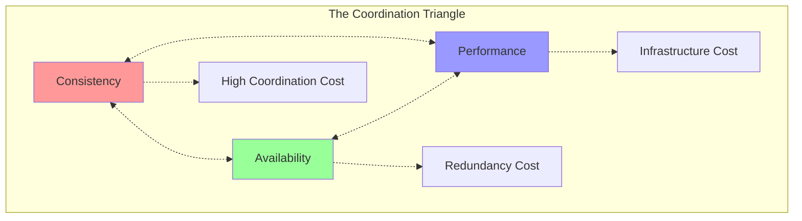
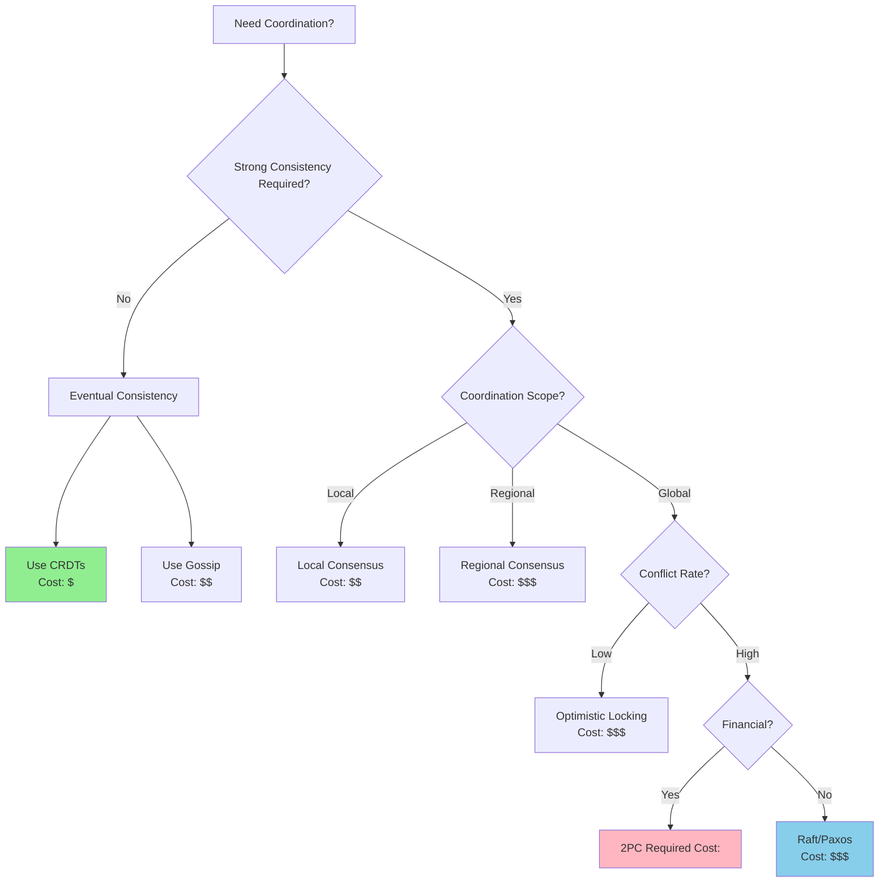
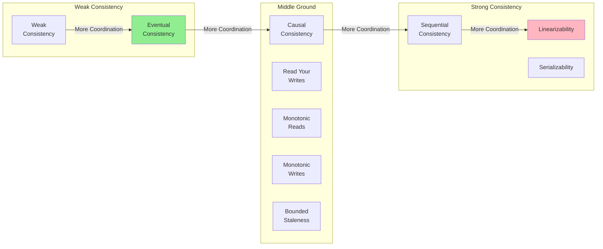
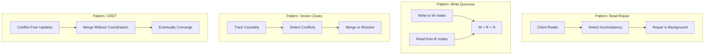
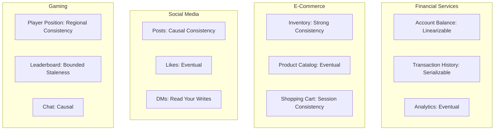
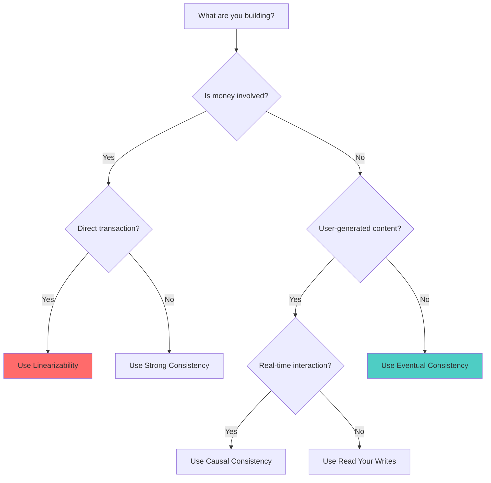
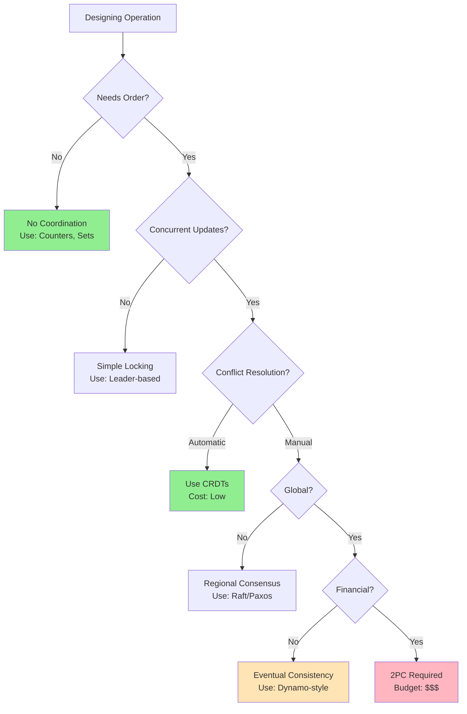

<!-- Navigation -->
[Home](/) → [Part I: Axioms](part1-axioms) → [Axiom 5](index.md) → **Axiom 5: Cost of Coordination**

# Axiom 5: Cost of Coordination

---


## The Constraint

### The Fundamental Limit

**There is no global clock in distributed systems**

This constraint emerges from **Einstein's relativity: simultaneity is relative**. No amount of engineering can violate this fundamental principle—we can only work within its boundaries.

### Physics Foundation

The practical manifestation of this constraint:
- **Theoretical basis**: Einstein's relativity: simultaneity is relative
- **Practical limit**: Network delays, clock drift, Byzantine failures
- **Real-world impact**: Cannot determine absolute ordering of events across nodes

### Why This Constraint Exists

Unlike software bugs or implementation details, this is a fundamental law of our universe. Understanding this constraint helps us:

1. **Set realistic expectations** - Know what's physically impossible
2. **Make better trade-offs** - Optimize within the possible
3. **Design robust systems** - Work with the constraint, not against it
4. **Avoid false solutions** - Don't chase impossible optimizations

!!! warning "Common Misconception"
    This constraint cannot be "solved" or "eliminated"—only managed and optimized within its boundaries.

---

## Why It Matters

Cannot determine absolute ordering of events across nodes

### Business Impact

This constraint directly affects:
- **User experience**: Performance and reliability
- **Development velocity**: Time-to-market and maintenance
- **Operational costs**: Infrastructure and support
- **Competitive advantage**: System capabilities and scalability

### Technical Implications

Every engineering decision must account for this constraint:
- **Architecture patterns**: Choose designs that work with the constraint
- **Technology selection**: Pick tools that optimize within the boundaries
- **Performance optimization**: Focus on what's actually improvable
- **Monitoring and alerting**: Track metrics related to the constraint

---

## 🚫 Common Misconceptions

Many engineers hold false beliefs about this constraint:

1. **"NTP synchronization provides perfect time"**
   - This violates the fundamental constraint
   - Reality: The constraint makes this impossible

2. **"Logical clocks solve all ordering problems"**
   - This violates the fundamental constraint
   - Reality: The constraint makes this impossible

3. **"Database timestamps are globally consistent"**
   - This violates the fundamental constraint
   - Reality: The constraint makes this impossible


### Reality Check

The constraint is absolute—these misconceptions arise from:
- **Wishful thinking**: Hoping engineering can overcome physics
- **Local optimization**: Solving one problem while creating others
- **Vendor marketing**: Oversimplified claims about complex systems
- **Incomplete understanding**: Not seeing the full system implications

---

## Practical Implications

How this constraint shapes real system design:

1. **Use vector clocks or logical timestamps**
2. **Design for eventual consistency**
3. **Avoid distributed transactions when possible**
4. **Accept that some operations cannot be perfectly ordered**


### Engineering Guidelines

When designing systems, always:
- **Start with the constraint**: Acknowledge it in your architecture
- **Measure the constraint**: Monitor relevant metrics
- **Design around the constraint**: Use patterns that work with it
- **Communicate the constraint**: Help stakeholders understand limitations

### Success Patterns

Teams that respect this constraint:
- Set realistic performance goals
- Choose appropriate architectural patterns
- Invest in proper monitoring and observability
- Make trade-offs explicit and data-driven

---


## Level 1: Intuition (Start Here) 🌱

### The Orchestra Metaphor

Imagine a symphony orchestra:
- **Solo violin**: Plays freely, no coordination needed
- **String quartet**: 4 musicians watching each other, minimal overhead
- **Full orchestra**: 100 musicians need a conductor, extensive rehearsals
- **Multiple orchestras** (in different cities): Synchronized via video = massive complexity

**Your distributed system is an orchestra.** The more parts that need to play together:
- More communication required
- More time spent syncing
- Higher chance someone misses a beat
- More expensive to operate

### Real-World Analogy: Planning a Group Dinner

```yaml
Scenario: 10 friends want to have dinner together

Coordination Steps:
1. Create group chat (setup cost)
2. Propose dates (N messages)
3. Everyone responds (N responses)
4. Find conflicts, repropose (more messages)
5. Choose restaurant (N opinions)
6. Make reservation (final decision)
7. Remind everyone (N reminders)
8. Handle last-minute changes (chaos)

Total: ~100 messages, 3 days, 2 changed plans

Alternative: "Meet at Joe's Pizza, 7pm Friday"
Total: 1 message, done
```

**Key Insight**: Every additional participant multiplies complexity.

### Your First Coordination Experiment

### The Beginner's Coordination Cost Sheet

| What You Want | Coordination Required | Relative Cost |
|---------------|----------------------|---------------|
| "Fire and forget" | None | 1x |
| "Tell me when done" | Acknowledgment | 2x |
| "Exactly once delivery" | Deduplication + Acks | 5x |
| "All or nothing" | 2-Phase Commit | 20x |
| "Sorted global order" | Total Order Broadcast | 50x |
| "Byzantine agreement" | PBFT/Blockchain | 1000x+ |


---

## Level 2: Foundation (Understand Why) 🌿

### Core Principle: The Coordination Triangle



**Pick two, pay for three**: You can optimize for any two vertices, but the third will cost you dearly.

### The Physics of Coordination

| Physical Law | Distributed Impact | Real Cost |
|--------------|-------------------|------------|
| **Speed of Light** | 100ms RTT across globe | $0.30/transaction at scale |
| **Network Partitions** | 1-2% monthly occurrence | $50K/hour during outage |
| **Clock Drift** | 10-100 ppm typical | Requires NTP infrastructure |
| **Byzantine Failures** | 0.01% in practice | 10x coordination overhead |


### Failure Vignette: The Olympic Timing Disaster

**Event**: 2014 Sochi Olympics Speed Skating  
**Problem**: Distributed timing system disagreement  
**Impact**: 3 races had to be re-run

```yaml
The Timeline:
10:00:00.000 - Race starts
10:00:45.123 - Skater A finishes (System 1)
10:00:45.127 - Skater A finishes (System 2)
10:00:45.119 - Skater A finishes (System 3)

The Problem:
- 8ms disagreement between systems
- No agreed "source of truth"
- Manual photo finish required
- 2 hour delay for medals

The Lesson:
- Even "synchronized" clocks disagree
- Consensus requires explicit coordination
- Hardware alone isn't enough
```

### Coordination Patterns: A Visual Guide

```text
1. No Coordination (Chaos)
   A → [Work]
   B → [Work]    No communication
   C → [Work]

2. Master-Slave (Centralized)
   A ← M → B     Master coordinates
       ↓         Single point of failure
       C

3. Peer-to-Peer (Mesh)
   A ↔ B         Everyone talks
   ↕ × ↕         N² messages
   C ↔ D         Complex failures

4. Hierarchical (Tree)
       R
      / \
     M₁  M₂      Reduced messages
    / \  / \     Layered failures
   A  B C  D

5. Gossip (Epidemic)
   A → B → D     Eventually consistent
   ↓   ↓   ↑     Probabilistic
   C ← → E       Simple & robust
```

### Real Implementation: 2-Phase Commit

```python
class TwoPhaseCommitCoordinator:
    """Real implementation showing coordination costs"""
    
    def __init__(self, participants):
        self.participants = participants
        self.transaction_log = []
        self.message_count = 0
        self.network_bytes = 0
        
    def execute_transaction(self, transaction):
        """Execute 2PC with cost tracking"""
        start_time = time.time()
        tx_id = str(uuid.uuid4())
        
# Phase 1: Prepare (1 message per participant)
        prepare_votes = []
        for participant in self.participants:
            self.message_count += 1
            self.network_bytes += len(json.dumps({
                'type': 'PREPARE',
                'tx_id': tx_id,
                'operations': transaction
            }))
            
            vote = participant.prepare(tx_id, transaction)
            prepare_votes.append(vote)
            
# Check if all voted YES
        if not all(prepare_votes):
# Abort (1 message per participant)
            for participant in self.participants:
                self.message_count += 1
                participant.abort(tx_id)
            return False
            
# Phase 2: Commit (1 message per participant)
        for participant in self.participants:
            self.message_count += 1
            self.network_bytes += len(json.dumps({
                'type': 'COMMIT',
                'tx_id': tx_id
            }))
            participant.commit(tx_id)
            
# Calculate costs
        duration = time.time() - start_time
        cost = self.calculate_cost(duration)
        
        self.transaction_log.append({
            'tx_id': tx_id,
            'duration': duration,
            'messages': self.message_count,
            'bytes': self.network_bytes,
            'cost': cost
        })
        
        return True
        
    def calculate_cost(self, duration):
        """Calculate real dollar cost"""
# Network cost: $0.02/GB cross-region
        network_cost = (self.network_bytes / 1e9) * 0.02
        
# Latency cost: $1 per second of delay (business impact)
        latency_cost = duration * 1.0
        
# Compute cost: $0.10 per CPU-second
        compute_cost = duration * 0.10 * len(self.participants)
        
        return {
            'network': network_cost,
            'latency': latency_cost,
            'compute': compute_cost,
            'total': network_cost + latency_cost + compute_cost
        }
```

### The True Cost of Consensus

| Protocol | Messages/Decision | Rounds | Network Cost | Latency Cost | Total/Transaction |
|----------|------------------|--------|--------------|--------------|-------------------|
| **2PC** | 3N | 3 | $0.0003 | $0.30 | $0.3003 |
| **3PC** | 5N | 5 | $0.0005 | $0.50 | $0.5005 |
| **Paxos** | 2N (normal) | 2+ | $0.0002 | $0.20+ | $0.2002+ |
| **Raft** | N + N log entries | 2 | $0.001 | $0.20 | $0.201 |
| **PBFT** | O(N²) | 3 | $0.01+ | $0.30+ | $0.31+ |


### The Cost Multiplication Table

| Factor | 2 Nodes | 5 Nodes | 10 Nodes | 100 Nodes |
|--------|---------|---------|----------|----------|
| **Messages (Full Mesh)** | 2 | 20 | 90 | 9,900 |
| **Time (Sequential)** | 2×RTT | 5×RTT | 10×RTT | 100×RTT |
| **Probability All Succeed (99% each)** | 98% | 95% | 90% | 37% |
| **Consensus Rounds** | 1 | 2-3 | 3-4 | 5-7 |
| **Coordinator Load** | 2× | 5× | 10× | 100× |


### Production War Story: The $2M Coordination Bill

```yaml
Company: Major Financial Institution (2022)
System: Global Payment Processing

The Setup:
  - 2-phase commit across 7 data centers
  - Every transaction needs global coordination
  - 500K transactions/day
  - 200ms average cross-region latency

The Math:
  Per Transaction:
    - 21 messages (3 × 7 participants)
    - 600ms total latency (3 rounds)
    - 42KB network traffic
    
  Daily Costs:
    - Network: 500K × 42KB × $0.02/GB = $420
    - Latency: 500K × 0.6s × $1/s = $300,000
    - Compute: 500K × 7 nodes × $0.10 = $350,000
    - Total: $650,420/day = $237M/year!

The Fix:
  - Regional sharding by customer geography
  - Local transactions within region
  - Async reconciliation between regions
  - New cost: $12M/year (95% reduction!)

Lessons:
  1. Global coordination is prohibitively expensive
  2. Design around locality
  3. Question "consistency" requirements
  4. Measure actual costs, not theoretical
```

---

## Level 3: Deep Dive (Master the Patterns) 🌳

### The Spectrum of Coordination

| Pattern | Messages | Latency | Consistency | Cost/Transaction | Use When |
|---------|----------|---------|-------------|------------------|----------|
| **Fire & Forget** | 1 | None | None | $0.001 | Logging, metrics |
| **Request-Reply** | 2 | 1 RTT | Weak | $0.01 | Simple queries |
| **Quorum Read/Write** | N | 1 RTT | Strong | $0.05 | Distributed KV |
| **2-Phase Commit** | 3N | 3 RTT | Strong | $0.30 | Financial txns |
| **Paxos/Raft** | 2N+ | 2+ RTT | Strong | $0.20 | Critical state |
| **Byzantine (PBFT)** | N² | 3+ RTT | Strong | $5.00 | Adversarial env |


### Anti-Pattern Gallery: Coordination Disasters

#### 1. The Global Lock of Death
```yaml
Company: Major E-commerce (2019)
Problem: Single global lock for inventory
Impact:
  - Black Friday: 12-hour outage
  - $50M lost revenue
  - 1M angry customers
  
Root Cause:
  - All operations waited on one lock
  - Lock server became bottleneck
  - Cascade failure under load
  
Fix: Sharded locks by product category
Result: 100x throughput improvement
```

#### 2. The Thundering Herd
```yaml
Company: Social Media Giant (2020)
Problem: All servers coordinate config updates
Impact:
  - 10,000 servers poll simultaneously
  - Config service CPU: 100%
  - 30-minute global outage
  
Root Cause:
  - No jitter in poll intervals
  - No caching layer
  - Exponential backoff missing
  
Fix: Randomized polling + local caching
Result: 1000x reduction in config traffic
```

#### 3. The Split-Brain Nightmare
```yaml
Company: Financial Services (2021)
Problem: Network partition with dual masters
Impact:
  - $2.3M in duplicate transactions
  - 48-hour reconciliation
  - Regulatory investigation
  
Root Cause:
  - Naive leader election
  - No quorum enforcement
  - Both partitions accepted writes
  
Fix: Proper Raft implementation
Result: Provably safe leader election
```

### Coordination Economics

#### Real Dollar Costs (AWS Pricing)

| Coordination Type | Components | Monthly Cost (1M txn/day) |
|------------------|------------|---------------------------|
| **No Coordination** | S3 writes | $3,000 |
| **Eventually Consistent** | DynamoDB | $8,000 |
| **Quorum-based** | Multi-region Aurora | $25,000 |
| **2PC Transactions** | Custom + network | $90,000 |
| **Byzantine Consensus** | Blockchain infra | $500,000+ |


#### Cost Breakdown Example: 2-Phase Commit
```yaml
Assumptions:
  - 5 participants per transaction
  - 100ms cross-region RTT
  - $0.02/GB data transfer
  - 1KB message size
  - 1M transactions/day

Per Transaction:
  Messages: 15 (3 per participant)
  Data Transfer: 15KB
  Network Cost: 15KB × $0.02/GB = $0.0003
  Latency Cost: 300ms delay × $1/sec = $0.30
  Total: $0.3003

Monthly:
  Network: $9,000
  Latency impact: $9,000,000
  Infrastructure: $10,000
  Total: ~$9,019,000
```

### Decision Framework: Advanced



### Coordination Optimization Strategies

| Strategy | Reduction | Implementation | Trade-off |
|----------|-----------|----------------|-----------||
| **Hierarchical** | 90% messages | Regional → Global | Added latency |
| **Batching** | 99% overhead | Accumulate changes | Latency spike |
| **Sharding** | N-way reduction | Partition data | Cross-shard cost |
| **Read Replicas** | 80% coordination | Local reads | Stale data |
| **Caching** | 95% requests | TTL-based | Consistency window |


---

## Level 4: Expert (Production Patterns) 🌲

### Case Study: Slack's Message Ordering

**Challenge**: Maintain message order across distributed channels with millions of users

```yaml
The Problem:
  - 10M+ active users
  - 100K+ messages/second peak
  - Global distribution
  - Must maintain total order per channel

Initial Approach (Failed):
  - Global timestamp ordering
  - Clock skew caused reordering
  - Users saw messages jump around
  - Massive user complaints

Solution: Hybrid Approach
  Channel Sharding:
    - Each channel assigned to primary region
    - All writes go through channel master
    - Lamport timestamps for ordering
    
  Read Path:
    - Local caches with vector clocks
    - Eventual consistency for reads
    - Client-side reordering buffer
    
  Results:
    - 99.99% correct ordering
    - 50ms p99 latency
    - 90% reduction in coordination traffic
    - $2M/year infrastructure savings
```

### Advanced Pattern: Coordination Avoidance

#### 1. CRDTs (Conflict-Free Replicated Data Types)

| CRDT Type | Use Case | Merge Cost | Example |
|-----------|----------|------------|---------||
| **G-Counter** | View counts | O(1) | YouTube views |
| **PN-Counter** | Like/unlike | O(1) | Social media |
| **G-Set** | Growing sets | O(n) | Friend lists |
| **OR-Set** | Add/remove | O(n²) | Shopping carts |
| **LWW-Register** | Last write wins | O(1) | User profiles |


#### 2. Event Sourcing + CQRS

```yaml
Pattern: Coordination-Free Event Processing

Write Path (No Coordination):
  1. Append events to log
  2. Assign monotonic IDs
  3. No locks needed
  
Read Path (Local Computation):
  1. Read event log
  2. Build local view
  3. Cache results
  
Example: Banking System
  Events:
    - {id: 1, type: "deposit", amount: 100}
    - {id: 2, type: "withdraw", amount: 50}
    - {id: 3, type: "interest", rate: 0.01}
  
  Benefits:
    - No coordination on writes
    - Parallel event processing
    - Natural audit trail
    - Time travel debugging
```

#### 3. Bloom Filters for Distributed Caching

```yaml
Problem: Checking if item exists across 100 cache nodes

Naive: Query all 100 nodes (expensive!)

Bloom Filter Solution:
  - Each node maintains bloom filter
  - Periodic gossip to sync filters
  - Check filter before querying
  
Results:
  - 99% reduction in cache misses
  - 0.1% false positive rate
  - No coordination needed
```

#### 4. Coordination-Free Distributed Rate Limiting

```python
class DistributedRateLimiter:
    """Token bucket without coordination"""
    
    def __init__(self, rate_per_node, nodes):
        self.rate = rate_per_node
        self.nodes = nodes
        self.local_bucket = rate_per_node
        self.last_refill = time.time()
        
    def allow_request(self):
        """Check if request allowed - no coordination needed"""
# Refill bucket based on time elapsed
        now = time.time()
        elapsed = now - self.last_refill
        self.local_bucket = min(
            self.rate,
            self.local_bucket + elapsed * self.rate
        )
        self.last_refill = now
        
# Allow if tokens available
        if self.local_bucket >= 1:
            self.local_bucket -= 1
            return True
        return False
        
    def get_effective_rate(self):
        """Total system rate = sum of all nodes"""
        return self.rate * self.nodes

# Example: 1M requests/sec across 100 nodes
# Each node handles 10K/sec independently
# No coordination required!
limiter = DistributedRateLimiter(rate_per_node=10000, nodes=100)
```

### Real-World Implementation: Uber's Ringpop

```yaml
Problem: Coordinate service discovery and sharding

Solution: Gossip-based membership + consistent hashing

Architecture:
  Membership Protocol:
    - SWIM gossip protocol
    - Failure detection via gossip
    - No central coordinator
    
  Sharding:
    - Consistent hash ring
    - Virtual nodes for balance
    - Automatic rebalancing
    
  Cost Analysis:
    - Gossip: O(log N) messages
    - Ring updates: Eventually consistent
    - No coordination for reads
    - Total: <$1000/month for 1000 nodes

Results:
  - 10K+ node clusters
  - Sub-second convergence
  - 99.99% accuracy
  - No coordination bottleneck
```

### The Coordination Ladder

```text
┌─────────────────────────────────────┐
│ Level 5: Byzantine Consensus        │ Cost: $$$$$
│ (Blockchain, Adversarial)           │ Speed: ✗✗✗✗✗
├─────────────────────────────────────┤
│ Level 4: Global Transactions        │ Cost: $$$$
│ (2PC, XA, Spanner)                  │ Speed: ✗✗✗✗
├─────────────────────────────────────┤
│ Level 3: Consensus Protocols        │ Cost: $$$
│ (Raft, Paxos, Zab)                  │ Speed: ✗✗✗
├─────────────────────────────────────┤
│ Level 2: Quorum Systems             │ Cost: $$
│ (Dynamo, Cassandra)                 │ Speed: ✗✗
├─────────────────────────────────────┤
│ Level 1: Best Effort                │ Cost: $
│ (Gossip, Eventually Consistent)     │ Speed: ✗
├─────────────────────────────────────┤
│ Level 0: No Coordination            │ Cost: ¢
│ (Immutable, CRDT, Sharded)          │ Speed: ✓
└─────────────────────────────────────┘
```

**Climb only as high as necessary!**

### Production Checklist

#### Before Adding Coordination

- [ ] **Can you avoid it?**
  - [ ] Use immutable data?
  - [ ] Partition the problem?
  - [ ] Accept eventual consistency?
  - [ ] Use CRDTs?

- [ ] **Measured the cost?**
  - [ ] Network bandwidth?
  - [ ] Added latency?
  - [ ] Dollar cost?
  - [ ] Complexity cost?

- [ ] **Planned for failure?**
  - [ ] Network partitions?
  - [ ] Coordinator failure?
  - [ ] Cascading timeouts?
  - [ ] Split brain?

#### Coordination Implementation

- [ ] **Monitoring**
  - [ ] Coordination latency percentiles
  - [ ] Failed coordination rate
  - [ ] Network partition detection
  - [ ] Cost per transaction

- [ ] **Optimization**
  - [ ] Batching implemented?
  - [ ] Regional affinity?
  - [ ] Caching layer?
  - [ ] Async where possible?

- [ ] **Testing**
  - [ ] Chaos testing?
  - [ ] Partition testing?
  - [ ] Load testing?
  - [ ] Failover testing?

### Real-World Coordination Costs

| Company | System | Coordination Type | Annual Cost | Optimization |
|---------|--------|------------------|-------------|---------------|
| **Netflix** | Video Streaming | Regional consensus | $2M | Edge caching |
| **Uber** | Ride Matching | City-level sharding | $5M | Geo-sharding |
| **Banking** | Global Transfers | 2PC | $50M | Batch windows |
| **Gaming** | MMO State | Regional primary | $10M | Client prediction |
| **Social** | Feed Generation | Eventual consistency | $1M | Read replicas |


---

## Level 5: Mastery (Push the Boundaries) 🌴

### The Facebook TAO Case Study

**The Globally Distributed Graph Store**

```yaml
Scale:
  - Billion+ users
  - Trillion+ edges
  - Million+ QPS
  - 5 continents

Problem: Coordinate social graph updates globally

Architecture:
  Leader/Follower per shard:
    - One leader region per data shard
    - Followers in all other regions
    - Writes go to leader
    - Reads from local follower
    
  Consistency Model:
    - Read-after-write within region
    - Eventual consistency across regions
    - Cache invalidation via reliable delivery
    
  Optimizations:
    1. Write-through caching
       - Updates invalidate all copies
       - Async replication to followers
       
    2. Regional Affinity
       - Users "home" to nearest DC
       - 90% operations stay regional
       
    3. Thundering Herd Protection
       - Request coalescing
       - Lease-based caching

Results:
  - 99.99% availability
  - <1ms regional latency
  - <100ms global consistency
  - 1000x cost reduction vs strong consistency
```

### The Limits of Coordination

#### Fundamental Theorems

| Theorem | Statement | Implication | Workaround |
|---------|-----------|-------------|------------|
| **FLP Impossibility** | No deterministic consensus with one faulty process | Perfect consensus impossible | Use randomization/timeouts |
| **CAP Theorem** | Can't have Consistency + Availability + Partition tolerance | Must sacrifice one | Choose per use case |
| **PACELC** | If Partition, choose A or C; Else choose Latency or Consistency | Trade-offs even when healthy | Dynamic adaptation |
| **CALM Theorem** | Monotonic programs are coordination-free | Some computations don't need coordination | Use when possible |


### Consistency Models Deep Dive

#### The Consistency Spectrum



#### Consistency Models and Coordination Cost

| Consistency Model | Coordination Required | Latency Impact | Use Cases |
|-------------------|---------------------|----------------|------------|
| **Eventual Consistency** | None (async) | 0ms | Social feeds, analytics |
| **Read Your Writes** | Session tracking | ~0ms | User profiles |
| **Monotonic Reads** | Version tracking | ~0ms | Progress tracking |
| **Causal Consistency** | Vector clocks | 1-5ms | Chat messages, comments |
| **Bounded Staleness** | Time sync | 5-50ms | Financial quotes |
| **Strong Consistency** | Quorum/consensus | 10-100ms | Account balances |
| **Linearizability** | Global ordering | 50-500ms | Configuration changes |


#### Practical Consistency Patterns



#### Consistency by Domain



#### The Cost of Consistency

```yaml
Eventual Consistency:
  Coordination Cost: $0
  Latency: 0ms
  Availability: 99.99%
  Complexity: Low
  Example: View counts

Causal Consistency:
  Coordination Cost: $
  Latency: 1-10ms  
  Availability: 99.9%
  Complexity: Medium
  Example: Comment threads

Strong Consistency:
  Coordination Cost: $$$
  Latency: 10-100ms
  Availability: 99%
  Complexity: High
  Example: Bank transfers

Linearizability:
  Coordination Cost: $$$$$
  Latency: 50-500ms
  Availability: 95%
  Complexity: Very High
  Example: Distributed locks
```

#### Consistency Decision Framework



#### Handling Consistency Violations

| Violation Type | Detection Method | Resolution Strategy |
|----------------|------------------|--------------------|
| **Read Skew** | Version comparison | Retry with stronger consistency |
| **Write Skew** | Constraint checking | Use compare-and-swap |
| **Phantom Reads** | Range queries | Use predicate locks |
| **Lost Updates** | Version vectors | Last-write-wins or merge |
| **Dirty Reads** | Read timestamps | Use read committed |


#### Physical Limits

```yaml
Speed of Light:
  - NYC ↔ London: 28ms minimum
  - NYC ↔ Tokyo: 36ms minimum
  - NYC ↔ Sydney: 80ms minimum
  - 3-way global: 144ms minimum

Network Reality:
  - Actual RTT: 2-5x theoretical
  - Packet loss: 0.1-2% baseline
  - Partitions: 1-2 per month
  - BGP issues: Weekly

Cost Reality:
  - Cross-region bandwidth: $0.02-0.12/GB
  - 1PB/month coordination: $20K-120K
  - Plus compute, storage, ops
```

### Future Directions

#### 1. Coordination-Free Computing

```yaml
Bloom^L Language:
  - Compiler proves coordination-freedom
  - Automatic CRDT selection
  - Static analysis for monotonicity
  
Example:
  Input: High-level program
  Output: Distributed implementation
  Guarantee: No coordination needed
```

#### 2. Quantum Coordination?

```yaml
Quantum Entanglement:
  - Instant correlation (but no communication)
  - Can't transmit information
  - But enables new protocols
  
Quantum Key Distribution:
  - Provably secure consensus
  - Detects eavesdropping
  - Limited by photon loss
```

#### 3. Biological Inspiration

```yaml
Ant Colony Optimization:
  - No central coordination
  - Stigmergic communication
  - Emerges optimal paths
  
Application:
  - Routing protocols
  - Resource allocation
  - Distributed search
```

### The Philosophy of Coordination

> "The best coordination is no coordination. The second best is coordination you don't notice." - Werner Vogels

**Key Insights from 50 Years of Distributed Systems:**

1. **Coordination is a spectrum, not binary**
   - Choose the minimum level needed
   - Can often relax requirements

2. **Physics sets hard limits**
   - Can't beat speed of light
   - Can't prevent all failures
   - Can't have perfect clocks

3. **Economics drives architecture**
   - Coordination cost often dominates
   - Optimize for common case
   - Accept imperfection for efficiency

4. **Biology shows alternatives**
   - Massive scale without central coordination
   - Emergent behavior from simple rules
   - Robustness through redundancy

5. **Future is coordination-aware**
   - Languages that prevent coordination
   - Compilers that optimize it away
   - Systems that adapt dynamically

## Summary: Key Insights by Level

### 🌱 Beginner
1. **More nodes = more coordination cost**
2. **Avoid coordination when possible**
3. **Synchronous = expensive**

### 🌿 Intermediate
1. **Coordination has quadratic complexity**
2. **Partition problems to reduce coordination**
3. **Eventual consistency is your friend**

### 🌳 Advanced
1. **Design for coordination avoidance**
2. **Use CRDTs and commutative operations**
3. **Hierarchy reduces coordination cost**

### 🌲 Expert
1. **Coordination is about information theory**
2. **Hybrid approaches beat pure solutions**
3. **Measure coordination cost in dollars**

### 🌴 Master
1. **Fundamental limits exist (FLP, CAP)**
2. **Biology has coordination lessons**
3. **Future is coordination-free designs**

## Quick Reference Card

```yaml
Coordination Cheat Sheet:

1. Avoidance Strategies:
   ├─ Immutable Data → No conflicts
   ├─ Sharding → Isolate coordination  
   ├─ CRDTs → Automatic merging
   └─ Event Sourcing → Append-only

2. When You Must Coordinate:
   ├─ Minimize Scope
   │   ├─ Shard by entity
   │   ├─ Regional primary
   │   └─ Time-based partitions
   ├─ Optimize Protocol
   │   ├─ Batch operations
   │   ├─ Pipeline messages
   │   └─ Use quorums not unanimity
   └─ Plan for Failure
       ├─ Timeout strategies
       ├─ Partition handling
       └─ Degraded modes

3. Cost Formulas:
   No Coordination:      $0.001/operation
   Eventually Consistent: $0.01/operation
   Quorum-Based:         $0.05/operation
   Strongly Consistent:   $0.30/operation
   Byzantine:            $5.00/operation

4. Monitoring Metrics:
   - Coordination latency (p50, p99)
   - Failed coordinations/sec
   - Cross-region traffic GB/sec
   - Cost per transaction
   - Time in coordination

5. Common Mistakes:
   ✗ Global locks
   ✗ Synchronous everything
   ✗ Ignoring partitions
   ✗ Not measuring cost
   ✓ Start simple, measure, optimize
```

### Visual Decision Tree



## Practical Exercises

### Exercise 1: Calculate Coordination Costs 🌱

**Scenario**: Your e-commerce platform processes 100K orders/day across 3 regions.

```yaml
Current Architecture:
  - 2-phase commit for payment + inventory
  - 5 services involved per transaction
  - 100ms cross-region latency
  - AWS data transfer: $0.02/GB
  - Message size: 2KB average

Calculate:
  1. Daily coordination messages
  2. Network transfer costs
  3. Latency impact on revenue
  4. Annual coordination budget

Bonus: Design optimization to reduce costs by 50%
```

### Exercise 2: Design Coordination Strategy 🌿

**Build a ride-sharing dispatch system**:

| Requirement | Constraint | Your Solution |
|-------------|------------|---------------|
| Match drivers & riders | <5 sec | ? |
| Prevent double-booking | 100% accurate | ? |
| Handle 10K requests/sec | <100ms p99 | ? |
| Span 3 continents | Optimize cost | ? |


### Exercise 3: Debug Coordination Failure 🌳

```yaml
Production Alert:
  - Message ordering violations
  - 0.1% of messages out of order
  - Only during peak hours
  - Across region boundaries

Your Investigation:
  1. What coordination mechanism likely failed?
  2. Why only during peak hours?
  3. How would you fix it?
  4. How would you prevent recurrence?
```

### Exercise 4: Implement Coordination-Free Counter 🌲

```python
class DistributedCounter:
    """Implement a CRDT counter that needs no coordination"""
    
    def __init__(self, node_id):
        self.node_id = node_id
# Your implementation here
        
    def increment(self, value=1):
# Your implementation
        pass
        
    def merge(self, other_counter):
# Your implementation
        pass
        
    def value(self):
# Your implementation
        pass

# Test: Should work without any coordination
counter1 = DistributedCounter("node1")
counter2 = DistributedCounter("node2")

counter1.increment(5)
counter2.increment(3)

# Merge in any order - result should be 8
counter1.merge(counter2)
assert counter1.value() == 8
```

### Exercise 5: Coordination Cost Dashboard 🌴

**Design monitoring for coordination costs**:

```yaml
Key Metrics to Track:
  - [ ] Messages per transaction
  - [ ] Cross-region traffic (GB/hour)
  - [ ] Coordination latency (p50, p95, p99)
  - [ ] Failed coordinations per minute
  - [ ] Dollar cost per 1000 operations

Alerts to Configure:
  - [ ] Coordination cost > $X/hour
  - [ ] Latency degradation > 20%
  - [ ] Failure rate > 1%
  - [ ] Network partition detected
  
Visualization:
  - [ ] Real-time cost burn rate
  - [ ] Coordination patterns heatmap
  - [ ] Cross-region flow diagram
  - [ ] Historical trend analysis
```

## Hidden Coordination Examples

### 1. Service Discovery Coordination

```yaml
Naive Approach:
  - 1000 services
  - Each polls registry every 10s
  - Result: 100 QPS on registry
  - Registry becomes bottleneck

Optimized Approach:
  - Long polling with changes only
  - Local caching with TTL
  - Exponential backoff on errors
  - Result: 1 QPS on registry
  - 100x reduction!
```

### 2. Health Check Explosion

```yaml
Full Mesh Health Checks:
  - N services checking each other
  - N² health checks
  - 100 services = 10,000 checks
  - Network saturation!

Hierarchical Health Checks:
  - Regional aggregators
  - Tree structure
  - O(N log N) checks
  - 100 services = ~700 checks
  - 93% reduction!
```

### 3. Configuration Update Storm

```yaml
Push-Based Config:
  - Config change → push to all
  - 10K servers get update
  - Thundering herd
  - Config service dies

Pull-Based with Jitter:
  - Servers poll with random interval
  - Natural load distribution  
  - Gradual rollout
  - No thundering herd
```

## Advanced Topics: Coordination at Scale

### Google's Chubby: Coordination as a Service

```yaml
Design Philosophy:
  - Centralize coordination complexity
  - Export simple API (locks, files)
  - Handle failures transparently
  
Architecture:
  Cell Structure:
    - 5 replicas per cell
    - Paxos for consensus
    - Regional deployment
    
  Client Library:
    - Local cache
    - Session management
    - Automatic failover
    
  Use Cases:
    - GFS master election
    - Bigtable tablet location
    - MapReduce coordination
    
  Scale:
    - Thousands of clients per cell
    - Millions of operations/day
    - 99.99% availability
```

### Amazon DynamoDB: Quorum-Based Coordination

```python
class DynamoDBQuorum:
    """Simplified quorum coordination"""
    
    def __init__(self, N=3, R=2, W=2):
        self.N = N  # Total replicas
        self.R = R  # Read quorum
        self.W = W  # Write quorum
# R + W > N ensures strong consistency
        
    def write(self, key, value, version):
        """Write with quorum"""
        replicas = self.get_replicas(key)
        write_count = 0
        
# Send write to all replicas
        futures = []
        for replica in replicas:
            future = replica.async_write(key, value, version)
            futures.append(future)
            
# Wait for W confirmations
        for future in futures:
            if future.wait(timeout=100):
                write_count += 1
                if write_count >= self.W:
                    return True
                    
        return False  # Quorum not reached
        
    def read(self, key):
        """Read with quorum and reconciliation"""
        replicas = self.get_replicas(key)
        responses = []
        
# Send read to all replicas
        for replica in replicas:
            try:
                value, version = replica.read(key)
                responses.append((value, version))
                if len(responses) >= self.R:
                    break
            except:
                continue
                
# Reconcile versions
        if len(responses) >= self.R:
# Return highest version
            return max(responses, key=lambda x: x[1])
        return None
```

### Coordination Patterns by Industry

| Industry | Pattern | Why | Cost |
|----------|---------|-----|------|
| **Finance** | 2PC/3PC | Regulatory requirement | Very High |
| **Gaming** | Regional Primary | Low latency critical | Medium |
| **Social Media** | Eventual Consistency | Scale > consistency | Low |
| **E-commerce** | Hybrid ($ = strong, browse = weak) | Balance UX/cost | Medium |
| **Healthcare** | Chain Replication | Audit trail required | High |
| **Streaming** | Best Effort | Retries acceptable | Very Low |


### Coordination-Free Algorithm Design

```python
class CRDTShoppingCart:
    """Add/remove without coordination"""
    
    def __init__(self, node_id):
        self.node_id = node_id
        self.adds = {}  # item -> {node_id: count}
        self.removes = {}  # item -> {node_id: count}
        
    def add_item(self, item, quantity=1):
        """Add item - no coordination needed"""
        if item not in self.adds:
            self.adds[item] = {}
        if self.node_id not in self.adds[item]:
            self.adds[item][self.node_id] = 0
        self.adds[item][self.node_id] += quantity
        
    def remove_item(self, item, quantity=1):
        """Remove item - no coordination needed"""
        if item not in self.removes:
            self.removes[item] = {}
        if self.node_id not in self.removes[item]:
            self.removes[item][self.node_id] = 0
        self.removes[item][self.node_id] += quantity
        
    def merge(self, other):
        """Merge carts - commutative & associative"""
# Merge adds
        for item, counts in other.adds.items():
            if item not in self.adds:
                self.adds[item] = {}
            for node, count in counts.items():
                self.adds[item][node] = count
                
# Merge removes
        for item, counts in other.removes.items():
            if item not in self.removes:
                self.removes[item] = {}
            for node, count in counts.items():
                self.removes[item][node] = count
                
    def get_items(self):
        """Calculate current state"""
        result = {}
        
# Sum all adds
        for item, counts in self.adds.items():
            total_adds = sum(counts.values())
            total_removes = sum(self.removes.get(item, {}).values())
            quantity = total_adds - total_removes
            if quantity > 0:
                result[item] = quantity
                
        return result

# Works without any coordination!
cart1 = CRDTShoppingCart("user1-device1")
cart2 = CRDTShoppingCart("user1-device2")

cart1.add_item("book", 2)
cart2.add_item("book", 1)
cart2.remove_item("book", 1)

# Merge in any order - same result
cart1.merge(cart2)
print(cart1.get_items())  # {"book": 2}
```

### Coordination Monitoring & Debugging

```yaml
Key Metrics Dashboard:
  
Real-Time:
  - Coordination requests/sec
  - Average coordination latency
  - Failed coordinations/min
  - Network partition status
  - Cross-region traffic Gbps
  
Cost Tracking:
  - $/hour burn rate
  - $/transaction breakdown
  - Most expensive operations
  - Coordination hotspots
  
Health Indicators:
  - Quorum availability %
  - Leader stability
  - Clock skew distribution
  - Message retransmission rate

Debug Tooling:
  - Distributed tracing (coordination paths)
  - Message flow visualization
  - Consensus state inspector
  - Partition testing framework
```

## Comprehensive Coordination Comparison

### Protocol Feature Matrix

| Feature | 2PC | 3PC | Paxos | Raft | PBFT | Gossip | CRDT |
|---------|-----|-----|-------|------|------|--------|------|
| **Consistency** | Strong | Strong | Strong | Strong | Byzantine | Eventual | Eventual |
| **Availability** | Low | Medium | High | High | Medium | Very High | Very High |
| **Partition Tolerance** | No | Partial | Yes | Yes | Yes | Yes | Yes |
| **Message Complexity** | O(n) | O(n) | O(n) | O(n) | O(n²) | O(log n) | O(1) |
| **Latency** | High | Very High | Medium | Medium | High | Low | None |
| **Failure Recovery** | Manual | Auto | Auto | Auto | Auto | Auto | N/A |
| **Use Case** | Banking | Critical | General | General | Blockchain | Discovery | Counters |


### When to Use Each Pattern

```mermaid
graph TD
    Start["System Design"] --> Financial{"Financial/Legal<br/>Requirements?"}
    
    Financial -->|Yes| Strong["Strong Consistency<br/>Required"]
    Financial -->|No| Performance{"Performance<br/>Critical?"}
    
    Strong --> Global{"Global<br/>Operations?"}
    Global -->|Yes| TwoPC["2PC/3PC<br/>$$$$$"]
    Global -->|No| Raft["Raft/Paxos<br/>$$$"]
    
    Performance -->|Yes| Local{"Can Partition<br/>Data?"}
    Performance -->|No| Balance["Balance<br/>Consistency/Perf"]
    
    Local -->|Yes| NoCoord["No Coordination<br/>CRDTs/Sharding<br/>$"]
    Local -->|No| Regional["Regional Primary<br/>$$"]
    
    Balance --> Quorum["Quorum Systems<br/>Tunable<br/>$$"]
    
    style TwoPC fill:#ff9999
    style NoCoord fill:#99ff99
    style Quorum fill:#9999ff
```

### Coordination Anti-Patterns to Avoid

| Anti-Pattern | Why It's Bad | Better Alternative |
|--------------|--------------|--------------------|
| **Global Locks** | Single point of failure, doesn't scale | Distributed locks, sharding |
| **Sync Everything** | Multiplies latency, reduces availability | Async where possible |
| **Ignore Failures** | Cascading failures, data corruption | Explicit failure handling |
| **Perfect Consistency** | Extremely expensive, often unnecessary | Eventual consistency |
| **One Size Fits All** | Over/under engineering | Match pattern to need |
| **No Monitoring** | Can't optimize what you can't measure | Comprehensive metrics |


### The Future of Coordination

```yaml
Emerging Trends:
  
1. ML-Driven Coordination:
   - Predict coordination needs
   - Adaptive protocols
   - Learned indexes
   
2. Hardware Acceleration:
   - RDMA for low latency
   - Hardware consensus
   - Atomic broadcast NICs
   
3. Edge Computing:
   - Hierarchical coordination
   - Fog computing patterns
   - 5G network slicing
   
4. Serverless Coordination:
   - Coordination as a service
   - Pay per consensus
   - Zero-ops protocols
```

### Final Wisdom: The 10 Commandments of Coordination

1. **Thou shalt avoid coordination when possible**
2. **Thou shalt measure coordination costs in dollars**
3. **Thou shalt not use global locks**
4. **Thou shalt partition thy data**
5. **Thou shalt embrace eventual consistency**
6. **Thou shalt batch operations**
7. **Thou shalt handle partitions gracefully**
8. **Thou shalt monitor everything**
9. **Thou shalt test failure scenarios**
10. **Thou shalt optimize for the common case**

---

**Next**: [Axiom 6: Observability →](part1-axioms/archive-old-8-axiom-structure/axiom6-observability/)

*"The best coordination is no coordination."*

---

**Next**: [Examples](examples.md)

**Related**: [Consensus](patterns/consensus) • [Distributed Lock](patterns/distributed-lock) • [Leader Election](patterns/leader-election) • [Coordination Costs](quantitative/coordination-costs)