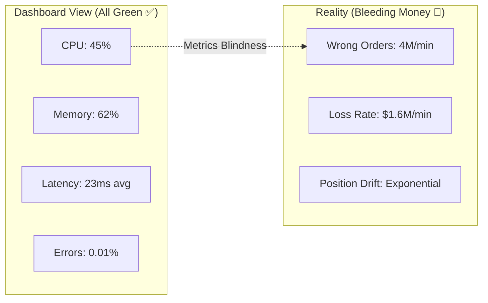
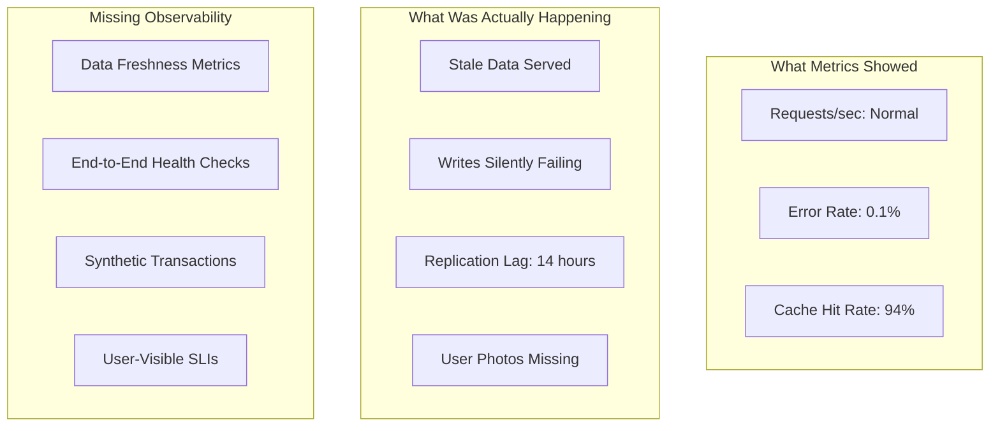

<!-- Navigation -->
[Home](/) → [Part I: Axioms](/part1-axioms/) → [Axiom 6](index.md) → **Observability Examples**

# Observability Examples

**From invisible outages to x-ray vision: real stories of finding needles in distributed haystacks**

---

## 🌏 Real-World Case Studies

### Case 1: The $72M Invisible Outage (Knight Capital Redux)

**Company**: Major Trading Firm  
**Impact**: $72M loss before anyone noticed  
**Root Cause**: Metrics showed green while system was hemorrhaging money

#### What the Dashboards Showed



#### The Missing Observability

```python
class TradingSystemObservability:
    """What they had vs what they needed"""
    
    def __init__(self):
# What they had: Technical metrics only
        self.basic_metrics = {
            'cpu_usage': Gauge('cpu_usage_percent'),
            'memory_usage': Gauge('memory_usage_bytes'),
            'request_latency': Histogram('request_latency_ms'),
            'error_rate': Counter('errors_total')
        }
        
# What they NEEDED: Business-aware observability
        self.business_metrics = {
            'order_volume': Counter('orders_placed_total', ['symbol', 'side', 'order_type']),
            'position_delta': Gauge('position_change_shares', ['symbol']),
            'pnl_unrealized': Gauge('pnl_unrealized_dollars', ['strategy']),
            'order_cancel_ratio': Gauge('order_cancel_ratio'),
            'market_impact': Histogram('market_impact_basis_points')
        }
        
# Critical: Anomaly detection
        self.anomaly_detectors = {
            'volume_spike': self.detect_volume_anomaly,
            'position_drift': self.detect_position_drift,
            'pnl_shock': self.detect_pnl_shock
        }
        
    def detect_volume_anomaly(self, current_volume):
        """Detect unusual trading volume"""
# Simple example - reality needs ML
        historical_avg = self.get_historical_average('volume', lookback_days=30)
        historical_std = self.get_historical_stddev('volume', lookback_days=30)
        
        z_score = (current_volume - historical_avg) / historical_std
        
        if abs(z_score) > 3:
            alert = {
                'severity': 'CRITICAL',
                'message': f'Volume anomaly detected: {z_score:.1f} standard deviations',
                'current': current_volume,
                'expected': historical_avg,
                'action': 'HALT_TRADING'
            }
            return alert
            
    def instrument_order_flow(self, order):
        """Rich instrumentation for every order"""
# Create trace span
        with tracer.start_span('place_order') as span:
            span.set_tag('order.symbol', order.symbol)
            span.set_tag('order.side', order.side)
            span.set_tag('order.quantity', order.quantity)
            span.set_tag('order.price', order.price)
            span.set_tag('order.type', order.type)
            
# Business context
            span.set_tag('position.before', self.get_position(order.symbol))
            span.set_tag('pnl.before', self.get_pnl(order.symbol))
            span.set_tag('market.spread', self.get_spread(order.symbol))
            
# Risk metrics
            span.set_tag('risk.var', self.calculate_var())
            span.set_tag('risk.exposure', self.calculate_exposure())
            
            try:
                result = self.place_order_internal(order)
                
# Post-execution metrics
                span.set_tag('execution.price', result.fill_price)
                span.set_tag('execution.slippage', result.slippage)
                span.set_tag('position.after', self.get_position(order.symbol))
                
# Critical: Business impact
                self.business_metrics['order_volume'].inc({
                    'symbol': order.symbol,
                    'side': order.side,
                    'order_type': order.type
                })
                
                position_change = result.quantity if order.side == 'BUY' else -result.quantity
                self.business_metrics['position_delta'].set(position_change, {'symbol': order.symbol})
                
                return result
                
            except Exception as e:
                span.set_tag('error', True)
                span.set_tag('error.message', str(e))
                raise

# The dashboard that would have saved $72M
def create_business_aware_dashboard():
    return {
        'row1': [
            {
                'title': 'Order Rate by Type',
                'query': 'rate(orders_placed_total[1m]) by (order_type)',
                'alert': 'rate > 10x historical average'
            },
            {
                'title': 'Position Drift',
                'query': 'position_change_shares',
                'alert': 'abs(position) > risk_limit'
            }
        ],
        'row2': [
            {
                'title': 'Unrealized P&L',
                'query': 'pnl_unrealized_dollars',
                'alert': 'pnl < -1000000'  # -$1M
            },
            {
                'title': 'Cancel/Fill Ratio',
                'query': 'order_cancel_ratio',
                'alert': 'ratio > 0.5'  # More cancels than fills
            }
        ],
        'row3': [
            {
                'title': 'Market Impact',
                'query': 'histogram_quantile(0.99, market_impact_basis_points)',
                'alert': 'impact > 10 bps'
            }
        ]
    }
```

---

### Case 2: The 14-Hour Ghost Outage (Facebook, 2019)

**System**: Facebook family of apps  
**Impact**: 14 hours partial outage, users saw stale data  
**Root Cause**: Cascading cache invalidation failure, metrics showed normal

#### The Observability Gap



#### Building Proper Data Freshness Observability

```python
import time
import hashlib
from datetime import datetime, timedelta

class DataFreshnessMonitor:
    """Monitor data freshness across distributed caches"""
    
    def __init__(self):
        self.canary_keys = set()  # Keys we monitor for freshness
        self.synthetic_writes = {}  # Track our test writes
        
    def inject_canary_data(self):
        """Continuously write timestamped canaries"""
        while True:
            canary_id = f"canary_{int(time.time())}"
            canary_data = {
                'id': canary_id,
                'timestamp': datetime.utcnow().isoformat(),
                'region': self.current_region,
                'hash': hashlib.sha256(canary_id.encode()).hexdigest()
            }
            
# Write to primary
            self.write_to_primary(canary_id, canary_data)
            self.synthetic_writes[canary_id] = canary_data
            
# Track for monitoring
            self.canary_keys.add(canary_id)
            
# Keep last 100 canaries
            if len(self.canary_keys) > 100:
                oldest = min(self.canary_keys)
                self.canary_keys.remove(oldest)
                del self.synthetic_writes[oldest]
                
            time.sleep(60)  # New canary every minute
            
    def measure_replication_lag(self):
        """Measure how stale our caches are"""
        lag_metrics = []
        
        for canary_id in self.canary_keys:
            original = self.synthetic_writes[canary_id]
            
# Read from each cache region
            for region in self.regions:
                cached_data = self.read_from_cache(region, canary_id)
                
                if cached_data:
# Calculate staleness
                    original_time = datetime.fromisoformat(original['timestamp'])
                    cached_time = datetime.fromisoformat(cached_data['timestamp'])
                    lag_seconds = (original_time - cached_time).total_seconds()
                    
                    lag_metrics.append({
                        'region': region,
                        'lag_seconds': lag_seconds,
                        'canary_id': canary_id
                    })
                    
# Alert if too stale
                    if lag_seconds > 300:  # 5 minutes
                        self.alert({
                            'severity': 'WARNING',
                            'region': region,
                            'lag': lag_seconds,
                            'message': f'Cache staleness detected: {lag_seconds}s'
                        })
                        
                else:
# Data missing entirely!
                    self.alert({
                        'severity': 'CRITICAL',
                        'region': region,
                        'canary_id': canary_id,
                        'message': 'Canary data missing from cache'
                    })
                    
        return lag_metrics

class EndToEndMonitor:
    """Monitor actual user experience"""
    
    def __init__(self):
        self.test_accounts = self.create_test_accounts()
        self.scenarios = [
            self.test_photo_upload,
            self.test_status_update,
            self.test_friend_request,
            self.test_message_send
        ]
        
    async def run_synthetic_user_journey(self):
        """Simulate real user actions end-to-end"""
        results = []
        
        for test_account in self.test_accounts:
            for scenario in self.scenarios:
                with tracer.start_span(f'synthetic_{scenario.__name__}') as span:
                    span.set_tag('account', test_account['id'])
                    span.set_tag('region', test_account['region'])
                    
                    try:
                        start_time = time.time()
                        result = await scenario(test_account)
                        duration = time.time() - start_time
                        
# Verify result
                        if not self.verify_scenario_result(result):
                            raise Exception("Scenario verification failed")
                            
# Record success
                        span.set_tag('duration_ms', duration * 1000)
                        span.set_tag('success', True)
                        
                        results.append({
                            'scenario': scenario.__name__,
                            'region': test_account['region'],
                            'duration_ms': duration * 1000,
                            'success': True
                        })
                        
                    except Exception as e:
                        span.set_tag('error', True)
                        span.set_tag('error.message', str(e))
                        
                        results.append({
                            'scenario': scenario.__name__,
                            'region': test_account['region'],
                            'error': str(e),
                            'success': False
                        })
                        
# Page on-call for user-visible failures
                        if scenario.__name__ in ['test_photo_upload', 'test_status_update']:
                            self.page_oncall({
                                'severity': 'CRITICAL',
                                'scenario': scenario.__name__,
                                'error': str(e),
                                'impact': 'User-visible feature broken'
                            })
                            
        return results
        
    async def test_photo_upload(self, account):
        """Test complete photo upload flow"""
# 1. Upload photo
        photo_id = await self.upload_photo(account, 'test_photo.jpg')
        
# 2. Verify it's accessible
        photo_url = await self.get_photo_url(photo_id)
        photo_data = await self.fetch_url(photo_url)
        
        if not photo_data:
            raise Exception("Uploaded photo not accessible")
            
# 3. Verify it appears in timeline
        timeline = await self.get_timeline(account)
        if photo_id not in [p['id'] for p in timeline['photos']]:
            raise Exception("Photo not in timeline")
            
# 4. Verify friends can see it
        friend_account = self.test_accounts[1]
        friend_timeline = await self.get_friend_timeline(friend_account, account['id'])
        if photo_id not in [p['id'] for p in friend_timeline['photos']]:
            raise Exception("Photo not visible to friends")
            
        return {'photo_id': photo_id, 'verified': True}
```

---

### Case 3: The Metric That Lied (Uber's Surge Pricing Bug)

**System**: Dynamic pricing algorithm  
**Impact**: Riders charged 10x normal fare, drivers saw no surge  
**Root Cause**: Percentile metrics hid bimodal distribution

#### The Deceptive Metrics

```python
class SurgePricingObservability:
    """What went wrong and how to fix it"""
    
    def __init__(self):
# The problematic metric
        self.bad_metric = Histogram(
            'surge_multiplier',
            'Surge pricing multiplier',
            buckets=[1, 1.5, 2, 2.5, 3]  # Missed the 10x outliers!
        )
        
# Better observability
        self.good_metrics = {
            'surge_distribution': Histogram(
                'surge_multiplier_full',
                'Surge pricing multiplier with extended buckets',
                buckets=[1, 1.2, 1.5, 2, 3, 5, 10, 20, 50, 100]
            ),
            'surge_by_region': Histogram(
                'surge_by_region',
                'Surge multiplier by region',
                ['region']
            ),
            'rider_driver_differential': Gauge(
                'surge_differential',
                'Difference between rider and driver surge',
                ['region']
            ),
            'surge_outliers': Counter(
                'surge_outliers_total',
                'Count of extreme surge events',
                ['region', 'magnitude']
            )
        }
        
    def detect_pricing_anomalies(self, ride_request):
        """Multi-dimensional anomaly detection"""
        rider_surge = ride_request['rider_surge_multiplier']
        driver_surge = ride_request['driver_surge_multiplier']
        region = ride_request['region']
        
        anomalies = []
        
# Check 1: Rider/Driver mismatch
        if abs(rider_surge - driver_surge) > 0.5:
            anomalies.append({
                'type': 'surge_mismatch',
                'rider_surge': rider_surge,
                'driver_surge': driver_surge,
                'severity': 'HIGH'
            })
            
# Check 2: Extreme surge
        if rider_surge > 5:
            anomalies.append({
                'type': 'extreme_surge',
                'multiplier': rider_surge,
                'severity': 'CRITICAL'
            })
            
# Track in metrics
            self.good_metrics['surge_outliers'].inc({
                'region': region,
                'magnitude': '5x-10x' if rider_surge <= 10 else '10x+'
            })
            
# Check 3: Regional anomaly
        regional_avg = self.get_regional_average(region)
        if rider_surge > regional_avg * 3:
            anomalies.append({
                'type': 'regional_anomaly',
                'multiplier': rider_surge,
                'regional_avg': regional_avg,
                'severity': 'MEDIUM'
            })
            
        return anomalies
        
    def create_surge_dashboard(self):
        """Dashboard that shows the full picture"""
        return {
            'panels': [
                {
                    'title': 'Surge Distribution Heatmap',
                    'type': 'heatmap',
                    'query': '''
                        surge_multiplier_full_bucket
                        by (le, region)
                    ''',
                    'description': 'Shows bimodal distributions'
                },
                {
                    'title': 'Rider vs Driver Surge',
                    'type': 'scatter',
                    'query': '''
                        surge_differential by (region)
                    ''',
                    'alert': 'abs(differential) > 0.5'
                },
                {
                    'title': 'Extreme Surge Events',
                    'type': 'counter',
                    'query': '''
                        rate(surge_outliers_total[5m])
                        by (magnitude)
                    ''',
                    'alert': 'rate > 0'  # Any extreme surge
                },
                {
                    'title': 'Revenue Impact',
                    'type': 'gauge',
                    'query': '''
                        sum(ride_revenue * surge_multiplier)
                        by (surge_bucket)
                    ''',
                    'description': 'Revenue by surge level'
                }
            ]
        }

# The fix: Multi-modal distribution detection
class BimodalDetector:
    def detect_bimodal(self, values):
        """Detect bimodal distributions that percentiles miss"""
        import numpy as np
        from sklearn.mixture import GaussianMixture
        
# Fit mixture model
        gmm = GaussianMixture(n_components=2)
        gmm.fit(np.array(values).reshape(-1, 1))
        
# Get the two modes
        means = gmm.means_.flatten()
        weights = gmm.weights_
        
# Check if truly bimodal
        if len(means) == 2 and min(weights) > 0.1:
            separation = abs(means[1] - means[0])
            avg_std = np.sqrt(gmm.covariances_).mean()
            
            if separation > 2 * avg_std:
                return {
                    'is_bimodal': True,
                    'mode1': means[0],
                    'mode2': means[1],
                    'weights': weights,
                    'alert': 'Bimodal distribution detected!'
                }
                
        return {'is_bimodal': False}
```

---

## The Four Golden Signals in Practice

### Complete Implementation with Real Examples

```python
from prometheus_client import Counter, Histogram, Gauge, Summary
import time
import psutil
import asyncio

class GoldenSignals:
    """Production-ready implementation of the four golden signals"""
    
    def __init__(self, service_name: str):
        self.service_name = service_name
        
# 1. LATENCY - Distribution of request durations
        self.latency = Histogram(
            f'{service_name}_request_duration_seconds',
            'Request latency distribution',
            ['method', 'endpoint', 'status_code'],
            buckets=[0.005, 0.01, 0.025, 0.05, 0.1, 0.25, 0.5, 1.0, 2.5, 5.0, 10.0]
        )
        
# 2. TRAFFIC - Request rate
        self.traffic = Counter(
            f'{service_name}_requests_total',
            'Total request count',
            ['method', 'endpoint', 'status_code']
        )
        
# 3. ERRORS - Failed requests
        self.errors = Counter(
            f'{service_name}_errors_total',
            'Total error count',
            ['method', 'endpoint', 'error_type']
        )
        
# 4. SATURATION - Resource utilization
        self.saturation = {
            'cpu': Gauge(f'{service_name}_cpu_usage_percent', 'CPU usage percentage'),
            'memory': Gauge(f'{service_name}_memory_usage_percent', 'Memory usage percentage'),
            'disk_io': Gauge(f'{service_name}_disk_io_usage_percent', 'Disk I/O usage percentage'),
            'network_io': Gauge(f'{service_name}_network_io_mbps', 'Network I/O in Mbps'),
            'connection_pool': Gauge(
                f'{service_name}_connection_pool_usage',
                'Database connection pool usage',
                ['pool_name']
            ),
            'queue_depth': Gauge(
                f'{service_name}_queue_depth',
                'Message queue depth',
                ['queue_name']
            )
        }
        
# Start background saturation monitoring
        self.start_saturation_monitoring()
        
    def track_request(self, method: str, endpoint: str):
        """Context manager to track all golden signals for a request"""
        class RequestTracker:
            def __init__(self, signals, method, endpoint):
                self.signals = signals
                self.method = method
                self.endpoint = endpoint
                self.start_time = None
                self.status_code = None
                self.error = None
                
            def __enter__(self):
                self.start_time = time.time()
                return self
                
            def __exit__(self, exc_type, exc_val, exc_tb):
                duration = time.time() - self.start_time
                
# Determine status
                if exc_val:
                    self.status_code = 500
                    error_type = type(exc_val).__name__
                    
# Track error
                    self.signals.errors.labels(
                        method=self.method,
                        endpoint=self.endpoint,
                        error_type=error_type
                    ).inc()
                    
# Track latency and traffic
                self.signals.latency.labels(
                    method=self.method,
                    endpoint=self.endpoint,
                    status_code=self.status_code or 200
                ).observe(duration)
                
                self.signals.traffic.labels(
                    method=self.method,
                    endpoint=self.endpoint,
                    status_code=self.status_code or 200
                ).inc()
                
# Don't suppress the exception
                return False
                
        return RequestTracker(self, method, endpoint)
        
    def start_saturation_monitoring(self):
        """Background task to monitor resource saturation"""
        async def monitor():
            while True:
# CPU
                cpu_percent = psutil.cpu_percent(interval=1)
                self.saturation['cpu'].set(cpu_percent)
                
# Memory
                memory = psutil.virtual_memory()
                self.saturation['memory'].set(memory.percent)
                
# Disk I/O
                disk_io = psutil.disk_io_counters()
# Calculate I/O percentage (simplified)
                io_percent = min(100, (disk_io.read_bytes + disk_io.write_bytes) / 1e9 * 100)
                self.saturation['disk_io'].set(io_percent)
                
# Network I/O
                net_io = psutil.net_io_counters()
                mbps = (net_io.bytes_sent + net_io.bytes_recv) / 1e6
                self.saturation['network_io'].set(mbps)
                
                await asyncio.sleep(10)  # Update every 10 seconds
                
# Start in background
        asyncio.create_task(monitor())
        
    def track_connection_pool(self, pool_name: str, active: int, max_size: int):
        """Track database connection pool saturation"""
        usage_percent = (active / max_size) * 100 if max_size > 0 else 0
        self.saturation['connection_pool'].labels(pool_name=pool_name).set(usage_percent)
        
    def track_queue_depth(self, queue_name: str, depth: int):
        """Track message queue saturation"""
        self.saturation['queue_depth'].labels(queue_name=queue_name).set(depth)

# Usage example
signals = GoldenSignals('api_service')

@app.route('/api/users/<user_id>')
async def get_user(user_id):
    with signals.track_request('GET', '/api/users/{id}') as tracker:
# Your business logic here
        user = await db.get_user(user_id)
        
# Track additional saturation metrics
        signals.track_connection_pool(
            'main_db',
            active=db.pool.active_connections,
            max_size=db.pool.max_size
        )
        
        if not user:
            tracker.status_code = 404
            raise NotFound("User not found")
            
        tracker.status_code = 200
        return user

# Grafana queries for golden signals dashboard
dashboard_queries = {
    'latency_p99': '''
        histogram_quantile(0.99,
            sum(rate(api_service_request_duration_seconds_bucket[5m])) 
            by (endpoint, le)
        )
    ''',
    'traffic_rate': '''
        sum(rate(api_service_requests_total[5m])) 
        by (endpoint)
    ''',
    'error_rate': '''
        sum(rate(api_service_errors_total[5m])) 
        by (endpoint, error_type)
        /
        sum(rate(api_service_requests_total[5m])) 
        by (endpoint)
    ''',
    'saturation_cpu': 'api_service_cpu_usage_percent',
    'saturation_connections': '''
        api_service_connection_pool_usage{pool_name="main_db"}
    '''
}
```

---

## Distributed Tracing Implementation

### Building Correlation Across Services

```python
import uuid
import json
from opentelemetry import trace
from opentelemetry.exporter.jaeger import JaegerExporter
from opentelemetry.sdk.trace import TracerProvider
from opentelemetry.sdk.trace.export import BatchSpanProcessor

class DistributedTracing:
    """Production distributed tracing setup"""
    
    def __init__(self, service_name: str):
# Set up tracer
        trace.set_tracer_provider(TracerProvider())
        self.tracer = trace.get_tracer(service_name)
        
# Configure exporter
        jaeger_exporter = JaegerExporter(
            agent_host_name="localhost",
            agent_port=6831,
        )
        
        span_processor = BatchSpanProcessor(jaeger_exporter)
        trace.get_tracer_provider().add_span_processor(span_processor)
        
    def extract_trace_context(self, headers):
        """Extract trace context from incoming request"""
        return {
            'trace_id': headers.get('X-Trace-ID'),
            'parent_span_id': headers.get('X-Span-ID'),
            'baggage': json.loads(headers.get('X-Trace-Baggage', '{}'))
        }
        
    def inject_trace_context(self, headers, span):
        """Inject trace context for outgoing request"""
        headers['X-Trace-ID'] = format(span.get_span_context().trace_id, '032x')
        headers['X-Span-ID'] = format(span.get_span_context().span_id, '016x')
        headers['X-Trace-Baggage'] = json.dumps(span.attributes)
        
    async def trace_database_query(self, query: str, params: dict):
        """Trace database operations with rich context"""
        with self.tracer.start_as_current_span("db.query") as span:
# Add semantic conventions
            span.set_attribute("db.system", "postgresql")
            span.set_attribute("db.statement", query)
            span.set_attribute("db.operation", self.extract_operation(query))
            
# Add custom attributes
            span.set_attribute("db.table", self.extract_table(query))
            span.set_attribute("db.row_count", len(params) if isinstance(params, list) else 1)
            
            try:
                result = await self.db.execute(query, params)
                span.set_attribute("db.rows_affected", result.rowcount)
                return result
                
            except Exception as e:
                span.set_status(trace.Status(trace.StatusCode.ERROR, str(e)))
                span.record_exception(e)
                raise
                
    def trace_external_api_call(self, method: str, url: str):
        """Trace external API calls"""
        span = self.tracer.start_span(f"http.{method.lower()}")
        
# Standard HTTP attributes
        span.set_attribute("http.method", method)
        span.set_attribute("http.url", url)
        span.set_attribute("http.target", self.extract_path(url))
        span.set_attribute("peer.service", self.extract_service(url))
        
        return span

# Example: Tracing across microservices
class OrderService:
    def __init__(self):
        self.tracing = DistributedTracing("order-service")
        
    async def create_order(self, order_data):
        with self.tracing.tracer.start_as_current_span("create_order") as span:
# Add business context
            span.set_attribute("order.user_id", order_data['user_id'])
            span.set_attribute("order.total", order_data['total'])
            span.set_attribute("order.items_count", len(order_data['items']))
            
# Step 1: Validate inventory
            with self.tracing.tracer.start_as_current_span("validate_inventory"):
                inventory_result = await self.call_inventory_service(
                    order_data['items']
                )
                
# Step 2: Process payment
            with self.tracing.tracer.start_as_current_span("process_payment"):
                payment_result = await self.call_payment_service(
                    order_data['payment_info']
                )
                
# Step 3: Send confirmation
            with self.tracing.tracer.start_as_current_span("send_confirmation"):
                await self.send_order_confirmation(order_data['user_id'])
                
            span.set_attribute("order.status", "completed")
            return {'order_id': order_id, 'status': 'success'}
```

---

## Structured Logging Best Practices

### From Log Soup to Queryable Data

```python
import structlog
import json
from datetime import datetime
import traceback

class StructuredLogging:
    """Production structured logging configuration"""
    
    def __init__(self, service_name: str):
# Configure structlog
        structlog.configure(
            processors=[
                structlog.stdlib.filter_by_level,
                structlog.stdlib.add_logger_name,
                structlog.stdlib.add_log_level,
                structlog.stdlib.PositionalArgumentsFormatter(),
                structlog.processors.TimeStamper(fmt="iso"),
                structlog.processors.StackInfoRenderer(),
                structlog.processors.format_exc_info,
                structlog.processors.UnicodeDecoder(),
                self.add_service_context,
                self.add_trace_context,
                structlog.processors.JSONRenderer()
            ],
            context_class=dict,
            logger_factory=structlog.stdlib.LoggerFactory(),
            cache_logger_on_first_use=True,
        )
        
        self.service_name = service_name
        self.logger = structlog.get_logger()
        
    def add_service_context(self, logger, method_name, event_dict):
        """Add service-level context to all logs"""
        event_dict['service'] = self.service_name
        event_dict['environment'] = os.getenv('ENVIRONMENT', 'development')
        event_dict['version'] = os.getenv('SERVICE_VERSION', 'unknown')
        event_dict['host'] = socket.gethostname()
        event_dict['pid'] = os.getpid()
        return event_dict
        
    def add_trace_context(self, logger, method_name, event_dict):
        """Add distributed tracing context"""
        span = trace.get_current_span()
        if span:
            span_context = span.get_span_context()
            event_dict['trace_id'] = format(span_context.trace_id, '032x')
            event_dict['span_id'] = format(span_context.span_id, '016x')
        return event_dict
        
    def log_request(self, request, response=None, error=None):
        """Structured request logging"""
        log_data = {
            'event': 'http_request',
            'method': request.method,
            'path': request.path,
            'query_params': dict(request.query_params),
            'user_agent': request.headers.get('User-Agent'),
            'ip': request.client.host,
            'request_id': request.headers.get('X-Request-ID', str(uuid.uuid4()))
        }
        
        if response:
            log_data.update({
                'status_code': response.status_code,
                'response_time_ms': response.headers.get('X-Response-Time'),
                'content_length': len(response.content)
            })
            
        if error:
            log_data.update({
                'error': True,
                'error_type': type(error).__name__,
                'error_message': str(error),
                'stack_trace': traceback.format_exc()
            })
            
        self.logger.info(**log_data)
        
    def log_business_event(self, event_type: str, **kwargs):
        """Log business-specific events"""
        self.logger.info(
            event=event_type,
            event_category='business',
            **kwargs
        )

# Usage examples
logger = StructuredLogging("payment-service")

# Rich business event logging
logger.log_business_event(
    'payment_processed',
    user_id=user_id,
    amount=amount,
    currency='USD',
    payment_method='credit_card',
    processor='stripe',
    processing_time_ms=processing_time,
    success=True
)

# Error logging with context
try:
    result = process_payment(payment_data)
except PaymentError as e:
    logger.logger.error(
        'payment_failed',
        user_id=payment_data['user_id'],
        amount=payment_data['amount'],
        error_code=e.code,
        error_message=str(e),
        payment_method=payment_data['method'],
        exc_info=True  # Include stack trace
    )
    
# Query examples in your log aggregator:
# Find all failed payments over $100:
# {"event": "payment_failed", "amount": {"$gt": 100}}

# Find slow API calls:
# {"event": "http_request", "response_time_ms": {"$gt": 1000}}

# Trace a request across services:
# {"trace_id": "1234567890abcdef1234567890abcdef"}
```

---

## Custom Business Metrics

### Connecting Technical Metrics to Business Outcomes

```python
class BusinessMetrics:
    """Track what actually matters to the business"""
    
    def __init__(self):
# Revenue metrics
        self.revenue = Counter(
            'business_revenue_total',
            'Total revenue in cents',
            ['product', 'payment_method', 'region']
        )
        
        self.average_order_value = Summary(
            'business_order_value_dollars',
            'Average order value',
            ['product_category']
        )
        
# User engagement
        self.active_users = Gauge(
            'business_active_users',
            'Currently active users',
            ['user_type', 'platform']
        )
        
        self.user_journey_duration = Histogram(
            'business_user_journey_duration_seconds',
            'Time from landing to conversion',
            ['journey_type', 'conversion_type'],
            buckets=[10, 30, 60, 120, 300, 600, 1800, 3600]
        )
        
# Feature adoption
        self.feature_usage = Counter(
            'business_feature_usage_total',
            'Feature usage by users',
            ['feature_name', 'user_segment']
        )
        
# Customer satisfaction
        self.nps_score = Histogram(
            'business_nps_score',
            'Net Promoter Score distribution',
            buckets=list(range(0, 11))
        )
        
    def track_purchase(self, order):
        """Track purchase with business context"""
# Revenue
        self.revenue.labels(
            product=order['product_type'],
            payment_method=order['payment_method'],
            region=order['user_region']
        ).inc(order['total_cents'])
        
# AOV
        self.average_order_value.labels(
            product_category=order['category']
        ).observe(order['total_cents'] / 100)
        
# Feature adoption (did they use discount?)
        if order.get('discount_code'):
            self.feature_usage.labels(
                feature_name='discount_codes',
                user_segment=order['user_segment']
            ).inc()
            
    def track_user_journey(self, user_id, journey_start, conversion_time=None):
        """Track complete user journey"""
        if conversion_time:
            duration = conversion_time - journey_start
            self.user_journey_duration.labels(
                journey_type='signup_to_purchase',
                conversion_type='purchase'
            ).observe(duration)
            
    def create_business_dashboard(self):
        """Dashboards that executives actually care about"""
        return {
            'revenue_dashboard': [
                {
                    'title': 'Revenue by Product (24h)',
                    'query': 'sum(rate(business_revenue_total[24h])) by (product) / 100'
                },
                {
                    'title': 'Average Order Value Trend',
                    'query': 'avg_over_time(business_order_value_dollars[1h])'
                }
            ],
            'user_engagement': [
                {
                    'title': 'Active Users by Platform',
                    'query': 'business_active_users'
                },
                {
                    'title': 'Conversion Funnel Duration',
                    'query': '''
                        histogram_quantile(0.5, 
                            business_user_journey_duration_seconds_bucket
                        )
                    '''
                }
            ],
            'feature_adoption': [
                {
                    'title': 'Feature Usage by Segment',
                    'query': 'rate(business_feature_usage_total[1h])'
                }
            ]
        }
```

---

## Key Takeaways

### The Observability Maturity Model

| Level | Characteristics | Tools | Business Impact |
|-------|----------------|-------|-----------------||
| **1: Blind** | Logs to files, no metrics | grep, tail | Outages last hours |
| **2: Reactive** | Basic metrics, some dashboards | Nagios, Graphite | Find problems after users |
| **3: Proactive** | Golden signals, alerting | Prometheus, Grafana | Detect before users |
| **4: Insightful** | Distributed tracing, structured logs | Jaeger, ELK | Understand complex failures |
| **5: Predictive** | ML anomaly detection, business KPIs | Custom ML, Datadog | Prevent problems |

### Essential Practices

1. **Instrument Early and Often**
   - Add metrics at design time
   - Structure logs from day one
   - Include business context

2. **Alert on Symptoms, Debug with Causes**
   - Page on user-visible impact
   - Dashboard for investigation
   - Logs for root cause

3. **Test Your Observability**
   - Chaos engineering
   - Game days
   - Observability drills

4. **Connect to Business Value**
   - Track revenue impact
   - Monitor user journeys
   - Alert on business KPIs

---

**Previous**: [Overview](./) | **Next**: [Exercises](exercises.md)
