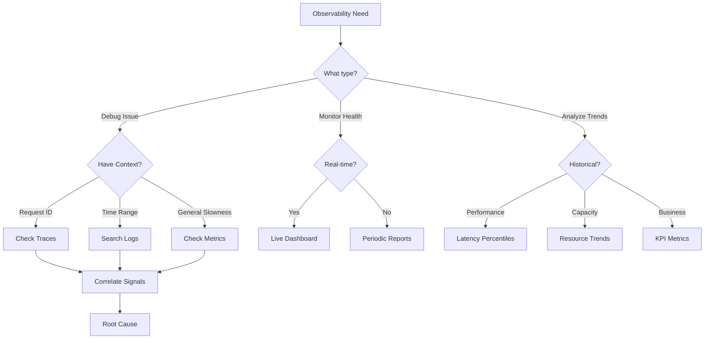

<!-- Navigation -->
[Home](/) → [Part I: Axioms](/part1-axioms/) → [Axiom 6](index.md) → **Axiom 6: Observability**

# Axiom 6: Observability

---


## 🔥 The Constraint

### The Fundamental Limit

**You cannot observe everything in a distributed system**

This constraint emerges from **Heisenberg uncertainty principle + information theory limits**. No amount of engineering can violate this fundamental principle—we can only work within its boundaries.

### Physics Foundation

The practical manifestation of this constraint:
- **Theoretical basis**: Heisenberg uncertainty principle + information theory limits
- **Practical limit**: Observer effect, finite bandwidth, sampling limits
- **Real-world impact**: Debugging and monitoring have fundamental limitations

### Why This Constraint Exists

Unlike software bugs or implementation details, this is a fundamental law of our universe. Understanding this constraint helps us:

1. **Set realistic expectations** - Know what's physically impossible
2. **Make better trade-offs** - Optimize within the possible
3. **Design robust systems** - Work with the constraint, not against it
4. **Avoid false solutions** - Don't chase impossible optimizations

!!! warning "Common Misconception"
    This constraint cannot be "solved" or "eliminated"—only managed and optimized within its boundaries.

---

## 💡 Why It Matters

Debugging and monitoring have fundamental limitations

### Business Impact

This constraint directly affects:
- **User experience**: Performance and reliability
- **Development velocity**: Time-to-market and maintenance
- **Operational costs**: Infrastructure and support
- **Competitive advantage**: System capabilities and scalability

### Technical Implications

Every engineering decision must account for this constraint:
- **Architecture patterns**: Choose designs that work with the constraint
- **Technology selection**: Pick tools that optimize within the boundaries
- **Performance optimization**: Focus on what's actually improvable
- **Monitoring and alerting**: Track metrics related to the constraint

---

## 🚫 Common Misconceptions

Many engineers hold false beliefs about this constraint:

1. **"More metrics always improve observability"**
   - This violates the fundamental constraint
   - Reality: The constraint makes this impossible

2. **"Distributed tracing captures everything"**
   - This violates the fundamental constraint
   - Reality: The constraint makes this impossible

3. **"Perfect monitoring is achievable"**
   - This violates the fundamental constraint
   - Reality: The constraint makes this impossible


### Reality Check

The constraint is absolute—these misconceptions arise from:
- **Wishful thinking**: Hoping engineering can overcome physics
- **Local optimization**: Solving one problem while creating others
- **Vendor marketing**: Oversimplified claims about complex systems
- **Incomplete understanding**: Not seeing the full system implications

---

## ⚙️ Practical Implications

How this constraint shapes real system design:

1. **Design systems to be inherently observable**
2. **Use structured logging and distributed tracing**
3. **Focus on business metrics, not just technical ones**
4. **Accept uncertainty in distributed debugging**


### Engineering Guidelines

When designing systems, always:
- **Start with the constraint**: Acknowledge it in your architecture
- **Measure the constraint**: Monitor relevant metrics
- **Design around the constraint**: Use patterns that work with it
- **Communicate the constraint**: Help stakeholders understand limitations

### Success Patterns

Teams that respect this constraint:
- Set realistic performance goals
- Choose appropriate architectural patterns
- Invest in proper monitoring and observability
- Make trade-offs explicit and data-driven

---


## Level 1: Intuition (Start Here) 🌱

### The Night Driving Metaphor

Imagine driving at night:
- **Clear night, good headlights**: You see the road ahead
- **Foggy night, dim lights**: You see 10 feet, drive slowly
- **No lights**: You crash immediately
- **Distributed system**: You're driving 100 cars simultaneously in fog

**Your observability is your headlights.** Without it:
- Can't see problems coming
- Can't understand what happened
- Can't fix what's broken
- Can't prove things are working

### Real-World Analogy: Medical Diagnosis

```yaml
Patient: "I don't feel well"

Bad Doctor (No Observability):
- "Take two aspirin"
- No tests, no measurements
- Hope for the best

Good Doctor (With Observability):
- Temperature: 101°F (fever)
- Blood pressure: 150/95 (high)
- Blood test: High white cells
- Diagnosis: Bacterial infection
- Treatment: Specific antibiotic
```

**Your system is the patient. Observability is your medical equipment.**

### Your First Observability Experiment

### The Beginner's Observability Pyramid

```text
          ▲
         /│\
        / │ \  Traces
       /  │  \ (Nice to have)
      /   │   \
     /──────────\
    /     │     \ Metrics
   /      │      \ (Should have)
  /       │       \
 /─────────────────\
/        Logs       \ (Must have)
─────────────────────

Start at the bottom, work your way up
```

---

## Level 2: Foundation (Understand Why) 🌿

### Core Principle: The Heisenberg Problem

In quantum mechanics, observing a system changes it. In distributed systems, this manifests as:

```yaml
The Observer Effect:
  - Every metric collection adds latency
  - Every log write consumes I/O
  - Every trace propagation uses bandwidth
  - Too much observability can kill performance
  
The Information Limit:
  - Can't capture every event (volume)
  - Can't store forever (cost)
  - Can't query instantly (physics)
  - Must sample and approximate
```

### The Three Pillars Explained

| Pillar | Purpose | Strengths | Weaknesses | Cost |
|--------|---------|-----------|------------|------|
| **Logs** | Record events | Detail, context | Volume, unstructured | High |
| **Metrics** | Track numbers | Aggregated, efficient | No context | Low |
| **Traces** | Show flow | Request path, timing | Sampling needed | Medium |

#### 1. Logs: The Detailed Record

```python
# Bad: Unstructured, hard to parse
logger.info(f"User {user_id} logged in at {time}")

# Good: Structured, queryable
logger.info("user_login", {
    "user_id": user_id,
    "timestamp": time,
    "ip_address": request.ip,
    "user_agent": request.user_agent,
    "session_id": session.id,
    "correlation_id": request.correlation_id
})

# Best: With context propagation
with log_context(correlation_id=request.correlation_id):
    logger.info("user_login", {
        "event": "login_success",
        "user_id": user_id,
        "latency_ms": latency
    })
```

#### 2. Metrics: The Aggregated View

```python
# The Four Golden Signals (Google SRE)
class GoldenSignals:
    def __init__(self):
        # 1. Latency
        self.latency_histogram = Histogram(
            'request_duration_seconds',
            'Request latency',
            buckets=[0.001, 0.01, 0.1, 0.5, 1.0, 5.0]
        )
        
        # 2. Traffic
        self.request_rate = Counter(
            'requests_total',
            'Total requests',
            ['method', 'endpoint', 'status']
        )
        
        # 3. Errors
        self.error_rate = Counter(
            'errors_total',
            'Total errors',
            ['type', 'endpoint']
        )
        
        # 4. Saturation
        self.saturation = Gauge(
            'resource_usage_ratio',
            'Resource saturation',
            ['resource']
        )
```

#### 3. Traces: The Flow Visualization

```python
from opentelemetry import trace

tracer = trace.get_tracer(__name__)

@tracer.start_as_current_span("process_order")
def process_order(order_id):
    span = trace.get_current_span()
    span.set_attribute("order.id", order_id)
    
    # Validate order
    with tracer.start_as_current_span("validate_order") as span:
        validation_result = validate(order_id)
        span.set_attribute("validation.passed", validation_result)
    
    # Process payment
    with tracer.start_as_current_span("process_payment") as span:
        payment_result = charge_payment(order_id)
        span.set_attribute("payment.status", payment_result.status)
    
    # Ship order
    with tracer.start_as_current_span("ship_order") as span:
        shipping_id = create_shipment(order_id)
        span.set_attribute("shipping.id", shipping_id)
```

### 🎬 Failure Vignette: The Twitter Fail Whale Era

**Period**: 2007-2013  
**Problem**: No observability into Ruby on Rails monolith  
**Impact**: Daily outages, "Fail Whale" became a meme

```yaml
The Dark Ages (2007-2009):
  - No metrics beyond "is it up?"
  - Logs scattered across 100s of servers
  - Debugging by SSH-ing to random boxes
  - MTTR measured in hours
  
The Awakening (2010):
  - Implemented StatsD for metrics
  - Centralized logging with Scribe
  - Custom "Zipkin" for distributed tracing
  - MTTR dropped to minutes
  
The Victory (2013):
  - Real-time dashboards for everything
  - Anomaly detection on key metrics
  - Distributed tracing on every request
  - Fail Whale retired permanently
  
Lesson: "Flying blind" is not an option at scale
```

### The Cost-Value Matrix

| Observability Level | Cost/Month | Value | When to Use |
|-------------------|------------|--------|------------|
| **None** | $0 | Hope & Prayer | Never |
| **Basic Logs** | $100 | Can debug (slowly) | Prototypes |
| **Logs + Metrics** | $1K | Can monitor health | Small apps |
| **Full Pillars** | $10K | Can trace issues | Production |
| **Advanced** | $100K+ | Can predict issues | Scale |

---

## Level 3: Deep Dive (Master the Patterns) 🌳

### The Four Golden Signals Pattern

#### 1. Latency: The Speed of Success (and Failure)

```python
# Measure latency correctly
class LatencyTracker:
    def __init__(self):
        # Track success and error latency separately!
        self.success_histogram = Histogram(
            'request_duration_success_seconds',
            'Successful request latency'
        )
        self.error_histogram = Histogram(
            'request_duration_error_seconds',
            'Failed request latency'
        )
    
    def record(self, duration, success):
        if success:
            self.success_histogram.observe(duration)
        else:
            # Errors often fail fast - track separately
            self.error_histogram.observe(duration)

# Why separate? Errors can hide latency issues
# Example: 99% of requests take 100ms (good)
#          1% timeout at 30s (bad)
# Average: 396ms (looks ok, but it's not!)
```

#### 2. Traffic: The Pulse of Your System

```yaml
Measure at Multiple Levels:
  - Requests per second (RPS)
  - Queries per second (QPS)  
  - Transactions per second (TPS)
  - Bytes per second (bandwidth)
  - Connections per second
  - Active users per minute
  
Key Insight: Traffic patterns reveal:
  - Daily/weekly cycles
  - Growth trends
  - Anomalous spikes
  - Capacity needs
```

#### 3. Errors: Not All Failures Are Equal

```python
class ErrorClassifier:
    def classify(self, error):
        if isinstance(error, ValidationError):
            return "client_error"  # 4xx - their fault
        elif isinstance(error, TimeoutError):
            return "timeout"      # Could be us
        elif isinstance(error, DatabaseError):
            return "dependency"   # External failure
        elif isinstance(error, InternalError):
            return "server_error" # 5xx - our fault
        else:
            return "unknown"      # Needs investigation

# Track errors by category
error_counter = Counter(
    'errors_by_category',
    'Errors classified by type',
    ['category', 'service']
)
```

#### 4. Saturation: The Breaking Point

```yaml
Resource Saturation Indicators:
  CPU:
    - Utilization > 80% (getting full)
    - Load average > CPU count (overloaded)
    - Throttling occurring (maxed out)
    
  Memory:
    - Usage > 85% (danger zone)
    - Swap usage > 0 (performance killer)
    - OOM kills (system protecting itself)
    
  Disk:
    - Usage > 90% (critically full)
    - I/O wait > 10% (bottleneck)
    - Queue depth growing (backing up)
    
  Network:
    - Bandwidth > 80% (congestion)
    - Packet loss > 0.01% (problems)
    - Connection pool exhausted (at limit)
```

### Observability Patterns by System Type

| System Type | Key Metrics | Critical Logs | Trace Focus |
|------------|-------------|---------------|-------------|
| **Web API** | Latency, 4xx/5xx rates | Access logs, errors | Request flow |
| **Database** | Query time, connections | Slow queries, deadlocks | Transaction path |
| **Queue** | Depth, processing rate | Poison messages | Message lifecycle |
| **Cache** | Hit rate, evictions | Cache misses | Access patterns |
| **Batch Job** | Duration, success rate | Job status, failures | Stage timing |
| **Stream** | Lag, throughput | Checkpoints, errors | Event flow |

### The Sampling Strategy

```python
class AdaptiveSampler:
    """Sample more when interesting things happen"""
    
    def should_sample(self, span):
        # Always sample errors
        if span.status == 'ERROR':
            return True
            
        # Always sample slow requests
        if span.duration > 1000:  # 1 second
            return True
            
        # Sample new endpoints
        if self.is_new_endpoint(span.endpoint):
            return True
            
        # Sample based on traffic
        traffic_rate = self.get_traffic_rate()
        if traffic_rate < 100:  # Low traffic
            return True  # Sample everything
        elif traffic_rate < 1000:
            return random.random() < 0.1  # 10%
        else:  # High traffic  
            return random.random() < 0.01  # 1%

# Results in practice:
# - 100% of errors captured
# - 100% of slow requests captured  
# - Representative sample of normal traffic
# - Costs controlled at scale
```

### Anti-Pattern Gallery

#### 1. The Vanity Metrics Dashboard

```yaml
Bad Dashboard:
  - Server uptime: 99.999% (meaningless)
  - Total requests served: 1 billion (so what?)
  - Average response time: 250ms (hides outliers)
  - CPU usage: 45% (which CPU? when?)
  
Good Dashboard:
  - User-facing availability: 99.9%
  - Error budget remaining: 43 minutes
  - p95 latency trend: 450ms ↑ 10%
  - Saturation forecasting: 74 days to capacity
```

#### 2. The Alert Storm

```yaml
Bad Alerting:
  - CPU > 80% (too noisy)
  - Any error (too broad)
  - Disk space < 10GB (too late)
  - Response time > average (meaningless)
  
Good Alerting:
  - Error rate > 1% for 5 minutes
  - p99 latency > SLO for 2 minutes
  - Disk full in < 4 hours at current rate
  - 5 sequential health check failures
```

#### 3. The Log Explosion

```python
# Bad: Logs that provide no value
logger.debug("Entering function")
logger.debug("About to process")
logger.debug("Processing")
logger.debug("Still processing")
logger.debug("Done processing")
logger.debug("Exiting function")

# Good: Logs that aid debugging
logger.info("order_processed", {
    "order_id": order.id,
    "user_id": user.id,
    "total": order.total,
    "items": len(order.items),
    "processing_time_ms": duration,
    "payment_method": order.payment_method,
    "shipping_method": order.shipping_method
})
```

#### 4. The Cardinality Bomb

```python
# Bad: Unique label per request = millions of series
request_counter.labels(
    user_id=request.user_id,  # 1M users
    session_id=request.session_id,  # Infinite
    request_id=request.id  # Unique per request
).inc()

# Good: Bounded cardinality
request_counter.labels(
    method=request.method,  # ~10 values
    endpoint=request.endpoint,  # ~100 values
    status_code=response.status,  # ~20 values
    region=request.region  # ~10 values
).inc()
# Total series: 10 × 100 × 20 × 10 = 200K (manageable)
```

---

## Level 4: Expert (Production Patterns) 🌲

### Case Study: Uber's Observability Revolution

**Challenge**: 4,000+ microservices, 4M requests/second, 100+ data centers

```yaml
The Journey (2015-2020):

Phase 1 - The Crisis (2015):
  - Outages took hours to diagnose
  - No unified view across services
  - Engineers afraid to deploy
  - Customer complaints skyrocketing
  
Phase 2 - Build Foundation (2016-2017):
  - Standardized logging format
  - Deployed Prometheus everywhere
  - Built custom tracing (Jaeger)
  - Created service dependency maps
  
Phase 3 - Scale Solutions (2018-2019):
  Problems:
    - Metrics: 10B series, $2M/month
    - Logs: 50TB/day, $3M/month
    - Traces: Sampling missing issues
    
  Solutions:
    - Built M3 (metrics database)
    - Intelligent log sampling
    - Context-aware trace sampling
    - Cost reduced by 80%
  
Phase 4 - Intelligence (2020+):
  - ML-driven anomaly detection
  - Automated root cause analysis
  - Predictive alerting
  - Self-healing systems
  
Results:
  - MTTR: 4 hours → 15 minutes
  - Deploy confidence: 4x increase
  - Observability cost: $5M → $1M/month
  - Engineer productivity: 3x
```

### Advanced Patterns

#### 1. Exemplar Pattern: Connecting Metrics to Traces

```python
class ExemplarCollector:
    """Link high-cardinality traces to low-cardinality metrics"""
    
    def record_with_exemplar(self, metric, value, trace_id):
        # Record metric
        metric.observe(value)
        
        # Store exemplar (sampled)
        if self.should_store_exemplar(value):
            self.exemplar_storage.store({
                'metric': metric.name,
                'value': value,
                'trace_id': trace_id,
                'timestamp': time.time()
            })
    
    def should_store_exemplar(self, value):
        # Store outliers and sample normal values
        if value > self.p99_threshold:
            return True  # Always store outliers
        return random.random() < 0.001  # 0.1% of normal

# Usage: "Show me traces for requests > 1s"
# Click metric → Get exemplar → Jump to trace
```

#### 2. Service Level Objectives (SLO) Monitoring

```python
class SLOMonitor:
    def __init__(self, target=0.999):
        self.target = target
        self.window = 30 * 24 * 60 * 60  # 30 days
        
    def calculate_error_budget(self):
        # Get success rate over window
        success_rate = self.get_success_rate(self.window)
        
        # Calculate budget
        budget_total = 1 - self.target
        budget_used = 1 - success_rate
        budget_remaining = budget_total - budget_used
        
        # Burn rate (how fast we're using budget)
        burn_rate = budget_used / (time_elapsed / self.window)
        
        # Time until budget exhausted
        if burn_rate > 0:
            time_to_exhaustion = budget_remaining / burn_rate * self.window
        else:
            time_to_exhaustion = float('inf')
            
        return {
            'budget_remaining_pct': budget_remaining * 100,
            'burn_rate': burn_rate,
            'time_to_exhaustion_hours': time_to_exhaustion / 3600,
            'action_required': burn_rate > 1.0  # Burning too fast
        }
```

#### 3. Synthetic Monitoring

```python
class SyntheticMonitor:
    """Probe your system continuously"""
    
    @every(60)  # Every minute
    def probe_critical_path(self):
        # Create synthetic user journey
        trace_id = generate_trace_id()
        
        with tracer.start_span("synthetic_probe", trace_id=trace_id):
            # 1. Login
            login_result = self.client.login(
                username="synthetic_user",
                password="synthetic_pass"
            )
            
            # 2. Browse catalog  
            catalog = self.client.get_catalog()
            
            # 3. Add to cart
            cart = self.client.add_to_cart(
                item_id="synthetic_item"
            )
            
            # 4. Checkout
            order = self.client.checkout(
                payment_method="synthetic_card"
            )
            
            # 5. Cancel (don't actually fulfill)
            self.client.cancel_order(order.id)
            
        # Record results
        self.metrics.record({
            'synthetic_success': login_result.success,
            'synthetic_latency': trace.duration,
            'synthetic_path_complete': order is not None
        })
```

#### 4. Chaos Observability

```python
class ChaosObserver:
    """Observe system during chaos experiments"""
    
    def observe_experiment(self, experiment):
        # Baseline metrics before chaos
        baseline = self.capture_metrics()
        
        # Start enhanced collection
        with self.enhanced_collection():
            # Run chaos experiment
            experiment.run()
            
            # Collect during chaos
            chaos_metrics = self.capture_metrics()
            
            # Wait for recovery
            time.sleep(experiment.recovery_time)
            
            # Collect after recovery
            recovery_metrics = self.capture_metrics()
        
        # Analyze impact
        return {
            'baseline': baseline,
            'impact': self.calculate_impact(baseline, chaos_metrics),
            'recovery_time': self.measure_recovery(baseline, recovery_metrics),
            'blast_radius': self.identify_affected_services(),
            'unexpected_impacts': self.find_surprises(baseline, chaos_metrics)
        }
```

### Observability Economics

#### Cost Breakdown (Typical 1000 req/s Service)

| Component | Volume | Storage | Cost/Month | % of Total |
|-----------|--------|---------|------------|------------|
| **Metrics** | 1M series | 30 days | $2,000 | 20% |
| **Logs** | 1TB/day | 7 days | $5,000 | 50% |
| **Traces** | 10% sampling | 3 days | $3,000 | 30% |
| **Total** | - | - | $10,000 | 100% |

#### Cost Optimization Strategies

```yaml
Metrics Optimization:
  1. Reduce cardinality:
     - Remove user_id labels
     - Aggregate before sending
     - Use recording rules
  2. Adjust retention:
     - Raw: 15 days
     - 5m aggregates: 60 days
     - 1h aggregates: 2 years
  3. Optimize queries:
     - Precompute dashboards
     - Cache common queries
  Result: 60% cost reduction

Logs Optimization:
  1. Structured sampling:
     - 100% errors
     - 10% warnings  
     - 1% info
     - 0.1% debug
  2. Field extraction:
     - Index only key fields
     - Store rest as blob
  3. Tiered storage:
     - Hot: 24 hours (SSD)
     - Warm: 7 days (HDD)
     - Cold: 30 days (S3)
  Result: 75% cost reduction

Traces Optimization:
  1. Tail-based sampling:
     - 100% errors/slow
     - 1% success baseline
  2. Span reduction:
     - Don't trace every method
     - Focus on service boundaries
  3. Compression:
     - Protobuf encoding
     - Columnar storage
  Result: 80% cost reduction
```

#### ROI Calculation

```yaml
Costs:
  - Infrastructure: $10K/month
  - Engineering time: 2 FTE = $30K/month
  - Total: $40K/month = $480K/year

Benefits:
  - Reduced MTTR: 4hr → 30min
  - Downtime cost: $100K/hour
  - Incidents/month: 5
  - Savings: 3.5hr × 5 × $100K = $1.75M/month
  
  - Faster debugging: 50% improvement
  - Engineer efficiency: 20 eng × 10hr/month saved
  - Value: 200hr × $150/hr = $30K/month
  
  - Total benefit: $1.78M/month = $21.4M/year
  
ROI: 4,358% (pays for itself in < 1 week)
```

---

## Level 5: Mastery (Push the Boundaries) 🌴

### The Netflix Edge: Chaos Observability

**Philosophy**: "The best way to avoid failure is to fail constantly"

```yaml
Netflix's Observability Evolution:

Era 1 - Traditional Monitoring (2008-2010):
  - Nagios alerts
  - Manual investigation
  - Hours to resolve issues
  
Era 2 - Data-Driven (2011-2014):
  - Atlas: Time-series metrics at scale
  - 2.5M metrics/second per instance
  - Real-time anomaly detection
  
Era 3 - Chaos Integration (2015-2018):
  - Chaos Monkey → Chaos Kong
  - Automated failure injection
  - Observe system under stress
  - Build confidence through destruction
  
Era 4 - Predictive (2019+):
  - ML models predict failures
  - Auto-remediation systems
  - Self-healing infrastructure
  - Incidents prevented, not resolved

Key Innovation: Intuition Engineering
  - Surface insights, not just data
  - Guide engineers to root cause
  - Learn from every incident
  - Build institutional memory
```

### Advanced Observability Techniques

#### 1. Distributed Tracing at Scale

```python
class EdgeTracingSampler:
    """Netflix's edge-based sampling strategy"""
    
    def __init__(self):
        self.device_samples = {}  # Track per device
        self.user_samples = {}    # Track per user
        self.global_budget = 1000000  # 1M traces/day
        
    def should_trace(self, request):
        # Always trace errors
        if request.will_error():  # Predictive!
            return True
            
        # Device-based sampling (new devices = interesting)
        device_id = request.device_id
        if device_id not in self.device_samples:
            self.device_samples[device_id] = 0
            return True  # First time seeing device
            
        # User experience sampling
        user_id = request.user_id
        if self.user_having_issues(user_id):
            return True  # User experiencing problems
            
        # Budget-aware sampling
        if self.daily_budget_remaining() > 0:
            return self.adaptive_sample(request)
            
        return False
```

#### 2. Correlation Analysis

```python
class IncidentCorrelator:
    """Find hidden relationships in observability data"""
    
    def correlate_incident(self, alert):
        correlations = []
        
        # Time-based correlation
        window = (alert.time - 300, alert.time + 300)  # ±5 min
        
        # Find metric anomalies
        metric_anomalies = self.find_metric_anomalies(window)
        for anomaly in metric_anomalies:
            correlation = self.calculate_correlation(
                alert.signal,
                anomaly.signal
            )
            if correlation > 0.7:
                correlations.append({
                    'type': 'metric',
                    'signal': anomaly,
                    'correlation': correlation
                })
        
        # Find log patterns
        log_patterns = self.find_log_patterns(window)
        for pattern in log_patterns:
            if self.is_relevant(pattern, alert):
                correlations.append({
                    'type': 'log',
                    'pattern': pattern,
                    'confidence': pattern.confidence
                })
        
        # Find trace anomalies
        trace_issues = self.find_trace_issues(window)
        for issue in trace_issues:
            if issue.service in alert.dependency_graph:
                correlations.append({
                    'type': 'trace',
                    'issue': issue,
                    'impact': issue.blast_radius
                })
        
        return sorted(correlations, key=lambda x: x.get('correlation', 0))
```

#### 3. Predictive Observability

```python
class PredictiveMonitor:
    """Predict failures before they happen"""
    
    def __init__(self):
        self.models = {
            'disk_full': DiskFullPredictor(),
            'memory_leak': MemoryLeakDetector(),
            'traffic_spike': TrafficPredictor(),
            'cascade_failure': CascadeAnalyzer()
        }
    
    def predict_issues(self, time_horizon=3600):
        predictions = []
        
        for name, model in self.models.items():
            # Get current state
            current_state = self.get_system_state()
            
            # Predict future
            prediction = model.predict(
                current_state,
                time_horizon
            )
            
            if prediction.probability > 0.7:
                predictions.append({
                    'issue': name,
                    'probability': prediction.probability,
                    'time_to_impact': prediction.eta,
                    'severity': prediction.severity,
                    'prevention': prediction.prevention_action
                })
        
        return sorted(predictions, key=lambda x: x['time_to_impact'])
```

### Future of Observability

#### 1. AI-Driven Root Cause Analysis

```yaml
Current State (Manual):
  1. Alert fires
  2. Engineer investigates
  3. Check dashboards
  4. Query logs
  5. Analyze traces
  6. Form hypothesis
  7. Find root cause
  Time: 30-60 minutes

Future State (AI-Assisted):
  1. Alert fires
  2. AI analyzes all signals
  3. Correlates with past incidents
  4. Presents probable causes
  5. Suggests remediation
  6. Engineer validates
  Time: 2-5 minutes
```

#### 2. Continuous Profiling

```python
class ContinuousProfiler:
    """Always-on production profiling"""
    
    def profile_production(self):
        # CPU profiling (1% overhead)
        cpu_profile = self.sample_cpu(rate=100)  # 100Hz
        
        # Memory profiling (2% overhead)
        memory_profile = self.track_allocations(sample=0.01)
        
        # Lock contention (minimal overhead)
        lock_profile = self.monitor_locks()
        
        # Correlate with business metrics
        correlation = self.correlate_with_slo(
            cpu_profile,
            memory_profile,
            lock_profile
        )
        
        # Find optimization opportunities
        return {
            'hot_paths': self.find_hot_paths(cpu_profile),
            'memory_leaks': self.find_leaks(memory_profile),
            'lock_contention': self.find_contention(lock_profile),
            'cost_savings': self.estimate_savings(correlation)
        }
```

#### 3. Observability Mesh

```yaml
Concept: Service mesh but for observability

Features:
  - Automatic instrumentation
  - Protocol-aware tracing
  - Intelligent sampling
  - Edge processing
  - Cost optimization
  
Architecture:
  Application → Sidecar → Mesh → Storage
                   ↓
              Processing
                   ↓
             Intelligence

Benefits:
  - Zero application changes
  - Consistent observability
  - Reduced costs (80%)
  - Better insights
```

### The Philosophy of Observable Systems

```yaml
Principles:
  1. "Observable by default, not by accident"
  2. "Measure what matters to users"
  3. "Context is more valuable than data"
  4. "Correlation enables understanding"
  5. "Past incidents predict future failures"
  
Cultural Shifts:
  From: "Is it up?" 
  To: "How healthy is it?"
  
  From: "What broke?"
  To: "What's about to break?"
  
  From: "More data is better"
  To: "Right data is better"
  
  From: "Three separate pillars"
  To: "Unified observability plane"
```

## Summary: Key Insights by Level

### 🌱 Beginner
1. **Start with logs, add metrics, consider traces**
2. **Structure your logs (JSON > plain text)**
3. **Monitor the Four Golden Signals**

### 🌿 Intermediate
1. **Sample smartly (errors > success)**
2. **Use percentiles, not averages**
3. **Correlation IDs are mandatory**

### 🌳 Advanced
1. **Error budgets drive reliability**
2. **Synthetic monitoring catches issues early**
3. **Context propagation enables debugging**

### 🌲 Expert
1. **Observability has massive cost at scale**
2. **Business metrics matter more than tech metrics**
3. **Standardization enables organization scale**

### 🌴 Master
1. **Chaos engineering requires chaos observability**
2. **AI will automate root cause analysis**
3. **Future is predictive, not reactive**

## Quick Reference Card

```yaml
Observability Cheat Sheet:

1. Implementation Checklist:
   ✔ Structured JSON logging
   ✔ Four golden signals (Latency, Traffic, Errors, Saturation)
   ✔ Distributed tracing with sampling
   ✔ Correlation IDs everywhere
   ✔ Error exemplars
   ✔ Business metrics
   ✔ Synthetic monitoring
   ✔ SLO dashboards

2. Quick Formulas:
   Error Budget = 100% - SLO
   Burn Rate = Budget Used / Time Elapsed
   Sample Rate = 1 / (Traffic Rate / 100)
   Retention Days = Budget / (Storage Cost × Daily Volume)

3. Tool Selection:
   Metrics: Prometheus + Grafana (open source)
           Datadog, New Relic (commercial)
   Logs: ELK Stack, Loki (open source)
         Splunk, Sumo Logic (commercial)
   Traces: Jaeger, Zipkin (open source)
           Lightstep, Honeycomb (commercial)

4. Cost Optimization:
   - Sample success, capture all errors
   - Use structured logs (5x compression)
   - Bounded cardinality (<1M series)
   - Tiered storage (hot/warm/cold)
   - Pre-aggregate common queries

5. Common Mistakes:
   ✗ Averaging percentiles
   ✗ High cardinality labels
   ✗ Logging sensitive data
   ✗ Sampling errors
   ✗ No correlation IDs
   ✗ Vanity metrics
   ✗ Alert fatigue
   ✗ No runbooks
```

### Visual Observability Decision Tree



## Practical Exercises

### Exercise 1: Build Your First Observable Service 🌱

```python
# Implement a service with full observability
from prometheus_client import Counter, Histogram, Gauge
import structlog
from opentelemetry import trace

class ObservableService:
    def __init__(self):
        # Metrics
        self.request_count = Counter(
            'requests_total', 
            'Total requests',
            ['method', 'status']
        )
        self.request_duration = Histogram(
            'request_duration_seconds',
            'Request duration'
        )
        self.active_connections = Gauge(
            'active_connections',
            'Currently active connections'
        )
        
        # Structured logging
        self.logger = structlog.get_logger()
        
        # Tracing
        self.tracer = trace.get_tracer(__name__)
    
    async def handle_request(self, request):
        # Your implementation here
        pass

# Goal: Process 1000 requests and analyze:
# 1. p95 latency
# 2. Error rate
# 3. Trace a slow request
# 4. Find the bottleneck
```

### Exercise 2: Cost-Optimize Observability 🌿

```yaml
Scenario:
  Service: 10K requests/second
  Current Costs:
    - Metrics: $5K/month (10M series)
    - Logs: $15K/month (5TB/day)
    - Traces: $10K/month (100% sampling)
  Total: $30K/month

Your Task:
  1. Reduce costs by 70% without losing visibility
  2. Design sampling strategy
  3. Implement tiered storage
  4. Create cost dashboard

Hints:
  - Not all metrics are equal
  - Errors > Success for sampling
  - Compression is your friend
```

### Exercise 3: Debug Production Issue 🌳

```yaml
Scenario: Production Alert!
  Time: 3:42 AM
  Alert: "Payment service error rate > 5%"
  
Available Data:
  - Metrics dashboard showing spike
  - Logs (structured JSON)
  - Traces (1% sampling)
  - Error budget: 12 minutes remaining

Your Mission:
  1. Find root cause in < 15 minutes
  2. Identify affected users
  3. Determine blast radius
  4. Propose fix

Starting Point:
  - Error spike started at 3:38 AM
  - Deployment at 3:35 AM
  - No infrastructure alerts
```

### Exercise 4: Design SLO Dashboard 🌲

```yaml
Requirements:
  Service: API Gateway
  Traffic: 1M requests/day
  SLO: 99.9% success rate
  
Create Dashboard Showing:
  1. Current SLI (real-time)
  2. Error budget remaining
  3. Burn rate + projection
  4. Historical compliance
  5. Attribution (which errors)

Bonus:
  - Multi-window burn rate
  - Predictive alerts
  - Business impact
```

### Exercise 5: Implement Trace-Metric Correlation 🌴

```python
class TraceMetricCorrelator:
    """
    Link high-cardinality traces to low-cardinality metrics
    """
    
    def __init__(self):
        # Your implementation
        pass
    
    def record_request(self, duration, status, trace_id):
        # 1. Record metric
        # 2. Store exemplar if interesting
        # 3. Enable trace lookup from metric
        pass
    
    def get_example_traces(self, metric_query):
        # Return trace IDs for requests matching query
        # E.g., "Show me traces for p99 latency"
        pass

# Test: Process 10K requests
# Find traces for the slowest 1%
# Verify storage overhead < 1MB
```

## Real-World Observability Failures

### 1. The $10M Invisible Outage

```yaml
Company: Major E-commerce (2021)
Duration: 4 hours
Impact: $10M lost revenue

What Happened:
  - Black Friday sale started
  - Traffic 10x normal
  - Payments failing silently
  - No alerts fired!
  
Why No Alerts:
  - Metrics aggregated by minute
  - Errors averaged out by successes
  - Logs sampled at 10%
  - Traces sampled at 0.1%
  
Lessons:
  - Percentiles > Averages
  - Error sampling = 100%
  - Business metrics matter most
  - Test observability too
```

### 2. The Cascade of Confusion

```yaml
Company: Social Media Platform (2022)
Duration: 45 minutes
Impact: Global outage

The Chaos:
  3:00 - Database failover
  3:01 - 10,000 alerts fire
  3:02 - Paging system crashes
  3:05 - Engineers join call
  3:10 - "Which alert do we look at?"
  3:20 - Still searching logs
  3:30 - Found issue in traces
  3:45 - Fixed and recovered

Root Cause:
  - Alert storm (no deduplication)
  - No alert prioritization  
  - No correlation between signals
  - No runbooks
  
Fix:
  - Alert grouping/suppression
  - SLO-based alerting only
  - Unified observability view
  - Automated runbooks
```

### 3. The Metric Bomb

```yaml
Company: Analytics Startup (2023)
Cost: $125K surprise bill

What Happened:
  - Developer added user_id label
  - 5M users = 5M new series
  - Each metric × 5M
  - Monitoring bill exploded
  
The Code:
request_counter.labels(
    user_id=request.user_id,  # 💣
    endpoint=request.path
).inc()

The Fix:
- Remove high-cardinality labels
- Use logs for user-specific data
- Implement cardinality limits
- Pre-aggregation rules
```

## Observability Maturity Model

| Level | Characteristics | Tools | Cost | MTTR |
|-------|----------------|-------|------|------|
| **0: Blind** | SSH to servers, grep logs | None | $0 | Hours |
| **1: Basic** | Centralized logs, CPU graphs | ELK | $1K | 1 hour |
| **2: Reactive** | Metrics + alerts, dashboards | Prometheus | $5K | 30 min |
| **3: Proactive** | Full triad, SLOs, runbooks | APM | $20K | 15 min |
| **4: Intelligent** | ML anomaly detection, prediction | AIOps | $50K | 5 min |
| **5: Autonomous** | Self-healing, prevention | Custom | $100K+ | 0 min |

## Key Observability Principles

```yaml
1. Observability is not Monitoring:
   Monitoring: "Is it working?"
   Observability: "Why isn't it working?"

2. Questions First, Data Second:
   Bad: "Let's collect everything"
   Good: "What questions need answers?"

3. High-Level First, Drill Down:
   Start: Business metrics
   Then: Service metrics
   Finally: System metrics

4. Correlation Over Causation:
   Multiple signals together
   Time alignment critical
   Context is everything

5. Sustainable Observability:
   Cost grows with scale
   Sample intelligently
   Retain what matters
```

## Observability Tool Comparison

| Category | Open Source | Commercial | Key Differences |
|----------|-------------|------------|------------------|
| **Metrics** | Prometheus + Grafana | Datadog, New Relic | Cost, ease of use |
| **Logs** | ELK Stack, Loki | Splunk, Sumo Logic | Scale, features |
| **Traces** | Jaeger, Zipkin | Lightstep, Honeycomb | Analysis depth |
| **All-in-One** | Elastic APM | AppDynamics, Dynatrace | Integration, AI |

### When to Use What

```yaml
Open Source:
  Pros:
    - No vendor lock-in
    - Customizable
    - Community support
    - Cost effective
  Cons:
    - Operational overhead
    - Scale challenges
    - Feature gaps
  Best For:
    - Startups
    - Control important
    - Custom needs

Commercial:
  Pros:
    - Turnkey solution
    - Advanced features
    - Support included
    - Scales easily
  Cons:
    - Expensive at scale
    - Vendor lock-in
    - Less flexibility
  Best For:
    - Fast growth
    - Limited ops team
    - Enterprise needs
```

---

**Next**: [Axiom 7: Human Interface →](/part1-axioms/archive-old-8-axiom-structure/axiom7-human/)

*"In distributed systems, the truth is out there... scattered across 1000 log files."*

---

**Next**: [Examples](examples.md)

**Related**: [Observability Stacks](/part1-axioms/human-factors/observability-stacks) • [SRE Practices](/part1-axioms/human-factors/sre-practices) • [Monitoring Patterns](/patterns/observability)
