<!-- Navigation -->
[Home](/) → [Part I: Axioms](/part1-axioms/) → [Axiom 7](index.md) → **Human Interface Examples**

# Human Interface Examples

**From $400M fat-finger errors to life-saving UI design: how humans and systems succeed (or fail) together**

---

## Real-World Case Studies

### Case 1: The $440M Fat Finger (Tokyo Stock Exchange, 2005)

**Company**: Mizuho Securities  
**Impact**: $440M loss in 90 seconds  
**Root Cause**: UI accepted "610,000 shares at ¥1" instead of "1 share at ¥610,000"

#### The Fatal Interface

```mermaid
graph TB
    subgraph "What Trader Intended"
        I1[Sell 1 share]
        I2[Price: ¥610,000]
        I3[Total: ¥610,000]
    end
    
    subgraph "What System Accepted"
        S1[Sell 610,000 shares]
        S2[Price: ¥1 each]
        S3[Total: ¥610,000]
    end
    
    subgraph "The Disaster"
        D1[Company has 14,500 shares total]
        D2[Sold 42x more than existed]
        D3[¥27 billion loss]
    end
```



#### The UI That Failed

```python
# The original dangerous interface
class DangerousTradingUI:
    def place_order(self, quantity, price):
        """No validation, no confirmation, no safety"""
        order = {
            'quantity': quantity,
            'price': price,
            'total': quantity * price
        }
# BOOM! Order placed immediately
        return self.exchange.submit(order)

# The UI that would have saved $440M
class SafeTradingUI:
    def __init__(self):
        self.company_shares = self.get_total_shares()
        self.recent_price = self.get_recent_price()
        
    def place_order(self, quantity, price):
        """Multiple layers of safety"""
        
# Layer 1: Input validation
        validations = self.validate_order(quantity, price)
        if validations['errors']:
            return self.show_errors(validations['errors'])
            
# Layer 2: Sanity checks
        warnings = self.sanity_check(quantity, price)
        if warnings:
            if not self.confirm_warnings(warnings):
                return {'status': 'cancelled', 'reason': 'warnings_not_confirmed'}
                
# Layer 3: Visual confirmation
        confirmation_ui = self.build_confirmation_ui(quantity, price)
        if not self.show_confirmation(confirmation_ui):
            return {'status': 'cancelled', 'reason': 'user_cancelled'}
            
# Layer 4: Two-factor for large orders
        if self.is_large_order(quantity, price):
            if not self.two_factor_auth():
                return {'status': 'cancelled', 'reason': '2fa_failed'}
                
# Layer 5: Rate limiting
        if not self.check_rate_limit():
            return {'status': 'delayed', 'retry_after': 60}
            
# Finally submit
        return self.exchange.submit(order)
        
    def validate_order(self, quantity, price):
        errors = []
        warnings = []
        
# Check if selling more shares than company has
        if quantity > self.company_shares:
            errors.append({
                'field': 'quantity',
                'message': f'Cannot sell {quantity:,} shares. Company total: {self.company_shares:,}',
                'severity': 'CRITICAL'
            })
            
# Check for price anomalies
        price_ratio = price / self.recent_price
        if price_ratio < 0.01:  # 99% below market
            errors.append({
                'field': 'price',
                'message': f'Price ¥{price} is {(1-price_ratio)*100:.1f}% below market',
                'severity': 'CRITICAL'
            })
            
        return {'errors': errors, 'warnings': warnings}
        
    def build_confirmation_ui(self, quantity, price):
        """Visual confirmation that makes mistakes obvious"""
        total = quantity * price
        
        return f"""
        ╔══════════════════════════════════════════╗
        ║          CONFIRM TRADE ORDER             ║
        ╠══════════════════════════════════════════╣
        ║ Action:    SELL                          ║
        ║ Quantity:  {quantity:>15,} shares       ║
        ║ Price:     ¥{price:>14,} per share     ║
        ║ Total:     ¥{total:>14,}               ║
        ╠══════════════════════════════════════════╣
        ║ Market Price: ¥{self.recent_price:>11,} ║
        ║ Price vs Market: {(price/self.recent_price)*100:>7.1f}%         ║
        ╠══════════════════════════════════════════╣
        ║ ⚠️  WARNING if below 50% of market       ║
        ║ 🛑 BLOCKED if selling > company total    ║
        ╚══════════════════════════════════════════╝
        
        Type 'CONFIRM SELL {quantity} AT {price}' to proceed:
        """
```

---

### Case 2: The Delete-Production Incident (GitLab, 2017)

**Company**: GitLab  
**Impact**: 6 hours of data lost, 18-hour outage  
**Root Cause**: rm -rf on wrong directory, unclear terminal prompt

#### The Terminal of Doom

```bash
# What the engineer saw
admin@db-secondary-1:~$ sudo rm -rf /var/opt/gitlab/postgresql/data

# What they THOUGHT they were on
admin@db-secondary-staging:~$ 

# The missing safety that would have helped
admin@db-secondary-1-PRODUCTION-DO-NOT-DELETE:~$
```

#### Building a Safe CLI Interface

```python
class SafeProductionCLI:
    """Production CLI with multiple safety layers"""
    
    def __init__(self):
        self.environment = self.detect_environment()
        self.destructive_commands = [
            'rm -rf', 'drop database', 'delete from',
            'truncate', 'format', 'dd if='
        ]
        
    def setup_prompt(self):
        """Visual indicators of environment"""
        if self.environment == 'production':
# Red background, bold text
            PS1 = '\[\033[41m\]\[\033[1m\]PRODUCTION\[\033[0m\] \u@\h:\w\$ '
            
# Change terminal title
            print('\033]0;⚠️  PRODUCTION ENVIRONMENT ⚠️\007')
            
# Set distinctive colors
            os.environ['LS_COLORS'] = 'di=1;31:fi=1;31'  # Red everything
            
        elif self.environment == 'staging':
            PS1 = '\[\033[43m\]STAGING\[\033[0m\] \u@\h:\w\$ '
            
        return PS1
        
    def wrap_dangerous_commands(self):
        """Intercept dangerous commands"""
        
        def safe_rm():
            """
            Replacement for 'rm' command in production
            """
            import sys
            args = sys.argv[1:]
            
# Check if it's a dangerous rm
            if '-rf' in args and self.environment == 'production':
                target = args[-1]
                
                print(f"""
╔══════════════════════════════════════════════════════╗
║                    ⚠️  DANGER ⚠️                      ║
╠══════════════════════════════════════════════════════╣
║ You are about to run: rm -rf {target:<23}║
║ Environment: PRODUCTION                              ║
║ Host: {socket.gethostname():<42}║
║ User: {getpass.getuser():<42}║
║ Time: {datetime.now():%Y-%m-%d %H:%M:%S}<32}║
╠══════════════════════════════════════════════════════╣
║ This will PERMANENTLY DELETE:                        ║
║ - {self.count_files(target):,} files                           ║
║ - {self.get_size_gb(target):.2f} GB of data                      ║
╠══════════════════════════════════════════════════════╣
║ To confirm, type the following exactly:              ║
║ 'DELETE {target} ON PRODUCTION'           ║
╚══════════════════════════════════════════════════════╝
                """)
                
                confirmation = input("Enter confirmation: ")
                expected = f"DELETE {target} ON PRODUCTION"
                
                if confirmation != expected:
                    print("❌ Confirmation failed. Operation cancelled.")
                    self.log_attempted_deletion(target, 'cancelled')
                    return 1
                    
# Additional check - require supervisor approval
                if self.requires_approval(target):
                    if not self.get_supervisor_approval():
                        print("❌ Supervisor approval required. Operation cancelled.")
                        return 1
                        
# Execute the real rm
            os.execvp('/bin/rm', ['rm'] + args)
            
        return safe_rm
        
    def audit_trail(self, command, user, timestamp, result):
        """Every command in production is logged"""
        audit_entry = {
            'command': command,
            'user': user,
            'timestamp': timestamp,
            'hostname': socket.gethostname(),
            'pwd': os.getcwd(),
            'result': result,
            'environment': self.environment
        }
        
# Local logging
        with open('/var/log/production_commands.json', 'a') as f:
            f.write(json.dumps(audit_entry) + '\n')
            
# Remote logging
        self.send_to_audit_service(audit_entry)
```

---

### Case 3: Hawaii Missile Alert (2018)

**System**: Emergency Alert System  
**Impact**: 38 minutes of terror for 1.4M people  
**Root Cause**: Dropdown menu with live option next to test option

#### The Interface That Caused Panic

```python
# The original dangerous interface
class DangerousAlertUI:
    def __init__(self):
        self.options = [
            "Test missile alert - TEST TEST TEST",
            "Missile alert - BALLISTIC MISSILE THREAT INBOUND"  # RIGHT NEXT TO TEST!
        ]
        
    def show_dropdown(self):
# Simple dropdown, no visual distinction
        return self.create_dropdown(self.options)

# The safe interface design
class SafeAlertUI:
    def __init__(self):
        self.modes = {
            'test': {
                'color': 'blue',
                'prefix': '[TEST]',
                'confirm_count': 1,
                'notifications': ['internal']
            },
            'live': {
                'color': 'red',
                'prefix': '[LIVE]',
                'confirm_count': 3,
                'notifications': ['public', 'media', 'government']
            }
        }
        
    def create_interface(self):
        """Physically separated test and live systems"""
        
        interface = {
            'test_panel': {
                'position': 'left',
                'background': 'blue',
                'border': '5px solid #0000FF',
                'title': 'TEST SYSTEM - No alerts sent to public',
                'buttons': self.create_test_buttons()
            },
            'live_panel': {
                'position': 'right',
                'background': 'red',
                'border': '10px solid #FF0000',
                'title': '⚠️ LIVE SYSTEM - REAL ALERTS ⚠️',
                'buttons': self.create_live_buttons(),
                'locked': True  # Requires unlock procedure
            }
        }
        
        return interface
        
    def send_alert(self, alert_type, mode):
        """Multiple confirmation steps for live alerts"""
        
        if mode == 'live':
# Step 1: Unlock live panel
            if not self.unlock_live_panel():
                return {'status': 'cancelled', 'stage': 'unlock'}
                
# Step 2: Select alert type with confirmation
            alert_ui = f"""
╔══════════════════════════════════════════════════════╗
║                  🚨 LIVE ALERT 🚨                     ║
╠══════════════════════════════════════════════════════╣
║ You are about to send:                               ║
║ {alert_type:<48}║
║                                                      ║
║ This will:                                           ║
║ • Alert 1.4 million residents                        ║
║ • Trigger Emergency Broadcast System                 ║
║ • Notify all media outlets                          ║
║ • Activate emergency protocols                       ║
╠══════════════════════════════════════════════════════╣
║ ⚠️  THIS CANNOT BE UNDONE ⚠️                          ║
╚══════════════════════════════════════════════════════╝
            """
            
            if not self.show_confirmation(alert_ui):
                return {'status': 'cancelled', 'stage': 'confirm1'}
                
# Step 3: Second confirmation with typing
            confirm_text = f"SEND {alert_type.upper()} TO ALL"
            typed = input(f"Type '{confirm_text}' to proceed: ")
            
            if typed != confirm_text:
                return {'status': 'cancelled', 'stage': 'confirm2'}
                
# Step 4: Supervisor approval
            if not self.get_supervisor_approval():
                return {'status': 'cancelled', 'stage': 'supervisor'}
                
# Step 5: Final countdown
            if not self.countdown_confirmation(30):
                return {'status': 'cancelled', 'stage': 'countdown'}
                
# Send the alert
        return self.dispatch_alert(alert_type, mode)
        
    def create_test_training_system(self):
        """Separate training system that looks different"""
        return {
            'appearance': {
                'theme': 'training',
                'watermark': 'TRAINING SYSTEM',
                'color_scheme': 'grayscale'
            },
            'restrictions': {
                'no_external_connections': True,
                'alerts_prefix': '[TRAINING]',
                'auto_expire': 300  # 5 minutes
            }
        }
```

---

### Case 4: Knight Capital's $440M UI Disaster (Different Angle)

**Focus**: How UI design enabled the trading disaster  
**Issue**: No visual distinction between test and prod features

#### The Deployment UI That Failed

```python
class DeploymentSafetyUI:
    """Safe deployment interface with visual safeguards"""
    
    def __init__(self):
        self.environments = ['dev', 'staging', 'production']
        self.deployment_history = []
        
    def create_deployment_checklist(self, package, target_env):
        """Interactive checklist before deployment"""
        
        checklist = {
            'pre_deployment': [
                {'task': 'Run automated tests', 'required': True},
                {'task': 'Check rollback plan', 'required': True},
                {'task': 'Verify feature flags', 'required': True},
                {'task': 'Review deployment diff', 'required': True}
            ],
            'risk_assessment': self.calculate_risk(package, target_env),
            'approval_required': target_env == 'production'
        }
        
        return self.render_checklist_ui(checklist)
        
    def render_deployment_progress(self, deployment):
        """Real-time deployment visualization"""
        
        ui = f"""
╔══════════════════════════════════════════════════════╗
║              DEPLOYMENT IN PROGRESS                   ║
╠══════════════════════════════════════════════════════╣
║ Package: {deployment.package:<40}║
║ Environment: {deployment.environment:<35}║
║ Started: {deployment.start_time:%Y-%m-%d %H:%M:%S}<31}║
╠══════════════════════════════════════════════════════╣
║ Progress:                                            ║
║ [{'=' * deployment.progress}>{' ' * (40-deployment.progress)}] {deployment.progress*2.5:.0f}% ║
╠══════════════════════════════════════════════════════╣
║ Servers Updated: {deployment.servers_updated}/{deployment.total_servers:<20}║
║ Health Checks:   {deployment.health_passed}/{deployment.health_total:<20}║
║ Errors:          {deployment.errors:<33}║
╠══════════════════════════════════════════════════════╣
║ [🛑 ROLLBACK] [⏸️  PAUSE] [⏭️  SKIP CHECKS]           ║
╚══════════════════════════════════════════════════════╝
        """
        
# Real-time updates
        if deployment.errors > 0:
            self.highlight_errors(deployment)
            
        if deployment.is_mismatched():
            self.alert_version_mismatch(deployment)
            
        return ui
        
    def diff_visualization(self, old_version, new_version):
        """Visual diff that makes changes obvious"""
        
# Feature flag differences
        flag_changes = self.compare_feature_flags(old_version, new_version)
        
        if flag_changes['critical']:
            return self.render_critical_changes_ui(flag_changes)
            
# Code differences
        code_diff = self.generate_visual_diff(old_version, new_version)
        
        return code_diff
```

---

## Cognitive Load Management

### Pattern 1: Progressive Disclosure

```python
class ProgressiveDisclosureUI:
    """Show complexity only when needed"""
    
    def __init__(self, user_expertise_level):
        self.expertise = user_expertise_level
        self.modes = ['beginner', 'intermediate', 'expert', 'debug']
        
    def render_monitoring_dashboard(self):
        """Adapt dashboard to user expertise"""
        
        if self.expertise == 'beginner':
            return {
                'panels': [
                    self.simple_health_indicator(),  # Green/Yellow/Red
                    self.basic_metrics(),  # Just the essentials
                    self.guided_actions()  # What to do next
                ],
                'refresh_rate': 30,  # Slower updates
                'animations': True,  # Visual feedback
                'tooltips': 'verbose'  # Lots of help
            }
            
        elif self.expertise == 'expert':
            return {
                'panels': [
                    self.detailed_metrics(),  # All metrics
                    self.custom_queries(),    # Ad-hoc analysis  
                    self.correlation_engine(),  # Find patterns
                    self.anomaly_detection(),  # ML-powered
                    self.trace_analyzer()      # Deep dive
                ],
                'refresh_rate': 1,  # Real-time
                'density': 'high',  # Pack in the data
                'shortcuts': self.power_user_shortcuts()
            }
            
    def adaptive_error_messages(self, error, context):
        """Error messages that match user level"""
        
        if self.expertise == 'beginner':
            return {
                'title': 'Something went wrong',
                'message': self.plain_english_explanation(error),
                'next_steps': self.guided_resolution_steps(error),
                'learn_more': self.educational_content(error)
            }
            
        else:  # Expert
            return {
                'error': error.__class__.__name__,
                'trace': self.full_stack_trace(error),
                'context': self.system_state_dump(context),
                'similar': self.find_similar_errors(error),
                'debug': self.interactive_debugger_link()
            }
```

### Pattern 2: Reducing Alert Fatigue

```python
class IntelligentAlertSystem:
    """Prevent alert fatigue through smart grouping"""
    
    def __init__(self):
        self.alert_history = []
        self.user_responses = {}  # Track what users actually respond to
        
    def process_alerts(self, incoming_alerts):
        """Smart alert processing"""
        
# Step 1: Deduplicate
        unique_alerts = self.deduplicate(incoming_alerts)
        
# Step 2: Correlate related alerts
        correlated = self.correlate_alerts(unique_alerts)
        
# Step 3: Prioritize by impact
        prioritized = self.prioritize_by_impact(correlated)
        
# Step 4: Apply user preferences
        filtered = self.apply_user_preferences(prioritized)
        
# Step 5: Smart batching
        batched = self.batch_alerts(filtered)
        
        return batched
        
    def create_alert_summary(self, alerts):
        """Single summary instead of 100 alerts"""
        
        if len(alerts) > 10:
            summary = f"""
╔══════════════════════════════════════════════════════╗
║              ALERT SUMMARY - {datetime.now():%H:%M:%S}               ║
╠══════════════════════════════════════════════════════╣
║ Total Alerts: {len(alerts):<36}║
║ Critical: {self.count_critical(alerts):<40}║
║ Services Affected: {self.count_services(alerts):<30}║
╠══════════════════════════════════════════════════════╣
║ TOP ISSUES:                                          ║
{self.format_top_issues(alerts)}║
╠══════════════════════════════════════════════════════╣
║ RECOMMENDED ACTION:                                  ║
║ {self.recommend_action(alerts):<48}║
╠══════════════════════════════════════════════════════╣
║ [📊 View Details] [🔕 Snooze] [👤 Reassign]         ║
╚══════════════════════════════════════════════════════╝
            """
            return summary
        else:
            return self.format_individual_alerts(alerts)
            
    def learn_from_responses(self, alert, user_action):
        """Learn what alerts users care about"""
        
# Track: Did user investigate? Fix? Ignore?
        self.user_responses[alert.type] = self.user_responses.get(alert.type, [])
        self.user_responses[alert.type].append({
            'action': user_action,
            'time_to_respond': alert.response_time,
            'severity': alert.severity,
            'context': alert.context
        })
        
# Adjust future alerting
        if user_action == 'ignored' and len(self.user_responses[alert.type]) > 10:
# User ignores this alert type
            self.decrease_priority(alert.type)
```

---

## Runbook Excellence

### The Runbook That Actually Works at 3 AM

```markdown
# SERVICE DOWN: Payment Processing

## IMMEDIATE ACTIONS (Do these NOW)

1. **Check service health**
   ```bash
   curl -s https://payments.internal/health | jq .
   ```
   
   Expected output:
   ```json
   {"status": "healthy", "db": "connected", "queue": "ok"}
   ```
   
   If output differs, note which component is unhealthy.

2. **Check recent deployments**
   ```bash
   kubectl rollout history deployment/payment-service -n prod
   ```
   
   If deployment in last hour, consider rollback:
   ```bash
   kubectl rollout undo deployment/payment-service -n prod
   ```

## DIAGNOSIS FLOWCHART


## COMMON ISSUES AND FIXES

### Issue 1: Database Connection Pool Exhausted
**Symptoms**: "connection pool timeout" in logs
**Fix**:
```bash
# Immediate fix
./scripts/reset-connection-pool.sh

# Long-term fix
kubectl set env deployment/payment-service DB_POOL_SIZE=50 -n prod
```

### Issue 2: Memory Leak After 7 Days Uptime
**Symptoms**: Gradually increasing memory, OOM kills
**Fix**:
```bash
# Rolling restart
kubectl rollout restart deployment/payment-service -n prod

# Monitor progress
watch kubectl rollout status deployment/payment-service -n prod
```

## ESCALATION

If service not recovered in 15 minutes:

1. Page secondary: @payments-oncall-secondary
2. Page team lead: @payments-lead (if > 30 min)
3. Incident commander: @incident-commander (if > 1 hour)

## POST-INCIDENT

- [ ] Update this runbook with new findings
- [ ] Create ticket for root cause analysis
- [ ] Schedule blameless postmortem
```

### Runbook Testing Framework

```python
class RunbookTester:
    """Ensure runbooks actually work"""
    
    def __init__(self, runbook_path):
        self.runbook = self.parse_runbook(runbook_path)
        self.test_results = []
        
    def test_all_commands(self):
        """Test every command in runbook"""
        
        for section in self.runbook.sections:
            for command in section.commands:
                result = self.test_command(command)
                self.test_results.append({
                    'section': section.name,
                    'command': command,
                    'result': result
                })
                
    def test_command(self, command):
        """Safely test a command"""
        
# Replace production values with test values
        safe_command = self.make_safe_for_testing(command)
        
        try:
# Run in isolated environment
            output = self.run_in_sandbox(safe_command)
            
            return {
                'status': 'pass',
                'output': output,
                'execution_time': self.execution_time
            }
            
        except Exception as e:
            return {
                'status': 'fail',
                'error': str(e),
                'suggestion': self.suggest_fix(command, e)
            }
            
    def generate_test_report(self):
        """Report on runbook health"""
        
        return {
            'total_commands': len(self.test_results),
            'passed': sum(1 for r in self.test_results if r['result']['status'] == 'pass'),
            'failed': sum(1 for r in self.test_results if r['result']['status'] == 'fail'),
            'coverage': self.calculate_coverage(),
            'last_tested': datetime.now(),
            'recommendations': self.generate_recommendations()
        }
```

---

## 🤖 Automation Patterns

### Pattern 1: Gradual Automation

```python
class GradualAutomation:
    """Evolve from manual to automated safely"""
    
    def __init__(self, task_name):
        self.task = task_name
        self.automation_level = 0  # 0 = manual, 100 = fully automated
        self.history = []
        
    def level_1_documented(self):
        """First: Document the manual process"""
        return {
            'description': 'Manual process with clear documentation',
            'automation': 0,
            'safety': 'High - Human in full control',
            'example': '''
## Daily Backup Process
                1. SSH to backup server
                2. Run: ./backup.sh --daily
                3. Verify: check_backup_status.sh
                4. Upload to S3: aws s3 cp backup.tar.gz s3://...
            '''
        }
        
    def level_2_assisted(self):
        """Second: Scripts with human oversight"""
        return {
            'description': 'Scripts help but human decides',
            'automation': 25,
            'safety': 'High - Human verification required',
            'example': '''
# !/bin/bash
# daily_backup_assistant.sh
                
                echo "Starting daily backup process..."
                ./backup.sh --daily
                
                echo "Backup complete. Verify the following:"
                ./check_backup_status.sh
                
                read -p "Does backup look correct? (y/n) " -n 1 -r
                if [[ $REPLY =~ ^[Yy]$ ]]; then
                    aws s3 cp backup.tar.gz s3://backups/
                else
                    echo "Backup cancelled by operator"
                fi
            '''
        }
        
    def level_3_supervised(self):
        """Third: Automated with human approval"""
        return {
            'description': 'System does work, human approves',
            'automation': 50,
            'safety': 'Medium - Human can intervene',
            'implementation': self.create_supervised_automation()
        }
        
    def level_4_automated_alerting(self):
        """Fourth: Fully automated with alerting"""
        return {
            'description': 'Runs automatically, alerts on issues',
            'automation': 75,
            'safety': 'Medium - Reactive human involvement'
        }
        
    def level_5_self_healing(self):
        """Final: Self-healing automation"""
        return {
            'description': 'Handles failures automatically',
            'automation': 100,
            'safety': 'Depends on quality of automation'
        }
```

### Pattern 2: Safe Command Execution

```python
class SafeCommandExecutor:
    """Make dangerous operations safe"""
    
    def __init__(self):
        self.dangerous_patterns = [
            r'rm -rf /',
            r'DROP DATABASE',
            r'DELETE FROM .* WHERE 1=1',
            r'kubectl delete namespace'
        ]
        
    def execute_with_safety(self, command, context):
        """Multiple safety checks before execution"""
        
# Check 1: Is this a known dangerous pattern?
        if self.is_dangerous(command):
            return self.handle_dangerous_command(command, context)
            
# Check 2: Dry run first
        dry_run_result = self.dry_run(command)
        if not dry_run_result['safe']:
            return self.confirm_with_user(command, dry_run_result)
            
# Check 3: Resource limits
        with self.resource_limits():
# Check 4: Timeout
            with self.timeout(seconds=300):
# Check 5: Audit trail
                with self.audit_trail(command, context):
                    return self.execute(command)
                    
    def create_undo_script(self, command):
        """Generate undo for every change"""
        
        if command.startswith('CREATE'):
            return command.replace('CREATE', 'DROP')
        elif command.startswith('DELETE'):
# Save deleted data first!
            self.backup_before_delete(command)
            return f"RESTORE FROM backup_{timestamp}"
# ... etc
```

---

## Key Takeaways

### The Human Interface Principles

1. **Make the Right Thing Easy**
   - Safe defaults
   - Dangerous requires effort
   - Visual distinction

2. **Make the Wrong Thing Hard**  
   - Multiple confirmations
   - Clear warnings
   - Undo capabilities

3. **Design for 3 AM Brain**
   - Clear, simple interfaces
   - Guided procedures
   - Impossible to misunderstand

4. **Learn from Every Incident**
   - UI improvements
   - Better safeguards
   - Evolved runbooks

5. **Test with Real Humans**
   - Chaos days
   - Runbook drills  
   - UI user testing

---

**Previous**: [Overview](./) | **Next**: [Exercises](exercises.md)
