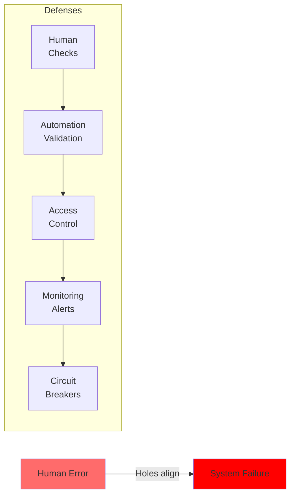
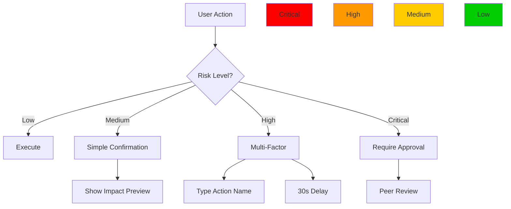
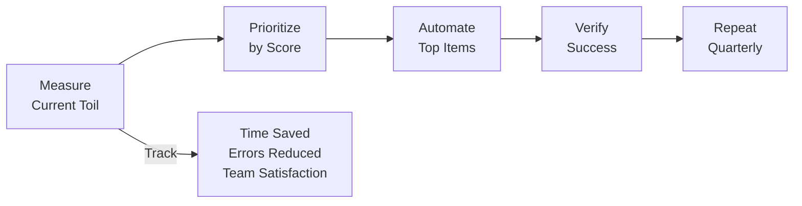
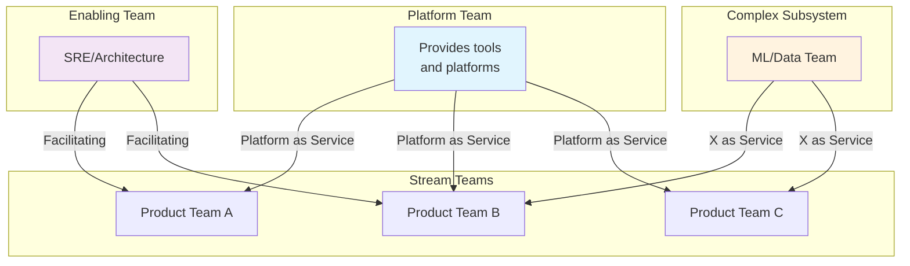

<!-- Navigation -->
[Home](/) → [Part I: Axioms](/part1-axioms/) → [Axiom 7](index.md) → **Axiom 7: Human-System Interface**

# Axiom 7: Human-System Interface

---


## 🔥 The Constraint

### The Fundamental Limit

**Humans have cognitive and physical limitations**

This constraint emerges from **Neuroscience: working memory, reaction time, attention limits**. No amount of engineering can violate this fundamental principle—we can only work within its boundaries.

### Physics Foundation

The practical manifestation of this constraint:
- **Theoretical basis**: Neuroscience: working memory, reaction time, attention limits
- **Practical limit**: 7±2 items in working memory, 250ms reaction time
- **Real-world impact**: System complexity must match human cognitive capacity

### Why This Constraint Exists

Unlike software bugs or implementation details, this is a fundamental law of our universe. Understanding this constraint helps us:

1. **Set realistic expectations** - Know what's physically impossible
2. **Make better trade-offs** - Optimize within the possible
3. **Design robust systems** - Work with the constraint, not against it
4. **Avoid false solutions** - Don't chase impossible optimizations

!!! warning "Common Misconception"
    This constraint cannot be "solved" or "eliminated"—only managed and optimized within its boundaries.

---

## 💡 Why It Matters

System complexity must match human cognitive capacity

### Business Impact

This constraint directly affects:
- **User experience**: Performance and reliability
- **Development velocity**: Time-to-market and maintenance
- **Operational costs**: Infrastructure and support
- **Competitive advantage**: System capabilities and scalability

### Technical Implications

Every engineering decision must account for this constraint:
- **Architecture patterns**: Choose designs that work with the constraint
- **Technology selection**: Pick tools that optimize within the boundaries
- **Performance optimization**: Focus on what's actually improvable
- **Monitoring and alerting**: Track metrics related to the constraint

---

## 🚫 Common Misconceptions

Many engineers hold false beliefs about this constraint:

1. **"Users will read documentation"**
   - This violates the fundamental constraint
   - Reality: The constraint makes this impossible

2. **"More features always improve user experience"**
   - This violates the fundamental constraint
   - Reality: The constraint makes this impossible

3. **"Cognitive load doesn't affect system design"**
   - This violates the fundamental constraint
   - Reality: The constraint makes this impossible


### Reality Check

The constraint is absolute—these misconceptions arise from:
- **Wishful thinking**: Hoping engineering can overcome physics
- **Local optimization**: Solving one problem while creating others
- **Vendor marketing**: Oversimplified claims about complex systems
- **Incomplete understanding**: Not seeing the full system implications

---

## ⚙️ Practical Implications

How this constraint shapes real system design:

1. **Design simple, intuitive interfaces**
2. **Minimize cognitive load and decision fatigue**
3. **Provide clear error messages and recovery paths**
4. **Consider human factors in architecture decisions**


### Engineering Guidelines

When designing systems, always:
- **Start with the constraint**: Acknowledge it in your architecture
- **Measure the constraint**: Monitor relevant metrics
- **Design around the constraint**: Use patterns that work with it
- **Communicate the constraint**: Help stakeholders understand limitations

### Success Patterns

Teams that respect this constraint:
- Set realistic performance goals
- Choose appropriate architectural patterns
- Invest in proper monitoring and observability
- Make trade-offs explicit and data-driven

---


## Level 1: Intuition (Start Here) 🌱

### The Airline Cockpit Metaphor

Think about airplane cockpits:
- **1920s**: Hundreds of unlabeled switches, dials everywhere
- **1970s**: Organized panels, standard layouts
- **Today**: Glass cockpits, automation, clear alerts

**Your ops interface is a cockpit.** Bad design causes:
- Wrong button pressed → System down
- Information overload → Missed problems
- Poor layout → Slow response
- No automation → Human exhaustion

### Real-World Analogy: Kitchen Design

```text
Bad Kitchen (Bad Ops Interface):
- Knives mixed with spoons
- Hot stove next to paper towels
- No labels on spice jars
- Fire extinguisher behind locked door
Result: Chaos, burns, mistakes

Good Kitchen (Good Ops Interface):
- Dangerous items clearly marked
- Logical groupings
- Safety equipment accessible
- Clear workflows
Result: Efficient, safe cooking
```

### Your First Human Factors Experiment

### The Human Limitations Chart

| Human Aspect | Limitation | System Design Implication |
|--------------|------------|---------------------------|
| **Reading Speed** | 200-300 words/min | Don't flood with text |
| **Reaction Time** | 200ms minimum | Don't require split-second decisions |
| **Short-term Memory** | 7±2 items | Group related things |
| **Attention Span** | 20 minutes focused | Automate routine tasks |
| **Error Rate** | 1% normally, 10% under stress | Add confirmations |
| **Work Hours** | 8 hours/day | Build for handoffs |

---

## Level 2: Foundation (Understand Why) 🌿

### Core Principle: Humans ARE the System

### The Swiss Cheese Model



**Key Insight**: No single defense is perfect - layer multiple protections.

### 🎬 Failure Vignette: Amazon S3 Outage 2017

```yaml
The Typo That Broke the Internet:
  Date: February 28, 2017
  Duration: 4 hours
  Impact: Thousands of sites down
  
  What Happened:
    1. Engineer debugging S3 billing system
    2. Typed command to remove small server subset
    3. Fat-fingered, added extra digit
    4. Removed massive server fleet instead
    5. No "Are you sure?" prompt
    6. Cascading failures across AWS
  
  Root Cause: 
    - No input validation
    - No confirmation for large operations
    - Insufficient safeguards
  
  Lessons:
    - Dangerous operations need confirmation
    - Input validation is critical
    - Blast radius limiting essential
    - Human errors WILL happen
```

### Cognitive Load Theory

| Load Type | Definition | Example | Management Strategy |
|-----------|------------|---------|--------------------|
| **Intrinsic** | Essential complexity | Understanding distributed consensus | Good documentation, training |
| **Extraneous** | Unnecessary complexity | Confusing UI, poor naming | Simplify, standardize |
| **Germane** | Learning-helpful complexity | Well-designed tutorials | Encourage, but time-box |

**Team Cognitive Capacity Formula**:
```
Capacity = Base Capacity 
         - Intrinsic Load (can't reduce)
         - Extraneous Load (MUST reduce)
         + Experience Factor
         - Context Switching Penalty
```

---

## Level 3: Deep Dive (Master the Patterns) 🌳

### Information Architecture Patterns

#### Progressive Disclosure Pattern

```yaml
Level 1 - Dashboard (Overview):
  ✅ All systems operational
  ⚠️  2 warnings in payment service
  📊 99.95% availability today

Level 2 - Service View (Click warning):
  Payment Service:
    - Latency: 245ms (⚠️ above 200ms threshold)
    - Error rate: 0.12%
    - Recent deploys: v2.3.1 (2 hours ago)
    
Level 3 - Deep Dive (Click latency):
  Latency Breakdown:
    - Database queries: 180ms (73%)
    - Service logic: 45ms (18%)
    - Network: 20ms (9%)
    
  Top Slow Queries:
    1. SELECT * FROM orders WHERE... (avg: 156ms)
    2. UPDATE payments SET... (avg: 89ms)
```

#### Context-Aware Displays

| Audience | Primary Metrics | Update Frequency | Detail Level |
|----------|----------------|------------------|-------------|
| **On-Call SRE** | Alerts, errors, latency | Real-time | Deep technical |
| **Team Lead** | SLO status, trends | 5 minutes | Service health |
| **Manager** | Availability, incidents | Hourly | Business impact |
| **Executive** | Revenue impact, SLA | Daily | Strategic KPIs |

### Confirmation Patterns



#### Risk-Based Confirmation Examples

| Action | Risk | Confirmation Required |
|--------|------|----------------------|
| Read metrics | Low | None |
| Restart single container | Medium | "Restart container X?" |
| Delete database | Critical | Type "DELETE-PROD-DB" + peer approval |
| Modify traffic routing | High | Show affected users + confirm |
| Emergency shutdown | Critical | Two-person rule + audit log |

### Automation Decision Matrix

```yaml
Automation Priorities:
  
  Automate First (High Toil + Low Risk):
    - Log rotation
    - Certificate renewal  
    - Backup verification
    - Metric aggregation
    
  Automate with Safeguards (High Toil + Medium Risk):
    - Deployment rollouts
    - Scaling operations
    - Cache clearing
    - Service restarts
    
  Semi-Automate (Medium Toil + High Risk):
    - Database migrations
    - Security patches
    - Configuration changes
    - Traffic shifting
    
  Keep Manual (Low Toil + Critical Risk):
    - Data deletions
    - Security key rotation
    - Billing modifications
    - Access grants
```

### Toil Score Calculation

| Factor | Weight | Score (1-5) | Weighted |
|--------|--------|-------------|----------|
| Frequency | 30% | How often performed | F × 0.3 |
| Time per instance | 25% | Minutes per execution | T × 0.25 |
| Automation potential | 20% | How automatable | A × 0.2 |
| Error proneness | 15% | Human error rate | E × 0.15 |
| Business impact | 10% | If it goes wrong | B × 0.1 |
| **Total Toil Score** | | | **Sum** |

**Priority**: Automate tasks with score > 3.5 first

### The Perfect Runbook Template

```markdown
# [RUNBOOK] Service Name: Specific Scenario

## ⚡ Quick Actions (First 2 minutes)
1. Verify alert is real: [dashboard link]
2. Check current impact: [metrics link]  
3. Page backup if severity > 2

## 📋 Pre-Flight Checklist
- [ ] Confirmed alert is not false positive
- [ ] Noted start time for incident
- [ ] Opened incident channel/ticket
- [ ] Status page updated

## 🔍 Diagnosis Steps

### Step 1: Check Dependencies
```bash
# Copy-paste ready commands
curl -s https://api/health | jq '.dependencies'
```

### Step 2: Examine Recent Changes
```bash
kubectl rollout history deployment/service-name
git log --oneline -10 -- configs/
```

## 🚨 Mitigation Paths

### Path A: High CPU (if CPU > 80%)
1. Enable rate limiting:
   ```bash
   kubectl apply -f configs/rate-limit-high.yaml
   ```
2. Scale horizontally:
   ```bash
   kubectl scale deployment/api --replicas=10
   ```

### Path B: Database Issues (if DB latency > 100ms)
1. Check connection pool:
   ```sql
   SELECT count(*) FROM pg_stat_activity;
   ```
2. Kill long queries:
   ```sql
   SELECT pg_terminate_backend(pid) 
   FROM pg_stat_activity 
   WHERE query_time > interval '5 minutes';
   ```

## ↩️ Rollback Procedure
Only if mitigation fails:
```bash
./scripts/emergency-rollback.sh service-name
```

## ✅ Resolution Confirmation
- [ ] Metrics returned to normal
- [ ] Alerts cleared
- [ ] Synthetic tests passing
- [ ] No customer complaints in last 10min

## 📝 Follow-Up Actions
- [ ] Update incident ticket with resolution
- [ ] Schedule postmortem (if SEV1/2)
- [ ] Update runbook with learnings
- [ ] Check SLO impact
```

---

## Level 4: Expert (Production Patterns) 🌲

### Case Study: NASA Mission Control Design

```yaml
NASA Mission Control Principles:
  
  1. Information Hierarchy:
     Level 1: Go/No-Go status (big, obvious)
     Level 2: System health (color-coded)
     Level 3: Detailed telemetry (on demand)
  
  2. Dedicated Roles:
     FLIGHT: Overall mission director
     CAPCOM: Astronaut communication only
     EECOM: Electrical systems
     GNC: Guidance, navigation, control
     → Each screen optimized per role
  
  3. Communication Protocols:
     - Closed-loop confirmation required
     - Standard phraseology only
     - "Go/No-Go" polling sequence
     - No ambiguous terms allowed
  
  4. Failure Modes:
     - Every display has failure indication
     - Automated alerts for out-of-range
     - Manual override always available
     - Clear escalation paths
```

**Applied to Modern Systems**:

| NASA Principle | DevOps Application |
|----------------|-------------------|
| Role-based displays | SRE vs Dev vs Manager dashboards |
| Go/No-Go status | Health checks and readiness probes |
| Closed-loop comms | Deployment approval workflows |
| Standard phraseology | Consistent alert naming/format |
| Failure indication | Circuit breakers and fallbacks |

### Advanced UI Patterns

#### 1. Adaptive Complexity

```python
class AdaptiveUI:
    """UI that learns from user behavior"""
    
    def render_dashboard(self, user):
        complexity_level = self.assess_user_level(user)
        
        if complexity_level == 'beginner':
            return self.simple_view()
        elif complexity_level == 'intermediate':
            return self.standard_view()
        else:  # expert
            return self.power_user_view()
    
    def assess_user_level(self, user):
        factors = {
            'login_count': user.login_count,
            'features_used': len(user.used_features),
            'time_on_platform': user.total_hours,
            'error_rate': user.mistakes / user.actions
        }
        
        if factors['login_count'] < 10:
            return 'beginner'
        elif factors['error_rate'] < 0.01:
            return 'expert'
        else:
            return 'intermediate'
```

#### 2. Contextual Help System

```yaml
Context-Aware Help:
  
  Trigger: User hovers over metric
  Show:
    - What this metric means
    - Normal range
    - What to do if abnormal
    - Link to detailed docs
  
  Trigger: User attempts risky action
  Show:
    - Impact preview
    - Similar past incidents
    - Recommended safeguards
    - Undo instructions
  
  Trigger: Error occurs
  Show:
    - Plain English explanation
    - Most likely causes
    - Step-by-step resolution
    - When to escalate
```

#### 3. Smart Defaults and Automation

| Operation | Manual Process | Smart Default | Full Automation |
|-----------|---------------|---------------|------------------|
| Scaling | Pick instance count | Suggest based on load | Auto-scale with limits |
| Alerts | Set all thresholds | Pre-tuned thresholds | Anomaly detection |
| Deployments | Pick time/strategy | Suggest quiet period | Progressive rollout |
| Backups | Remember to run | Scheduled with reminders | Continuous + verified |

### Toil Measurement and Elimination

```python
class ToilTracker:
    """Track and prioritize toil elimination"""
    
    def calculate_toil_score(self, task):
        # Weekly time spent
        time_impact = task.frequency * task.duration_minutes
        
        # Automation difficulty (1-5 scale)
        automation_cost = task.complexity * 100  # hours estimate
        
        # ROI calculation
        weekly_savings = time_impact
        payback_weeks = automation_cost / weekly_savings
        
        # Priority score (higher = automate first)
        score = {
            'task': task.name,
            'weekly_minutes': time_impact,
            'automation_hours': automation_cost,
            'payback_weeks': payback_weeks,
            'error_reduction': task.error_rate * task.impact_severity,
            'priority': (time_impact / payback_weeks) * task.error_rate
        }
        
        return score

# Example output:
# Task: Certificate Renewal
# Weekly time: 30 minutes
# Automation effort: 8 hours  
# Payback: 16 weeks
# Priority: HIGH (due to high error impact)
```

#### Toil Elimination Roadmap



---

## Level 5: Mastery (Push the Boundaries) 🌴

### The Future: Augmented Operations

```yaml
AI-Assisted Operations (2025+):
  
  Predictive Insights:
    - "Database will run out of connections in 2 hours"
    - "This deployment pattern previously caused issues"
    - "Unusual traffic pattern detected from region X"
  
  Suggested Actions:
    - "Scale up by 3 instances based on traffic forecast"
    - "Roll back - similar symptoms to incident #1234"
    - "Enable read replicas - query load increasing"
  
  Natural Language Interfaces:
    Human: "Why is the API slow?"
    AI: "Database queries taking 3x longer than normal.
         Primary cause: Missing index on orders.user_id.
         Suggested fix: CREATE INDEX idx_orders_user_id"
  
  Automated Investigations:
    - AI traces through logs/metrics
    - Correlates with past incidents
    - Presents ranked hypotheses
    - Human makes final decision
```

#### Human-AI Collaboration Model

| Task Type | Human Role | AI Role | Why This Split |
|-----------|------------|---------|----------------|
| Pattern Recognition | Validate findings | Detect anomalies | AI better at scale |
| Decision Making | Final authority | Present options | Human accountability |
| Investigation | Direct focus | Gather evidence | AI faster at search |
| Communication | Empathy, context | Draft updates | Human nuance needed |
| Learning | Apply wisdom | Find correlations | Both needed |

### The Human-Centric Design Principles

```yaml
Core Principles:
  
  1. Respect Cognitive Limits:
     - Max 7±2 items in working memory
     - Chunk related information
     - Progressive disclosure
     - Clear visual hierarchy
  
  2. Prevent Errors, Don't Punish:
     - Make right thing easy
     - Make wrong thing hard
     - Provide clear undo
     - No blame, just learning
  
  3. Design for Interruption:
     - Save state automatically
     - Clear re-entry points
     - Context preservation
     - Resumable workflows
  
  4. Optimize for Emergency:
     - Big red buttons where needed
     - Skip complexity in crisis
     - Pre-written communications
     - Clear escalation paths
  
  5. Build Trust Through Transparency:
     - Show what system is doing
     - Explain automated decisions
     - Provide audit trails
     - Allow manual override
```

#### Design Checklist for Human Interfaces

- [ ] Can a tired person use this at 3 AM?
- [ ] Are dangerous actions clearly marked?
- [ ] Is the current state always obvious?
- [ ] Can errors be easily undone?
- [ ] Are common tasks optimized?
- [ ] Is help context-sensitive?
- [ ] Does it work on mobile (for emergencies)?
- [ ] Are all actions logged for learning?
- [ ] Can it be used under stress?
- [ ] Is cognitive load minimized?

### Team Topology Patterns



## Summary: Key Insights by Level

### 🌱 Beginner
1. **Humans have limits - design for them**
2. **Bad UI causes disasters**
3. **Meaningful names prevent errors**

### 🌿 Intermediate
1. **Humans ARE part of the system**
2. **Swiss cheese model - layer defenses**
3. **Cognitive load management critical**

### 🌳 Advanced
1. **Progressive disclosure manages complexity**
2. **Confirmation proportional to impact**
3. **Runbooks that actually work**

### 🌲 Expert
1. **NASA principles apply to ops**
2. **Toil measurement drives automation**
3. **Context prevents confusion**

### 🌴 Master
1. **Future is augmented, not replaced**
2. **AI as partner, not overlord**
3. **Design for human+machine symbiosis**

## Quick Reference Card

```yaml
Human Interface Quick Reference:

Cognitive Limits:
  Working Memory: 7±2 items
  Attention Span: 20 min sustained
  Reaction Time: 200ms minimum
  Error Rate: 1% normal, 10% under stress

Interface Design:
  ✓ Progressive disclosure
  ✓ Clear visual hierarchy  
  ✓ Consistent patterns
  ✓ Meaningful names
  ✓ Confirmation for risky actions
  ✓ Undo capabilities
  ✓ Context-sensitive help

Automation Strategy:
  High Frequency + Low Risk → Fully automate
  High Risk + Low Frequency → Keep manual
  Medium Both → Semi-automate with safeguards

Runbook Essentials:
  1. Quick actions (< 2 min)
  2. Copy-paste commands
  3. Clear decision trees
  4. Rollback procedures
  5. Success criteria

Team Patterns:
  - Stream-aligned: Product delivery
  - Platform: Internal services
  - Enabling: Coaching/expertise
  - Complex subsystem: Deep specialization

Error Prevention:
  1. Input validation
  2. Confirmation dialogs
  3. Preview/dry-run
  4. Progressive rollout
  5. Circuit breakers
```

### Practical Exercises

#### Exercise 1: Design a Safe CLI 🌱
```bash
# Bad CLI design
$ delete-database production
> Database deleted.

# Good CLI design  
$ delete-database production
> WARNING: This will delete the PRODUCTION database
> This action cannot be undone
> 42,000 users will be affected
> Type 'delete-prod-42000' to confirm:
```

#### Exercise 2: Toil Analysis 🌿

| Task | Frequency | Duration | Error Rate | Automation Potential | Priority Score |
|------|-----------|----------|------------|---------------------|----------------|
| Certificate renewal | Monthly | 30 min | 5% | High | 4.2 |
| Log rotation | Daily | 5 min | 1% | High | 3.8 |
| Deployment | Weekly | 60 min | 10% | Medium | 3.5 |
| Capacity planning | Quarterly | 4 hours | 2% | Low | 1.2 |

#### Exercise 3: Progressive Disclosure UI 🌳

Design a monitoring dashboard with three levels:
1. **Executive**: Single health score + SLA status
2. **Manager**: Service health grid + incident count
3. **Engineer**: Full metrics + logs + traces

#### Exercise 4: Runbook Validation 🌲

Test your runbook:
- Can someone follow it at 3 AM?
- Are all commands copy-pasteable?
- Do all links work?
- Is rollback clear?
- Are success criteria defined?

---

**Next**: [Axiom 8: Economics →](/part1-axioms/archive-old-8-axiom-structure/axiom8-economics/)

*"The best interface is no interface. The best process is no process. But until then, design for humans."*

---

**Next**: [Examples](examples.md)
