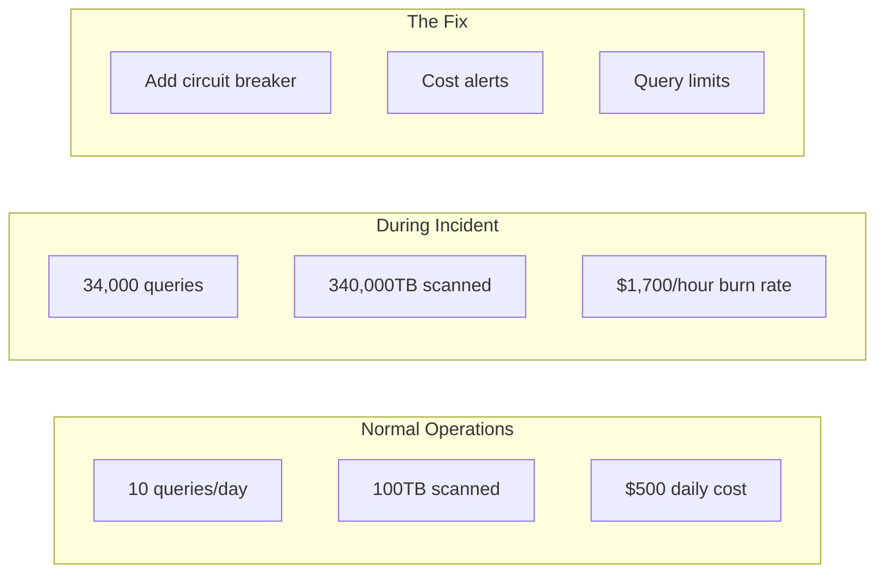

<!-- Navigation -->
[Home](/) → [Part I: Axioms](/part1-axioms/) → [Axiom 8](index.md) → **Economics Examples**

# Economics Examples

**From $2K to $28K overnight: real stories of cloud economics gone wrong (and how to fix them)**

---

## 🌍 Real-World Case Studies

### Case 1: The BigQuery Retry Storm ($28K Lesson)

**Company**: Data Analytics Startup  
**Normal Bill**: $2,000/month  
**Incident Bill**: $28,000 in 24 hours  
**Root Cause**: Exponential retry backoff... without the backoff

#### The Perfect Storm

```python
# The code that caused the disaster
class BigQueryAnalytics:
    def __init__(self):
        self.client = bigquery.Client()
        self.retry_count = 0
        
    def run_expensive_query(self, query):
        """Each query scanned 10TB of data"""
        try:
            result = self.client.query(query)
            return result
        except Exception as e:
            # THE BUG: No backoff, no limit!
            self.retry_count += 1
            return self.run_expensive_query(query)  # Infinite retry

# What happened:
# 1. Query failed due to syntax error
# 2. Retry immediately (no backoff)
# 3. 1000 retries/minute * 10TB * $5/TB = $50,000/minute
# 4. Ran for 34 minutes before someone noticed
```

#### The Timeline of Disaster



#### The Fix: Cost-Aware Retry Logic

```python
import time
import math
from dataclasses import dataclass
from typing import Optional

@dataclass
class CostConfig:
    """Cost limits for operations"""
    max_cost_per_query: float = 50.0  # $50 max per query
    max_cost_per_hour: float = 100.0  # $100/hour budget
    max_cost_per_day: float = 1000.0  # $1000/day budget
    
    # BigQuery pricing
    cost_per_tb: float = 5.0  # $5/TB scanned
    
class CostAwareBigQuery:
    """BigQuery client with cost protection"""
    
    def __init__(self, cost_config: CostConfig):
        self.client = bigquery.Client()
        self.config = cost_config
        self.cost_tracker = CostTracker()
        
    def estimate_query_cost(self, query: str) -> float:
        """Estimate cost before running"""
        # Dry run to get bytes processed
        job_config = bigquery.QueryJobConfig(dry_run=True)
        query_job = self.client.query(query, job_config=job_config)
        
        bytes_processed = query_job.total_bytes_processed
        tb_processed = bytes_processed / (1024**4)
        estimated_cost = tb_processed * self.config.cost_per_tb
        
        return estimated_cost
        
    def run_query_with_cost_limits(self, query: str, max_retries: int = 3):
        """Run query with cost protection"""
        
        # Pre-flight cost check
        estimated_cost = self.estimate_query_cost(query)
        
        if estimated_cost > self.config.max_cost_per_query:
            raise CostLimitExceeded(
                f"Query would cost ${estimated_cost:.2f}, "
                f"exceeds limit of ${self.config.max_cost_per_query}"
            )
            
        # Check hourly budget
        if not self.cost_tracker.can_spend(estimated_cost):
            raise BudgetExhausted(
                f"Would exceed hourly budget. "
                f"Current: ${self.cost_tracker.hourly_spent:.2f}, "
                f"Limit: ${self.config.max_cost_per_hour}"
            )
            
        # Run with exponential backoff
        for attempt in range(max_retries):
            try:
                result = self.client.query(query)
                self.cost_tracker.record_cost(estimated_cost)
                return result
                
            except Exception as e:
                if attempt == max_retries - 1:
                    raise
                    
                # Exponential backoff: 1s, 2s, 4s, 8s...
                backoff = math.pow(2, attempt)
                
                # Cost of retry
                retry_cost = estimated_cost * (attempt + 2)
                if retry_cost > self.config.max_cost_per_query:
                    raise CostLimitExceeded(
                        f"Retries would exceed cost limit. "
                        f"Stopping at attempt {attempt + 1}"
                    )
                    
                print(f"Retry {attempt + 1} after {backoff}s...")
                time.sleep(backoff)

class CostTracker:
    """Track spending over time windows"""
    
    def __init__(self):
        self.costs = []  # (timestamp, amount)
        
    def record_cost(self, amount: float):
        self.costs.append((time.time(), amount))
        
    @property
    def hourly_spent(self) -> float:
        """Calculate spending in last hour"""
        one_hour_ago = time.time() - 3600
        recent_costs = [
            cost for timestamp, cost in self.costs 
            if timestamp > one_hour_ago
        ]
        return sum(recent_costs)
        
    def can_spend(self, amount: float, limit: float = 100.0) -> bool:
        """Check if spending would exceed limit"""
        return (self.hourly_spent + amount) <= limit

# Additional safety: Resource quotas
class QueryQuotaManager:
    """Enforce query quotas per user/team"""
    
    def __init__(self):
        self.quotas = {
            'data_science': {'tb_per_day': 100, 'queries_per_hour': 50},
            'analytics': {'tb_per_day': 500, 'queries_per_hour': 200},
            'engineering': {'tb_per_day': 50, 'queries_per_hour': 100}
        }
        self.usage = {}
        
    def check_quota(self, team: str, query_size_tb: float) -> bool:
        """Check if team has quota remaining"""
        quota = self.quotas.get(team)
        if not quota:
            return False
            
        current_usage = self.usage.get(team, {'tb': 0, 'queries': 0})
        
        if current_usage['tb'] + query_size_tb > quota['tb_per_day']:
            raise QuotaExceeded(f"Team {team} exceeded daily TB quota")
            
        return True
```

#### Lessons Learned

| Failure Point | Solution | Implementation |
|--------------|----------|----------------|
| No retry limit | Max retry count | `max_retries=3` |
| No backoff | Exponential backoff | `2^attempt` seconds |
| No cost awareness | Pre-flight cost check | Dry run queries |
| No budget limits | Hourly/daily budgets | Cost tracker |
| No alerts | Real-time alerts | CloudWatch/Datadog |
| No circuit breaker | Auto-disable expensive ops | Circuit breaker pattern |

---

### Case 2: Build vs Buy - The $5M Database Decision

**Company**: Mid-size SaaS  
**Choice**: Self-hosted Cassandra vs DynamoDB  
**Timeline**: 3-year TCO analysis

#### The Analysis Framework

```python
class DatabaseTCOCalculator:
    """Total Cost of Ownership calculator for databases"""
    
    def __init__(self):
        # AWS Pricing (2024)
        self.dynamodb_pricing = {
            'write_unit': 1.25 / 1_000_000,  # Per write
            'read_unit': 0.25 / 1_000_000,   # Per read
            'storage_gb': 0.25,               # Per GB/month
            'backup_gb': 0.10,                # Per GB/month
            'global_tables': 2.0              # Multiplier for global
        }
        
        # Self-hosted costs
        self.cassandra_costs = {
            'instance': {
                'i3.2xlarge': 624,  # $/month
                'ebs_gb': 0.10,     # $/GB/month
                'bandwidth_gb': 0.09 # $/GB transfer
            },
            'staffing': {
                'dba_salary': 150_000,      # $/year
                'oncall_cost': 50_000,      # $/year
                'training': 20_000          # $/year
            }
        }
        
    def calculate_dynamodb_cost(self, workload):
        """Calculate DynamoDB costs"""
        
        # Basic costs
        writes_per_month = workload['writes_per_sec'] * 86400 * 30
        reads_per_month = workload['reads_per_sec'] * 86400 * 30
        
        write_cost = writes_per_month * self.dynamodb_pricing['write_unit']
        read_cost = reads_per_month * self.dynamodb_pricing['read_unit']
        storage_cost = workload['storage_gb'] * self.dynamodb_pricing['storage_gb']
        
        # Additional features
        backup_cost = workload['storage_gb'] * self.dynamodb_pricing['backup_gb']
        
        # Global tables (if multi-region)
        if workload['regions'] > 1:
            base_cost = write_cost + read_cost + storage_cost
            global_cost = base_cost * (self.dynamodb_pricing['global_tables'] - 1)
        else:
            global_cost = 0
            
        monthly_cost = write_cost + read_cost + storage_cost + backup_cost + global_cost
        
        return {
            'monthly': monthly_cost,
            'yearly': monthly_cost * 12,
            'breakdown': {
                'writes': write_cost,
                'reads': read_cost,
                'storage': storage_cost,
                'backup': backup_cost,
                'global': global_cost
            }
        }
        
    def calculate_cassandra_cost(self, workload):
        """Calculate self-hosted Cassandra costs"""
        
        # Sizing
        nodes_needed = self.calculate_cassandra_nodes(workload)
        
        # Infrastructure
        instance_cost = nodes_needed * self.cassandra_costs['instance']['i3.2xlarge']
        
        # Storage (3x replication)
        storage_needed = workload['storage_gb'] * 3
        storage_cost = storage_needed * self.cassandra_costs['instance']['ebs_gb']
        
        # Bandwidth (replication + client)
        bandwidth_gb = workload['writes_per_sec'] * 1024 * 86400 * 30 / 1e9
        bandwidth_cost = bandwidth_gb * self.cassandra_costs['instance']['bandwidth_gb']
        
        # Personnel
        staff_cost = (
            self.cassandra_costs['staffing']['dba_salary'] +
            self.cassandra_costs['staffing']['oncall_cost'] +
            self.cassandra_costs['staffing']['training']
        ) / 12  # Monthly
        
        monthly_cost = instance_cost + storage_cost + bandwidth_cost + staff_cost
        
        return {
            'monthly': monthly_cost,
            'yearly': monthly_cost * 12,
            'breakdown': {
                'instances': instance_cost,
                'storage': storage_cost,
                'bandwidth': bandwidth_cost,
                'personnel': staff_cost,
                'nodes': nodes_needed
            }
        }
        
    def calculate_cassandra_nodes(self, workload):
        """Estimate Cassandra cluster size"""
        
        # Rules of thumb
        writes_per_node = 10_000  # Writes/sec per node
        reads_per_node = 20_000   # Reads/sec per node
        storage_per_node = 2_000  # GB per node
        
        nodes_for_writes = math.ceil(workload['writes_per_sec'] / writes_per_node)
        nodes_for_reads = math.ceil(workload['reads_per_sec'] / reads_per_node)
        nodes_for_storage = math.ceil(workload['storage_gb'] * 3 / storage_per_node)
        
        # Minimum 3 nodes, add 20% headroom
        base_nodes = max(3, nodes_for_writes, nodes_for_reads, nodes_for_storage)
        return math.ceil(base_nodes * 1.2)

# Run the analysis
workloads = [
    {
        'name': 'Year 1 - Startup',
        'writes_per_sec': 100,
        'reads_per_sec': 1000,
        'storage_gb': 100,
        'regions': 1
    },
    {
        'name': 'Year 2 - Growth', 
        'writes_per_sec': 1000,
        'reads_per_sec': 10000,
        'storage_gb': 1000,
        'regions': 2
    },
    {
        'name': 'Year 3 - Scale',
        'writes_per_sec': 5000,
        'reads_per_sec': 50000,
        'storage_gb': 10000,
        'regions': 3
    }
]

calc = DatabaseTCOCalculator()

for workload in workloads:
    dynamo = calc.calculate_dynamodb_cost(workload)
    cassandra = calc.calculate_cassandra_cost(workload)
    
    print(f"\n{workload['name']}:")
    print(f"  DynamoDB: ${dynamo['monthly']:,.0f}/month")
    print(f"  Cassandra: ${cassandra['monthly']:,.0f}/month ({cassandra['breakdown']['nodes']} nodes)")
    print(f"  Winner: {'DynamoDB' if dynamo['monthly'] < cassandra['monthly'] else 'Cassandra'}")
    print(f"  Savings: ${abs(dynamo['monthly'] - cassandra['monthly']):,.0f}/month")
```

#### The Hidden Costs Analysis

```python
class HiddenCostAnalyzer:
    """Find costs that TCO calculators miss"""
    
    def __init__(self):
        self.hidden_costs = {
            'self_hosted': {
                'downtime': self.calculate_downtime_cost,
                'scaling_lag': self.calculate_scaling_delay_cost,
                'security_patches': self.calculate_patching_cost,
                'expertise_gap': self.calculate_expertise_cost,
                'tool_licenses': self.calculate_tooling_cost
            },
            'managed': {
                'vendor_lock': self.calculate_lock_in_cost,
                'api_limits': self.calculate_throttling_cost,
                'feature_gaps': self.calculate_workaround_cost
            }
        }
        
    def calculate_downtime_cost(self, revenue_per_hour, availability):
        """Cost of downtime for self-hosted"""
        # Typical self-hosted: 99.9% = 8.76 hours/year
        # Managed service: 99.99% = 52.6 minutes/year
        
        downtime_hours_yearly = (1 - availability) * 8760
        downtime_cost = downtime_hours_yearly * revenue_per_hour
        
        return {
            'cost': downtime_cost,
            'description': f'{downtime_hours_yearly:.1f} hours downtime/year',
            'mitigation': 'Better monitoring, automated recovery'
        }
        
    def compare_total_cost(self, base_costs, hidden_costs):
        """Include hidden costs in comparison"""
        
        total_self_hosted = base_costs['self_hosted'] + sum(
            h['cost'] for h in hidden_costs['self_hosted'].values()
        )
        
        total_managed = base_costs['managed'] + sum(
            h['cost'] for h in hidden_costs['managed'].values()
        )
        
        return {
            'self_hosted_total': total_self_hosted,
            'managed_total': total_managed,
            'hidden_percentage': {
                'self_hosted': sum(h['cost'] for h in hidden_costs['self_hosted'].values()) / base_costs['self_hosted'] * 100,
                'managed': sum(h['cost'] for h in hidden_costs['managed'].values()) / base_costs['managed'] * 100
            }
        }
```

---

### Case 3: The Coordination Tax - Consensus at Scale

**System**: Distributed configuration service  
**Scale**: 10,000 nodes  
**Choice**: Eventual consistency saved $2.4M/year

```python
class ConsensusCoordinationCost:
    """Calculate the cost of distributed consensus"""
    
    def __init__(self):
        self.consensus_protocols = {
            'raft': {
                'messages_per_op': lambda n: 2 * n,  # Leader + followers
                'latency_ms': lambda n: 50 + 10 * math.log(n),
                'cpu_overhead': 0.15  # 15% CPU for consensus
            },
            'paxos': {
                'messages_per_op': lambda n: 3 * n,  # Prepare + accept
                'latency_ms': lambda n: 100 + 20 * math.log(n),
                'cpu_overhead': 0.20
            },
            'eventual': {
                'messages_per_op': lambda n: math.log(n),  # Gossip
                'latency_ms': lambda n: 5,  # Local write
                'cpu_overhead': 0.02
            }
        }
        
    def calculate_consensus_cost(self, 
                                protocol: str,
                                nodes: int,
                                ops_per_second: int,
                                instance_cost_hourly: float = 0.10):
        """Calculate infrastructure cost of consensus"""
        
        proto = self.consensus_protocols[protocol]
        
        # Message costs
        messages_per_op = proto['messages_per_op'](nodes)
        total_messages_per_sec = ops_per_second * messages_per_op
        
        # Network bandwidth (assume 1KB per message)
        bandwidth_mbps = (total_messages_per_sec * 1024) / (1024 * 1024)
        bandwidth_cost_hourly = bandwidth_mbps * 0.09  # $/GB transfer
        
        # CPU overhead
        cpu_overhead = proto['cpu_overhead']
        additional_instances = math.ceil(nodes * cpu_overhead)
        compute_cost_hourly = additional_instances * instance_cost_hourly
        
        # Latency impact on revenue
        latency_ms = proto['latency_ms'](nodes)
        revenue_impact = self.calculate_latency_revenue_impact(latency_ms)
        
        hourly_cost = bandwidth_cost_hourly + compute_cost_hourly + revenue_impact
        
        return {
            'hourly': hourly_cost,
            'monthly': hourly_cost * 730,
            'yearly': hourly_cost * 8760,
            'breakdown': {
                'bandwidth': bandwidth_cost_hourly * 8760,
                'compute': compute_cost_hourly * 8760,
                'latency_impact': revenue_impact * 8760,
                'messages_per_op': messages_per_op,
                'latency_ms': latency_ms
            }
        }
        
    def calculate_latency_revenue_impact(self, latency_ms):
        """Estimate revenue impact of latency"""
        # Amazon: 100ms latency = 1% revenue loss
        revenue_per_hour = 1000  # $1000/hour baseline
        
        if latency_ms < 100:
            return 0
        else:
            # 1% revenue loss per 100ms
            loss_percentage = (latency_ms / 100) * 0.01
            return revenue_per_hour * loss_percentage

# Compare protocols at scale
scales = [10, 100, 1000, 10000]
ops_per_second = 1000

calc = ConsensusCoordinationCost()

print("Annual Coordination Costs by Protocol:\n")
print(f"{'Nodes':<10} {'Raft':<15} {'Paxos':<15} {'Eventual':<15} {'Savings':<15}")
print("-" * 65)

for nodes in scales:
    raft = calc.calculate_consensus_cost('raft', nodes, ops_per_second)
    paxos = calc.calculate_consensus_cost('paxos', nodes, ops_per_second)
    eventual = calc.calculate_consensus_cost('eventual', nodes, ops_per_second)
    
    savings = min(raft['yearly'], paxos['yearly']) - eventual['yearly']
    
    print(f"{nodes:<10} ${raft['yearly']:>12,.0f} ${paxos['yearly']:>12,.0f} "
          f"${eventual['yearly']:>12,.0f} ${savings:>12,.0f}")
```

---

## 💰 Cost Attribution Systems

### Function-Level Cost Tracking

```python
import functools
import time
import threading
from collections import defaultdict

class CostAttribution:
    """Track costs at function granularity"""
    
    def __init__(self):
        self.cost_data = defaultdict(lambda: {
            'invocations': 0,
            'total_duration_ms': 0,
            'resources': defaultdict(float)
        })
        self.resource_rates = {
            'cpu_seconds': 0.0000166667,  # $/cpu-second
            'memory_gb_seconds': 0.0000166667,  # $/GB-second
            'api_calls': 0.0004,  # $/call
            'db_queries': 0.001,  # $/query
            'cache_hits': 0.0001,  # $/hit
            'bandwidth_gb': 0.09  # $/GB
        }
        
    def track_cost(self, resource_usage=None):
        """Decorator to track function costs"""
        def decorator(func):
            @functools.wraps(func)
            def wrapper(*args, **kwargs):
                start_time = time.time()
                func_name = f"{func.__module__}.{func.__name__}"
                
                # Track resource usage
                resources_used = {}
                
                try:
                    # Execute function
                    result = func(*args, **kwargs)
                    
                    # Record metrics
                    duration_ms = (time.time() - start_time) * 1000
                    self.cost_data[func_name]['invocations'] += 1
                    self.cost_data[func_name]['total_duration_ms'] += duration_ms
                    
                    # Record specific resources if provided
                    if resource_usage:
                        for resource, amount in resource_usage.items():
                            self.cost_data[func_name]['resources'][resource] += amount
                            
                    return result
                    
                except Exception as e:
                    # Track failed invocations too
                    self.cost_data[func_name]['invocations'] += 1
                    raise
                    
            return wrapper
        return decorator
        
    def calculate_function_costs(self):
        """Calculate cost per function"""
        function_costs = {}
        
        for func_name, metrics in self.cost_data.items():
            # Base compute cost
            cpu_seconds = metrics['total_duration_ms'] / 1000
            compute_cost = cpu_seconds * self.resource_rates['cpu_seconds']
            
            # Resource costs
            resource_cost = sum(
                amount * self.resource_rates.get(resource, 0)
                for resource, amount in metrics['resources'].items()
            )
            
            # Per invocation cost
            total_cost = compute_cost + resource_cost
            per_invocation = total_cost / metrics['invocations'] if metrics['invocations'] > 0 else 0
            
            function_costs[func_name] = {
                'total_cost': total_cost,
                'invocations': metrics['invocations'],
                'cost_per_invocation': per_invocation,
                'avg_duration_ms': metrics['total_duration_ms'] / metrics['invocations'] if metrics['invocations'] > 0 else 0,
                'resource_breakdown': dict(metrics['resources'])
            }
            
        return function_costs
        
    def generate_cost_report(self):
        """Generate cost attribution report"""
        costs = self.calculate_function_costs()
        
        # Sort by total cost
        sorted_funcs = sorted(costs.items(), key=lambda x: x[1]['total_cost'], reverse=True)
        
        print("\nFunction Cost Report")
        print("="*80)
        print(f"{'Function':<40} {'Total Cost':<12} {'Invocations':<12} {'$/Call':<10}")
        print("-"*80)
        
        total = 0
        for func_name, cost_data in sorted_funcs[:20]:  # Top 20
            total += cost_data['total_cost']
            print(f"{func_name:<40} ${cost_data['total_cost']:>10.4f} "
                  f"{cost_data['invocations']:>11,} ${cost_data['cost_per_invocation']:>8.6f}")
                  
        print("-"*80)
        print(f"{'TOTAL':<40} ${total:>10.4f}")
        
        # Resource breakdown
        print("\nResource Usage:")
        all_resources = defaultdict(float)
        for func_name, metrics in self.cost_data.items():
            for resource, amount in metrics['resources'].items():
                all_resources[resource] += amount
                
        for resource, amount in sorted(all_resources.items(), key=lambda x: x[1], reverse=True):
            cost = amount * self.resource_rates.get(resource, 0)
            print(f"  {resource}: {amount:,.0f} units (${cost:.2f})")

# Usage example
tracker = CostAttribution()

@tracker.track_cost()
def process_user_request(user_id):
    # Simulate API call
    time.sleep(0.1)
    tracker.cost_data['api.process_user_request']['resources']['api_calls'] += 1
    tracker.cost_data['api.process_user_request']['resources']['db_queries'] += 3
    tracker.cost_data['api.process_user_request']['resources']['cache_hits'] += 5
    
@tracker.track_cost()
def generate_report(data):
    # Simulate heavy computation
    time.sleep(0.5)
    tracker.cost_data['reporting.generate_report']['resources']['cpu_seconds'] += 0.5
    tracker.cost_data['reporting.generate_report']['resources']['memory_gb_seconds'] += 2.0
```

---

## 📊 Auto-Scaling Economics

### Intelligent Scaling Decisions

```python
class AutoScalingEconomics:
    """Balance performance and cost in auto-scaling"""
    
    def __init__(self):
        self.instance_costs = {
            't3.micro': 0.0104,
            't3.small': 0.0208,
            't3.medium': 0.0416,
            't3.large': 0.0832,
            'm5.large': 0.096,
            'm5.xlarge': 0.192,
            'c5.large': 0.085,
            'c5.xlarge': 0.17
        }
        
        self.scaling_metrics = {
            'cpu_threshold': 70,  # %
            'memory_threshold': 80,  # %
            'request_latency_threshold': 100,  # ms
            'cost_threshold': 1000  # $/hour
        }
        
    def calculate_optimal_scaling(self, current_metrics, sla_requirements):
        """Determine optimal scaling configuration"""
        
        # Current state
        current_instances = current_metrics['instances']
        current_cost = sum(
            self.instance_costs[i['type']] for i in current_instances
        ) * len(current_instances)
        
        # Performance analysis
        cpu_pressure = current_metrics['avg_cpu'] / self.scaling_metrics['cpu_threshold']
        memory_pressure = current_metrics['avg_memory'] / self.scaling_metrics['memory_threshold']
        latency_pressure = current_metrics['p95_latency'] / sla_requirements['max_latency_ms']
        
        # Scaling decision
        scale_factor = max(cpu_pressure, memory_pressure, latency_pressure)
        
        if scale_factor > 1.2:  # Need to scale up
            return self.recommend_scale_up(current_metrics, scale_factor)
        elif scale_factor < 0.6:  # Can scale down
            return self.recommend_scale_down(current_metrics, scale_factor)
        else:
            return {'action': 'maintain', 'reason': 'Within optimal range'}
            
    def recommend_scale_up(self, metrics, pressure):
        """Recommend cost-effective scale-up strategy"""
        
        strategies = [
            self.vertical_scaling_cost(metrics),
            self.horizontal_scaling_cost(metrics),
            self.spot_instance_cost(metrics),
            self.scheduled_scaling_cost(metrics)
        ]
        
        # Find most cost-effective
        best_strategy = min(strategies, key=lambda x: x['cost_per_performance'])
        
        return {
            'action': 'scale_up',
            'strategy': best_strategy['name'],
            'cost_increase': best_strategy['cost_increase'],
            'performance_gain': best_strategy['performance_gain'],
            'implementation': best_strategy['steps']
        }
        
    def spot_instance_cost(self, metrics):
        """Calculate cost of using spot instances"""
        
        # Spot prices (typically 70% discount)
        spot_discount = 0.3
        
        # But factor in interruption cost
        interruption_rate = 0.05  # 5% chance per hour
        interruption_cost = metrics['revenue_per_hour'] * 0.1  # 10% revenue loss
        
        effective_cost = (
            self.instance_costs['m5.large'] * spot_discount +
            interruption_rate * interruption_cost
        )
        
        return {
            'name': 'spot_instances',
            'cost_increase': effective_cost,
            'performance_gain': 1.0,  # Same as on-demand
            'cost_per_performance': effective_cost,
            'risks': 'Interruption possible',
            'steps': [
                'Configure spot fleet',
                'Set interruption handling',
                'Implement graceful shutdown'
            ]
        }

class PredictiveScaling:
    """Use ML to predict scaling needs"""
    
    def __init__(self):
        self.historical_data = []
        self.cost_model = None
        
    def train_cost_model(self):
        """Train model to predict cost-optimal scaling"""
        # Features: time of day, day of week, current load, etc.
        # Target: optimal instance count that minimized cost while meeting SLA
        pass
        
    def predict_scaling_needs(self, forecast_hours=24):
        """Predict scaling needs for next N hours"""
        
        predictions = []
        
        for hour in range(forecast_hours):
            predicted_load = self.predict_load(hour)
            optimal_config = self.find_optimal_config(predicted_load)
            
            predictions.append({
                'hour': hour,
                'predicted_load': predicted_load,
                'recommended_instances': optimal_config['instances'],
                'estimated_cost': optimal_config['cost'],
                'confidence': optimal_config['confidence']
            })
            
        return predictions
        
    def calculate_savings(self, reactive_scaling, predictive_scaling):
        """Compare reactive vs predictive scaling costs"""
        
        reactive_cost = sum(h['cost'] for h in reactive_scaling)
        predictive_cost = sum(h['cost'] for h in predictive_scaling)
        
        # Predictive typically saves 20-40%
        savings = reactive_cost - predictive_cost
        savings_percent = (savings / reactive_cost) * 100
        
        return {
            'reactive_cost': reactive_cost,
            'predictive_cost': predictive_cost,
            'savings': savings,
            'savings_percent': savings_percent,
            'break_even_hours': 1000 / (savings / 24)  # Hours to pay for ML infrastructure
        }
```

---

## 🌍 Multi-Region Cost Optimization

### Dynamic Region Selection


```python
class MultiRegionOptimizer:
    """Route requests to cheapest region while meeting SLAs"""
    
    def __init__(self):
        # Real AWS pricing varies by region
        self.region_pricing = {
            'us-east-1': {'compute': 0.096, 'transfer': 0.09},
            'us-west-2': {'compute': 0.098, 'transfer': 0.09},
            'eu-west-1': {'compute': 0.102, 'transfer': 0.09},
            'ap-southeast-1': {'compute': 0.112, 'transfer': 0.12},
            'sa-east-1': {'compute': 0.138, 'transfer': 0.15}
        }
        
        # Latency matrix (ms)
        self.latency_matrix = {
            ('us-east-1', 'us-west-2'): 70,
            ('us-east-1', 'eu-west-1'): 85,
            ('us-east-1', 'ap-southeast-1'): 230,
            ('us-west-2', 'ap-southeast-1'): 165,
            # ... etc
        }
        
    def find_optimal_region(self, user_location, workload_type, sla_ms):
        """Find cheapest region that meets SLA"""
        
        eligible_regions = []
        
        for region, pricing in self.region_pricing.items():
            latency = self.estimate_latency(user_location, region)
            
            if latency <= sla_ms:
                # Calculate total cost
                compute_cost = self.calculate_compute_cost(workload_type, pricing)
                transfer_cost = self.calculate_transfer_cost(workload_type, pricing)
                total_cost = compute_cost + transfer_cost
                
                eligible_regions.append({
                    'region': region,
                    'latency': latency,
                    'cost': total_cost,
                    'cost_breakdown': {
                        'compute': compute_cost,
                        'transfer': transfer_cost
                    }
                })
                
        # Sort by cost
        eligible_regions.sort(key=lambda x: x.get('cost'))
        
        return eligible_regions[0] if eligible_regions else None
        
    def implement_smart_routing(self):
        """Route requests based on real-time costs"""
        
        return f"""
        # CloudFront behavior for cost-aware routing
        
        resource "aws_cloudfront_distribution" "cost_optimized" {{
          origin {{
            domain_name = "api-us-east-1.example.com"
            origin_id   = "us-east-1"
            
            custom_header {{
              name  = "X-Region-Cost"
              value = "{self.region_pricing['us-east-1']['compute']}"
            }}
          }}
          
          origin {{
            domain_name = "api-us-west-2.example.com"
            origin_id   = "us-west-2"
            
            custom_header {{
              name  = "X-Region-Cost"
              value = "{self.region_pricing['us-west-2']['compute']}"
            }}
          }}
          
          # Lambda@Edge for intelligent routing
          lambda_function_association {{
            event_type   = "origin-request"
            lambda_arn   = aws_lambda_function.cost_router.qualified_arn
            include_body = false
          }}
        }}
        """

class SpotPriceArbitrage:
    """Take advantage of spot price differences across regions"""
    
    def __init__(self):
        self.spot_price_history = {}
        
    def get_current_spot_prices(self):
        """Get real-time spot prices across regions"""
        # In reality, call AWS API
        return {
            'us-east-1': {'m5.large': 0.035, 'm5.xlarge': 0.070},
            'us-west-2': {'m5.large': 0.032, 'm5.xlarge': 0.065},
            'eu-west-1': {'m5.large': 0.038, 'm5.xlarge': 0.075},
            'ap-southeast-1': {'m5.large': 0.041, 'm5.xlarge': 0.082}
        }
        
    def find_arbitrage_opportunities(self, workload):
        """Find cheapest spot instances globally"""
        
        spot_prices = self.get_current_spot_prices()
        opportunities = []
        
        for region, prices in spot_prices.items():
            for instance_type, price in prices.items():
                if self.workload_fits(workload, instance_type):
                    # Factor in data transfer costs
                    transfer_cost = self.calculate_data_transfer(workload, region)
                    total_cost = price + transfer_cost
                    
                    opportunities.append({
                        'region': region,
                        'instance_type': instance_type,
                        'spot_price': price,
                        'transfer_cost': transfer_cost,
                        'total_cost': total_cost,
                        'savings_vs_ondemand': self.calculate_savings(region, instance_type, price)
                    })
                    
        return sorted(opportunities, key=lambda x: x['total_cost'])
```

---

## 💱 Reserved Instance Strategies

### Optimal Commitment Planning

```python
class ReservedInstanceOptimizer:
    """Maximize savings with RI planning"""
    
    def __init__(self):
        self.ri_discounts = {
            '1year_no_upfront': 0.31,
            '1year_partial_upfront': 0.33,
            '1year_all_upfront': 0.36,
            '3year_no_upfront': 0.53,
            '3year_partial_upfront': 0.56,
            '3year_all_upfront': 0.60
        }
        
    def analyze_usage_patterns(self, historical_usage):
        """Analyze usage to find RI opportunities"""
        
        # Find baseline usage (minimum across time)
        baseline_usage = {}
        
        for instance_type in self.get_instance_types(historical_usage):
            hourly_usage = self.extract_hourly_usage(historical_usage, instance_type)
            
            # Different percentiles for different strategies
            baseline_usage[instance_type] = {
                'p10': np.percentile(hourly_usage, 10),  # Conservative
                'p25': np.percentile(hourly_usage, 25),  # Moderate
                'p50': np.percentile(hourly_usage, 50),  # Aggressive
                'avg': np.mean(hourly_usage),
                'std': np.std(hourly_usage)
            }
            
        return baseline_usage
        
    def recommend_ri_purchases(self, usage_analysis, risk_tolerance='moderate'):
        """Recommend optimal RI purchases"""
        
        recommendations = []
        risk_levels = {
            'conservative': 'p10',
            'moderate': 'p25', 
            'aggressive': 'p50'
        }
        
        baseline_key = risk_levels[risk_tolerance]
        
        for instance_type, stats in usage_analysis.items():
            baseline = stats[baseline_key]
            
            if baseline > 0:
                # Calculate savings for each RI option
                best_option = self.find_best_ri_option(
                    instance_type,
                    baseline,
                    stats['avg']
                )
                
                recommendations.append({
                    'instance_type': instance_type,
                    'quantity': int(baseline),
                    'ri_type': best_option['type'],
                    'monthly_savings': best_option['savings'],
                    'break_even_months': best_option['break_even'],
                    'risk_score': self.calculate_risk_score(stats)
                })
                
        return sorted(recommendations, key=lambda x: x['monthly_savings'], reverse=True)
        
    def calculate_risk_score(self, usage_stats):
        """Calculate risk of over-committing"""
        
        # Coefficient of variation (volatility)
        cv = usage_stats['std'] / usage_stats['avg'] if usage_stats['avg'] > 0 else 0
        
        # Risk score 0-100
        risk_score = min(100, cv * 100)
        
        return {
            'score': risk_score,
            'level': 'High' if risk_score > 70 else 'Medium' if risk_score > 40 else 'Low',
            'recommendation': self.get_risk_recommendation(risk_score)
        }
```

---

## 🚀 Spot Instance Architecture

### Building Resilient Spot-Based Systems

```python
class SpotInstanceArchitecture:
    """Design systems that thrive on spot instances"""
    
    def __init__(self):
        self.interruption_notice = 120  # seconds
        self.spot_strategies = [
            'diversified',      # Multiple instance types
            'lowest-price',     # Cheapest option
            'capacity-optimized'  # Least likely to be interrupted
        ]
        
    def design_spot_worker_pool(self, workload):
        """Design fault-tolerant worker pool"""
        
        return {
            'architecture': {
                'pattern': 'Queue-based processing',
                'components': [
                    'SQS for job queue',
                    'Spot fleet for workers',
                    'S3 for checkpointing',
                    'Lambda for orchestration'
                ]
            },
            'interruption_handling': self.create_interruption_handler(),
            'cost_optimization': self.optimize_spot_mix(workload),
            'terraform_config': self.generate_spot_fleet_config(workload)
        }
        
    def create_interruption_handler(self):
        """Handle spot interruptions gracefully"""
        
        return f"""
        #!/bin/bash
        # Spot instance interruption handler
        
        # Check for interruption notice every 5 seconds
        while true; do
            if curl -s http://169.254.169.254/latest/meta-data/spot/instance-action | grep -q 'terminate'; then
                echo "Spot interruption notice received!"
                
                # 1. Stop accepting new work
                touch /tmp/draining
                
                # 2. Checkpoint current work
                ./checkpoint_work.sh
                
                # 3. Upload state to S3
                aws s3 cp /var/lib/worker/checkpoint s3://bucket/checkpoints/$(hostname)/
                
                # 4. Deregister from load balancer
                aws elbv2 deregister-targets --target-group-arn $TARGET_GROUP \
                    --targets Id=$(curl http://169.254.169.254/latest/meta-data/instance-id)
                
                # 5. Signal completion
                aws sqs send-message --queue-url $QUEUE_URL \
                    --message-body "instance-terminating:$(hostname)"
                    
                echo "Graceful shutdown complete"
                break
            fi
            sleep 5
        done
        """
        
    def optimize_spot_mix(self, workload):
        """Find optimal mix of spot instances"""
        
        # Get spot price history
        instance_types = ['m5.large', 'm5.xlarge', 'm5a.large', 'm4.large']
        
        analysis = {}
        for instance_type in instance_types:
            history = self.get_spot_price_history(instance_type)
            
            analysis[instance_type] = {
                'avg_price': np.mean(history),
                'volatility': np.std(history),
                'interruption_rate': self.estimate_interruption_rate(history),
                'cost_per_unit_work': self.calculate_cost_efficiency(instance_type, workload)
            }
            
        # Optimize for cost and availability
        return self.find_optimal_mix(analysis, workload['availability_requirement'])
        
    def generate_spot_fleet_config(self, workload):
        """Generate Terraform config for spot fleet"""
        
        return f"""
        resource "aws_spot_fleet_request" "worker_fleet" {{
          iam_fleet_role = aws_iam_role.spot_fleet.arn
          spot_price     = "{workload['max_spot_price']}"
          target_capacity = {workload['target_capacity']}
          
          # Diversification strategy
          allocation_strategy = "diversified"
          
          # Instance type 1
          launch_specification {{
            instance_type     = "m5.large"
            ami               = data.aws_ami.worker.id
            availability_zone = "us-east-1a"
            
            weighted_capacity = 1
            spot_price       = "0.05"
          }}
          
          # Instance type 2 (different family)
          launch_specification {{
            instance_type     = "m5a.large" 
            ami               = data.aws_ami.worker.id
            availability_zone = "us-east-1b"
            
            weighted_capacity = 1
            spot_price       = "0.045"
          }}
          
          # Instance type 3 (previous generation)
          launch_specification {{
            instance_type     = "m4.large"
            ami               = data.aws_ami.worker.id
            availability_zone = "us-east-1c"
            
            weighted_capacity = 1
            spot_price       = "0.04"
          }}
        }}
        """
```


---

## 🎯 Key Takeaways

### The Economics Principles

1. **Measure Everything**
   - Cost per transaction
   - Cost per user
   - Infrastructure margin
   - Hidden costs

2. **Optimize Strategically**
   - Right-size first (easy 30% savings)
   - Commitment discounts second (40-60% savings)
   - Architecture changes last (10x savings possible)

3. **Design for Cost**
   - Make cost a non-functional requirement
   - Choose architectures that scale economically
   - Avoid coordination when possible

4. **Monitor Continuously**
   - Real-time cost alerts
   - Anomaly detection
   - Regular optimization reviews

5. **Consider Total Cost**
   - Infrastructure
   - Development time
   - Operational burden
   - Opportunity cost

### Cost Optimization Checklist

| Area | Quick Wins | Medium Term | Long Term |
|------|-----------|-------------|------------|
| **Compute** | Right-size instances | Reserved instances | Serverless migration |
| **Storage** | Delete unused | Lifecycle policies | Tiered storage |
| **Database** | Indexes, query opt | Read replicas | NoSQL migration |
| **Network** | Compress data | CDN implementation | Edge computing |
| **Development** | Remove tech debt | Automation | Platform engineering |

---

**Previous**: [Overview](./) | **Next**: [Exercises](exercises.md)
