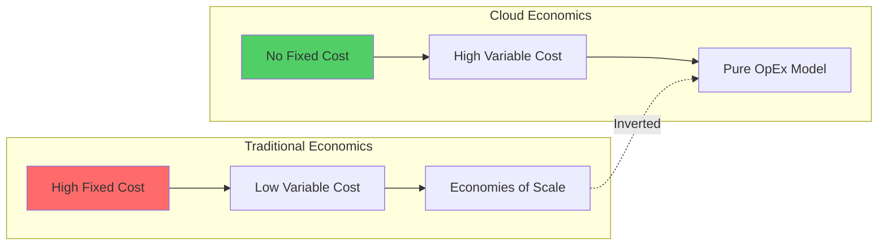
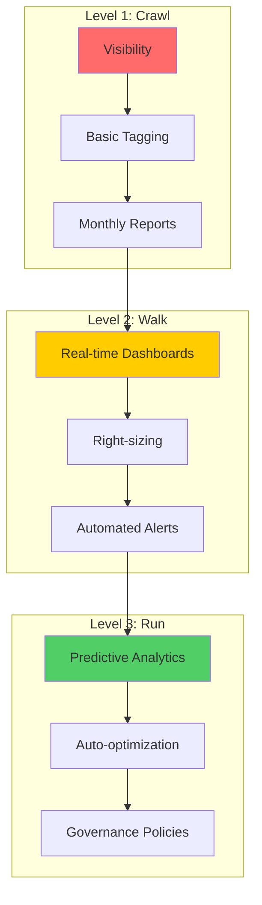

<!-- Navigation -->
[Home](/) → [Part I: Axioms](/part1-axioms/) → [Axiom 8](index.md) → **Axiom 8: Economic Gradient**

# Axiom 8: Economic Gradient

---


## 🔥 The Constraint

### The Fundamental Limit

**All resources have finite economic cost**

This constraint emerges from **Scarcity: limited resources vs unlimited wants**. No amount of engineering can violate this fundamental principle—we can only work within its boundaries.

### Physics Foundation

The practical manifestation of this constraint:
- **Theoretical basis**: Scarcity: limited resources vs unlimited wants
- **Practical limit**: Budget, time-to-market, opportunity cost
- **Real-world impact**: Technical decisions have economic consequences

### Why This Constraint Exists

Unlike software bugs or implementation details, this is a fundamental law of our universe. Understanding this constraint helps us:

1. **Set realistic expectations** - Know what's physically impossible
2. **Make better trade-offs** - Optimize within the possible
3. **Design robust systems** - Work with the constraint, not against it
4. **Avoid false solutions** - Don't chase impossible optimizations

!!! warning "Common Misconception"
    This constraint cannot be "solved" or "eliminated"—only managed and optimized within its boundaries.

---

## 💡 Why It Matters

Technical decisions have economic consequences

### Business Impact

This constraint directly affects:
- **User experience**: Performance and reliability
- **Development velocity**: Time-to-market and maintenance
- **Operational costs**: Infrastructure and support
- **Competitive advantage**: System capabilities and scalability

### Technical Implications

Every engineering decision must account for this constraint:
- **Architecture patterns**: Choose designs that work with the constraint
- **Technology selection**: Pick tools that optimize within the boundaries
- **Performance optimization**: Focus on what's actually improvable
- **Monitoring and alerting**: Track metrics related to the constraint

---

## 🚫 Common Misconceptions

Many engineers hold false beliefs about this constraint:

1. **"Engineer for perfect solution regardless of cost"**
   - This violates the fundamental constraint
   - Reality: The constraint makes this impossible

2. **"Premature optimization is always bad"**
   - This violates the fundamental constraint
   - Reality: The constraint makes this impossible

3. **"Free services have no cost"**
   - This violates the fundamental constraint
   - Reality: The constraint makes this impossible


### Reality Check

The constraint is absolute—these misconceptions arise from:
- **Wishful thinking**: Hoping engineering can overcome physics
- **Local optimization**: Solving one problem while creating others
- **Vendor marketing**: Oversimplified claims about complex systems
- **Incomplete understanding**: Not seeing the full system implications

---

## ⚙️ Practical Implications

How this constraint shapes real system design:

1. **Optimize for business value, not technical perfection**
2. **Consider total cost of ownership (TCO)**
3. **Make trade-offs explicit and measurable**
4. **Design for cost efficiency from the start**


### Engineering Guidelines

When designing systems, always:
- **Start with the constraint**: Acknowledge it in your architecture
- **Measure the constraint**: Monitor relevant metrics
- **Design around the constraint**: Use patterns that work with it
- **Communicate the constraint**: Help stakeholders understand limitations

### Success Patterns

Teams that respect this constraint:
- Set realistic performance goals
- Choose appropriate architectural patterns
- Invest in proper monitoring and observability
- Make trade-offs explicit and data-driven

---


## Level 1: Intuition (Start Here) 🌱

### The Restaurant Metaphor

Running distributed systems is like running a restaurant chain:
- **Rent** = Infrastructure costs (servers, storage)
- **Staff** = Operations team
- **Ingredients** = Data transfer, API calls
- **Equipment** = Software licenses
- **Marketing** = Development costs

**Key Insight**: You can have:
- **Fast Food** (Cheap + Fast = Lower quality)
- **Fine Dining** (Good + Reliable = Expensive)
- **Home Cooking** (Cheap + Good = Slow)

Pick two qualities, pay with the third.

### Real-World Analogy: Home Utilities

```javascript
Your Cloud Bill is Like Your Electric Bill:

Base Load (Always On):
- Refrigerator = Production servers
- HVAC = Databases
- Always running, predictable cost

Variable Load (Usage-Based):
- Microwave = Serverless functions
- Hair dryer = Batch processing
- Pay only when used

Waste (Money Down Drain):
- Lights left on = Idle servers
- Leaky faucet = Unused storage
- Running AC with windows open = Cross-region transfers
```

### Your First Cost Experiment

### The Beginner's Cost Triangle

```yaml
           GOOD
          /    \
         /      \
        /  Pick  \
       /   Two!   \
      /            \
FAST ──────────────── CHEAP

Examples:
- S3: Cheap + Good (not fast)
- DynamoDB: Fast + Good (not cheap)
- Spot Instances: Fast + Cheap (not reliable)
```

---

## Level 2: Foundation (Understand Why) 🌿

### Core Principle: The Economics of Scale



**Key Insight**: Cloud inverts traditional economics - you trade capital efficiency for operational flexibility.

### The True Cost Stack

| Layer | Visible Costs | Hidden Costs | Typical % of Total |
|-------|--------------|--------------|--------------------|
| **Infrastructure** | Compute, storage, network | Overprovisioning, idle resources | 30-40% |
| **Data Transfer** | Egress fees | Cross-region, cross-AZ | 10-20% |
| **Operations** | Monitoring, logging | Alert fatigue, on-call | 15-25% |
| **Development** | Engineer salaries | Context switching, complexity | 30-50% |
| **Opportunity** | Time to market | Technical debt, lock-in | ??? |

### 🎬 Failure Vignette: The Serverless Trap

```yaml
The Startup That Almost Died from Success:
  Date: March 2023
  Company: VideoTranscode.io
  
  The Setup:
    - Small startup, 3 engineers
    - Built entirely on Lambda
    - "Pay only for what you use!"
    - Initial bill: $200/month
  
  The Success:
    - Featured on ProductHunt
    - 100,000 users overnight
    - Each user uploads 5 videos
    - Each video = 1000 Lambda invocations
  
  The Shock:
    Day 1: $2,000
    Day 2: $8,000
    Day 3: $15,000
    Week 1 total: $67,000
  
  The Problem:
    - Lambda: $0.20 per million requests
    - Plus: $0.00001667 per GB-second
    - Video processing = compute heavy
    - No volume discounts
    - No way to throttle
  
  The Rescue:
    - Emergency migration to EC2
    - Reserved instances: 70% cheaper
    - Implemented queuing
    - Added rate limiting
    - Final monthly bill: $8,000
  
  Lessons Learned:
    - Serverless != Cheaperless
    - Unit economics matter at scale
    - Always have a cost circuit breaker
    - Test your billing model, not just code
```

### Cost Dynamics Patterns

```yaml
Linear Costs (Predictable):
  Examples: Storage, CDN bandwidth
  Formula: Cost = Units × Price
  Control: Easy to predict and budget
  
Step Function Costs (Jumpy):
  Examples: Reserved instances, licenses
  Formula: Cost = ceil(Units/Batch) × BatchPrice
  Control: Optimize for batch boundaries
  
Exponential Costs (Dangerous):
  Examples: Cascading retries, data transfer
  Formula: Cost = Base^Growth
  Control: Circuit breakers essential
  
Hidden Costs (Sneaky):
  Examples: NAT gateways, unused snapshots
  Formula: Cost = ∑(Forgotten Resources)
  Control: Regular audits, automation
```

### The Real Cost Equation

```python
Total Cost of Ownership (TCO) = 
    Infrastructure Costs +
    Operational Costs +
    Development Costs +
    Opportunity Costs +
    Risk Costs

Where:
    Infrastructure = Compute + Storage + Network + Licenses
    Operational = Monitoring + Support + On-call + Training
    Development = Salaries + Complexity Tax + Technical Debt
    Opportunity = Time-to-Market Delays + Lock-in Cost
    Risk = Downtime × Revenue Loss + Security Breach Impact
```

---

## Level 3: Deep Dive (Master the Patterns) 🌳

### The FinOps Maturity Model



| Stage | Focus | Metrics | Tools | Savings |
|-------|-------|---------|-------|----------|
| **Crawl** | Visibility | Total spend | Spreadsheets | 5-10% |
| **Walk** | Optimization | Cost per unit | Cloud tools | 20-30% |
| **Run** | Innovation | Unit economics | FinOps platform | 30-50% |

### Build vs Buy Decision Framework

```yaml
Decision Matrix:
  
  Build When:
    ✓ Core differentiator
    ✓ Unique requirements
    ✓ Long-term cheaper
    ✓ Have expertise
    ✗ BUT: Factor in opportunity cost
  
  Buy When:
    ✓ Commodity service
    ✓ Outside core competency
    ✓ Faster time to market
    ✓ Predictable costs
    ✗ BUT: Watch for lock-in
  
  Real Examples:
    Databases:
      Build: Facebook (massive scale)
      Buy: 99% of companies (RDS/DynamoDB)
    
    CDN:
      Build: Netflix (unique needs)
      Buy: Everyone else (CloudFront)
    
    ML Platform:
      Build: Google (innovation)
      Buy: Startups (SageMaker)
```

#### Cost Comparison Calculator

| Factor | Build | Buy (SaaS) | Buy (Managed) |
|--------|-------|------------|---------------|
| **Initial Cost** | $500K-2M | $0 | $0 |
| **Monthly OpEx** | $50K+ | $10-50K | $5-20K |
| **Time to Market** | 6-12 months | 1 week | 1 month |
| **Customization** | Unlimited | Limited | Moderate |
| **Maintenance** | Your team | Vendor | Shared |
| **5-Year TCO** | $3-5M | $0.6-3M | $0.3-1.2M |

### Cost Architecture Patterns

#### 1. The Tiered Storage Pattern

```python
class TieredStorage:
    """
    Optimize storage costs by data access patterns
    """
    def __init__(self):
        self.tiers = [
            {
                'name': 'Hot',
                'storage': 'SSD/Memory',
                'cost_per_gb': 0.30,
                'access_time': '< 1ms',
                'use_case': 'Active data'
            },
            {
                'name': 'Warm',
                'storage': 'Standard S3',
                'cost_per_gb': 0.023,
                'access_time': '< 100ms',
                'use_case': 'Last 30 days'
            },
            {
                'name': 'Cool',
                'storage': 'S3 IA',
                'cost_per_gb': 0.0125,
                'access_time': '< 1s',
                'use_case': 'Quarterly access'
            },
            {
                'name': 'Cold',
                'storage': 'Glacier',
                'cost_per_gb': 0.004,
                'access_time': '1-12 hours',
                'use_case': 'Compliance/Archive'
            }
        ]
    
    def calculate_optimal_tier(self, data_profile):
        """
        Find cheapest tier meeting access requirements
        """
        access_frequency = data_profile['accesses_per_month']
        size_gb = data_profile['size_gb']
        
        costs = {}
        for tier in self.tiers:
            storage_cost = size_gb * tier['cost_per_gb']
            access_cost = self.calculate_access_cost(tier, access_frequency)
            costs[tier['name']] = storage_cost + access_cost
        
        return min(costs, key=costs.get)
```

#### 2. The Spot Fleet Pattern

```yaml
Spot Instance Strategy:
  
  Workload Types:
    Batch Processing:
      Spot %: 90%
      On-Demand %: 10%
      Savings: 70-80%
    
    Web Servers:
      Spot %: 60%
      On-Demand %: 40%  
      Savings: 40-50%
    
    Databases:
      Spot %: 0%
      Reserved %: 100%
      Savings: 30-70%
  
  Implementation:
    1. Diversify across instance types
    2. Use multiple availability zones
    3. Implement graceful shutdown
    4. Save state externally
    5. Auto-replace terminated instances
```

#### 3. The Traffic Shifting Pattern

```python
def calculate_multi_region_costs(traffic_patterns):
    """
    Route traffic to cheapest regions while maintaining performance
    """
    regions = {
        'us-east-1': {'compute': 0.10, 'transfer': 0.09},
        'us-west-2': {'compute': 0.12, 'transfer': 0.09},
        'eu-west-1': {'compute': 0.11, 'transfer': 0.09},
        'ap-south-1': {'compute': 0.08, 'transfer': 0.11}
    }
    
    optimal_routing = {}
    
    for user_region, traffic in traffic_patterns.items():
        # Find cheapest region within latency budget
        candidates = get_regions_within_latency(user_region, max_ms=100)
        
        costs = {}
        for region in candidates:
            compute = regions[region]['compute'] * traffic['requests']
            transfer = regions[region]['transfer'] * traffic['bandwidth_gb']
            costs[region] = compute + transfer
        
        optimal_routing[user_region] = min(costs, key=costs.get)
    
    return optimal_routing
```

### The Hidden Cost Catalog

| Hidden Cost | Example | Typical Impact | Detection | Prevention |
|-------------|---------|----------------|-----------|------------|
| **Data Transfer** | Cross-AZ traffic | $0.01/GB | VPC Flow Logs | Service mesh in same AZ |
| **NAT Gateway** | Outbound traffic | $0.045/hr + $0.045/GB | Cost Explorer | Use endpoints/PrivateLink |
| **Idle Resources** | Stopped instances with EBS | $0.10/GB/month | Resource tagging | Automated cleanup |
| **API Calls** | S3 LIST operations | $0.005 per 1000 | CloudTrail | Batch operations |
| **DNS Queries** | Route53 queries | $0.40 per million | Route53 metrics | Increase TTL |
| **Snapshots** | Forgotten EBS snapshots | $0.05/GB/month | AWS Backup | Lifecycle policies |
| **Elastic IPs** | Unattached IPs | $0.005/hour | Trusted Advisor | Release when unused |
| **CloudWatch** | Detailed monitoring | $3.50 per instance | CW billing | Use basic monitoring |
| **Lambda Storage** | Container images | $0.10/GB/month | Lambda console | Optimize image size |
| **Log Storage** | CloudWatch Logs | $0.03/GB | Log Insights | Compress, lifecycle |

---

## Level 4: Expert (Production Patterns) 🌲

### Case Study: Netflix's Cost Per Stream

```yaml
Netflix Economics (2023 Data):
  
  Scale:
    - 230M subscribers
    - 140M hours watched daily
    - 17,000 titles
    - 190 countries
  
  Infrastructure Costs:
    CDN (Open Connect):
      - Hardware: $100M/year
      - Bandwidth: $800M/year  
      - Cost per GB: $0.001
    
    Compute (AWS):
      - Encoding: $50M/year
      - Control plane: $30M/year
      - Analytics: $40M/year
    
    Storage (S3):
      - Master files: $20M/year
      - Multiple qualities: $60M/year
      - Regional caches: $40M/year
  
  Unit Economics:
    Cost per subscriber: $0.48/month
    Cost per hour streamed: $0.003
    Cost per title encoded: $5,000
    Revenue per subscriber: $15.49/month
    
    Infrastructure margin: 97%!
  
  Optimization Strategies:
    1. Build own CDN (save 80% on bandwidth)
    2. Predictive caching (reduce misses by 45%)
    3. Adaptive bitrate (save 30% bandwidth)
    4. Regional encoding (save 25% compute)
    5. Spot instances for batch (save 70%)
```

#### Netflix's Architecture Decisions by Cost

| Decision | Alternative | Cost Impact | Why |
|----------|-------------|-------------|-----|
| **Build CDN** | Use Akamai | Save $600M/yr | Scale justifies investment |
| **Use AWS** | Build datacenter | Save time-to-market | Focus on content |
| **Microservices** | Monolith | +20% complexity | Enables innovation |
| **Regional POPs** | Central only | +$100M infrastructure | -50% bandwidth cost |
| **Open source** | Commercial | Save $50M licenses | Control destiny |

### Advanced Cost Optimization Tactics

#### 1. Compute Arbitrage

```python
class ComputeArbitrage:
    """Take advantage of pricing differences across regions/types"""
    
    def __init__(self):
        self.pricing = {
            # Region -> Instance Type -> Price
            'us-east-1': {
                'm5.large': 0.096,
                'm5.xlarge': 0.192,
                'c5.large': 0.085
            },
            'us-west-2': {
                'm5.large': 0.098,
                'm5.xlarge': 0.196,
                'c5.large': 0.088
            },
            'spot-us-east-1': {
                'm5.large': 0.035,
                'm5.xlarge': 0.070,
                'c5.large': 0.032
            }
        }
    
    def find_cheapest_capacity(self, requirements):
        """Find optimal mix of instances"""
        needed_vcpus = requirements['vcpus']
        needed_memory = requirements['memory_gb']
        
        options = []
        
        for region, instances in self.pricing.items():
            for instance_type, price in instances.items():
                # Check if instance meets requirements
                if self.meets_requirements(instance_type, requirements):
                    options.append({
                        'region': region,
                        'type': instance_type,
                        'price_per_hour': price,
                        'monthly_cost': price * 730
                    })
        
        return sorted(options, key=lambda x: x['price_per_hour'])
```

#### 2. Smart Reserved Instance Planning

```yaml
RI Strategy Matrix:
  
  Steady State (24/7 workloads):
    Coverage: 90-100%
    Term: 3-year
    Payment: All upfront
    Savings: 72%
  
  Predictable Growth:
    Coverage: 70%
    Term: 1-year
    Payment: Partial
    Savings: 40%
  
  Variable Load:
    Coverage: 40% (baseline)
    Term: 1-year convertible
    Payment: No upfront
    Savings: 31%
  
  Calculation:
    1. Analyze 3 months of usage
    2. Find P10 usage (90% of time above)
    3. Buy RIs for P10 capacity
    4. Use on-demand for spikes
    5. Review monthly
```

#### 3. Data Lifecycle Automation

```python
class DataLifecycleOptimizer:
    def __init__(self):
        self.policies = [
            {
                'name': 'logs',
                'hot_days': 7,
                'warm_days': 30,
                'delete_days': 90,
                'compression': 'gzip'
            },
            {
                'name': 'backups',
                'hot_days': 1,
                'warm_days': 7,
                'cold_days': 30,
                'archive_days': 365,
                'delete_days': 2555  # 7 years
            },
            {
                'name': 'metrics',
                'hot_days': 30,
                'aggregation': [
                    {'after_days': 7, 'resolution': '5min'},
                    {'after_days': 30, 'resolution': '1hour'},
                    {'after_days': 90, 'resolution': '1day'}
                ],
                'delete_days': 395  # 13 months
            }
        ]
    
    def calculate_savings(self, data_volume_gb):
        """Estimate savings from lifecycle policies"""
        # Before: Everything in hot storage
        cost_before = data_volume_gb * 0.30  # $/GB/month
        
        # After: Tiered storage
        hot_percent = 0.10
        warm_percent = 0.20
        cold_percent = 0.70
        
        cost_after = (
            data_volume_gb * hot_percent * 0.30 +
            data_volume_gb * warm_percent * 0.023 +
            data_volume_gb * cold_percent * 0.004
        )
        
        savings = cost_before - cost_after
        savings_percent = (savings / cost_before) * 100
        
        return {
            'monthly_savings': savings,
            'yearly_savings': savings * 12,
            'savings_percent': savings_percent
        }
```

### Cost Anomaly Detection

```python
class CostAnomalyDetector:
    """Detect unusual spending patterns before they hurt"""
    
    def __init__(self):
        self.sensitivity_levels = {
            'high': {'std_dev': 2, 'percent_change': 20},
            'medium': {'std_dev': 3, 'percent_change': 50},
            'low': {'std_dev': 4, 'percent_change': 100}
        }
    
    def detect_anomalies(self, cost_history, sensitivity='medium'):
        """Find cost anomalies using multiple methods"""
        anomalies = []
        
        # Method 1: Statistical deviation
        mean = np.mean(cost_history)
        std = np.std(cost_history)
        threshold = self.sensitivity_levels[sensitivity]['std_dev']
        
        for i, cost in enumerate(cost_history):
            z_score = (cost - mean) / std
            if abs(z_score) > threshold:
                anomalies.append({
                    'day': i,
                    'cost': cost,
                    'z_score': z_score,
                    'method': 'statistical'
                })
        
        # Method 2: Percentage change
        for i in range(1, len(cost_history)):
            change = ((cost_history[i] - cost_history[i-1]) / 
                     cost_history[i-1]) * 100
            
            if abs(change) > self.sensitivity_levels[sensitivity]['percent_change']:
                anomalies.append({
                    'day': i,
                    'cost': cost_history[i],
                    'change_percent': change,
                    'method': 'percentage'
                })
        
        return anomalies

# Alert configuration
class CostAlerts:
    def __init__(self):
        self.rules = [
            {
                'name': 'Daily spike',
                'condition': 'daily_cost > daily_average * 1.5',
                'action': 'email',
                'severity': 'warning'
            },
            {
                'name': 'Budget exceeded',
                'condition': 'monthly_cost > budget * 0.8',
                'action': 'slack',
                'severity': 'critical'
            },
            {
                'name': 'Unusual service',
                'condition': 'new_service in top_10_costs',
                'action': 'investigate',
                'severity': 'info'
            }
        ]
```

---

## Level 5: Mastery (Financial Engineering) 🌴

### The Economics of Distributed Systems

```yaml
Fundamental Economic Laws:
  
  1. Amdahl's Law Extended:
     SpeedupCost = 1 / ((1-P) + P/N + C*N)
     Where: C = coordination cost coefficient
     
     Insight: "Adding nodes increases cost superlinearly"
  
  2. CAP Theorem Economics:
     Cost(Consistency) ∝ N² (consensus overhead)
     Cost(Availability) ∝ N (redundancy)
     Cost(Partition) ∝ log(N) (detection only)
     
     Insight: "Consistency is quadratically expensive"
  
  3. Little's Law for Cost:
     Cost = Arrival Rate × Avg Cost per Request × Avg Time in System
     
     Insight: "Reduce any factor to reduce cost"
  
  4. Network Effects on Cost:
     Value = N²
     Cost = N log N (if designed well)
     Profit = N² - N log N
     
     Insight: "Profit margins increase with scale IF sublinear cost growth"
```

#### The Cost of Distributed System Properties

| Property | Cost Formula | Example | Optimization |
|----------|--------------|---------|-------------|
| **Consistency** | O(N²) messages | Paxos, Raft | Relax to eventual |
| **Availability** | O(N) replicas | 3x replication | Smart placement |
| **Partition Tolerance** | O(log N) detection | Heartbeats | Failure detectors |
| **Scalability** | O(N log N) if sharded | DynamoDB | Consistent hashing |
| **Durability** | O(R) where R=replicas | 3x storage | Erasure coding |
| **Low Latency** | O(1/Distance) | Edge compute | Caching layers |

### Financial Instruments for Infrastructure

```python
class InfrastructureFinance:
    """Apply financial engineering to cloud costs"""
    
    def calculate_savings_plan_roi(self, usage_forecast, commitment_term):
        """
        AWS Savings Plans = Options on compute
        """
        # Similar to buying a call option
        strike_price = usage_forecast * 0.7  # 30% discount
        premium = commitment_term * strike_price
        
        scenarios = {
            'bear': usage_forecast * 0.5,  # Usage drops
            'base': usage_forecast,
            'bull': usage_forecast * 1.5   # Usage grows
        }
        
        roi = {}
        for scenario, usage in scenarios.items():
            if usage > strike_price:
                # In the money
                savings = (usage - strike_price) * 0.3
                roi[scenario] = (savings - premium) / premium
            else:
                # Out of the money
                loss = (strike_price - usage) * 0.7
                roi[scenario] = -loss / premium
        
        return roi
    
    def hedge_cloud_costs(self, monthly_spend):
        """
        Hedging strategies for cloud spend
        """
        strategies = {
            'natural_hedge': {
                'method': 'Revenue-correlated scaling',
                'example': 'Scale with customer count',
                'risk_reduction': 0.6
            },
            'contract_hedge': {
                'method': 'Enterprise agreements',
                'example': 'Commit to $1M for 25% discount',
                'risk_reduction': 0.25
            },
            'operational_hedge': {
                'method': 'Multi-cloud arbitrage',
                'example': 'Shift workloads to cheaper regions',
                'risk_reduction': 0.15
            },
            'financial_hedge': {
                'method': 'Cloud cost insurance',
                'example': 'Cap unexpected costs at 2x',
                'risk_reduction': 0.9
            }
        }
        
        return strategies
```

#### Infrastructure as a Portfolio

```yaml
Portfolio Theory Applied:
  
  Asset Classes:
    - On-Demand: High liquidity, high cost
    - Reserved: Low liquidity, medium cost  
    - Spot: High risk, low cost
    - Serverless: Variable cost, zero fixed
  
  Optimal Portfolio (by workload):
    Production:
      - 70% Reserved Instances
      - 20% On-Demand
      - 10% Auto-scaling
      Risk: Low, Cost: Medium
    
    Development:
      - 30% Reserved
      - 20% On-Demand
      - 50% Spot
      Risk: Medium, Cost: Low
    
    Batch Processing:
      - 10% On-Demand
      - 90% Spot
      Risk: High, Cost: Very Low
    
    Unpredictable:
      - 100% Serverless
      Risk: Cost variability, Cost: Usage-based
```

### The Future: Autonomous Cost Optimization

```python
class AutonomousCostOptimizer:
    """AI-driven infrastructure cost optimization"""
    
    def __init__(self):
        self.models = {
            'demand_forecast': DemandPredictor(),
            'price_forecast': SpotPricePredictor(),
            'workload_classifier': WorkloadAnalyzer(),
            'optimization_engine': CostMinimizer()
        }
    
    async def optimize_continuously(self):
        """Real-time cost optimization loop"""
        while True:
            # 1. Predict next hour's demand
            demand = await self.models['demand_forecast'].predict()
            
            # 2. Forecast spot prices
            prices = await self.models['price_forecast'].predict()
            
            # 3. Classify workloads by interruptibility
            workloads = await self.models['workload_classifier'].analyze()
            
            # 4. Optimize placement
            plan = self.models['optimization_engine'].optimize(
                demand=demand,
                prices=prices,
                workloads=workloads,
                constraints={
                    'max_cost': 10000,
                    'min_availability': 0.999,
                    'max_latency': 100
                }
            )
            
            # 5. Execute plan
            await self.execute_optimization_plan(plan)
            
            # 6. Learn from results
            results = await self.measure_results()
            self.models['optimization_engine'].update(results)
            
            await asyncio.sleep(300)  # 5 minutes

# Future capabilities
class NextGenFinOps:
    capabilities = {
        'Predictive Scaling': {
            'description': 'Scale before demand hits',
            'savings': '30-40%',
            'technology': 'ML + time series'
        },
        'Cross-Cloud Arbitrage': {
            'description': 'Real-time workload migration',
            'savings': '20-30%',
            'technology': 'Multi-cloud orchestration'
        },
        'Quantum Cost Optimization': {
            'description': 'Solve NP-hard placement problems',
            'savings': '40-50%',
            'technology': 'Quantum annealing'
        },
        'Blockchain Cost Attribution': {
            'description': 'Trustless multi-tenant billing',
            'savings': '10-15%',
            'technology': 'Smart contracts'
        }
    }
```

## Summary: Key Insights by Level

### 🌱 Beginner
1. **You can't have fast, good, and cheap**
2. **Hidden costs exceed visible costs**
3. **Monitor costs like system health**

### 🌿 Intermediate
1. **Engineer time most expensive resource**
2. **Serverless can be a trap at scale**
3. **Build vs buy is really about opportunity**

### 🌳 Advanced
1. **Architect for cost from day one**
2. **Data locality drives costs**
3. **Time-shift workloads for savings**

### 🌲 Expert
1. **Unit economics determine survival**
2. **Chaos engineering has positive ROI**
3. **Multi-cloud arbitrage works**

### 🌴 Master
1. **Complexity is a quadratic cost**
2. **Financial engineering applies to infrastructure**
3. **Future is autonomous optimization**

## Quick Reference Card

```yaml
Economics Quick Reference:

Cost Triangle:
  Fast + Good = Expensive
  Fast + Cheap = Unreliable  
  Good + Cheap = Slow

Hidden Costs:
  - Data transfer (especially cross-region)
  - NAT gateways ($45/month + bandwidth)
  - Idle resources (stopped != terminated)
  - API calls (LIST operations add up)
  - Log storage (grows forever)

Optimization Priorities:
  1. Right-size instances (save 30-50%)
  2. Reserved instances (save 40-70%)
  3. Spot for batch (save 70-90%)
  4. Data lifecycle (save 60-80%)
  5. Multi-region optimization (save 20-30%)

FinOps Maturity:
  Crawl: Visibility + Tagging
  Walk: Optimization + Automation
  Run: Predictive + Autonomous

Unit Economics:
  Always calculate:
  - Cost per request
  - Cost per user
  - Cost per transaction
  - Infrastructure margin

Red Flags:
  🚨 Exponential cost growth
  🚨 No cost alerts/budgets
  🚨 Untagged resources
  🚨 Cross-region traffic
  🚨 Serverless at scale
```

### Practical Exercises

#### Exercise 1: Calculate Your Unit Economics 🌱

| Metric | Formula | Your Value |
|--------|---------|------------|
| Cost per request | Monthly cost / Total requests | $______ |
| Cost per user | Monthly cost / Active users | $______ |
| Infrastructure margin | (Revenue - Infra cost) / Revenue | ______% |
| Efficiency ratio | Revenue / Infrastructure cost | ____:1 |

#### Exercise 2: Hidden Cost Hunt 🌿

Run these commands to find waste:
```bash
# Find unattached EBS volumes
aws ec2 describe-volumes --filters "Name=status,Values=available"

# Find unused Elastic IPs  
aws ec2 describe-addresses --query 'Addresses[?AssociationId==null]'

# Find old snapshots
aws ec2 describe-snapshots --owner-ids self --query "Snapshots[?StartTime<'2023-01-01']"

# Calculate potential savings
# Each unattached resource = waste
```

#### Exercise 3: Build vs Buy Analysis 🌳

| Factor | Build | Buy | Winner |
|--------|-------|-----|--------|
| Initial cost | $_____ | $_____ | _____ |
| Monthly cost | $_____ | $_____ | _____ |
| Time to market | _____ months | _____ weeks | _____ |
| Customization | ___/10 | ___/10 | _____ |
| Maintenance burden | ___/10 | ___/10 | _____ |
| **Total Score** | | | _____ |

#### Exercise 4: Design Cost-Optimized Architecture 🌲

Optimize this architecture for cost:
```yaml
Current:
  - 10 always-on m5.xlarge instances
  - 1TB data transfer between AZs daily
  - All data in hot storage (500TB)
  - No reserved instances
  Monthly cost: $15,000

Optimized:
  - [Your changes here]
  - [Estimated savings]
  Target cost: < $5,000
```

#### Exercise 5: FinOps Maturity Assessment 🌴

Rate your organization (1-5):
- [ ] Cost visibility across teams
- [ ] Resource tagging compliance  
- [ ] Automated cost alerts
- [ ] Regular cost reviews
- [ ] Optimization automation
- [ ] Predictive cost modeling
- [ ] Cost-aware architecture
- [ ] FinOps culture

**Score: ___/40** (30+ = Run, 20-30 = Walk, <20 = Crawl)

---

**Next**: [Synthesis: Bringing It All Together →](/part1-axioms/archive-old-8-axiom-structure/synthesis)

*"The most expensive system is the one that doesn't make money. The second most expensive is the one that costs more to run than it earns."*

---

**Next**: [Examples](examples.md)
