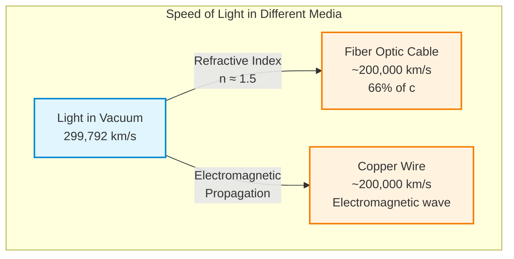
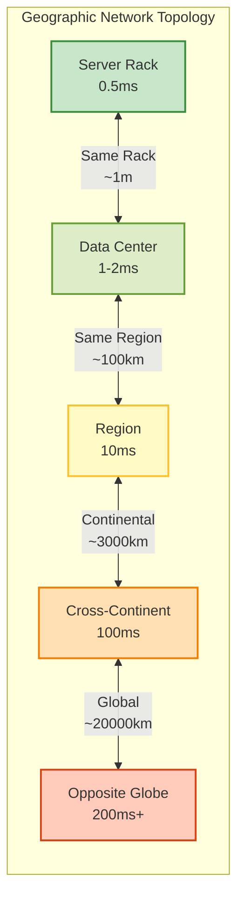

# Axiom 1: Latency (Speed of Light)

!!! info "Prerequisites"
    - [Core Philosophy](../../introduction/philosophy.md)
    - Basic understanding of networks

!!! tip "Quick Navigation"
    [← Axioms Overview](../index.md) | 
    [Examples →](examples.md) | 
    [Exercises →](exercises.md) |
    [→ Next: Capacity](../axiom-2-capacity/index.md)

!!! target "Learning Objective"
    Internalize that latency is physics, not engineering. You can optimize but never eliminate the speed of light constraint.

## Why Should I Care?

<div class="key-takeaway">
  <div class="key-takeaway-header">
    <span class="key-takeaway-icon">💡</span>
    <h3 class="key-takeaway-title">The Billion Dollar Millisecond</h3>
  </div>
  <div class="key-takeaway-content">
    <ul>
      <li><strong>User Experience</strong>: 53% of mobile users abandon sites that take >3 seconds to load</li>
      <li><strong>Revenue</strong>: Amazon loses $1.6B per year for each second of load time</li>
      <li><strong>SEO</strong>: Google uses page speed as a ranking factor</li>
      <li><strong>Architecture</strong>: You can't put all your servers in one location and serve global users</li>
      <li><strong>Cost</strong>: Ignoring physics leads to expensive band-aid solutions</li>
    </ul>
  </div>
</div>

## Metaphysical Foundation

<div class="axiom-box">

### Deductive Origin

This axiom emerges necessarily from **Axiom Zero-B: Time is Asymmetric**

**The Chain of Reasoning**:
1. Time flows in one direction (cause → effect)
2. Information is physical and must propagate through space
3. The speed of light is the universal speed limit
4. **Therefore**: Information transfer requires non-zero time

**The Architect's Burden**: You are not fighting bad code or slow networks. You are fighting the fundamental structure of spacetime itself.

</div>

## Core Concept

<div class="axiom-box">

**Definition:**

```
Latency := Time for information to travel from point A to point B
Minimum Bound: distance / speed_of_light
In fiber: ~200,000 km/s (2/3 of c due to refractive index)
```

**Inevitable Consequences**:
- Geographic distribution has irreducible costs
- "Real-time" is always an approximation
- Synchronous global state is impossible

</div>

<div class="content-break">
  <span class="content-break-icon">🌍</span>
</div>

## The Physics Foundation



| Medium | Speed | Note |
|--------|-------|------|
| Light in vacuum | 299,792 km/s | Theoretical maximum |
| Fiber optic cable | ~200,000 km/s | Refractive index slowdown |
| Copper wire | ~200,000 km/s | Electromagnetic wave |

!!! danger "Fundamental Insight"
    No engineering can overcome physics. This is not a problem to solve but a constraint to accept and design around.
    
    **From Einstein's Relativity**: The speed of light isn't just a speed limit—it's the rate at which causality itself propagates through the universe.

## The Latency Ladder 🪜

<div class="latency-ladder">

```
Same rack:          0.5 ms    ▓
Same DC:            1-2 ms    ▓▓
Same region:        10 ms     ▓▓▓▓▓
Cross-continent:    100 ms    ▓▓▓▓▓▓▓▓▓▓
Opposite globe:     200+ ms   ▓▓▓▓▓▓▓▓▓▓▓▓▓▓▓▓▓▓▓▓
Geosync satellite:  500+ ms   ▓▓▓▓▓▓▓▓▓▓▓▓▓▓▓▓▓▓▓▓▓▓▓▓▓▓▓▓▓▓▓▓▓▓▓▓▓▓▓▓
Mars (best case):   4 min     ▓▓▓▓▓▓▓▓▓▓▓▓▓▓▓▓▓▓▓▓▓▓▓▓▓▓▓▓▓▓▓▓▓▓▓▓▓▓▓▓▓▓▓▓▓▓▓▓▓▓▓▓▓▓▓▓▓▓▓▓
```

</div>



## Why This Matters

### User Experience Impact

| Latency | User Perception |
|---------|-----------------|
| 0-100ms | Instant |
| 100-300ms | Slight delay |
| 300-1000ms | Noticeable lag |
| >1000ms | Mental context switch |
| >10s | Abandonment |

### Business Impact

<div class="concept-cards">
  <div class="concept-card">
    <div class="concept-card-icon">🛒</div>
    <h4 class="concept-card-title">Amazon</h4>
    <p class="concept-card-description">Every 100ms of latency costs 1% in sales</p>
    <div class="concept-card-formula">100ms = -1% revenue</div>
  </div>
  <div class="concept-card">
    <div class="concept-card-icon">🔍</div>
    <h4 class="concept-card-title">Google</h4>
    <p class="concept-card-description">Half-second delay causes 20% traffic drop</p>
    <div class="concept-card-formula">500ms = -20% traffic</div>
  </div>
  <div class="concept-card">
    <div class="concept-card-icon">💹</div>
    <h4 class="concept-card-title">Financial Trading</h4>
    <p class="concept-card-description">1ms advantage translates to millions in profit</p>
    <div class="concept-card-formula">1ms = $$$</div>
  </div>
</div>

## Latency Mathematics

### Round Trip Time (RTT)

```
Total Latency = Network RTT + Processing Time + Queueing Delay

Where:
- Network RTT = 2 × (distance / speed_of_light_in_medium)
- Processing Time = Compute time at each hop
- Queueing Delay = Wait time in buffers
```

### Geographic Calculations

```python
def minimum_latency_ms(distance_km):
    """Calculate theoretical minimum latency"""
    SPEED_OF_LIGHT_FIBER = 200_000  # km/s
    return (distance_km / SPEED_OF_LIGHT_FIBER) * 1000

# Examples
NYC_to_LA = 3_944  # km
print(f"NYC ↔ LA: {minimum_latency_ms(NYC_to_LA):.1f}ms minimum")
# Output: NYC ↔ LA: 19.7ms minimum

NYC_to_London = 5_585  # km
print(f"NYC ↔ London: {minimum_latency_ms(NYC_to_London):.1f}ms minimum")
# Output: NYC ↔ London: 27.9ms minimum
```

Try it yourself with this interactive calculator:

<div data-calculator-type="latency"></div>

## Caching: The Latency Workaround

Since we can't make light faster, we move data closer:

<div class="decision-box">

**🎯 Decision Tree: Cache vs No Cache**

```
START: Is latency a problem?
│
├─ NO → Don't add complexity
│
└─ YES → Can data be stale?
         │
         ├─ NO → Must go to source
         │
         └─ YES → What's the update frequency?
                  │
                  ├─ Seconds → Cache with short TTL
                  ├─ Minutes → Standard caching
                  ├─ Hours → CDN appropriate
                  └─ Days → Static hosting
```

</div>

<div class="section-divider">
  <h2 class="section-divider-title">Debunking Myths</h2>
  <p class="section-divider-subtitle">What won't save you from physics</p>
</div>

## Common Misconceptions

<div class="progressive-disclosure warning">
  <div class="disclosure-header">
    <div class="disclosure-title">
      <span class="disclosure-icon">❌</span>
      <span class="disclosure-text">"5G/6G will eliminate latency"</span>
    </div>
    <span class="disclosure-arrow">▼</span>
  </div>
  <div class="disclosure-content">
    <div class="disclosure-inner">
      <p><strong>Reality</strong>: Wireless technologies actually ADD latency compared to fiber:</p>
      <ul>
        <li>Radio waves travel at speed of light, same as fiber</li>
        <li>Additional protocol overhead for wireless communication</li>
        <li>Contention and interference add variability</li>
        <li>5G reduces processing latency, not propagation delay</li>
      </ul>
    </div>
  </div>
</div>

<div class="progressive-disclosure warning">
  <div class="disclosure-header">
    <div class="disclosure-title">
      <span class="disclosure-icon">❌</span>
      <span class="disclosure-text">"Quantum networking will be instant"</span>
    </div>
    <span class="disclosure-arrow">▼</span>
  </div>
  <div class="disclosure-content">
    <div class="disclosure-inner">
      <p><strong>Reality</strong>: Quantum entanglement doesn't enable faster-than-light communication:</p>
      <ul>
        <li>No information can be transmitted via entanglement alone</li>
        <li>Classical channel still needed, limited by c</li>
        <li>Quantum advantage is in security, not speed</li>
      </ul>
    </div>
  </div>
</div>

<div class="progressive-disclosure warning">
  <div class="disclosure-header">
    <div class="disclosure-title">
      <span class="disclosure-icon">❌</span>
      <span class="disclosure-text">"Better servers reduce network latency"</span>
    </div>
    <span class="disclosure-arrow">▼</span>
  </div>
  <div class="disclosure-content">
    <div class="disclosure-inner">
      <p><strong>Reality</strong>: Server performance and network latency are independent:</p>
      <ul>
        <li>Processing time ≠ propagation delay</li>
        <li>Faster servers help with computation, not distance</li>
        <li>Network latency is purely physics-based</li>
      </ul>
    </div>
  </div>
</div>

## Design Patterns

### 1. Edge Computing
Move computation to data rather than data to computation

### 2. Predictive Prefetching
Guess what users need before they ask

### 3. Regional Sharding
Keep related data in same geographic region

### 4. Eventual Consistency
Accept stale data to avoid round trips

## Real-World Applications

### CDN Architecture
```
User → Edge Server (5ms) → Origin (100ms)
         ↓
    Cached Content
```

### Multi-Region Databases
```
Write to local region → Async replicate globally
Read from local replica → Avoid cross-region latency
```

### Video Streaming
```
Adaptive bitrate based on RTT measurements
Buffer ahead based on latency predictions
```

<div class="truth-box">

**Counter-Intuitive Truth 💡**

Adding more servers can INCREASE latency if it adds more hops. The fastest distributed system is often the one with fewer, better-placed nodes.

</div>

## Measuring Latency

### Key Metrics

- **Average**: Misleading for user experience
- **Median (P50)**: Typical user experience
- **P95/P99**: Tail latency, worst case
- **P99.9**: The pathological cases

### Tools & Techniques

```bash
# Basic latency test
ping -c 10 google.com

# Trace route path
traceroute google.com

# Application-level timing
curl -w "@curl-format.txt" -o /dev/null -s https://example.com
```

## Related Concepts

- **[Axiom 2: Capacity](../axiom-2-capacity/index.md)**: Latency increases with load
- **[Axiom 5: Coordination](../axiom-5-coordination/index.md)**: Consensus requires multiple round trips
- **[Work Distribution](../../part2-pillars/pillar-1-work/index.md)**: Routing affects latency

## The Synthesis: From Physics to Patterns

<div class="truth-box">

### The Deductive Chain

```
Metaphysical Truth: Time is Asymmetric
    ↓
Physical Law: Speed of light is finite (c = 299,792 km/s)
    ↓
System Constraint: Minimum latency = distance/c
    ↓
Engineering Response: Geographic distribution of compute/data
    ↓
Operational Pattern: CDNs, Edge Computing, Caching
```

Each level follows necessarily from the one above. There is no choice, only recognition.

</div>

## How This Axiom Leads to Pillars

<div class="connection-box">

The latency constraint directly drives several architectural patterns:

**→ [Distribution of Work](../../part2-pillars/pillar-1-work/index.md)**  
Because you can't beat physics, you must bring computation closer to users through edge computing, CDNs, and geographic load balancing.

**→ [Distribution of State](../../part2-pillars/pillar-2-state/index.md)**  
Since data access is limited by distance, you need caching layers, read replicas, and geographic data distribution.

**→ [Distribution of Truth](../../part2-pillars/pillar-3-truth/index.md)**  
When nodes are far apart, achieving consensus takes longer. This forces trade-offs between consistency and responsiveness.

</div>

<div class="section-divider">
  <h2 class="section-divider-title">Key Takeaways</h2>
  <p class="section-divider-subtitle">Remember these fundamentals</p>
</div>

<div class="key-takeaway success">
  <div class="key-takeaway-header">
    <span class="key-takeaway-icon">🎯</span>
    <h3 class="key-takeaway-title">The Five Laws of Latency</h3>
  </div>
  <div class="key-takeaway-content">
    <ol>
      <li><strong>Physics sets the floor</strong> - You can approach but never beat light speed</li>
      <li><strong>Distance equals delay</strong> - Geography matters in system design</li>
      <li><strong>Cache or suffer</strong> - Move data close to users</li>
      <li><strong>Measure percentiles</strong> - Averages hide the pain</li>
      <li><strong>Design for physics</strong> - Work with constraints, not against them</li>
    </ol>
  </div>
</div>

## Navigation

!!! tip "Continue Learning"
    
    **Deep Dive**: [Latency Examples & Failures](examples.md) →
    
    **Practice**: [Latency Exercises](exercises.md) →
    
    **Next Axiom**: [Axiom 2: Finite Capacity](../axiom-2-capacity/index.md) →
    
    **Jump to**: [Part II: Pillars](../../part2-pillars/index.md) | [Tools](../../tools/latency-calculator.md)