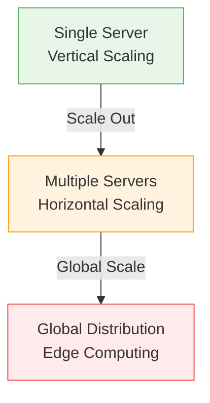

# Axiom 2: Finite Capacity

!!! info "Prerequisites"
    - [Axiom 1: Latency](../axiom-1-latency/index.md)
    - Basic understanding of system resources

!!! tip "Quick Navigation"
    [← Axiom 1](../axiom-1-latency/index.md) | 
    [Examples →](examples.md) | 
    [Exercises →](exercises.md) |
    [→ Next: Partial Failure](../axiom-3-failure/index.md)

!!! target "Learning Objective"
    Every resource has a breaking point; find it before production does.

## Core Concept

<div class="axiom-box">

**Core Principle:**

```
Every system component has finite:
- CPU cycles per second
- Memory bytes
- Network packets/sec  
- Disk IOPS
- Connection pool slots
- Thread count
- Queue depth

Corollary: Infinite scaling is a lie sold by cloud vendors
```

</div>

## The Thermodynamics Angle

!!! quote "Physics Connection"
    Just as energy cannot be created or destroyed, computational capacity cannot be materialized from nothing. It can only be moved (migration), transformed (optimization), or purchased (scaling).

## Scale-Up vs Scale-Out



<div class="decision-box">

**🎯 Decision Tree: Scale-Up vs Scale-Out**

```
START: Need more capacity
  │
  ├─ Is workload parallelizable?
  │   ├─ NO → Scale UP (bigger box)
  │   └─ YES → Continue
  │
  ├─ Is data easily partitioned?
  │   ├─ NO → Scale UP + Read replicas
  │   └─ YES → Continue  
  │
  ├─ Can tolerate eventual consistency?
  │   ├─ NO → Scale UP to limits, then shard carefully
  │   └─ YES → Scale OUT (add nodes)
  │
  └─ Result: Your scaling strategy
```

</div>

## Capacity Arithmetic

### Formula
```
Effective Capacity = Raw Capacity × Utilization Factor × Efficiency Factor

Where:
- Utilization Factor = 1 - (idle + overhead)
- Efficiency Factor = 1 / (1 + coordination_cost)
```

### Example
```
Raw: 100 CPU cores
Utilization: 0.7 (30% overhead)
Efficiency: 0.8 (25% coordination cost)
Effective: 100 × 0.7 × 0.8 = 56 cores actual work
```

## Real Capacity Limits (2024)

| Component | Practical Limit | Notes |
|-----------|----------------|--------|
| PostgreSQL | 5000 connections | With connection pooling |
| Redis | 10K ops/sec/core | Single-threaded |
| Kafka | 1M messages/sec/broker | With proper tuning |
| Load Balancer | 100K concurrent connections | Hardware dependent |
| Docker | ~10K containers/host | Resource dependent |
| Kubernetes | 5000 nodes/cluster | etcd limitation |
| Elasticsearch | 1000 shards/node | Recommended maximum |

## Little's Law - The Foundation

<div class="axiom-box">

**Little's Law - The Universal Queue Equation:**

```
L = λ × W

Where:
L = Average number of items in system
λ = Average arrival rate
W = Average time in system

This law is ALWAYS true for stable systems
```

</div>

## The Saturation Curve

<div class="latency-ladder" style="font-family: monospace; background: #f5f5f5; padding: 2rem; border-radius: 8px;">

```
Response Time
    │
400ms│                                    ╱
    │                                  ╱│ 
300ms│                               ╱  │ THE CLIFF
    │                            ╱     │
200ms│                        ╱        │
    │                     ╱           │
100ms│              ╱ ─ ─             │
    │      ─ ─ ─                     │
  0ms└────────────────────────────────┴─────
    0%   20%   40%   60%   80%  90% 95% 100%
                    Utilization →
```

</div>

## Why The Cliff Exists

| Utilization | Queue Wait Time | Total Response Time |
|-------------|-----------------|-------------------|
| 0% | 0 | Service time only |
| 50% | Service time × 0.5 | 1.5 × service time |
| 80% | Service time × 4 | 5 × service time |
| 90% | Service time × 9 | 10 × service time |
| 95% | Service time × 19 | 20 × service time |
| 99% | Service time × 99 | 100 × service time! |

### Mathematical Proof
```
For M/M/1 queue:
W = 1/(μ - λ)

Where μ = service rate, λ = arrival rate
Utilization ρ = λ/μ

Therefore:
W = 1/(μ(1 - ρ))

As ρ → 1, W → ∞
```

## Practical Application

| Component | Safe Utilization | Danger Zone | Action at Danger |
|-----------|-----------------|-------------|------------------|
| **CPU** | 70% | >85% | Add cores/nodes |
| **Memory** | 80% | >90% | Increase RAM/swap |
| **Network** | 60% | >75% | Upgrade bandwidth |
| **Disk I/O** | 50% | >70% | Add SSDs/RAID |
| **Thread Pool** | 60% | >80% | Increase pool size |
| **Database Conn** | 50% | >70% | Add read replicas |

<div class="truth-box">

**Counter-Intuitive Truth** 💡

Running at 100% capacity means you're already over capacity. Systems need breathing room for spikes, garbage collection, and maintenance. Target 60-70% steady-state.

</div>

## Queue Disciplines

!!! info "Queue Disciplines Compared"
    | Type | Fairness | Use Case | Trade-off |
    |------|----------|----------|-----------|
    | **FIFO** | Fair | Default choice | Head-of-line blocking |
    | **LIFO** | Unfair | Timeout scenarios | Recent requests served first |
    | **Priority** | Unfair | Critical ops first | Can starve low-priority |
    | **WFQ** | Fair | Prevent starvation | More complex |
    | **RED** | Proactive | Prevent congestion | Drops packets early |

## Related Concepts

- **[Axiom 1: Latency](../axiom-1-latency/index.md)**: Latency increases with load
- **[Axiom 3: Partial Failure](../axiom-3-failure/index.md)**: Capacity exhaustion causes failures
- **[Work Distribution](../../part2-pillars/pillar-1-work/index.md)**: Load balancing strategies

## Key Takeaways

!!! success "Remember"
    
    1. **Every resource has limits** - Find them before production does
    2. **The cliff is real** - Systems break suddenly at high utilization  
    3. **70-80% is the knee** - Stay below for stable performance
    4. **Little's Law always applies** - L = λW is universal
    5. **Capacity planning is risk management** - Not optimization

## Navigation

!!! tip "Continue Learning"
    
    **Deep Dive**: [Capacity Examples & Failures](examples.md) →
    
    **Practice**: [Capacity Exercises](exercises.md) →
    
    **Next Axiom**: [Axiom 3: Partial Failure](../axiom-3-failure/index.md) →
    
    **Jump to**: [Capacity Calculator](../../tools/capacity-planner.md) | [Part II](../../part2-pillars/index.md)