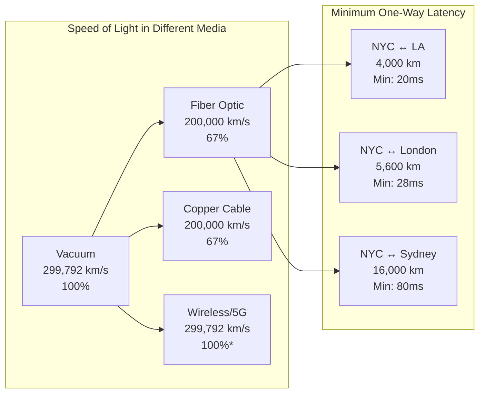
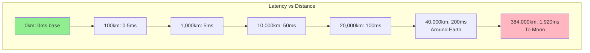
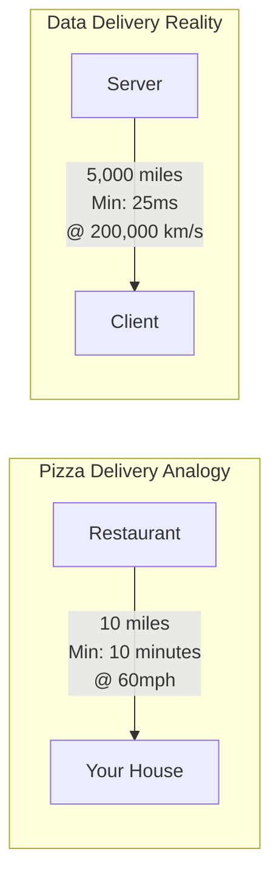
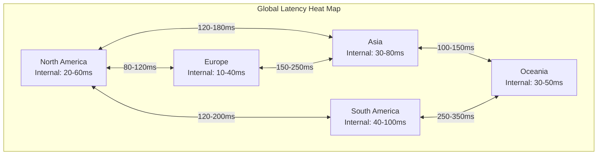
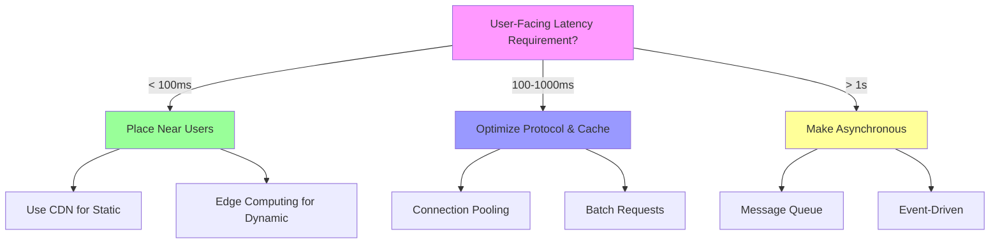

<!-- Navigation -->
[Home](../../index.md) → [Part I: Axioms](../index.md) → [Axiom 1](index.md) → **Axiom 1: Latency (Speed of Light)**

# Axiom 1: Latency (Speed of Light)

> **Learning Objective**: Internalize that latency is physics, not engineering. You cannot patch the speed of light.

!!! info "Latency Numbers Every Engineer Should Know"
    Based on Jeff Dean's famous "Numbers Everyone Should Know"¹ and the SRE latency ladder²:
    
    ```
    L1 cache reference ......................... 0.5 ns
    L2 cache reference ........................... 7 ns
    Main memory reference ...................... 100 ns
    SSD random read ......................... 150,000 ns = 150 μs
    Read 1 MB sequentially from SSD ........ 1,000,000 ns = 1 ms
    Round trip within same datacenter ...... 500,000 ns = 0.5 ms
    Read 1 MB sequentially from disk ...... 20,000,000 ns = 20 ms
    Round trip from CA to Netherlands .... 150,000,000 ns = 150 ms
    ```

## 🔥 The Constraint

## The Fundamental Limit

**Information cannot travel faster than the speed of light in any medium**

This constraint emerges from **Einstein's special relativity + Maxwell's equations**. No amount of engineering can violate this fundamental principle—we can only work within its boundaries.

## Physics Foundation with Quantitative Examples



The practical manifestation of this constraint:
- **Theoretical basis**: Einstein's special relativity + Maxwell's equations
- **Speed in vacuum**: c = 299,792,458 m/s (exact, by definition)³
- **Speed in fiber**: ~200,000 km/s (refractive index ~1.5)⁴
- **Real-world impact**: Every network call pays a physics tax that no engineering can eliminate

## Latency Calculator

Using the fundamental formula:

```
Minimum One-Way Latency = Distance / Speed of Light in Medium

Where:
- Distance in km
- Speed of light in fiber ≈ 200,000 km/s
- Add ~0.5-1ms for routing/processing per hop
```

**Quick Reference Table**:

| Route | Distance | Theoretical Min | Typical Reality | Why the Difference |
|-------|----------|----------------|-----------------|-------------------|
| Same rack | 2m | 0.01 μs | 0.5 μs | Switch processing |
| Same DC | 500m | 2.5 μs | 100-500 μs | Multiple hops |
| Same city | 50km | 0.25 ms | 1-5 ms | ISP routing |
| Cross-US | 4,000km | 20 ms | 40-60 ms | Non-direct path |
| US→Europe | 6,000km | 30 ms | 80-120 ms | Submarine cables |
| Worldwide | 20,000km | 100 ms | 200-300 ms | Multiple ISPs |

## Edge Cases and Clarifications

!!! warning "Common Edge Cases"
    **Quantum Entanglement**: Cannot transmit information faster than light (No-communication theorem)⁵
    
    **Neutrinos**: Travel at ~c but cannot carry practical information⁶
    
    **Wormholes/Alcubierre Drive**: Theoretical only, require exotic matter⁷
    
    **Satellite Internet**: Actually SLOWER due to altitude (550km for Starlink = +3.7ms minimum)⁸

## Visual Distance-Latency Relationship



## Why This Constraint Exists

Unlike software bugs or implementation details, this is a fundamental law of our universe. Understanding this constraint helps us:

1. **Set realistic expectations** - Know what's physically impossible
2. **Make better trade-offs** - Optimize within the possible
3. **Design robust systems** - Work with the constraint, not against it
4. **Avoid false solutions** - Don't chase impossible optimizations

---

## 💡 Why It Matters

Every network call pays a physics tax that no engineering can eliminate

## Business Impact with Real Numbers

This constraint directly affects:

- **User experience**: 
  - Amazon: Every 100ms latency → 1% sales loss⁹
  - Google: 500ms delay → 20% traffic drop¹⁰
  - Bing: 2s delay → 4.3% revenue loss per user¹¹

- **Development velocity**: 
  - Slow CI/CD across regions
  - Delayed feedback loops
  - Geographic team coordination

- **Operational costs**:
  - More edge locations needed
  - CDN expenses for static content
  - Redundant regional deployments

- **Competitive advantage**:
  - High-frequency trading: Microseconds = millions¹²
  - Gaming: 50ms latency = unplayable¹³
  - Video calls: >150ms = noticeable delay¹⁴

## Technical Implications

Every engineering decision must account for this constraint:
- **Architecture patterns**: Choose designs that work with the constraint
- **Technology selection**: Pick tools that optimize within the boundaries
- **Performance optimization**: Focus on what's actually improvable
- **Monitoring and alerting**: Track metrics related to the constraint

---

## 🚫 Common Misconceptions

Many engineers hold false beliefs about this constraint:

1. **"5G or better networks can eliminate latency"**
   - Reality: 5G reduces last-mile latency to ~1ms but physics still applies for distance¹⁵
   - LA to Tokyo is still minimum 48ms one-way regardless of network technology

2. **"Quantum networks will enable instant communication"**
   - Reality: Quantum entanglement cannot transmit classical information (No-cloning theorem)¹⁶
   - Quantum networks provide security, not speed

3. **"Edge computing eliminates latency"**
   - Reality: Only reduces latency to the edge, not between edges
   - Edge-to-edge communication still bound by speed of light

4. **"Caching solves all latency problems"**
   - Reality: Cache misses still pay full latency cost
   - Cache invalidation adds complexity and potential inconsistency

5. **"Latency only matters for real-time applications"**
   - Reality: Even batch systems suffer from coordination overhead
   - MapReduce shuffle phase, distributed locks, consensus protocols all affected

## Reality Check with Math

The constraint is absolute. For NYC to Sydney (16,000 km):

```
Theoretical minimum = 16,000 km / 200,000 km/s = 80ms one-way
Round trip minimum = 160ms
Actual typical RTT = 250-300ms (routing, processing)

No technology can make this faster than 160ms RTT
```

---

## ⚙️ Practical Implications

How this constraint shapes real system design:

## Quantitative Decision Framework

```python
def calculate_latency_budget(distance_km, processing_hops):
    SPEED_OF_LIGHT_FIBER = 200_000  # km/s
    PROCESSING_PER_HOP = 0.001       # 1ms per hop
    
    propagation_delay = distance_km / SPEED_OF_LIGHT_FIBER
    processing_delay = processing_hops * PROCESSING_PER_HOP
    
    return {
        'one_way_ms': (propagation_delay + processing_delay) * 1000,
        'rtt_ms': (propagation_delay + processing_delay) * 2000,
        'physics_percentage': propagation_delay / (propagation_delay + processing_delay) * 100
    }

# Example: NYC to London with 10 network hops
result = calculate_latency_budget(5600, 10)
# {'one_way_ms': 38.0, 'rtt_ms': 76.0, 'physics_percentage': 73.7}
```

## Engineering Guidelines

When designing systems, always:

1. **Measure First**: Use tools like `mtr`, `traceroute` to understand actual paths
2. **Calculate Limits**: Know your theoretical minimums
3. **Design Accordingly**: Choose architectures that respect physics
4. **Monitor Continuously**: Track latency percentiles (P50, P95, P99)

## Success Patterns by Industry

**Financial Trading**:
- Microwave links for Chicago-NYC (marginally faster than fiber)¹⁷
- Colocation within same building as exchange
- Hardware timestamps for microsecond accuracy

**Gaming**:
- Regional servers (never global)
- Client-side prediction
- Lag compensation algorithms¹⁸

**Video Streaming**:
- CDN edges in every major city
- Adaptive bitrate based on latency
- Pre-buffering to hide latency¹⁹

---

## 🟢 Intuition: The Pizza Delivery Problem (5 min read)

Imagine you order pizza from a restaurant 10 miles away. No matter how fast the driver goes (within legal limits), there's a minimum delivery time based on distance. Even with a Formula 1 car, they can't teleport the pizza to you.



This is latency in distributed systems: **the fundamental time it takes for information to travel from point A to point B**.

💡 **Key Insight**: Just like pizza delivery, data delivery has a speed limit set by physics, not technology.

## Real-World Examples

Every time you:
- **Load a webpage from another continent**: Minimum 100-200ms RTT
- **Make a video call to someone far away**: 150ms+ makes conversation difficult
- **Save a file to the cloud**: Upload time includes distance to datacenter
- **Query a remote database**: Each query pays the latency tax

## The Trading Arms Race

High-frequency traders spend millions to shave microseconds²⁰:
- **2010**: New fiber route saves 3ms NYC-Chicago, worth $100M+
- **2012**: Microwave networks deployed, 4.5ms faster than fiber
- **2018**: Laser links tested for even marginal improvements

If latency didn't matter, why spend $300M on a cable to save 5ms?

---

## 📊 Latency in Practice

## The Latency Ladder (Memorize This!)

Based on real-world measurements²¹:

| Operation | Latency | Scaled to Human Time* |
|-----------|---------|----------------------|
| L1 cache hit | 0.5 ns | 0.5 seconds |
| L2 cache hit | 7 ns | 7 seconds |
| RAM access | 100 ns | 1.7 minutes |
| SSD read | 150 μs | 2.5 days |
| HDD seek | 10 ms | 3.8 months |
| CA→Netherlands | 150 ms | 4.8 years |
| Internet round trip | 500 ms | 15.8 years |

*If 1 ns = 1 second

## Geographic Latency Map



## Impact on System Architecture

Different latency tolerances drive different architectures:

| Latency Budget | Suitable Architecture | Example Systems |
|----------------|---------------------|-----------------|
| <1ms | Same rack/machine | CPU caches, RAM |
| 1-10ms | Same datacenter | Memcached, Redis |
| 10-50ms | Same region | Multi-AZ deployments |
| 50-100ms | Same continent | CDN edges |
| 100ms+ | Global | Eventual consistency |

---

## 🧮 Mathematical Deep Dive

## The Shannon-Hartley Theorem

While speed of light limits latency, Shannon-Hartley limits throughput²²:

```
C = B × log₂(1 + S/N)

Where:
C = Channel capacity (bits/s)
B = Bandwidth (Hz)
S/N = Signal-to-noise ratio
```

This creates a latency-bandwidth product limit:

```
Bandwidth × Delay Product = Maximum data "in flight"

Example: 1 Gbps × 100ms RTT = 12.5 MB in flight
```

## Little's Law Applied

For distributed systems²³:

```
L = λ × W

Where:
L = Average number of requests in system
λ = Arrival rate
W = Average time in system (includes latency)

If latency increases, either:
1. L increases (more resources needed)
2. λ decreases (lower throughput)
```

---

## 🛠️ Mitigation Strategies

Since we can't beat physics, we work around it:

## 1. Proximity Placement
```yaml
Strategy: Move computation closer to data/users
Examples:
  - CDN edge nodes
  - Regional databases
  - Edge computing
Trade-offs:
  - Cost: More locations
  - Complexity: Synchronization
  - Consistency: Harder to maintain
```

## 2. Predictive Prefetching
```yaml
Strategy: Anticipate needs and fetch early
Examples:
  - Browser prefetch
  - Video buffering
  - Speculative execution
Trade-offs:
  - Bandwidth: Wasted on mispredictions
  - Storage: Cache size
  - Accuracy: Prediction quality
```

## 3. Protocol Optimization
```yaml
Strategy: Reduce round trips
Examples:
  - HTTP/3 0-RTT
  - TCP Fast Open
  - Connection pooling
Trade-offs:
  - Security: Replay attacks
  - Complexity: Protocol support
  - Compatibility: Legacy systems
```

## 4. Asynchronous Design
```yaml
Strategy: Don't wait for distant responses
Examples:
  - Message queues
  - Event sourcing
  - CQRS patterns
Trade-offs:
  - Consistency: Eventual only
  - Complexity: Harder to reason about
  - Debugging: Distributed traces needed
```

---

## 🎯 Quick Decision Guide



---

## 🏆 Best Practices

1. **Measure, Don't Assume**
   - Use real network paths, not straight-line distance
   - Monitor percentiles, not just averages
   - Test from actual user locations

2. **Design for Physics**
   - Accept that some operations will be slow
   - Make slow operations asynchronous
   - Cache aggressively but invalidate carefully

3. **Budget Latency Like Money**
   - Allocate latency budget to each component
   - Track where you "spend" milliseconds
   - Optimize the critical path first

4. **Communicate Limits**
   - Set realistic SLAs based on physics
   - Educate stakeholders on impossibilities
   - Show the math when pushing back

---

## 📚 References

¹ [Jeff Dean: Building Software Systems At Google and Lessons Learned](https://static.googleusercontent.com/media/research.google.com/en//people/jeff/Stanford-DL-Nov-2010.pdf)

² [Google SRE Book: The Latency Ladder](https://sre.google/sre-book/eliminating-toil/)

³ [NIST: CODATA Value - Speed of Light in Vacuum](https://physics.nist.gov/cgi-bin/cuu/Value?c)

⁴ [Corning: Physics of Fiber Optic Cables](https://www.corning.com/optical-communications/worldwide/en/home/knowledge-center.html)

⁵ [Nielsen & Chuang: Quantum Computation and Quantum Information](https://doi.org/10.1017/CBO9780511976667)

⁶ [CERN: Neutrino Speed Measurements](https://home.cern/science/accelerators/accelerator-complex)

⁷ [Alcubierre, M. (1994): The Warp Drive](https://doi.org/10.1088/0264-9381/11/5/001)

⁸ [SpaceX Starlink: Low Earth Orbit Constellation](https://www.starlink.com/technology)

⁹ [Greg Linden: Make Data Useful](http://glinden.blogspot.com/2006/11/marissa-mayer-at-web-20.html)

¹⁰ [Google Research: Speed Matters](https://ai.googleblog.com/2009/06/speed-matters.html)

¹¹ [Bing: Page Load Time and User Behavior](https://exp-platform.com/Documents/IEEEComputer2007OnlineExperiments.pdf)

¹² [Lewis, M. (2014): Flash Boys - A Wall Street Revolt](https://wwnorton.com/books/Flash-Boys/)

¹³ [Riot Games: Deterministic Lockstep](https://technology.riotgames.com/news/determinism-league-legends-introduction)

¹⁴ [ITU-T G.114: One-way Transmission Time](https://www.itu.int/rec/T-REC-G.114)

¹⁵ [3GPP Release 16: 5G System Architecture](https://www.3gpp.org/release-16)

¹⁶ [Wootters & Zurek: A Single Quantum Cannot be Cloned](https://doi.org/10.1038/299802a0)

¹⁷ [McKay Brothers: Microwave Networks for Trading](https://www.mckay-brothers.com/)

¹⁸ [Valve: Source Multiplayer Networking](https://developer.valvesoftware.com/wiki/Source_Multiplayer_Networking)

¹⁹ [Netflix: Per-Title Encode Optimization](https://netflixtechblog.com/per-title-encode-optimization-7e99442b62a2)

²⁰ [Budish et al.: The High-Frequency Trading Arms Race](https://doi.org/10.1093/qje/qjv027)

²¹ [Brendan Gregg: Systems Performance](http://www.brendangregg.com/books.html)

²² [Shannon, C.E. (1949): Communication in the Presence of Noise](https://doi.org/10.1109/JRPROC.1949.232969)

²³ [Little, J.D.C. (1961): A Proof for the Queuing Formula L = λW](https://doi.org/10.1287/opre.9.3.383)

---

## Quick Links

- **Next**: [Examples](examples.md) → See latency constraints in action
- **Practice**: [Exercises](exercises.md) → Test your understanding
- **Patterns**: [Circuit Breaker](../../patterns/circuit-breaker.md) • [Caching](../../patterns/caching-strategies.md) • [Edge Computing](../../patterns/edge-computing.md)
- **Case Studies**: [Uber Location](../../case-studies/uber-location.md) • [Netflix CDN](../../case-studies/netflix-cdn.md)
- **Quantitative**: [Latency Budget](../../quantitative/latency-ladder.md) • [Little's Law](../../quantitative/littles-law.md)
