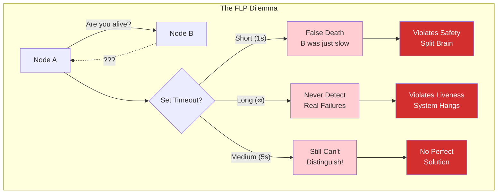
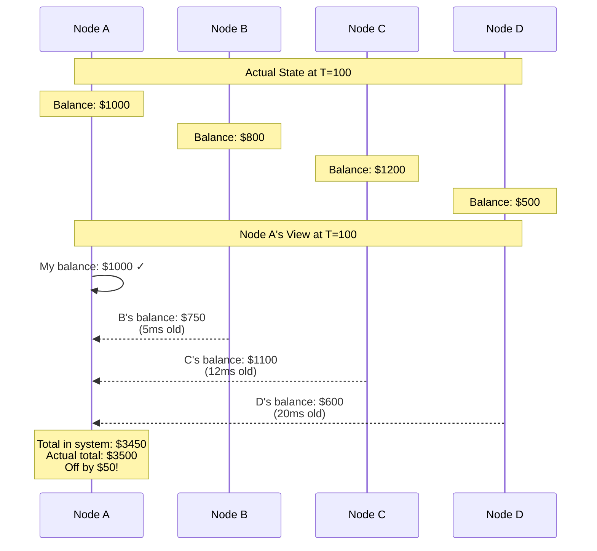
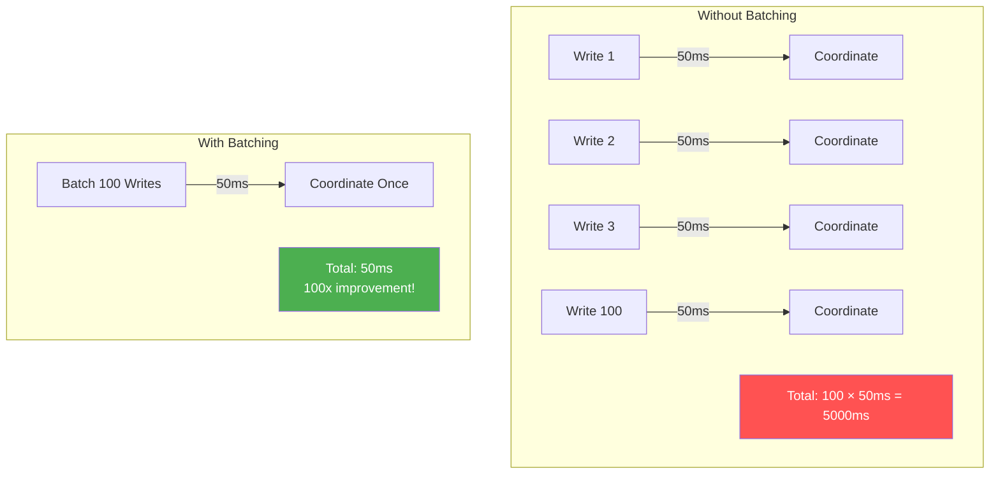

# Law 2: The Law of Physical and Information Asynchrony

> "The time required for information to propagate between nodes is variable, non-zero, and creates fundamental uncertainty."

## Beyond the Speed of Light

The speed of light in fiber optic cable (~200,000 km/s) sets a hard lower bound on latency. But this is just the beginning of the story. The real complexity comes from the variability and uncertainty that asynchrony introduces.


## The Three Faces of Asynchrony

### 1. Physical Asynchrony: You Can't Beat Physics
**Definition**: Information transfer is bounded by the speed of light and physical distance.

**Implications**:
- NYC ↔ London: Minimum 28ms RTT (physics)
- Actual: 60-80ms RTT (routing, switching)
- Sydney ↔ London: Minimum 85ms RTT
- Actual: 250-300ms RTT

**The Geographic Arbitrage**:
```python
# Financial trading example
def calculate_information_advantage(location_a, location_b, exchange):
    """Calculate time advantage of being closer to exchange"""
    distance_a = calculate_distance(location_a, exchange)
    distance_b = calculate_distance(location_b, exchange)
    
    # Speed of light in fiber
    c_fiber = 200_000  # km/s
    
    latency_a = distance_a / c_fiber
    latency_b = distance_b / c_fiber
    
    advantage_ms = (latency_b - latency_a) * 1000
    
    # In high-frequency trading, microseconds = millions
    return advantage_ms
```

### 2. Network Asynchrony: The Internet Is Not a Pipe
**Definition**: Packet-switched networks introduce variable, unpredictable delays.

**Sources of Variability**:
- **Routing Changes**: BGP updates change paths
- **Congestion**: Buffers fill, packets queue
- **Packet Loss**: Requires retransmission
- **Middleboxes**: Firewalls, load balancers add processing


### 3. Processing Asynchrony: Nodes Have Their Own Time
**Definition**: Each node processes at its own rate, affected by load, GC, and other tasks.

**The Uncertainty Principle**:

```mermaid
gantt
    title Request Processing Timeline - The Uncertainty
    dateFormat X
    axisFormat %L
    
    section Best Case (7ms)
    CPU Available       :done, cpu1, 0, 0
    Lock Available      :done, lock1, 0, 0  
    Work Processing     :active, work1, 0, 1
    DB Cache Hit        :done, db1, 1, 5
    Network Fast        :done, net1, 6, 1
    
    section Typical Case (250ms)
    CPU Wait            :crit, cpu2, 0, 20
    Lock Contention     :crit, lock2, 20, 50
    Work Processing     :active, work2, 70, 5
    DB Query            :done, db2, 75, 150
    Network Send        :done, net2, 225, 25
    
    section Worst Case (7600ms)
    CPU Starved         :crit, cpu3, 0, 100
    Lock Blocked        :crit, lock3, 100, 1000
    GC Pause            :crit, gc3, 1100, 500
    Work Processing     :active, work3, 1600, 10
    DB Slow Query       :crit, db3, 1610, 5000
    Network Congested   :crit, net3, 6610, 990
```



```python
class AsynchronousNode:
    def process_request(self, request):
        # How long will this take? Nobody knows!
        
        start = time.monotonic()
        
        # CPU scheduling delays (0-100ms)
        wait_for_cpu_slice()
        
        # Lock contention (0-1000ms)
        with self.shared_lock:
            # Garbage collection pause (0-500ms)
            # Can happen at ANY point
            
            # Actual work (1-10ms)
            result = do_work(request)
            
            # Database query (5-5000ms)
            # Depends on cache, query plan, other queries
            db_result = self.db.query(...)
            
        # Network send (1-1000ms)
        # Depends on congestion, receiver readiness
        send_response(result)
        
        elapsed = time.monotonic() - start
        # elapsed could be anywhere from 7ms to 7600ms!
```

## The Fundamental Theorems of Asynchrony

### 1. The FLP Impossibility Result (Deep Dive)

The Fischer-Lynch-Paterson result proves that in a purely asynchronous system, no algorithm can guarantee consensus. Here's why:



```python
def flp_intuition():
    """
    Intuition: You can't distinguish slow from dead
    """
    
    # Node A sends to Node B
    send_message(node_b, "Are you alive?")
    
    # Wait for response... but how long?
    timeout = ???  # This is the problem!
    
    response = wait_for_response(timeout)
    
    if response is None:
        # Is B dead? Or just slow?
        # If we proceed assuming B is dead, but it's just slow,
        # we might make a decision B disagrees with (violates safety)
        
        # If we wait forever, we might never make progress
        # if B is actually dead (violates liveness)
        
        # FLP proves we can't have both!
```

### 2. Lamport's Happens-Before Relation

Since we can't rely on physical time, we need logical time:

```python
class LamportClock:
    def __init__(self):
        self.time = 0
        
    def local_event(self):
        """Increment on local event"""
        self.time += 1
        return self.time
        
    def send_event(self):
        """Timestamp for sending"""
        self.time += 1
        return self.time
        
    def receive_event(self, received_time):
        """Update clock on receive"""
        self.time = max(self.time, received_time) + 1
        return self.time

# This creates a partial order, not total order!
# Events can be concurrent (neither happened-before the other)
```

### 3. The CAP Theorem's Asynchrony Connection

CAP is fundamentally about asynchrony:

```python
def cap_and_asynchrony():
    """
    During a partition, asynchrony becomes infinite
    """
    
    # Normal operation - high but bounded asynchrony
    if network_healthy():
        response = await send_with_timeout(request, timeout=5000)
        # Can maintain consistency with coordination
    
    # Partition - unbounded asynchrony
    else:
        # timeout = ∞ (we don't know when/if partition will heal)
        # Must choose:
        # 1. Available: Respond with potentially stale data
        # 2. Consistent: Refuse to respond
```

## Information Theory Meets Distributed Systems

### Shannon's Channel Capacity
The maximum rate of reliable information transfer:

```
C = B × log₂(1 + S/N)

Where:
C = Channel capacity (bits/second)
B = Bandwidth (Hz)
S/N = Signal-to-noise ratio
```

**Distributed Systems Interpretation**:
- **Bandwidth**: Network capacity is finite
- **Noise**: Packet loss, corruption, reordering
- **Result**: Can't send infinite coordination messages

### The Information Lag Problem


Every node operates on a **stale, inconsistent view** of the system!



## Percentiles: The Devil in the Tail

### Why P99.9 Matters More Than Average

```python
def latency_impact_analysis(latencies):
    """
    Show why tail latency dominates user experience
    """
    p50 = np.percentile(latencies, 50)    # 10ms
    p99 = np.percentile(latencies, 99)    # 100ms
    p999 = np.percentile(latencies, 99.9) # 1000ms
    
    # For a page with 100 API calls:
    # Probability at least one call hits p99: 1 - 0.99^100 = 63%
    # Probability at least one call hits p99.9: 1 - 0.999^100 = 9.5%
    
    # User experience is dominated by the slowest call!
    page_load_time = max(api_calls)  # Not sum, not average!
```

### The Coordination Cost Multiplier

```mermaid
graph TD
    subgraph "2-Phase Commit Latency"
        COORD[Coordinator] -->|Prepare| A[Node A<br/>P99: 50ms]
        COORD -->|Prepare| B[Node B<br/>P99: 60ms]
        COORD -->|Prepare| C[Node C<br/>P99: 55ms]
        
        A -->|Vote| COORD
        B -->|Vote| COORD
        C -->|Vote| COORD
        
        COORD -->|Commit| A
        COORD -->|Commit| B
        COORD -->|Commit| C
    end
    
    TOTAL[Total Latency = max(prepares) + max(votes) + max(commits)<br/>= 60ms + 60ms + 60ms = 180ms<br/>3x the worst single node!]
    
    style TOTAL fill:#e74c3c,color:#fff
```

## Designing for Asynchrony

### 1. Timeout Strategies

```python
class AdaptiveTimeout:
    def __init__(self):
        self.history = deque(maxlen=1000)
        self.base_timeout = 100  # ms
        
    def calculate_timeout(self):
        if not self.history:
            return self.base_timeout
            
        # Use percentile-based timeout
        p99 = np.percentile(self.history, 99)
        
        # Add safety margin
        timeout = p99 * 1.5
        
        # But cap it to prevent infinite wait
        return min(timeout, 30000)  # 30s max
        
    def record_response_time(self, response_time):
        self.history.append(response_time)
```

### 2. Batching and Amortization



```python
def amortize_coordination_cost():
    """
    Don't coordinate for every operation
    """
    
    # Bad: Coordinate per write
    for write in writes:
        coordinate_write(write)  # 50ms each!
    
    # Good: Batch coordination
    batch = []
    for write in writes:
        batch.append(write)
        if len(batch) >= 100 or time_since_last_batch() > 10:
            coordinate_batch(batch)  # 50ms for all!
            batch = []
```

### 3. Speculation and Hedging

```python
async def hedged_request(replicas):
    """
    Send to multiple replicas, use first response
    """
    # Start with one replica
    tasks = [asyncio.create_task(replicas[0].request())]
    
    # After 10ms, hedge with second replica
    await asyncio.sleep(0.010)
    tasks.append(asyncio.create_task(replicas[1].request()))
    
    # After 50ms, panic and try third
    await asyncio.sleep(0.040)
    tasks.append(asyncio.create_task(replicas[2].request()))
    
    # Return first successful response
    done, pending = await asyncio.wait(
        tasks, 
        return_when=asyncio.FIRST_COMPLETED
    )
    
    # Cancel others
    for task in pending:
        task.cancel()
        
    return done.pop().result()
```

## The Ultimate Insights

### 1. You're Always Living in the Past
Every piece of information you have about remote nodes is outdated. Your entire distributed system is operating on stale data.

### 2. Asynchrony Is Not Just Delay
It's the *uncertainty* about delay that causes problems. If every message took exactly 100ms, distributed systems would be easy!

### 3. The Network Is Not Reliable (And That's OK)
Instead of fighting asynchrony, embrace it:
- Design for eventual consistency
- Use asynchronous replication
- Implement compensation instead of coordination

### 4. Time Is an Illusion
In distributed systems, there is no "now". There are only events and their causal relationships.

## Practical Implications

1. **Never trust timeouts to mean failure** - They only mean "too slow for my needs"
2. **Design APIs to be idempotent** - You will retry, whether you plan to or not
3. **Monitor percentiles, not averages** - P99.9 is your real SLA
4. **Batch when possible** - Amortize the cost of asynchrony
5. **Location matters** - Physics is not negotiable

## Further Reading

- "Time, Clocks, and the Ordering of Events" - Leslie Lamport
- "There Is No Now" - Justin Sheehy
- "Living Without Atomic Clocks" - Cockroach Labs

[**← Previous: Law of Failure**](../axiom1-failure/index.md) | [**→ Next: Law of Emergence**](../axiom3-emergence/index.md)