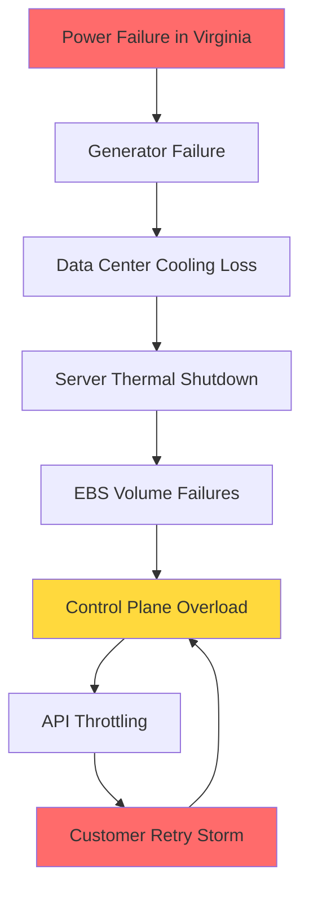
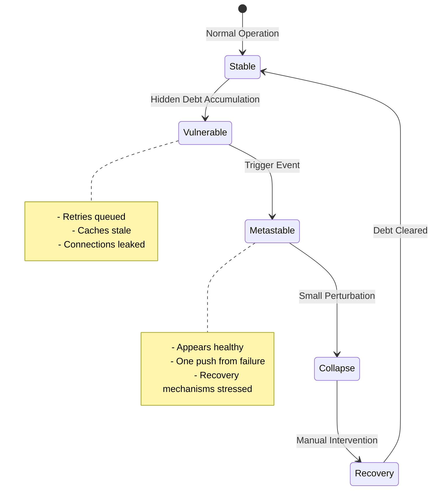
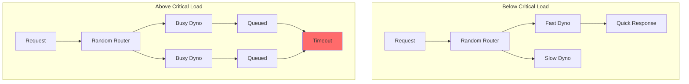
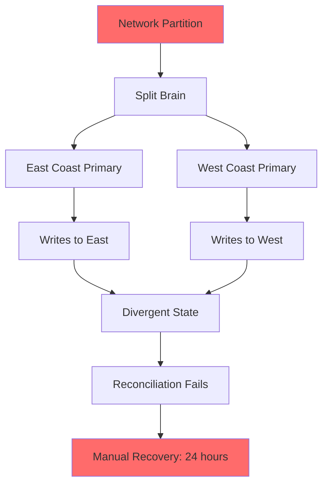
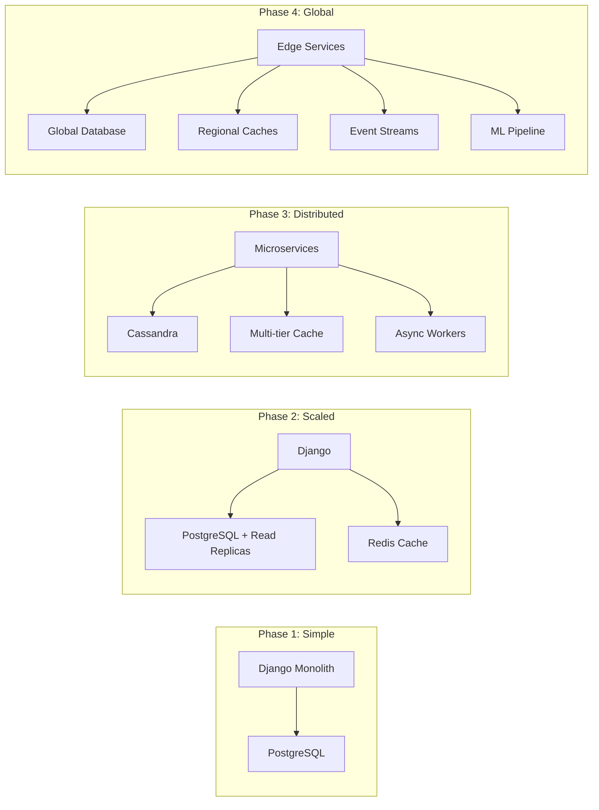

# Real-World Examples: Law of Emergent Complexity

The Law of Emergent Complexity reveals itself through dramatic system failures and unexpected behaviors that arise from the interaction of simple components. These examples demonstrate how distributed systems can exhibit phase transitions, cascading failures, and non-linear responses that are fundamentally unpredictable from examining individual components.

## Case Study 1: The 2012 AWS Cascading Failure

### The Incident

On June 29, 2012, a severe thunderstorm in Northern Virginia triggered one of the most significant AWS outages in history, demonstrating how physical events can cascade through digital infrastructure.



### Timeline of Emergence

**10:28 PM**: Power grid failure affects primary data center
- Initial impact: ~7% of EC2 instances in US-EAST-1

**10:45 PM**: Backup generators fail to maintain stable power
- Cascading effect begins as cooling systems fail

**11:00 PM**: Thermal shutdown of storage servers begins
- EBS volumes start failing en masse
- Control plane experiences 20x normal request rate

**11:30 PM**: API throttling engaged
- Customer retry logic creates positive feedback loop
- Request rate climbs to 100x normal

**2:00 AM**: Full cascade achieved
- Multiple availability zones affected
- Recovery hampered by overwhelmed control systems

### Emergent Properties Observed

1. **Non-linear Amplification**: 7% initial failure → 40% service degradation
2. **Phase Transition**: System shifted from stable to unstable state at critical load
3. **Feedback Loops**: Customer retries created self-reinforcing failure mode
4. **Cross-System Coupling**: Physical infrastructure failure propagated to logical systems

### Lessons Learned

```python
# Anti-pattern: Tight coupling without circuit breakers
def handle_request():
    while True:
        try:
            return api_call()
        except Exception:
            time.sleep(0.1)  # Creates retry storm
            
# Pattern: Exponential backoff with jitter
def handle_request_safely():
    for attempt in range(MAX_RETRIES):
        try:
            return api_call()
        except Exception:
            delay = min(CAP, BASE * 2 ** attempt)
            jitter = random.uniform(0, delay * 0.1)
            time.sleep(delay + jitter)
    raise SystemOverloadError()
```

## Case Study 2: The Reddit "Hug of Death" - Thundering Herd in Action

### The Phenomenon

When a small website gets linked from Reddit's front page, it often experiences a thundering herd problem that perfectly demonstrates emergent complexity.


### Anatomy of a Thundering Herd

**Phase 1: Initial Spike** (0-5 minutes)
- Traffic increases 100x in seconds
- Cache hit rate drops from 95% to 20%
- Database connections spike

**Phase 2: Resource Exhaustion** (5-15 minutes)
- Connection pools saturated
- Memory pressure increases
- GC pauses extend response times

**Phase 3: Death Spiral** (15+ minutes)
- Timeouts trigger retries
- Health checks fail
- Load balancers remove healthy servers
- Remaining servers collapse faster

### Emergent Behaviors

```python
# Simulation of thundering herd dynamics
class ThunderingHerdSimulation:
    def __init__(self):
        self.requests_per_second = 10
        self.cache_hit_rate = 0.95
        self.db_capacity = 100
        
    def simulate_reddit_hug(self, spike_multiplier=100):
        timeline = []
        
        # Sudden traffic spike
        self.requests_per_second *= spike_multiplier
        
        for minute in range(30):
            # Cache effectiveness degrades under load
            cache_misses = self.requests_per_second * (1 - self.cache_hit_rate)
            
            # Database load increases non-linearly
            db_load = cache_misses * (1 + minute * 0.1)  # Retry amplification
            
            # System degradation
            if db_load > self.db_capacity:
                self.cache_hit_rate *= 0.9  # Cache becomes less effective
                failed_requests = db_load - self.db_capacity
                
                # Retry storm amplification
                self.requests_per_second += failed_requests * 0.5
                
            timeline.append({
                'minute': minute,
                'requests': self.requests_per_second,
                'db_load': db_load,
                'cache_hit_rate': self.cache_hit_rate
            })
            
        return timeline
```

## Case Study 3: Metastable Failures at Scale

### The Facebook Metastable Failure Pattern

Facebook documented a class of failures where systems appear stable but exist in a precarious state, ready to collapse when slightly perturbed.



### Real-World Metastable Trigger

**The Scenario**: Facebook's TAO (The Associations and Objects) cache layer
- Normal state: 99.9% cache hit rate
- Hidden debt: Stale cache entries accumulating
- Trigger: Routine maintenance invalidates 0.1% of cache

**The Collapse**:
1. Cache misses increase database load by 10x
2. Database slows down, causing timeouts
3. Timeouts trigger cache invalidation
4. More cache misses create positive feedback
5. System enters unrecoverable state

### Detecting Metastable States

```python
class MetastableDetector:
    def __init__(self):
        self.metrics = {
            'retry_rate': [],
            'gc_pause_time': [],
            'connection_pool_usage': [],
            'cache_eviction_rate': []
        }
        
    def calculate_metastability_risk(self):
        # Look for hidden accumulation patterns
        risk_factors = []
        
        # Retry accumulation
        retry_trend = self.calculate_trend(self.metrics['retry_rate'])
        if retry_trend > 0.05:  # 5% increase per hour
            risk_factors.append(('retry_accumulation', retry_trend))
            
        # GC pressure building
        gc_variance = self.calculate_variance(self.metrics['gc_pause_time'])
        if gc_variance > 2.0:  # High variability indicates pressure
            risk_factors.append(('gc_pressure', gc_variance))
            
        # Connection pool saturation
        pool_p99 = self.calculate_percentile(self.metrics['connection_pool_usage'], 99)
        if pool_p99 > 0.8:  # 80% usage at p99
            risk_factors.append(('connection_pressure', pool_p99))
            
        return self.combine_risk_factors(risk_factors)
```

## Case Study 4: Phase Transitions in Load Balancing

### The Heroku Routing Mesh Incident

In 2013, Heroku experienced a phase transition in their routing layer that demonstrates how systems can suddenly shift behavior at critical thresholds.



### The Phase Transition

**Below Threshold** (< 80% utilization):
- Random routing works well
- Load naturally balances
- Response times predictable

**Above Threshold** (> 80% utilization):
- Random routing creates hot spots
- Queues form at busy dynos
- System exhibits bistable behavior

### Mathematical Model

```python
def routing_performance(utilization, routing_strategy='random'):
    """
    Model phase transition in routing performance
    """
    if routing_strategy == 'random':
        if utilization < 0.8:
            # Below critical threshold - linear degradation
            avg_wait = utilization / (1 - utilization)
        else:
            # Above threshold - non-linear explosion
            avg_wait = (utilization ** 3) / (1 - utilization)
            
    elif routing_strategy == 'least_connections':
        # More gradual degradation
        avg_wait = utilization / (1 - utilization)
        
    return avg_wait

# Demonstrate phase transition
utilizations = [0.5, 0.7, 0.8, 0.85, 0.9, 0.95]
for u in utilizations:
    random_wait = routing_performance(u, 'random')
    smart_wait = routing_performance(u, 'least_connections')
    print(f"Utilization {u}: Random={random_wait:.2f}, Smart={smart_wait:.2f}")
```

## Case Study 5: Self-Organized Criticality - The GitHub Outage

### The Incident

In 2018, GitHub experienced a 24-hour outage that demonstrated self-organized criticality - where a system naturally evolves to a critical state where small events can trigger large avalanches.



### Emergent Complexity Factors

1. **Critical State Evolution**:
   - Years of optimization reduced redundancy
   - System naturally evolved to edge of stability
   - Small perturbation triggered avalanche

2. **Non-Linear Response**:
   - 43-second network partition
   - 24-hour recovery time
   - 33,000x amplification factor

### Power Law Distribution

```python
class PowerLawFailures:
    """
    Model self-organized criticality in system failures
    """
    def __init__(self):
        self.stress_level = 0
        self.failure_threshold = 100
        self.failure_history = []
        
    def add_stress(self, amount):
        self.stress_level += amount
        
        if self.stress_level > self.failure_threshold:
            # Avalanche size follows power law
            avalanche_size = self.calculate_avalanche()
            self.failure_history.append(avalanche_size)
            self.stress_level = 0
            return avalanche_size
        return 0
        
    def calculate_avalanche(self):
        # Power law: P(size) ~ size^(-alpha)
        alpha = 1.5  # Typical for critical systems
        base_size = self.stress_level - self.failure_threshold
        
        # Add randomness following power law
        import random
        multiplier = random.paretovariate(alpha)
        
        return base_size * multiplier
```

## Analyzing Non-Linear Scaling

### The Instagram Architecture Evolution

Instagram's growth demonstrates how emergent complexity forces architectural phase transitions:



### Scaling Complexity Metrics

```python
def system_complexity(components, interactions):
    """
    Calculate emergent complexity as system grows
    """
    # Base complexity: O(n) for components
    base = components
    
    # Interaction complexity: O(n²) for potential interactions
    interaction = interactions ** 2
    
    # Emergent complexity: O(2^n) for state space
    emergent = 2 ** (components / 10)  # Scaled for reasonable numbers
    
    # Total complexity grows non-linearly
    total = base + interaction + emergent
    
    return {
        'base': base,
        'interaction': interaction,
        'emergent': emergent,
        'total': total,
        'complexity_ratio': total / base
    }

# Demonstrate non-linear growth
for n in [10, 50, 100, 500, 1000]:
    complexity = system_complexity(n, n * 2)
    print(f"Components: {n}, Complexity Ratio: {complexity['complexity_ratio']:.2f}")
```

## Key Patterns in Emergent Complexity

### 1. Trigger Patterns

Small events that lead to large consequences:
- **Resource Exhaustion**: One full disk → service cascade
- **Timing Violations**: Clock skew → distributed deadlock
- **Threshold Breaches**: Cache eviction → database overload

### 2. Amplification Mechanisms

How failures grow:
- **Retry Storms**: Failed requests → more load → more failures
- **Cascade Effects**: One service down → dependent services fail
- **Feedback Loops**: Slow responses → timeouts → retries → slower responses

### 3. Phase Transition Indicators

Warning signs of impending transitions:
- **Increasing Variance**: Response times become erratic
- **Degraded Resilience**: Recovery takes longer
- **Hidden Accumulation**: Debt builds in background

### 4. Emergent Behaviors

Unexpected system-wide patterns:
- **Synchronized Failures**: Independent components fail together
- **Mode Switches**: System suddenly changes behavior
- **Resonance Effects**: Periodic loads create unexpected peaks

## Practical Implications

Understanding emergent complexity helps us:

1. **Design for Graceful Degradation**: Build systems that fail partially, not completely
2. **Monitor for Phase Transitions**: Watch for early warning signs
3. **Break Feedback Loops**: Add circuit breakers and backpressure
4. **Embrace Chaos Engineering**: Test emergent behaviors proactively
5. **Plan for Non-Linear Scaling**: Architect for 10x, not 2x growth

The Law of Emergent Complexity reminds us that distributed systems are more than the sum of their parts - they are living entities with their own behaviors, phase transitions, and failure modes that emerge from the complex interactions of simple components.