<!-- Navigation -->
[Home](../../index.md) → [Part I: Axioms](../index.md) → [Axiom 3](index.md) → **Axiom 3: Partial Failure**

# Axiom 3: Partial Failure

---


## 🔥 The Constraint

### The Fundamental Limit

**All components will fail eventually with non-zero probability**

This constraint emerges from **Second law of thermodynamics: entropy always increases**. No amount of engineering can violate this fundamental principle—we can only work within its boundaries.

### Physics Foundation

The practical manifestation of this constraint:
- **Theoretical basis**: Second law of thermodynamics: entropy always increases
- **Practical limit**: Hardware MTBF, software bugs, human errors, network partitions
- **Real-world impact**: Failure is not an exception case—it's the normal operating condition

### Why This Constraint Exists

Unlike software bugs or implementation details, this is a fundamental law of our universe. Understanding this constraint helps us:

1. **Set realistic expectations** - Know what's physically impossible
2. **Make better trade-offs** - Optimize within the possible
3. **Design robust systems** - Work with the constraint, not against it
4. **Avoid false solutions** - Don't chase impossible optimizations

!!! warning "Common Misconception"
    This constraint cannot be "solved" or "eliminated"—only managed and optimized within its boundaries.

---

## 💡 Why It Matters

Failure is not an exception case—it's the normal operating condition

### Business Impact

This constraint directly affects:
- **User experience**: Performance and reliability
- **Development velocity**: Time-to-market and maintenance
- **Operational costs**: Infrastructure and support
- **Competitive advantage**: System capabilities and scalability

### Technical Implications

Every engineering decision must account for this constraint:
- **Architecture patterns**: Choose designs that work with the constraint
- **Technology selection**: Pick tools that optimize within the boundaries
- **Performance optimization**: Focus on what's actually improvable
- **Monitoring and alerting**: Track metrics related to the constraint

---

## 🚫 Common Misconceptions

Many engineers hold false beliefs about this constraint:

1. **"Good engineering can prevent all failures"**
   - This violates the fundamental constraint
   - Reality: Even redundant systems can fail in correlated ways

2. **"Redundancy eliminates failure risk"**
   - This violates the fundamental constraint
   - Reality: Redundancy reduces risk but adds complexity and new failure modes

3. **"Cloud providers handle all failure scenarios"**
   - This violates the fundamental constraint
   - Reality: You still need to design for application-level failures


### Reality Check

The constraint is absolute—these misconceptions arise from:
- **Wishful thinking**: Hoping engineering can overcome physics
- **Local optimization**: Solving one problem while creating others
- **Vendor marketing**: Oversimplified claims about complex systems
- **Incomplete understanding**: Not seeing the full system implications

---

## ⚙️ Practical Implications

How this constraint shapes real system design:

1. **Design for failure as the default case**
2. **Implement circuit breakers and timeouts**
3. **Practice chaos engineering and failure injection**
4. **Build observable and debuggable systems**


### Engineering Guidelines

When designing systems, always:
- **Start with the constraint**: Acknowledge it in your architecture
- **Measure the constraint**: Monitor relevant metrics
- **Design around the constraint**: Use patterns that work with it
- **Communicate the constraint**: Help stakeholders understand limitations

### Success Patterns

Teams that respect this constraint:
- Set realistic performance goals
- Choose appropriate architectural patterns
- Invest in proper monitoring and observability
- Make trade-offs explicit and data-driven

---


## Level 1: Intuition (Start Here) 🌱

### The Broken Phone Game

Remember playing "telephone" as a kid? One person whispers to the next, and by the end, the message is completely garbled. That's distributed systems failure in a nutshell.

**Your laptop**: Works or crashed (binary)
**Distributed system**: Working AND broken simultaneously!

### Real-World Analogy: Traffic Lights

Imagine a city where:
- Some traffic lights work perfectly ✅
- Some are stuck on red 🔴
- Some flash yellow ⚠️
- Some are completely dead ⚫

The city doesn't "stop working"—it partially works with degraded performance. That's your distributed system!

### Your First Partial Failure

```python
# partial_failure_demo.py - Experience partial failure firsthand

import random
import time
from typing import List

class FlakyService:
    """A service that partially fails like real systems"""

    def __init__(self, name: str, failure_rate: float = 0.1):
        self.name = name
        self.failure_rate = failure_rate
        self.slow_rate = 0.1  # 10% chance of being slow

    def call(self, request: str) -> str:
        # Simulate different failure modes
        dice_roll = random.random()

        if dice_roll < self.failure_rate:
            # Complete failure
            raise Exception(f"{self.name} is down!")
        elif dice_roll < (self.failure_rate + self.slow_rate):
            # Slow failure (works but painfully slow)
            time.sleep(5)  # 5 second delay
            return f"{self.name}: {request} (slow)"
        else:
            # Success
            time.sleep(0.1)  # Normal 100ms response
            return f"{self.name}: {request} (ok)"

# Simulate a system with 3 services
def process_request(services: List[FlakyService]) -> str:
    """Try to get response from any available service"""
    errors = []

    for service in services:
        try:
            start = time.time()
            result = service.call("Hello")
            duration = time.time() - start

            if duration > 1:  # Consider >1s as "too slow"
                errors.append(f"{service.name} too slow ({duration:.1f}s)")
                continue

            return f"Success: {result}"

        except Exception as e:
            errors.append(str(e))
            continue

    return f"All failed: {errors}"

# Run the experiment
if __name__ == "__main__":
    services = [
        FlakyService("Service-A", failure_rate=0.3),
        FlakyService("Service-B", failure_rate=0.1),
        FlakyService("Service-C", failure_rate=0.2)
    ]

    print("Sending 10 requests to see partial failures...\n")

    for i in range(10):
        result = process_request(services)
        print(f"Request {i+1}: {result}")

    print("\n💡 Notice how the system partially works?")
    print("Some requests succeed, some fail, some are slow!")
```

### The Failure Zoo 🦁

Types of failures you'll encounter:

1. **The Zombie** 🧟: Process alive but not responding
2. **The Slowpoke** 🐌: Works but 100x slower
3. **The Flapper** 🦅: Up, down, up, down...
4. **The Liar** 🤥: Says "I'm healthy!" while broken
5. **The Amnesiac** 🤷: Forgets everything after restart

### Beginner's Survival Guide

```python
# Your first fault-tolerant code
def safe_call_with_timeout(func, timeout=1.0, default=None):
    """Call function with timeout and fallback"""
    import signal

    def timeout_handler(signum, frame):
        raise TimeoutError()

    # Set alarm
    signal.signal(signal.SIGALRM, timeout_handler)
    signal.alarm(int(timeout))

    try:
        result = func()
        signal.alarm(0)  # Cancel alarm
        return result
    except (TimeoutError, Exception) as e:
        signal.alarm(0)  # Cancel alarm
        print(f"Failed: {e}, using default")
        return default

# Usage
def flaky_database_call():
    if random.random() < 0.3:
        time.sleep(2)  # Simulate slow response
    return "data"

# This won't hang your system!
result = safe_call_with_timeout(flaky_database_call, timeout=1.0, default="cached_data")
```

---

## Level 2: Foundation (Understand Why) 🌿

### Core Principle: The Failure Spectrum

### The CAP Theorem Connection

During network partition (a type of partial failure):
- **Choose Consistency**: Some nodes stop serving (availability loss)
- **Choose Availability**: Nodes may serve stale data (consistency loss)

You can't avoid partial failure; you can only choose how to handle it.

### 🎬 Failure Vignette: The Retry Storm of 2022

**Company**: Major social media platform
**Scale**: 100M daily active users
**Initial Issue**: One DB replica 20% slower (bad disk)

```dockerfile
Timeline of Disaster:
T+0s:   App servers detect slow responses from replica #3
T+1s:   Client timeout at 1s, automatic retry triggered
T+2s:   2x load on all replicas due to retries
T+3s:   Healthy replicas now slow due to 2x load
T+4s:   More timeouts → more retries → 4x load
T+10s:  Exponential retry storm: 32x original load
T+30s:  All replicas saturated
T+60s:  Complete outage

Root Cause Analysis:
- Treated partial failure (one slow replica) as total failure
- Retries made the problem worse
- No circuit breakers to stop the cascade
- No bulkheads to isolate the damage

Fix Applied:
1. Circuit breakers (stop retrying when futile)
2. Bulkheads (isolate replica pools)
3. Adaptive timeouts (adjust based on load)
4. Exponential backoff with jitter
```

### The Failure Boundary Matrix

```proto
Failure Domain    Blast Radius    Recovery Time    Example
--------------    ------------    -------------    -------
Process           1 container     Seconds          OOM kill
Container         1 pod           Seconds          Crash loop
Pod               1 service       Minutes          Node drain
Node              N pods          Minutes          Hardware fail
Rack              1 AZ %          Minutes          Switch fail
Zone              1 region %      Hours            Power loss
Region            Global %        Hours            Fiber cut
Provider          Everything      Days             Cloud outage
```

### Mathematical Foundation

```python
# Probability of system functioning
def system_reliability(components, mode='series'):
    """
    Calculate system reliability based on component reliability

    Series (AND): All components must work
    Parallel (OR): At least one component must work
    """
    if mode == 'series':
        # P(system) = P1 × P2 × P3 × ...
        reliability = 1.0
        for comp in components:
            reliability *= comp
        return reliability

    elif mode == 'parallel':
        # P(system) = 1 - (1-P1) × (1-P2) × (1-P3) × ...
        unreliability = 1.0
        for comp in components:
            unreliability *= (1 - comp)
        return 1 - unreliability

# Example: 3 replicas, each 99% reliable
replicas = [0.99, 0.99, 0.99]

# If we need ALL replicas (series)
all_work = system_reliability(replicas, 'series')
print(f"Need all 3: {all_work:.2%}")  # 97.03% - WORSE!

# If we need ANY replica (parallel)
any_works = system_reliability(replicas, 'parallel')
print(f"Need any 1: {any_works:.5%}")  # 99.999% - BETTER!
```

---

## Level 3: Deep Dive (Master the Patterns) 🌳

### The Six Horsemen of Partial Failure

#### 1. Slow Failure (The Silent Killer)
```python
class SlowFailureDetector:
    """Detect when services are slow but not dead"""

    def __init__(self, window_size=100):
        self.response_times = deque(maxlen=window_size)
        self.baseline_p99 = None

    def record_response(self, duration_ms):
        self.response_times.append(duration_ms)

        if len(self.response_times) == self.response_times.maxlen:
            # Calculate baseline if we have enough data
            if self.baseline_p99 is None:
                sorted_times = sorted(self.response_times)
                self.baseline_p99 = sorted_times[int(len(sorted_times) * 0.99)]

    def is_degraded(self):
        if self.baseline_p99 is None:
            return False

        recent_10 = list(self.response_times)[-10:]
        recent_p50 = sorted(recent_10)[len(recent_10)//2]

        # If median of recent requests > historical P99
        return recent_p50 > self.baseline_p99 * 1.5
```

#### 2. Gray Failure (The Liar)
```python
class GrayFailureDetector:
    """Detect failures that monitoring misses but users experience"""

    def __init__(self):
        self.health_check_results = deque(maxlen=100)
        self.user_request_results = deque(maxlen=100)

    def record_health_check(self, success: bool):
        self.health_check_results.append(success)

    def record_user_request(self, success: bool):
        self.user_request_results.append(success)

    def detect_gray_failure(self) -> bool:
        """
        Gray failure: Health checks pass but user requests fail
        """
        if len(self.health_check_results) < 10:
            return False

        health_success_rate = sum(self.health_check_results) / len(self.health_check_results)
        user_success_rate = sum(self.user_request_results) / len(self.user_request_results)

        # Health checks mostly pass but users mostly fail
        return health_success_rate > 0.9 and user_success_rate < 0.5
```

#### 3. Split Brain (The Twins)
```python
class SplitBrainResolver:
    """Handle split-brain scenarios in distributed systems"""

    def __init__(self, node_id: str, total_nodes: int):
        self.node_id = node_id
        self.total_nodes = total_nodes
        self.visible_nodes = set()
        self.is_leader = False

    def update_visible_nodes(self, visible: set):
        """Update which nodes we can see"""
        self.visible_nodes = visible
        self.check_quorum()

    def check_quorum(self):
        """Determine if we have quorum to make decisions"""
        # Include self in count
        visible_count = len(self.visible_nodes) + 1
        majority = (self.total_nodes // 2) + 1

        if visible_count >= majority:
            # We have quorum, can elect leader
            self.elect_leader()
        else:
            # Minority partition, step down
            self.is_leader = False
            raise NoQuorumError(f"Only see {visible_count}/{self.total_nodes} nodes")

    def elect_leader(self):
        """Simple leader election: lowest node ID wins"""
        candidates = self.visible_nodes | {self.node_id}
        leader = min(candidates)
        self.is_leader = (leader == self.node_id)
```

### Production-Grade Failure Handling

```python
from enum import Enum
from dataclasses import dataclass
from typing import Optional, Callable
import asyncio

class FailureMode(Enum):
    HEALTHY = "healthy"
    SLOW = "slow"
    FLAPPING = "flapping"
    PARTIAL = "partial"
    DEAD = "dead"

@dataclass
class HealthStatus:
    mode: FailureMode
    success_rate: float
    latency_p99: float
    last_check: float
    consecutive_failures: int

class AdaptiveFailureHandler:
    """Production-grade failure handling with adaptive strategies"""

    def __init__(self,
                 service_name: str,
                 timeout_ms: int = 1000,
                 failure_threshold: int = 5):
        self.service_name = service_name
        self.timeout_ms = timeout_ms
        self.failure_threshold = failure_threshold

        # Adaptive parameters
        self.circuit_breaker = CircuitBreaker(failure_threshold)
        self.timeout_adjuster = TimeoutAdjuster(timeout_ms)
        self.retry_policy = AdaptiveRetryPolicy()

        # Metrics
        self.request_log = deque(maxlen=1000)
        self.health_status = HealthStatus(
            mode=FailureMode.HEALTHY,
            success_rate=1.0,
            latency_p99=0,
            last_check=time.time(),
            consecutive_failures=0
        )

    async def call(self,
                   request_func: Callable,
                   fallback_func: Optional[Callable] = None):
        """Make a resilient call with all protections"""

        # Check circuit breaker first
        if not self.circuit_breaker.allow_request():
            if fallback_func:
                return await fallback_func()
            raise CircuitOpenError(f"{self.service_name} circuit open")

        # Adjust timeout based on recent performance
        timeout = self.timeout_adjuster.get_timeout()

        # Attempt with retries
        last_error = None
        retry_delays = self.retry_policy.get_retry_delays()

        for attempt, delay in enumerate(retry_delays):
            if attempt > 0:
                await asyncio.sleep(delay)

            try:
                # Make the actual call
                start_time = time.time()

                result = await asyncio.wait_for(
                    request_func(),
                    timeout=timeout/1000.0
                )

                # Record success
                duration = (time.time() - start_time) * 1000
                self._record_success(duration)

                return result

            except asyncio.TimeoutError:
                last_error = TimeoutError(f"Timeout after {timeout}ms")
                self._record_failure('timeout', timeout)

            except Exception as e:
                last_error = e
                self._record_failure('error', 0)

        # All retries failed
        if fallback_func:
            return await fallback_func()

        raise last_error

    def _record_success(self, duration_ms: float):
        """Record successful request"""
        self.request_log.append({
            'success': True,
            'duration': duration_ms,
            'timestamp': time.time()
        })

        self.circuit_breaker.record_success()
        self.timeout_adjuster.record_response(duration_ms)
        self.retry_policy.record_success()

        self._update_health_status()

    def _record_failure(self, failure_type: str, duration_ms: float):
        """Record failed request"""
        self.request_log.append({
            'success': False,
            'failure_type': failure_type,
            'duration': duration_ms,
            'timestamp': time.time()
        })

        self.circuit_breaker.record_failure()
        self.retry_policy.record_failure()

        self._update_health_status()

    def _update_health_status(self):
        """Analyze recent requests to determine health"""
        if len(self.request_log) < 10:
            return

        recent_100 = list(self.request_log)[-100:]

        # Calculate metrics
        successes = sum(1 for r in recent_100 if r['success'])
        success_rate = successes / len(recent_100)

        success_durations = [r['duration'] for r in recent_100 if r['success']]
        if success_durations:
            latency_p99 = sorted(success_durations)[int(len(success_durations) * 0.99)]
        else:
            latency_p99 = float('inf')

        # Determine failure mode
        if success_rate > 0.95 and latency_p99 < self.timeout_ms:
            mode = FailureMode.HEALTHY
        elif success_rate > 0.8:
            mode = FailureMode.SLOW if latency_p99 > self.timeout_ms * 0.5 else FailureMode.PARTIAL
        elif success_rate > 0.5:
            mode = FailureMode.FLAPPING
        else:
            mode = FailureMode.DEAD

        self.health_status = HealthStatus(
            mode=mode,
            success_rate=success_rate,
            latency_p99=latency_p99,
            last_check=time.time(),
            consecutive_failures=self.circuit_breaker.consecutive_failures
        )

class TimeoutAdjuster:
    """Dynamically adjust timeouts based on observed latency"""

    def __init__(self, initial_timeout_ms: int):
        self.base_timeout = initial_timeout_ms
        self.observations = deque(maxlen=100)

    def record_response(self, duration_ms: float):
        self.observations.append(duration_ms)

    def get_timeout(self) -> int:
        if len(self.observations) < 10:
            return self.base_timeout

        # Use P95 of recent observations
        sorted_obs = sorted(self.observations)
        p95 = sorted_obs[int(len(sorted_obs) * 0.95)]

        # Timeout = P95 * safety factor, bounded
        timeout = int(p95 * 1.5)

        # Keep within reasonable bounds
        min_timeout = self.base_timeout // 2
        max_timeout = self.base_timeout * 3

        return max(min_timeout, min(timeout, max_timeout))
```

---

## 🔄 Consistency During Failures

### The CAP Theorem in Practice


### Consistency Models Under Failure

| Model | Behavior During Failure | Use Case | Example |
|-------|------------------------|----------|----------|
| **Strong Consistency** | Refuse writes to minority partition | Financial ledgers | Bank accounts |
| **Eventual Consistency** | Accept writes, reconcile later | Social media | Twitter likes |
| **Weak Consistency** | No guarantees | Caching | CDN content |
| **Causal Consistency** | Preserve causality only | Chat apps | WhatsApp |
| **Session Consistency** | Consistency within session | Shopping carts | Amazon |

### Split-Brain Scenarios


### Byzantine Failures and Consistency

```mermaid
graph TB
    subgraph "Byzantine Fault Tolerant Consensus"
        subgraph "Honest Nodes"
            H1[Honest 1]
            H2[Honest 2]  
            H3[Honest 3]
        end
        
        subgraph "Byzantine Node"
            B[Byzantine<br/>Sends different<br/>values]
        end
        
        B -->|Value A| H1
        B -->|Value B| H2
        B -->|Value C| H3
        
        H1 <--> H2
        H2 <--> H3
        H1 <--> H3
        
        Result[Consensus on majority value<br/>despite Byzantine node]
    end
    
    Note[Requires 3f+1 nodes to<br/>tolerate f Byzantine failures]
end
```

### Failure Detection and Consistency

```yaml
Failure Detectors:
  Perfect Detector (Impossible):
    - Never suspects correct process
    - Eventually suspects failed process
    
  Eventually Perfect (Realistic):
    - May temporarily suspect correct process
    - Eventually stops false suspicions
    - Eventually detects all failures
    
  Impact on Consistency:
    - False suspicions → Unnecessary leader changes
    - Delayed detection → Stale reads
    - Network delays → Split brain risk
```

### Consistency Recovery Patterns

#### 1. Read Repair


#### 2. Hinted Handoff


### Quorum-Based Consistency

```mermaid
graph TB
    subgraph "Write Quorum (W=2)"
        W1[Write to Node 1 ✓]
        W2[Write to Node 2 ✓] 
        W3[Write to Node 3 ❌]
        WR[Write Succeeds<br/>2/3 nodes]
    end
    
    subgraph "Read Quorum (R=2)"
        R1[Read from Node 1 ✓]
        R2[Read from Node 2 ❌]
        R3[Read from Node 3 ✓]
        RR[Read Succeeds<br/>2/3 nodes]
    end
    
    subgraph "Consistency Guarantee"
        F[W + R > N<br/>2 + 2 > 3<br/>Strong Consistency]
    end
    
    WR --> F
    RR --> F
```



### Practical Failure-Consistency Patterns

| Pattern | Description | Consistency Impact | Use Case |
|---------|-------------|-------------------|----------||
| **Sloppy Quorum** | Accept writes on any N nodes | Improves availability, eventual consistency | Dynamo |
| **Strict Quorum** | Require specific nodes | Strong consistency, lower availability | Cassandra |
| **Chain Replication** | Linear replication chain | Strong consistency, ordered updates | CORFU |
| **Primary-Backup** | All writes through primary | Simple consistency model | MySQL |
| **Multi-Paxos** | Consensus on every operation | Linearizable | Spanner |

### Consistency SLAs During Failures

```yaml
Tiered Consistency SLAs:
  Critical Data (Payment records):
    - RPO: 0 (no data loss)
    - Consistency: Strong
    - Availability: 99.9%
    - During failure: Reject writes
    
  Important Data (User profiles):
    - RPO: 1 minute
    - Consistency: Read-after-write
    - Availability: 99.99%  
    - During failure: Route to healthy replicas
    
  Cache Data (Session state):
    - RPO: Acceptable loss
    - Consistency: Eventual
    - Availability: 99.999%
    - During failure: Regenerate if needed
```

---

## Level 4: Expert (Production Patterns) 🌲

### Netflix's Hystrix Pattern: Bulkheads in Action

```java
// Simplified version of Netflix's Hystrix bulkhead pattern
public class BulkheadCommand extends HystrixCommand<String> {

    private final String serviceName;
    private final Supplier<String> primaryCall;
    private final Supplier<String> fallback;

    public BulkheadCommand(String serviceName,
                          Supplier<String> primaryCall,
                          Supplier<String> fallback) {
        super(Setter
            .withGroupKey(HystrixCommandGroupKey.Factory.asKey(serviceName))
            .andCommandPropertiesDefaults(
                HystrixCommandProperties.Setter()
                    // Isolate with separate thread pool
                    .withExecutionIsolationStrategy(THREAD)
                    .withExecutionIsolationThreadPoolKeyOverride(serviceName)
                    // Bounded thread pool prevents resource exhaustion
                    .withExecutionIsolationThreadPoolCoreSize(10)
                    .withExecutionIsolationThreadPoolMaximumSize(10)
                    .withExecutionIsolationThreadPoolQueueSize(5)
                    // Aggressive timeouts
                    .withExecutionTimeoutInMilliseconds(1000)
                    // Circuit breaker settings
                    .withCircuitBreakerEnabled(true)
                    .withCircuitBreakerRequestVolumeThreshold(20)
                    .withCircuitBreakerErrorThresholdPercentage(50)
                    .withCircuitBreakerSleepWindowInMilliseconds(5000)
            ));

        this.serviceName = serviceName;
        this.primaryCall = primaryCall;
        this.fallback = fallback;
    }

    @Override
    protected String run() throws Exception {
        // Primary execution path
        return primaryCall.get();
    }

    @Override
    protected String getFallback() {
        // Fallback path when primary fails
        return fallback.get();
    }

    @Override
    protected String getCacheKey() {
        // Enable request caching within same request context
        return serviceName + Thread.currentThread().getId();
    }
}

// Usage pattern at Netflix scale
public class ResilientMovieService {

    private static final int RECOMMENDATION_POOL_SIZE = 50;
    private static final int METADATA_POOL_SIZE = 100;
    private static final int PLAYBACK_POOL_SIZE = 200;

    public MovieResponse getMovieDetails(String movieId) {
        // Each external call isolated in its own bulkhead

        // 1. Get basic metadata (critical path)
        String metadata = new BulkheadCommand(
            "metadata-service",
            () -> metadataService.getMetadata(movieId),
            () -> cacheService.getCachedMetadata(movieId)
        ).execute();

        // 2. Get recommendations (non-critical)
        CompletableFuture<String> recommendationsFuture =
            CompletableFuture.supplyAsync(() ->
                new BulkheadCommand(
                    "recommendation-service",
                    () -> recommendationService.getRecommendations(movieId),
                    () -> "[]"  // Empty recommendations as fallback
                ).execute()
            );

        // 3. Get playback info (critical)
        String playbackInfo = new BulkheadCommand(
            "playback-service",
            () -> playbackService.getPlaybackInfo(movieId),
            () -> getStaticPlaybackInfo(movieId)
        ).execute();

        // Compose response, don't wait for non-critical data
        MovieResponse response = new MovieResponse(metadata, playbackInfo);

        // Add recommendations if available within 100ms
        try {
            String recommendations = recommendationsFuture.get(100, TimeUnit.MILLISECONDS);
            response.setRecommendations(recommendations);
        } catch (TimeoutException e) {
            // Log but don't fail the request
            logger.debug("Recommendations timed out for movie: " + movieId);
        }

        return response;
    }
}
```

### Uber's Ringpop: Gossip-Based Failure Detection

```go
// Simplified version of Uber's Ringpop failure detection
type SwimNode struct {
    self         string
    members      map[string]*Member
    incarnation  uint64
    protocolPeriod time.Duration

    // Channels
    changes      chan MemberChange

    // Failure detection parameters
    pingTimeout  time.Duration
    pingReqSize  int
}

type Member struct {
    Address     string
    Status      MemberStatus
    Incarnation uint64
    LastSeen    time.Time

    // Suspicion tracking
    SuspicionStart   *time.Time
    SuspicionTimeout time.Duration
}

type MemberStatus int

const (
    Alive MemberStatus = iota
    Suspect
    Faulty
    Left
)

// SWIM protocol implementation
func (s *SwimNode) protocolLoop() {
    ticker := time.NewTicker(s.protocolPeriod)
    defer ticker.Stop()

    for {
        select {
        case <-ticker.C:
            s.runProtocolPeriod()
        }
    }
}

func (s *SwimNode) runProtocolPeriod() {
    // 1. Select random member to ping
    target := s.selectRandomMember()
    if target == nil {
        return
    }

    // 2. Direct ping
    if s.ping(target) {
        s.markAlive(target)
        return
    }

    // 3. Indirect ping through k random members
    indirectTargets := s.selectRandomMembers(s.pingReqSize)

    responses := make(chan bool, len(indirectTargets))
    for _, intermediate := range indirectTargets {
        go func(inter *Member) {
            // Ask intermediate to ping target
            responses <- s.pingReq(inter, target)
        }(intermediate)
    }

    // 4. Wait for any positive response
    timeout := time.After(s.pingTimeout)
    for i := 0; i < len(indirectTargets); i++ {
        select {
        case success := <-responses:
            if success {
                s.markAlive(target)
                return
            }
        case <-timeout:
            break
        }
    }

    // 5. No response - mark as suspect
    s.markSuspect(target)
}

func (s *SwimNode) markSuspect(member *Member) {
    if member.Status == Suspect {
        // Already suspect - check timeout
        if time.Since(*member.SuspicionStart) > member.SuspicionTimeout {
            s.markFaulty(member)
        }
        return
    }

    // Transition to suspect
    now := time.Now()
    member.Status = Suspect
    member.SuspicionStart = &now

    // Calculate dynamic timeout based on network size
    n := len(s.members)
    // Larger networks need more time for information to propagate
    member.SuspicionTimeout = time.Duration(math.Log(float64(n))) * time.Second

    // Disseminate suspicion
    s.changes <- MemberChange{
        Member:      member.Address,
        Status:      Suspect,
        Incarnation: member.Incarnation,
    }
}

// Heal from false positives
func (s *SwimNode) handleAliveMessage(msg AliveMessage) {
    member, exists := s.members[msg.Address]
    if !exists {
        return
    }

    // Higher incarnation number overrides suspicion
    if msg.Incarnation > member.Incarnation {
        member.Status = Alive
        member.Incarnation = msg.Incarnation
        member.SuspicionStart = nil
        member.LastSeen = time.Now()

        // Propagate healing
        s.changes <- MemberChange{
            Member:      msg.Address,
            Status:      Alive,
            Incarnation: msg.Incarnation,
        }
    }
}
```

### Amazon's Shuffle Sharding: Blast Radius Reduction

```python
class ShuffleShardingPool:
    """
    Amazon's shuffle sharding technique:
    Each customer gets a random subset of servers
    Failure of any server affects only customers on that shard
    """

    def __init__(self,
                 total_nodes: int = 100,
                 shard_size: int = 8,
                 overlap_factor: float = 0.1):
        self.total_nodes = total_nodes
        self.shard_size = shard_size
        self.overlap_factor = overlap_factor

        # All available nodes
        self.all_nodes = [f"node-{i}" for i in range(total_nodes)]

        # Customer to shard mapping
        self.customer_shards = {}

        # Track node health
        self.node_health = {node: True for node in self.all_nodes}

    def assign_shard(self, customer_id: str) -> List[str]:
        """Assign a shuffle shard to customer"""
        if customer_id in self.customer_shards:
            return self.customer_shards[customer_id]

        # Use customer ID as seed for reproducible assignment
        random.seed(hash(customer_id))

        # Select random subset of nodes
        shard = random.sample(self.all_nodes, self.shard_size)

        self.customer_shards[customer_id] = shard
        return shard

    def get_healthy_nodes(self, customer_id: str) -> List[str]:
        """Get healthy nodes for customer"""
        shard = self.assign_shard(customer_id)
        return [node for node in shard if self.node_health[node]]

    def calculate_blast_radius(self, failed_nodes: List[str]) -> dict:
        """Calculate impact of node failures"""
        affected_customers = set()

        for customer_id, shard in self.customer_shards.items():
            if any(node in failed_nodes for node in shard):
                affected_customers.add(customer_id)

        total_customers = len(self.customer_shards)

        return {
            'affected_customers': len(affected_customers),
            'total_customers': total_customers,
            'blast_radius_pct': (len(affected_customers) / total_customers * 100)
                                if total_customers > 0 else 0,
            'failed_nodes': len(failed_nodes),
            'failed_nodes_pct': (len(failed_nodes) / self.total_nodes * 100)
        }

    def compare_with_traditional(self, failed_nodes: List[str]) -> dict:
        """Compare with traditional random load balancing"""
        # Traditional: all customers affected if any node fails
        traditional_affected = len(self.customer_shards) if failed_nodes else 0

        # Shuffle sharding
        shuffle_stats = self.calculate_blast_radius(failed_nodes)

        improvement = ((traditional_affected - shuffle_stats['affected_customers'])
                      / traditional_affected * 100) if traditional_affected > 0 else 0

        return {
            'traditional_affected': traditional_affected,
            'shuffle_affected': shuffle_stats['affected_customers'],
            'improvement_pct': improvement,
            'example': f"1 node failure affects {shuffle_stats['blast_radius_pct']:.1f}% "
                      f"vs 100% traditionally"
        }

# Demonstrate the power of shuffle sharding
def simulate_shuffle_sharding():
    pool = ShuffleShardingPool(total_nodes=100, shard_size=8)

    # Assign shards to 10,000 customers
    for i in range(10000):
        pool.assign_shard(f"customer-{i}")

    # Simulate single node failure
    failed_nodes = ["node-42"]
    impact = pool.calculate_blast_radius(failed_nodes)

    print(f"Single node failure impact:")
    print(f"- Affected customers: {impact['affected_customers']} ({impact['blast_radius_pct']:.1f}%)")

    # Compare with traditional
    comparison = pool.compare_with_traditional(failed_nodes)
    print(f"\nTraditional approach: {comparison['traditional_affected']} customers affected")
    print(f"Shuffle sharding: {comparison['shuffle_affected']} customers affected")
    print(f"Improvement: {comparison['improvement_pct']:.1f}%")
```

---

## Level 5: Mastery (Chaos Engineering) 🌴

### Netflix's Chaos Engineering Philosophy

```python
"""
Netflix's Chaos Engineering principles:
1. Build a hypothesis around steady state behavior
2. Vary real-world events
3. Run experiments in production
4. Automate experiments to run continuously
"""

class ChaosMonkey:
    """
    Simplified version of Netflix's Chaos Monkey
    Randomly terminates instances to ensure resilience
    """

    def __init__(self,
                 cluster_manager,
                 min_instances_per_service=3,
                 probability=0.1,
                 excluded_services=None):
        self.cluster = cluster_manager
        self.min_instances = min_instances_per_service
        self.probability = probability
        self.excluded = excluded_services or set()

        # Chaos schedule (business hours only)
        self.active_hours = range(9, 17)  # 9 AM to 5 PM
        self.active_days = range(1, 6)   # Monday to Friday

    def should_run_chaos(self) -> bool:
        """Only run during business hours when engineers are available"""
        now = datetime.now()

        # Check if business hours
        if now.hour not in self.active_hours:
            return False

        # Check if weekday
        if now.weekday() not in self.active_days:
            return False

        # Random probability
        return random.random() < self.probability

    def select_victim(self) -> Optional[Instance]:
        """Select an instance to terminate"""
        eligible_services = []

        for service in self.cluster.get_services():
            # Skip excluded services
            if service.name in self.excluded:
                continue

            # Only target services with redundancy
            instances = self.cluster.get_instances(service)
            if len(instances) > self.min_instances:
                eligible_services.append(service)

        if not eligible_services:
            return None

        # Random service
        target_service = random.choice(eligible_services)
        instances = self.cluster.get_instances(target_service)

        # Don't kill the newest instance (might be recovering)
        instances.sort(key=lambda i: i.start_time)
        eligible_instances = instances[:-1]  # Exclude newest

        return random.choice(eligible_instances)

    def execute_chaos(self):
        """Main chaos execution"""
        if not self.should_run_chaos():
            return

        victim = self.select_victim()
        if not victim:
            logger.info("No eligible victims for chaos")
            return

        # Record the experiment
        experiment = {
            'timestamp': datetime.now(),
            'service': victim.service,
            'instance': victim.id,
            'hypothesis': 'Service should maintain availability with N-1 instances',
            'steady_state_before': self.measure_steady_state(victim.service)
        }

        # Inject failure
        logger.warning(f"Chaos Monkey terminating {victim.id} in {victim.service}")
        self.cluster.terminate_instance(victim)

        # Wait for system to react
        time.sleep(30)

        # Measure impact
        experiment['steady_state_after'] = self.measure_steady_state(victim.service)
        experiment['recovery_time'] = self.measure_recovery_time(victim.service)

        # Analyze results
        self.analyze_experiment(experiment)

    def measure_steady_state(self, service_name: str) -> dict:
        """Measure service health metrics"""
        metrics = self.cluster.get_service_metrics(service_name)

        return {
            'availability': metrics.success_rate,
            'latency_p99': metrics.latency_p99,
            'throughput': metrics.requests_per_second,
            'error_rate': metrics.error_rate,
            'active_instances': len(self.cluster.get_instances(service_name))
        }

    def analyze_experiment(self, experiment: dict):
        """Determine if service maintained resilience"""
        before = experiment['steady_state_before']
        after = experiment['steady_state_after']

        # Define acceptable degradation
        thresholds = {
            'availability_drop': 0.01,      # 1% drop acceptable
            'latency_increase': 1.5,        # 50% increase acceptable
            'throughput_drop': 0.9,         # 10% drop acceptable
            'error_rate_increase': 0.02     # 2% increase acceptable
        }

        issues = []

        if before['availability'] - after['availability'] > thresholds['availability_drop']:
            issues.append("Availability degraded beyond threshold")

        if after['latency_p99'] / before['latency_p99'] > thresholds['latency_increase']:
            issues.append("Latency increased beyond threshold")

        if after['throughput'] / before['throughput'] < thresholds['throughput_drop']:
            issues.append("Throughput dropped beyond threshold")

        if after['error_rate'] - before['error_rate'] > thresholds['error_rate_increase']:
            issues.append("Error rate increased beyond threshold")

        if issues:
            alert = ChaosFinding(
                service=experiment['service'],
                issues=issues,
                experiment=experiment
            )
            self.alert_team(alert)
        else:
            logger.info(f"Service {experiment['service']} passed chaos test")

# Advanced chaos experiments
class ChaosExperiments:
    """More sophisticated chaos patterns"""

    @staticmethod
    def network_partition_experiment(cluster, duration_seconds=300):
        """
        Simulate network partition between availability zones
        Tests: Can system handle split brain scenarios?
        """
        zones = cluster.get_availability_zones()
        if len(zones) < 2:
            raise ValueError("Need at least 2 AZs for partition experiment")

        # Partition zones into two groups
        partition_a = zones[:len(zones)//2]
        partition_b = zones[len(zones)//2:]

        # Block network traffic between partitions
        for zone_a in partition_a:
            for zone_b in partition_b:
                cluster.block_traffic(zone_a, zone_b)
                cluster.block_traffic(zone_b, zone_a)

        logger.warning(f"Created network partition: {partition_a} <X> {partition_b}")

        # Let chaos ensue
        time.sleep(duration_seconds)

        # Heal partition
        for zone_a in partition_a:
            for zone_b in partition_b:
                cluster.unblock_traffic(zone_a, zone_b)
                cluster.unblock_traffic(zone_b, zone_a)

        logger.info("Healed network partition")

    @staticmethod
    def cascading_failure_experiment(cluster, initial_failure_pct=0.1):
        """
        Start with small failure, see if it cascades
        Tests: Circuit breakers, bulkheads, backpressure
        """
        services = cluster.get_service_dependency_graph()

        # Find service with most dependencies (likely to cascade)
        target_service = max(services, key=lambda s: len(s.dependencies))

        instances = cluster.get_instances(target_service)
        kill_count = max(1, int(len(instances) * initial_failure_pct))

        # Kill instances gradually
        for i in range(kill_count):
            if instances:
                victim = instances.pop()
                cluster.terminate_instance(victim)
                time.sleep(5)  # Gradual failure

        # Monitor cascade
        cascade_detected = False
        for _ in range(60):  # Monitor for 5 minutes
            unhealthy_services = []

            for service in services:
                metrics = cluster.get_service_metrics(service.name)
                if metrics.error_rate > 0.5:  # 50% errors
                    unhealthy_services.append(service.name)

            if len(unhealthy_services) > 3:
                cascade_detected = True
                logger.error(f"Cascade detected! Unhealthy services: {unhealthy_services}")
                break

            time.sleep(5)

        return cascade_detected

    @staticmethod
    def time_travel_experiment(cluster, clock_skew_seconds=3600):
        """
        Advance clocks on subset of nodes
        Tests: Time-dependent algorithms, cache expiry, cert validation
        """
        nodes = cluster.get_all_nodes()

        # Affect 10% of nodes
        affected_count = max(1, len(nodes) // 10)
        affected_nodes = random.sample(nodes, affected_count)

        for node in affected_nodes:
            # Advance clock
            node.adjust_clock(clock_skew_seconds)
            logger.warning(f"Advanced clock on {node.id} by {clock_skew_seconds}s")

        # Check for issues
        issues = []

        # Check SSL/TLS cert validation
        for node in affected_nodes:
            if not node.can_establish_tls():
                issues.append(f"{node.id}: TLS validation failed")

        # Check distributed cache consistency
        cache_inconsistencies = cluster.check_cache_consistency()
        if cache_inconsistencies:
            issues.append(f"Cache inconsistencies: {len(cache_inconsistencies)}")

        # Check token expiration handling
        expired_sessions = cluster.count_expired_sessions()
        if expired_sessions > 0:
            issues.append(f"Unexpected session expirations: {expired_sessions}")

        # Restore clocks
        for node in affected_nodes:
            node.adjust_clock(-clock_skew_seconds)

        return issues

# Game Day: Coordinated Chaos
class GameDay:
    """
    Structured failure injection exercise
    Run quarterly to validate system resilience
    """

    def __init__(self, cluster, notification_service):
        self.cluster = cluster
        self.notifier = notification_service
        self.scenarios = []
        self.results = []

    def add_scenario(self, name: str, description: str, experiment: Callable):
        """Add a chaos scenario to the game day"""
        self.scenarios.append({
            'name': name,
            'description': description,
            'experiment': experiment,
            'hypothesis': None,
            'success_criteria': None
        })

    def run_game_day(self):
        """Execute all scenarios with proper communication"""

        # Pre-game day notification
        self.notifier.announce(
            "🎮 Game Day Starting in 30 minutes! "
            "Expect controlled failures in production."
        )

        time.sleep(1800)  # 30 minute warning

        start_time = datetime.now()

        for scenario in self.scenarios:
            logger.info(f"\n{'='*50}")
            logger.info(f"Starting scenario: {scenario['name']}")
            logger.info(f"Description: {scenario['description']}")

            # Announce scenario
            self.notifier.announce(
                f"🧪 Starting chaos scenario: {scenario['name']}"
            )

            # Capture steady state
            steady_state_before = self.capture_system_state()

            # Run experiment
            try:
                scenario_start = datetime.now()
                result = scenario['experiment'](self.cluster)
                scenario_duration = (datetime.now() - scenario_start).seconds

                # Capture post state
                steady_state_after = self.capture_system_state()

                # Analyze impact
                impact = self.analyze_impact(
                    steady_state_before,
                    steady_state_after
                )

                self.results.append({
                    'scenario': scenario['name'],
                    'duration': scenario_duration,
                    'result': result,
                    'impact': impact,
                    'passed': self.evaluate_success(impact, scenario)
                })

            except Exception as e:
                logger.error(f"Scenario failed with error: {e}")
                self.results.append({
                    'scenario': scenario['name'],
                    'error': str(e),
                    'passed': False
                })

            # Cool down between scenarios
            logger.info("Cooling down for 5 minutes...")
            time.sleep(300)

        # Generate report
        self.generate_report()

        # Post-game day notification
        total_duration = (datetime.now() - start_time).seconds // 60
        passed = sum(1 for r in self.results if r.get('passed', False))

        self.notifier.announce(
            f"✅ Game Day Complete! Duration: {total_duration} minutes. "
            f"Passed: {passed}/{len(self.scenarios)} scenarios."
        )
```

### The Ultimate Test: Region Evacuation

```python
class RegionEvacuation:
    """
    The ultimate distributed systems test:
    Can you evacuate an entire region without downtime?
    """

    def __init__(self, infrastructure):
        self.infra = infrastructure
        self.evacuation_state = {}

    def plan_evacuation(self, source_region: str, target_regions: List[str]):
        """
        Plan zero-downtime region evacuation
        Used for: Disaster recovery, region maintenance, cost optimization
        """
        plan = EvacuationPlan()

        # 1. Analyze current state
        services = self.infra.get_services_in_region(source_region)

        for service in services:
            workload = self.analyze_service_workload(service)

            # Determine evacuation strategy based on service type
            if workload['stateless']:
                strategy = self.plan_stateless_migration(service, target_regions)
            elif workload['cache']:
                strategy = self.plan_cache_warming_migration(service, target_regions)
            elif workload['stateful']:
                strategy = self.plan_stateful_migration(service, target_regions)
            else:
                strategy = self.plan_database_migration(service, target_regions)

            plan.add_service_strategy(service, strategy)

        # 2. Order migrations by dependency
        plan.order_by_dependencies()

        # 3. Add verification steps
        plan.add_verification_steps()

        return plan

    def execute_evacuation(self, plan: EvacuationPlan):
        """Execute the evacuation with continuous validation"""

        logger.info(f"Starting region evacuation: {plan.source_region}")

        for phase in plan.phases:
            logger.info(f"Phase {phase.number}: {phase.description}")

            # Pre-phase validation
            if not self.validate_ready_for_phase(phase):
                raise EvacuationError(f"Not ready for phase {phase.number}")

            # Execute phase migrations
            for service_migration in phase.migrations:
                self.migrate_service(service_migration)

                # Continuous validation
                if not self.validate_service_health(service_migration.service):
                    # Rollback this service
                    self.rollback_service(service_migration)
                    raise EvacuationError(
                        f"Service {service_migration.service} unhealthy after migration"
                    )

            # Post-phase validation
            self.validate_phase_complete(phase)

            # Cool down
            time.sleep(phase.cooldown_seconds)

        # Final validation
        self.validate_evacuation_complete(plan)

        logger.info("Region evacuation completed successfully!")

    def migrate_service(self, migration: ServiceMigration):
        """Migrate a single service with zero downtime"""

        if migration.strategy == 'blue_green':
            self.blue_green_migration(migration)
        elif migration.strategy == 'canary':
            self.canary_migration(migration)
        elif migration.strategy == 'rolling':
            self.rolling_migration(migration)
        elif migration.strategy == 'bulk_data_transfer':
            self.data_migration(migration)

    def blue_green_migration(self, migration: ServiceMigration):
        """
        Blue-green deployment across regions
        Perfect for stateless services
        """
        service = migration.service

        # 1. Deploy green (new) environment in target region
        green_deployment = self.infra.deploy_service(
            service,
            migration.target_region,
            version=service.version,
            capacity=service.current_capacity
        )

        # 2. Warm up green environment
        self.warm_up_deployment(green_deployment)

        # 3. Validate green environment
        if not self.validate_deployment(green_deployment):
            self.infra.terminate_deployment(green_deployment)
            raise MigrationError("Green deployment validation failed")

        # 4. Switch traffic gradually
        for percentage in [5, 25, 50, 75, 95, 100]:
            self.infra.adjust_traffic_split(
                service,
                blue=migration.source_region,
                green=migration.target_region,
                green_percentage=percentage
            )

            # Monitor error rates
            time.sleep(30)

            metrics = self.get_service_metrics(service)
            if metrics.error_rate > 0.01:  # 1% threshold
                # Rollback traffic
                self.infra.adjust_traffic_split(
                    service,
                    blue=migration.source_region,
                    green=migration.target_region,
                    green_percentage=0
                )
                raise MigrationError(f"High error rate at {percentage}% traffic")

        # 5. Decommission blue (old) environment
        time.sleep(300)  # 5 minute grace period
        self.infra.terminate_deployment(
            service,
            migration.source_region
        )
```

## Summary: Failure Mastery Levels

### 🌱 Beginner
1. **Failure isn't binary** - Systems can be partially broken
2. **Timeouts prevent hangs** - Always set timeouts
3. **Retries can make things worse** - Use exponential backoff

### 🌿 Intermediate
1. **Failure modes vary** - Slow, flapping, partial, gray failures exist
2. **Blast radius matters** - Isolate failures with bulkheads
3. **Detection is hard** - Monitor from user perspective

### 🌳 Advanced
1. **Cascade failures** - One failure triggers more failures
2. **Circuit breakers** - Stop making failing calls
3. **Graceful degradation** - Serve reduced functionality

### 🌲 Expert
1. **Shuffle sharding** - Reduce blast radius mathematically
2. **Gossip protocols** - Distributed failure detection
3. **Adaptive strategies** - Adjust behavior based on failure patterns

### 🌴 Master
1. **Chaos engineering** - Inject failures proactively
2. **Game days** - Practice failure response
3. **Region evacuation** - Ultimate resilience test

## Quick Reference: Failure Patterns

---

**Next**: [Axiom 4: Concurrency →](../axiom4-concurrency/index.md)

*"In distributed systems, the question isn't if failures will happen, but how your system behaves when they do."*

---

## Related Concepts

### Pillars Building on This Axiom
- [Work Distribution](../../part2-pillars/work/index.md) - Distributing work despite partial failures
- [State Management](../../part2-pillars/state/index.md) - Maintaining state consistency during failures
- [Truth & Consensus](../../part2-pillars/truth/index.md) - Achieving consensus when nodes fail
- [Control & Ordering](../../part2-pillars/control/index.md) - Maintaining control flow during partial outages
- [Intelligence & Learning](../../part2-pillars/intelligence/index.md) - ML-based failure prediction and mitigation

### Patterns Addressing Failure Challenges
- [Circuit Breaker](../../patterns/circuit-breaker.md) - Stop cascading failures by failing fast
- [Retry & Backoff](../../patterns/retry-backoff.md) - Recover from transient failures gracefully
- [Bulkhead](../../patterns/bulkhead.md) - Isolate failures to prevent system-wide impact
- [Timeout](../../patterns/timeout.md) - Detect and handle unresponsive components
- [Health Checks](../../patterns/health-checks.md) - Proactive failure detection
- [Chaos Engineering](../../patterns/chaos-engineering.md) - Intentional failure injection for resilience
- [Saga Pattern](../../patterns/saga.md) - Managing distributed transactions with failure compensation

### Case Studies Demonstrating Failure Handling
- [Netflix Chaos Engineering](../../case-studies/netflix-chaos.md) - Simian Army and production failure testing
- [Amazon Aurora](../../case-studies/amazon-aurora.md) - Survivable database with quorum-based replication
- [Google Spanner](../../case-studies/google-spanner.md) - Global consistency despite failures
- [Uber's Ringpop](../../case-studies/uber-ringpop.md) - Gossip-based failure detection

### Other Axioms That Interact
- [Axiom 1: Latency](../axiom1-latency/index.md) - Network partitions appear as infinite latency
- [Axiom 2: Finite Capacity](../axiom2-capacity/index.md) - Resource exhaustion causes failures
- [Axiom 4: Concurrency](../axiom4-concurrency/index.md) - Race conditions during failure recovery
- [Axiom 5: Coordination](../axiom5-coordination/index.md) - Consensus algorithms handle node failures
- [Axiom 6: Observability](../axiom6-observability/index.md) - Detecting and diagnosing partial failures

### Quantitative Tools
- [Failure Probability Models](../../quantitative/failure-models.md) - Mathematical models for system reliability
- [MTBF/MTTR Analysis](../../quantitative/mtbf-mttr.md) - Mean time between failures and recovery
- [Availability Calculations](../../quantitative/availability.md) - Computing system uptime with failures
- [Blast Radius Analysis](../../quantitative/blast-radius.md) - Quantifying failure impact

### Human Factors
- [Incident Response](../../human-factors/incident-response.md) - Human processes for handling failures
- [Post-Mortems](../../human-factors/post-mortems.md) - Learning from failures without blame
- [On-Call Practices](../../human-factors/on-call.md) - Sustainable approaches to 24/7 operations
- [Runbooks](../../human-factors/runbooks.md) - Documented procedures for failure scenarios
- [Game Days](../../human-factors/game-days.md) - Practicing failure response

---

**Next**: [Examples](examples.md)

**Related**: [Circuit Breaker](../../patterns/circuit-breaker.md) • [Retry Backoff](../../patterns/retry-backoff.md) • [Bulkhead](../../patterns/bulkhead.md)
