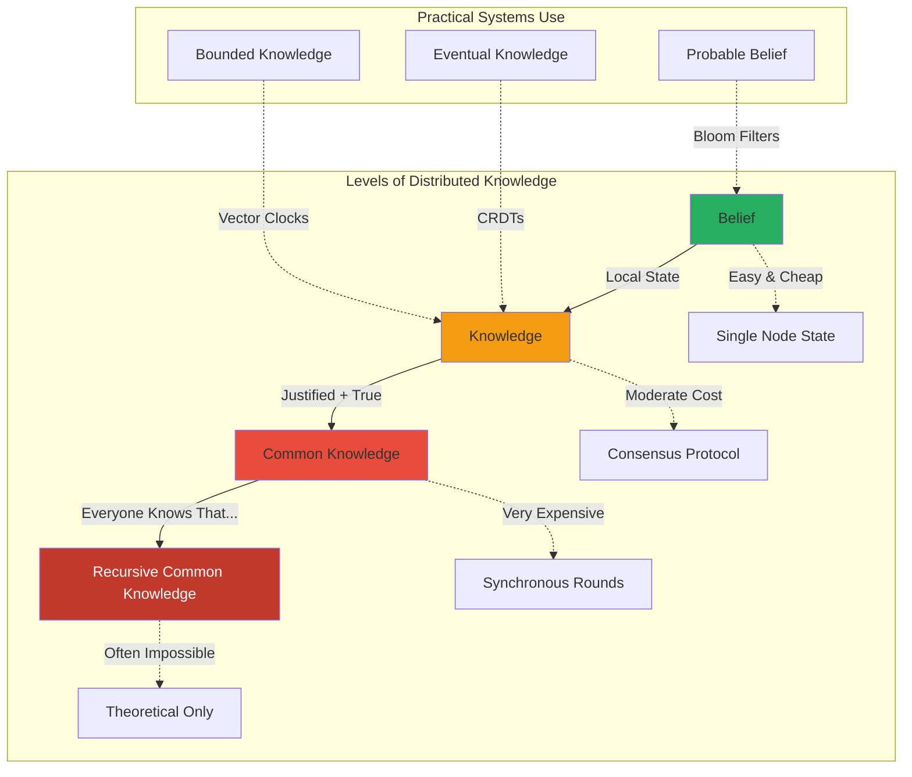

# Axiom 5: The Law of Distributed Knowledge 🧠

> In distributed systems, truth is local, knowledge is partial, and certainty is expensive.

## The Naive View

Nodes share state through consensus protocols. Everyone agrees on the data. We have distributed transactions that ensure consistency. Simple protocols like two-phase commit solve the problem. If we need stronger guarantees, we use Paxos or Raft. Knowledge is just data that all nodes have agreed upon.

## The Reality

"Knowledge" in distributed systems is fundamentally different from single-node truth. Each node has *beliefs* about state that may be inconsistent with others. Achieving *common knowledge*—where everyone knows that everyone knows that everyone knows—is computationally explosive and often impossible. Most systems operate on partial, probabilistic, or eventual knowledge. The Byzantine Generals Problem isn't just about malicious actors; it's about the philosophical impossibility of shared truth in an asynchronous, unreliable world.

## Deep Structure

### The Epistemological Hierarchy



### Local Belief vs Global Truth

```python
class DistributedNode:
    def __init__(self, node_id):
        self.node_id = node_id
        self.local_state = {}      # What I believe
        self.vector_clock = {}      # When I believed it
        self.knowledge_level = {}   # How certain I am
        
    def update_belief(self, key, value, source='local'):
        """Update local belief about state"""
        self.local_state[key] = value
        self.vector_clock[key] = self.increment_clock()
        
        # Belief confidence depends on source
        if source == 'local':
            self.knowledge_level[key] = 'belief'  # I think this is true
        elif source == 'consensus':
            self.knowledge_level[key] = 'knowledge'  # I know this is true
        elif source == 'broadcast':
            self.knowledge_level[key] = 'common_knowledge'  # We all know
            
    def query_state(self, key):
        """Return state with epistemological metadata"""
        return {
            'value': self.local_state.get(key),
            'confidence': self.knowledge_level.get(key, 'unknown'),
            'last_updated': self.vector_clock.get(key),
            'staleness': self.calculate_staleness(key)
        }
```

### The Byzantine Generals as Epistemology

The Byzantine Generals Problem is fundamentally about knowledge, not just reliability:

```python
class ByzantineGeneral:
    def __init__(self, general_id, is_traitor=False):
        self.id = general_id
        self.is_traitor = is_traitor
        self.beliefs = {}  # What I believe others will do
        self.messages_received = {}  # What others told me
        self.common_knowledge = set()  # What we all know we all know
        
    def reason_about_attack(self):
        """The epistemological challenge"""
        
        # Level 1: What do I know?
        my_preference = self.decide_attack_or_retreat()
        
        # Level 2: What do I know about what others know?
        others_preferences = self.gather_messages()
        
        # Level 3: What do I know about what others know I know?
        # This is where it gets complex...
        
        # Byzantine insight: With traitors, we can never achieve
        # common knowledge about the traitors' true intentions
        
        if self.is_traitor:
            # Send different messages to different generals
            return self.sow_confusion()
        else:
            # Try to reach consensus despite uncertainty
            return self.byzantine_agreement_protocol()
```

### Probabilistic Knowledge: When "Probably" Is Good Enough

Many distributed systems abandon certainty for efficiency:

```python
class BloomFilter:
    """
    Probabilistic data structure that trades certainty for space
    """
    def __init__(self, size=1000000, hash_functions=7):
        self.size = size
        self.bits = [0] * size
        self.hash_functions = hash_functions
        
    def add(self, item):
        """Add item to filter - certain it's added"""
        for i in range(self.hash_functions):
            index = hash(f"{item}_{i}") % self.size
            self.bits[index] = 1
            
    def probably_contains(self, item):
        """Check if item exists - probabilistic answer"""
        for i in range(self.hash_functions):
            index = hash(f"{item}_{i}") % self.size
            if self.bits[index] == 0:
                return False  # Definitely not in set
        return True  # Probably in set (might be false positive)
        
    def knowledge_confidence(self):
        """What kind of knowledge does this provide?"""
        return {
            'negative_certainty': 1.0,  # If we say no, it's definitely no
            'positive_certainty': 0.99,  # If we say yes, 1% false positive
            'space_savings': 0.9,       # 90% less space than certain knowledge
            'knowledge_type': 'probabilistic_belief'
        }
```

### CRDTs: Eventual Knowledge Without Coordination

Conflict-free Replicated Data Types achieve knowledge through math, not communication:

```python
class GCounter:
    """
    Grow-only counter CRDT - eventually consistent knowledge
    """
    def __init__(self, node_id, num_nodes):
        self.node_id = node_id
        self.counts = {i: 0 for i in range(num_nodes)}
        
    def increment(self):
        """Local knowledge update"""
        self.counts[self.node_id] += 1
        
    def merge(self, other_counts):
        """Merge knowledge from another node"""
        for node_id, count in other_counts.items():
            self.counts[node_id] = max(self.counts[node_id], count)
            
    def value(self):
        """Current knowledge of total count"""
        return sum(self.counts.values())
        
    def knowledge_properties(self):
        """What kind of knowledge does this provide?"""
        return {
            'consistency': 'eventual',
            'coordination_required': False,
            'merge_complexity': 'O(n)',
            'knowledge_type': 'eventual_knowledge',
            'guarantee': 'monotonic_increase_only'
        }
```

### The Knowledge-Consistency Spectrum

Different consistency models provide different epistemological guarantees:

```python
class KnowledgeConsistencySpectrum:
    models = {
        'linearizability': {
            'knowledge_type': 'immediate_common_knowledge',
            'description': 'All nodes agree on a real-time order',
            'cost': 'Requires synchronous rounds',
            'impossibility': 'Impossible with network partitions',
            'use_case': 'Distributed locks, leader election'
        },
        'sequential_consistency': {
            'knowledge_type': 'eventual_common_knowledge',
            'description': 'All nodes see same order, not real-time',
            'cost': 'High coordination overhead',
            'impossibility': 'Hard with failures',
            'use_case': 'Replicated state machines'
        },
        'causal_consistency': {
            'knowledge_type': 'partial_knowledge',
            'description': 'Preserves cause-effect relationships',
            'cost': 'Moderate - vector clocks',
            'impossibility': 'Cannot order concurrent events',
            'use_case': 'Social media comments, chat'
        },
        'eventual_consistency': {
            'knowledge_type': 'eventual_belief',
            'description': 'Nodes converge eventually',
            'cost': 'Low - no coordination',
            'impossibility': 'No bounds on convergence time',
            'use_case': 'Shopping carts, CDN caches'
        }
    }
```

### The Two Generals Problem: Why Perfect Knowledge Is Impossible

```python
def two_generals_problem():
    """
    Demonstrates impossibility of common knowledge with unreliable communication
    """
    
    class General:
        def __init__(self, name):
            self.name = name
            self.plan_to_attack = None
            self.confirmed = False
            self.messages_sent = 0
            
        def send_message(self, other_general, network):
            self.messages_sent += 1
            message = f"{self.name} plans to attack at dawn"
            
            # Network might lose the message
            if network.deliver():
                other_general.receive_message(message, self, network)
                return True
            else:
                return False  # Message lost
                
        def receive_message(self, message, sender, network):
            # Now I know sender's plan
            self.plan_to_attack = "dawn"
            
            # But sender doesn't know I know
            # So I must acknowledge
            ack = f"{self.name} acknowledges: {message}"
            
            if network.deliver():
                sender.receive_ack(ack, self, network)
            # But what if the ack is lost? Infinite regress...
            
    # No protocol can guarantee both generals attack
    # because we can never achieve common knowledge
    # that the last message was received
```

## Practical Application

### 1. Design APIs That Acknowledge Uncertainty

```python
class EpistemologicallyHonestAPI:
    def read(self, key, consistency_requirement=None):
        """Read that returns knowledge level with data"""
        result = self.storage.get(key)
        
        return {
            'value': result.value,
            'confidence': self.calculate_confidence(result),
            'staleness_bound': result.last_update_time,
            'knowledge_level': self.determine_knowledge_level(result),
            'metadata': {
                'source_nodes': result.sources,
                'vector_clock': result.vector_clock,
                'causal_dependencies': result.deps
            }
        }
        
    def write(self, key, value, knowledge_requirement='eventual'):
        """Write with explicit knowledge guarantees"""
        if knowledge_requirement == 'immediate':
            # Synchronous replication to all nodes
            return self.synchronous_write(key, value)
        elif knowledge_requirement == 'quorum':
            # Write to majority
            return self.quorum_write(key, value)
        elif knowledge_requirement == 'eventual':
            # Local write, async propagation
            return self.eventual_write(key, value)
```

### 2. Leverage Probabilistic Data Structures

```python
class ProbabilisticKnowledgeSystem:
    def __init__(self):
        self.bloom = BloomFilter()  # For existence
        self.hyperloglog = HyperLogLog()  # For cardinality
        self.count_min_sketch = CountMinSketch()  # For frequency
        self.t_digest = TDigest()  # For percentiles
        
    def update_knowledge(self, events):
        """Update probabilistic knowledge structures"""
        for event in events:
            self.bloom.add(event.id)
            self.hyperloglog.add(event.user)
            self.count_min_sketch.add(event.type)
            self.t_digest.add(event.latency)
            
    def query_with_confidence(self, query_type, params):
        """Answer queries with confidence bounds"""
        if query_type == 'exists':
            exists = self.bloom.probably_contains(params['id'])
            return {
                'result': exists,
                'confidence': 0.99 if exists else 1.0,
                'knowledge_type': 'probabilistic_belief'
            }
        elif query_type == 'unique_users':
            estimate = self.hyperloglog.estimate()
            return {
                'result': estimate,
                'error_bound': estimate * 0.02,  # 2% standard error
                'knowledge_type': 'statistical_estimate'
            }
```

### 3. Build Systems That Function with Partial Knowledge

```python
class PartialKnowledgeDecisionMaker:
    def __init__(self):
        self.knowledge_base = {}
        self.confidence_threshold = 0.8
        
    def make_decision(self, context):
        """Make decisions based on available knowledge"""
        
        # Gather what we know
        available_knowledge = self.gather_knowledge(context)
        
        # Assess confidence
        confidence = self.assess_confidence(available_knowledge)
        
        if confidence > self.confidence_threshold:
            # Proceed with high-confidence decision
            return self.high_confidence_path(available_knowledge)
        else:
            # Use degraded mode
            return self.low_confidence_path(available_knowledge)
            
    def gather_knowledge(self, context):
        """Collect knowledge from various sources"""
        knowledge = {
            'local_cache': self.check_local_cache(context),
            'peer_nodes': self.query_peers(context, timeout=50),
            'historical': self.check_historical_patterns(context),
            'probabilistic': self.consult_sketches(context)
        }
        
        # Tag each piece with epistemological metadata
        for source, data in knowledge.items():
            data['source_type'] = source
            data['timestamp'] = time.time()
            data['confidence'] = self.calculate_source_confidence(source)
            
        return knowledge
```

## Example: Amazon Shopping Cart

Amazon's shopping cart demonstrates practical distributed epistemology:

### The Design Philosophy
```python
class AmazonShoppingCart:
    """
    'Add to cart' should never fail due to knowledge uncertainty
    """
    
    def __init__(self, user_id):
        self.user_id = user_id
        self.cart_versions = {}  # Multiple versions can exist
        
    def add_item(self, item, session_id):
        """
        Always succeed, even with partial knowledge
        """
        # Don't need to know the "true" cart state
        # Just record the intention
        add_event = {
            'action': 'add',
            'item': item,
            'session': session_id,
            'timestamp': time.time(),
            'node': self.get_local_node()
        }
        
        # Store locally - belief, not knowledge
        self.record_event(add_event)
        
        # Async propagation - eventual knowledge
        self.propagate_eventually(add_event)
        
        # Return success immediately
        return {'status': 'added', 'knowledge': 'local_belief'}
        
    def get_cart_contents(self):
        """
        Merge all known versions using CRDTs
        """
        # Collect all versions we know about
        all_versions = self.gather_cart_versions()
        
        # Merge using add-wins semantics
        merged_cart = self.crdt_merge(all_versions)
        
        return {
            'items': merged_cart.items,
            'knowledge_level': 'eventual',
            'version_vector': merged_cart.version_vector,
            'confidence': self.calculate_merge_confidence(all_versions)
        }
```

### Why This Works
1. **Availability over Knowledge**: Can always add items
2. **Eventual Knowledge**: Cart converges over time
3. **Business Logic**: Duplicate items are fine, missing items are not
4. **Customer Experience**: Never block the buy button

## Theoretical Foundations

### Epistemic Logic
- **K operator**: K_a(φ) means "agent a knows φ"
- **Common Knowledge**: C(φ) means "everyone knows φ, and everyone knows everyone knows φ, ..."
- **Distributed Knowledge**: What the group would know if they combined all their knowledge

### Information Theory
- **Mutual Information**: How much knowing X tells you about Y
- **Channel Capacity**: Maximum rate of reliable knowledge transfer
- **Entropy**: Uncertainty in distributed knowledge

### Consensus Theory
- **FLP Result**: Cannot guarantee both safety and liveness with one faulty process
- **Byzantine Agreement**: Need 3f+1 nodes to tolerate f Byzantine failures
- **Knowledge Preconditions**: Common knowledge often required for coordinated action

## Design Implications

### 1. **Pattern: Explicit Knowledge Levels**
Make the epistemological status visible:

```python
class KnowledgeAwareResponse:
    def __init__(self, value, metadata):
        self.value = value
        self.knowledge_level = metadata['level']  # belief/knowledge/common
        self.confidence = metadata['confidence']  # 0.0-1.0
        self.staleness = metadata['staleness']    # seconds
        self.sources = metadata['sources']        # which nodes agree
```

### 2. **Anti-pattern: Pretending Certainty**
Don't hide uncertainty from users:

```python
# BAD: Hiding uncertainty
def get_balance():
    return 100.00  # Which version? How stale? Who agrees?

# GOOD: Exposing knowledge level
def get_balance():
    return {
        'amount': 100.00,
        'as_of': '2023-01-01T12:00:00Z',
        'confidence': 'eventual',
        'next_reconciliation': '2023-01-01T13:00:00Z'
    }
```

### 3. **Trade-off: Knowledge vs Performance**
- Strong knowledge = High latency + Low availability
- Weak knowledge = Low latency + High availability
- Probabilistic knowledge = Best of both with bounded error

## Exercises

[**→ Distributed Knowledge Lab**](exercises.md) - Build systems that reason about partial knowledge

## The Ultimate Insight

> "In distributed systems, the question is not 'what is true?' but 'what do we collectively believe, with what confidence, as of when?'"

Perfect knowledge is impossible in distributed systems. The art lies in:
1. **Choosing the right knowledge level** for each use case
2. **Making uncertainty explicit** in APIs and UIs
3. **Building systems that degrade gracefully** with partial knowledge
4. **Using probabilistic techniques** where appropriate

## Further Reading

- "Knowledge and Common Knowledge in a Distributed Environment" - Halpern & Moses
- "Unreliable Failure Detectors for Reliable Distributed Systems" - Chandra & Toueg
- "CRDTs: Consistency without Concurrency Control" - Shapiro et al.
- "Epistemology of Distributed Systems" - Fagin et al.

[**← Previous: Law of Multidimensional Optimization**](../axiom4-tradeoffs/index.md) | [**→ Next: Law of Cognitive Load**](../axiom6-cognitive-load/index.md)