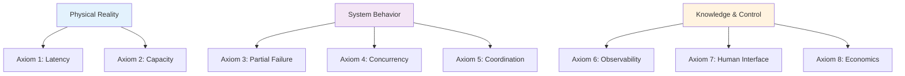
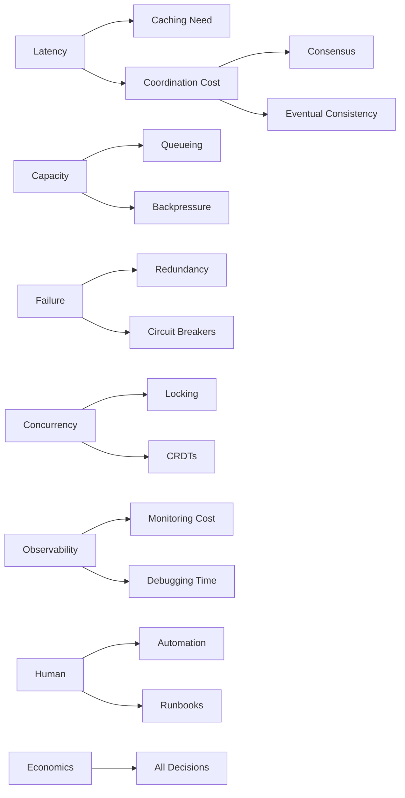

# Part I: The 8 Fundamental Axioms

!!! abstract "Foundation of Everything"
    These eight axioms are the irreducible constraints that govern all distributed systems. Every pattern, every failure, every architectural decision traces back to these fundamental laws.

## Overview

<div class="axiom-overview">



</div>

## The Eight Axioms

<div class="grid cards" markdown>

- :material-lightning-bolt:{ .lg .middle } **[Axiom 1: Latency](axiom-1-latency/index.md)**

    ---
    
    Information propagation takes time. The speed of light is non-negotiable.
    
    **Key Insight**: You can't beat physics
    
    [:octicons-arrow-right-24: Explore Latency](axiom-1-latency/index.md)

- :material-database:{ .lg .middle } **[Axiom 2: Finite Capacity](axiom-2-capacity/index.md)**

    ---
    
    Every resource has limits. Systems cliff-dive at high utilization.
    
    **Key Insight**: The knee is at 70-80%
    
    [:octicons-arrow-right-24: Understand Capacity](axiom-2-capacity/index.md)

- :material-alert:{ .lg .middle } **[Axiom 3: Partial Failure](axiom-3-failure/index.md)**

    ---
    
    Components fail independently. Failure is partial, not binary.
    
    **Key Insight**: Some parts work while others don't
    
    [:octicons-arrow-right-24: Handle Failures](axiom-3-failure/index.md)

- :material-sync:{ .lg .middle } **[Axiom 4: Concurrency](axiom-4-concurrency/index.md)**

    ---
    
    Concurrent operations create race conditions and conflicts.
    
    **Key Insight**: Time is relative between nodes
    
    [:octicons-arrow-right-24: Manage Concurrency](axiom-4-concurrency/index.md)

- :material-handshake:{ .lg .middle } **[Axiom 5: Coordination Cost](axiom-5-coordination/index.md)**

    ---
    
    Agreement between nodes is expensive in time and resources.
    
    **Key Insight**: Consensus has fundamental costs
    
    [:octicons-arrow-right-24: Calculate Costs](axiom-5-coordination/index.md)

- :material-eye:{ .lg .middle } **[Axiom 6: Observability](axiom-6-observability/index.md)**

    ---
    
    You can't debug what you can't see. Knowledge is always partial.
    
    **Key Insight**: Observation changes the system
    
    [:octicons-arrow-right-24: Improve Visibility](axiom-6-observability/index.md)

- :material-human:{ .lg .middle } **[Axiom 7: Human Interface](axiom-7-human-interface/index.md)**

    ---
    
    Humans are part of the system with limited bandwidth and reliability.
    
    **Key Insight**: Design for human limitations
    
    [:octicons-arrow-right-24: Human Factors](axiom-7-human-interface/index.md)

- :material-currency-usd:{ .lg .middle } **[Axiom 8: Economics](axiom-8-economics/index.md)**

    ---
    
    Every technical decision is an economic decision in disguise.
    
    **Key Insight**: Pick two: fast, cheap, reliable
    
    [:octicons-arrow-right-24: Understand Costs](axiom-8-economics/index.md)

</div>

## How Axioms Interact

### The Axiom Dependency Graph



### Common Combinations

| Axioms | Result | Example |
|--------|--------|---------|
| Latency + Capacity | Caching layers | CDN architecture |
| Failure + Concurrency | Split-brain | Database primary election |
| Coordination + Economics | Eventual consistency | Shopping cart sync |
| Observability + Human | Alert fatigue | Noisy monitoring |
| All axioms | Distributed system | Any real system |

## The Axiom Spider Chart {#spider-chart}

Evaluate your system against all eight axioms:

<div class="spider-chart">

```
                        Latency
                          10
                      8   .   
                  6     .   .
              4       .       .
          2         .           .
Economics 0 ─────────*───────────── Capacity
        .           .             .
        .           .           .
        .           .         .     Failure
        .           .       .
Human   .           .     .    Concurrency
        .           .   .
    Observability   . .     Coordination
```

</div>

### How to Use the Spider Chart

1. **Rate each axiom** (0-10) based on its impact on your system
2. **Connect the dots** to see your system's shape
3. **Identify spikes** - these are your primary constraints
4. **Compare shapes** across different systems or time periods

## Learning Path Through Axioms

### By Difficulty

1. **Beginner**: Start with 1, 2, 3 (physical constraints)
2. **Intermediate**: Add 4, 5 (distributed behavior)
3. **Advanced**: Include 6, 7, 8 (system operations)

### By Problem Type

| If you're facing... | Start with... |
|---------------------|---------------|
| Performance issues | Axioms 1, 2 |
| Reliability problems | Axioms 3, 4 |
| Coordination overhead | Axiom 5 |
| Debugging difficulties | Axiom 6 |
| Operational burden | Axiom 7 |
| Cost overruns | Axiom 8 |

## Key Principles

!!! success "Remember"
    
    1. **Axioms are constraints, not features** - You can't eliminate them
    2. **Every pattern emerges from axioms** - Understand why, not just what
    3. **Axioms compound** - Real systems face all eight simultaneously
    4. **Trade-offs are inevitable** - Improving one dimension costs another

## Quick Reference

### The Axioms in One Line Each

1. **Latency**: Distance = Delay
2. **Capacity**: Everything has limits
3. **Failure**: Parts fail independently  
4. **Concurrency**: Time is relative
5. **Coordination**: Agreement costs
6. **Observability**: Can't see everything
7. **Human**: People in the loop
8. **Economics**: Everything has a price

## Navigation

!!! tip "Start Your Journey"
    
    **Recommended**: Begin with [Axiom 1: Latency](axiom-1-latency/index.md) →
    
    **Quick Reference**: [Axiom Summary](summary.md) | [Decision Trees](../references/decision-trees.md)
    
    **Next Level**: [Part II: The 5 Pillars](../part2-pillars/index.md)