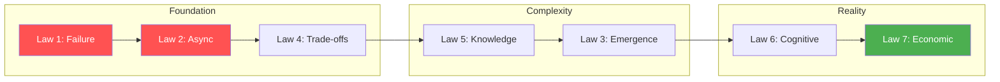

# The 7 Fundamental Laws

[Home](/) > [The 7 Laws](/part1-axioms) > Overview

!!! abstract "From Physics to Distributed Systems"
    These seven laws are not design choices or best practices—they are fundamental constraints derived from physics and mathematics. Every distributed system, regardless of implementation, must obey these laws.

## :material-lightbulb: Why Laws Matter

| Aspect | Traditional Patterns | Fundamental Laws |
|--------|---------------------|------------------|
| **Origin** | Best practices | Physics & mathematics |
| **Choice** | Optional to implement | Inescapable constraints |
| **Scope** | Specific use cases | Universal application |
| **Evolution** | Change with technology | Timeless truths |

## :material-list-box: The 7 Laws

- :material-numeric-1-circle:{ .lg .middle } **[Law 1: Correlated Failure](/part1-axioms/law1-failure/index)**
    
    ---
    
    **Any component can fail, and failures are often correlated, not independent.**
    
    The myth of independent failure and why redundancy isn't enough.

- :material-numeric-2-circle:{ .lg .middle } **[Law 2: Asynchronous Reality](/part1-axioms/law2-asynchrony/index)**
    
    ---
    
    **The network is asynchronous; there's no reliable way to distinguish slow from dead.**
    
    Why timeouts are guesses and synchronous assumptions break.

- :material-numeric-3-circle:{ .lg .middle } **[Law 3: Emergent Chaos](/part1-axioms/law3-emergence/index)**
    
    ---
    
    **System behavior emerges from component interactions and cannot be predicted from individual parts.**
    
    Why distributed systems surprise us and testing isn't enough.

- :material-numeric-4-circle:{ .lg .middle } **[Law 4: Multidimensional Optimization](/part1-axioms/law4-tradeoffs/index)**
    
    ---
    
    **You cannot optimize all dimensions simultaneously; trade-offs are mandatory.**
    
    The CAP theorem is just one example of fundamental trade-offs.

- :material-numeric-5-circle:{ .lg .middle } **[Law 5: Distributed Knowledge](/part1-axioms/law5-epistemology/index)**
    
    ---
    
    **No single node can have perfect knowledge of the global system state.**
    
    Why consensus is hard and eventual consistency is often inevitable.

- :material-numeric-6-circle:{ .lg .middle } **[Law 6: Cognitive Load](/part1-axioms/law6-human-api/index)**
    
    ---
    
    **Human cognitive capacity is the ultimate bottleneck in system complexity.**
    
    Why simple systems win and complexity compounds failures.

- :material-numeric-7-circle:{ .lg .middle } **[Law 7: Economic Reality](/part1-axioms/law7-economics/index)**
    
    ---
    
    **Every technical decision has economic implications that compound over time.**
    
    Why the best technical solution may not be the right solution.

## :material-school: Learning Path

| Order | Law | Why Start Here | Key Insight |
|-------|-----|----------------|-------------|
| 1️⃣ | **Correlated Failure** | Most visible impact | Systems fail in groups |
| 2️⃣ | **Asynchronous Reality** | Core distributed challenge | Can't distinguish slow from dead |
| 3️⃣ | **Trade-offs** | Shapes all decisions | No perfect solutions |
| 4️⃣ | **Distributed Knowledge** | Coordination complexity | No global truth |
| 5️⃣ | **Emergent Chaos** | System behavior | Whole ≠ sum of parts |
| 6️⃣ | **Cognitive Load** | Human factor | Complexity kills |
| 7️⃣ | **Economic Reality** | Business constraints | Cost drives design |

## :material-connection: How Laws Connect to Patterns

Each law drives the need for specific patterns:

| Law | Key Patterns | Why |
|-----|-------------|-----|
| **Law 1: Correlated Failure** | Circuit Breaker, Bulkhead | Prevent cascade failures |
| **Law 2: Asynchronous Reality** | Timeout, Async Messaging | Handle uncertainty |
| **Law 3: Emergent Chaos** | Chaos Engineering, Observability | Manage complexity |
| **Law 4: Trade-offs** | CQRS, Event Sourcing | Optimize different dimensions |
| **Law 5: Distributed Knowledge** | Consensus, Eventually Consistent | Coordinate without global state |
| **Law 6: Cognitive Load** | API Gateway, Service Mesh | Abstract complexity |
| **Law 7: Economic Reality** | Auto-scaling, Serverless | Optimize costs |

## :material-test-tube: Test Your Understanding

### Quick Knowledge Check

| Question | Tests Law | Answer Reveals |
|----------|-----------|----------------|
| Why doesn't adding redundancy guarantee availability? | Law 1 | Correlated failures |
| Why can't we have instant global consensus? | Law 2 | Speed of light limits |
| Why is "exactly once" delivery impossible? | Laws 2+5 | Network uncertainty |
| Why do simple systems often outperform complex ones? | Law 6 | Cognitive limits |
| Why might the "best" solution fail? | Law 7 | Economic constraints |

### Deep Understanding Matrix

| If you understand... | You can explain... | You can design... |
|---------------------|-------------------|------------------|
| **Law interactions** | Why CAP exists | Consistency models |
| **Physical limits** | Minimum latencies | Geographic distribution |
| **Emergence** | Cascade failures | Circuit breakers |
| **Trade-offs** | No silver bullets | Balanced architectures |

## :material-book-open: Further Study

=== "Academic Papers"

    - Lamport, L. (1978). "Time, Clocks, and the Ordering of Events"
    - Brewer, E. (2000). "Towards Robust Distributed Systems"
    - Gray, J. (1986). "Why Do Computers Stop and What Can Be Done About It?"

=== "Books"

    - "Designing Data-Intensive Applications" by Martin Kleppmann
    - "Release It!" by Michael Nygard
    - "The Art of Computer Systems Performance Analysis" by Raj Jain

=== "Case Studies"

    - [Amazon's Dynamo Paper](/reference/#dynamo)
    - [Google's Spanner Paper](/reference/#spanner)
    - [Facebook's TAO Paper](/reference/#tao)

## :material-lightbulb: Key Insight

!!! quote "Remember"
    "In distributed systems, the question is not whether failures will happen, but how your system will behave when they do. These laws help us reason about that behavior."

---

[:material-arrow-left: Philosophy](/introduction/philosophy/) | 
[:material-arrow-up: Learn](/introduction/getting-started.md) | 
[:material-arrow-right: Law 1: Correlated Failure](/part1-axioms/law1-failure/index)

