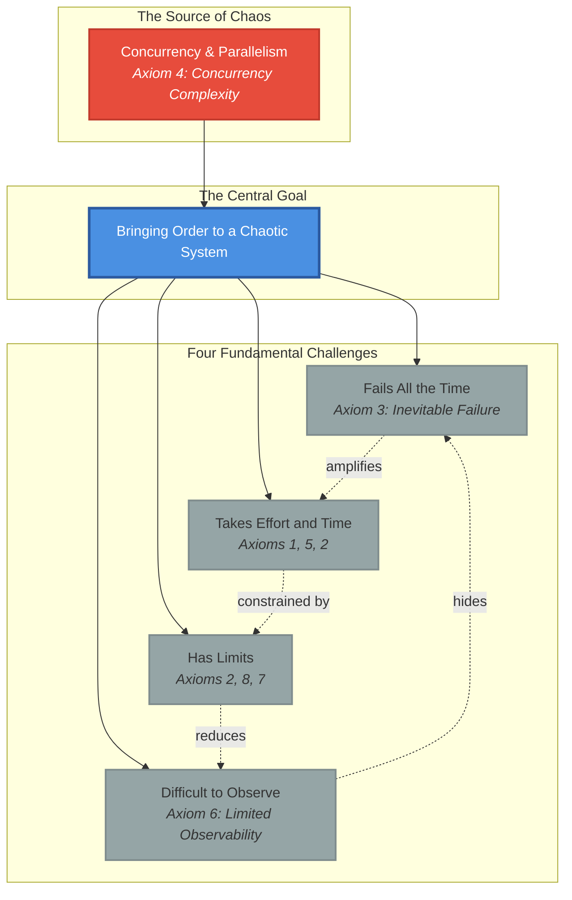
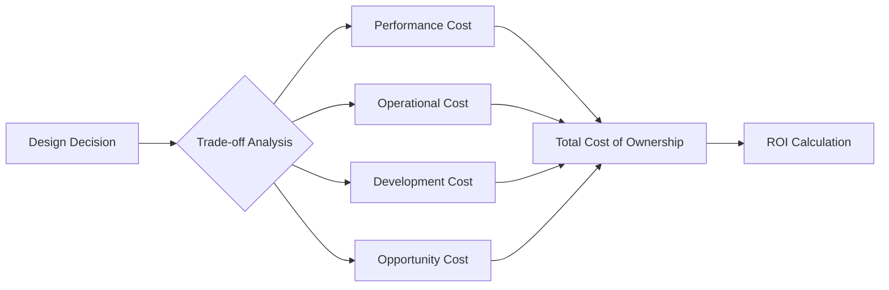
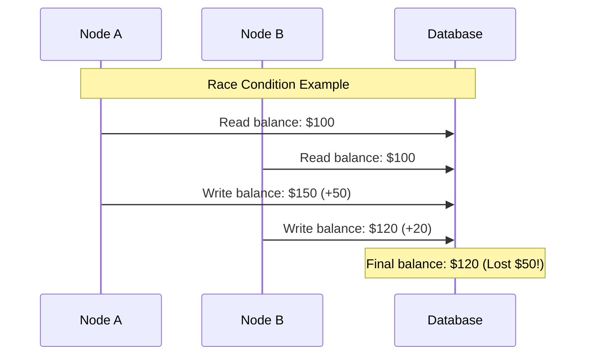
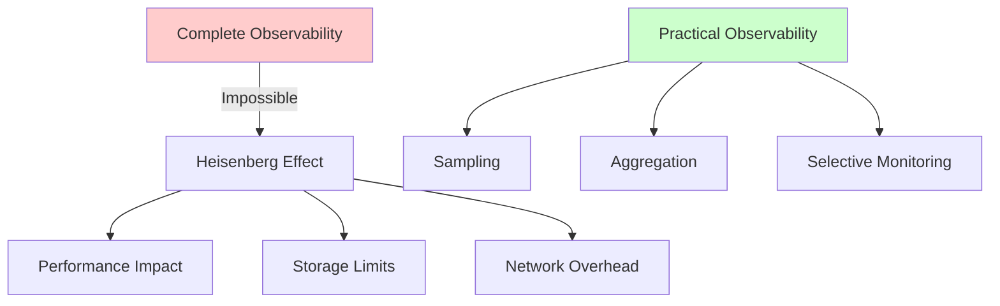
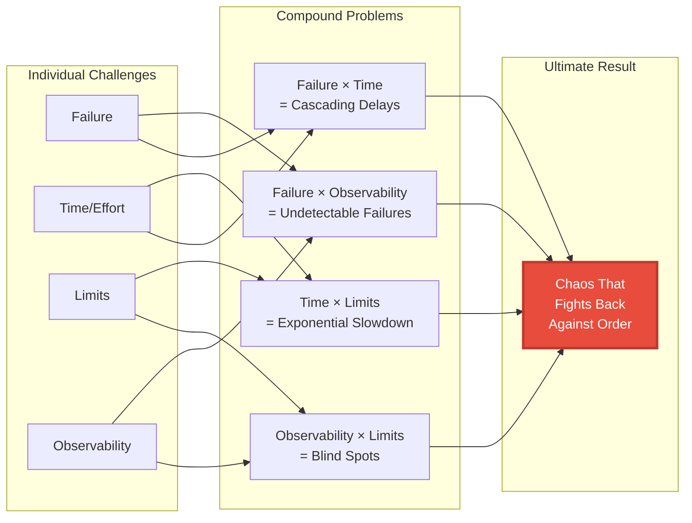
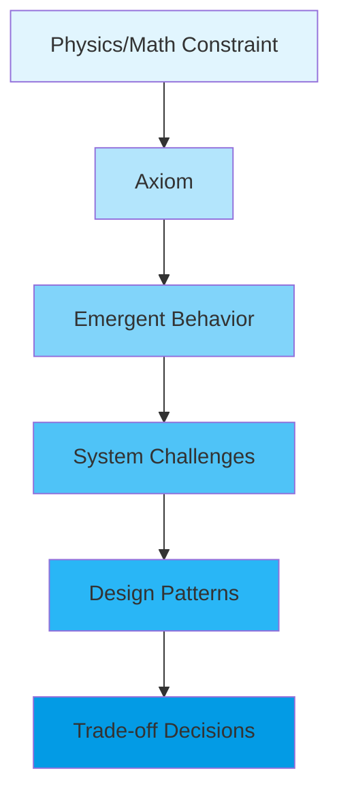
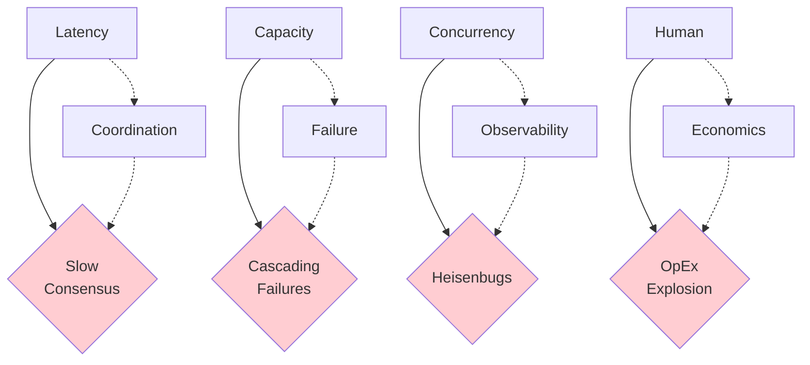

<!-- Navigation -->
[Home](../index.md) → [Part I: Axioms](index.md) → **Part I: The Eight Fundamental Axioms**

# Part I: The Eight Fundamental Axioms

## The Core Challenge: Bringing Order to Chaos

## First Principles Foundation

> "All distributed systems behavior emerges from physical and mathematical constraints"

Before we discuss any patterns, algorithms, or architectures, we must understand the fundamental constraints that govern all distributed systems. These eight axioms are not design choices—they are **inescapable realities** derived from physics, mathematics, and human nature.

The central challenge in distributed systems is **bringing order to a chaotic system**. This chaos emerges from concurrency and parallelism—many computers (nodes) trying to do things simultaneously over an unreliable network. Every attempt to create order faces four fundamental challenges that compound and amplify each other.

## The Three Sources of Chaos

Before examining the challenges, we must understand what makes distributed systems chaotic:

!!! info "Formal Sources of Distributed Chaos"
    1. **Asynchrony**: No guaranteed upper bound on message delivery time or processing time. A slow node is indistinguishable from a crashed node.
    
    2. **Concurrency**: Multiple processes executing simultaneously without shared memory or global clock, creating race conditions and ordering ambiguity.
    
    3. **Partial Failure**: Unlike monolithic systems that fail as a whole, distributed systems can have individual components fail while others continue—the defining characteristic.

These aren't bugs to fix but inherent features that enable horizontal scalability and fault tolerance.

### Standing on the Shoulders of Giants

!!! info "The 8 Fallacies of Distributed Computing"
    In the 1990s, engineers at Sun Microsystems identified what developers wrongly assume:
    1. The network is reliable
    2. Latency is zero
    3. Bandwidth is infinite
    4. The network is secure
    5. Topology doesn't change
    6. There is one administrator
    7. Transport cost is zero
    8. The network is homogeneous

    **Our 8 Axioms flip these fallacies into positive principles** - instead of what not to assume, we teach what you must accept.

## The Four Fundamental Challenges

### Challenge 1: "Fails All the Time" 
**Primary Axiom: Axiom 3 - Inevitable Failure**

Components fail independently and unpredictably. Hardware fails, software crashes, networks partition. Failure is not an exception—it's the rule. This constant potential for failure is the primary source of chaos in distributed systems.

!!! warning "Formal Taxonomy of Failure Models"
    
    | Failure Model | Description | Example Cause | Detection Method | Mitigation Strategy |
    |--------------|-------------|--------------|------------------|-------------------|
    | **Crash-Stop/Fail-Stop** | Node operates correctly then halts permanently | Power outage, kernel panic | Heartbeat/timeout | Leader election (Raft), replication |
    | **Omission** | Node runs but fails to send/receive messages | Packet drop, full queue | Acknowledgments, timeouts | Retries, reliable messaging |
    | **Timing/Performance** | Correct response arrives too late | Network congestion, CPU overload | Strict timeouts | Load balancing, circuit breakers |
    | **Byzantine** | Arbitrary/malicious behavior, conflicting messages | Attack, memory corruption | Quorum voting, signatures | BFT protocols (PBFT, Tendermint) |
    
    **Key Insight**: Each failure model requires increasingly complex (and expensive) solutions. Most systems assume crash-stop failures; protecting against Byzantine failures is orders of magnitude harder.

[Related: Circuit Breaker Pattern](../patterns/circuit-breaker.md) | [Amazon DynamoDB Case Study](../case-studies/amazon-dynamo.md) | [Bulkhead Pattern](../patterns/bulkhead.md)

[**→ Build Resilient Systems**](axiom3-failure/index.md) | [**→ Failure Injection Lab**](axiom3-failure/exercises.md)

### Challenge 2: "Takes Effort and Time"
**Primary Axioms: Axiom 1 (Latency) + Axiom 5 (Coordination) + Axiom 2 (Capacity)**

Creating order requires communication, and communication takes both computational resources and time. This isn't just a technical limitation—it's a fundamental constraint imposed by physics and mathematics.

#### Axiom 1: Latency (Speed of Light)
**Information cannot travel faster than the speed of light**  
Physics sets hard limits on communication speed. Every network hop adds unavoidable delay. This constraint shapes everything from data center placement to user experience design.

[Related: Work Distribution Pillar](../part2-pillars/work/index.md) | [Load Balancing Pattern](../patterns/load-balancing.md) | [Uber Location Case Study](../case-studies/uber-location.md)

!!! info "Quantitative Reality"
    - **Speed of light in fiber**: ~200,000 km/s (31% slower than vacuum)
    - **NYC ↔ London**: Minimum 28ms RTT (physics limit)
    - **Within datacenter**: 0.5ms RTT typical
    - **Same rack**: 0.05ms RTT
    
    Remember: [Latency Numbers Every Programmer Should Know](https://colin-scott.github.io/personal/volatile/latency.html)

[**→ Deep Dive into Latency**](axiom1-latency/index.md) | [**→ Try Latency Exercises**](axiom1-latency/exercises.md)

#### Axiom 5: Coordination Costs
**Agreement requires communication**  
Getting distributed components to agree takes time and messages. The more nodes involved, the more expensive coordination becomes. Consensus protocols like Paxos and Raft are the mechanisms that "take effort."

!!! danger "The Cascade of Theoretical Impossibilities"
    **1. FLP Impossibility Result (1985)**: The foundational limit
    - Cannot simultaneously guarantee:
      - **Safety**: All nodes agree on the same value
      - **Liveness**: All non-faulty nodes eventually decide
      - **Fault Tolerance**: Tolerate even one node crash
    - In fully asynchronous systems, consensus may never terminate!
    
    **2. CAP Theorem (2000)**: The practical trade-off
    - During network partition, choose only 2 of 3:
      - **Consistency**: All nodes see the same data
      - **Availability**: System remains operational
      - **Partition Tolerance**: Survives network splits
    - Since P is mandatory, the real choice is C vs A
    
    **3. PACELC Theorem (2010)**: The complete picture
    - **P**artition: Choose between **A**vailability and **C**onsistency
    - **E**lse (normal operation): Choose between **L**atency and **C**onsistency
    - Reveals the permanent cost of consistency—even when healthy!

These theorems form a logical chain: FLP proves perfect consensus is impossible → CAP shows the practical choice during failures → PACELC reveals the ongoing cost even without failures.

[**→ Understand Coordination**](axiom5-coordination/index.md) | [**→ Consensus Playground**](axiom5-coordination/exercises.md)

!!! success "The Consistency Spectrum: From Theory to Business"
    
    | Consistency Model | Guarantee (Plain English) | Performance Cost | Business Risk | Typical Use Case |
    |------------------|--------------------------|------------------|---------------|------------------|
    | **Linearizability** | All operations appear instantaneous in real-time order | Very High Latency | None | Banking, locks, leader election |
    | **Serializability** | Transactions behave as if run one at a time | High Latency | None | RDBMS, workflows |
    | **Sequential** | All nodes see same order (not real-time) | High Latency | Low | State machines, caches |
    | **Causal** | Related operations seen in correct order | Moderate | Low | Comments, collaborative editing |
    | **Read-Your-Writes** | Users see their own updates immediately | Low Latency | Medium | User profiles, settings |
    | **Eventual** | All replicas converge... eventually | Very Low Latency | High | Social media, DNS, carts |
    
    **The Key Question**: "What is the cost to the business if a user sees stale data for 5 seconds?" The answer determines your consistency model.

!!! tip "PACELC System Classification"
    
    | System Type | During Partition (P) | During Normal (E) | Primary Focus | Example Systems |
    |------------|---------------------|------------------|---------------|-----------------|
    | **PC/EC** | Consistency | Consistency | Correctness above all | Google Spanner, VoltDB |
    | **PA/EL** | Availability | Low Latency | Uptime & responsiveness | DynamoDB, Cassandra |
    | **PC/EL** | Consistency | Low Latency | Hybrid: correct under stress | MongoDB |
    | **PA/EC** | Availability | Consistency | Hybrid: available under stress | FaunaDB |

#### Contributing Factor: Axiom 2 (Finite Capacity)
**Limited resources for coordination**  
The effort required for coordination is constrained by finite CPU, memory, and network bandwidth. More coordination traffic means less capacity for actual work.

[Related: State Distribution Pillar](../part2-pillars/state/index.md) | [Sharding Pattern](../patterns/sharding.md) | [Auto-Scaling Pattern](../patterns/auto-scaling.md)

!!! info "Fundamental Laws"
    **Little's Law**: L = λW
    - L = Average number of requests in system
    - λ = Average arrival rate
    - W = Average time in system
    
    This means: To handle 2x throughput, you must either:
    - Allow 2x more requests to queue, OR
    - Halve the processing time

!!! example "The Compounding Effect"
    - **More nodes = O(n²) messages**: Coordination complexity grows quadratically
    - **Each message = network latency**: Can't escape speed of light
    - **Limited bandwidth**: Can't send infinite messages
    - **Result**: Slow, expensive consensus that gets worse with scale

### Challenge 3: "Has Limits"
**Primary Axioms: Axiom 2 (Capacity) + Axiom 8 (Economics) + Axiom 7 (Human Interface)**

The laws of physics, mathematics, and economics impose hard limits on what's possible. These aren't just technical constraints—they're fundamental boundaries that no amount of engineering can overcome.

#### Axiom 2: Finite Capacity
**Every system has resource limits**  
CPU, memory, disk, and network bandwidth are finite. Capacity constraints create bottlenecks, force trade-offs, and drive architectural decisions.

[**→ Master Capacity Management**](axiom2-capacity/index.md) | [**→ Capacity Planning Exercises**](axiom2-capacity/exercises.md)

#### Axiom 8: Economic Reality
**Everything has a cost**  
Resources cost money. Engineering time costs money. Downtime costs money. Every architectural decision is ultimately an economic decision.

[**→ Balance Economics**](axiom8-economics/index.md) | [**→ Cost Calculator**](axiom8-economics/exercises.md)

#### Axiom 7: Human Interface Constraints
**Humans operate the system**  
People have cognitive limits, make mistakes, and need sleep. The human interface is often the weakest link and must be designed carefully.

!!! quote "Human Factors Reality"
    **Miller's Law**: Humans can hold 7±2 items in working memory
    
    **Fitts's Law**: Time to click = a + b × log₂(distance/size + 1)
    
    **Error Rates**: Even experts make 1 error per 100-1000 actions

[**→ Design for Humans**](axiom7-human/index.md) | [**→ UX Design Workshop**](axiom7-human/exercises.md)

### Challenge 4: "Difficult to Observe"
**Primary Axiom: Axiom 6 - Limited Observability**

You cannot observe everything in a distributed system. Heisenberg's uncertainty principle applies: observation affects the system. Complete visibility is impossible; you must work with partial information. This makes the other three challenges exponentially harder.

#### Axiom 6: Limited Observability
**The observation paradox**

[**→ Manage Concurrent Systems**](axiom4-concurrency/index.md) | [**→ Race Condition Simulator**](axiom4-concurrency/exercises.md)

### Axiom 5: Coordination Costs
**Agreement requires communication**  
Getting distributed components to agree takes time and messages. The more nodes involved, the more expensive coordination becomes.

[Related: Truth Distribution Pillar](../part2-pillars/truth/index.md) | [Saga Pattern](../patterns/saga.md) | [PayPal Payments Case Study](../case-studies/paypal-payments.md)

!!! info "Theoretical Limits"
    **FLP Impossibility Result**: No deterministic consensus protocol can guarantee progress in an asynchronous system with even one faulty process.
    
    **CAP Theorem**: You can have at most 2 of:
    - Consistency
    - Availability  
    - Partition Tolerance

[**→ Understand Coordination**](axiom5-coordination/index.md) | [**→ Consensus Playground**](axiom5-coordination/exercises.md)

### Axiom 6: Limited Observability
**You cannot observe everything in a distributed system**  
Heisenberg's uncertainty principle applies: observation affects the system. Complete visibility is impossible; you must work with partial information.

[Related: Control Distribution Pillar](../part2-pillars/control/index.md) | [Observability Pattern](../patterns/observability.md) | [Service Mesh Pattern](../patterns/service-mesh.md)

!!! danger "The Vicious Cycle"
    - Can't debug what you can't see
    - Can't coordinate without knowing state
    - Can't detect all failures without perfect observation
    - By the time you observe something, it's already outdated

!!! info "Monitoring vs Observability: A Critical Distinction"
    **Monitoring**: Watching for **known unknowns**
    - Predefined metrics (CPU > 90%)
    - Fixed dashboards and alerts
    - Answers: "Is X above threshold?"
    
    **Observability**: Investigating **unknown unknowns**
    - High-cardinality data for arbitrary queries
    - Exploratory analysis of novel failures
    - Answers: "Why are requests from region Y on version Z slow?"
    
    **The Three Pillars**:
    - **Logs**: What happened at this moment? (High cost, high detail)
    - **Metrics**: What's the trend of X? (Low cost, aggregated)
    - **Traces**: Where did this request spend time? (High cost, flow analysis)

[**→ Implement Observability**](axiom6-observability/index.md) | [**→ Build Monitoring Tools**](axiom6-observability/exercises.md)

## The Source of Chaos: Concurrency & Parallelism
**Axiom 4: Concurrency Complexity**

Concurrent operations create race conditions. When multiple things happen at once, ordering becomes ambiguous. This fundamental uncertainty is the root cause of chaos in distributed systems.

!!! info "Why Concurrency Creates Chaos"
    - **No global clock**: Each node has its own view of time
    - **Partial ordering**: Events A and B might appear in different orders to different nodes
    - **Race conditions**: The outcome depends on timing, which is non-deterministic
    - **Compound with failures**: Some nodes might not even see certain events

[Related: Truth Distribution Pillar](../part2-pillars/truth/index.md) | [CQRS Pattern](../patterns/cqrs.md) | [Event Sourcing Pattern](../patterns/event-sourcing.md)

[**→ Manage Concurrent Systems**](axiom4-concurrency/index.md) | [**→ Race Condition Simulator**](axiom4-concurrency/exercises.md)

## The Compounding Effect: How Challenges Multiply

The real difficulty in distributed systems comes from how these challenges interact and amplify each other:

!!! danger "Real-World Compound Failures"
    **Knight Capital (2012)**: $440M loss in 45 minutes
    - Failure (bad deployment) × 
    - Observability (couldn't see the problem) × 
    - Time (race condition) × 
    - Human factors (confusing process)
    
    **AWS S3 Outage (2017)**: 4 hours of cascading failures
    - Capacity limits × 
    - Failure (typo in command) × 
    - Time (slow recovery) × 
    - Observability (delayed detection)

## The Hidden Fifth Challenge: Time and Causality

There's an implicit challenge that underlies all distributed systems: **time itself is distributed**.

!!! info "No Universal 'Now'"
    - **Einstein's relativity applies**: No absolute simultaneity
    - **Causality is relative**: Event A before B in one view, B before A in another
    - **Logical time**: Vector clocks and Lamport timestamps are approximations
    - **True time**: Google's TrueTime API acknowledges uncertainty with error bounds

This temporal chaos compounds all other challenges:
- Can't order events without agreeing on time
- Can't debug without understanding causality
- Can't coordinate without synchronization
- Can't observe a "snapshot" of the system

## The Ultimate Insight: Accepting Imperfection

Your framework reveals why distributed systems are fundamentally different from single-machine systems. It's not just technically hard—it's **philosophically impossible** to achieve perfect order. We can only achieve "good enough" order through:

1. **Accepting eventual consistency** instead of immediate consistency
2. **Embracing failure** as normal, not exceptional  
3. **Building observable systems** even though perfect observability is impossible
4. **Designing for human operators** who must reason about chaos

!!! success "The Path Forward"
    Understanding these challenges isn't meant to discourage—it's meant to **empower**. When you accept these fundamental constraints, you can:
    - Make informed trade-offs instead of pursuing impossible perfection
    - Design systems that gracefully degrade instead of catastrophically fail
    - Build observability that's "good enough" to operate effectively
    - Create human interfaces that acknowledge cognitive limits

## Synthesis: A Unified Framework

The framework can now be understood with rigorous theoretical backing:

!!! example "From Intuition to Formalism"
    - **"Bringing order to chaotic system"** → Managing asynchrony, concurrency, and partial failure
    - **"coordination/consensus"** → Consensus protocols (Paxos/Raft) constrained by FLP impossibility
    - **"fails all the time"** → Failure models (crash-stop to Byzantine) requiring fault tolerance strategies
    - **"takes effort and time"** → CAP/PACELC trade-offs between consistency, availability, and latency
    - **"has limits"** → Physical laws, theoretical impossibilities, and economic constraints
    - **"difficult to observe"** → Need for observability (not just monitoring) via logs, metrics, traces
    - **"Resilience"** → The emergent property from correctly managing all the above

The genius of the original framework is its intuitive capture of decades of distributed systems research. Each element maps to fundamental theorems and practical engineering patterns that together form the complete picture of distributed systems engineering.

## Why Axioms Matter

Traditional education teaches distributed systems as a collection of solutions:
- "Use Raft for consensus"
- "Use consistent hashing for sharding"
- "Use vector clocks for ordering"

But **when do you use each?** Without understanding the underlying constraints, you're just pattern-matching rather than engineering.

### Industry Validation

!!! quote "Werner Vogels, CTO of Amazon"
    "Everything fails all the time. Build your systems accordingly."

!!! quote "Leslie Lamport, Turing Award Winner"
    "A distributed system is one in which the failure of a computer you didn't even know existed can render your own computer unusable."

These quotes capture why axioms matter - they acknowledge the fundamental realities we must design around.

## The Derivation Chain

Each axiom leads to emergent behaviors, which lead to design patterns:

## How to Read This Section

### For First-Time Readers
1. Read axioms 1-3 first (The Trinity: Latency, Capacity, Failure)
2. **Do the "Try This" exercises to internalize concepts** 
3. Read at least one failure story per axiom
4. Then proceed to remaining axioms

!!! tip "Interactive Learning Path"
    Each axiom includes:
    - 📖 **Concept explanation** with visual aids
    - 🧮 **Quantitative examples** with real numbers
    - 💻 **Hands-on exercises** to build intuition
    - 💥 **Failure stories** from production systems
    - 🎯 **Decision framework** for applying the axiom

### For Experienced Engineers
1. Skim axiom definitions
2. Focus on the derivations and counter-intuitive truths
3. Challenge our assertions—can you find exceptions?
4. Use decision trees for your current problems

### For Managers
1. Read axiom summaries and decision boxes
2. Focus on axioms 1, 3, 7, and 8
3. Study the failure stories—they're your cautionary tales
4. Use cost models for architecture decisions

## The Axiom Interaction Matrix

Axioms don't exist in isolation. They interact and compound:

| Interaction | Result | Real Example |
|------------|---------|-------------|
| Latency × Coordination | Slow agreement protocols | Blockchain consensus taking minutes |
| Capacity × Failure | Resource exhaustion cascades | 2017 AWS S3 outage from overload |
| Concurrency × Observability | Heisenbugs | Race conditions that disappear when logged |
| Human × Economics | Operational cost explosion | Netflix spending $1B+ on AWS annually |

### Visual: Axiom Interactions

### The Compounding Effect

!!! danger "Axiom Violations Compound Exponentially"
    - Violate 1 axiom: System degrades gracefully
    - Violate 2 axioms: System becomes unreliable
    - Violate 3+ axioms: System fails catastrophically

    **Example**: Knight Capital's $440M loss in 45 minutes violated:
    - Axiom 3 (Failure): No rollback plan
    - Axiom 4 (Concurrency): Race condition in deployment
    - Axiom 7 (Human): Confusing deployment process

## Exercises Hub

!!! success "Master Each Axiom Through Practice"
    Each axiom has a dedicated exercise section:
    
    1. **[Latency Calculator](axiom1-latency/exercises.md)** - Predict RTT for global systems
    2. **[Capacity Planner](axiom2-capacity/exercises.md)** - Apply Little's Law  
    3. **[Failure Simulator](axiom3-failure/exercises.md)** - Design for failure modes
    4. **[Race Detector](axiom4-concurrency/exercises.md)** - Find concurrency bugs
    5. **[Consensus Playground](axiom5-coordination/exercises.md)** - Implement Raft/Paxos
    6. **[Monitoring Lab](axiom6-observability/exercises.md)** - Build observability
    7. **[UX Workshop](axiom7-human/exercises.md)** - Design human interfaces
    8. **[Cost Calculator](axiom8-economics/exercises.md)** - Optimize economics

## Get Started

Ready to understand why your distributed system behaves the way it does?

[**→ Begin with Axiom 1: Latency**](axiom1-latency/index.md)

---

*"To violate an axiom is not to break a rule—it is to break your system."*

---

## 🔗 Quick Navigation

### Related Pillars
- [Work Distribution](../part2-pillars/work/index.md) - How axioms shape computation distribution
- [State Distribution](../part2-pillars/state/index.md) - Managing data within axiom constraints
- [Truth Distribution](../part2-pillars/truth/index.md) - Achieving consensus despite axioms
- [Control Distribution](../part2-pillars/control/index.md) - Operating systems that respect axioms
- [Intelligence Distribution](../part2-pillars/intelligence/index.md) - Adaptive systems built on axioms

### Related Patterns
- [Circuit Breaker](../patterns/circuit-breaker.md) - Handling the Failure axiom
- [CQRS](../patterns/cqrs.md) - Managing Concurrency complexity
- [Saga Pattern](../patterns/saga.md) - Working with Coordination costs
- [Load Balancing](../patterns/load-balancing.md) - Dealing with Latency and Capacity
- [Auto-Scaling](../patterns/auto-scaling.md) - Responding to Economic reality

### Case Studies Demonstrating Axioms
- [Uber Location System](../case-studies/uber-location.md) - Latency and Coordination in practice
- [Amazon DynamoDB](../case-studies/amazon-dynamo.md) - Failure and Consistency trade-offs
- [PayPal Payments](../case-studies/paypal-payments.md) - Coordination and Truth at scale
- [Spotify Recommendations](../case-studies/spotify-recommendations.md) - Intelligence emerging from axioms

---

**Next**: [Axiom 1: Latency - The Speed of Light Constraint](axiom1-latency/index.md)