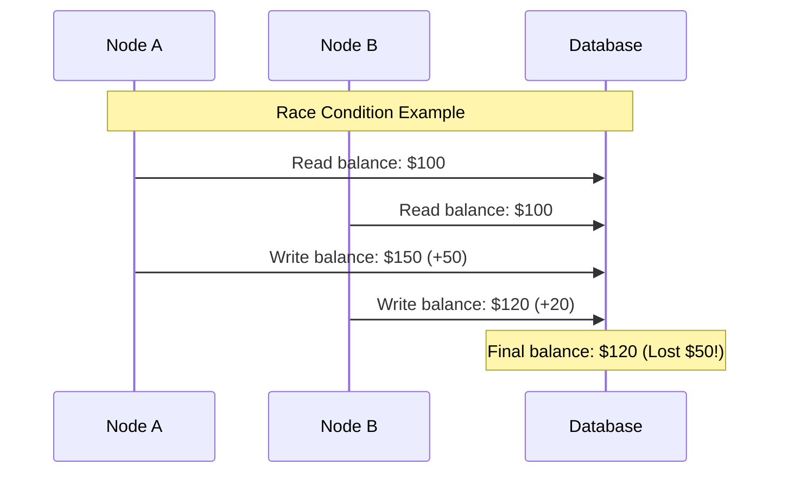
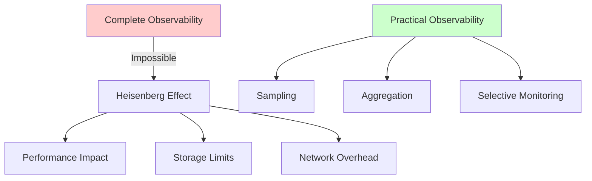
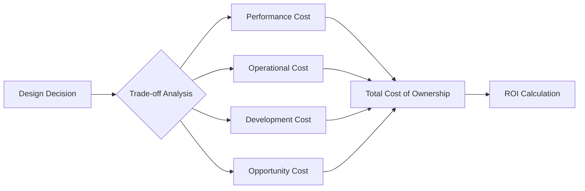
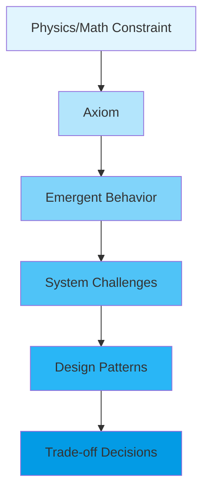
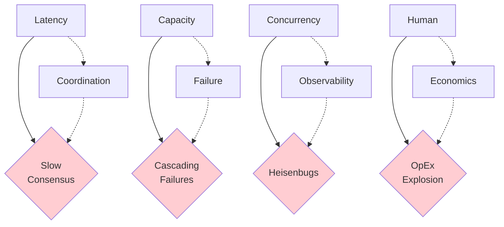

<!-- Navigation -->
[Home](../index.md) → [Part I: Axioms](index.md) → **Part I: The Eight Fundamental Axioms**

# Part I: The Eight Fundamental Axioms

## First Principles Foundation

> "All distributed systems behavior emerges from physical and mathematical constraints"

Before we discuss any patterns, algorithms, or architectures, we must understand the fundamental constraints that govern all distributed systems. These eight axioms are not design choices—they are **inescapable realities** derived from physics, mathematics, and human nature.

### Standing on the Shoulders of Giants

!!! info "The 8 Fallacies of Distributed Computing"
    In the 1990s, engineers at Sun Microsystems identified what developers wrongly assume:
    1. The network is reliable
    2. Latency is zero
    3. Bandwidth is infinite
    4. The network is secure
    5. Topology doesn't change
    6. There is one administrator
    7. Transport cost is zero
    8. The network is homogeneous

    **Our 8 Axioms flip these fallacies into positive principles** - instead of what not to assume, we teach what you must accept.

## The Eight Axioms

### Axiom 1: Latency (Speed of Light)
**Information cannot travel faster than the speed of light**  
Physics sets hard limits on communication speed. Every network hop adds unavoidable delay. This constraint shapes everything from data center placement to user experience design.

[Related: Work Distribution Pillar](../part2-pillars/work/index.md) | [Load Balancing Pattern](../patterns/load-balancing.md) | [Uber Location Case Study](../case-studies/uber-location.md)

!!! info "Quantitative Reality"
    - **Speed of light in fiber**: ~200,000 km/s (31% slower than vacuum)
    - **NYC ↔ London**: Minimum 28ms RTT (physics limit)
    - **Within datacenter**: 0.5ms RTT typical
    - **Same rack**: 0.05ms RTT
    
    Remember: [Latency Numbers Every Programmer Should Know](https://colin-scott.github.io/personal/volatile/latency.html)

[**→ Deep Dive into Latency**](axiom1-latency/index.md) | [**→ Try Latency Exercises**](axiom1-latency/exercises.md)

### Axiom 2: Finite Capacity  
**Every system has resource limits**  
CPU, memory, disk, and network bandwidth are finite. Capacity constraints create bottlenecks, force trade-offs, and drive architectural decisions.

[Related: State Distribution Pillar](../part2-pillars/state/index.md) | [Sharding Pattern](../patterns/sharding.md) | [Auto-Scaling Pattern](../patterns/auto-scaling.md)

!!! info "Fundamental Laws"
    **Little's Law**: L = λW
    - L = Average number of requests in system
    - λ = Average arrival rate
    - W = Average time in system
    
    This means: To handle 2x throughput, you must either:
    - Allow 2x more requests to queue, OR
    - Halve the processing time

[**→ Master Capacity Management**](axiom2-capacity/index.md) | [**→ Capacity Planning Exercises**](axiom2-capacity/exercises.md)

### Axiom 3: Inevitable Failure
**Components fail independently and unpredictably**  
Hardware fails, software crashes, networks partition. Failure is not an exception—it's the rule. Systems must embrace and design for failure.

[Related: Circuit Breaker Pattern](../patterns/circuit-breaker.md) | [Amazon DynamoDB Case Study](../case-studies/amazon-dynamo.md) | [Bulkhead Pattern](../patterns/bulkhead.md)

!!! warning "Failure Modes"
    **Fail-Stop**: Clean failures where components stop working entirely
    - Easier to detect and handle
    - What we usually design for
    
    **Byzantine Failures**: Components act arbitrarily or maliciously
    - Much harder to handle
    - Requires special consensus protocols (PBFT, etc.)
    
    Note: This compendium primarily addresses fail-stop failures. Byzantine fault tolerance adds another layer of complexity.

[**→ Build Resilient Systems**](axiom3-failure/index.md) | [**→ Failure Injection Lab**](axiom3-failure/exercises.md)

### Axiom 4: Concurrency Complexity
**Concurrent operations create race conditions**  
When multiple things happen at once, ordering becomes ambiguous. This fundamental uncertainty creates bugs that are hard to find and harder to fix.

[Related: Truth Distribution Pillar](../part2-pillars/truth/index.md) | [CQRS Pattern](../patterns/cqrs.md) | [Event Sourcing Pattern](../patterns/event-sourcing.md)

[**→ Manage Concurrent Systems**](axiom4-concurrency/index.md) | [**→ Race Condition Simulator**](axiom4-concurrency/exercises.md)

### Axiom 5: Coordination Costs
**Agreement requires communication**  
Getting distributed components to agree takes time and messages. The more nodes involved, the more expensive coordination becomes.

[Related: Truth Distribution Pillar](../part2-pillars/truth/index.md) | [Saga Pattern](../patterns/saga.md) | [PayPal Payments Case Study](../case-studies/paypal-payments.md)

!!! info "Theoretical Limits"
    **FLP Impossibility Result**: No deterministic consensus protocol can guarantee progress in an asynchronous system with even one faulty process.
    
    **CAP Theorem**: You can have at most 2 of:
    - Consistency
    - Availability  
    - Partition Tolerance

[**→ Understand Coordination**](axiom5-coordination/index.md) | [**→ Consensus Playground**](axiom5-coordination/exercises.md)

### Axiom 6: Limited Observability
**You cannot observe everything in a distributed system**  
Heisenberg's uncertainty principle applies: observation affects the system. Complete visibility is impossible; you must work with partial information.

[Related: Control Distribution Pillar](../part2-pillars/control/index.md) | [Observability Pattern](../patterns/observability.md) | [Service Mesh Pattern](../patterns/service-mesh.md)

[**→ Implement Observability**](axiom6-observability/index.md) | [**→ Build Monitoring Tools**](axiom6-observability/exercises.md)

### Axiom 7: Human Interface Constraints
**Humans operate the system**  
People have cognitive limits, make mistakes, and need sleep. The human interface is often the weakest link and must be designed carefully.

[Related: Control Distribution Pillar](../part2-pillars/control/index.md) | [Graceful Degradation Pattern](../patterns/graceful-degradation.md)

!!! quote "Human Factors Reality"
    **Miller's Law**: Humans can hold 7±2 items in working memory
    
    **Fitts's Law**: Time to click = a + b × log₂(distance/size + 1)
    
    **Error Rates**: Even experts make 1 error per 100-1000 actions

[**→ Design for Humans**](axiom7-human/index.md) | [**→ UX Design Workshop**](axiom7-human/exercises.md)

### Axiom 8: Economic Reality
**Everything has a cost**  
Resources cost money. Engineering time costs money. Downtime costs money. Every architectural decision is ultimately an economic decision.

[Related: Intelligence Distribution Pillar](../part2-pillars/intelligence/index.md) | [FinOps Pattern](../patterns/finops.md) | [Auto-Scaling Pattern](../patterns/auto-scaling.md)

[**→ Balance Economics**](axiom8-economics/index.md) | [**→ Cost Calculator**](axiom8-economics/exercises.md)

## Why Axioms Matter

Traditional education teaches distributed systems as a collection of solutions:
- "Use Raft for consensus"
- "Use consistent hashing for sharding"
- "Use vector clocks for ordering"

But **when do you use each?** Without understanding the underlying constraints, you're just pattern-matching rather than engineering.

### Industry Validation

!!! quote "Werner Vogels, CTO of Amazon"
    "Everything fails all the time. Build your systems accordingly."

!!! quote "Leslie Lamport, Turing Award Winner"
    "A distributed system is one in which the failure of a computer you didn't even know existed can render your own computer unusable."

These quotes capture why axioms matter - they acknowledge the fundamental realities we must design around.

## The Derivation Chain

Each axiom leads to emergent behaviors, which lead to design patterns:

## How to Read This Section

### For First-Time Readers
1. Read axioms 1-3 first (The Trinity: Latency, Capacity, Failure)
2. **Do the "Try This" exercises to internalize concepts** 
3. Read at least one failure story per axiom
4. Then proceed to remaining axioms

!!! tip "Interactive Learning Path"
    Each axiom includes:
    - 📖 **Concept explanation** with visual aids
    - 🧮 **Quantitative examples** with real numbers
    - 💻 **Hands-on exercises** to build intuition
    - 💥 **Failure stories** from production systems
    - 🎯 **Decision framework** for applying the axiom

### For Experienced Engineers
1. Skim axiom definitions
2. Focus on the derivations and counter-intuitive truths
3. Challenge our assertions—can you find exceptions?
4. Use decision trees for your current problems

### For Managers
1. Read axiom summaries and decision boxes
2. Focus on axioms 1, 3, 7, and 8
3. Study the failure stories—they're your cautionary tales
4. Use cost models for architecture decisions

## The Axiom Interaction Matrix

Axioms don't exist in isolation. They interact and compound:

| Interaction | Result | Real Example |
|------------|---------|-------------|
| Latency × Coordination | Slow agreement protocols | Blockchain consensus taking minutes |
| Capacity × Failure | Resource exhaustion cascades | 2017 AWS S3 outage from overload |
| Concurrency × Observability | Heisenbugs | Race conditions that disappear when logged |
| Human × Economics | Operational cost explosion | Netflix spending $1B+ on AWS annually |

### Visual: Axiom Interactions

### The Compounding Effect

!!! danger "Axiom Violations Compound Exponentially"
    - Violate 1 axiom: System degrades gracefully
    - Violate 2 axioms: System becomes unreliable
    - Violate 3+ axioms: System fails catastrophically

    **Example**: Knight Capital's $440M loss in 45 minutes violated:
    - Axiom 3 (Failure): No rollback plan
    - Axiom 4 (Concurrency): Race condition in deployment
    - Axiom 7 (Human): Confusing deployment process

## Exercises Hub

!!! success "Master Each Axiom Through Practice"
    Each axiom has a dedicated exercise section:
    
    1. **[Latency Calculator](axiom1-latency/exercises.md)** - Predict RTT for global systems
    2. **[Capacity Planner](axiom2-capacity/exercises.md)** - Apply Little's Law  
    3. **[Failure Simulator](axiom3-failure/exercises.md)** - Design for failure modes
    4. **[Race Detector](axiom4-concurrency/exercises.md)** - Find concurrency bugs
    5. **[Consensus Playground](axiom5-coordination/exercises.md)** - Implement Raft/Paxos
    6. **[Monitoring Lab](axiom6-observability/exercises.md)** - Build observability
    7. **[UX Workshop](axiom7-human/exercises.md)** - Design human interfaces
    8. **[Cost Calculator](axiom8-economics/exercises.md)** - Optimize economics

## Get Started

Ready to understand why your distributed system behaves the way it does?

[**→ Begin with Axiom 1: Latency**](axiom1-latency/index.md)

---

*"To violate an axiom is not to break a rule—it is to break your system."*

---

## 🔗 Quick Navigation

### Related Pillars
- [Work Distribution](../part2-pillars/work/index.md) - How axioms shape computation distribution
- [State Distribution](../part2-pillars/state/index.md) - Managing data within axiom constraints
- [Truth Distribution](../part2-pillars/truth/index.md) - Achieving consensus despite axioms
- [Control Distribution](../part2-pillars/control/index.md) - Operating systems that respect axioms
- [Intelligence Distribution](../part2-pillars/intelligence/index.md) - Adaptive systems built on axioms

### Related Patterns
- [Circuit Breaker](../patterns/circuit-breaker.md) - Handling the Failure axiom
- [CQRS](../patterns/cqrs.md) - Managing Concurrency complexity
- [Saga Pattern](../patterns/saga.md) - Working with Coordination costs
- [Load Balancing](../patterns/load-balancing.md) - Dealing with Latency and Capacity
- [Auto-Scaling](../patterns/auto-scaling.md) - Responding to Economic reality

### Case Studies Demonstrating Axioms
- [Uber Location System](../case-studies/uber-location.md) - Latency and Coordination in practice
- [Amazon DynamoDB](../case-studies/amazon-dynamo.md) - Failure and Consistency trade-offs
- [PayPal Payments](../case-studies/paypal-payments.md) - Coordination and Truth at scale
- [Spotify Recommendations](../case-studies/spotify-recommendations.md) - Intelligence emerging from axioms

---

**Next**: [Axiom 1: Latency - The Speed of Light Constraint](axiom1-latency/index.md)