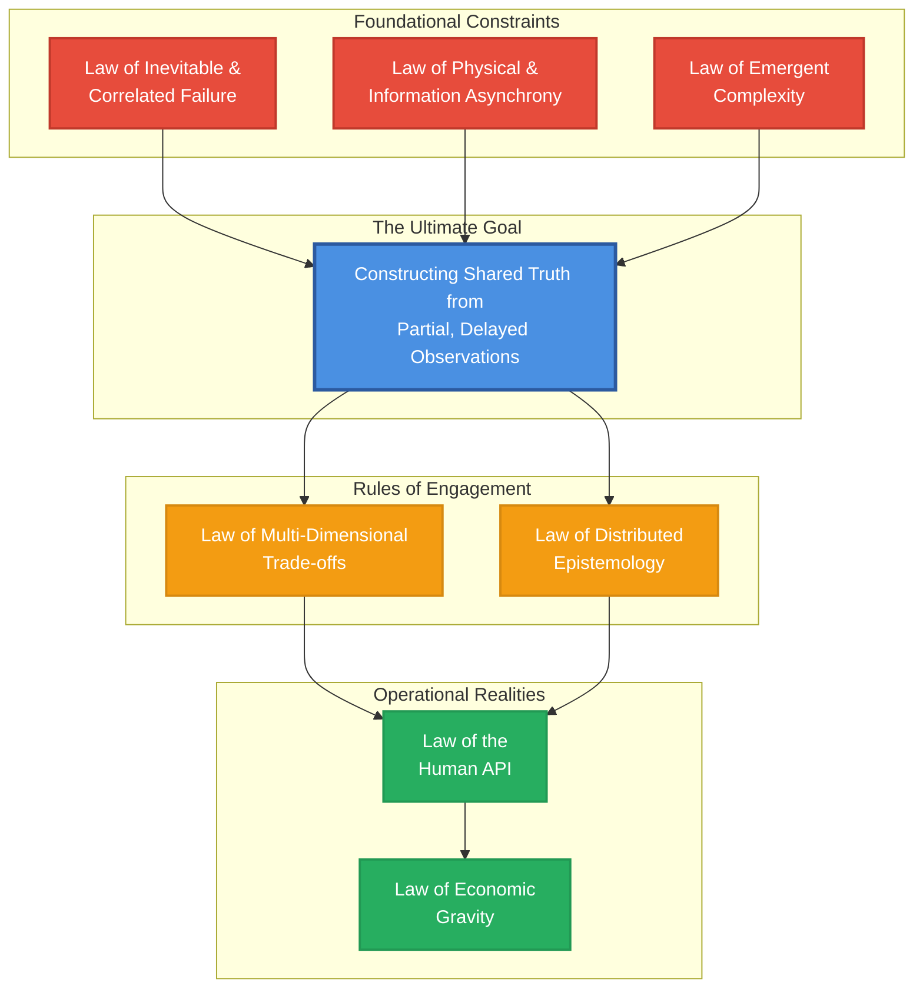
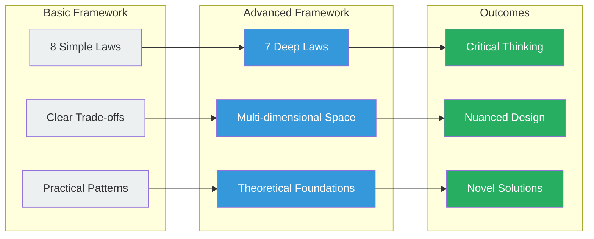

# Part I: An Advanced Law-Based Framework for Distributed Systems
## Bridging Theory and Practice Through Fundamental Laws

> "The previous law-based framework serves as a valuable introduction, making the core challenges of distributed systems approachable. However, this simplification, while useful, elides the profound complexity and nuance that defines the field."

This advanced framework refactors the original laws to be more precise, acknowledges their limitations, and introduces new principles derived from information theory, complexity science, and epistemology. It is designed not to provide easy answers, but to foster a more rigorous and critical mode of thinking about distributed systems engineering.

## The Core Challenge: Bringing Order to Chaos

## Part 1: The Foundational Constraints

These laws represent the most fundamental, irreducible laws governing distributed systems. They are not analogies; they are direct consequences of physics, mathematics, and logic.

### Law 1: The Law of Correlated Failure ⛓️
> Components fail. Most catastrophically, they fail together.

!!! danger "Beyond Fail-Stop vs Byzantine"
    The traditional dichotomy is just the beginning. Real-world failure models include:
    - **Correlated Failures**: Shared dependencies create mass impact (AWS S3 2017)
    - **Gray Failures**: Performance degradation without clean crashes
    - **Metastable Failures**: Stable under low load, catastrophic above threshold
    - **Cascading Failures**: One failure triggers a chain reaction

**Core Implication**: Designing for *independent* failure is the minimum. Designing for *correlated* failure creates truly robust systems.

**Theoretical Foundation**: Dependency graph analysis and shared fate modeling, not simple probabilistic independence.

[**→ Deep Dive into Failure Models**](axiom1-failure/index.md) | [**→ Failure Injection Lab**](axiom1-failure/exercises.md)

### Law 2: The Law of Asynchronous Reality ⏳
> Information travels at finite speed. Therefore, the present is unknowable.

!!! info "Latency is Not a Single Number"
    - **Queuing Theory**: Little's Law ($L = \lambda W$) proves latency must increase with load
    - **Percentiles Matter**: p50 is misleading; p99.9 defines user experience
    - **Information Theory**: Shannon's Theorem sets hard limits on error-free transmission
    - **Temporal Logic**: Lamport's happens-before provides formal reasoning about partial ordering

**Core Implication**: You cannot know the current state of a remote node. Any information is from the past.

**Theoretical Foundation**: FLP Impossibility is a direct mathematical consequence of asynchrony.

[**→ Master Asynchrony & Time**](axiom2-asynchrony/index.md) | [**→ Temporal Logic Exercises**](axiom2-asynchrony/exercises.md)

### Law 3: The Law of Emergent Chaos 🌪️
> At scale, systems exhibit behaviors that cannot be predicted from their components.

!!! warning "Complexity Theory in Action"
    - **Phase Transitions**: Smooth operation to abrupt collapse at thresholds
    - **Self-Organized Criticality**: Systems evolve to states where small faults trigger avalanches
    - **State Space Explosion**: Exponential growth makes exhaustive testing impossible
    - **Non-linear Dynamics**: Feedback loops and tipping points only manifest at scale

**Core Implication**: Component testing cannot predict production behavior. This justifies Chaos Engineering.

**Theoretical Foundation**: Complex adaptive systems theory and non-linear dynamics.

[**→ Navigate Emergent Behavior**](axiom3-emergence/index.md) | [**→ Chaos Engineering Lab**](axiom3-emergence/exercises.md)

## Part 2: The Rules of Engagement

Given the foundational constraints, we must design systems according to rules that govern coordination, trade-offs, and knowledge itself.

### Law 4: The Law of Multidimensional Optimization ⚖️
> System design is not choosing two of three. It's finding acceptable points in an n-dimensional space of trade-offs.

!!! example "Beyond CAP and PACELC"
    The real trade-off space includes:
    - **Consistency** vs **Availability** vs **Latency** (traditional)
    - **Cost** vs **Complexity** vs **Operability** (often dominant)
    - **Throughput** vs **Correctness** vs **Resource Usage**
    - **Security** vs **Performance** vs **Usability**
    
    **Harvest and Yield Model**: More nuanced than binary availability
    - **Yield**: Percentage of requests completed
    - **Harvest**: Percentage of data returned

**Core Implication**: The goal isn't to "pick two" but to find an acceptable point in a complex, non-linear solution space.

**Theoretical Foundation**: Multi-objective optimization and game theory for multi-tenant systems.

[**→ Navigate Trade-off Space**](axiom4-tradeoffs/index.md) | [**→ Trade-off Analysis Tools**](axiom4-tradeoffs/exercises.md)

### Law 5: The Law of Distributed Knowledge 🧠
> In distributed systems, truth is local, knowledge is partial, and certainty is expensive.

!!! info "Levels of Distributed Knowledge"
    1. **Belief**: A node's local state (potentially incorrect)
    2. **Knowledge**: Justified true belief (requires verification)
    3. **Common Knowledge**: Everyone knows that everyone knows (very expensive)
    4. **Probabilistic Knowledge**: "Probably correct" (Bloom filters, HyperLogLog)

**Core Implication**: There is no single "truth" or "now"—only individual nodes with internally consistent but globally inconsistent views.

**Theoretical Foundation**: Byzantine Generals' Problem as epistemological puzzle; formal logics of knowledge and belief.

[**→ Reason About Knowledge**](axiom5-epistemology/index.md) | [**→ Consensus Protocols Lab**](axiom5-epistemology/exercises.md)

## Part 3: The Operational Realities

These laws ground the framework in the pragmatic concerns of building, running, and paying for these systems.

### Law 6: The Law of Cognitive Load 🤯
> A system's complexity must fit within human cognitive limits, or it will fail through misoperation.

!!! success "Beyond Generic Human Fallibility"
    - **Cognitive Load**: Different consistency models impose different mental burdens
    - **Mental Models**: Success depends on accuracy of operator's mental model
    - **Error Design**: `"Connection failed"` vs `"[Service A]: Failed write quorum (2/3 nodes); reading stale replica 'us-east-1b'"`
    - **Observability as UI**: Dashboards shape understanding and decisions

**Core Implication**: A theoretically brilliant system impossible to debug is a failed design.

**Practical Impact**: Elevates UX principles to architectural imperatives for internal tooling.

[**→ Design Human Interfaces**](axiom6-human-api/index.md) | [**→ Operator Experience Lab**](axiom6-human-api/exercises.md)

### Law 7: The Law of Economic Reality 💰
> Every architectural decision is ultimately a financial decision.

!!! quote "The Ultimate Constraint"
    "The purpose of architecture is to maximize business value delivery within a finite economic envelope."

**Key Concepts**:
- **Total Cost of Ownership (TCO)**: CapEx + OpEx + Opportunity Cost
- **Build vs Buy**: Trading money for speed and reduced operational load
- **Performance per Dollar**: Not just performance in absolute terms
- **Economic Modeling**: Direct link between architectural choices and balance sheet

**Core Implication**: Every joule, cycle, byte, and hour has a cost that must be justified.

[**→ Economic Architecture**](axiom7-economics/index.md) | [**→ Cost Modeling Tools**](axiom7-economics/exercises.md)

## Hidden Assumptions and Biases

!!! warning "This Framework's Limitations"
    **Infrastructure Bias**: 
    - Assumes traditional client-server/microservice architectures
    - Less applicable to edge computing, mobile, or IoT
    
    **Communication Bias**: 
    - Examples imply synchronous RPC-style communication
    - Alternative paradigms (Actor Model, Stream Processing) have different constraints
    
    **Paradigm Bias**: 
    - Limited coverage of emerging models like CRDTs
    - Assumes coordination-based consistency rather than coordination-free approaches
    
    **Scale Bias**:
    - Optimized for "web-scale" systems
    - May over-engineer for smaller deployments

By acknowledging these limitations, we know when to seek different models for different problems.

## The Evolution from Basic to Advanced Understanding

## How to Use This Advanced Framework

### For Senior Engineers
1. Use it to question assumptions in existing systems
2. Apply multi-dimensional trade-off analysis to architecture decisions
3. Design experiments to uncover emergent behaviors
4. Build better human APIs for your systems

### For Architects
1. Move beyond CAP to full trade-off space analysis
2. Model economic impact of architectural choices
3. Design for correlated failures, not just independent ones
4. Consider epistemological questions in API design

### For Researchers
1. Explore the gaps and biases acknowledged here
2. Develop new consistency models for edge cases
3. Formalize the relationship between cognitive load and system design
4. Bridge theory and practice with empirical studies

## Get Started

Ready to move beyond simplifications and engage with the full complexity of distributed systems?

[**→ Begin with the Law of Failure**](axiom1-failure/index.md)

---

*"The goal is not to have a single, universal theory, but a well-equipped toolbox of critical thinking models."*