# The 7 Laws: Interaction Map

!!! abstract "Law Synergies"
    🎯 **Understanding how laws interact is key to mastering distributed systems**

## Master Interaction Diagram

## Law Interaction Matrix

| Law A | Law B | Interaction | Real-World Example |
|-------|-------|-------------|-------------------|
| **L1: Failure** | **L2: Asynchrony** | Can't detect failures instantly | Split-brain scenarios |
| **L1: Failure** | **L5: Knowledge** | Failures create knowledge gaps | Stale data during outages |
| **L2: Asynchrony** | **L3: Emergence** | Timing creates chaos | Race conditions |
| **L2: Asynchrony** | **L5: Knowledge** | Can't have synchronized truth | Eventual consistency |
| **L3: Emergence** | **L6: Cognitive** | Emergent behavior confuses humans | Cascading failures |
| **L4: Trade-offs** | **L7: Economics** | Every choice has a price | CAP theorem costs |
| **L6: Cognitive** | **L7: Economics** | Human expertise is expensive | DevOps salary costs |

## Compound Effects

### The Failure Cascade (L1 + L2 + L3)

### The Knowledge Gap (L2 + L5 + L6)

```mermaid
graph LR
    subgraph "What Each Node Knows"
        N1[Node 1<br/>Value: A<br/>Version: 10]
        N2[Node 2<br/>Value: B<br/>Version: 11]
        N3[Node 3<br/>Value: A<br/>Version: 12]
    end
    
    subgraph "Human Understanding"
        H[DevOps Engineer<br/>❓ Which is correct?<br/>🤯 Cognitive overload]
    end
    
    N1 -.->|"L2: Async updates"| H
    N2 -.->|"L5: No single truth"| H
    N3 -.->|"L6: Too complex"| H
    
    style H fill:#ffcdd2
```

## Law Reinforcement Patterns

### Positive Reinforcement Loops

| Loop | Laws Involved | Effect | Example |
|------|---------------|--------|---------|
| **Failure Amplification** | L1→L3→L1 | Small failures become large | AWS cascading outage |
| **Complexity Spiral** | L3→L6→L7→L3 | System becomes unmaintainable | Legacy microservices |
| **Knowledge Decay** | L5→L2→L5 | Truth becomes harder to find | Split-brain scenarios |

### Breaking the Loops

## Pattern Recommendations by Law Combinations

| Law Combination | Problem Created | Pattern Solution |
|-----------------|-----------------|------------------|
| **L1 + L2** | Can't detect correlated failures quickly | Circuit Breaker + Health Checks |
| **L2 + L5** | Inconsistent state across nodes | Vector Clocks + CRDTs |
| **L3 + L6** | Too complex to understand | Observability + Automation |
| **L4 + L7** | Every solution costs too much | Caching + CDN |
| **L1 + L3 + L5** | Cascading failures with no truth | Event Sourcing + Saga |

## The Ultimate Insight

!!! abstract "Key Takeaway"
    **You can't eliminate the laws - you can only manage their interactions**
    
    The art of distributed systems is choosing which law violations you can live with and implementing patterns to manage the consequences.

## Quick Reference: Law Interactions

### Most Dangerous Combinations
1. **L1 + L2 + L3** = Undetectable cascading failures
2. **L2 + L5 + L6** = Impossible to debug problems
3. **L3 + L6 + L7** = Exponentially expensive complexity

### Most Manageable Combinations
1. **L4 + L7** = Clear cost/benefit trade-offs
2. **L1 + L4** = Predictable failure/reliability trade-offs
3. **L5 + L6** = Solvable with good tooling

---

[← The 7 Laws](part1-axioms) | [Law 1: Correlated Failure →](part1-axioms/law1-failure/index)