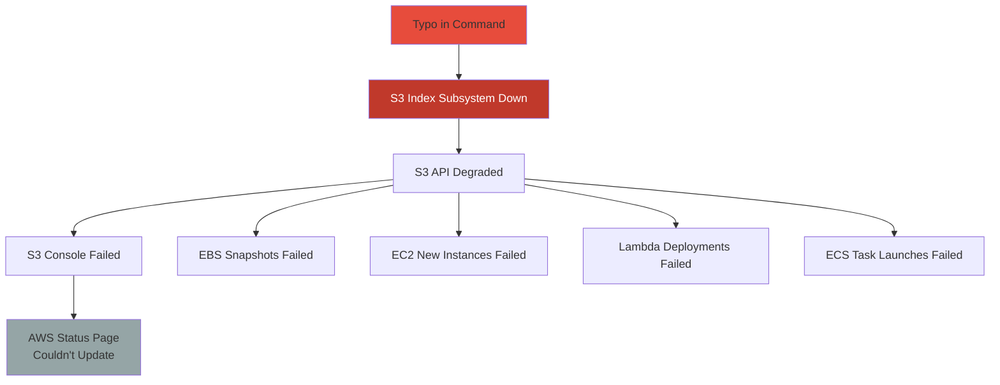
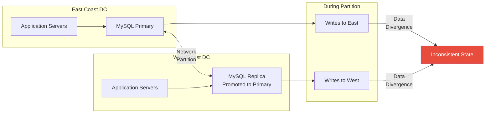
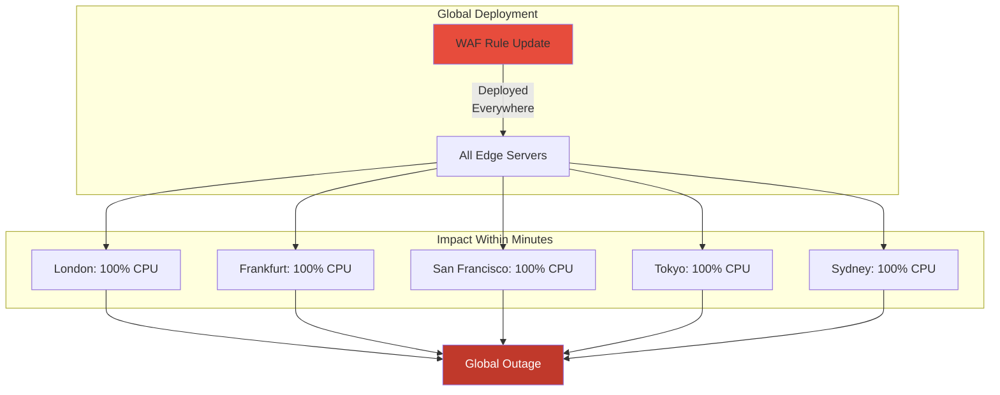
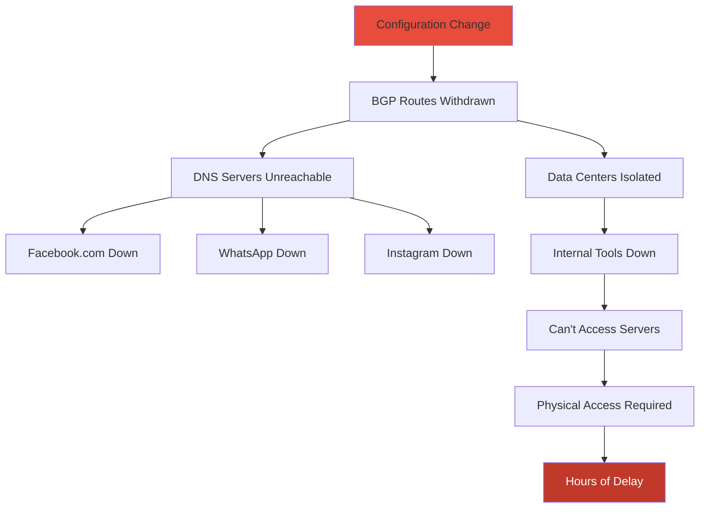
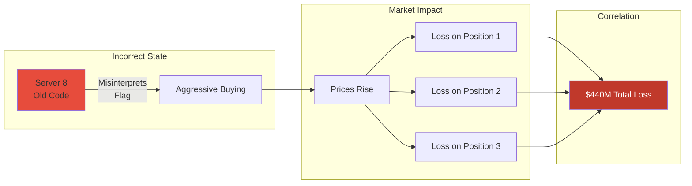

# Real-World Correlated Failures: Case Studies and Lessons

## Case Study 1: The AWS S3 Outage (February 28, 2017)

### What Happened
A simple typo during routine maintenance caused one of the largest cloud outages in history.

```bash
# The infamous command (simplified)
$ aws s3api delete-objects --bucket index-subsystem --delete "Objects=[{Key=server-*}]"
# Typo: Included more servers than intended
```

### The Correlation Cascade



### Correlation Analysis
- **Shared Dependency**: S3 was a hidden dependency for many AWS services
- **Failure Type**: Cascading failure triggered by human error
- **Blast Radius**: Affected thousands of companies, estimated $150M in losses
- **Recovery Time**: 4+ hours

### Lessons Learned
1. **Hidden Dependencies**: Services thought to be independent weren't
2. **Tooling Safeguards**: Dangerous commands need better validation
3. **Status Page Irony**: Status page itself depended on the failed service
4. **Playbook Gaps**: Recovery procedures assumed smaller-scale failures

## Case Study 2: GitHub's October 2018 Outage

### What Happened
A network partition between data centers triggered a split-brain scenario, leading to data inconsistency.

### Timeline
```
21:52 UTC - Network partition begins
21:53 UTC - MySQL cluster enters split-brain
21:54 UTC - Writes continue to both sides
22:11 UTC - Partition heals, inconsistency detected
22:13 UTC - Decision: Full stop to prevent data corruption
23:02 UTC - Begin 24+ hour recovery process
```

### The Correlation Pattern


### Correlation Factors
- **Geographic Correlation**: Cross-DC network dependency
- **Protocol Weakness**: MySQL replication not designed for split-brain
- **Recovery Correlation**: Fixing one DC required stopping both

### Key Insight
> "The very mechanism designed for availability (replication) became the cause of unavailability"

## Case Study 3: Cloudflare's Global Outage (July 2, 2019)

### What Happened
A regular expression with catastrophic backtracking was deployed globally, causing CPU exhaustion.

### The Bad Regex
```javascript
// Simplified version of the problematic regex
/.*(?:.*=.*)/

// Why it's bad: Catastrophic backtracking
// Input: "x=x=x=x=x=x=x=x=x=x=x=x=x=x=x"
// Complexity: O(2^n) - exponential!
```

### Correlation Mechanism


### Why It Correlated Globally
1. **Synchronized Deployment**: All servers updated within same minute
2. **No Gradual Rollout**: Went from 0% to 100% instantly
3. **No Circuit Breaker**: CPU exhaustion prevented rollback
4. **Same Code Path**: Every request hit the bad regex

### Lessons
- **Test Regex Complexity**: O(2^n) algorithms are bombs
- **Stagger Global Rollouts**: Even by seconds
- **CPU Limits**: Prevent single rule from consuming all CPU
- **Automatic Rollback**: Based on performance metrics

## Case Study 4: Facebook's BGP Outage (October 4, 2021)

### What Happened
A configuration change accidentally withdrew Facebook's BGP routes, making their entire infrastructure unreachable.

### The Cascade of Correlation


### Correlation Amplifiers
1. **DNS Dependency**: All services used same DNS infrastructure
2. **Tool Dependency**: Recovery tools required the network that was down
3. **Physical Security**: Badge systems were also network-dependent
4. **Knowledge Correlation**: Few people knew physical recovery procedures

### The Irony
> "The tools needed to fix the network required the network to be working"

## Case Study 5: Knight Capital's Trading Disaster (August 1, 2012)

### What Happened
A failed deployment left old code active on one server, causing $440 million in losses in 45 minutes.

### The Deployment Correlation
```python
# Simplified representation
servers = ['srv1', 'srv2', 'srv3', 'srv4', 'srv5', 'srv6', 'srv7', 'srv8']

# Deployment script
for server in servers:
    deploy_new_code(server)
    # Manual process, srv8 was missed
    
# Result: 7 servers with new code, 1 with old code
# Old code reused a flag that meant something different in new code
```

### Why It Correlated Financially


### Lessons
1. **Deployment Verification**: Never assume deployment succeeded
2. **Flag Reuse**: Dangerous across versions
3. **Circuit Breakers**: Should have stopped after $1M loss, not $440M
4. **Rollback Speed**: 45 minutes to stop = bankruptcy

## Common Patterns Across All Cases

### 1. The Shared Dependency Pattern
Every major outage involved a dependency that was more shared than realized:
- S3 → Hidden dependency of AWS services
- BGP → Single point of failure for all Facebook properties
- WAF rules → Deployed globally with no isolation

### 2. The Tool Dependency Pattern
Recovery tools depending on the systems they're meant to fix:
- AWS status page needed S3
- Facebook's admin tools needed the network
- GitHub's restore process needed both DCs

### 3. The Human Factor Pattern
Human actions triggered correlation:
- AWS: Typo in command
- Knight: Missed server in deployment
- Cloudflare: Didn't test regex performance

### 4. The Time Correlation Pattern
Many failures correlate in time:
- Synchronized deployments
- Certificate expiries
- Leap seconds / DST changes

## Designing for Anti-Correlation

Based on these cases, key strategies emerge:

### 1. Dependency Mapping
```yaml
critical_dependencies:
  - service: authentication
    depends_on: [user_db, redis]
    shared_with: [95% of services]  # Red flag!
    mitigation: "Create isolated auth cells"
```

### 2. Staggered Everything
```python
def deploy_globally(regions):
    for i, region in enumerate(regions):
        deploy_to_region(region)
        wait_time = exponential_backoff(i)
        monitor_metrics(wait_time)
        if degradation_detected():
            rollback_all()
            break
```

### 3. Correlation Monitoring
```sql
-- Alert on correlation spikes
SELECT 
    service_a, service_b,
    CORR(error_rate_a, error_rate_b) as correlation
FROM service_metrics
WHERE correlation > 0.9
AND time > NOW() - INTERVAL '5 minutes'
```

## The Meta Lesson

> "Every system has hidden correlations. The difference between a minor incident and a major outage is whether you've found them first."

These cases teach us that:
1. Independence is an illusion we maintain until it fails
2. The biggest correlations are often in the recovery path
3. Human systems and technical systems correlate
4. Testing for correlation requires imagination beyond traditional failure scenarios

[**← Back to Law of Failure**](index.md) | [**→ To Exercises**](./exercises.md)