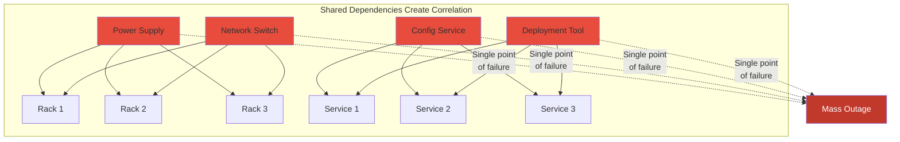
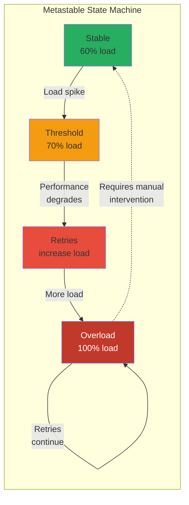
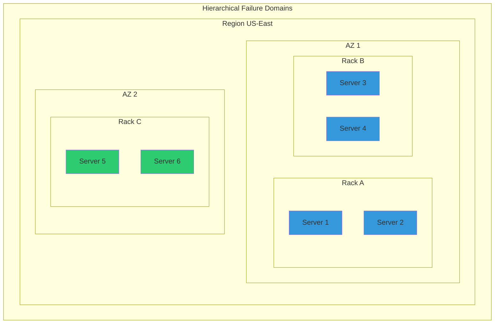
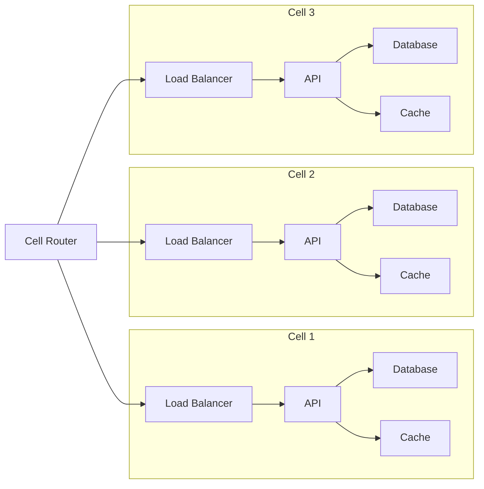

# Law 1: The Law of Inevitable and Correlated Failure

> "Any component can fail, and failures are often correlated, not independent."

## The Naïve Model vs Reality

### What We're Taught: Independent Failure
Traditional distributed systems education begins with a simple probabilistic model:
- If a server has 99.9% uptime, it fails 0.1% of the time
- With 3 independent replicas, the probability of all failing is 0.001³ = 10⁻⁹
- Therefore, we've achieved "nine nines" of reliability!

### The Reality: Correlated Failure Dominates
This calculation is dangerously wrong because it assumes independence. In reality:



## A Taxonomy of Real-World Failure Modes

### 1. Correlated Hardware Failures
**Definition**: Multiple components fail simultaneously due to shared physical dependencies.

**Examples**:
- **Power**: UPS failure takes down entire rack (GitHub, 2018)
- **Cooling**: HVAC failure causes thermal shutdown of data center zone
- **Network**: Core switch failure isolates entire availability zone
- **Geographic**: Natural disaster affects entire region

**Key Insight**: Physical proximity creates correlation. "Availability zones" exist precisely to break these correlations.

### 2. Gray Failures
**Definition**: The system doesn't crash cleanly but suffers severe performance degradation.

**Characteristics**:
- Appears healthy to monitoring (heartbeats succeed)
- Actual performance makes system unusable
- Often caused by resource exhaustion or contention
- Harder to detect than crash failures

**Example**: Disk reaching 100% causes massive slowdown but not failure. Health checks pass, but queries timeout.

```python
# Gray failure example
def health_check():
    return "OK"  # Passes!

def process_request():
    # Takes 30 seconds instead of 30ms due to disk contention
    with open('/full/disk/file.log', 'a') as f:
        f.write(data)  # Extremely slow but eventually succeeds
```

### 3. Metastable Failures
**Definition**: System stable at low load but enters persistent failure state above a threshold.

**The Metastability Pattern**:
1. System operates normally at 60% load
2. Small spike pushes to 70% load
3. Performance degrades, causing retries
4. Retries push load to 90%
5. More degradation, more retries
6. System stuck at 100% load even after initial spike subsides



**Real Example**: Facebook's 2019 outage caused by cascading cache misses creating a retry storm.

### 4. Cascading Failures
**Definition**: One component's failure triggers failures in dependent components.

**Common Patterns**:
1. **Thundering Herd**: Cache fails → all requests hit database → database fails
2. **Retry Storms**: Service A fails → Service B retries → overwhelms Service A further
3. **Circuit Breaker Cascade**: One service triggers circuit breakers → appears as failure to dependents

### 5. Software Correlation Failures
**Definition**: Shared software creates simultaneous failures across "independent" systems.

**Examples**:
- **Bug in common library**: Affects all services using it
- **Configuration push**: Bad config deployed everywhere at once
- **Time-based bugs**: Leap second bugs, Y2K-style issues
- **Certificate expiry**: All services using same cert fail together

**Case Study - Cloudflare 2019**:
```yaml
# Bad regex deployed globally
pattern: ".*(?:.*=.*)"  # Catastrophic backtracking
# Result: CPU exhaustion across all edge servers worldwide
```

## Beyond Traditional Fault Tolerance

### Failure Domains and Blast Radius

**Definition**: A failure domain is a set of components that share fate.



**Design Principles**:
1. **Identify all failure domains**: Power, network, software, configuration, human
2. **Minimize blast radius**: Limit impact of any single failure
3. **Create anti-correlation**: Ensure replicas are in different failure domains
4. **Test domain assumptions**: Validate independence through chaos engineering

### Dependency Analysis and Shared Fate

**The Dependency Graph Method**:
1. Map all dependencies (explicit and implicit)
2. Identify shared dependencies
3. Calculate correlation coefficients
4. Design to minimize correlation

```python
def analyze_failure_correlation(services):
    """Calculate correlation in failure probability"""
    dependency_graph = build_dependency_graph(services)
    shared_deps = find_shared_dependencies(dependency_graph)
    
    correlation_matrix = {}
    for s1, s2 in combinations(services, 2):
        shared = shared_deps.get((s1, s2), [])
        # Correlation increases with shared dependencies
        correlation = len(shared) / max(
            len(dependency_graph[s1]), 
            len(dependency_graph[s2])
        )
        correlation_matrix[(s1, s2)] = correlation
    
    return correlation_matrix
```

## Designing for Correlated Failure

### 1. Cellular Architecture
Divide system into isolated cells that fail independently:



### 2. Bulkheads and Isolation
Prevent failure propagation between components:

```java
// Thread pool isolation example
class BulkheadService {
    // Separate thread pools for different operations
    private final ExecutorService criticalPool = 
        Executors.newFixedThreadPool(50);
    private final ExecutorService analyticsPool = 
        Executors.newFixedThreadPool(10);
    
    public CompletableFuture<Response> handleCritical(Request req) {
        return CompletableFuture.supplyAsync(
            () -> processCritical(req), 
            criticalPool  // Isolated from analytics
        );
    }
}
```

### 3. Progressive Rollout and Canary Deployments
Limit correlation from software changes:

```yaml
deployment_strategy:
  stages:
    - name: "Canary"
      percentage: 1
      duration: "10m"
      rollback_on_error: true
    - name: "Early Adopters"  
      percentage: 10
      duration: "1h"
      rollback_on_error: true
    - name: "Half"
      percentage: 50
      duration: "2h"
      rollback_on_error: false  # Manual decision
    - name: "Full"
      percentage: 100
```

## Theoretical Foundations

### Percolation Theory
Network failures can be modeled using percolation theory:
- Below critical threshold: failures remain isolated
- Above threshold: failures percolate through entire system
- Design goal: Stay below percolation threshold

### Common Mode Analysis
Borrowed from safety engineering:
1. Identify all common modes of failure
2. Calculate probability of common mode vs independent
3. Design diversity to reduce common mode probability

## Practical Implications

### Testing for Correlation
```python
# Chaos engineering experiment
def test_correlated_failure():
    # Don't just fail random instances
    # Fail entire racks, AZs, or regions
    failure_scenarios = [
        fail_entire_rack("rack-42"),
        fail_availability_zone("us-east-1a"),
        corrupt_shared_config("service-mesh-config"),
        introduce_clock_skew("ntp-server-1"),
        exhaust_shared_resource("connection-pool")
    ]
    
    for scenario in failure_scenarios:
        impact = measure_system_impact(scenario)
        assert impact.customer_impact < SLA_THRESHOLD
```

### Monitoring for Correlation
Track correlation metrics, not just individual component health:

```sql
-- Correlation detection query
SELECT 
    s1.service_name,
    s2.service_name,
    CORR(s1.error_rate, s2.error_rate) OVER (
        ORDER BY timestamp 
        RANGE BETWEEN INTERVAL '5 minutes' PRECEDING 
        AND CURRENT ROW
    ) as error_correlation
FROM service_metrics s1
JOIN service_metrics s2 
    ON s1.timestamp = s2.timestamp
WHERE correlation > 0.8  -- High correlation threshold
```

## The Ultimate Lesson

> "The question is not whether a component will fail, but which components will fail together."

Robust distributed systems aren't built by assuming independence—they're built by identifying and breaking correlations. Every shared dependency is a potential correlation. Every correlation is a single point of failure waiting to happen.

## Further Reading

- "Why Do Computers Stop and What Can Be Done About It?" - Jim Gray
- "The Network is Reliable" - Peter Bailis and Kyle Kingsbury
- "Metastable Failures in Distributed Systems" - Bronson et al.

[**← Back to Framework**](../index.md) | [**→ Next: Law of Asynchrony**](../axiom2-asynchrony/index.md)