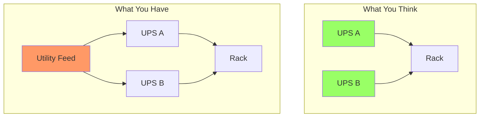

# Law 1: The Law of Inevitable and Correlated Failure ⚡

[Home](/) > [The 7 Laws](part1-axioms) > [Law 1: Correlated Failure](part1-axioms/law1-failure/index) > Deep Dive

## Core Principle

!!! abstract "The Fundamental Truth"
    **Any component can and will fail, and failures rarely happen in isolation.** Hidden shared dependencies, human errors, and synchronized events create correlated failures that amplify impact far beyond what independent failure models predict.

## Real-World Case Studies

| Incident | Year | Root Cause | Impact | Key Lesson |
|----------|------|------------|--------|------------|
| **AWS US-East Network Failure** | 2011 | Network config change triggered EBS re-mirroring storm | 4-day outage, hundreds of sites down | Shared control plane creates hidden correlations |
| **AWS S3 Outage** | 2017 | Typo in removal command (`aws s3 rm`) | 4-hour outage, $150M+ losses | Need blast radius limits and validation tooling |
| **GitHub MySQL Split-Brain** | 2018 | Cross-data-center network partition | 24-hour service degradation | Replication designed for availability can undermine it |
| **Cloudflare Regex Outage** | 2019 | Catastrophic regex deployed globally | 27-minute global outage | Synchronized deployments amplify single errors |
| **Facebook BGP Withdrawal** | 2021 | Misconfigured BGP update | 6-hour global outage | Recovery tools can't depend on the failed system |
| **Knight Capital Trading** | 2012 | Incomplete deploy left old code active | $440M loss in 45 minutes | Version mismatches + no circuit breakers = bankruptcy |

## Common Correlation Patterns

### 🔗 Hidden Dependencies
- **Shared Infrastructure**: Power, cooling, network switches that seem independent
- **Control Planes**: Metadata services, orchestrators, DNS becoming single points of failure  
- **Tool Dependencies**: Recovery systems requiring the broken infrastructure
- **Human Systems**: Single on-call, shared runbooks, same training

### ⏰ Time Correlations
- **Synchronized Actions**: Deployments, certificate renewals, cron jobs
- **Thundering Herds**: Cache expiry, reconnection storms, retry amplification
- **Maintenance Windows**: "Routine" changes triggering unexpected interactions

### 🧠 Human Factors
- **Procedural Gaps**: Missed steps, typos, incomplete deployments
- **Knowledge Silos**: Few people understanding critical recovery paths
- **Pressure Cascades**: Rushed fixes creating new failures

## Strategies for Breaking Correlations

### 1. Cell-Based Architecture
Divide infrastructure into independent cells that fail in isolation:
```
Traditional: 10,000 servers → 1 failure affects all
Cell-based: 100 cells × 100 servers → 1 failure affects 1%
```

### 2. Shuffle Sharding  
Assign clients to random server subsets to minimize overlap:
```
Client A → Servers [3, 17, 42, 67, 91]
Client B → Servers [8, 23, 55, 71, 94]
Overlap: < 2% vs 100% in traditional model
```

### 3. Deployment Strategies
- **Canary Releases**: Test on 1% before 100%
- **Wave Deployments**: Roll out with exponential delays
- **Feature Flags**: Decouple deploy from activation
- **Automatic Rollback**: Trigger on error rate spikes

### 4. Correlation Monitoring
Real-time detection of emerging correlations:
```sql
SELECT service_a, service_b, 
       CORR(error_rate_a, error_rate_b) as correlation
FROM service_metrics 
WHERE correlation > 0.7 
  AND time > NOW() - INTERVAL '5 minutes'
```

### 5. Diversity Requirements
Enforce anti-affinity across multiple dimensions:
- Maximum 30% of instances per rack
- Maximum 40% per availability zone
- Separate power domains for replicas
- Different software versions in canary cells

## Mathematical Foundation

### The Independence Illusion
Traditional reliability assumes independence: `P(system works) = P₁ × P₂ × P₃`

With correlation coefficient ρ, reality becomes:
```
P(correlated failure) ≈ r^(1 + (n-1)(1-ρ))
```

**Real measurements from production:**
- Intra-rack storage nodes: ρ ≈ 0.89
- Same-AZ services: ρ ≈ 0.76  
- Cross-region services: ρ ≈ 0.13

This means your "five nines" (99.999%) can degrade to two nines (99%) with high correlation!

## Economics of Breaking Correlations

| Strategy | Cost Increase | Typical ROI | Example |
|----------|---------------|-------------|---------|
| Multi-AZ deployment | +30-40% | 6-12 months | Netflix: Prevented $50M outage |
| Cell architecture | +20-30% | 3-9 months | Amazon: Limited blast radius to 1% |
| Shuffle sharding | +5-10% | 1-3 months | AWS: Isolated customer impacts |
| Chaos engineering | +10-15% (people) | 3-6 months | Avoided 2-3 major incidents/year |

**Key Insight**: Breaking correlations costs 30-40% more in infrastructure but prevents losses 100-1000x larger.

## Production-Ready Checklist

✅ **Identify Shared Dependencies**
- [ ] Map power distribution paths (UPS, PDU, circuits)
- [ ] Trace network topology (switches, routers, ISPs)  
- [ ] Inventory software dependencies (kernels, libraries, configs)
- [ ] Document human dependencies (on-call, access, knowledge)
- [ ] Track time-based correlations (crons, certs, maintenance)

✅ **Measure Actual Correlations**
- [ ] Query error correlation between services
- [ ] Monitor latency correlation patterns
- [ ] Track deployment failure correlations
- [ ] Analyze historical incident correlations

✅ **Implement Anti-Correlation**  
- [ ] Deploy cell-based architecture
- [ ] Configure shuffle sharding
- [ ] Set up progressive rollouts
- [ ] Enforce diversity requirements
- [ ] Add correlation circuit breakers

✅ **Validate Through Chaos**
- [ ] Test single rack failures
- [ ] Simulate AZ failures
- [ ] Trigger time-based failures
- [ ] Verify blast radius limits
- [ ] Measure actual recovery times

## Deep Dive: Types of Correlated Failures

### 1. Power Correlations



**Real Examples:**
- GitHub 2018: Dual UPS on same utility circuit
- AWS 2012: Generators with shared fuel supply
- Facebook 2021: PDUs dependent on same upstream

### 2. Gray Failures
Systems appear healthy but degrade performance:
```sql
-- Monitoring shows healthy
SELECT status FROM health_check; -- 5ms, "OK"

-- Users experience pain  
SELECT * FROM large_table; -- 30 second timeout

-- Hidden problem
SELECT count(*) FROM pg_locks WHERE granted = false; -- 10,000 blocked
```

### 3. Metastable Failures
System enters a stable but degraded state that persists:
- Normal: 30% load, all requests succeed
- Trigger: Config change causes failures
- Metastable: 200% load from retries, 10% success rate
- Recovery requires manual intervention

### 4. Cascading Failures
One failure triggers a chain reaction:
```
S3 removed → S3 API fails → CloudWatch fails (uses S3) 
→ Auto-scaling fails (uses CloudWatch) → Manual recovery fails (console uses S3)
```


## Implementation Examples

### Cell-Based Architecture (Amazon)
```python
def create_cells(total_capacity):
    # Each cell is completely independent
    cell_size = min(10_000, total_capacity // 10)  # Cap at 10k
    num_cells = ceil(total_capacity / cell_size)
    
    # Route customers deterministically to cells
    def route_customer(customer_id):
        return hash(customer_id) % num_cells
    
    # Cell failure affects only its customers
    # No cascade possible between cells
```

### Shuffle Sharding (AWS)
```go
// Each client gets random subset of servers
func assignClientShard(clientID string, totalNodes int) []int {
    rand.Seed(hash(clientID))  // Deterministic
    nodes := rand.Perm(totalNodes)
    return nodes[:5]  // Each client gets 5 nodes
}
// Result: 99.96% of clients unaffected by any single failure
```


## War Stories from Production

> "We had 12 data centers, full redundancy, 99.999% calculated availability. Then our certificate expired. All 12 DCs used the same cert. 4 hours of complete darkness. Cost: $100M."
> — Principal Engineer, Fortune 50 Retailer

> "Most expensive outage? Cleaning lady unplugged 'messy cables' to plug in vacuum. Those cables? Primary and backup power to core routers. Correlation: human access."
> — Network Architect, Major Bank


## The Ultimate Lesson

!!! abstract "Key Takeaway"
    **"In distributed systems, independence is an illusion we maintain until it kills us."**
    
    Every shared dependency is a correlation. Every correlation is a single point of failure. The question isn't whether components will fail together, but which ones and when.
    
    Your real system availability = `min(component_availability)` × `(1 - max(correlation_coefficient))`

True resilience comes from:
1. **Accepting** that failures will correlate
2. **Identifying** hidden shared dependencies before they bite
3. **Breaking** correlations through architecture (cells, sharding)
4. **Monitoring** for emerging correlations continuously
5. **Testing** correlation assumptions with chaos engineering

Remember: The most dangerous correlations are the ones you haven't discovered yet.

## Quick Reference

### 📚 Study Further
- **Case Studies**: [Detailed failure analyses](examples.md)
- **Exercises**: [Hands-on correlation detection](exercises.md)
- **Next Law**: [Law 2: Asynchronous Reality](../law2-asynchrony/index.md)

### 🔗 Related Concepts
- **Patterns**: [Circuit Breaker](../../patterns/circuit-breaker.md), [Bulkhead](../../patterns/bulkhead.md), [Cell-Based Architecture](../../patterns/cell-based-architecture.md)
- **Theory**: [Failure Models](../../quantitative/failure-models.md), [Reliability Math](../../quantitative/reliability-theory.md)
- **Practice**: [Chaos Engineering](../../human-factors/chaos-engineering.md)

---

<div class="page-nav" markdown>
[:material-arrow-left: The 7 Laws](../../part1-axioms/index.md) | 
[:material-arrow-up: Top](#) | 
[:material-arrow-right: Law 2: Async Reality](../law2-asynchrony/index.md)
</div>