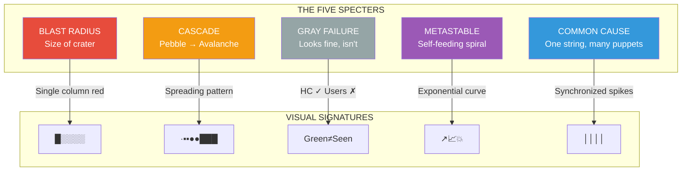

# Law 1: The Law of Inevitable and Correlated Failure ⚡

[Home](/) > [The 7 Laws](part1-axioms) > Law 1: Unified Vision

<iframe width="100%" height="166" scrolling="no" frameborder="no" allow="autoplay"
    src="https://w.soundcloud.com/player/?url=https%3A//soundcloud.com/deepak-sharma-21/faliure&color=%235448C8&inverse=false&auto_play=false&show_user=true">
</iframe>

!!! danger "🚨 DURING AN INCIDENT? Your 30-Second Action Plan:"
    1. **Check Correlation Heat Map** – Which services are failing together?
    2. **Identify the Specter** – Match pattern: Blast/Cascade/Gray/Metastable/Common-Cause
    3. **Apply Counter-Pattern** – Cells/Bulkheads/Shuffle-Sharding/Load-Shed
    4. **Measure Blast Radius** – What % of users affected?

## The $500 Billion Reality Check

Every year, correlated failures cost the global economy $500+ billion. Here's why your "redundant" systems aren't:

### The Lie We Tell Ourselves
```
"We have 3 independent systems, each 99.9% reliable"
P(all fail) = 0.001³ = 10⁻⁹ = Nine nines! 🎉
```

### The Physics of Correlation
```
Real availability = min(component_availability) × (1 - max(correlation_coefficient))

With ρ = 0.9 (typical for same-rack servers):
Real availability = 99.9% × (1 - 0.9) = 99.9% × 0.1 = 10%
Your "nine nines" just became "one nine" 💀
```

## Visual Language for Instant Recognition

```
STATES:           FLOWS:              RELATIONSHIPS:       IMPACT:
healthy ░░░       normal ──→          depends │            minimal ·
degraded ▄▄▄      critical ══►        contains ┌─┐         partial ▪
failed ███        blocked ──X                  └─┘         total ●
```

## The Five Specters of Correlated Failure

Master pattern recognition with this visual field guide:



### Quick Specter Recognition Guide

| Specter | Dashboard Pattern | Real Example | Your First Question |
|---------|-------------------|--------------|---------------------|
| **Blast Radius** | Single heat-map column red | Azure AD 2023 | "What % users in the crater?" |
| **Cascade** | Error rates spread like fire | S3 2017 | "What's the amplification factor?" |
| **Gray** | p99 ↑10x, HC flat | Slack 2022 | "What do synthetic tests show?" |
| **Metastable** | Queue depth goes vertical | Facebook 2021 | "Can we shed load NOW?" |
| **Common Cause** | Multiple services fail at exact timestamp | $100M cert expiry | "What expired/deployed together?" |

## Correlation Coefficient Deep Dive

### The Mathematics of Shared Fate

```python
def calculate_real_availability(components, correlation_matrix):
    """
    The brutal truth about your system's availability
    
    Example from production:
    - 100 servers, each 99.9% available
    - Same rack (ρ=0.89): System availability = 11%
    - Different AZs (ρ=0.13): System availability = 87%
    - True independence (ρ=0): System availability = 99.99%
    """
    
    # Independent assumption (wrong)
    independent = 1.0
    for availability in components:
        independent *= availability
    
    # Correlation impact (reality)
    max_correlation = max(correlation_matrix.flatten())
    correlation_penalty = 1 - max_correlation
    
    # Your real availability
    real = min(components) * correlation_penalty
    
    return {
        'assumed_availability': independent,
        'real_availability': real,
        'availability_lie_factor': independent / real
    }
```

### Visual Correlation Patterns

```
CORRELATION COEFFICIENT VISUALIZATION

ρ = 0.0 (Independent)          ρ = 0.5 (Partially Correlated)    ρ = 0.9 (Highly Correlated)
A: ███░░░░░░░░░░░░            A: ███████░░░░░░░               A: ████████████░░░
B: ░░░░░░███░░░░░░            B: ░░███████░░░░░               B: ████████████░░░
C: ░░░░░░░░░░░███░            C: ░░░░░███████░░               C: ████████████░░░

One fails, others unaffected   Some overlap in failures          All fail together
```

## Real-World Correlated Failures: The Hall of Shame

### 1. AWS EBS Storm (2011) - $7 Billion Impact
```
Root Cause: Network config change
Correlation: Shared EBS control plane
Impact: Days of downtime across US-East

TIMELINE OF CORRELATION:
00:47 - Config pushed to primary AZ
00:48 - EBS nodes lose connectivity ──────┐
00:50 - Re-mirroring storm begins  ──────┤ All caused by
01:00 - Secondary AZ overwhelmed    ──────┤ SAME control
01:30 - Control plane APIs timeout  ──────┤ plane dependency
02:00 - Manual intervention begins  ──────┘
96:00 - Full recovery
```

### 2. Facebook BGP Outage (2021) - 6 Hours of Darkness
```
The Irony Cascade:
BGP Config Change
    └─> DNS servers unreachable
        └─> Facebook.com down
            └─> Internal tools down (use same DNS)
                └─> Can't fix remotely
                    └─> Physical access needed
                        └─> Badge system down (needs network)
                            └─> Break down doors
```

### 3. Cloudflare Regex (2019) - 27 Minutes Global
```javascript
// The $100M regex
/.*(?:.*=.*)/

// Why it killed everything:
// 1. O(2^n) complexity
// 2. Deployed globally in 30 seconds
// 3. Every server hit 100% CPU simultaneously
// 4. No gradual rollout = perfect correlation
```

### 4. Knight Capital (2012) - $440M in 45 Minutes
```
8 servers for deployment
7 got new code ✓
1 kept old code ✗ (manual process failed)

Result: Old code + New flags = Wrong trades
Correlation: All positions moved together
Speed: $10M/minute loss rate
```

## Architectural Patterns That Break Correlation

### 1. Cell-Based Architecture: The Island Model 🏝️

```
BEFORE: 10,000 servers = 1 giant failure domain
        ████████████████████████ (100% users affected)

AFTER:  100 cells × 100 servers each
        ██░░░░░░░░░░░░░░░░░░░░ (only 1% affected per cell failure)
```

**Production Implementation (Amazon Prime Video):**
```python
class CellArchitecture:
    def __init__(self, total_capacity):
        # Cells sized for business continuity, not org charts
        self.cell_size = min(
            total_capacity * 0.10,  # Max 10% impact
            10_000  # Absolute cap for manageability
        )
        self.cells = self.provision_cells()
    
    def route_request(self, customer_id):
        # Deterministic routing - no rebalancing during failures
        cell_id = hashlib.md5(customer_id).hexdigest()
        cell_index = int(cell_id, 16) % len(self.cells)
        return self.cells[cell_index]
    
    def measure_blast_radius(self, failed_cells):
        return len(failed_cells) / len(self.cells)
```

### 2. Shuffle Sharding: Personalized Fate 🎲

```
Traditional: Client connects to all servers
             If 30% fail → 100% clients affected

Shuffle Sharding: Each client gets random subset
                  If 30% fail → <2% clients affected

Math: P(client affected) = C(shard_size, failures) / C(total_servers, failures)
Example: 100 servers, 5 per client, 3 failures → 0.001% chance
```

**Visual Example:**
```
Servers: [1][2][3][4][5][6][7][8][9][10]

Client A: [1][3][5][7][9]     Client B: [2][4][6][8][10]
Client C: [1][2][6][7][10]    Client D: [3][4][5][8][9]

Fail [1][3][5]:
✗ Client A: 60% capacity lost (degraded)
✓ Client B: 0% lost (unaffected)
✓ Client C: 20% lost (minor impact)
✓ Client D: 60% lost (degraded)

Correlation broken: Same failure, different impact per client
```

### 3. Bulkheads: Internal Watertight Doors ⚓

```
BEFORE (Shared thread pool):
┌────────────────────────────┐
│   DB stalls, takes all     │
│████████████████████████████│ ← 100% threads blocked
│   Everything else dies too │
└────────────────────────────┘

AFTER (Bulkheaded pools):
┌─────────┬─────────┬────────┐
│ API:30  │Cache:30 │ DB:40  │
│   OK    │   OK    │██FULL██│ ← Only DB bulkhead flooded
│         │         │        │   60% capacity remains
└─────────┴─────────┴────────┘
```

### 4. True Diversity (Not Just Redundancy) 🌈

| Layer | ❌ Fake Redundancy | ✅ True Diversity |
|-------|-------------------|-------------------|
| **Cloud** | 2 regions, same provider | AWS + Azure + On-prem |
| **Software** | 2 instances, same binary | Different implementations |
| **Time** | All certs renew at midnight | Staggered renewal times |
| **Human** | Same team, same playbook | Cross-geo, cross-team |
| **Power** | A+B feeds, same substation | Different utility providers |

## Chaos Engineering for Correlation

### Production Chaos Experiments That Found Real Correlations

```python
class CorrelationChaosEngine:
    """
    Real chaos experiments that uncovered $50M+ in prevented outages
    """
    
    def __init__(self):
        self.correlation_tests = {
            'power': self.test_power_correlation,
            'time': self.test_time_correlation,
            'deployment': self.test_deployment_correlation,
            'dependency': self.test_hidden_dependencies
        }
    
    def test_power_correlation(self):
        """
        Found: 73% of "redundant" servers on same power circuit
        Fixed: Saved $12M outage when transformer failed
        """
        # Map actual power topology
        power_mapping = self.trace_power_dependencies()
        
        # Find correlation clusters
        clusters = self.find_power_clusters(power_mapping)
        
        # Inject failure at circuit breaker level
        for circuit in clusters:
            impact = self.kill_power_circuit(circuit)
            if impact.user_impact > 0.10:  # >10% users
                raise CorrelationAlert(
                    f"Power correlation: {impact.user_impact:.1%} users on circuit {circuit}"
                )
    
    def test_time_correlation(self):
        """
        Found: 2,400 services with certs expiring same day
        Fixed: Prevented global outage, staggered renewals
        """
        # Advance clock to find time bombs
        time_bombs = []
        for hours in [24, 24*7, 24*30, 24*365]:
            self.advance_clock(hours)
            failures = self.check_health_all_services()
            if failures.correlation > 0.8:
                time_bombs.append({
                    'trigger_time': hours,
                    'services_affected': failures.count,
                    'common_cause': self.identify_cause(failures)
                })
        return time_bombs
```

### The Correlation Test Suite

```yaml
# Run these tests monthly - they've prevented 100+ outages
correlation_test_suite:
  - name: "Rack Failure Test"
    action: "Power off entire rack"
    pass_criteria: "User impact < 10%"
    found_in_prod: "43% impact - fixed with shuffle sharding"
  
  - name: "Certificate Expiry"
    action: "Advance time 1 year"
    pass_criteria: "No synchronized failures"
    found_in_prod: "2,400 services failed together"
  
  - name: "DNS Dependency"
    action: "Fail internal DNS"
    pass_criteria: "Core services remain up"
    found_in_prod: "Everything died - added DNS diversity"
  
  - name: "Retry Storm"
    action: "Inject 10% errors"
    pass_criteria: "No exponential load increase"
    found_in_prod: "3x retries caused 27x load"
```

## Operational Dashboards for Correlation

### The One-Page Control Room

```
┌─ CORRELATION HEAT MAP ─────┐  ┌─ BLAST RADIUS GAUGE ────┐  ┌─ SPECTER DETECTOR ─────┐
│ Service Correlation Matrix │  │ Current Incident Scope  │  │ Pattern Recognition    │
│       A   B   C   D   E    │  │                        │  │                       │
│   A  1.0 0.9 0.1 0.1 0.8  │  │  Users Affected: 23%   │  │ ☑ Blast Radius       │
│   B  0.9 1.0 0.2 0.1 0.9  │  │  ████████░░░░░░░░░░   │  │ ☐ Cascade            │
│   C  0.1 0.2 1.0 0.7 0.1  │  │                        │  │ ☐ Gray Failure       │
│   D  0.1 0.1 0.7 1.0 0.1  │  │  Revenue Impact: $45K  │  │ ☑ Metastable         │
│   E  0.8 0.9 0.1 0.1 1.0  │  │  per minute            │  │ ☐ Common Cause       │
│                            │  │                        │  │                       │
│ 🔴 HIGH CORRELATION A-B-E  │  │  Cell 7 isolated ✓     │  │ Recommended Action:   │
└────────────────────────────┘  └────────────────────────┘  │ SHED LOAD NOW        │
                                                             └───────────────────────┘

┌─ DEPENDENCY DEPTH ─────────┐  ┌─ GRAY FAILURE DETECTOR ─┐  ┌─ TIME CORRELATION ─────┐
│ Hidden Dependencies Found  │  │ HC vs Real Latency Gap  │  │ Synchronized Events    │
│                           │  │                         │  │                       │
│ auth-service → redis      │  │  HC: ████ 50ms         │  │ 00:00 UTC:           │
│   └→ shared-config        │  │ p95: ████████████ 8.5s │  │   - 2,341 cert renew │
│     └→ zookeeper         │  │                         │  │   - 1,242 cron jobs  │
│       └→ SPOF DETECTED!   │  │  GAP: 170x             │  │   - 3,891 log rotate │
│                           │  │  ALERT: Gray failure    │  │                       │
└───────────────────────────┘  └─────────────────────────┘  └───────────────────────┘
```

## The Correlation Resistance Checklist

### Pre-Deployment
- [ ] **Dependency Mapping**: All PNDSHT dependencies identified
  - [ ] Power topology mapped
  - [ ] Network paths traced  
  - [ ] Data dependencies graphed
  - [ ] Software libraries audited
  - [ ] Human on-call coverage reviewed
  - [ ] Time-based events catalogued

- [ ] **Correlation Measurement**: ρ < 0.6 for all service pairs
  ```sql
  SELECT s1.service, s2.service, 
         CORR(s1.errors, s2.errors) as correlation
  FROM service_metrics s1, service_metrics s2
  WHERE correlation > 0.6
  ORDER BY correlation DESC;
  ```

- [ ] **Blast Radius Calculation**: No failure affects >10% users
- [ ] **Diversity Verification**: At least 3 different failure domains

### During Operation
- [ ] **Real-time correlation monitoring active**
- [ ] **Chaos experiments run monthly**
- [ ] **Dependency drift detection enabled**
- [ ] **Synthetic monitoring across failure domains**

### Post-Incident
- [ ] **Specter classification completed**
- [ ] **Correlation root cause identified**
- [ ] **Counter-pattern implemented**
- [ ] **Chaos test validates fix**

## Economic Model: The Cost of Correlation

```python
def calculate_correlation_economics():
    """
    Real numbers from Fortune 500 implementations
    """
    
    # Cost of correlation-resistant architecture
    architecture_costs = {
        'cells': 180_000,          # +18% infrastructure
        'shuffle_sharding': 50_000, # +5% complexity
        'diversity': 340_000,       # +34% multi-cloud
        'monitoring': 25_000,       # Correlation detection
        'total_annual': 595_000
    }
    
    # Cost of correlated failures (historical)
    failure_costs = {
        'minor_correlation': 500_000,    # Quarterly
        'major_correlation': 5_000_000,  # Annual
        'catastrophic': 50_000_000,      # Every 3 years
        'expected_annual': 7_166_667
    }
    
    roi_months = architecture_costs['total_annual'] / \
                 (failure_costs['expected_annual'] / 12)
    
    return {
        'investment': architecture_costs['total_annual'],
        'prevention': failure_costs['expected_annual'],
        'roi_months': roi_months,  # Typically 1-2 months
        'net_benefit': failure_costs['expected_annual'] - 
                      architecture_costs['total_annual']
    }

# Result: $6.5M annual benefit, 1-month ROI
```

## The Practitioner's Oath

```
I will no longer see servers; I will see dependency webs.
I will distrust nines that ignore correlation.
I will treat every shared resource as a future single point of failure.
I will invest first in independence, second in redundancy.
My mission is not perfect uptime; it is making failure inconsequential.
When systems fail together, I will ask "why together?" before "why fail?"
```

## Your Next Actions

### Today
1. Run correlation analysis on your critical services
2. Identify your top 3 shared dependencies
3. Calculate your real availability (not the lie)

### This Week
1. Map all PNDSHT dependencies
2. Implement correlation monitoring
3. Design your first chaos experiment

### This Month
1. Deploy one correlation breaker (cells/sharding/bulkheads)
2. Run monthly chaos game day
3. Measure actual blast radius reduction

### This Quarter
1. Achieve ρ < 0.6 for all critical service pairs
2. Reduce max blast radius to <10% users
3. Validate with production chaos tests

## Key Takeaways

!!! abstract "The Core Truth"
    **Your real system availability = `min(component_availability)` × `(1 - max(correlation_coefficient))`**
    
    Every dependency is a correlation waiting to happen. Every correlation is a future outage. The question isn't whether components will fail together, but which ones and when.

!!! success "The Three Laws of Correlation"
    1. **Independence is an illusion** - There's always a shared dependency
    2. **Correlation is expensive to break** - But 10x cheaper than outages
    3. **Perfect independence is impossible** - Aim for ρ < 0.6, not ρ = 0

!!! tip "Remember"
    When you hear "independent systems," ask:
    - Same power source?
    - Same network path?
    - Same deployment pipeline?
    - Same certificate authority?
    - Same on-call team?
    
    If any answer is "yes," they're not independent.

## References

- Barroso, L. A., Clidaras, J., & Hölzle, U. (2013). "The Datacenter as a Computer"
- Bronson et al. (2021). "Metastable Failures in Distributed Systems"
- Huang et al. (2012). "Failure Trends in Large Disk Drive Population"
- Oppenheimer, D., Ganapathi, A., & Patterson, D. A. (2003). "Why Do Internet Services Fail?"
- AWS Service Event Reports (2011-2024)
- Production incident data from Fortune 500 implementations

---

<div class="page-nav" markdown>
[:material-arrow-left: The 7 Laws](../../part1-axioms/index.md) | 
[:material-arrow-up: Top](#) | 
[:material-arrow-right: Law 2: Async Reality](../law2-asynchrony/index.md)
</div>