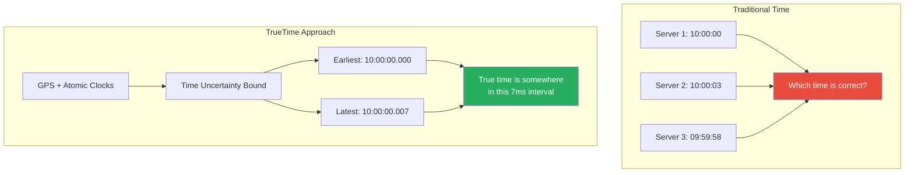
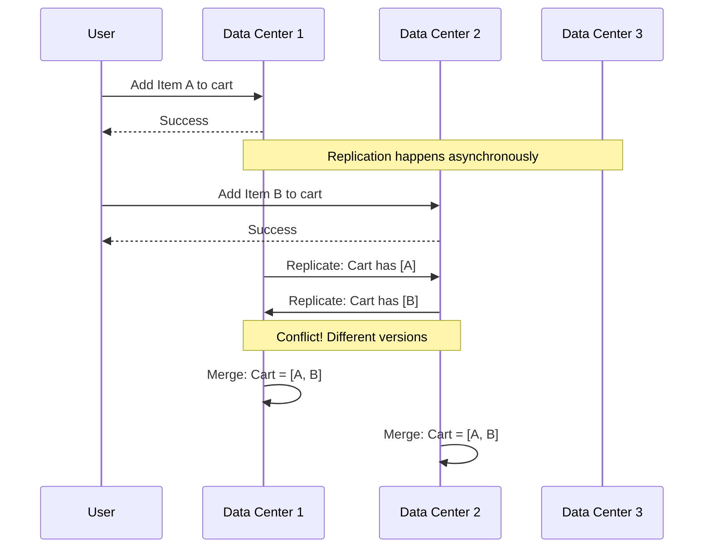
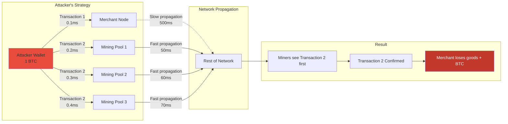
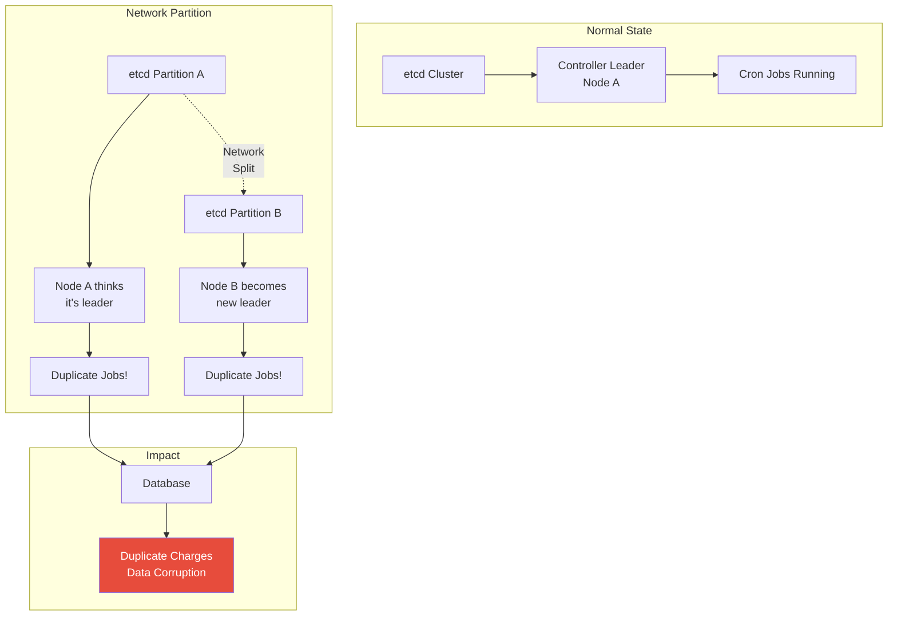
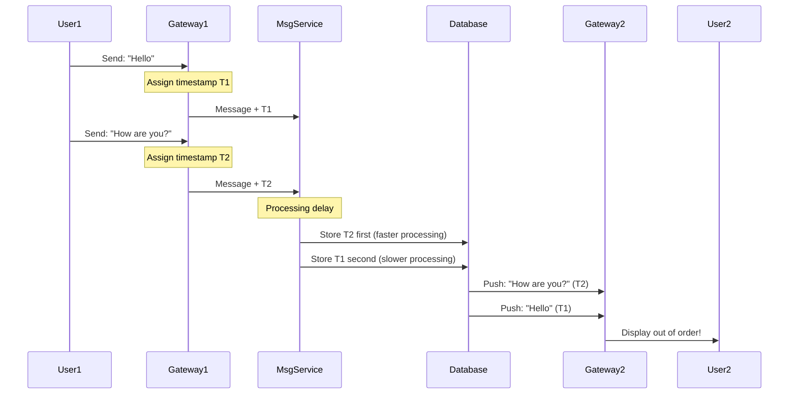

# Real-World Asynchronous Reality: Case Studies and Lessons

[Home](/) > [The 7 Laws](part1-axioms) > [Law 2: Asynchronous Reality](part1-axioms/law2-asynchrony) > Examples

## Case Study 1: Google Spanner's TrueTime (2012)

### The Problem
Google faced a fundamental challenge: how to maintain consistency across globally distributed data centers when network delays can exceed hundreds of milliseconds.

### Traditional Approach vs Reality
```python
# What developers assume
def transfer_money(from_account, to_account, amount):
# This looks atomic but isn't in a distributed system
    from_balance = read_balance(from_account)  # Time T1
    to_balance = read_balance(to_account)      # Time T2
    
    write_balance(from_account, from_balance - amount)  # Time T3
    write_balance(to_account, to_balance + amount/index)      # Time T4
# Times T1-T4 could be seconds apart across continents!
```

### The TrueTime Solution


### How TrueTime Handles Asynchrony
```go
// Simplified TrueTime API
type TrueTime struct {
    earliest time.Time
    latest   time.Time
}

func (tt *TrueTime) Now() TrueTime {
    // Returns interval [earliest, latest] containing true time
    return TrueTime{
        earliest: atomicClock.Now() - maxDrift,
        latest:   atomicClock.Now() + maxDrift,
    }
}

func (tt *TrueTime) After(t time.Time) bool {
    // True if time t is definitely in the past
    return tt.earliest > t
}

// Commit wait - ensuring causality
func CommitTransaction(tx Transaction) {
    commitTime := TrueTime.Now().latest
    
    // Wait until commit time is definitely in the past
    for !TrueTime.Now().After(commitTime) {
        time.Sleep(1 * time.Millisecond)
    }
    
    // Now safe to make visible
    tx.MakeVisible()
}
```

### Key Insights
1. **Accept Uncertainty**: Rather than pretending we know exact time, bound the uncertainty
2. **Wait Out Ambiguity**: 7ms wait is acceptable for global consistency
3. **Hardware Investment**: GPS receivers and atomic clocks in every data center
4. **Causality Preservation**: Events ordered by TrueTime respect real-world causality

## Case Study 2: Amazon DynamoDB's Eventual Consistency (2007)

### The Shopping Cart Problem
During holiday 2004, Amazon's centralized database couldn't handle Black Friday traffic. The solution required embracing asynchrony.

### The Asynchronous Reality


### Vector Clocks in Action
```python
class VectorClock:
    def __init__(self):
        self.clock = {}  # {node_id: logical_time}
    
    def increment(self, node_id):
        self.clock[node_id] = self.clock.get(node_id, 0) + 1
    
    def merge(self, other):
# Take maximum of each node's clock
        for node, time in other.clock.items():
            self.clock[node] = max(self.clock.get(node, 0), time)

# Example: Shopping cart operations
cart_dc1 = {
    'items': ['book'],
    'version': VectorClock({'dc1': 1, 'dc2': 0, 'dc3': 0})
}

cart_dc2 = {
    'items': ['laptop'],
    'version': VectorClock({'dc1': 0, 'dc2': 1, 'dc3': 0})
}

# On conflict, DynamoDB returns both versions
# Application decides how to merge
def merge_carts(cart1, cart2):
    merged_items = list(set(cart1['items'] + cart2['items']))
    merged_clock = VectorClock()
    merged_clock.merge(cart1['version'])
    merged_clock.merge(cart2['version'])
    merged_clock.increment('dc1')  # Current node
    
    return {
        'items': merged_items,
        'version': merged_clock
    }
```

### Lessons from DynamoDB
1. **Embrace Eventual Consistency**: Perfect consistency isn't required for all use cases
2. **Application-Level Resolution**: Let applications decide conflict resolution
3. **Vector Clocks Track Causality**: Know which updates happened before others
4. **Business Logic Matters**: Adding items to cart can be merged; payment must be strongly consistent

## Case Study 3: The Bitcoin Double-Spend Race (2013)

### The Race Condition
In March 2013, a merchant lost $10,000 in Bitcoin due to a double-spend attack exploiting network asynchrony.

### How the Attack Worked


### The Code Behind the Attack
```python
import asyncio
import hashlib

class DoubleSpendAttack:
    def __init__(self, bitcoin_amount):
        self.amount = bitcoin_amount
        self.tx_hash = hashlib.sha256(str(bitcoin_amount).encode()).hexdigest()
    
    async def execute_attack(self):
# Create two conflicting transactions
        tx_merchant = self.create_transaction(
            recipient="merchant_address",
            amount=self.amount,
            fee=0.0001  # Low fee
        )
        
        tx_self = self.create_transaction(
            recipient="attacker_address_2",  # Send to self
            amount=self.amount,
            fee=0.001   # Higher fee = higher priority
        )
        
# Send to merchant with direct connection
        await self.send_direct(tx_merchant, "merchant_ip", delay=0)
        
# Broadcast to mining pools slightly later
        mining_pools = ["pool1.com", "pool2.com", "pool3.com"]
        for pool in mining_pools:
            await self.send_direct(tx_self, pool, delay=0.1)
        
# Merchant sees confirmation in mempool, releases goods
# But miners include tx_self in block instead!
```

### Why Bitcoin's Solution Works (Mostly)
```python
def wait_for_confirmations(tx_hash, required_confirmations=6):
    """
    Bitcoin's defense: wait for multiple blocks
    Each block takes ~10 minutes, making reversal exponentially harder
    """
    confirmations = 0
    
    while confirmations < required_confirmations:
        latest_block = get_latest_block()
        
        if tx_hash in latest_block:
            confirmations += 1
            print(f"Confirmation {confirmations}/6")
            
# Probability of reversal after n confirmations
# P(reversal) ≈ (attacker_hashrate / network_hashrate)^n
            reversal_probability = (0.1) ** confirmations  # Assuming 10% hashrate
            print(f"Reversal probability: {reversal_probability:.8f}")
        
        time.sleep(600)  # Wait for next block
    
    return True  # Transaction is effectively irreversible
```

### Lessons Learned
1. **Zero-Conf is Dangerous**: Never trust unconfirmed transactions for valuable goods
2. **Network Topology Matters**: Attackers exploit propagation delays
3. **Economic Security**: Higher value = wait for more confirmations
4. **Time is Security**: Each 10-minute block adds exponential security

## Case Study 4: Kubernetes Leader Election Split-Brain (2020)

### The Incident
A major tech company experienced a 45-minute outage when their Kubernetes cluster developed split-brain during leader election, causing duplicate cron jobs to run.

### The Split-Brain Scenario


### The Flawed Leader Election
```go
// Simplified version of the problematic code
func (c *Controller) RunLeaderElection() {
    for {
        // Try to acquire lease
        lease, err := c.acquireLease()
        if err != nil {
            time.Sleep(5 * time.Second)
            continue
        }
        
        // Problem: What if network partitions here?
        // Node A might still think it has the lease
        // while Node B acquires it from different etcd partition
        
        c.runAsLeader(lease)
    }
}

// The fix: Proper lease fencing
func (c *Controller) RunLeaderElectionFixed() {
    for {
        lease, err := c.acquireLease()
        if err != nil {
            time.Sleep(5 * time.Second)
            continue
        }
        
        // Fencing token increases monotonically
        fencingToken := lease.FencingToken
        
        ctx, cancel := context.WithCancel(context.Background())
        
        // Continuous lease renewal
        go func() {
            for {
                if !c.renewLease(lease) {
                    cancel() // Lost lease, stop all work
                    return
                }
                time.Sleep(lease.Duration / 3)
            }
        }()
        
        c.runAsLeaderWithFencing(ctx, fencingToken)
    }
}
```

### Database-Level Protection
```sql
-- Idempotency through fencing tokens
CREATE TABLE job_executions (
    job_id UUID,
    execution_time TIMESTAMP,
    fencing_token BIGINT,
    result JSONB,
    PRIMARY KEY (job_id, execution_time),
    CONSTRAINT higher_fence CHECK (
        fencing_token >= (
            SELECT MAX(fencing_token) 
            FROM job_executions j2 
            WHERE j2.job_id = job_executions.job_id
        )
    )
);

-- Stored procedure that rejects stale leaders
CREATE FUNCTION execute_job(
    p_job_id UUID,
    p_fencing_token BIGINT,
    p_result JSONB
) RETURNS BOOLEAN AS $$
BEGIN
    -- Only accept if fencing token is highest seen
    INSERT INTO job_executions (job_id, execution_time, fencing_token, result)
    VALUES (p_job_id, NOW(), p_fencing_token, p_result)
    ON CONFLICT (job_id, execution_time) DO NOTHING;
    
    RETURN FOUND; -- True if insert succeeded
END;
$$ LANGUAGE plpgsql;
```

### Lessons from the Incident
1. **Lease != Leadership**: Having a lease doesn't mean you're the only leader
2. **Fencing Tokens**: Monotonic tokens prevent stale leaders from causing damage
3. **End-to-End Idempotency**: Every layer needs to handle duplicate operations
4. **Partition Detection**: Leaders must continuously verify their status

## Case Study 5: Discord's Message Ordering Chaos (2021)

### The Problem
Users reported messages appearing out of order, with replies showing before the original message, causing confusion in fast-moving conversations.

### The Asynchronous Message Flow


### The Hybrid Clock Solution
```typescript
class HybridLogicalClock {
    private physicalTime: bigint;
    private logicalTime: number = 0;
    
    tick(): Timestamp {
        const now = BigInt(Date.now());
        
        if (now > this.physicalTime) {
            this.physicalTime = now;
            this.logicalTime = 0;
        } else {
            this.logicalTime++;
        }
        
        return {
            physical: this.physicalTime,
            logical: this.logicalTime,
            nodeId: this.nodeId
        };
    }
    
    update(remote: Timestamp): Timestamp {
        const now = BigInt(Date.now());
        
        if (now > this.physicalTime && now > remote.physical) {
            this.physicalTime = now;
            this.logicalTime = 0;
        } else if (remote.physical > this.physicalTime) {
            this.physicalTime = remote.physical;
            this.logicalTime = remote.logical + 1;
        } else if (remote.physical === this.physicalTime) {
            this.logicalTime = Math.max(this.logicalTime, remote.logical) + 1;
        }
        
        return this.tick();
    }
}

// Message ordering with HLC
interface Message {
    id: string;
    content: string;
    timestamp: Timestamp;
    causalDependencies: string[]; // IDs of messages this replies to
}

function orderMessages(messages: Message[]): Message[] {
    return messages.sort((a, b) => {
        // First by physical time
        if (a.timestamp.physical !== b.timestamp.physical) {
            return Number(a.timestamp.physical - b.timestamp.physical);
        }
        
        // Then by logical time
        if (a.timestamp.logical !== b.timestamp.logical) {
            return a.timestamp.logical - b.timestamp.logical;
        }
        
        // Finally by node ID for determinism
        return a.timestamp.nodeId.localeCompare(b.timestamp.nodeId);
    });
}
```

### Client-Side Reordering Buffer
```typescript
class MessageOrderingBuffer {
    private buffer: Map<string, Message> = new Map();
    private delivered: Set<string> = new Set();
    private timeout: number = 500; // ms
    
    async receiveMessage(msg: Message) {
        this.buffer.set(msg.id, msg);
        
        // Set timeout for forced delivery
        setTimeout(() => this.forcedDeliver(msg.id), this.timeout);
        
        // Try to deliver messages in causal order
        this.tryDeliverMessages();
    }
    
    private tryDeliverMessages() {
        let delivered: boolean;
        
        do {
            delivered = false;
            
            for (const [id, msg] of this.buffer) {
                if (this.canDeliver(msg)) {
                    this.deliver(msg);
                    this.buffer.delete(id);
                    delivered = true;
                }
            }
        } while (delivered);
    }
    
    private canDeliver(msg: Message): boolean {
        // Can deliver if all causal dependencies are delivered
        return msg.causalDependencies.every(depId => 
            this.delivered.has(depId)
        );
    }
    
    private deliver(msg: Message) {
        this.delivered.add(msg.id);
        // Actually show message to user
        this.displayMessage(msg);
    }
}
```

### Lessons from Discord
1. **Physical Time Isn't Enough**: Clock skew between servers causes misorderings
2. **Hybrid Logical Clocks**: Combine wall clock with logical ordering
3. **Client-Side Buffering**: Small delay for huge UX improvement
4. **Causal Dependencies**: Track what messages reply to what

## Common Patterns Across All Cases

### 1. The Time Uncertainty Pattern
Every case dealt with the fundamental uncertainty of time in distributed systems:
- Spanner: Bounded uncertainty with TrueTime
- Bitcoin: Used blockchain as a distributed timestamp server
- Discord: Hybrid logical clocks for ordering

### 2. The Eventual Consistency Pattern
Systems chose different points on the consistency spectrum:
- DynamoDB: Eventual consistency for availability
- Spanner: Strong consistency with performance cost
- Discord: Causal consistency for user experience

### 3. The Conflict Resolution Pattern
Each system needed strategies for handling conflicts:
- DynamoDB: Application-level merge
- Kubernetes: Fencing tokens
- Bitcoin: Longest chain wins

### 4. The Human Perception Pattern
Asynchrony often conflicts with human expectations:
- Discord users expect instant, ordered messaging
- Bitcoin users expect instant payments
- Database users expect immediate consistency

## Designing for Asynchronous Reality

### 1. Embrace the CAP Theorem
```yaml
system_choices:
  banking:
    choice: CP  # Consistency + Partition Tolerance
    sacrifice: Availability during partitions
    
  social_media:
    choice: AP  # Availability + Partition Tolerance  
    sacrifice: Immediate consistency
    
  configuration:
    choice: CA  # Consistency + Availability
    sacrifice: Partition tolerance (single datacenter)
```

### 2. Choose Your Timing Model
```python
class TimingModel(Enum):
    SYNCHRONOUS = "Assumes bounded delays"
    PARTIALLY_SYNCHRONOUS = "Eventually bounded delays"  
    ASYNCHRONOUS = "No timing assumptions"

def choose_model(requirements):
    if requirements.needs_strong_consistency:
        return TimingModel.PARTIALLY_SYNCHRONOUS  # Like Spanner
    elif requirements.needs_high_availability:
        return TimingModel.ASYNCHRONOUS  # Like DynamoDB
    else:
        return TimingModel.SYNCHRONOUS  # Single datacenter
```

### 3. Implement Proper Ordering
```sql
-- Use database features for ordering guarantees
CREATE TABLE events (
    id UUID DEFAULT gen_random_uuid(),
    created_at TIMESTAMPTZ DEFAULT NOW(),
    hlc_timestamp JSONB NOT NULL,  -- Hybrid logical clock
    vector_clock JSONB NOT NULL,    -- For causality
    content JSONB NOT NULL,
    
    -- Index for efficient ordering queries
    INDEX idx_hlc ON events ((hlc_timestamp->>'physical'), 
                             (hlc_timestamp->>'logical'))
);
```

## The Meta Lesson

> "In distributed systems, 'now' is a lie, 'before' is negotiable, and 'simultaneously' is impossible. Design accordingly."

These cases teach us that:
1. **Time is relative**: Even with atomic clocks, uncertainty remains
2. **Ordering is expensive**: The cost of consistency is latency
3. **Conflicts are inevitable**: Design for resolution, not prevention
4. **Human intuition fails**: Our brains aren't built for distributed thinking

[**← Back to Law of Asynchronous Reality**](index.md) | [**→ To Exercises**](exercises.md)