# Law 2: The Law of Physical and Information Asynchrony ⏱️

[Home](/) > [The 7 Laws](/part1-axioms) > [Law 2: Asynchronous Reality](/part1-axioms/law2-asynchrony) > Deep Dive

!!! quote "Core Principle"
    The time required for information to propagate between nodes is variable, non-zero, and creates fundamental uncertainty.

!!! progress "Your Journey Through The 7 Laws"
    - [x] Law 1: Correlated Failure
    - [x] **Law 2: Asynchronous Reality** ← You are here
    - [ ] Law 3: Emergent Chaos
    - [ ] Law 4: Multidimensional Optimization
    - [ ] Law 5: Distributed Knowledge
    - [ ] Law 6: Cognitive Load
    - [ ] Law 7: Economic Reality

## The Two Generals' $50 Billion Problem

!!! failure "The Knight Capital Disaster - August 1, 2012"
    
    **Duration**: 45 minutes  
    **Loss**: $460 million ($10M per minute/index)  
    **Root Cause**: Asynchronous deployment  
    **Lesson**: Time coordination failures can bankrupt companies  
    
    At 9:30 AM, Knight Capital's new trading software went live. But one of eight servers had old code. The asynchrony between servers caused:
    
    1. **9:30:00**: Market opens, systems activate
    2. **9:30:01**: 7 servers run new logic, 1 runs old
    3. **9:30:02**: Old server interprets new messages incorrectly
    4. **9:30:05**: Begins buying everything, selling nothing
    5. **9:30:30**: 2 million shares traded incorrectly
    6. **9:45:00**: 4 million executions, $460M loss
    7. **10:15:00**: Finally killed, company near bankruptcy
    
    **The Asynchrony**: A 1-second deployment lag created a 45-minute catastrophe.

## The Two Generals Problem: Why Perfect Coordination Is Impossible

### The Classic Formulation


### The Mathematical Proof

```python
def two_generals_impossibility():
    """
    Proof by contradiction that perfect agreement is impossible
    """
    
    # Assume a protocol P exists that guarantees agreement in finite messages
    # Let n = minimum number of messages required by P
    
    # Consider execution E where all n messages are delivered
    # Both generals attack (by assumption, P works)
    
    # Now consider execution E' where message n is lost
    # General who sent message n: same state as E (doesn't know it was lost)
    # General who didn't receive it: different state than E
    
    # But sender in E' must make same decision as in E (same local state)
    # Receiver in E' might make different decision (different state)
    
    # Contradiction! P doesn't guarantee agreement
    
    # This applies to any finite n, therefore no protocol exists
```

### 💰 The $12M Two Generals Problem


| Decision Point | Choice A | Choice B | What Happened |
|----------------|----------|----------|---------------|
| **Node timeout** | Abort (safe) | Continue (risky) | Continued → $12M loss |
| **Partial prepare** | Rollback all | Commit partial | Committed → Inconsistency |
| **Network partition** | Stop service | Split brain | Split → Duplicate transactions |

## The FLP Impossibility Result: The Fundamental Theorem

### The Theorem

!!! danger "Fischer-Lynch-Paterson (1985)"
    
    **In an asynchronous distributed system where even one node may crash, it is impossible to guarantee that all non-faulty nodes will reach consensus in finite time.**

### The Intuition


### The Proof Sketch

```python
def flp_impossibility_proof():
    """
    Core insight: There exists a "bivalent" state where the system
    can still decide either 0 or 1, and asynchrony can keep us there forever
    """
    
    # Initial state: some configurations lead to 0, some to 1
    # There must be two adjacent configs C0 -> 0 and C1 -> 1
    # differing in one process's initial value
    
    # Key insight: From a bivalent state, there exists an execution
    # that keeps the system in bivalent states forever
    
    class Configuration:
        def __init__(self, state, pending_messages):
            self.state = state
            self.pending = pending_messages
            
        def is_bivalent(self):
            # Can still reach both decisions
            return self.can_reach_decision(0) and self.can_reach_decision(1)
    
    # The "critical" configuration
    critical_config = Configuration(
        state="all processes at step n-1",
        pending_messages=["message that would decide outcome"]
    )
    
    # Asynchrony means we can delay the critical message indefinitely
    while True:
        # Adversarial scheduler keeps choosing non-critical messages
        # System stays bivalent forever!
        process_non_critical_message()
        # Never process the message that would decide
```

### Real-World Impact: Google's Chubby Lock Service

```go
// Simplified from Google's Chubby implementation
type ChubbyCell struct {
    master    *Node
    replicas  []*Node
    epoch     uint64
}

func (c *ChubbyCell) ElectMaster() (*Node, error) {
    // FLP says we can't guarantee this terminates!
    // Solution: Assume partial synchrony
    
    timeout := 5 * time.Second  // Assume max message delay
    
    for {
        leader := c.runPaxos(timeout)
        if leader != nil {
            return leader, nil
        }
        
        // FLP in action: might loop forever
        // Real system: after 5 failures, declare outage
        if attempts > 5 {
            return nil, fmt.Errorf("FLP strikes again: cell unavailable")
        }
        
        // Exponential backoff (partial synchrony assumption)
        timeout *= 2
    }
}

// Google's solution: Use time-based leases
// This violates pure asynchrony but works in practice
func (c *ChubbyCell) MaintainMastership() {
    lease := 10 * time.Second
    
    for {
        // Must renew before lease expires
        time.Sleep(lease / 2)
        
        renewed := c.renewLease(lease)
        if !renewed {
            // Lost mastership - step down
            c.stepDown()
            return
        }
    }
}
```

## Timing Diagrams: Visualizing Asynchrony

### Message Ordering Anomalies


### 📈 The Tail Latency Monster

```mermaid
graph TD
    subgraph "DynamoDB: 1 Billion Requests"
        P50["P50: 0.5ms<br/>(🚀 Fast!)"] --> P90["P90: 1.2ms<br/>(👍 Still good)"]
        P90 --> P99["P99: 12ms<br/>(⚠️ Getting slow)"]
        P99 --> P999["P99.9: 134ms<br/>(🔥 Problem!)"]
        P999 --> P9999["P99.99: 1,240ms<br/>(💣 Disaster!)"]
        P9999 --> MAX["Max: 67,000ms<br/>(☠️ 67 seconds!)"]
    end
    
    style P50 fill:#9f6
    style P90 fill:#9f6
    style P99 fill:#fc6
    style P999 fill:#f96
    style P9999 fill:#d32f2f,color:#fff
    style MAX fill:#000,color:#fff
```



| Percentile | Latency | Impact @ 1M RPS | Your Page (100 calls) |
|------------|---------|-----------------|----------------------|
| **P50** | 0.5ms | 500K requests | Always fast |
| **P99** | 12ms | 10K requests | 63% chance of slow |
| **P99.99** | 1.24s | 100 requests | 1% chance of 1s+ delay |
| **Max** | 67s | ~1 request | Timeout city |

### Network Partition Timeline


## Logical Clocks: Ordering Without Time

### Lamport Clocks: The Foundation

```python
class LamportClock:
    """
    Actual implementation used in Apache Cassandra
    """
    def __init__(self, node_id):
        self.time = 0
        self.node_id = node_id
        
    def tick(self):
        """Local event - increment clock"""
        self.time += 1
        return self.time
        
    def send(self, message):
        """Send message with timestamp"""
        self.time += 1
        message['lamport_time'] = self.time
        message['sender'] = self.node_id
        return message
        
    def receive(self, message):
        """Receive message and update clock"""
        self.time = max(self.time, message['lamport_time']) + 1
        return self.time
    
    def happens_before(self, t1, t2):
        """
        Determines if event at t1 happened-before event at t2
        Note: Returns None if events are concurrent!
        """
        if t1[0] < t2[0]:  # Lamport time
            return True
        elif t1[0] == t2[0] and t1[1] == t2[1]:  # Same node
            return True
        elif t1[0] > t2[0]:
            return False
        else:
            return None  # Concurrent events!
```

### Vector Clocks: Capturing Causality

```python
class VectorClock:
    """
    Used in Riak, Voldemort, and DynamoDB
    """
    def __init__(self, node_id, num_nodes):
        self.node_id = node_id
        self.clock = [0] * num_nodes
        
    def increment(self):
        """Local event"""
        self.clock[self.node_id] += 1
        return self.clock.copy()
        
    def update(self, received_clock):
        """Merge received clock with local"""
        for i in range(len(self.clock)):
            self.clock[i] = max(self.clock[i], received_clock[i])
        self.clock[self.node_id] += 1
        
    def compare(self, other):
        """
        Returns: 'before', 'after', 'concurrent', or 'equal'
        This is what enables causal consistency!
        """
        less = False
        greater = False
        
        for i in range(len(self.clock)):
            if self.clock[i] < other[i]:
                less = True
            elif self.clock[i] > other[i]:
                greater = True
                
        if less and not greater:
            return 'before'
        elif greater and not less:
            return 'after'
        elif not less and not greater:
            return 'equal'
        else:
            return 'concurrent'  # The tricky case!
```

### Production Example: Conflict Resolution in DynamoDB

```python
# Simplified from AWS DynamoDB's vector clock implementation
class DynamoDBVersioning:
    def put(self, key, value, context=None):
        if context is None:
            # New write
            version = VectorClock(self.node_id, self.num_nodes)
            version.increment()
        else:
            # Update existing
            version = context['vector_clock']
            version.update()
            
        # Check for conflicts
        existing_versions = self.storage.get_all_versions(key)
        
        conflicts = []
        ancestors = []
        for existing in existing_versions:
            comparison = version.compare(existing['clock'])
            if comparison == 'concurrent':
                conflicts.append(existing)
            elif comparison == 'after':
                ancestors.append(existing)
                
        if conflicts:
            # Multiple concurrent versions exist!
            # DynamoDB returns all versions to client
            return {
                'conflicts': conflicts,
                'require_resolution': True
            }
        else:
            # Safe to update
            self.storage.put(key, value, version)
            # Remove ancestors
            for ancestor in ancestors:
                self.storage.remove_version(key, ancestor['clock'])
```

## Physical Time: When Logic Isn't Enough

### TrueTime: Google's Solution

```go
// Simplified from Google Spanner's TrueTime implementation
type TrueTimeInterval struct {
    Earliest time.Time
    Latest   time.Time
}

type TrueTime struct {
    gpsMasters     []GPSTimeServer
    atomicMasters  []AtomicTimeServer
    uncertainty    time.Duration  // typically 1-7ms
}

func (tt *TrueTime) Now() TrueTimeInterval {
    // Query multiple time masters
    times := tt.queryAllMasters()
    
    // Account for network delay
    earliest := times.min() - tt.uncertainty
    latest := times.max() + tt.uncertainty
    
    return TrueTimeInterval{earliest, latest}
}

// Spanner's key innovation: wait out the uncertainty
func (tt *TrueTime) WaitUntilAfter(t time.Time) {
    for {
        now := tt.Now()
        if now.Earliest.After(t) {
            return  // Definitely after t
        }
        time.Sleep(time.Millisecond)
    }
}

// This enables external consistency!
func (s *SpannerTransaction) Commit() {
    commitTime := s.trueTime.Now().Latest
    
    // The magic: wait until we're sure timestamp has passed
    // This guarantees external consistency
    s.trueTime.WaitUntilAfter(commitTime)
    
    s.writeToLog(commitTime)
    s.releaseLocks()
}
```

### Hybrid Logical Clocks: Best of Both Worlds

```python
class HybridLogicalClock:
    """
    Used in CockroachDB and MongoDB
    Combines physical time with logical counter
    """
    def __init__(self):
        self.physical = 0
        self.logical = 0
        
    def update(self, msg_physical=None, msg_logical=None):
        """
        HLC algorithm - provides causality tracking with bounded drift
        """
        physical_now = time.time_ns()
        
        if msg_physical is None:
            # Local event
            if physical_now > self.physical:
                self.physical = physical_now
                self.logical = 0
            else:
                self.logical += 1
        else:
            # Message event
            if physical_now > max(self.physical, msg_physical):
                self.physical = physical_now
                self.logical = 0
            elif max(self.physical, msg_physical) > physical_now:
                self.physical = max(self.physical, msg_physical)
                if self.physical == msg_physical:
                    self.logical = max(self.logical, msg_logical) + 1
                else:
                    self.logical = self.logical + 1
                    
        return (self.physical, self.logical)
```

## Network Delay: The Variable Demon

### Real Production Data

```python
# Actual measurements from Netflix's global infrastructure
def analyze_network_delays():
    """
    Cross-region latency measurements (millions of samples)
    """
    
    measurements = {
        # Region pair: (min, p50, p99, p99.9, max) in ms
        'us-east-1_to_us-west-2': (58, 62, 73, 156, 2341),
        'us-east-1_to_eu-west-1': (71, 76, 89, 267, 5672),
        'us-east-1_to_ap-south-1': (181, 195, 234, 501, 8934),
        'eu-west-1_to_ap-south-1': (98, 112, 167, 423, 12341),
    }
    
    # Key insights:
    # 1. Minimum latency is physics (speed of light)
    # 2. P50 is only ~10% above minimum (good!)
    # 3. P99.9 can be 10x the median (bad!)
    # 4. Max can be 100x the median (disaster!)
    
    # Impact on consensus protocols
    for region_pair, latencies in measurements.items():
        min_lat, p50, p99, p99_9, max_lat = latencies
        
        # Paxos/Raft round trip time
        consensus_p50 = p50 * 2  # Two round trips
        consensus_p99_9 = p99_9 * 2
        
        print(f"{region_pair}:")
        print(f"  Consensus P50: {consensus_p50}ms")
        print(f"  Consensus P99.9: {consensus_p99_9}ms")
        print(f"  Degradation: {consensus_p99_9/consensus_p50:.1f}x")
```

### The Queueing Theory Reality

```python
def littles_law_in_practice():
    """
    Why latency explodes under load
    L = λW (Little's Law)
    """
    
    # Real data from a production service
    arrival_rate = 1000  # requests/second
    service_time = 0.001  # 1ms per request
    
    # M/M/1 queue model
    utilization = arrival_rate * service_time  # 0.5 = 50%
    
    # Average time in system (including queue)
    avg_latency = service_time / (1 - utilization)
    
    # But variance is huge!
    for percentile in [50, 90, 99, 99.9]:
        if percentile == 50:
            latency = avg_latency
        else:
            # Exponential distribution percentile
            latency = -avg_latency * math.log(1 - percentile/100)
            
        print(f"P{percentile}: {latency*1000:.1f}ms")
    
    # At 90% utilization, P99.9 = 69ms for 1ms service time!
```

## Consensus in Asynchronous Systems

### Paxos: The Theoretical Foundation

```python
class PaxosAcceptor:
    """
    Leslie Lamport's Paxos - the foundation of distributed consensus
    Actual implementation based on Google's Chubby
    """
    def __init__(self, node_id):
        self.node_id = node_id
        # Persistent state (must survive crashes)
        self.promised_proposal = None
        self.accepted_proposal = None
        self.accepted_value = None
        
    def prepare(self, proposal_number):
        """
        Phase 1a: Prepare request from proposer
        """
        if self.promised_proposal is None or proposal_number > self.promised_proposal:
            self.promised_proposal = proposal_number
            
            # Return promise and any accepted value
            return {
                'promise': proposal_number,
                'accepted_proposal': self.accepted_proposal,
                'accepted_value': self.accepted_value
            }
        else:
            # Reject - already promised higher proposal
            return {'reject': self.promised_proposal}
    
    def accept(self, proposal_number, value):
        """
        Phase 2a: Accept request from proposer
        """
        if self.promised_proposal is None or proposal_number >= self.promised_proposal:
            self.promised_proposal = proposal_number
            self.accepted_proposal = proposal_number
            self.accepted_value = value
            return {'accepted': proposal_number}
        else:
            return {'reject': self.promised_proposal}

class PaxosProposer:
    def __init__(self, node_id, acceptors):
        self.node_id = node_id
        self.acceptors = acceptors
        self.proposal_number = node_id  # Ensure uniqueness
        
    def propose(self, value):
        """
        Run Paxos to achieve consensus on value
        """
        while True:  # FLP says this might not terminate!
            # Phase 1: Prepare
            self.proposal_number += len(self.acceptors)
            promises = []
            
            for acceptor in self.acceptors:
                try:
                    response = acceptor.prepare(self.proposal_number)
                    if 'promise' in response:
                        promises.append(response)
                except TimeoutError:
                    pass  # Asynchrony - node might be slow
                    
            if len(promises) > len(self.acceptors) / 2:
                # Got majority - proceed to phase 2
                
                # Check if any acceptor already accepted a value
                accepted_proposals = [p for p in promises if p['accepted_proposal']]
                if accepted_proposals:
                    # Must use previously accepted value (Paxos safety)
                    highest = max(accepted_proposals, key=lambda x: x['accepted_proposal'])
                    value = highest['accepted_value']
                
                # Phase 2: Accept
                accepts = []
                for acceptor in self.acceptors:
                    try:
                        response = acceptor.accept(self.proposal_number, value)
                        if 'accepted' in response:
                            accepts.append(response)
                    except TimeoutError:
                        pass
                        
                if len(accepts) > len(self.acceptors) / 2:
                    # Consensus achieved!
                    return value
                    
            # Failed - retry with higher proposal number
            time.sleep(random.uniform(0.1, 0.5))  # Randomized backoff
```

### Raft: The Understandable Alternative

```go
// Simplified from etcd's Raft implementation
type RaftNode struct {
    id            int
    currentTerm   int
    votedFor      *int
    log           []LogEntry
    state         NodeState  // Follower, Candidate, Leader
    
    // Volatile state
    commitIndex   int
    lastApplied   int
    
    // Leader only
    nextIndex     map[int]int
    matchIndex    map[int]int
    
    // Channels
    electionTimer *time.Timer
    heartbeat     *time.Ticker
}

func (n *RaftNode) RunElection() {
    n.state = Candidate
    n.currentTerm++
    n.votedFor = &n.id
    votes := 1  // Vote for self
    
    // Request votes in parallel
    voteCh := make(chan bool, len(n.peers))
    for _, peer := range n.peers {
        go func(p Peer) {
            reply := p.RequestVote(RequestVoteArgs{
                Term:         n.currentTerm,
                CandidateId:  n.id,
                LastLogIndex: len(n.log) - 1,
                LastLogTerm:  n.log[len(n.log)-1].Term,
            })
            voteCh <- reply.VoteGranted
        }(peer)
    }
    
    // Count votes with timeout
    electionTimeout := randomElectionTimeout()
    for {
        select {
        case granted := <-voteCh:
            if granted {
                votes++
                if votes > len(n.peers)/2 {
                    // Won election!
                    n.becomeLeader()
                    return
                }
            }
        case <-time.After(electionTimeout):
            // Election failed - start over
            return
        }
    }
}

// The key insight: randomized timeouts prevent livelock
func randomElectionTimeout() time.Duration {
    // Critical for breaking symmetry in leader election
    min := 150 * time.Millisecond
    max := 300 * time.Millisecond
    return min + time.Duration(rand.Int63n(int64(max-min)))
}
```

## 💥 Production War Stories

### The $300M Microsecond


### Split-Brain Cost Calculator

| Incident | Duration | Conflicts | Recovery Time | Data Loss | Cost |
|----------|----------|-----------|---------------|-----------|------|
| **MongoDB 2019** | 47 min | 50K docs | 3 weeks | 2% | $5M |
| **Elasticsearch 2020** | 2 hours | 100K indices | 5 days | 0.5% | $2M |
| **Cassandra 2021** | 6 hours | 1M rows | 2 weeks | 1% | $8M |

!!! danger "Key Lesson"
    **Majority writes = Higher latency but peaceful sleep**

## Practical Solutions

### 1. Timeout Strategies

```python
class AdaptiveTimeout:
    """
    Production timeout strategy from Twitter's Finagle
    """
    def __init__(self):
        self.history = collections.deque(maxlen=1000)
        self.min_timeout = 10  # ms
        self.max_timeout = 30000  # 30 seconds
        
    def calculate_timeout(self):
        if len(self.history) < 100:
            # Not enough data - use conservative timeout
            return 1000  # 1 second
            
        # Use P99 as base
        p99 = np.percentile(list(self.history), 99)
        
        # Add safety margin based on variance
        std_dev = np.std(list(self.history))
        margin = min(std_dev * 3, p99)  # 3-sigma or 100%, whichever is less
        
        timeout = p99 + margin
        
        # Apply bounds
        return max(self.min_timeout, min(timeout, self.max_timeout))
    
    def record_latency(self, latency_ms):
        self.history.append(latency_ms)
        
    def timeout_with_backpressure(self):
        """
        Increase timeout under load to prevent cascade
        """
        base_timeout = self.calculate_timeout()
        
        # Check recent timeout rate
        recent = list(self.history)[-100:]
        timeout_rate = sum(1 for l in recent if l >= base_timeout) / len(recent)
        
        if timeout_rate > 0.1:  # More than 10% timeouts
            # System under stress - increase timeout
            return base_timeout * 2
        else:
            return base_timeout
```

### 2. Hedged Requests

```python
async def hedged_request(replicas, delay_ms=10):
    """
    Google's hedged request pattern - used in Bigtable
    Reduces P99 latency by 50% with only 5% extra load
    """
    pending = []
    
    # Start with primary replica
    primary = asyncio.create_task(
        replicas[0].request()
    )
    pending.append(primary)
    
    # Set up hedging
    for i, replica in enumerate(replicas[1:], 1):
        async def hedge_after_delay(r, d):
            await asyncio.sleep(d / 1000)
            return await r.request()
            
        hedge = asyncio.create_task(
            hedge_after_delay(replica, delay_ms * i)
        )
        pending.append(hedge)
    
    # Return first successful response
    while pending:
        done, pending = await asyncio.wait(
            pending, 
            return_when=asyncio.FIRST_COMPLETED
        )
        
        for task in done:
            try:
                result = task.result()
                # Cancel remaining requests
                for p in pending:
                    p.cancel()
                return result
            except Exception:
                continue  # Try next
                
    raise Exception("All replicas failed")
```

### 3. Batching and Pipelining

```python
class BatchedWriter:
    """
    Amortize coordination cost - from Kafka's producer
    """
    def __init__(self, coordinator, batch_size=100, linger_ms=10):
        self.coordinator = coordinator
        self.batch_size = batch_size
        self.linger_ms = linger_ms
        self.pending = []
        self.lock = threading.Lock()
        self.condition = threading.Condition(self.lock)
        self.worker = threading.Thread(target=self._worker)
        self.worker.start()
        
    def write(self, record):
        with self.lock:
            self.pending.append(record)
            if len(self.pending) >= self.batch_size:
                self.condition.notify()
                
    def _worker(self):
        while True:
            batch = []
            
            with self.lock:
                # Wait for batch to fill or timeout
                self.condition.wait(self.linger_ms / 1000)
                
                if self.pending:
                    batch = self.pending[:self.batch_size]
                    self.pending = self.pending[self.batch_size:]
                    
            if batch:
                # One coordination round for entire batch!
                self.coordinator.write_batch(batch)
```

## The Ultimate Lessons

!!! abstract "Key Takeaways"
    
    1. **You Cannot Distinguish Slow from Dead**
       - This is fundamental, not a engineering limitation
       - Every timeout is a guess, not a fact
       - Design systems that tolerate this uncertainty
    
    2. **Time Does Not Exist**
       - There is no "now" in distributed systems
       - Only events and their causal relationships matter
       - Use logical clocks when possible, physical time when necessary
    
    3. **The Network Is Hostile**
       - Messages will be delayed, reordered, duplicated, and lost
       - P99.9 latency can be 100x the median
       - Design for the worst case, not the average
    
    4. **Consensus Has a Price**
       - FLP: Can't guarantee termination
       - CAP: Can't have consistency and availability
       - Every coordination point multiplies latency
    
    5. **Asynchrony Is Not Your Enemy**
       - Embrace eventual consistency
       - Use conflict-free replicated data types (CRDTs)
       - Let operations commute and converge

## Design Patterns for Asynchrony

!!! success "Production-Ready Patterns"

    - [ ] **Assume Unbounded Delays**
        - [ ] Use adaptive timeouts based on recent history
        - [ ] Implement exponential backoff with jitter
        - [ ] Never use fixed timeouts in production
        
    - [ ] **Make Operations Idempotent**
        - [ ] Include unique request IDs
        - [ ] Design APIs that can be safely retried
        - [ ] Use "at least once" with idempotency tokens
        
    - [ ] **Embrace Logical Time**
        - [ ] Use vector clocks for causality
        - [ ] Implement hybrid logical clocks when wall time matters
        - [ ] Accept that concurrent operations exist
        
    - [ ] **Minimize Coordination**
        - [ ] Batch operations to amortize cost
        - [ ] Use conflict-free data structures
        - [ ] Prefer eventual consistency where possible
        
    - [ ] **Plan for Partitions**
        - [ ] Design for split-brain scenarios
        - [ ] Use majority quorums
        - [ ] Implement automatic reconciliation

## Related Topics

### Related Laws
- [Law 1: Correlated Failure](/part1-axioms/law1-failure/index) - How asynchrony affects failure detection
- [Law 3: Emergent Chaos](/part1-axioms/law3-emergence/index) - How timing creates emergent behavior
- [Law 5: Distributed Knowledge](/part1-axioms/law5-epistemology/index) - The epistemology of distributed time
- [Law 7: Economic Reality](/part1-axioms/law7-economics/index) - The cost of fighting asynchrony

### Related Patterns
- [Saga Pattern](/patterns/saga) - Managing distributed transactions without 2PC
- [Event Sourcing](/patterns/event-sourcing) - Embracing the event-driven nature of time
- [CRDT](/patterns/crdt) - Conflict-free replicated data types
- [Vector Clocks](/patterns/vector-clocks) - Practical causality tracking
- [Optimistic Replication](/patterns/optimistic-replication) - Working with stale data

### Case Studies
- [Google Spanner](/case-studies/google-spanner) - TrueTime and external consistency
- [Amazon DynamoDB](/case-studies/dynamodb/) - Eventually consistent by design
- [Apache Cassandra](/case-studies/cassandra) - Tunable consistency in practice

## References and Further Reading

- Lamport, L. (1978). "Time, Clocks, and the Ordering of Events in a Distributed System"
- Fischer, M., Lynch, N., & Paterson, M. (1985). "Impossibility of Distributed Consensus with One Faulty Process"
- Corbett et al. (2012). "Spanner: Google's Globally-Distributed Database"
- Sheehy, J. (2015). "There is No Now: Problems with simultaneity in distributed systems"
- Kleppmann, M. (2016). "Designing Data-Intensive Applications" - Chapter 8

---

<div class="page-nav" markdown>
[:material-arrow-left: Law 1: Correlated Failure](/part1-axioms/law1-failure/index) | 
[:material-arrow-up: The 7 Laws](/part1-axioms) | 
[:material-arrow-right: Law 3: Emergent Chaos](/part1-axioms/law3-emergence/index)
</div>