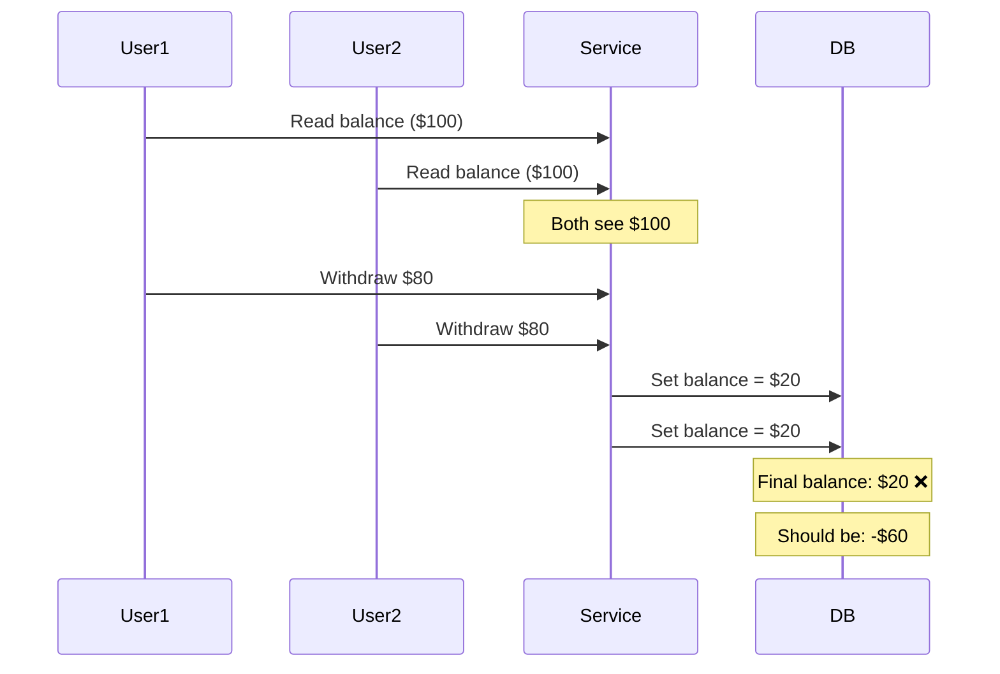
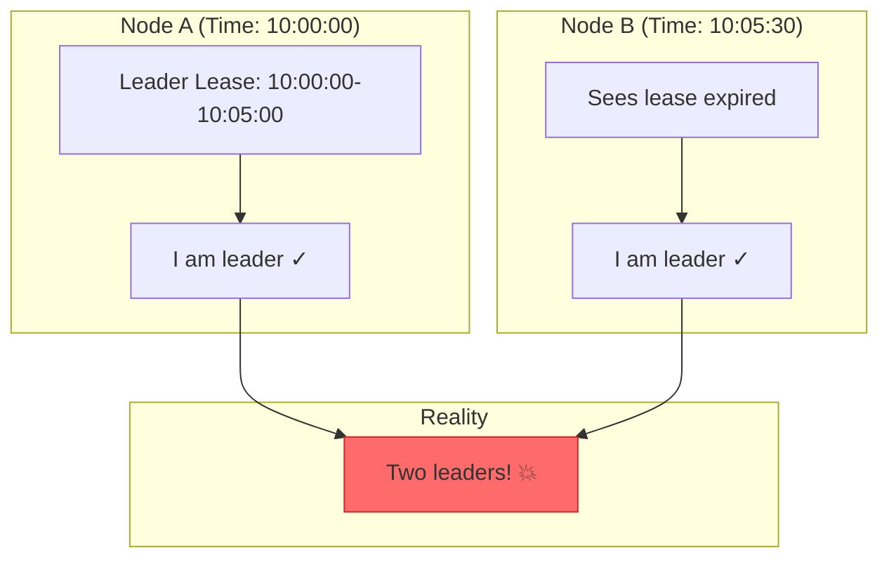
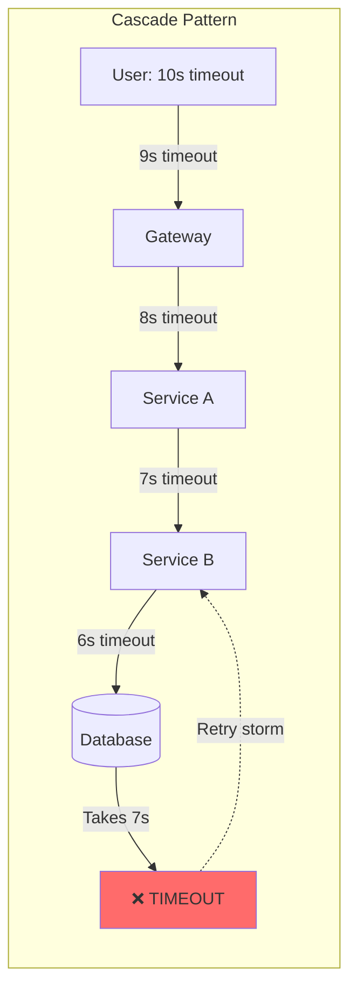
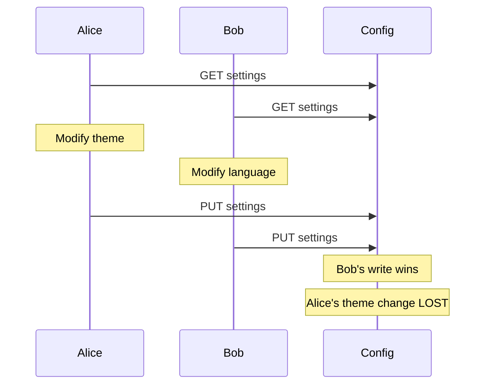
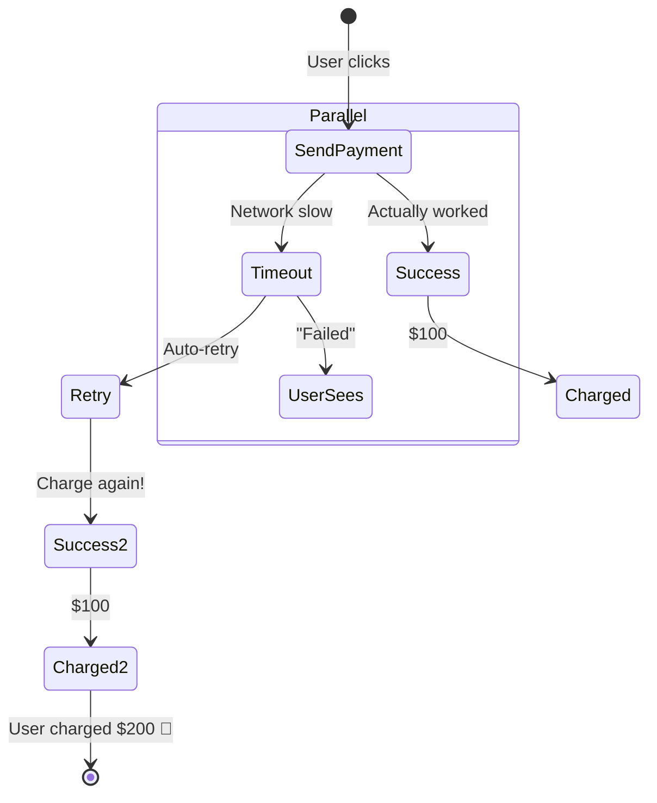
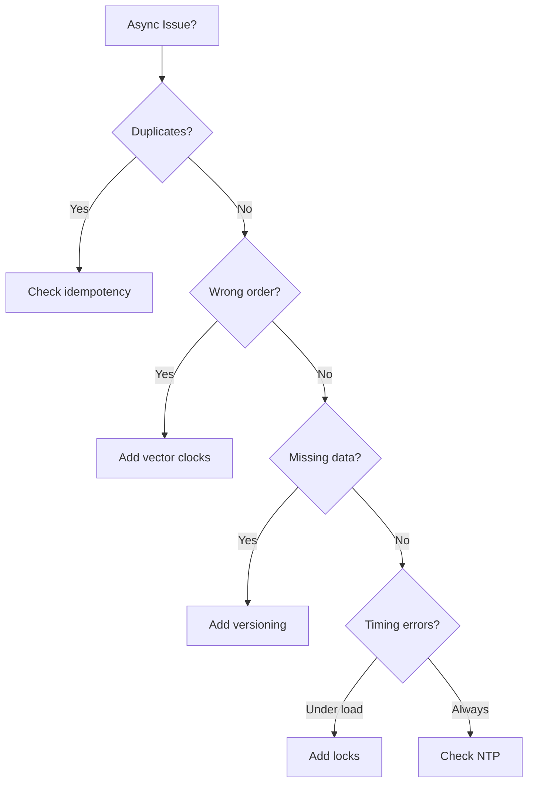

# PAGE 2 – The Six Specters of Asynchronous Failure 💥

```text
THE ASYNC HEXAGRAM
══════════════════
1. RACE   🏁       A ─┐          4. LOST UPDATE 🔄  Write A ─┐
2. CLOCK  🕐        └─┼→ ?          Write B ─┘  Who wins?
3. TIMEOUT⏱  A→B→C→ timeout       5. PHANTOM 👻  Timeout + Success
                                      "Charged twice!"
6. CAUSAL 🌀  Reply before question
```

## The Six Specters: Pattern Recognition Guide

| Specter                    | Dashboard Signature               | Real-World Case               | Instant Antidote            |
| -------------------------- | --------------------------------- | ----------------------------- | --------------------------- |
| **Race condition**         | Error bursts only under load-test | Knight Capital '12            | Atomic op / optimistic lock |
| **Clock skew split-brain** | Dual leaders in logs              | GitHub MySQL '20              | Majority quorum             |
| **Timeout cascade**        | p99 latency ↑, RPS 3×             | DynamoDB '15                  | Timeout budget + breaker    |
| **Lost update**            | Dirty-write conflicts             | GitHub settings inconsistency | Version field               |
| **Phantom op**             | Duplicate mutations after retry   | Stripe double charge '18      | Idempotency key             |
| **Causal violation**       | Trace shows effect→cause          | Twitter '19                   | Lamport / vector clocks     |

## Specter #1: Race Condition 🏁



<div class="failure-vignette">
<h3>🚨 Knight Capital: The $460M Race</h3>
<ul>
<li><strong>Time</strong>: 9:30 AM, August 1, 2012</li>
<li><strong>Duration</strong>: 45 minutes</li>
<li><strong>Root cause</strong>: Flag reuse + partial deployment</li>
<li><strong>Impact</strong>: 4 million unwanted trades, $460M loss</li>
<li><strong>Fix</strong>: Would have been prevented by atomic deployment checks</li>
</ul>
</div>

## Specter #2: Clock Skew Split-Brain 🕐



<div class="axiom-box">
<h3>⚡ Detection Pattern</h3>
<code>grep "became leader" logs/* | uniq -c | sort -n</code>
<p>If count > 1 in same time window = split brain</p>
</div>

## Specter #3: Timeout Cascade ⏱️



### Budget Calculation
```text
User SLA ................. 10.0 s
├─ Gateway (1 retry) ..... 9.0 s
├─ Service A (1 retry) ... 4.0 s
├─ Service B (1 retry) ... 1.8 s
├─ Database (no retry) ... 1.5 s
└─ Buffer ................ 0.5 s
```

## Specter #4: Lost Update 🔄



<div class="decision-box">
<h3>🛡️ Protection Patterns</h3>
<table>
<tr><th>Pattern</th><th>When to Use</th><th>Code</th></tr>
<tr><td>Optimistic Lock</td><td>Low contention</td><td><code>SET IF version = X</code></td></tr>
<tr><td>Atomic Operation</td><td>Simple updates</td><td><code>INCREMENT counter</code></td></tr>
<tr><td>CRDT</td><td>Multi-region</td><td><code>LWW-Register.merge()</code></td></tr>
</table>
</div>

## Specter #5: Phantom Operation 👻



<div class="failure-vignette">
<h3>🚨 Stripe Double-Charge Incident</h3>
<ul>
<li><strong>Scenario</strong>: API timeout at 25s, but operation completed at 26s</li>
<li><strong>User action</strong>: Clicked "Pay" again</li>
<li><strong>Result</strong>: Customer charged twice</li>
<li><strong>Fix</strong>: Idempotency keys now mandatory</li>
</ul>
</div>

## Specter #6: Causal Violation 🌀

```mermaid
graph LR
    subgraph "What Happened"
        A[Post: "Hello"] -->|1ms| B[Server A]
        C[Reply: "Hi!"] -->|0.5ms| D[Server B]
    end
    
    subgraph "What Users See"
        D --> E[Timeline]
        B --> E
        E --> F["Hi!" appears first 🤯]
    end
    
    style F fill:#ffd43b,stroke:#fab005
```

### Twitter's Timeline Reordering
- **Problem**: Replies appearing before original tweets
- **Cause**: Different shards, different latencies
- **Solution**: Hybrid logical clocks (physical + logical)

## Specter Dashboard

```text
┌─────────────────────────────────────────────────────┐
│                  ASYNC SPECTERS                      │
├───────────────┬────────────┬────────────────────────┤
│ Race Rate     │ ████░░░░░░ │ 23/1000 requests       │
│ Clock Skew    │ ██████████ │ 487ms max drift        │
│ Timeout Storm │ ██░░░░░░░░ │ 89 cascades/hour       │
│ Lost Updates  │ ███░░░░░░░ │ 0.3% of writes         │
│ Phantom Ops   │ █░░░░░░░░░ │ 12 duplicates/day      │
│ Causal Break  │ ████░░░░░░ │ 2.1% of conversations  │
└───────────────┴────────────┴────────────────────────┘
```

<div class="truth-box">
<h3>🎯 Universal Detection Rule</h3>
<p>If your monitoring shows:</p>
<ul>
<li>Errors only under load → Race condition</li>
<li>Impossible states → Clock skew</li>
<li>Exponential latency → Timeout cascade</li>
<li>Missing data → Lost update</li>
<li>Duplicate data → Phantom operation</li>
<li>Wrong order → Causal violation</li>
</ul>
</div>

## Quick Triage Flowchart



## Next: [Architectural Counter-Patterns →](page3-architecture.md)