# PAGE 3 – Architectural Counter-Patterns 🛠️

## Pattern-Problem Matching Matrix

| Problem                | Pattern                              | Key Rule                                     | Trade-off            |
| ---------------------- | ------------------------------------ | -------------------------------------------- | -------------------- |
| "Did it run twice?"    | **Idempotency shield**               | `request_id` = user intent, not attempt      | Extra storage        |
| Concurrent writes      | **Optimistic lock / atomic op**      | `SET IF VERSION`                             | Retry complexity     |
| Ordering across shards | **Lamport / vector clocks**          | `clock = max(local, recv)+1`                 | Metadata size        |
| Split brain            | **Raft / Paxos quorum**              | >½ votes = single writer                     | Latency 2× RTT       |
| Retry storm            | **Timeout budget + circuit breaker** | `Σ timeouts ≤ user SLA`                      | Partial availability |
| Duplicate state        | **CRDTs / LWW registers**            | Merge = associative, commutative, idempotent | Complexity           |

## Pattern #1: Idempotency Shield 🛡️


### Implementation Blueprint

```python title="Idempotency Implementation"
# ❌ WRONG: New ID per retry
def retry_payment(amount):
    for attempt in range(3):
        request_id = uuid4()  # BUG: New ID = new payment!
        send_payment(request_id, amount)

# ✅ RIGHT: One ID per user intent
def safe_payment(amount):
    request_id = uuid4()  # Generated ONCE
    for attempt in range(3):
        result = send_payment(request_id, amount)
        if result.success:
            return result
```

<div class="axiom-box">
<h3>📏 Idempotency Key Rules</h3>
<ol>
<li><strong>Scope</strong>: User intent, not technical retry</li>
<li><strong>Storage</strong>: Keep for 2× max retry window</li>
<li><strong>Format</strong>: <code>{user_id}:{action}:{timestamp}:{nonce}</code></li>
<li><strong>Cache TTL</strong>: 24 hours minimum</li>
</ol>
</div>

## Pattern #2: Optimistic Locking 🔒

```mermaid
sequenceDiagram
    participant Client
    participant Service
    participant DB
    
    Client->>Service: GET /user/123
    Service->>DB: SELECT * FROM users WHERE id=123
    DB-->>Service: {data, version: 42}
    Service-->>Client: {data, version: 42}
    
    Note over Client: Modify data
    
    Client->>Service: PUT /user/123 {data, version: 42}
    Service->>DB: UPDATE users SET data=?, version=43<br/>WHERE id=123 AND version=42
    
    alt Success
        DB-->>Service: 1 row updated ✓
        Service-->>Client: 200 OK
    else Conflict
        DB-->>Service: 0 rows updated ❌
        Service-->>Client: 409 Conflict
    end
```



### Version Field Patterns

| Type | Example | Use Case |
|------|---------|----------|
| **Integer** | `version: 1, 2, 3...` | Simple increment |
| **Timestamp** | `version: 1634567890123` | Time-based ordering |
| **UUID** | `version: "a4f5..."` | Distributed generation |
| **Hash** | `version: sha256(data)` | Content-based |

## Pattern #3: Lamport Clocks ⏰

```mermaid
graph TD
    subgraph "Node A"
        A1[LC=1] --> A2[Send msg, LC=1]
        A2 --> A3[LC=2]
        A3 --> A4[Recv, LC=max(2,3)+1=4]
    end
    
    subgraph "Node B"
        B1[LC=1] --> B2[Recv, LC=max(1,1)+1=2]
        B2 --> B3[Send msg, LC=3]
        B3 --> B4[LC=4]
    end
    
    A2 -.->|msg: LC=1| B2
    B3 -.->|msg: LC=3| A4
```

### Lamport Clock Rules

```python title="Lamport Clock Implementation"
class LamportClock:
    def __init__(self):
        self.time = 0
    
    def tick(self):
        """Increment local time for internal events"""
        self.time += 1
        
    def update(self, received_time):
        """Update time when receiving a message"""
        self.time = max(self.time, received_time) + 1
        
    def send_message(self, msg):
        self.tick()
        return {"data": msg, "lamport_time": self.time}
        
    def receive_message(self, msg):
        self.update(msg["lamport_time"])
```

## Pattern #4: Timeout Budget Architecture 📊

```text
┌─────────────────────────────────────────────────┐
│              USER SLA: 10 seconds               │
├─────────────────────────────────────────────────┤
│                                                 │
│  Gateway      ████████████████████  9.0s       │
│     ├─ Auth   ██  0.5s (no retry)              │
│     └─ API    ████████████████  8.0s           │
│                                                 │
│  Service A    ████████  4.0s (1 retry)         │
│     └─ Cache  █  0.3s (no retry)               │
│                                                 │
│  Service B    ████  1.8s (1 retry)             │
│                                                 │
│  Database     ███  1.5s (no retry)             │
│                                                 │
│  Buffer       █  0.5s                          │
└─────────────────────────────────────────────────┘
```

<div class="decision-box">
<h3>⏱️ Timeout Calculation Template</h3>
<pre>
def calculate_timeout(parent_timeout, retry_count, buffer=0.1):
    # Reserve time for retries
    single_attempt = parent_timeout / (retry_count + 1)
    
    # Subtract buffer for network variance
    return single_attempt * (1 - buffer)
    
# Example:
# Parent: 10s, 2 retries → 3.0s per attempt
# With 10% buffer → 2.7s timeout
</pre>
</div>

## Pattern #5: Circuit Breaker States 🚦


### Circuit Breaker Configuration

```yaml
circuit_breaker:
  failure_threshold: 5          # failures to open
  success_threshold: 2          # successes to close
  timeout: 30s                  # time in open state
  half_open_requests: 3         # test requests
  
  # Per-service overrides
  payment_service:
    failure_threshold: 3        # More sensitive
    timeout: 60s                # Longer recovery
```

## Pattern #6: CRDT Merge Strategies 🔄

```mermaid
graph TB
    subgraph "G-Counter CRDT"
        A[Node A: {A:5, B:3}]
        B[Node B: {A:2, B:7}]
        M[Merge: {A:5, B:7}]
        A --> M
        B --> M
        M --> R[Result: 12]
    end
    
    subgraph "LWW-Register"
        C[Node C: {val:x, ts:100}]
        D[Node D: {val:y, ts:105}]
        N[Merge: {val:y, ts:105}]
        C --> N
        D --> N
    end
```

### CRDT Selection Guide

| Use Case | CRDT Type | Example |
|----------|-----------|---------|
| Counters | G-Counter | View counts |
| Sets | OR-Set | Shopping cart |
| Maps | OR-Map | User preferences |
| Flags | Enable-Wins Flag | Feature flags |
| Text | RGA | Collaborative editing |

## Design Checklist ✅

### Before Deployment
- [ ] Each mutation has **idempotency key**
- [ ] Consensus election timeout > network p99
- [ ] All ops ordered by **logical time** not wall-clock
- [ ] **Retry ≠ safe** until proven idempotent
- [ ] **Timeout ≠ fail** → treat as *unknown*
- [ ] Circuit breakers on all external calls
- [ ] Version fields on all mutable entities
- [ ] Timeout budgets calculated and documented

### Code Review Checklist
```python
# ❌ Danger patterns to flag:
if time.now() > deadline:           # Wall clock comparison
    
for retry in range(3):
    request_id = generate_id()      # New ID per retry
    
if response.timeout:
    return "failed"                 # Timeout ≠ failure
    
data = read()
data.field = value
write(data)                         # No version check
```

<div class="truth-box">
<h3>🎯 The Golden Rule</h3>
<p><strong>Every distributed operation must be:</strong></p>
<ol>
<li><strong>Idempotent</strong> - Safe to retry</li>
<li><strong>Versioned</strong> - Detect conflicts</li>
<li><strong>Timeout-aware</strong> - Bounded wait</li>
<li><strong>Causally ordered</strong> - Respect dependencies</li>
</ol>
<p>Miss any one = eventual catastrophe</p>
</div>

## Architecture Decision Records

### ADR-001: Idempotency Strategy
**Status**: Accepted  
**Context**: Need to handle retries safely  
**Decision**: Client-generated UUIDs with 24h cache  
**Consequences**: +No duplicates, -Storage cost  

### ADR-002: Clock Synchronization
**Status**: Accepted  
**Context**: Clock skew causing split-brain  
**Decision**: Hybrid logical clocks (HLC)  
**Consequences**: +Ordering guarantee, -8 bytes overhead  

### ADR-003: Timeout Hierarchy
**Status**: Accepted  
**Context**: Cascade failures under load  
**Decision**: Hierarchical timeout budgets  
**Consequences**: +Predictable, -Complex config  

## Next: [Operations & Chaos Playbook →](page4-operations.md)