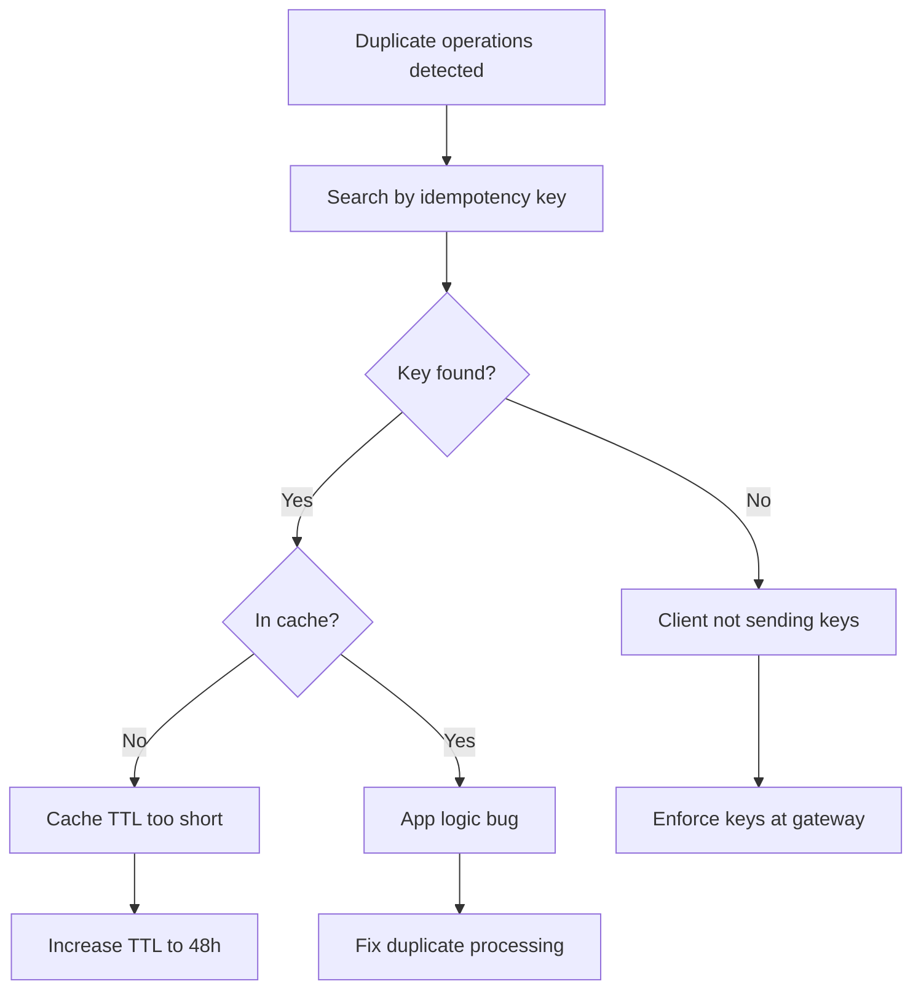
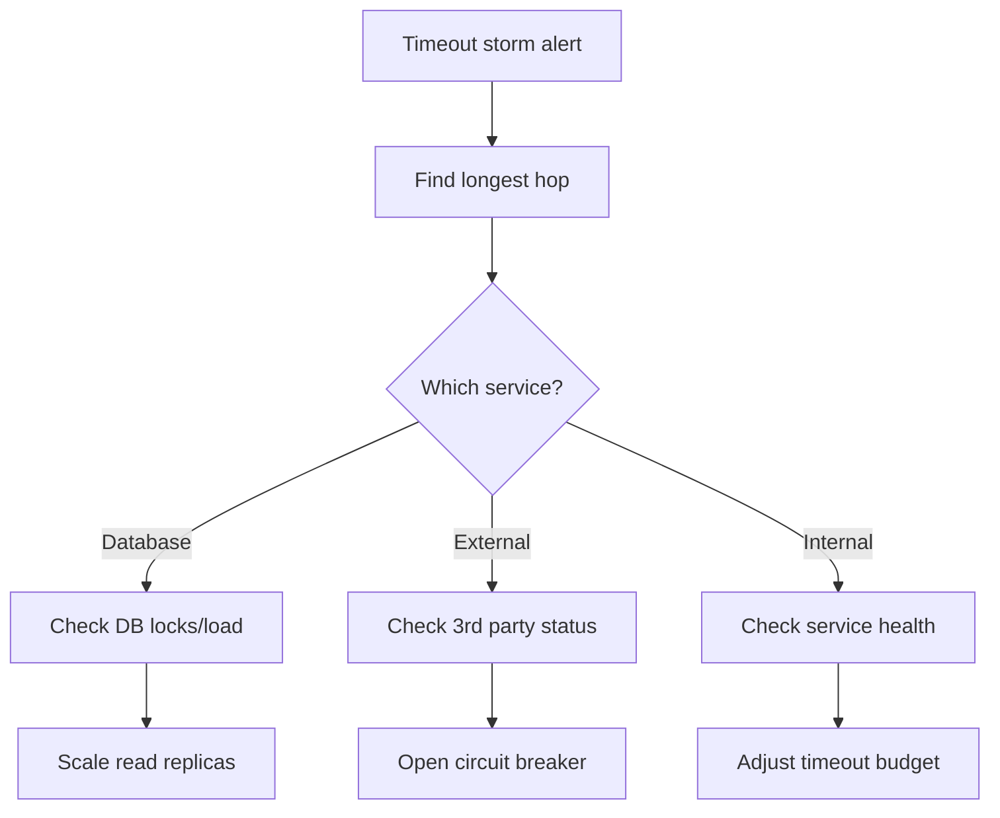

# PAGE 4 – Operations & Chaos Playbook ⚔️

## 4.1 Critical Dashboards 📊

### Master Async Health Dashboard

```text
┌─────────────────────────── ASYNC HEALTH ───────────────────────────┐
│                                                                     │
│  Clock Skew Monitor                    Timeout Cascade Detector    │
│  ┌─────────────────────┐              ┌───────────────────────┐   │
│  │ █████░░░░ 127ms MAX │              │ Gateway    ████ 4.2s │   │
│  │ Node A: +47ms       │              │ Service A  ███  3.1s │   │
│  │ Node B: -80ms       │              │ Service B  ██   2.0s │   │
│  │ Node C: +127ms ⚠️   │              │ Database   █    0.8s │   │
│  └─────────────────────┘              └───────────────────────┘   │
│                                                                     │
│  Idempotency Cache Hit Rate            Message Ordering Violations │
│  ┌─────────────────────┐              ┌───────────────────────┐   │
│  │ ████████░░ 87%      │              │ Causal: ██░ 2.1%      │   │
│  │ Misses: 13k/hour    │              │ Total:  ███ 3.4%      │   │
│  │ Size: 2.3GB         │              │ Vector: █░░ 0.3%      │   │
│  └─────────────────────┘              └───────────────────────┘   │
└─────────────────────────────────────────────────────────────────────┘
```

### Alert Thresholds

| Metric | Warn | Page | Auto-Remedy |
|--------|------|------|-------------|
| **Clock Skew** | >100ms | >500ms | `ntpdate -b pool.ntp.org` |
| **Latency Δ (user-HC)** | >500ms | >800ms | Increase timeout budget |
| **Timeout Ratio** | >5% | >10% | Open circuit breaker |
| **Idempotency Misses** | >20% | >30% | Increase cache size |
| **Retry Storm** | >100/min | >500/min | Backoff multiplier 2→3 |

## 4.2 Chaos Engineering Menu 🎲

### Beginner Chaos (Do First)
```bash
# 1. Clock Skew Injection
chaos clock drift --rate "+1s/min" --duration 5m --nodes 20%

# 2. Symmetric Network Delay
chaos network delay --latency 200ms --duration 10m --pairs all

# 3. Message Reordering
chaos network reorder --probability 0.25 --duration 5m
```

### Intermediate Chaos
```bash
# 4. Asymmetric Partition
chaos network partition --from nodeA --to nodeB --duration 60s

# 5. Slow Service
chaos cpu stress --service payment --load 80% --duration 5m

# 6. Time Jump
chaos clock jump --offset "+5m" --nodes 10%
```

### Advanced Chaos
```bash
# 7. Byzantine Clock
chaos clock byzantine --drift "random(-1s,+1s)" --nodes 33%

# 8. Cascading Timeout
chaos network delay --latency "exponential(100ms)" --cascade

# 9. Idempotency Cache Flush
chaos cache evict --type idempotency --percent 50
```

<div class="axiom-box">
<h3>🎯 Chaos Success Criteria</h3>
<ul>
<li>✅ No data loss or corruption</li>
<li>✅ No duplicate charges/operations</li>
<li>✅ Graceful degradation (not total failure)</li>
<li>✅ Auto-recovery within 2 minutes</li>
<li>✅ Clear error messages to users</li>
</ul>
</div>

## 4.3 Incident Response Flowcharts

### "Impossible Timestamps" Incident

```mermaid
graph TD
    Start[Impossible timestamps in logs?] --> Check[Check max clock skew]
    Check --> High{Skew > 500ms?}
    High -->|Yes| Sync[Force NTP sync all nodes]
    High -->|No| Drift{Drift rate > 1ms/min?}
    Drift -->|Yes| NTP[Check NTP config]
    Drift -->|No| App[Check app time handling]
    
    Sync --> Verify[Verify sync worked]
    NTP --> Fix[Fix NTP servers]
    App --> Code[Fix time.now() usage]
```

### Duplicate Operations Incident



### Timeout Storm Incident



## 4.4 Daily Standup Queries 📋

### Morning Health Check SQL

```sql
-- 1. Max Clock Skew
SELECT 
    MAX(ABS(EXTRACT(EPOCH FROM (server_time - client_time)))) as max_skew_ms,
    COUNT(CASE WHEN ABS(EXTRACT(EPOCH FROM (server_time - client_time))) > 100 THEN 1 END) as nodes_over_100ms
FROM heartbeats 
WHERE timestamp > NOW() - INTERVAL '5 minutes';

-- 2. Timeout-Retry Loops
SELECT 
    service_name,
    COUNT(*) as timeout_retries,
    AVG(retry_count) as avg_retries,
    MAX(retry_count) as max_retries
FROM requests
WHERE status = 'timeout' 
    AND retry_count > 0
    AND timestamp > NOW() - INTERVAL '24 hours'
GROUP BY service_name
ORDER BY timeout_retries DESC;

-- 3. Concurrent Write Conflicts
SELECT 
    entity_type,
    entity_id,
    COUNT(DISTINCT node_id) as concurrent_writers,
    COUNT(*) as write_attempts
FROM write_log
WHERE timestamp > NOW() - INTERVAL '1 hour'
GROUP BY entity_type, entity_id
HAVING COUNT(DISTINCT node_id) > 1
ORDER BY concurrent_writers DESC
LIMIT 10;
```

### Automated Morning Report

```text
🌅 ASYNC HEALTH REPORT - 2024-01-26 09:00 UTC
━━━━━━━━━━━━━━━━━━━━━━━━━━━━━━━━━━━━━━━━━━━
⏰ CLOCK SKEW:           127ms (⚠️ WARN)
   Affected nodes:      3 of 47
   Action:             Auto-sync triggered

🔄 RETRY STORMS:        None detected ✅

🔀 RACE CONDITIONS:     2 incidents
   - OrderService:     17 conflicts/hour
   - UserService:      3 conflicts/hour
   Action:             Review optimistic lock

⏱️ TIMEOUT BUDGET:      78% utilized (OK)
   Headroom:          2.2 seconds

🎯 IDEMPOTENCY:        94% cache hit (OK)
   Cache size:        2.3/4.0 GB
━━━━━━━━━━━━━━━━━━━━━━━━━━━━━━━━━━━━━━━━━━━
```

## 4.5 Runbooks 📖

### Runbook: Clock Skew Remediation

```bash
#!/bin/bash
# async-clock-fix.sh

# 1. Identify skewed nodes
SKEWED=$(psql -c "SELECT node_id FROM heartbeats 
    WHERE ABS(EXTRACT(EPOCH FROM (server_time - NOW()))) > 0.5")

# 2. Force sync each node
for node in $SKEWED; do
    ssh $node 'sudo ntpdate -b pool.ntp.org'
    ssh $node 'sudo systemctl restart ntpd'
done

# 3. Verify fix
sleep 10
psql -c "SELECT node_id, server_time - NOW() as skew 
    FROM heartbeats WHERE node_id IN ($SKEWED)"
```

### Runbook: Idempotency Cache Overflow

```yaml
name: Idempotency Cache Overflow
severity: P2
symptoms:
  - Duplicate charges reported
  - Cache hit rate < 70%
  - "Cache full" errors in logs

immediate_actions:
  1_increase_cache:
    command: redis-cli CONFIG SET maxmemory 8gb
    verify: redis-cli INFO memory | grep used_memory_human
    
  2_emergency_eviction:
    command: |
      redis-cli EVAL "
        local keys = redis.call('KEYS', 'idem:*')
        for i=1,#keys,1000 do
          local batch = {}
          for j=i,math.min(i+999,#keys) do
            local ttl = redis.call('TTL', keys[j])
            if ttl < 3600 then
              table.insert(batch, keys[j])
            end
          end
          if #batch > 0 then
            redis.call('DEL', unpack(batch))
          end
        end
      " 0
      
  3_monitor:
    dashboard: https://grafana/d/idempotency
    alert_threshold: hit_rate < 0.8
```

## 4.6 The "3 A.M." Certification Drill 🌙

### Setup
1. **Inject**: 500ms one-way delay (A→B only)
2. **Inject**: Clock skew +2 minutes on 30% of nodes
3. **Inject**: Drop 10% of acknowledgments
4. **Provide**: Only this page to on-call engineer

### Success Criteria
- Detect all three issues within 5 minutes
- Stabilize service within 10 minutes
- No data corruption or duplicate operations
- Clear incident report with root causes

### Grading Rubric
```text
Time to Detect:
  < 3 min  = 🥇 Gold
  < 5 min  = 🥈 Silver  
  < 10 min = 🥉 Bronze
  > 10 min = ❌ Fail

Time to Resolve:
  < 7 min  = 🥇 Gold
  < 10 min = 🥈 Silver
  < 15 min = 🥉 Bronze
  > 15 min = ❌ Fail
```

<div class="decision-box">
<h3>🚨 Emergency Contacts</h3>
<table>
<tr><th>Issue</th><th>Team</th><th>Escalation</th></tr>
<tr><td>Clock skew</td><td>Platform</td><td>@platform-oncall</td></tr>
<tr><td>Timeout cascade</td><td>Gateway</td><td>@gateway-oncall</td></tr>
<tr><td>Data inconsistency</td><td>Data Platform</td><td>@data-oncall</td></tr>
<tr><td>Unknown async issue</td><td>Architecture</td><td>@principal-oncall</td></tr>
</table>
</div>

## 4.7 Post-Incident Review Template

```markdown
## Async Incident Post-Mortem

**Incident ID**: ASYNC-2024-001  
**Duration**: 47 minutes  
**Impact**: 1,247 duplicate charges  

### Timeline
- **09:15** - Clock skew alert (Node-17: +847ms)
- **09:18** - Timeout cascade begins
- **09:22** - Duplicate operations detected
- **09:31** - Circuit breakers engaged
- **09:47** - Service stabilized
- **10:02** - All clear

### Root Cause
1. NTP server failure caused clock skew
2. Skew caused premature leader election
3. Dual leaders accepted writes
4. Retry logic lacked idempotency

### Action Items
- [ ] Add redundant NTP servers (P0)
- [ ] Implement hybrid logical clocks (P1)
- [ ] Enforce idempotency keys (P0)
- [ ] Add clock skew to pre-deploy check (P1)
```

<div class="truth-box">
<h3>🎯 The Async Operator's Oath</h3>
<blockquote>
"I shall not trust clocks, for time is relative.<br>
I shall not trust order, for messages wander.<br>
I shall not trust timeouts, for failure is uncertain.<br>
I shall trust only in idempotency, versioning, and logical time.<br>
For in asynchrony, paranoia is professionalism."
</blockquote>
</div>

## Quick Reference Card

```text
╔════════════════════════════════════════════╗
║          ASYNC EMERGENCY CARD              ║
╠════════════════════════════════════════════╣
║ CLOCK SKEW:                                ║
║   sudo ntpdate -b pool.ntp.org            ║
║                                            ║
║ TIMEOUT STORM:                             ║
║   kubectl rollout restart deployment/gateway║
║                                            ║
║ DUPLICATE OPS:                             ║
║   SELECT * FROM requests                  ║
║   WHERE idempotency_key = 'XXX';          ║
║                                            ║
║ SPLIT BRAIN:                               ║
║   etcdctl endpoint status                 ║
║   # Check leader IDs                       ║
╚════════════════════════════════════════════╝
```

---

[← Back to Architecture](page3-architecture.md) | [Home](../index.md)