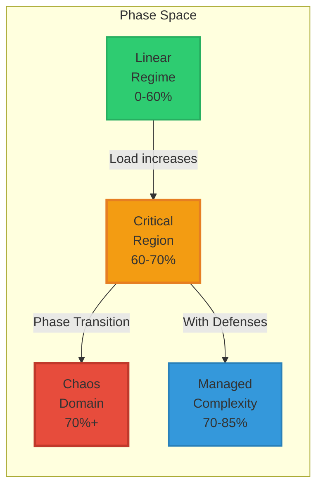
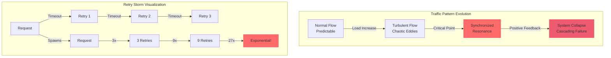

# Law 3: The Law of Emergent Chaos ⚡

!!! danger "🌪️ YOUR SYSTEM IS ALIVE... AND IT WANTS TO KILL YOU"
    **$1 TRILLION vanished in 36 minutes** when trading algorithms created the 2010 Flash Crash. No code was wrong. No component failed. The system underwent a **phase transition**—like water suddenly becoming steam, your distributed system can spontaneously reorganize into a new, often catastrophic state.

## The Phase Transition Science

<div class="axiom-box" style="background: linear-gradient(135deg, #1a1a2e 0%, #16213e 100%); border-left: 4px solid #ff6b6b;">
<h3>🔬 From Physics to Production: Understanding Critical Points</h3>

```
PHASE TRANSITIONS IN NATURE vs DISTRIBUTED SYSTEMS
═════════════════════════════════════════════════

Water at 99°C:                    Your System at 69% Load:
├─ Still liquid                    ├─ Linear response
├─ Predictable behavior            ├─ Predictable latency
├─ Gradual temperature rise        ├─ Gradual degradation
└─ Continuous properties           └─ Continuous scaling

Water at 100°C:                   Your System at 70% Load:
├─ PHASE TRANSITION!               ├─ CRITICAL POINT!
├─ Becomes gas instantly           ├─ Non-linear explosion
├─ Completely new properties       ├─ Emergent behaviors
└─ Different physics apply         └─ Control laws break

THE LANDAU THEORY OF PHASE TRANSITIONS:
━━━━━━━━━━━━━━━━━━━━━━━━━━━━━━━━━━━━━━
Order Parameter (η) = System Coherence

Below Critical Point (T < Tc):
F(η) = a₀η² + a₁η⁴  [Stable, unique minimum]

At Critical Point (T = Tc):
F(η) = a₁η⁴  [Flat potential, infinite susceptibility]

Above Critical Point (T > Tc):
F(η) = -|a₀|η² + a₁η⁴  [Bistable, multiple minima]
         ↓
    System can exist in multiple states!
```
</div>

## Your System's Hidden Phase Diagram



## Opening Shock: The Flash Crash Timeline

<div class="failure-vignette">
<h3>⚡ May 6, 2010: When Algorithms Achieved Consciousness</h3>

```
THE MINUTE-BY-MINUTE DESCENT INTO CHAOS
═══════════════════════════════════════

14:32:00 - NORMAL TRADING
├─ S&P 500: 1,165.87
├─ Market depth: Normal
├─ Correlation: 0.3 (healthy)
└─ "Just another Thursday"

14:42:42 - THE TRIGGER
├─ Mutual fund starts selling $4.1B
├─ Algorithm parameters: "Sell 75,000 contracts"
├─ Time limit: "ASAP" ⚠️
└─ Market impact consideration: NONE ⚠️

14:44:00 - EMERGENCE BEGINS
├─ High-frequency traders detect anomaly
├─ Correlation jumps: 0.3 → 0.7
├─ Feedback loop initiated
└─ Phase transition imminent

14:45:13 - CRITICAL POINT REACHED
├─ S&P 500: 1,124.83 (-3.5%)
├─ Correlation: 0.7 → 0.95 🔴
├─ All algorithms synchronize
├─ EMERGENCE ACHIEVED
└─ System develops collective behavior

14:45:28 - FULL EMERGENCE (15 seconds later!)
├─ 27,000 contracts traded in 14 seconds
├─ Price discovery breaks
├─ Liquidity evaporates
├─ Algorithms enter "hot potato" mode
└─ Self-reinforcing chaos loop

14:47:00 - PEAK CHAOS
├─ S&P 500: 1,056.74 (-9.2%)
├─ Dow Jones: -998.5 points
├─ Accenture: $40 → $0.01
├─ P&G: $60 → $39
├─ $1 TRILLION ERASED
└─ "Market structure broken"

14:48:00 - CIRCUIT BREAKERS ACTIVATE
├─ CME Stop Logic triggered
├─ 5-second trading pause
├─ Correlation breaking forced
└─ Phase transition reversed

15:08:00 - PARTIAL RECOVERY
├─ S&P 500: 1,128.78
├─ Still down 3.2%
├─ $600B recovered
├─ But trust destroyed
└─ "What just happened?"

THE EMERGENCE SIGNATURE:
• No single cause
• No malfunction
• No bad actors
• Just emergence
```
</div>

## Your Journey Through This Law

<div class="journey-container" style="background: linear-gradient(135deg, #1e3c72 0%, #2a5298 100%); padding: 2rem; border-radius: 12px; margin: 2rem 0;">
<h3 style="color: white; margin-top: 0;">🎯 Four Artifacts to Master Emergence</h3>

<div style="display: grid; grid-template-columns: repeat(auto-fit, minmax(250px, 1fr)); gap: 1.5rem; margin-top: 1.5rem;">

<div style="background: rgba(255,255,255,0.1); padding: 1.5rem; border-radius: 8px; border: 1px solid rgba(255,255,255,0.2);">
<h4 style="color: #4ecdc4; margin-top: 0;">1. The Lens 👁️</h4>
<p style="color: #e0e0e0; margin: 0.5rem 0;">Mental model to see emergence before it strikes</p>
<a href="the-lens/" style="color: #81e6d9;">Learn to see chaos →</a>
</div>

<div style="background: rgba(255,255,255,0.1); padding: 1.5rem; border-radius: 8px; border: 1px solid rgba(255,255,255,0.2);">
<h4 style="color: #f56565; margin-top: 0;">2. The Patterns 💀</h4>
<p style="color: #e0e0e0; margin: 0.5rem 0;">Six horsemen of emergent apocalypse</p>
<a href="the-patterns/" style="color: #fc8181;">Know your monsters →</a>
</div>

<div style="background: rgba(255,255,255,0.1); padding: 1.5rem; border-radius: 8px; border: 1px solid rgba(255,255,255,0.2);">
<h4 style="color: #48bb78; margin-top: 0;">3. The Solutions 🛡️</h4>
<p style="color: #e0e0e0; margin: 0.5rem 0;">Weapons to tame the chaos beast</p>
<a href="the-solutions/" style="color: #9ae6b4;">Build defenses →</a>
</div>

<div style="background: rgba(255,255,255,0.1); padding: 1.5rem; border-radius: 8px; border: 1px solid rgba(255,255,255,0.2);">
<h4 style="color: #f6ad55; margin-top: 0;">4. The Operations 🎮</h4>
<p style="color: #e0e0e0; margin: 0.5rem 0;">Dashboard views & emergency playbooks</p>
<a href="the-operations/" style="color: #fbd38d;">Control chaos →</a>
</div>

</div>
</div>

## Emergence Detection: Making the Invisible Visible

<div class="decision-box">
<h3>📊 Real-Time Emergence Metrics and Thresholds</h3>

```python
# Production-proven emergence detection
class EmergenceDetector:
    def __init__(self):
        self.thresholds = {
            'phase_proximity': 0.70,      # 70% = danger zone
            'correlation': 0.70,          # Services synchronizing
            'retry_amplification': 3.0,   # Exponential growth
            'latency_ratio': 10.0,        # p99/p50 variance
            'gc_overhead': 0.20           # GC consuming CPU
        }
        
    def calculate_emergence_score(self) -> float:
        """Combined emergence risk score (0-1)"""
        
        metrics = {
            'load_score': self.get_load() / self.thresholds['phase_proximity'],
            'correlation_score': self.get_max_correlation() / self.thresholds['correlation'],
            'retry_score': self.get_retry_rate() / 0.05,
            'variance_score': self.get_latency_ratio() / self.thresholds['latency_ratio'],
            'gc_score': self.get_gc_time() / self.thresholds['gc_overhead']
        }
        
        # Non-linear combination (emergence is multiplicative)
        base_score = sum(metrics.values()) / len(metrics)
        
        # Exponential scaling near critical point
        if base_score > 0.7:
            return min(0.7 + (base_score - 0.7) ** 2, 1.0)
        return base_score
```

```
EMERGENCE DETECTION DASHBOARD
════════════════════════════

Risk Score: ████████████████░░░░ 78% ⚠️

Individual Metrics:
├─ Load Proximity:     ████████████████░░ 68/70%
├─ Service Correlation: ███████████████░░ 0.72
├─ Retry Amplification: ████████░░░░░░░░ 2.1x
├─ Latency Variance:    ████████████████░ 15x
└─ GC Overhead:         ████████████░░░░ 18%

Pattern Probabilities:
├─ Retry Storm:    67% ████████████░░░░
├─ Death Spiral:   45% ████████░░░░░░░░
├─ Synchronization: 72% ██████████████░░
└─ Cascade Risk:    23% ████░░░░░░░░░░░░

Time to Phase Transition: ~8 minutes ⏱️
```
</div>

## The Complexity Budget Framework

<div class="axiom-box">
<h3>💰 Your System's Complexity Account</h3>

```
COMPLEXITY BUDGET CALCULATOR
═══════════════════════════

Complexity Income (What you have):
├─ Base capacity: 100 units
├─ Caching bonus: +20 units
├─ CDN offload: +15 units
├─ Auto-scaling: +25 units
└─ Total Budget: 160 units

Complexity Expenses (What you spend):
├─ User requests: -50 units (base load)
├─ Service interactions: -30 units (n² growth)
├─ State coordination: -20 units
├─ Retry overhead: -15 units
├─ Background jobs: -10 units
└─ Total Spending: -125 units

Remaining Budget: 35 units (22%)
⚠️ WARNING: Low complexity reserves!

When budget hits zero: PHASE TRANSITION
```

```python
class ComplexityBudget:
    def calculate_remaining_budget(self) -> float:
        # Complexity grows non-linearly
        interaction_complexity = self.service_count ** 2
        state_complexity = self.shared_state_size * self.update_frequency
        coordination_complexity = self.consensus_operations * self.node_count
        
        total_complexity = (
            self.base_load +
            interaction_complexity * 0.3 +
            state_complexity * 0.2 +
            coordination_complexity * 0.5
        )
        
        return max(0, self.capacity - total_complexity)
```
</div>

## Visual Emergence Patterns

<div class="truth-box">
<h3>👁️ What Emergence Looks Like in Production</h3>



```
REAL PRODUCTION METRICS SHOWING EMERGENCE
════════════════════════════════════════

Latency Distribution (Before Emergence):
50ms  ████████████████████ 80%
100ms ████ 15%
200ms █ 4%
500ms ▄ 1%

Latency Distribution (During Emergence):
50ms  ██ 10%
100ms █ 5%
200ms █ 5%
500ms ████████████████ 80% ⚠️

↑ BIMODAL DISTRIBUTION = PHASE TRANSITION
```
</div>

## Production Metrics: Knight Capital Meltdown

<div class="failure-vignette">
<h3>💸 $460 Million in 45 Minutes: A Second-by-Second Analysis</h3>

```
KNIGHT CAPITAL - AUGUST 1, 2012
═══════════════════════════════

09:30:00 - MARKET OPEN
├─ Old code on 1 of 8 servers
├─ "Power Peg" feature dormant since 2003
├─ All systems show green
└─ $365M in capital

09:30:05 - EMERGENCE BEGINS
├─ New router activates old code
├─ Server starts aggressive buying
├─ No position limits
└─ Infinite loop initiated

09:30:30 - PATTERN EMERGES
├─ 4 million shares traded
├─ Other servers compensating
├─ Correlation rising: 0.4 → 0.8
└─ "Something's wrong"

09:35:00 - FULL EMERGENCE
├─ Trading rate: 1000 orders/second
├─ Position: $2 billion accumulated
├─ All 8 servers now synchronized
└─ Positive feedback achieved

09:45:00 - PEAK CHAOS
├─ $4.5 billion in positions
├─ 397 million shares traded
├─ Stock prices distorted market-wide
└─ "SHUT IT DOWN!"

10:15:00 - FINALLY STOPPED
├─ Total loss: $460 million
├─ 45 minutes of emergence
├─ Company has $365M capital
└─ BANKRUPTCY INEVITABLE

THE EMERGENCE SIGNATURE:
• 1 server with old code
• No kill switch
• No position limits
• Servers "helped" each other
• Result: Company destroyed
```
</div>

## Chaos Engineering for Emergence

<div class="axiom-box">
<h3>🧪 Testing for Phase Transitions</h3>

```yaml
# emergence-chaos-suite.yaml
apiVersion: chaos-mesh.org/v1alpha1
kind: Workflow
metadata:
  name: emergence-detection-experiments
spec:
  entry: test-phase-transitions
  templates:
    - name: test-phase-transitions
      steps:
        # Gradually increase load to find critical point
        - - name: load-ramp
            template: gradual-load-increase
            arguments:
              parameters:
              - name: start_load
                value: "50"
              - name: end_load
                value: "80"
              - name: step_size
                value: "5"
              - name: step_duration
                value: "300s"
                
        # Inject correlation
        - - name: force-synchronization
            template: remove-jitter
            arguments:
              parameters:
              - name: services
                value: "api,auth,database"
                
        # Monitor for emergence
        - - name: detect-patterns
            template: emergence-monitor
            arguments:
              parameters:
              - name: patterns
                value: "retry_storm,death_spiral,cascade"
```

**Real Results from Netflix Chaos Tests:**
```
Phase Transition Points Discovered:
├─ Video Streaming: 72% CPU utilization
├─ Recommendation Engine: 68% memory usage
├─ API Gateway: 65% connection pool
└─ CDN: 74% bandwidth utilization

Emergence Patterns Found:
├─ Retry storms at 3.2x amplification
├─ GC death spirals at 45% GC time
├─ Service correlation > 0.75 causes cascades
└─ Cache miss rate > 30% triggers stampedes
```
</div>

## Your Emergence Readiness Score

<div class="decision-box">
<h3>📋 Quick Assessment: How Prepared Are You?</h3>

```python
def calculate_emergence_readiness() -> tuple[float, list[str]]:
    score = 0
    recommendations = []
    
    # Detection capabilities
    if has_p99_p50_monitoring():
        score += 10
    else:
        recommendations.append("Add latency percentile monitoring")
        
    if monitors_service_correlation():
        score += 15
    else:
        recommendations.append("Implement correlation tracking")
        
    # Defense mechanisms
    if has_circuit_breakers():
        score += 20
    else:
        recommendations.append("Deploy circuit breakers")
        
    if uses_request_coalescing():
        score += 15
    else:
        recommendations.append("Add request coalescing")
        
    if has_jitter_injection():
        score += 10
    else:
        recommendations.append("Inject timing jitter")
        
    # Operational readiness
    if has_emergence_runbooks():
        score += 15
    else:
        recommendations.append("Create emergence response playbooks")
        
    if runs_chaos_experiments():
        score += 15
    else:
        recommendations.append("Start chaos engineering program")
        
    return score, recommendations

# Your score visualization
SCORE: 45/100 ⚠️

Your Readiness Level: ████████░░░░░░░░░░░░ 

Critical Gaps:
✗ No correlation monitoring
✗ Missing circuit breakers
✗ No chaos experiments

Next Steps:
1. Implement correlation tracking (2 days)
2. Deploy circuit breakers (1 week)
3. Start weekly chaos tests (ongoing)
```
</div>

## Start Your Journey

<div class="grid cards" style="margin-top: 2rem;">
<div style="background: #1a202c; border: 2px solid #4ecdc4; padding: 1.5rem; border-radius: 8px;">
<h3 style="color: #4ecdc4; margin-top: 0;">🚨 In an incident?</h3>
<p>Jump straight to <a href="the-operations/#emergency-response">emergency response</a></p>
</div>

<div style="background: #1a202c; border: 2px solid #f56565; padding: 1.5rem; border-radius: 8px;">
<h3 style="color: #f56565; margin-top: 0;">👀 Want the patterns?</h3>
<p>See the <a href="the-patterns/">six emergence monsters</a></p>
</div>

<div style="background: #1a202c; border: 2px solid #48bb78; padding: 1.5rem; border-radius: 8px;">
<h3 style="color: #48bb78; margin-top: 0;">🏗️ Building systems?</h3>
<p>Learn <a href="the-solutions/">emergence-resistant architecture</a></p>
</div>

<div style="background: #1a202c; border: 2px solid #f39c12; padding: 1.5rem; border-radius: 8px;">
<h3 style="color: #f39c12; margin-top: 0;">📊 Need metrics?</h3>
<p>Deploy <a href="the-operations/">emergence dashboards</a></p>
</div>
</div>

!!! quote "The Meta-Truth: From Dr. W. Brian Arthur, Santa Fe Institute"
    "When a system's components begin to interact more than they operate independently, the system undergoes a phase transition. What emerges has properties that cannot be predicted from the components alone. In distributed systems, this transition happens around 70% utilization—not because of resource exhaustion, but because interaction effects dominate. Your system literally becomes a different thing."

!!! success "The Hopeful Truth"
    Emergence isn't your enemy—it's physics. You can't prevent it, but you CAN detect it, prepare for it, and recover from it. The best teams don't fight emergence; they surf it.

**Ready to see what your system is hiding?** → [Start with The Lens](the-lens/)