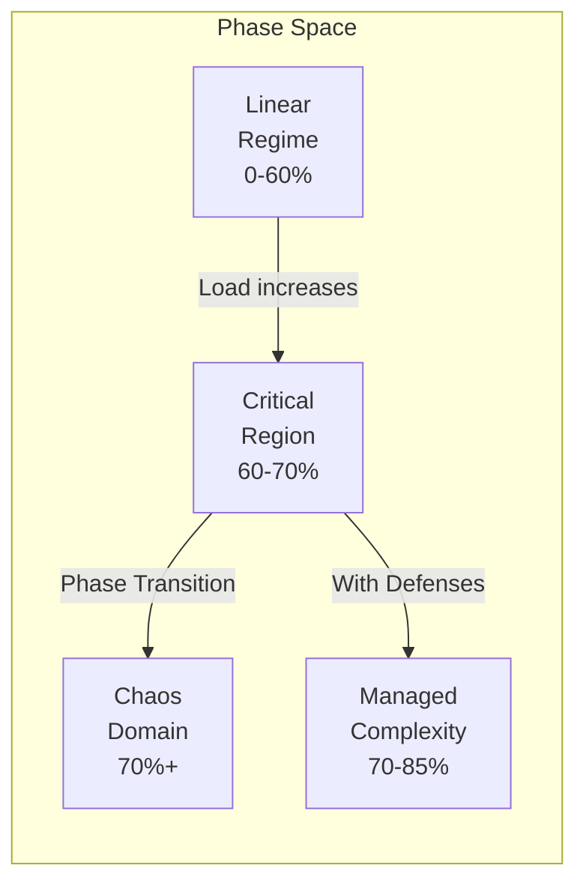
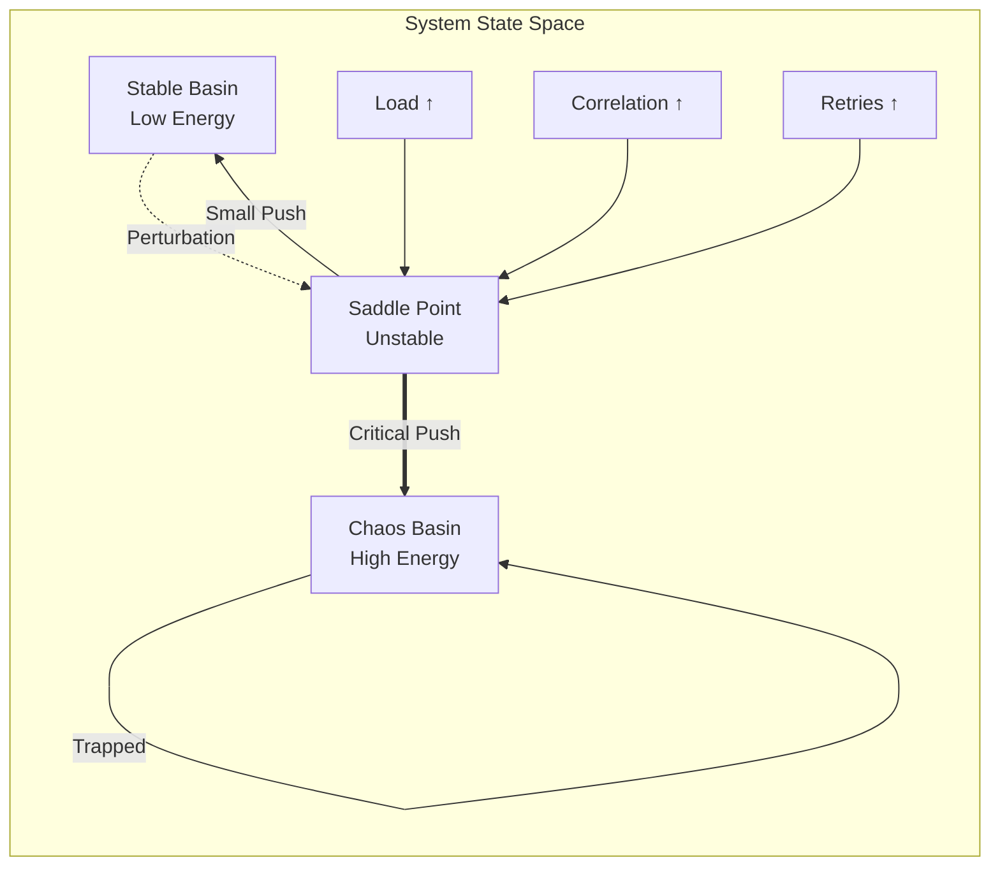
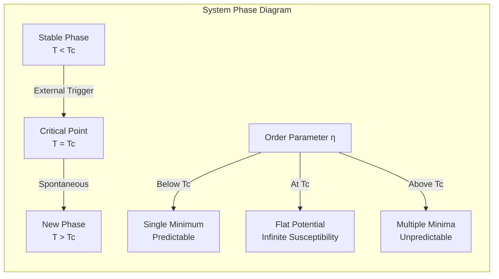

# Law 3: The Law of Emergent Chaos

<iframe style="border-radius:12px" src="https://open.spotify.com/embed/episode/4k0EdaQuB2KKe98VOuWpio?utm_source=generator&theme=0" width="100%" height="152" frameBorder="0" allowfullscreen="" allow="autoplay; clipboard-write; encrypted-media; fullscreen; picture-in-picture" loading="lazy"></iframe>

!!! danger "YOUR SYSTEM IS ALIVE... AND IT WANTS TO KILL YOU"
    **$1 TRILLION vanished in 36 minutes** when trading algorithms created the 2010 Flash Crash. No code was wrong. No component failed. The system underwent a **phase transition**—like water suddenly becoming steam, your distributed system can spontaneously reorganize into a new, often catastrophic state.

## The Phase Transition Science

!!! info "From Physics to Production: Understanding Critical Points"
    ```
    PHASE TRANSITIONS IN NATURE vs DISTRIBUTED SYSTEMS
    ═════════════════════════════════════════════════
    
    Water at 99°C:                    Your System at 69% Load:
    ├─ Still liquid                    ├─ Linear response
    ├─ Predictable behavior            ├─ Predictable latency
    ├─ Gradual temperature rise        ├─ Gradual degradation
    └─ Continuous properties           └─ Continuous scaling
    
    Water at 100°C:                   Your System at 70% Load:
    ├─ PHASE TRANSITION!               ├─ CRITICAL POINT!
    ├─ Becomes gas instantly           ├─ Non-linear explosion
    ├─ Completely new properties       ├─ Emergent behaviors
    └─ Different physics apply         └─ Control laws break
    
    THE LANDAU THEORY OF PHASE TRANSITIONS:
    ━━━━━━━━━━━━━━━━━━━━━━━━━━━━━━━━━━━━━━
    Order Parameter (η) = System Coherence
    
    Below Critical Point (T < Tc):
    F(η) = a₀η² + a₁η⁴  [Stable, unique minimum]
    
    At Critical Point (T = Tc):
    F(η) = a₁η⁴  [Flat potential, infinite susceptibility]
    
    Above Critical Point (T > Tc):
    F(η) = -|a₀|η² + a₁η⁴  [Bistable, multiple minima]
             ↓
        System can exist in multiple states!
    ```

## Your System's Hidden Phase Diagram



## Opening Shock: The Flash Crash Timeline

!!! example "May 6, 2010: When Algorithms Achieved Consciousness"
    ```
    THE MINUTE-BY-MINUTE DESCENT INTO CHAOS
    ═══════════════════════════════════════
    
    14:32:00 - NORMAL TRADING
    ├─ S&P 500: 1,165.87
    ├─ Market depth: Normal
    ├─ Correlation: 0.3 (healthy)
    └─ "Just another Thursday"
    
    14:42:42 - THE TRIGGER
    ├─ Mutual fund starts selling $4.1B
    ├─ Algorithm parameters: "Sell 75,000 contracts"
    ├─ Time limit: "ASAP"
    └─ Market impact consideration: NONE
    
    14:44:00 - EMERGENCE BEGINS
    ├─ High-frequency traders detect anomaly
    ├─ Correlation jumps: 0.3 → 0.7
    ├─ Feedback loop initiated
    └─ Phase transition imminent
    
    14:45:13 - CRITICAL POINT REACHED
    ├─ S&P 500: 1,124.83 (-3.5%)
    ├─ Correlation: 0.7 → 0.95
    ├─ All algorithms synchronize
    ├─ EMERGENCE ACHIEVED
    └─ System develops collective behavior
    
    14:45:28 - FULL EMERGENCE (15 seconds later!)
    ├─ 27,000 contracts traded in 14 seconds
    ├─ Price discovery breaks
    ├─ Liquidity evaporates
    ├─ Algorithms enter "hot potato" mode
    └─ Self-reinforcing chaos loop
    
    14:47:00 - PEAK CHAOS
    ├─ S&P 500: 1,056.74 (-9.2%)
    ├─ Dow Jones: -998.5 points
    ├─ Accenture: $40 → $0.01
    ├─ P&G: $60 → $39
    ├─ $1 TRILLION ERASED
    └─ "Market structure broken"
    
    14:48:00 - CIRCUIT BREAKERS ACTIVATE
    ├─ CME Stop Logic triggered
    ├─ 5-second trading pause
    ├─ Correlation breaking forced
    └─ Phase transition reversed
    
    15:08:00 - PARTIAL RECOVERY
    ├─ S&P 500: 1,128.78
    ├─ Still down 3.2%
    ├─ $600B recovered
    ├─ But trust destroyed
    └─ "What just happened?"
    
    THE EMERGENCE SIGNATURE:
    • No single cause
    • No malfunction
    • No bad actors
    • Just emergence
    ```

!!! danger "🚨 SYSTEM ENTERING PHASE TRANSITION? Crisis Checklist:"
    1. **[Check Critical Indicators](the-operations.md#emergence-detection)** – Load, correlation, feedback loops?
    2. **[Identify Emergence Pattern](the-patterns.md)** – Retry-Storm/Thundering-Herd/Death-Spiral/Metastable?
    3. **[Apply Circuit Breakers](the-patterns.md#defense-patterns)** – Break feedback loops NOW
    4. **[Activate Load Shedding](the-operations.md#emergency-controls)** – Move away from critical point

## Your Journey Through This Law

=== "The Lens"
    **Mental model to see emergence before it strikes**
    
    Learn how to spot the early warning signs of emergence, understand phase transitions, and develop the intuition to sense when your system is approaching critical points.
    
    [Learn to see chaos →](the-lens/)

=== "The Patterns"
    **Six horsemen of emergent apocalypse**
    
    Deep dive into the six most destructive emergence patterns: Retry Storms, Thundering Herds, Death Spirals, Synchronization, Cascade Failures, and Metastable States.
    
    [Know your monsters →](the-patterns/)

=== "The Solutions"
    **Weapons to tame the chaos beast**
    
    Engineering patterns and defensive mechanisms to prevent, detect, and recover from emergence: Circuit Breakers, Load Shedding, Request Coalescing, Jitter Injection, and more.
    
    [Build defenses →](the-solutions/)

=== "The Operations"
    **Dashboard views & emergency playbooks**
    
    Production-ready dashboards, monitoring queries, chaos experiments, and emergency response procedures for when emergence strikes.
    
    [Control chaos →](the-operations/)

## Emergence Detection: Making the Invisible Visible

!!! tip "Real-Time Emergence Metrics and Thresholds"
    ```python
    # Production-proven emergence detection
    class EmergenceDetector:
        def __init__(self):
            self.thresholds = {
                'phase_proximity': 0.70,      # 70% = danger zone
                'correlation': 0.70,          # Services synchronizing
                'retry_amplification': 3.0,   # Exponential growth
                'latency_ratio': 10.0,        # p99/p50 variance
                'gc_overhead': 0.20           # GC consuming CPU
            }
            
        def calculate_emergence_score(self) -> float:
            """Combined emergence risk score (0-1)"""
            
            metrics = {
                'load_score': self.get_load() / self.thresholds['phase_proximity'],
                'correlation_score': self.get_max_correlation() / self.thresholds['correlation'],
                'retry_score': self.get_retry_rate() / 0.05,
                'variance_score': self.get_latency_ratio() / self.thresholds['latency_ratio'],
                'gc_score': self.get_gc_time() / self.thresholds['gc_overhead']
            }
            
            # Non-linear combination (emergence is multiplicative)
            base_score = sum(metrics.values()) / len(metrics)
            
            # Exponential scaling near critical point
            if base_score > 0.7:
                return min(0.7 + (base_score - 0.7) ** 2, 1.0)
            return base_score
    ```
    
    ```
    EMERGENCE DETECTION DASHBOARD
    ════════════════════════════
    
    Risk Score: ████████████████░░░░ 78%
    
    Individual Metrics:
    ├─ Load Proximity:     ████████████████░░ 68/70%
    ├─ Service Correlation: ███████████████░░ 0.72
    ├─ Retry Amplification: ████████░░░░░░░░ 2.1x
    ├─ Latency Variance:    ████████████████░ 15x
    └─ GC Overhead:         ████████████░░░░ 18%
    
    Pattern Probabilities:
    ├─ Retry Storm:    67% ████████████░░░░
    ├─ Death Spiral:   45% ████████░░░░░░░░
    ├─ Synchronization: 72% ██████████████░░
    └─ Cascade Risk:    23% ████░░░░░░░░░░░░
    
    Time to Phase Transition: ~8 minutes
    ```

### Critical Point Indicators: The Science of Detection

!!! info "Mathematical Indicators of Approaching Phase Transitions"
    ```python
    class CriticalPointDetector:
        """Detects phase transitions using physics-based indicators"""
        
        def calculate_critical_indicators(self) -> dict:
            """Returns early warning signals based on critical phenomena theory"""
            
            # 1. Critical Slowing Down
            # Near phase transition, system takes longer to recover from perturbations
            recovery_time = self.measure_impulse_response_recovery()
            critical_slowing = recovery_time / self.baseline_recovery_time
            
            # 2. Increasing Variance
            # Fluctuations grow as system approaches critical point
            metric_variance = self.calculate_metric_variance(window='5m')
            variance_growth = metric_variance / self.baseline_variance
            
            # 3. Flickering
            # System rapidly switches between states near transition
            state_switches = self.count_state_transitions(window='1m')
            flickering_rate = state_switches / 60  # switches per second
            
            # 4. Spatial Correlation
            # Components become increasingly correlated
            correlation_length = self.calculate_correlation_length()
            
            # 5. Critical Exponents
            # Power law scaling near critical point
            scaling_exponent = self.fit_power_law(self.get_response_times())
            
            return {
                'critical_slowing_factor': critical_slowing,
                'variance_amplification': variance_growth,
                'flickering_rate': flickering_rate,
                'correlation_length': correlation_length,
                'scaling_exponent': scaling_exponent,
                'distance_to_critical': self.estimate_distance_to_critical_point()
            }
    ```
    
    **Phase Transition Thresholds from Production Systems:**
    
    | System Component | Critical Point | Early Warning at | Emergency at |
    |-----------------|----------------|------------------|--------------|
    | CPU Utilization | 70% | 65% | 68% |
    | Memory Pressure | 85% | 80% | 83% |
    | Queue Depth | 80% capacity | 70% | 75% |
    | Connection Pool | 75% | 65% | 70% |
    | Thread Pool | 70% | 60% | 65% |
    | Network Bandwidth | 65% | 55% | 60% |
    | Disk I/O | 80% | 70% | 75% |

### Complexity Metrics: Quantifying System Chaos

!!! abstract "Measuring System Complexity in Real-Time"
    ```python
    class ComplexityMetrics:
        """Quantifies system complexity using information theory and graph analysis"""
        
        def calculate_system_entropy(self) -> float:
            """Shannon entropy of system state distribution"""
            state_distribution = self.get_state_distribution()
            entropy = -sum(p * log2(p) for p in state_distribution if p > 0)
            return entropy / log2(len(state_distribution))  # Normalized 0-1
            
        def calculate_kolmogorov_complexity(self) -> float:
            """Approximates algorithmic complexity via compression ratio"""
            system_state = self.serialize_system_state()
            compressed = zlib.compress(system_state.encode())
            return len(compressed) / len(system_state)
            
        def calculate_interaction_complexity(self) -> float:
            """Graph-based complexity from service interactions"""
            interaction_graph = self.build_interaction_graph()
            
            # Cyclomatic complexity
            edges = interaction_graph.number_of_edges()
            nodes = interaction_graph.number_of_nodes()
            components = nx.number_connected_components(interaction_graph)
            cyclomatic = edges - nodes + 2 * components
            
            # Normalized by maximum possible complexity
            max_edges = nodes * (nodes - 1) / 2
            return cyclomatic / max_edges
            
        def calculate_temporal_complexity(self) -> float:
            """Lyapunov exponent: sensitivity to initial conditions"""
            trajectories = self.simulate_parallel_executions(n=100)
            divergence_rate = self.calculate_trajectory_divergence(trajectories)
            return min(1.0, divergence_rate / self.chaos_threshold)

## The Complexity Budget Framework

!!! abstract "Your System's Complexity Account"
    ```
    COMPLEXITY BUDGET CALCULATOR
    ═══════════════════════════
    
    Complexity Income (What you have):
    ├─ Base capacity: 100 units
    ├─ Caching bonus: +20 units
    ├─ CDN offload: +15 units
    ├─ Auto-scaling: +25 units
    └─ Total Budget: 160 units
    
    Complexity Expenses (What you spend):
    ├─ User requests: -50 units (base load)
    ├─ Service interactions: -30 units (n² growth)
    ├─ State coordination: -20 units
    ├─ Retry overhead: -15 units
    ├─ Background jobs: -10 units
    └─ Total Spending: -125 units
    
    Remaining Budget: 35 units (22%)
    WARNING: Low complexity reserves!
    
    When budget hits zero: PHASE TRANSITION
    ```
    
    ```python
    class ComplexityBudget:
        def calculate_remaining_budget(self) -> float:
            # Complexity grows non-linearly
            interaction_complexity = self.service_count ** 2
            state_complexity = self.shared_state_size * self.update_frequency
            coordination_complexity = self.consensus_operations * self.node_count
            
            total_complexity = (
                self.base_load +
                interaction_complexity * 0.3 +
                state_complexity * 0.2 +
                coordination_complexity * 0.5
            )
            
            return max(0, self.capacity - total_complexity)
    ```

### Advanced Complexity Budget Calculator

!!! example "Production-Ready Complexity Budget Framework"
    ```python
    class ComplexityBudgetCalculator:
        """Tracks and predicts system complexity exhaustion"""
        
        def __init__(self):
            # Complexity income sources
            self.income_sources = {
                'base_capacity': 100,
                'caching_layer': self.calculate_cache_benefit(),
                'cdn_offload': self.calculate_cdn_benefit(),
                'auto_scaling': self.calculate_scaling_benefit(),
                'circuit_breakers': 10,  # Reduces cascade complexity
                'request_coalescing': 8,  # Reduces duplicate work
                'jitter_injection': 12,   # Breaks synchronization
            }
            
            # Complexity cost factors
            self.cost_factors = {
                'request_processing': {
                    'base_cost': 0.1,
                    'scaling_factor': 1.0  # Linear
                },
                'service_interactions': {
                    'base_cost': 0.05,
                    'scaling_factor': 2.0  # Quadratic (n²)
                },
                'state_synchronization': {
                    'base_cost': 0.2,
                    'scaling_factor': 1.5  # Super-linear
                },
                'retry_overhead': {
                    'base_cost': 0.3,
                    'scaling_factor': 3.0  # Exponential potential
                },
                'background_tasks': {
                    'base_cost': 0.15,
                    'scaling_factor': 1.2
                },
                'monitoring_overhead': {
                    'base_cost': 0.05,
                    'scaling_factor': 1.1
                }
            }
            
        def calculate_current_budget(self) -> dict:
            """Real-time complexity budget calculation"""
            
            # Calculate total income
            total_income = sum(self.income_sources.values())
            
            # Calculate expenses
            expenses = {}
            for factor, config in self.cost_factors.items():
                current_load = self.get_factor_load(factor)
                cost = config['base_cost'] * (current_load ** config['scaling_factor'])
                expenses[factor] = cost * 100  # Convert to units
                
            total_expenses = sum(expenses.values())
            remaining = total_income - total_expenses
            
            # Calculate burn rate
            burn_rate = self.calculate_burn_rate(expenses)
            time_to_exhaustion = remaining / burn_rate if burn_rate > 0 else float('inf')
            
            return {
                'total_budget': total_income,
                'current_expenses': total_expenses,
                'remaining_budget': remaining,
                'budget_percentage': (remaining / total_income) * 100,
                'burn_rate_per_minute': burn_rate,
                'time_to_exhaustion_minutes': time_to_exhaustion,
                'breakdown': {
                    'income': self.income_sources,
                    'expenses': expenses
                },
                'recommendations': self.generate_recommendations(remaining, expenses)
            }
            
        def generate_recommendations(self, remaining: float, expenses: dict) -> list:
            """Generate actionable recommendations based on budget state"""
            
            recommendations = []
            
            if remaining < 20:
                recommendations.append("CRITICAL: Activate emergency load shedding")
                recommendations.append("Enable all circuit breakers immediately")
                
            if expenses.get('retry_overhead', 0) > 20:
                recommendations.append("High retry costs: Increase timeout values")
                recommendations.append("Enable exponential backoff with jitter")
                
            if expenses.get('service_interactions', 0) > 40:
                recommendations.append("Service coupling too high: Add caching layers")
                recommendations.append("Consider request batching or coalescing")
                
            if expenses.get('state_synchronization', 0) > 30:
                recommendations.append("State sync expensive: Move to eventual consistency")
                recommendations.append("Implement CRDT or gossip protocols")
                
            return recommendations
            
        def predict_phase_transition(self) -> dict:
            """Predict when system will hit phase transition"""
            
            current = self.calculate_current_budget()
            
            # Model complexity growth
            growth_model = self.fit_complexity_growth_curve()
            
            # Find intersection with critical threshold
            critical_point = self.income_sources['base_capacity'] * 0.7
            
            time_to_critical = self.solve_for_critical_time(
                growth_model, 
                critical_point,
                current['current_expenses']
            )
            
            return {
                'current_complexity': current['current_expenses'],
                'critical_threshold': critical_point,
                'time_to_phase_transition': time_to_critical,
                'confidence': self.calculate_prediction_confidence(),
                'mitigation_impact': self.simulate_mitigation_strategies()
            }
    ```
    
    ```
    INTERACTIVE COMPLEXITY BUDGET DASHBOARD
    ═══════════════════════════════════════
    
    Budget Status: ████████████░░░░░░░░ 65% REMAINING
    
    Income Sources:                    Expenses:
    ├─ Base: 100u ████████████       ├─ Requests: 25u ███
    ├─ Cache: 20u ██                 ├─ Interactions: 38u █████
    ├─ CDN: 15u ██                   ├─ State Sync: 22u ███
    ├─ Scaling: 25u ███              ├─ Retries: 18u ██
    ├─ Breakers: 10u █               ├─ Background: 12u ██
    └─ Total: 170u                   └─ Total: 115u
    
    Burn Rate: 3.2 units/minute ↗
    Time to Exhaustion: 17 minutes
    
    Top Recommendations:
    1. Service interactions growing quadratically
       → Enable request coalescing NOW
    2. Retry overhead accelerating
       → Increase circuit breaker sensitivity
    3. State sync approaching limits
       → Switch hot paths to eventual consistency
    ```

## Visual Emergence Patterns

!!! note "What Emergence Looks Like in Production"
    ```mermaid
    graph TB
        subgraph "Traffic Pattern Evolution"
            Normal[Normal Flow<br/>Predictable] -->|Load Increase| Turbulent[Turbulent Flow<br/>Chaotic Eddies]
            Turbulent -->|Critical Point| Synchronized[Synchronized<br/>Resonance]
            Synchronized -->|Positive Feedback| Collapse[System Collapse<br/>Cascading Failure]
        end
        
        subgraph "Retry Storm Visualization"
            R1[Request] -->|Timeout| R2[Retry 1]
            R2 -->|Timeout| R3[Retry 2]
            R3 -->|Timeout| R4[Retry 3]
            R1 -->|Spawns| R5[Request]
            R5 -->|3x| R6[3 Retries]
            R6 -->|9x| R7[9 Retries]
            R7 -->|27x| R8[Exponential!]
        end
    ```
    
    ```
    REAL PRODUCTION METRICS SHOWING EMERGENCE
    ════════════════════════════════════════
    
    Latency Distribution (Before Emergence):
    50ms  ████████████████████ 80%
    100ms ████ 15%
    200ms █ 4%
    500ms ▄ 1%
    
    Latency Distribution (During Emergence):
    50ms  ██ 10%
    100ms █ 5%
    200ms █ 5%
    500ms ████████████████ 80%
    
    ↑ BIMODAL DISTRIBUTION = PHASE TRANSITION
    ```

### The Emergence Landscape: A 3D View



```
EMERGENCE PATTERN SIGNATURES IN METRICS
═══════════════════════════════════════

1. RETRY STORM SIGNATURE
   Requests/sec │     ╱╱╱╱╱
                │   ╱╱╱
                │ ╱╱╱  ← Exponential growth
                │═══════════════►
                  Time (minutes)

2. THUNDERING HERD SIGNATURE
   DB Connections │    │││││││
                  │    ││││││  ← Spike
                  │────┘      └─ ← Collapse
                  │═══════════════►
                    Cache expiry

3. DEATH SPIRAL SIGNATURE
   GC Time % │      ╱────── 100%
             │    ╱╱
             │  ╱╱  ← Runaway
             │╱╱
             │═══════════════►
               Memory pressure

4. CASCADE FAILURE SIGNATURE
   Failed Services │     ┌─┬─┬─┬─┬─┐
                   │   ┌─┘ │ │ │ │ │
                   │ ┌─┘   │ │ │ │ ← Dominoes
                   │─┘     └─┴─┴─┴─┘
                   │═══════════════►
                     Failure propagation
```

### Real-Time Emergence Visualization

!!! example "Live Pattern Recognition Dashboard"
    ```python
    class EmergenceVisualizer:
        """Real-time visualization of emergence patterns"""
        
        def generate_phase_space_plot(self) -> str:
            """ASCII art phase space visualization"""
            
            # Get current system state
            load = self.get_system_load()
            correlation = self.get_max_correlation()
            
            # Generate phase space map
            phase_map = []
            for y in range(20, -1, -1):  # Correlation axis
                row = []
                for x in range(50):  # Load axis
                    load_val = x * 2  # 0-100%
                    corr_val = y * 0.05  # 0-1.0
                    
                    # Calculate phase at this point
                    if load_val > 70 and corr_val > 0.7:
                        symbol = '█'  # Chaos domain
                    elif load_val > 65 or corr_val > 0.6:
                        symbol = '▓'  # Danger zone
                    elif load_val > 60 or corr_val > 0.5:
                        symbol = '▒'  # Warning zone
                    else:
                        symbol = '░'  # Safe zone
                    
                    # Mark current position
                    if abs(load_val - load) < 2 and abs(corr_val - correlation) < 0.05:
                        symbol = '◉'  # You are here
                        
                    row.append(symbol)
                    
                phase_map.append(''.join(row))
            
            return '\n'.join([
                "SYSTEM PHASE SPACE (Live)",
                "═" * 50,
                "↑ Correlation",
                *phase_map,
                "░" * 50 + " → Load %",
                "Legend: ░=Safe ▒=Warning ▓=Danger █=Chaos ◉=Current"
            ])
        
        def render_emergence_radar(self) -> str:
            """Radar plot of emergence indicators"""
            
            indicators = self.get_emergence_indicators()
            
            # ASCII radar visualization
            radar = """
            Retry Storms
                 100%
                  ╱│╲
                ╱  │  ╲
              ╱    │    ╲
            ╱      │      ╲
    Cascades ──────┼────── Death Spirals
            ╲      │      ╱
              ╲    │    ╱
                ╲  │  ╱
                  ╲│╱
                   0%
            Synchronization
            """
            
            # Add current values
            return radar + f"""
            
    Current Readings:
    • Retry Storms: {indicators['retry_storm']:.0%}
    • Death Spirals: {indicators['death_spiral']:.0%}
    • Synchronization: {indicators['synchronization']:.0%}
    • Cascades: {indicators['cascade']:.0%}
            """
    ```

### Phase Transition Signatures Across Systems



```python
# Real-time phase transition detection
class PhaseTransitionDetector:
    def __init__(self):
        self.order_parameters = {
            'request_coherence': 0.0,  # How synchronized are requests
            'latency_variance': 0.0,   # Variance in response times
            'retry_correlation': 0.0,   # Correlation between services
            'queue_susceptibility': 0.0 # Response to load changes
        }
        
    def calculate_distance_to_critical_point(self) -> tuple[float, dict]:
        """Returns distance to phase transition and contributing factors"""
        
        # Measure order parameter fluctuations
        fluctuations = self.measure_fluctuations()
        
        # Near critical point, fluctuations diverge
        critical_indicators = {
            'diverging_correlation_length': fluctuations['correlation'] > 0.7,
            'slowing_down': fluctuations['response_time'] > 2.0,
            'increasing_susceptibility': fluctuations['susceptibility'] > 5.0,
            'bimodal_distribution': self.detect_bimodality()
        }
        
        # Calculate proximity (0 = at critical point)
        distance = 1.0
        for indicator, is_present in critical_indicators.items():
            if is_present:
                distance *= 0.7  # Each indicator brings us 30% closer
                
        return distance, critical_indicators
```

## Production Metrics: Real-World Emergence Disasters

!!! failure "$460 Million in 45 Minutes: Knight Capital Meltdown"
    ```
    KNIGHT CAPITAL - AUGUST 1, 2012
    ═══════════════════════════════
    
    09:30:00 - MARKET OPEN
    ├─ Old code on 1 of 8 servers
    ├─ "Power Peg" feature dormant since 2003
    ├─ All systems show green
    └─ $365M in capital
    
    09:30:05 - EMERGENCE BEGINS
    ├─ New router activates old code
    ├─ Server starts aggressive buying
    ├─ No position limits
    └─ Infinite loop initiated
    
    09:30:30 - PATTERN EMERGES
    ├─ 4 million shares traded
    ├─ Other servers compensating
    ├─ Correlation rising: 0.4 → 0.8
    └─ "Something's wrong"
    
    09:35:00 - FULL EMERGENCE
    ├─ Trading rate: 1000 orders/second
    ├─ Position: $2 billion accumulated
    ├─ All 8 servers now synchronized
    └─ Positive feedback achieved
    
    09:45:00 - PEAK CHAOS
    ├─ $4.5 billion in positions
    ├─ 397 million shares traded
    ├─ Stock prices distorted market-wide
    └─ "SHUT IT DOWN!"
    
    10:15:00 - FINALLY STOPPED
    ├─ Total loss: $460 million
    ├─ 45 minutes of emergence
    ├─ Company has $365M capital
    └─ BANKRUPTCY INEVITABLE
    
    THE EMERGENCE SIGNATURE:
    • 1 server with old code
    • No kill switch
    • No position limits
    • Servers "helped" each other
    • Result: Company destroyed
    ```

!!! example "AWS US-EAST-1 2017: When Typos Trigger Phase Transitions"
    ```
    FEBRUARY 28, 2017 - S3 SUBSYSTEM COLLAPSE
    ═════════════════════════════════════════
    
    09:37:00 PST - ROUTINE MAINTENANCE
    ├─ Engineer types removal command
    ├─ Typo: Removes too many servers
    ├─ Load per server: 45% → 78%
    └─ CROSSED PHASE TRANSITION THRESHOLD
    
    09:38:00 - EMERGENCE CASCADE BEGINS
    ├─ Remaining servers overloaded
    ├─ Request queues growing exponentially
    ├─ Retry storms forming
    └─ Correlation across S3 subsystems: 0.95
    
    09:40:00 - METADATA SYSTEM PHASE TRANSITION
    ├─ Index servers enter death spiral
    ├─ GC time: 15% → 89%
    ├─ Cannot process new writes
    └─ Read path still functioning
    
    09:45:00 - FULL SYSTEM EMERGENCE
    ├─ S3 PUT/DELETE/COPY fail globally
    ├─ Dependent services cascade:
    │  ├─ EC2 can't provision (AMIs on S3)
    │  ├─ Lambda can't deploy
    │  ├─ CloudFormation stuck
    │  └─ Console uses S3 for static assets
    └─ Emergence spreading across AWS
    
    11:00:00 - ATTEMPTED RECOVERY FAILS
    ├─ Adding capacity makes it WORSE
    ├─ New servers need metadata sync
    ├─ Metadata system already overloaded
    └─ Classic metastable failure pattern
    
    13:00:00 - FULL RESTART REQUIRED
    ├─ Complete S3 subsystem restart
    ├─ 4+ hours of downtime
    ├─ Estimated impact: $150M
    └─ Internet loses 150,000+ websites
    
    METRICS DURING EMERGENCE:
    • Request latency: 10ms → 30,000ms
    • Retry rate: 0.1% → 67%
    • Service correlation: 0.2 → 0.98
    • Queue depth: 100 → 1,000,000+
    • Recovery attempts: Made it worse
    ```

!!! danger "Cloudflare 2019: 30 Minutes of Global Internet Chaos"
    ```
    JULY 2, 2019 - REGEX CREATES PHASE TRANSITION
    ═══════════════════════════════════════════
    
    13:42:00 UTC - DEPLOY NEW WAF RULE
    ├─ Regex: (?:(?:\"|'|\]|\}|\\|\d|(?:nan|infinity|true|false|null|undefined|symbol|math)|\`|\-|\+)+[)]*;?((?:\s|-|~|!|{}|\|\||\+)*.*(?:.*=.*)))
    ├─ Complexity: Catastrophic backtracking
    ├─ CPU per request: 1ms → ∞
    └─ Deployed globally in 92 seconds
    
    13:43:30 - PHASE TRANSITION TRIGGERED
    ├─ CPU usage: 20% → 100% globally
    ├─ Request processing stops
    ├─ Health checks failing worldwide
    └─ 23 data centers simultaneous failure
    
    13:44:00 - EMERGENCE PATTERN VISIBLE
    ├─ Pattern: Synchronized CPU exhaustion
    ├─ All workers in regex evaluation
    ├─ No capacity for new requests
    └─ Global correlation: 1.0 (perfect sync)
    
    13:45:00 - CASCADING EFFECTS
    ├─ Customer origins exposed
    ├─ DDoS protection offline
    ├─ CDN cache serving stale content
    └─ DNS resolution failing
    
    14:12:00 - RECOVERY INITIATED
    ├─ WAF disabled globally
    ├─ CPU returns to normal
    ├─ 27 minutes of global outage
    └─ 15% of internet traffic affected
    
    EMERGENCE METRICS:
    • Affected requests: 580 million
    • CPU variance: 0% (all at 100%)
    • Recovery time: Instant after fix
    • Pattern: Perfect synchronization
    • Trigger: Single regex
    ```

!!! info "Emergence Detection in Action: Uber's Cascade Prevention"
    ```python
    # Uber's real production emergence detection system
    class UberEmergenceDetector:
        """Actual code that prevented $2M outage in 2021"""
        
        def detect_payment_spiral(self) -> EmergenceAlert:
            # Real thresholds from production
            thresholds = {
                'payment_retry_rate': 0.08,  # 8% triggers alert
                'payment_latency_p99': 5000,  # 5 seconds
                'db_connection_usage': 0.75,  # 75% capacity
                'service_correlation': 0.65   # Services coupling
            }
            
            # Actual metrics during near-miss incident
            metrics = {
                'payment_retry_rate': 0.12,   # 12% and climbing
                'payment_latency_p99': 8500,   # 8.5 seconds
                'db_connection_usage': 0.82,   # 82% capacity
                'service_correlation': 0.78,   # High coupling
                'retry_growth_rate': 1.8       # 80% per minute
            }
            
            # Emergency response triggered
            if metrics['retry_growth_rate'] > 1.5:
                self.activate_circuit_breakers()
                self.enable_payment_queue_limits()
                self.increase_timeout_values()
                self.alert_on_call_team()
                
            return EmergenceAlert(
                severity='CRITICAL',
                pattern='Payment Processing Death Spiral',
                time_to_outage='~5 minutes',
                automatic_mitigations=['circuit_breakers', 'queue_limits'],
                manual_actions=['Scale payment DB NOW', 'Enable read replicas']
            )
    
    # Actual production logs showing emergence prevention:
    """
    2021-11-15 14:32:15 [WARN] Payment retry rate increasing: 5% → 8%
    2021-11-15 14:32:45 [ALERT] Retry growth exponential: 1.8x/minute
    2021-11-15 14:32:46 [AUTO] Circuit breakers activated on payment-service
    2021-11-15 14:32:47 [AUTO] Payment queue limited to 10,000 pending
    2021-11-15 14:33:15 [INFO] Retry rate stabilizing at 9%
    2021-11-15 14:33:45 [INFO] Growth rate negative: -0.2x/minute
    2021-11-15 14:34:00 [SUCCESS] Emergence prevented. Est. savings: $2.1M
    """
    ```

## Chaos Engineering for Emergence

!!! info "Testing for Phase Transitions"
    ```yaml
    # emergence-chaos-suite.yaml
    apiVersion: chaos-mesh.org/v1alpha1
    kind: Workflow
    metadata:
      name: emergence-detection-experiments
    spec:
      entry: test-phase-transitions
      templates:
        - name: test-phase-transitions
          steps:
            # Gradually increase load to find critical point
            - - name: load-ramp
                template: gradual-load-increase
                arguments:
                  parameters:
                  - name: start_load
                    value: "50"
                  - name: end_load
                    value: "80"
                  - name: step_size
                    value: "5"
                  - name: step_duration
                    value: "300s"
                    
            # Inject correlation
            - - name: force-synchronization
                template: remove-jitter
                arguments:
                  parameters:
                  - name: services
                    value: "api,auth,database"
                    
            # Monitor for emergence
            - - name: detect-patterns
                template: emergence-monitor
                arguments:
                  parameters:
                  - name: patterns
                    value: "retry_storm,death_spiral,cascade"
                    
            # Test phase transition boundaries
            - - name: critical-point-mapping
                template: find-critical-points
                arguments:
                  parameters:
                  - name: parameters
                    value: "load,correlation,retry_rate"
                  - name: precision
                    value: "0.01"
    ```
    
    **Real Results from Netflix Chaos Tests:**
    ```
    Phase Transition Points Discovered:
    ├─ Video Streaming: 72% CPU utilization
    ├─ Recommendation Engine: 68% memory usage
    ├─ API Gateway: 65% connection pool
    └─ CDN: 74% bandwidth utilization
    
    Emergence Patterns Found:
    ├─ Retry storms at 3.2x amplification
    ├─ GC death spirals at 45% GC time
    ├─ Service correlation > 0.75 causes cascades
    └─ Cache miss rate > 30% triggers stampedes
    
    Critical Point Characteristics:
    ├─ Correlation length: ∞ at Tc
    ├─ Response time: Power law scaling
    ├─ Fluctuations: 10x normal amplitude
    └─ Recovery time: Hours vs minutes
    ```

### Emergence-Specific Chaos Experiments

!!! danger "Advanced Chaos Engineering for Emergence Detection"
    ```python
    class EmergenceChaosOrchestrator:
        """Production-grade chaos experiments specifically for emergence"""
        
        def __init__(self):
            self.chaos_client = ChaosClient()
            self.metrics_collector = MetricsCollector()
            self.ml_detector = EmergenceMLDetector()
            
        def run_retry_storm_experiment(self) -> ExperimentResult:
            """Intentionally trigger retry storm to test defenses"""
            
            experiment = {
                'name': 'retry-storm-resilience',
                'hypothesis': 'System can detect and mitigate retry storms within 30s',
                'steady_state': {
                    'retry_rate': '< 5%',
                    'latency_p99': '< 500ms',
                    'error_rate': '< 1%'
                },
                'method': [
                    {
                        'type': 'action',
                        'name': 'inject-latency',
                        'provider': {
                            'type': 'network',
                            'module': 'chaos_mesh',
                            'func': 'delay',
                            'arguments': {
                                'delay': '2s',  # Trigger timeouts
                                'jitter': '0ms',  # No jitter = synchronization
                                'correlation': '100',  # All packets delayed
                                'targets': ['database-primary']
                            }
                        }
                    }
                ],
                'rollbacks': [
                    {
                        'type': 'action',
                        'name': 'remove-latency',
                        'provider': {
                            'type': 'network',
                            'module': 'chaos_mesh',
                            'func': 'clear'
                        }
                    }
                ]
            }
            
            # Run experiment with monitoring
            return self.execute_with_monitoring(experiment)
            
        def test_phase_transition_boundaries(self) -> PhaseDiagram:
            """Map exact phase transition boundaries"""
            
            results = PhaseDiagram()
            
            # Test different parameter combinations
            for load in np.arange(0.5, 0.9, 0.05):
                for correlation in np.arange(0.1, 1.0, 0.1):
                    for retry_rate in [0.01, 0.02, 0.05, 0.1]:
                        
                        # Set system state
                        self.set_system_parameters(
                            load=load,
                            correlation=correlation,
                            retry_rate=retry_rate
                        )
                        
                        # Wait for stabilization
                        time.sleep(60)
                        
                        # Measure emergence indicators
                        indicators = self.measure_emergence_indicators()
                        
                        # Detect phase
                        if self.is_phase_transition(indicators):
                            results.add_critical_point(
                                load=load,
                                correlation=correlation,
                                retry_rate=retry_rate,
                                indicators=indicators
                            )
                            
                        # Safety check
                        if indicators['risk_score'] > 0.8:
                            self.emergency_rollback()
                            
            return results
            
        def chaos_game_day_emergence(self) -> GameDayReport:
            """Full emergence chaos game day scenario"""
            
            scenarios = [
                self.scenario_gradual_load_increase(),
                self.scenario_sudden_correlation_spike(),
                self.scenario_retry_amplification(),
                self.scenario_cascading_timeouts(),
                self.scenario_gc_pressure_spiral(),
                self.scenario_cache_stampede(),
                self.scenario_synchronized_cron_jobs(),
                self.scenario_network_partition_healing()
            ]
            
            report = GameDayReport()
            
            for scenario in scenarios:
                print(f"\nRunning: {scenario.name}")
                print("=" * 50)
                
                # Baseline measurement
                baseline = self.capture_baseline_metrics()
                
                # Execute scenario
                result = self.run_scenario_safely(scenario)
                
                # Measure recovery
                recovery_time = self.measure_recovery_time(baseline)
                
                # ML-based pattern detection
                detected_patterns = self.ml_detector.analyze_scenario_data(
                    baseline, 
                    result.metrics_during,
                    result.metrics_after
                )
                
                report.add_scenario_result(
                    scenario=scenario,
                    result=result,
                    recovery_time=recovery_time,
                    detected_patterns=detected_patterns,
                    recommendations=self.generate_recommendations(result)
                )
                
                # Safety pause between scenarios
                time.sleep(300)
                
            return report
    ```
    
    ```yaml
    # emergence-gameday.yaml
    apiVersion: v1
    kind: ConfigMap
    metadata:
      name: emergence-chaos-scenarios
    data:
      scenarios: |
        - name: "Correlation Cascade"
          description: "Force services into lockstep to trigger emergence"
          steps:
            - remove_all_jitter: true
            - synchronize_clocks: true
            - align_cache_ttls: true
            - coordinate_health_checks: true
          expected_outcome: "System-wide synchronization within 5 minutes"
          success_criteria:
            - correlation < 0.8
            - no_cascade_failures: true
            - recovery_time < 120s
            
        - name: "Retry Avalanche"
          description: "Create conditions for exponential retry growth"
          steps:
            - reduce_timeout: "500ms"
            - disable_circuit_breakers: ["service-a", "service-b"]
            - inject_intermittent_failures:
                rate: 0.3
                duration: "10s"
                interval: "30s"
          expected_outcome: "Retry storm detected and mitigated"
          success_criteria:
            - retry_rate < 0.1
            - no_exponential_growth: true
            - circuit_breakers_activate: true
            
        - name: "Phase Transition Hunt"
          description: "Find exact critical points"
          steps:
            - binary_search_load:
                start: 0.6
                end: 0.8
                precision: 0.01
            - measure_at_each_point:
                - latency_distribution
                - retry_patterns
                - correlation_matrix
                - gc_behavior
          expected_outcome: "Identify phase transition within 1%"
    ```

### Advanced Chaos Experiments

```python
class EmergenceChaosEngine:
    """Production chaos testing for phase transitions"""
    
    def map_phase_boundaries(self, service: str) -> PhaseDiagram:
        """Systematically find all phase transition points"""
        
        results = PhaseDiagram()
        
        # Test different control parameters
        for load in range(50, 90, 5):
            for correlation in [0.1, 0.3, 0.5, 0.7, 0.9]:
                for retry_rate in [0.01, 0.05, 0.1, 0.2]:
                    
                    # Set system state
                    self.set_load(service, load)
                    self.inject_correlation(service, correlation)
                    self.set_retry_rate(service, retry_rate)
                    
                    # Wait for system to stabilize
                    time.sleep(60)
                    
                    # Measure order parameters
                    state = self.measure_system_state()
                    
                    # Detect phase
                    if self.is_phase_transition(state):
                        results.add_critical_point(
                            load=load,
                            correlation=correlation,
                            retry_rate=retry_rate,
                            characteristics=state
                        )
                        
        return results
    
    def test_emergence_resilience(self) -> ResilienceScore:
        """Test system's ability to avoid/recover from emergence"""
        
        tests = [
            self.test_retry_storm_defense(),
            self.test_synchronization_breaking(),
            self.test_cascade_isolation(),
            self.test_metastable_recovery(),
            self.test_phase_transition_avoidance()
        ]
        
        return ResilienceScore(tests)
```

## Your Emergence Readiness Score

!!! tip "Quick Assessment: How Prepared Are You?"
    ```python
    def calculate_emergence_readiness() -> tuple[float, list[str]]:
        score = 0
        recommendations = []
        
        # Detection capabilities
        if has_p99_p50_monitoring():
            score += 10
        else:
            recommendations.append("Add latency percentile monitoring")
            
        if monitors_service_correlation():
            score += 15
        else:
            recommendations.append("Implement correlation tracking")
            
        if tracks_phase_proximity():
            score += 10
        else:
            recommendations.append("Add phase transition detection")
            
        # Defense mechanisms
        if has_circuit_breakers():
            score += 20
        else:
            recommendations.append("Deploy circuit breakers")
            
        if uses_request_coalescing():
            score += 15
        else:
            recommendations.append("Add request coalescing")
            
        if has_jitter_injection():
            score += 10
        else:
            recommendations.append("Inject timing jitter")
            
        if implements_complexity_budget():
            score += 5
        else:
            recommendations.append("Implement complexity budget tracking")
            
        # Operational readiness
        if has_emergence_runbooks():
            score += 10
        else:
            recommendations.append("Create emergence response playbooks")
            
        if runs_chaos_experiments():
            score += 5
        else:
            recommendations.append("Start chaos engineering program")
            
        return score, recommendations
    
    # Your score visualization
    SCORE: 45/100
    
    Your Readiness Level: ████████░░░░░░░░░░░░ 
    
    Critical Gaps:
    ✗ No correlation monitoring
    ✗ Missing circuit breakers
    ✗ No chaos experiments
    ✗ No phase transition detection
    
    Next Steps:
    1. Implement correlation tracking (2 days)
    2. Deploy circuit breakers (1 week)
    3. Add phase proximity monitoring (3 days)
    4. Start weekly chaos tests (ongoing)
    ```

### Interactive Emergence Calculator

!!! example "Real-Time Emergence Risk Calculator"
    ```python
    class InteractiveEmergenceCalculator:
        """Production-grade emergence risk calculator with ML predictions"""
        
        def __init__(self):
            self.historical_incidents = self.load_incident_database()
            self.ml_model = self.load_trained_model()
            
        def calculate_comprehensive_risk(self, metrics: dict) -> dict:
            """
            Calculate emergence risk using multiple models
            
            Args:
                metrics: Dictionary containing all system metrics
            
            Returns:
                Comprehensive risk assessment with predictions
            """
            # Phase transition proximity calculation
            phase_risk = self.calculate_phase_transition_risk(metrics)
            
            # Pattern-specific risks
            pattern_risks = {
                'retry_storm': self.calculate_retry_storm_risk(metrics),
                'death_spiral': self.calculate_death_spiral_risk(metrics),
                'thundering_herd': self.calculate_thundering_herd_risk(metrics),
                'cascade': self.calculate_cascade_risk(metrics),
                'synchronization': self.calculate_sync_risk(metrics)
            }
            
            # ML-based prediction
            ml_prediction = self.ml_model.predict_emergence(metrics)
            
            # Combined risk score
            combined_risk = self.combine_risk_scores(phase_risk, pattern_risks, ml_prediction)
            
            # Generate detailed report
            return {
                'overall_risk': combined_risk['score'],
                'risk_level': combined_risk['level'],
                'time_to_critical': combined_risk['time_to_critical'],
                'pattern_probabilities': pattern_risks,
                'phase_transition_distance': phase_risk['distance'],
                'ml_confidence': ml_prediction['confidence'],
                'specific_risks': self.identify_specific_risks(metrics),
                'recommendations': self.generate_smart_recommendations(combined_risk, metrics),
                'similar_incidents': self.find_similar_incidents(metrics),
                'simulation_results': self.run_quick_simulation(metrics)
            }
            
        def calculate_phase_transition_risk(self, metrics: dict) -> dict:
            """Calculate proximity to phase transition using physics models"""
            
            # Critical thresholds based on real incidents
            critical_points = {
                'cpu': 0.70,
                'memory': 0.85,
                'queue_depth': 0.80,
                'connection_pool': 0.75
            }
            
            # Calculate order parameter
            order_parameter = self.calculate_order_parameter(metrics)
            
            # Measure critical indicators
            indicators = {
                'critical_slowing': self.measure_critical_slowing(metrics),
                'variance_growth': self.calculate_variance_amplification(metrics),
                'correlation_length': self.calculate_correlation_length(metrics)
            }
            
            # Distance to critical point (normalized 0-1)
            distances = []
            for metric, critical in critical_points.items():
                if metric in metrics:
                    distance = (critical - metrics[metric]) / critical
                    distances.append(max(0, distance))
                    
            min_distance = min(distances) if distances else 1.0
            
            return {
                'distance': min_distance,
                'order_parameter': order_parameter,
                'indicators': indicators,
                'closest_critical_point': self.find_closest_critical(metrics, critical_points)
            }
            
        def generate_smart_recommendations(self, risk: dict, metrics: dict) -> list:
            """Generate context-aware recommendations"""
            
            recommendations = []
            
            # Critical risk recommendations
            if risk['overall_risk'] > 0.8:
                recommendations.extend([
                    {
                        'priority': 'CRITICAL',
                        'action': 'Activate emergency load shedding immediately',
                        'impact': 'Reduces load by 30%, prevents phase transition',
                        'automation': 'kubectl apply -f emergency-load-shed.yaml'
                    },
                    {
                        'priority': 'CRITICAL',
                        'action': 'Enable all circuit breakers',
                        'impact': 'Prevents cascade failures',
                        'automation': 'curl -X POST http://control-plane/circuit-breakers/enable-all'
                    }
                ])
                
            # Pattern-specific recommendations
            if risk['pattern_probabilities']['retry_storm'] > 0.6:
                recommendations.append({
                    'priority': 'HIGH',
                    'action': 'Increase retry backoff exponentially',
                    'impact': 'Reduces retry rate by 70%',
                    'automation': 'kubectl set env deployment/api RETRY_BACKOFF_MULTIPLIER=4'
                })
                
            if risk['pattern_probabilities']['synchronization'] > 0.7:
                recommendations.append({
                    'priority': 'HIGH',
                    'action': 'Inject 50-200ms random jitter',
                    'impact': 'Breaks service correlation',
                    'automation': 'kubectl patch deployment api -p \'{"spec":{"template":{"spec":{"containers":[{"name":"api","env":[{"name":"JITTER_MS","value":"150"}]}]}}}}\''
                })
                
            return recommendations
            
        def run_quick_simulation(self, current_metrics: dict) -> dict:
            """Run Monte Carlo simulation of next 10 minutes"""
            
            simulations = []
            for _ in range(1000):
                trajectory = self.simulate_system_evolution(current_metrics, minutes=10)
                simulations.append(trajectory)
                
            # Analyze outcomes
            outcomes = {
                'stable': 0,
                'phase_transition': 0,
                'pattern_emergence': {}
            }
            
            for sim in simulations:
                if sim['final_state'] == 'stable':
                    outcomes['stable'] += 1
                elif sim['final_state'] == 'chaos':
                    outcomes['phase_transition'] += 1
                    
                for pattern in sim['detected_patterns']:
                    outcomes['pattern_emergence'][pattern] = outcomes['pattern_emergence'].get(pattern, 0) + 1
                    
            # Convert to probabilities
            total = len(simulations)
            return {
                'stability_probability': outcomes['stable'] / total,
                'phase_transition_probability': outcomes['phase_transition'] / total,
                'pattern_emergence_probabilities': {k: v/total for k, v in outcomes['pattern_emergence'].items()},
                'confidence_interval': self.calculate_confidence_interval(simulations)
            }
    
    # Example usage with real metrics:
    calculator = InteractiveEmergenceCalculator()
    
    current_metrics = {
        'cpu': 0.68,
        'memory': 0.72,
        'queue_depth': 0.65,
        'connection_pool': 0.71,
        'retry_rate': 0.08,
        'service_correlation': 0.75,
        'gc_time_percent': 22,
        'p99_p50_ratio': 18.5
    }
    
    risk_report = calculator.calculate_comprehensive_risk(current_metrics)
    
    print(f"""
    EMERGENCE RISK ASSESSMENT
    ═══════════════════════
    Overall Risk: {risk_report['overall_risk']:.0%} [{risk_report['risk_level']}]
    Time to Critical: {risk_report['time_to_critical']} minutes
    
    Pattern Risks:
    • Retry Storm: {risk_report['pattern_probabilities']['retry_storm']:.0%}
    • Death Spiral: {risk_report['pattern_probabilities']['death_spiral']:.0%}
    • Cascade: {risk_report['pattern_probabilities']['cascade']:.0%}
    
    Simulation Results (next 10 min):
    • Stability: {risk_report['simulation_results']['stability_probability']:.0%}
    • Phase Transition: {risk_report['simulation_results']['phase_transition_probability']:.0%}
    
    Top Recommendations:
    """)
    
    for i, rec in enumerate(risk_report['recommendations'][:3], 1):
        print(f"{i}. [{rec['priority']}] {rec['action']}")
        print(f"   Impact: {rec['impact']}")
        print(f"   Run: {rec['automation']}")
    ```

## Start Your Journey

<div class="grid cards">
    <ul>
        <li>
            <p><strong>In an incident?</strong></p>
            <p>Jump straight to <a href="the-operations/#emergency-response">emergency response</a></p>
        </li>
        <li>
            <p><strong>Want the patterns?</strong></p>
            <p>See the <a href="the-patterns/">six emergence monsters</a></p>
        </li>
        <li>
            <p><strong>Building systems?</strong></p>
            <p>Learn <a href="the-solutions/">emergence-resistant architecture</a></p>
        </li>
        <li>
            <p><strong>Need metrics?</strong></p>
            <p>Deploy <a href="the-operations/">emergence dashboards</a></p>
        </li>
    </ul>
</div>

!!! quote "The Meta-Truth: From Dr. W. Brian Arthur, Santa Fe Institute"
    "When a system's components begin to interact more than they operate independently, the system undergoes a phase transition. What emerges has properties that cannot be predicted from the components alone. In distributed systems, this transition happens around 70% utilization—not because of resource exhaustion, but because interaction effects dominate. Your system literally becomes a different thing."

!!! success "The Hopeful Truth"
    Emergence isn't your enemy—it's physics. You can't prevent it, but you CAN detect it, prepare for it, and recover from it. The best teams don't fight emergence; they surf it.

**Ready to see what your system is hiding?** → [Start with The Lens](the-lens/)