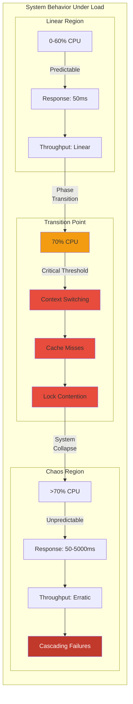
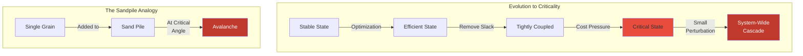
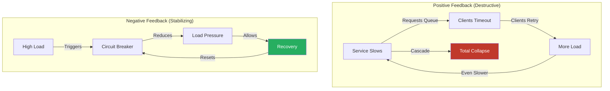

# Law 3: The Law of Emergent Chaos 🌪️

> At scale, systems exhibit behaviors that cannot be predicted from their components.

## The Naive View

If each service passes its unit tests and integration tests, the system will work. We can understand the whole by understanding the parts. More testing equals more confidence.

## The Reality

Complex systems have phase transitions, feedback loops, and emergent properties visible only under production conditions. The state space explodes combinatorially—with just 10 services, each with 10 possible states, you have 10^10 potential system states. No amount of testing can explore this space.

## Deep Structure

### Phase Transitions: When Linear Becomes Non-Linear

Systems often exhibit smooth, predictable behavior up to a critical threshold, then undergo abrupt qualitative changes.



**Real Example**: Thread pools that perform well until ~70% utilization, then collapse:
```python
def thread_pool_phase_transition(utilization):
    if utilization < 0.7:
        # Linear region: response time increases slowly
        response_time = 50 + (utilization * 20)  # 50-64ms
    else:
        # Phase transition: exponential degradation
        overflow = utilization - 0.7
        response_time = 64 * (2 ** (overflow * 10))  # Explosive growth
    
    return response_time

# utilization: 0.69 → response: 63.8ms
# utilization: 0.70 → response: 64ms
# utilization: 0.75 → response: 181ms
# utilization: 0.80 → response: 512ms
# utilization: 0.85 → response: 1448ms
```

### Self-Organized Criticality: Systems Evolve Toward Chaos

Complex systems naturally evolve toward critical states where small perturbations can trigger large-scale events.



**Example**: AWS in the early days had spare capacity everywhere. As they optimized for cost:
- Removed "unnecessary" redundancy
- Increased utilization targets
- Tightened coupling between services
- Result: System evolved to where a typo could cause a 4-hour global outage

### State Space Explosion: The Combinatorial Nightmare

```python
def calculate_state_space(components):
    """
    Calculate the size of system state space
    """
    total_states = 1
    
    for component in components:
        # Each component's states multiply the total
        total_states *= component['states']
        
        # But interactions create additional states
        for other in components:
            if component != other:
                # Pairwise interactions
                total_states *= 2  # Can interact or not
    
    return total_states

# Example: 10 microservices
components = [{'name': f'service_{i}', 'states': 10} for i in range(10)]
states = calculate_state_space(components)
# Result: 10^10 * 2^90 ≈ 10^37 possible states

# Testing coverage?
tests_per_second = 1000
seconds_in_universe = 4.3e17  # ~13.7 billion years
total_possible_tests = tests_per_second * seconds_in_universe
coverage = total_possible_tests / states  # ≈ 0.0000000000001%
```

### Feedback Loops: When Effects Become Causes

Distributed systems are full of feedback loops that can stabilize or destabilize the system.



## Practical Application

### 1. Embrace Chaos Engineering

Don't wait for emergent behaviors to surprise you in production:

```python
class ChaosExperiment:
    def __init__(self, system):
        self.system = system
        self.baseline = self.measure_steady_state()
    
    def inject_chaos(self):
        """Controlled experiments to discover emergent behaviors"""
        experiments = [
            self.increase_latency_variance,
            self.create_thundering_herd,
            self.trigger_gc_storm,
            self.simulate_clock_skew,
            self.inject_packet_reordering,
            self.create_retry_amplification
        ]
        
        for experiment in experiments:
            self.run_experiment(experiment)
    
    def run_experiment(self, experiment):
        # Hypothesis
        hypothesis = experiment.hypothesis
        
        # Inject fault
        experiment.inject()
        
        # Measure impact
        impact = self.measure_steady_state()
        
        # Learn
        if impact.degrades_beyond_threshold(self.baseline):
            self.document_emergent_behavior(experiment, impact)
            self.design_mitigation(experiment, impact)
```

### 2. Monitor for Phase Transitions

Watch for early warning signs:

```yaml
# Prometheus alerts for phase transition detection
groups:
  - name: phase_transitions
    rules:
      - alert: ApproachingThreadPoolSaturation
        expr: |
          (
            avg_over_time(thread_pool_active[5m]) / 
            thread_pool_size
          ) > 0.65
        annotations:
          summary: "Thread pool approaching phase transition"
          description: "Pool at {{ '$value' }}% - phase transition at 70%"
      
      - alert: NonLinearLatencyIncrease
        expr: |
          (
            rate(request_duration_p99[5m]) / 
            rate(request_duration_p99[5m] offset 5m)
          ) > 1.5
        annotations:
          summary: "Latency increasing non-linearly"
```

### 3. Design for Emergence

Accept that emergent behaviors will occur and design systems that can handle them:

```python
class EmergentBehaviorHandler:
    def __init__(self):
        self.patterns = self.load_known_patterns()
        self.anomaly_detector = AnomalyDetector()
    
    def handle_emergence(self, system_state):
        # Detect emergent behavior
        if self.anomaly_detector.is_anomalous(system_state):
            pattern = self.classify_emergence(system_state)
            
            if pattern == EmergencePattern.RETRY_STORM:
                self.activate_retry_dampening()
            elif pattern == EmergencePattern.CASCADE_FAILURE:
                self.activate_cell_isolation()
            elif pattern == EmergencePattern.PHASE_TRANSITION:
                self.activate_load_shedding()
            else:
                # Unknown emergence - fail safe
                self.activate_defensive_mode()
```

## Example: The 2010 Flash Crash

On May 6, 2010, the US stock market experienced one of the most dramatic examples of emergent chaos:

### Timeline of Emergence
```
14:32 - Large sell order enters market
14:41 - High-frequency traders detect unusual activity
14:42 - Algorithmic feedback loops begin
14:44 - Liquidity evaporates as algorithms withdraw
14:45 - Prices enter free fall
14:47 - Market drops 1000 points (9%)
15:07 - Circuit breakers trigger, market recovers

Total time: 35 minutes
Total value evaporated: $1 trillion
```

### The Emergent Properties
1. **No single algorithm was faulty** - Each worked as designed
2. **The interaction created new behavior** - Liquidity crisis emerged from the collective
3. **Phase transition was sudden** - Stable → Chaos in minutes
4. **Recovery required external intervention** - System couldn't self-stabilize

### Lessons
- Individual component testing would never have revealed this
- The behavior emerged from the interaction of correct components
- Small perturbations (one large order) triggered systemic effects
- Human circuit breakers were needed to stop algorithmic chaos

## Theoretical Foundations

### Complexity Theory
- **Lorenz Attractor**: Small changes in initial conditions lead to vastly different outcomes
- **Percolation Theory**: How local interactions create global phase transitions
- **NK Models**: How interdependencies create rugged fitness landscapes

### Network Science
- **Scale-Free Networks**: Why some nodes become critical hubs
- **Small World Properties**: How distant components can suddenly affect each other
- **Cascading Failures**: Mathematical models of how failures propagate

### Information Theory
- **Kolmogorov Complexity**: Why system behavior can't be compressed into simple rules
- **Mutual Information**: How component interactions create information that doesn't exist in isolation

## Design Implications

### 1. **Pattern: Cellular Architecture**
Limit the blast radius of emergent behaviors by creating isolated cells:
```yaml
architecture:
  type: cellular
  cells:
    - id: cell-1
      capacity: 1000_rps
      isolation: complete
      failure_mode: fail_stop
    - id: cell-2
      capacity: 1000_rps
      isolation: complete
      failure_mode: fail_stop
```

### 2. **Anti-pattern: Tight Global Coupling**
Avoid architectures where every component can affect every other component:
```python
# BAD: Global shared state
class GlobalRegistry:
    _instance = None
    _state = {}  # Every service reads/writes here
    
# GOOD: Isolated domains
class DomainBoundedContext:
    def __init__(self, domain):
        self.domain = domain
        self.local_state = {}  # Isolated from other domains
```

### 3. **Trade-off: Efficiency vs Stability**
More efficient systems are often closer to critical transitions:
- High efficiency → High utilization → Near phase transition
- Stability requires slack capacity
- Cost of slack < Cost of emergent failures

## Exercises

[**→ Chaos Engineering Lab**](exercises.md) - Design and run experiments to discover emergent behaviors in your system

## The Ultimate Insight

> "In complex systems, the whole is not only greater than the sum of its parts—it's qualitatively different from anything the parts could predict."

We cannot eliminate emergence, only prepare for it. The goal is not to prevent all emergent behaviors but to:
1. Discover them before they discover us (chaos engineering)
2. Detect them as they begin (monitoring)
3. Limit their impact (cellular architecture)
4. Learn from them (post-mortems)

## Further Reading

- "How Complex Systems Fail" - Richard Cook
- "Normal Accidents" - Charles Perrow
- "Drift into Failure" - Sidney Dekker
- "The Black Swan" - Nassim Taleb

[**← Previous: Law of Asynchrony**](../axiom2-asynchrony/index.md) | [**→ Next: Law of Multidimensional Optimization**](../axiom4-tradeoffs/index.md)