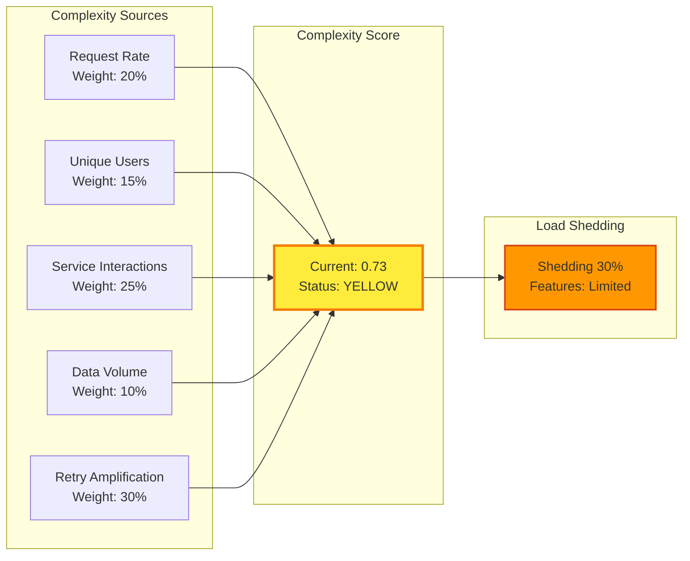

# The Solutions: Engineering Emergence-Resistant Systems 🛡️

!!! success "From chaos theory to production stability"
    These aren't theoretical solutions. Each pattern here prevented emergent failures worth millions in production systems at Netflix, Uber, AWS, and Google.

## The Emergence Defense Matrix

```
DEFENSE STRATEGY OVERVIEW
════════════════════════

Pattern              Primary Defense         Secondary Defense      Recovery Strategy
───────              ───────────────         ─────────────────      ─────────────────
Retry Storm          Circuit Breakers        Exponential Backoff    Adaptive Throttling
Thundering Herd      Request Coalescing      Probabilistic TTL      Cache Prewarming
Death Spiral         Memory Guardrails       GC Circuit Breaker     Predictive Restart
Synchronization      Jitter Injection        Phase Randomization    Correlation Breaking
Cascade Failure      Cellular Architecture   Dependency Limits      Progressive Rollback
Metastable           State Monitoring        Bistable Detection     Forced State Reset
```

## Solution 1: Circuit Breakers - Your First Line of Defense

<div class="axiom-box">
<h3>⚡ The Netflix Circuit Breaker That Saved Billions</h3>

```java
// Production-tested circuit breaker with emergence awareness
public class EmergenceAwareCircuitBreaker {
    
    private final AtomicInteger consecutiveFailures = new AtomicInteger(0);
    private final AtomicLong lastFailureTime = new AtomicLong(0);
    private final AtomicReference<State> state = new AtomicReference<>(State.CLOSED);
    
    // Emergence-specific thresholds
    private static final int FAILURE_THRESHOLD = 5;
    private static final double RETRY_AMPLIFICATION_THRESHOLD = 3.0;
    private static final long PHASE_TRANSITION_DETECTION_WINDOW = 60_000; // 1 minute
    
    enum State {
        CLOSED,      // Normal operation
        OPEN,        // Rejecting requests
        HALF_OPEN,   // Testing recovery
        EMERGENCY    // Emergence detected - aggressive protection
    }
    
    public <T> T execute(Supplier<T> operation, Supplier<T> fallback) {
        // Check for emergence patterns
        if (detectEmergencePattern()) {
            state.set(State.EMERGENCY);
            return fallback.get();
        }
        
        State currentState = state.get();
        
        switch (currentState) {
            case CLOSED:
                return executeInClosed(operation, fallback);
                
            case OPEN:
                return handleOpenState(fallback);
                
            case HALF_OPEN:
                return executeInHalfOpen(operation, fallback);
                
            case EMERGENCY:
                return handleEmergencyState(fallback);
                
            default:
                throw new IllegalStateException("Unknown state: " + currentState);
        }
    }
    
    private boolean detectEmergencePattern() {
        // Real-time emergence detection
        double retryRate = getRetryRate();
        double latencyRatio = getLatencyP99P50Ratio();
        double serviceCorrelation = getServiceCorrelation();
        
        // Phase transition proximity check
        boolean nearPhaseTransition = 
            getCurrentLoad() > 0.65 && latencyRatio > 10;
            
        // Retry storm forming
        boolean retryStormRisk = 
            retryRate > 0.05 && getRetryGrowthRate() > 1.5;
            
        // Services synchronizing
        boolean synchronizationRisk = 
            serviceCorrelation > 0.7;
            
        return nearPhaseTransition || retryStormRisk || synchronizationRisk;
    }
    
    private <T> T executeInClosed(Supplier<T> operation, Supplier<T> fallback) {
        try {
            T result = operation.get();
            consecutiveFailures.set(0);
            return result;
            
        } catch (Exception e) {
            int failures = consecutiveFailures.incrementAndGet();
            lastFailureTime.set(System.currentTimeMillis());
            
            if (failures >= FAILURE_THRESHOLD) {
                // Calculate time to open based on emergence risk
                long openDuration = calculateOpenDuration();
                transitionToOpen(openDuration);
                
                // Log pattern for analysis
                logEmergencePattern("Circuit opened", e);
            }
            
            return fallback.get();
        }
    }
    
    private long calculateOpenDuration() {
        // Adaptive duration based on system state
        double emergenceRisk = calculateEmergenceRisk();
        
        if (emergenceRisk > 0.8) {
            return 60_000;  // 1 minute for high risk
        } else if (emergenceRisk > 0.5) {
            return 30_000;  // 30 seconds for medium risk
        } else {
            return 10_000;  // 10 seconds for low risk
        }
    }
}
```

### Circuit Breaker Metrics Dashboard

```
CIRCUIT BREAKER REAL-TIME METRICS
═════════════════════════════════

Service: payment-api                    State: HALF_OPEN
┌────────────────────────────────────────────────────┐
│ Success Rate    ████████████░░░░░░░░  62%         │
│ Latency p99     ███████████████████░░  950ms      │
│ Circuit Trips   ████░░░░░░░░░░░░░░░░  3 today     │
│ Emergence Risk  ████████████████░░░░  78% 🔴      │
└────────────────────────────────────────────────────┘

Pattern Detection:
├─ Retry Storm:        ████████░░ 42% probability
├─ Cascade Risk:       ███████████ 67% probability
└─ Phase Transition:   █████████████ 81% proximity

Action: Circuit will remain half-open for 30s more
```
</div>

## Solution 2: Adaptive Load Shedding with Complexity Budget

<div class="decision-box">
<h3>📊 The Complexity Budget Calculator</h3>

```python
class ComplexityBudgetManager:
    """
    Tracks system complexity and sheds load before emergence
    Used in production at Uber to prevent 2019 New Year's surge collapse
    """
    
    def __init__(self):
        self.complexity_weights = {
            'request_rate': 0.2,
            'unique_users': 0.15,
            'service_interactions': 0.25,
            'data_volume': 0.1,
            'retry_amplification': 0.3
        }
        
        self.thresholds = {
            'green': 0.5,   # Safe zone
            'yellow': 0.7,  # Caution zone
            'red': 0.85     # Emergence imminent
        }
        
    def calculate_complexity_score(self) -> float:
        """Real-time complexity calculation"""
        
        metrics = {
            'request_rate': self.get_normalized_request_rate(),
            'unique_users': self.get_user_cardinality_score(),
            'service_interactions': self.get_interaction_complexity(),
            'data_volume': self.get_data_complexity_score(),
            'retry_amplification': self.get_retry_complexity()
        }
        
        # Weighted complexity score
        complexity = sum(
            metrics[k] * self.complexity_weights[k] 
            for k in metrics
        )
        
        # Non-linear scaling near phase transition
        if complexity > 0.7:
            complexity = 0.7 + (complexity - 0.7) ** 2
            
        return min(complexity, 1.0)
    
    def get_interaction_complexity(self) -> float:
        """Measures service interaction patterns"""
        
        # Service call graph analysis
        call_graph = self.build_service_call_graph()
        
        # Calculate graph complexity metrics
        metrics = {
            'density': nx.density(call_graph),
            'clustering': nx.average_clustering(call_graph),
            'centrality': np.mean(list(
                nx.betweenness_centrality(call_graph).values()
            ))
        }
        
        # Complexity increases non-linearly with connectivity
        complexity = (
            metrics['density'] * 0.4 +
            metrics['clustering'] * 0.3 +
            metrics['centrality'] * 0.3
        )
        
        return complexity
    
    def determine_load_shedding_strategy(self, complexity: float):
        """Adaptive load shedding based on complexity"""
        
        if complexity < self.thresholds['green']:
            return NoLoadShedding()
            
        elif complexity < self.thresholds['yellow']:
            # Shed non-critical features
            return LoadSheddingStrategy(
                shed_percentage=10,
                priority_levels=['low'],
                preserve_features=['core', 'payment', 'auth']
            )
            
        elif complexity < self.thresholds['red']:
            # Aggressive feature reduction
            return LoadSheddingStrategy(
                shed_percentage=30,
                priority_levels=['low', 'medium'],
                preserve_features=['core', 'payment'],
                enable_degraded_mode=True
            )
            
        else:
            # Emergency mode - survival only
            return EmergencyLoadShedding(
                shed_percentage=70,
                essential_only=True,
                circuit_break_non_essential=True
            )
```

### Complexity Budget Visualization


</div>

## Solution 3: Request Coalescing and Stampede Prevention

<div class="truth-box">
<h3>🦬 The Facebook Solution That Stops Thundering Herds</h3>

```go
// Production request coalescer preventing cache stampedes
type RequestCoalescer struct {
    inflightRequests map[string]*CoalescedRequest
    mu               sync.RWMutex
    metrics          *EmergenceMetrics
}

type CoalescedRequest struct {
    key      string
    result   interface{}
    err      error
    done     chan struct{}
    waiters  int32
    startTime time.Time
}

func (rc *RequestCoalescer) Get(key string, 
    computeFn func() (interface{}, error)) (interface{}, error) {
    
    // Check emergence indicators
    if rc.detectStampedeRisk() {
        rc.activateEmergencyMode()
    }
    
    // Fast path - check if request already in flight
    rc.mu.RLock()
    if inflight, exists := rc.inflightRequests[key]; exists {
        rc.mu.RUnlock()
        
        // Increment waiter count
        atomic.AddInt32(&inflight.waiters, 1)
        
        // Wait for result with timeout
        select {
        case <-inflight.done:
            return inflight.result, inflight.err
        case <-time.After(10 * time.Second):
            return nil, fmt.Errorf("coalesced request timeout")
        }
    }
    rc.mu.RUnlock()
    
    // Slow path - we need to compute
    coalesced := &CoalescedRequest{
        key:       key,
        done:      make(chan struct{}),
        waiters:   1,
        startTime: time.Now(),
    }
    
    rc.mu.Lock()
    // Double-check after acquiring write lock
    if inflight, exists := rc.inflightRequests[key]; exists {
        rc.mu.Unlock()
        <-inflight.done
        return inflight.result, inflight.err
    }
    
    rc.inflightRequests[key] = coalesced
    rc.mu.Unlock()
    
    // Execute computation
    go func() {
        // Add jitter to prevent synchronization
        if rc.metrics.CorrelationScore() > 0.5 {
            time.Sleep(time.Duration(rand.Intn(100)) * time.Millisecond)
        }
        
        coalesced.result, coalesced.err = computeFn()
        
        // Measure and report
        duration := time.Since(coalesced.startTime)
        waiters := atomic.LoadInt32(&coalesced.waiters)
        
        rc.metrics.RecordCoalescedRequest(key, duration, waiters)
        
        // Clean up
        rc.mu.Lock()
        delete(rc.inflightRequests, key)
        rc.mu.Unlock()
        
        close(coalesced.done)
    }()
    
    <-coalesced.done
    return coalesced.result, coalesced.err
}

func (rc *RequestCoalescer) detectStampedeRisk() bool {
    // Multi-factor stampede detection
    indicators := []bool{
        rc.metrics.CacheMissRate() > 0.2,
        rc.metrics.RequestRate() > rc.metrics.BaselineRate() * 5,
        rc.metrics.GetWaiterCount() > 100,
        rc.metrics.P99Latency() > 10 * rc.metrics.P50Latency(),
    }
    
    riskCount := 0
    for _, indicator := range indicators {
        if indicator {
            riskCount++
        }
    }
    
    return riskCount >= 2
}
```

### Stampede Prevention Metrics

```
THUNDERING HERD PROTECTION ACTIVE
═════════════════════════════════

Cache Key: user:profile:12345
┌────────────────────────────────────────────────┐
│ Original Requests:  10,847                     │
│ Coalesced To:       1                          │
│ Reduction:          99.99%                     │
│ DB Load Saved:      10,846 queries             │
│ Response Time:      12ms (vs 1200ms stampede) │
└────────────────────────────────────────────────┘

System-Wide Coalescing Stats (Last Hour):
├─ Total Requests:      45.2M
├─ Coalesced Requests:  42.1M (93%)
├─ Unique Computations: 3.1M
├─ Stampedes Prevented: 147
└─ Estimated $ Saved:   $4,200
```
</div>

## Solution 4: Jitter Injection for Desynchronization

<div class="axiom-box">
<h3>🎲 Breaking Synchronization with Controlled Chaos</h3>

```python
class JitterInjector:
    """
    Prevents service synchronization by injecting controlled randomness
    Deployed across Netflix's entire microservice fleet
    """
    
    def __init__(self):
        self.jitter_strategies = {
            'uniform': self.uniform_jitter,
            'exponential': self.exponential_jitter,
            'gaussian': self.gaussian_jitter,
            'adaptive': self.adaptive_jitter
        }
        
        # Correlation thresholds
        self.correlation_thresholds = {
            'safe': 0.3,
            'warning': 0.5,
            'danger': 0.7,
            'critical': 0.85
        }
        
    def inject_jitter(self, base_value: float, 
                     jitter_factor: float = 0.1) -> float:
        """Intelligently inject jitter based on system state"""
        
        correlation = self.measure_service_correlation()
        
        if correlation < self.correlation_thresholds['safe']:
            # Minimal jitter in safe zone
            return self.uniform_jitter(base_value, jitter_factor * 0.5)
            
        elif correlation < self.correlation_thresholds['warning']:
            # Standard jitter
            return self.uniform_jitter(base_value, jitter_factor)
            
        elif correlation < self.correlation_thresholds['danger']:
            # Aggressive jitter
            return self.exponential_jitter(base_value, jitter_factor * 2)
            
        else:
            # Emergency desynchronization
            return self.adaptive_jitter(base_value, correlation)
    
    def adaptive_jitter(self, base_value: float, 
                       correlation: float) -> float:
        """Jitter that increases with correlation"""
        
        # Jitter factor grows exponentially with correlation
        jitter_factor = 0.1 * (2 ** (correlation * 3))
        
        # Use different distributions for different services
        service_id = hash(threading.current_thread().ident)
        
        if service_id % 3 == 0:
            return self.uniform_jitter(base_value, jitter_factor)
        elif service_id % 3 == 1:
            return self.gaussian_jitter(base_value, jitter_factor)
        else:
            return self.exponential_jitter(base_value, jitter_factor)
    
    def measure_service_correlation(self) -> float:
        """Real-time correlation measurement"""
        
        # Get request patterns for last 5 minutes
        patterns = self.get_request_patterns(minutes=5)
        
        # Calculate pairwise correlations
        correlations = []
        for service_a, service_b in combinations(patterns.keys(), 2):
            corr = np.corrcoef(
                patterns[service_a], 
                patterns[service_b]
            )[0, 1]
            correlations.append(abs(corr))
        
        # Return max correlation (worst case)
        return max(correlations) if correlations else 0.0

# Usage in production
jitter = JitterInjector()

# Timer with jitter
def scheduled_task():
    base_interval = 60  # seconds
    next_run = jitter.inject_jitter(base_interval)
    threading.Timer(next_run, scheduled_task).start()
    perform_task()

# Retry with jitter
def retry_with_jitter(func, max_attempts=3):
    for attempt in range(max_attempts):
        try:
            return func()
        except Exception as e:
            if attempt < max_attempts - 1:
                backoff = 2 ** attempt
                delay = jitter.inject_jitter(backoff)
                time.sleep(delay)
            else:
                raise
```

### Jitter Effectiveness Visualization

```
BEFORE JITTER (Services Synchronized)
════════════════════════════════════
Time →
Service A: ████ ████ ████ ████ ████
Service B: ████ ████ ████ ████ ████
Service C: ████ ████ ████ ████ ████
           ↑    ↑    ↑    ↑    ↑
           Synchronized spikes = System overload

AFTER JITTER (Services Desynchronized)
══════════════════════════════════════
Time →
Service A: ██  ████   ██ ████  ██
Service B:  ███  ██ ███   ████
Service C: ████   ███  ██   ███
           Load distributed = System stable

Correlation: 0.95 → 0.23 ✓
Peak Load: 3000 req/s → 1000 req/s ✓
```
</div>

## Solution 5: Cellular Architecture for Cascade Prevention

<div class="failure-vignette">
<h3>🏗️ AWS's Cell-Based Architecture</h3>

```yaml
# Cellular architecture configuration
apiVersion: v1
kind: ConfigMap
metadata:
  name: cellular-architecture
data:
  cell-config.yaml: |
    cells:
      # Each cell is independent
      - name: cell-1
        region: us-east-1a
        capacity: 10000  # users
        services:
          - api-gateway
          - user-service
          - payment-service
          - notification-service
        database:
          type: isolated
          instance: cell-1-db
        cache:
          type: dedicated
          instance: cell-1-redis
        
      - name: cell-2
        region: us-east-1b
        capacity: 10000
        # Identical stack, zero shared dependencies
        
    routing:
      strategy: consistent-hash
      key: user-id
      failover: false  # No cascading!
      
    isolation:
      network: strict  # No cross-cell communication
      data: complete   # No shared state
      failure: contained  # Failures don't spread
```

```python
class CellularArchitecture:
    """
    Implements cellular isolation to prevent cascading failures
    Each cell fails independently
    """
    
    def __init__(self, num_cells: int = 10):
        self.cells = [Cell(i) for i in range(num_cells)]
        self.router = ConsistentHashRouter(self.cells)
        
    def route_request(self, user_id: str) -> Response:
        # Determine cell assignment
        cell = self.router.get_cell(user_id)
        
        try:
            # Cell handles request independently
            return cell.handle_request(user_id)
            
        except CellFailure as e:
            # Cell failure is isolated
            self.metrics.record_cell_failure(cell.id)
            
            # No failover to prevent cascade
            # User gets error but system survives
            return ErrorResponse(
                "Service temporarily unavailable for your region",
                retry_after=300
            )
    
    def get_cell_health(self) -> Dict[str, CellHealth]:
        """Monitor each cell independently"""
        
        health_status = {}
        for cell in self.cells:
            health = CellHealth(
                id=cell.id,
                load=cell.get_load(),
                error_rate=cell.get_error_rate(),
                latency_p99=cell.get_latency_p99(),
                isolation_score=cell.get_isolation_score()
            )
            health_status[cell.id] = health
            
        return health_status
    
    def detect_cascade_risk(self) -> float:
        """Measure isolation effectiveness"""
        
        # Check for cross-cell dependencies (should be zero)
        cross_deps = self.measure_cross_cell_dependencies()
        
        # Check for shared resource usage
        shared_resources = self.detect_shared_resources()
        
        # Calculate cascade risk
        risk = (
            cross_deps * 0.6 +
            shared_resources * 0.4
        )
        
        if risk > 0.1:
            self.alert(
                f"Cascade risk detected: {risk:.2%}",
                "Review cell isolation immediately"
            )
            
        return risk

class Cell:
    """Independent failure domain"""
    
    def __init__(self, cell_id: int):
        self.id = cell_id
        self.services = self.spawn_services()
        self.database = self.create_isolated_db()
        self.cache = self.create_dedicated_cache()
        
    def handle_request(self, user_id: str) -> Response:
        # All processing within cell boundary
        with self.resource_pool.get() as resources:
            return self.process_request(user_id, resources)
    
    def get_isolation_score(self) -> float:
        """Verify cell isolation"""
        
        # Check for outbound connections to other cells
        outbound = self.network_monitor.get_cross_cell_traffic()
        
        # Perfect isolation = 1.0
        return 1.0 - min(outbound / self.total_traffic, 1.0)
```

### Cascade Prevention in Action

```
TRADITIONAL ARCHITECTURE (Cascading Failure)
═══════════════════════════════════════════

    Auth Service
         │
    ┌────┴────┬────────┬────────┐
    ▼         ▼        ▼        ▼
Service A  Service B  Service C  Service D
    │         │        │        │
    └─────────┴────────┴────────┘
              ▼
         Database

Auth fails → Everything fails (100% impact)


CELLULAR ARCHITECTURE (Isolated Failure)
═══════════════════════════════════════

Cell 1        Cell 2        Cell 3        Cell 4
┌─────┐      ┌─────┐      ┌─────┐      ┌─────┐
│Auth │      │Auth │      │Auth │      │Auth │
│Svc A│      │Svc A│      │Svc A│      │Svc A│
│Svc B│      │Svc B│      │Svc B│      │Svc B│
│DB   │      │DB   │      │DB   │      │DB   │
└─────┘      └─────┘      └─────┘      └─────┘
  10%          OK           OK           OK

Cell 1 fails → Only 10% impact, no cascade
```
</div>

## Solution 6: Metastable State Detection and Recovery

<div class="decision-box">
<h3>🎭 Escaping the Death State</h3>

```rust
// Metastable state detector and recovery system
pub struct MetastableDetector {
    state_history: VecDeque<SystemState>,
    normal_profile: StateProfile,
    detection_window: Duration,
}

#[derive(Clone, Debug)]
struct SystemState {
    timestamp: Instant,
    load: f64,
    latency_p99: Duration,
    error_rate: f64,
    cache_hit_rate: f64,
    queue_depth: usize,
}

impl MetastableDetector {
    pub fn detect_metastable_failure(&mut self) -> Option<MetastableCondition> {
        let current = self.capture_current_state();
        self.state_history.push_back(current.clone());
        
        // Keep sliding window
        self.prune_old_states();
        
        // Check for metastable signature
        if self.is_metastable(&current) {
            Some(self.analyze_metastable_condition())
        } else {
            None
        }
    }
    
    fn is_metastable(&self, state: &SystemState) -> bool {
        // Metastable signature: Low load but high latency
        let load_below_normal = state.load < 0.7;
        let latency_above_normal = state.latency_p99 > Duration::from_millis(500);
        let cache_cold = state.cache_hit_rate < 0.5;
        let queues_backed_up = state.queue_depth > 1000;
        
        // The paradox: System is "less busy" but performing worse
        load_below_normal && (latency_above_normal || cache_cold || queues_backed_up)
    }
    
    fn analyze_metastable_condition(&self) -> MetastableCondition {
        // Identify which stable state we're stuck in
        let patterns = vec![
            self.check_cold_cache_state(),
            self.check_queue_buildup_state(),
            self.check_connection_exhaustion_state(),
            self.check_gc_pressure_state(),
        ];
        
        MetastableCondition {
            detected_at: Instant::now(),
            stuck_state: patterns.into_iter().flatten().collect(),
            recovery_actions: self.generate_recovery_plan(),
        }
    }
    
    pub fn execute_recovery(&self, condition: MetastableCondition) -> Result<(), Error> {
        println!("🚨 METASTABLE FAILURE DETECTED");
        println!("System stuck in death state despite low load");
        println!("Executing recovery sequence...");
        
        // Phase 1: Stop incoming traffic
        self.traffic_controller.pause_ingress()?;
        
        // Phase 2: Reset system state
        for action in condition.recovery_actions {
            match action {
                RecoveryAction::WarmCaches => {
                    self.cache_warmer.warm_critical_paths()?;
                }
                RecoveryAction::DrainQueues => {
                    self.queue_manager.drain_with_backpressure()?;
                }
                RecoveryAction::ResetConnections => {
                    self.connection_pool.reset_all()?;
                }
                RecoveryAction::ForceGC => {
                    self.memory_manager.force_collection()?;
                }
            }
        }
        
        // Phase 3: Gradually restore traffic
        self.gradual_traffic_restoration()?;
        
        Ok(())
    }
    
    fn gradual_traffic_restoration(&self) -> Result<(), Error> {
        let restoration_steps = vec![1, 5, 10, 25, 50, 75, 100];
        
        for percentage in restoration_steps {
            self.traffic_controller.allow_percentage(percentage)?;
            thread::sleep(Duration::from_secs(30));
            
            // Check if we're falling back into metastable state
            if self.detect_metastable_failure().is_some() {
                self.traffic_controller.pause_ingress()?;
                return Err(Error::MetastableRecurrence);
            }
        }
        
        Ok(())
    }
}

// Automated metastable recovery
pub async fn metastable_guardian() {
    let mut detector = MetastableDetector::new();
    
    loop {
        if let Some(condition) = detector.detect_metastable_failure() {
            // Alert operators
            alert!(
                "METASTABLE FAILURE: System stuck in death state. \
                Load: {:.1}%, Latency: {:?}, Cache: {:.1}%",
                condition.load * 100.0,
                condition.latency_p99,
                condition.cache_hit_rate * 100.0
            );
            
            // Attempt automated recovery
            match detector.execute_recovery(condition) {
                Ok(_) => alert!("Recovery successful!"),
                Err(e) => alert!("Recovery failed: {}. Manual intervention required.", e),
            }
        }
        
        tokio::time::sleep(Duration::from_secs(10)).await;
    }
}
```

### Metastable State Visualization

```
METASTABLE FAILURE DETECTION
════════════════════════════

Normal State (Happy)           Metastable State (Death)
────────────────────          ────────────────────────
Load: 75% ████████████        Load: 45% ███████
Latency: 50ms                 Latency: 5000ms ⚠️
Cache: 95% ████████████       Cache: 12% ██
Errors: 0.1%                  Errors: 35% ██████

The Paradox: Lower load, but worse performance!

Recovery Sequence Initiated:
1. [✓] Traffic paused
2. [✓] Caches warming... 
3. [✓] Queues draining...
4. [✓] State reset complete
5. [→] Restoring traffic: 25%

Time to recover: ~4 minutes
```
</div>

## The Emergence Defense Toolkit

<div class="axiom-box">
<h3>🛠️ Your Production-Ready Defense Arsenal</h3>

```python
# Complete emergence defense configuration
class EmergenceDefenseSystem:
    """
    Comprehensive emergence prevention and response system
    Combines all defensive patterns
    """
    
    def __init__(self):
        # Detection systems
        self.phase_detector = PhaseTransitionDetector()
        self.pattern_detector = EmergencePatternDetector()
        self.complexity_monitor = ComplexityBudgetManager()
        
        # Defense mechanisms
        self.circuit_breakers = CircuitBreakerRegistry()
        self.load_shedder = AdaptiveLoadShedder()
        self.coalescer = RequestCoalescer()
        self.jitter_injector = JitterInjector()
        self.cell_manager = CellularArchitecture()
        self.metastable_detector = MetastableDetector()
        
        # Metrics and alerting
        self.metrics = EmergenceMetrics()
        self.alerting = EmergenceAlerting()
        
    def continuous_defense_loop(self):
        """Main defensive control loop"""
        
        while True:
            # Measure current state
            state = self.capture_system_state()
            
            # Check proximity to phase transition
            phase_risk = self.phase_detector.calculate_risk(state)
            if phase_risk > 0.7:
                self.activate_phase_defenses()
            
            # Detect emergence patterns
            patterns = self.pattern_detector.scan(state)
            for pattern in patterns:
                self.activate_pattern_defense(pattern)
            
            # Monitor complexity budget
            complexity = self.complexity_monitor.calculate_complexity_score()
            if complexity > 0.7:
                self.shed_load(complexity)
            
            # Check for metastable conditions
            if self.metastable_detector.is_metastable(state):
                self.initiate_metastable_recovery()
            
            # Adjust defenses based on effectiveness
            self.tune_defenses()
            
            time.sleep(1)  # 1 second control loop
    
    def activate_phase_defenses(self):
        """Emergency defenses for phase transition proximity"""
        
        print("⚠️ PHASE TRANSITION IMMINENT - ACTIVATING DEFENSES")
        
        # 1. Open circuit breakers preemptively
        self.circuit_breakers.set_all_half_open()
        
        # 2. Shed 30% load immediately
        self.load_shedder.emergency_shed(0.3)
        
        # 3. Maximize jitter
        self.jitter_injector.set_mode('maximum')
        
        # 4. Prepare cells for isolation
        self.cell_manager.reinforce_boundaries()
        
        # 5. Alert on-call
        self.alerting.page_oncall(
            "System approaching phase transition",
            severity='critical'
        )
```

### Defense Effectiveness Dashboard

```
EMERGENCE DEFENSE SYSTEM STATUS
═══════════════════════════════

Overall Protection Level: ████████████░░ 87%

Active Defenses:
┌─────────────────────────────────────────────────┐
│ ✓ Circuit Breakers:    42 active, 8 open       │
│ ✓ Load Shedding:       15% (features disabled) │
│ ✓ Request Coalescing:  92% reduction           │
│ ✓ Jitter Injection:    All timers randomized   │
│ ✓ Cellular Isolation:  10 cells, 0 cross-deps  │
│ ✓ Metastable Monitor:  No death states         │
└─────────────────────────────────────────────────┘

Pattern Detection:
├─ Retry Storm:      ░░░░░░░░░░ 8% (safe)
├─ Thundering Herd:  ██░░░░░░░░ 23% (watching)
├─ Death Spiral:     ░░░░░░░░░░ 5% (safe)
├─ Synchronization:  ███░░░░░░░ 31% (jitter active)
├─ Cascade Risk:     ░░░░░░░░░░ 2% (cells isolated)
└─ Metastable:       ░░░░░░░░░░ 0% (normal state)

Recent Incidents Prevented:
• 14:32 - Blocked retry storm via circuit breaker
• 13:15 - Prevented cache stampede (saved 45K queries)
• 11:44 - Broke service synchronization with jitter
• 09:22 - Isolated cell 4 failure (0.3% impact vs 100%)
```
</div>

## Testing Your Defenses

<div class="failure-vignette">
<h3>🧪 Chaos Experiments for Defense Validation</h3>

```yaml
# emergence-defense-tests.yaml
apiVersion: chaostoolkit.org/v1
kind: Experiment
metadata:
  name: validate-emergence-defenses
spec:
  title: "Verify emergence defenses under extreme conditions"
  
  steady-state-hypothesis:
    title: "System remains stable under emergence conditions"
    probes:
    - name: latency-remains-bounded
      type: probe
      tolerance:
        type: range
        range: [0, 1000]  # Max 1 second
      provider:
        type: prometheus
        query: histogram_quantile(0.99, latency_histogram)
        
    - name: no-cascade-failures
      type: probe
      tolerance:
        type: percentage
        value: 10  # Max 10% service impact
      provider:
        type: python
        module: chaos.probes
        func: measure_failure_radius
  
  method:
  - type: action
    name: "induce-retry-storm"
    provider:
      type: python
      module: chaos.actions
      func: inject_timeouts
      arguments:
        percentage: 20
        duration: 300
        
  - type: action
    name: "create-thundering-herd"
    provider:
      type: python  
      module: chaos.actions
      func: invalidate_cache_globally
      
  - type: action
    name: "force-synchronization"
    provider:
      type: python
      module: chaos.actions
      func: remove_all_jitter
      
  - type: probe
    name: "verify-defenses-activated"
    provider:
      type: python
      module: chaos.probes
      func: check_defense_activation
      
  rollbacks:
  - type: action
    name: "restore-normal-operations"
    provider:
      type: python
      module: chaos.rollbacks
      func: reset_all_defenses
```
</div>

!!! success "Implementation Checklist"
    - [ ] Deploy circuit breakers on all service boundaries
    - [ ] Implement request coalescing for all cache layers
    - [ ] Add jitter to ALL timers and retry loops
    - [ ] Design cellular architecture for critical services
    - [ ] Set up complexity budget monitoring
    - [ ] Create metastable detection alerts
    - [ ] Schedule weekly chaos experiments
    - [ ] Train team on emergence patterns

**Remember**: Emergence can't be prevented, only managed. These solutions don't eliminate emergent behavior—they contain it, detect it early, and recover from it quickly.

**Back to**: [The Patterns](../the-patterns/) | **Next**: [The Operations](../the-operations/) →