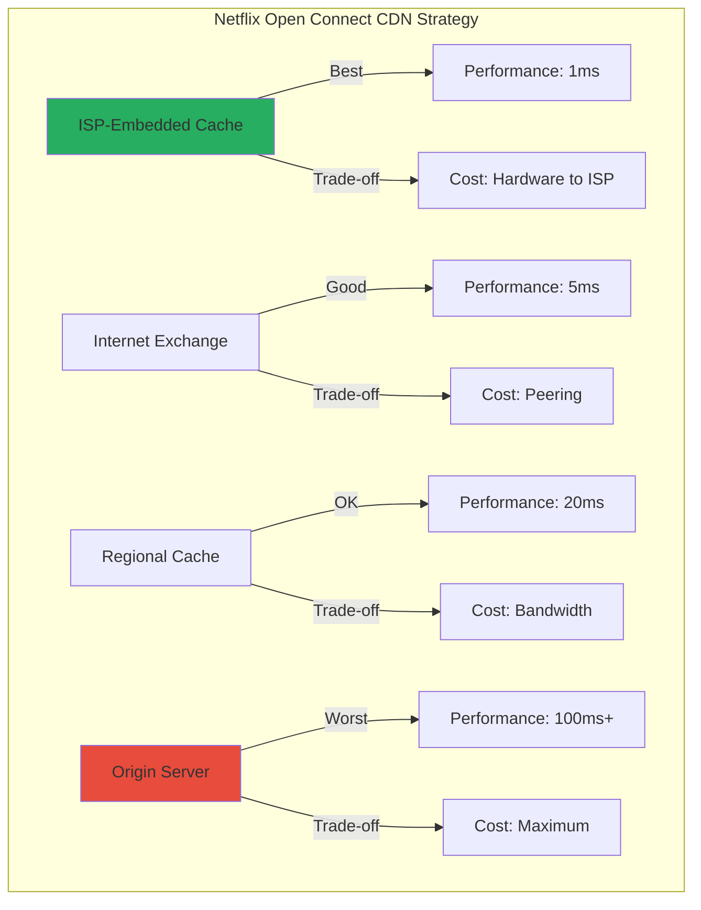

# Real-World Trade-off Decisions: Case Studies in Multidimensional Optimization

## Case Study 1: Stripe's Payment Processing Architecture

### The Challenge
Process payments with competing requirements:
- **Consistency**: Never double-charge or lose money
- **Availability**: 99.999% uptime SLA
- **Latency**: Sub-second response for checkout
- **Scale**: Millions of transactions per day
- **Compliance**: PCI DSS, regional regulations
- **Cost**: Competitive transaction fees

### The Multi-Dimensional Solution

```python
class StripeArchitecture:
    def __init__(self):
        self.consistency_zones = {
            'payment_auth': 'linearizable',      # Never compromise
            'webhook_delivery': 'at_least_once', # Retriable
            'analytics': 'eventual',             # Can be delayed
            'fraud_scoring': 'bounded_staleness' # 5-minute window
        }
        
    def process_payment(self, payment):
# Critical path: Optimize for correctness + availability
        with distributed_lock(timeout=500):  # ms
# Synchronous replication to 3 regions
            auth = self.authorize_payment(payment, consistency='strong')
            
# Non-critical: Optimize for performance
        async_tasks = [
            self.update_analytics(payment),      # Eventually consistent
            self.send_webhooks(payment),         # At-least-once delivery
            self.fraud_analysis(payment)         # Can use stale data
        ]
        
# Return fast, process async tasks in background
        asyncio.create_task(asyncio.gather(*async_tasks))
        return auth
```

### Trade-off Decisions

| Component | Consistency | Availability | Latency | Cost Impact |
|-----------|------------|--------------|---------|-------------|
| Payment Auth | Linearizable | 99.99% | 200ms p99 | High (3x replication) |
| Webhooks | At-least-once | 99.999% | Async | Medium (retry infrastructure) |
| Analytics | Eventual | 99.9% | Hours | Low (batch processing) |
| Fraud Scoring | Bounded (5min) | 99.95% | 50ms p99 | Medium (caching layer) |


### Key Insight
> "Different parts of the same system can exist at different points in the trade-off space"

## Case Study 2: Netflix's Video Streaming

### The Challenge
Stream video globally with:
- **Quality**: 4K HDR video
- **Availability**: Always watchable
- **Latency**: Instant playback
- **Cost**: Bandwidth is expensive
- **Scale**: 200M+ subscribers
- **Personalization**: Unique per user

### The Adaptive Trade-off System

```python
class NetflixStreamingOptimizer:
    def __init__(self):
        self.quality_ladder = [
            {'bitrate': 235, 'resolution': '320x240'},
            {'bitrate': 375, 'resolution': '384x288'},
            {'bitrate': 750, 'resolution': '512x384'},
            {'bitrate': 1050, 'resolution': '640x480'},
            {'bitrate': 1750, 'resolution': '720x480'},
            {'bitrate': 2350, 'resolution': '1280x720'},
            {'bitrate': 3000, 'resolution': '1280x720'},
            {'bitrate': 4300, 'resolution': '1920x1080'},
            {'bitrate': 5800, 'resolution': '1920x1080'},
            {'bitrate': 8100, 'resolution': '3840x2160'}
        ]
        
    def optimize_for_conditions(self, context):
        """Dynamic optimization based on current conditions"""
        
        if context.network_speed < 1000:  # kbps
# Optimize for availability over quality
            return {
                'strategy': 'minimum_buffer',
                'initial_bitrate': 375,
                'preload_seconds': 2,
                'cdn': 'nearest'
            }
            
        elif context.device == 'mobile' and context.data_plan == 'metered':
# Optimize for cost (user's data)
            return {
                'strategy': 'data_saver',
                'max_bitrate': 750,
                'preload_seconds': 0,
                'cdn': 'nearest'
            }
            
        elif context.device == '4k_tv' and context.network_speed > 25000:
# Optimize for quality
            return {
                'strategy': 'maximum_quality',
                'initial_bitrate': 8100,
                'preload_seconds': 10,
                'cdn': 'premium_path'
            }
            
        else:
# Balanced approach
            return self.calculate_optimal_point(context)
```

### The CDN Trade-off Matrix



### Results of Multi-Dimensional Optimization

- **Availability**: 99.99% globally through redundant CDNs
- **Quality**: Adaptive bitrate serves best possible quality
- **Cost**: 1000x reduction through ISP caching
- **Latency**: <1s startup time for 95% of plays
- **Personalization**: Different encoding for different content types

## Case Study 3: Uber's Marketplace Dynamics

### The Challenge
Balance supply (drivers) and demand (riders) with:
- **Price Fairness**: Both riders and drivers
- **Availability**: Always find a ride
- **Wait Time**: Minimize pickup time
- **Utilization**: Keep drivers busy
- **Revenue**: Sustainable business
- **Geographic Coverage**: Serve entire city

### The Dynamic Optimization Engine

```python
class UberMarketplaceOptimizer:
    def __init__(self):
        self.objectives = {
            'rider_wait_time': weight=0.3,
            'driver_utilization': weight=0.2,
            'geographic_coverage': weight=0.2,
            'revenue': weight=0.15,
            'fairness': weight=0.15
        }
        
    def calculate_surge_pricing(self, zone):
        """Multi-objective optimization for pricing"""
        
        supply = self.get_available_drivers(zone)
        demand = self.get_ride_requests(zone)
        
# Multiple competing objectives
        objectives = {
            'clear_market': demand / supply,  # Balance supply/demand
            'driver_earnings': self.target_hourly_earnings(zone),
            'rider_affordability': self.price_sensitivity(zone),
            'network_effects': self.neighboring_zones_impact(zone),
            'long_term_retention': self.churn_prediction(zone)
        }
        
# Find Pareto optimal price
        surge_multiplier = self.pareto_optimization(objectives)
        
# Apply constraints
        surge_multiplier = max(1.0, min(surge_multiplier, 5.0))  # Legal limits
        
        return surge_multiplier
```

### Trade-off Visualization

```python
def visualize_uber_tradeoffs():
    """Show how different objectives conflict"""
    
    scenarios = {
        'high_demand_event': {
            'without_surge': {
                'wait_time': '25 min',
                'availability': '20%',
                'driver_earnings': '$25/hr',
                'rides_completed': 1000
            },
            'with_3x_surge': {
                'wait_time': '5 min',
                'availability': '90%',
                'driver_earnings': '$75/hr',
                'rides_completed': 600,  # Some priced out
                'controversy': 'High'
            }
        },
        'normal_conditions': {
            'no_optimization': {
                'wait_time': '8 min',
                'utilization': '60%',
                'coverage': 'Gaps in suburbs'
            },
            'with_incentives': {
                'wait_time': '5 min',
                'utilization': '75%',
                'coverage': 'Full city',
                'cost': '+$2M/month incentives'
            }
        }
    }
```

## Case Study 4: Cloudflare's Global Anycast Network

### The Challenge
Route traffic optimally with:
- **Performance**: Lowest latency
- **Reliability**: Handle failures
- **Security**: DDoS protection
- **Cost**: Bandwidth pricing varies
- **Compliance**: Data residency laws

### The Anycast Trade-off

```python
class CloudflareAnycastRouter:
    def __init__(self):
        self.pops = self.load_global_pops()  # 200+ locations
        
    def route_request(self, request):
        """Multi-dimensional routing decision"""
        
        client_ip = request.client_ip
        
# Calculate scores for each PoP
        scores = {}
        for pop in self.pops:
            scores[pop] = self.calculate_pop_score(
                pop=pop,
                client=client_ip,
                factors={
                    'latency': self.measure_latency(client_ip, pop),
                    'capacity': self.get_available_capacity(pop),
                    'cost': self.get_bandwidth_cost(pop),
                    'compliance': self.check_data_residency(client_ip, pop),
                    'attack_status': self.get_ddos_status(pop)
                }
            )
            
# Don't always pick the "best" - that creates hot spots
        return self.weighted_random_selection(scores, temperature=0.1)
        
    def calculate_pop_score(self, pop, client, factors):
        """Combine multiple factors into single score"""
        
        score = 0
        
# Latency: Exponential penalty for distance
        score -= (factors['latency'] ** 2) * 0.01
        
# Capacity: Prefer underutilized PoPs
        score += (1 - factors['capacity']) * 10
        
# Cost: Some PoPs are expensive
        score -= factors['cost'] * 5
        
# Compliance: Hard constraint
        if not factors['compliance']:
            score = -float('inf')
            
# Under attack: Avoid unless necessary
        if factors['attack_status'] > 0.5:
            score -= 50
            
        return score
```

### Regional Trade-off Differences

| Region | Primary Optimization | Secondary | Constraint |
|--------|---------------------|-----------|------------|
| North America | Latency | Cost | None |
| Europe | Compliance (GDPR) | Latency | Data residency |
| Asia Pacific | Cost | Latency | Bandwidth expensive |
| Latin America | Availability | Cost | Limited infrastructure |
| Middle East | Compliance | Security | Content filtering |


## Case Study 5: Kubernetes Scheduler

### The Challenge
Place pods on nodes optimizing for:
- **Resource Utilization**: Don't waste CPU/RAM
- **Availability**: Spread across failure domains
- **Performance**: Consider locality
- **Cost**: Some nodes are more expensive
- **Constraints**: Affinity/anti-affinity rules

### The Scheduling Algorithm

```python
class KubernetesScheduler:
    def __init__(self):
        self.scoring_plugins = [
            NodeResourcesFit(weight=1),
            InterPodAffinity(weight=2),
            NodeAffinity(weight=1),
            TaintToleration(weight=3),
            NodePreferAvoidPods(weight=10000),
            ImageLocality(weight=1),
            PodTopologySpread(weight=2)
        ]
        
    def schedule_pod(self, pod, nodes):
        """Multi-dimensional optimization for pod placement"""
        
# First, filter feasible nodes
        feasible_nodes = []
        for node in nodes:
            if self.fits(pod, node):
                feasible_nodes.append(node)
                
        if not feasible_nodes:
            return None  # Unschedulable
            
# Score each feasible node
        scores = {}
        for node in feasible_nodes:
            scores[node] = 0
            for plugin in self.scoring_plugins:
                plugin_score = plugin.score(pod, node)
                weighted_score = plugin_score * plugin.weight
                scores[node] += weighted_score
                
# Normalize scores
        max_score = max(scores.values())
        for node in scores:
            scores[node] = scores[node] / max_score * 100
            
# Pick highest scoring node
        return max(scores, key=scores.get)
```

### Example Trade-off Scenario

```yaml
apiVersion: v1
kind: Pod
metadata:
  name: web-server
spec:
  affinity:
    podAntiAffinity:  # Don't put on same node as other web servers
      weight: 100
    nodeAffinity:     # Prefer SSD nodes
      weight: 50
  resources:
    requests:
      cpu: 2
      memory: 4Gi
  topologySpreadConstraints:  # Spread across zones
    - maxSkew: 1
      topologyKey: zone
      weight: 75
```

The scheduler must balance:
- **Anti-affinity**: Reduces availability score for nodes with web-servers
- **Node affinity**: Increases score for SSD nodes (better performance)
- **Resource fit**: Must have 2 CPU + 4Gi available
- **Topology spread**: Prefer underrepresented zones
- **Cost**: SSD nodes cost 2x more

## Common Patterns Across Cases

### 1. Different Subsystems, Different Trade-offs
Every case shows subsystems optimized differently:
- Stripe: Payment auth (consistency) vs analytics (performance)
- Netflix: Mobile (cost) vs 4K TV (quality)
- Uber: City center (availability) vs suburbs (coverage)

### 2. Dynamic Adaptation
Static trade-offs fail. Systems must adapt:
- Netflix: Adjusts quality based on network conditions
- Uber: Surge pricing responds to real-time supply/demand
- Cloudflare: Routes based on current attack status

### 3. Hard Constraints Shape the Space
Some dimensions are non-negotiable:
- Stripe: Never lose money (consistency)
- Cloudflare: GDPR compliance in Europe
- Kubernetes: Resource limits are hard constraints

### 4. Business Metrics Drive Technical Trade-offs
Technical decisions serve business goals:
- Netflix: Reduce churn by preventing buffering
- Uber: Balance driver earnings with rider affordability
- Stripe: Transaction fees competitive with banks

## The Meta Pattern

> "Successful systems don't find the optimal point—they build mechanisms to navigate the trade-off space as conditions change."

Each of these systems succeeded by:
1. **Explicitly mapping their trade-off space**
2. **Building mechanisms to move through that space**
3. **Making different trade-offs for different use cases**
4. **Adapting based on real-time conditions**

[**← Back to Law of Multidimensional Optimization**](index.md) | [**→ To Exercises**](./exercises.md)