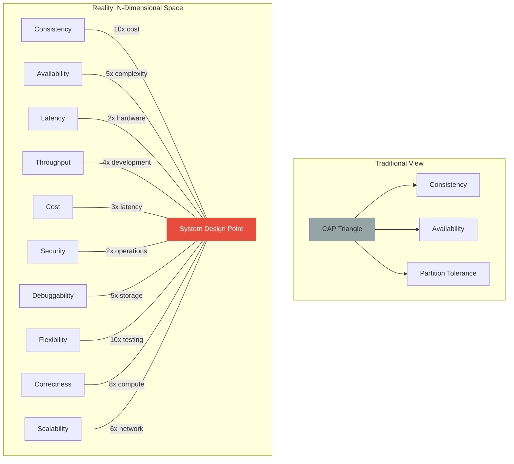

# Law 4: The Law of Multidimensional Optimization ⚖️

> System design is not choosing two of three. It's finding acceptable points in an n-dimensional space of trade-offs.

## The Naive View

The CAP theorem tells us everything we need to know: pick two of Consistency, Availability, and Partition tolerance. PACELC extends this slightly. Make your choice and move on. Simple.

## The Reality

Real systems balance dozens of dimensions simultaneously: consistency, availability, latency, throughput, cost, operational complexity, security, debuggability, development velocity, and more. These create non-linear trade-offs where improving one dimension by 2x might degrade another by 10x. The "choice" is finding an acceptable point in a high-dimensional space where each dimension affects multiple others in complex ways.

## Deep Structure

### The True Dimensionality of System Design



### Non-Linear Trade-off Functions

Trade-offs aren't linear exchanges. They follow complex functions:

```python
def calculate_trade_off_cost(dimension_improvements):
    """
    Real trade-offs are non-linear and interconnected
    """
    costs = {}
    
    # Example: Improving consistency
    consistency_level = dimension_improvements.get('consistency', 0)
    
    # Latency cost grows exponentially with consistency
    costs['latency'] = 50 * (2 ** consistency_level)  # ms
    
    # Availability decreases non-linearly
    costs['availability'] = 99.9 - (consistency_level ** 2) * 0.1  # %
    
    # Cost grows faster than linear
    costs['infrastructure'] = 1000 * (consistency_level ** 1.5)  # $/month
    
    # Operational complexity compounds
    costs['ops_burden'] = consistency_level ** 3  # incident hours/month
    
    # Development velocity suffers
    costs['dev_velocity'] = 1 / (1 + consistency_level * 0.5)  # features/sprint
    
    return costs

# Example: Strong consistency (level 5)
# Result: 1600ms latency, 97.4% availability, $11,180/month, 125 incident hours
```

### The Harvest vs Yield Model: Beyond Binary Availability

Fox and Brewer's Harvest/Yield model provides more nuance than CAP's "available or not":

```python
class HarvestYieldSystem:
    def __init__(self):
        self.total_data = 1000  # Total data units
        self.replicas = 3
        self.available_replicas = 3
        
    def handle_partition(self, failed_replicas):
        self.available_replicas = self.replicas - failed_replicas
        
    def query_with_harvest_yield_choice(self, query, strategy):
        if strategy == "maximize_yield":
            # Respond to all queries with partial data
            yield_rate = 1.0  # 100% of queries answered
            harvest = self.available_replicas / self.replicas
            return {
                'yield': yield_rate,
                'harvest': harvest,  # e.g., 66% of data
                'example': 'Search returns 66% of results but always responds'
            }
            
        elif strategy == "maximize_harvest":
            # Only respond if we can give complete data
            if self.available_replicas == self.replicas:
                return {
                    'yield': 1.0,
                    'harvest': 1.0,
                    'example': 'Transaction completes with full consistency'
                }
            else:
                return {
                    'yield': 0.0,  # Refuse to answer
                    'harvest': None,
                    'example': 'Transaction rejected during partition'
                }
                
        elif strategy == "adaptive":
            # Different strategies for different queries
            if query.type == "search":
                # Searches can tolerate partial results
                return self.query_with_harvest_yield_choice(query, "maximize_yield")
            elif query.type == "transaction":
                # Transactions need full consistency
                return self.query_with_harvest_yield_choice(query, "maximize_harvest")
```

### The Consistency Spectrum: It's Not Binary

```mermaid
graph LR
    subgraph "Consistency Spectrum"
        L[Linearizability] -->|Strongest| S[Serializability]
        S --> SS[Snapshot Isolation]
        SS --> RR[Repeatable Read]
        RR --> RC[Read Committed]
        RC --> RU[Read Uncommitted]
        RU --> EC[Eventual Consistency]
        EC -->|Weakest| NC[No Consistency]
    end
    
    subgraph "Cost Implications"
        L -.->|10x cost| LCOS[$$$$$$$$$$]
        S -.->|5x cost| SCOS[$$$$$]
        EC -.->|1x cost| ECOS[$]
    end
    
    subgraph "Use Cases"
        L -.-> LUSE[Financial Ledgers]
        S -.-> SUSE[Inventory]
        EC -.-> EUSE[Social Feeds]
    end
    
    style L fill:#e74c3c,color:#fff
    style EC fill:#27ae60,color:#fff
```

Each point on this spectrum represents different trade-offs:

```python
class ConsistencySpectrum:
    levels = {
        'linearizable': {
            'guarantees': 'Real-time ordering, atomic',
            'latency_multiplier': 10,
            'availability': 0.99,
            'cost_multiplier': 10,
            'use_cases': ['bank_transfers', 'distributed_locks']
        },
        'sequential': {
            'guarantees': 'Total order, not real-time',
            'latency_multiplier': 5,
            'availability': 0.995,
            'cost_multiplier': 5,
            'use_cases': ['replicated_state_machines', 'config_management']
        },
        'causal': {
            'guarantees': 'Preserves causality only',
            'latency_multiplier': 2,
            'availability': 0.999,
            'cost_multiplier': 2,
            'use_cases': ['collaborative_editing', 'chat_systems']
        },
        'eventual': {
            'guarantees': 'Converges eventually',
            'latency_multiplier': 1,
            'availability': 0.9999,
            'cost_multiplier': 1,
            'use_cases': ['shopping_carts', 'social_media_likes']
        }
    }
```

### Game Theory in Multi-Tenant Systems

When multiple teams share infrastructure, trade-offs become game theory problems:

```python
class MultiTenantTradeoffGame:
    def __init__(self):
        self.shared_resource_capacity = 1000
        self.tenants = {}
        
    def tenant_strategy(self, tenant_id, strategy):
        """Each tenant optimizes for their own needs"""
        if strategy == "aggressive":
            # Consume maximum resources for best performance
            return {
                'resource_demand': 500,
                'latency': 10,  # ms - great for this tenant
                'cost_share': 0.1  # Try to minimize cost contribution
            }
        elif strategy == "cooperative":
            # Fair share approach
            return {
                'resource_demand': 100,
                'latency': 50,  # ms - acceptable
                'cost_share': 0.2  # Fair contribution
            }
            
    def calculate_nash_equilibrium(self):
        """Find the stable state where no tenant benefits from changing"""
        # In practice: Everyone chooses 'aggressive'
        # Result: Tragedy of the commons
        # Solution: Quotas, rate limits, isolation
        pass
```

## Practical Application

### 1. Multi-Objective Optimization Frameworks

Don't optimize for a single dimension. Use Pareto optimization:

```python
class ParetoOptimalDesign:
    def __init__(self):
        self.designs = []
        
    def evaluate_design(self, design):
        """Evaluate design across all dimensions"""
        return {
            'consistency_score': self.measure_consistency(design),
            'availability_score': self.measure_availability(design),
            'latency_p99': self.measure_latency(design),
            'cost_per_request': self.measure_cost(design),
            'ops_complexity': self.measure_operations(design),
            'dev_velocity': self.measure_development(design)
        }
        
    def find_pareto_frontier(self):
        """Find designs where no dimension can be improved 
        without making another worse"""
        frontier = []
        
        for design in self.designs:
            dominated = False
            scores = self.evaluate_design(design)
            
            for other in self.designs:
                if other == design:
                    continue
                    
                other_scores = self.evaluate_design(other)
                
                # Check if 'other' dominates 'design'
                if all(other_scores[k] >= scores[k] for k in scores) and \
                   any(other_scores[k] > scores[k] for k in scores):
                    dominated = True
                    break
                    
            if not dominated:
                frontier.append(design)
                
        return frontier
```

### 2. Service Level Objectives (SLOs) as Trade-off Contracts

SLOs make trade-offs explicit and measurable:

```yaml
service: payment-processor
slos:
  - dimension: availability
    target: 99.95%
    measurement: successful_requests / total_requests
    window: 30_days
    
  - dimension: latency
    target: 
      p50: 100ms
      p99: 500ms
      p99.9: 2000ms
    measurement: request_duration
    
  - dimension: consistency
    target: linearizable
    measurement: causal_consistency_violations
    threshold: 0
    
  - dimension: throughput
    target: 10000 rps
    measurement: requests_per_second
    
  - dimension: cost
    target: $0.001 per_transaction
    measurement: monthly_cost / transaction_count

# Trade-off decisions based on SLOs
trade_off_policies:
  - when: "availability < 99.9%"
    then: "reduce consistency to sequential"
    
  - when: "p99_latency > 1000ms"
    then: "enable read replicas"
    
  - when: "cost > $0.002"
    then: "reduce replication factor"
```

### 3. Adaptive Systems That Navigate Trade-off Space

Build systems that can move through the trade-off space dynamically:

```python
class AdaptiveTradeoffSystem:
    def __init__(self):
        self.current_position = {
            'consistency': 'strong',
            'replication': 3,
            'timeout': 1000,
            'cache_ttl': 0
        }
        self.slo_violations = deque(maxlen=100)
        
    def adapt_to_conditions(self, metrics):
        """Dynamically adjust position in trade-off space"""
        violations = self.check_slo_violations(metrics)
        
        if violations['availability'] > 0.01:
            # Availability suffering - relax consistency
            self.current_position['consistency'] = 'eventual'
            self.current_position['timeout'] = 500
            
        elif violations['latency_p99'] > 0.05:
            # Latency suffering - add caching
            self.current_position['cache_ttl'] = 60
            
        elif violations['cost'] > 0:
            # Cost too high - reduce replication
            self.current_position['replication'] = 2
            
        elif all(v == 0 for v in violations.values()):
            # Everything fine - can we improve?
            self.probe_better_position()
            
    def probe_better_position(self):
        """Carefully try to improve one dimension"""
        # Gradually increase consistency if we have headroom
        if self.current_position['consistency'] == 'eventual':
            self.current_position['consistency'] = 'causal'
            # Monitor for impact
```

## Example: DynamoDB's Tunable Consistency

Amazon DynamoDB exemplifies multidimensional optimization in practice:

### The Design Space
```python
class DynamoDBRequest:
    def __init__(self):
        self.consistency_levels = {
            'eventually_consistent': {
                'read_capacity_units': 0.5,
                'latency_ms': 10,
                'availability': 0.9999,
                'staleness_window': '1-2 seconds'
            },
            'strongly_consistent': {
                'read_capacity_units': 1.0,  # 2x cost!
                'latency_ms': 20,  # 2x latency
                'availability': 0.999,  # 10x less available
                'staleness_window': '0 seconds'
            },
            'global_table_eventual': {
                'read_capacity_units': 0.5,
                'latency_ms': 10,
                'availability': 0.99999,  # 5 nines!
                'staleness_window': '1-2 seconds per region'
            }
        }
```

### The Business Logic
```python
def choose_consistency_for_use_case(use_case):
    """Different use cases navigate trade-offs differently"""
    
    if use_case == "user_session":
        # Sessions need consistency within region
        return "strongly_consistent"
        
    elif use_case == "product_catalog":
        # Catalog can be eventually consistent
        return "eventually_consistent"
        
    elif use_case == "inventory_count":
        # Inventory needs strong consistency for correctness
        # But only for writes - reads can be eventual
        return {
            'write': 'strongly_consistent',
            'read': 'eventually_consistent',
            'critical_read': 'strongly_consistent'
        }
        
    elif use_case == "analytics_data":
        # Analytics can tolerate staleness
        return "global_table_eventual"
```

## Theoretical Foundations

### Optimization Theory
- **Pareto Optimality**: No objective can be improved without degrading another
- **Multi-Objective Optimization**: Techniques like NSGA-II for finding optimal trade-offs
- **Constraint Programming**: Expressing system requirements as constraints

### Economic Theory
- **Utility Functions**: Quantifying the "value" of different trade-off positions
- **Marginal Cost/Benefit**: The cost of improving one dimension by one unit
- **Opportunity Cost**: What you give up by choosing one design over another

### Control Theory
- **MIMO Systems**: Multiple-Input Multiple-Output control for managing multiple dimensions
- **Adaptive Control**: Systems that learn optimal trade-off positions over time
- **Robust Control**: Maintaining acceptable performance across the entire trade-off space

## Design Implications

### 1. **Pattern: Dimension-Aware Architecture**
Design systems that explicitly acknowledge and manage multiple dimensions:

```python
class DimensionAwareService:
    def __init__(self):
        self.dimensions = {
            'consistency': ConsistencyManager(),
            'availability': AvailabilityManager(),
            'performance': PerformanceManager(),
            'cost': CostManager(),
            'security': SecurityManager()
        }
        
    def handle_request(self, request):
        # Each request can specify its priorities
        priorities = request.get_priorities()
        
        # Configure each dimension based on priorities
        config = self.optimize_configuration(priorities)
        
        # Execute with optimized configuration
        return self.execute_with_config(request, config)
```

### 2. **Anti-pattern: Single-Dimension Optimization**
Avoid optimizing for one dimension at the expense of all others:

```python
# BAD: Optimize only for performance
class SpeedDemon:
    def __init__(self):
        self.cache_everything = True
        self.skip_validation = True
        self.no_persistence = True
        # Fast but incorrect, insecure, and loses data
        
# GOOD: Balanced optimization
class BalancedService:
    def __init__(self):
        self.cache_policy = "LRU with TTL"
        self.validation_level = "critical_paths"
        self.persistence = "async_with_wal"
        # Reasonable performance with correctness
```

### 3. **Trade-off: Flexibility vs Complexity**
More tunable systems are more complex:
- Fixed choices: Simple but rigid
- Fully tunable: Flexible but operationally complex
- Sweet spot: Key dimensions tunable, others fixed

## Exercises

[**→ Trade-off Analysis Lab**](./exercises.md) - Practice navigating high-dimensional trade-off spaces

## The Ultimate Insight

> "The art of system design is not eliminating trade-offs but making them consciously, visibly, and changeably."

Every system exists at a point in a vast multidimensional space. The best architects:
1. Map the dimensions that matter for their system
2. Understand the non-linear relationships between dimensions
3. Make trade-offs explicit through SLOs and configuration
4. Build systems that can adapt their position as needs change

## Further Reading

- "The Art of Multiprocessor Programming" - Herlihy & Shavit (Chapter on Progress Guarantees)
- "Harvest, Yield, and Scalable Tolerant Systems" - Fox & Brewer
- "Service Level Objectives" - Google SRE Book Chapter 4
- "Multi-Objective Optimization Using Evolutionary Algorithms" - Deb

[**← Previous: Law of Emergent Chaos**](/part1-axioms/law3-emergence/) | [**→ Next: Law of Distributed Knowledge**](/part1-axioms/law5-epistemology/)