# Law 4: The Law of Multidimensional Optimization

<iframe width="100%" height="152" frameBorder="0" allowfullscreen="" allow="autoplay; clipboard-write; encrypted-media; fullscreen; picture-in-picture" loading="lazy"
    src="https://w.soundcloud.com/player/?url=https%3A//soundcloud.com/deepak-sharma-21/law-4-multidimensional-optimization&color=%235448C8&inverse=false&auto_play=false&show_user=true">
</iframe>

> "You cannot optimize all dimensions simultaneously; trade-offs are mandatory."

## The $100 Million CAP Theorem Disaster

<div class="failure-vignette">
<h3>🚨 When PayPal Tried to Have It All</h3>

```
2011: "We need perfect consistency AND availability AND partition tolerance"
Engineering: "CAP theorem says pick two"
Management: "We're PayPal. Make it work."

THE ATTEMPT:
- Synchronous replication across continents (Consistency ✓)
- No downtime allowed (Availability ✓)  
- Handle network failures (Partition Tolerance ✓)

THE REALITY:
- 47-second transaction times during network hiccups
- Cascading timeouts brought down 3 data centers
- $92M in lost transactions in 4 hours
- Emergency switch to eventual consistency

LESSON: The universe has laws. Even PayPal must obey them.
```
</div>

!!! danger "🚨 FACING IMPOSSIBLE TRADE-OFFS? Decision Framework:"
    1. **[Map the Triangle](page1-lens.md#impossible-triangles)** – What 3 dimensions compete?
    2. **[Calculate Real Costs](page3-architecture.md#tradeoff-calculators)** – Quantify each dimension
    3. **[Choose Your Sacrifice](page2-specters.md)** – Pick 2, sacrifice 1 wisely
    4. **[Monitor Balance](page4-operations.md#tradeoff-monitoring)** – Track drift over time

## Your Journey Through Trade-offs

<div class="axiom-box">
<h3>🚀 NEW: Four-Page Visual Blueprint for Mastering Trade-offs</h3>

<div style="display: grid; grid-template-columns: repeat(2, 1fr); gap: 2rem; margin: 2rem 0;">

<div class="decision-box" style="padding: 1.5rem; border: 3px solid #9b59b6;">
<h4>🔍 <a href="page1-lens/">Page 1: The Lens</a></h4>
<p><strong>The Trade-off Landscape</strong></p>
<ul style="margin: 0.5rem 0;">
<li>Impossible triangles & physics limits</li>
<li>Visual trade-off calculators</li>
<li>Real costs of "having it all"</li>
</ul>
<p style="margin-top: 1rem; font-style: italic;">See the invisible constraints</p>
</div>

<div class="decision-box" style="padding: 1.5rem; border: 3px solid #9b59b6;">
<h4>💀 <a href="page2-specters/">Page 2: The Specters</a></h4>
<p><strong>Six Ways Trade-offs Kill</strong></p>
<ul style="margin: 0.5rem 0;">
<li>The false optimization</li>
<li>The pendulum swing</li>
<li>The death spiral</li>
</ul>
<p style="margin-top: 1rem; font-style: italic;">Learn from the corpses</p>
</div>

<div class="decision-box" style="padding: 1.5rem; border: 3px solid #9b59b6;">
<h4>⚖️ <a href="page3-architecture/">Page 3: Architecture</a></h4>
<p><strong>Trade-off Engineering</strong></p>
<ul style="margin: 0.5rem 0;">
<li>Decision matrices & frameworks</li>
<li>Adaptive architectures</li>
<li>Trade-off budgets</li>
</ul>
<p style="margin-top: 1rem; font-style: italic;">Build for change</p>
</div>

<div class="decision-box" style="padding: 1.5rem; border: 3px solid #9b59b6;">
<h4>📊 <a href="page4-operations/">Page 4: Operations</a></h4>
<p><strong>Living with Trade-offs</strong></p>
<ul style="margin: 0.5rem 0;">
<li>Trade-off monitoring</li>
<li>Dynamic rebalancing</li>
<li>Incident playbooks</li>
</ul>
<p style="margin-top: 1rem; font-style: italic;">Operate at the edge</p>
</div>

</div>
</div>

## The Fundamental Truth

<div class="truth-box">
<h3>⚖️ The Iron Law of Trade-offs</h3>
<p>Every system exists in a multidimensional space where:</p>
<ul>
<li><strong>Improving one dimension degrades others</strong></li>
<li><strong>The degradation is often non-linear</strong></li>
<li><strong>The optimal point shifts with context</strong></li>
<li><strong>There is no universal "best"</strong></li>
</ul>
<p>Master this law, or it will master you.</p>
</div>

## Why This Law Exists

```mermaid
graph TD
    subgraph "The Impossible Desires"
        A[Fast] 
        B[Cheap]
        C[Good]
        D[Scalable]
        E[Simple]
        F[Flexible]
    end
    
    subgraph "The Harsh Reality"
        A -.->|conflicts with| B
        B -.->|conflicts with| C
        C -.->|conflicts with| A
        D -.->|conflicts with| E
        E -.->|conflicts with| F
        F -.->|conflicts with| D
    end
    
    subgraph "The Result"
        G[😭 Compromise Required]
    end
    
    style G fill:#ff6b6b,stroke:#c92a2a
```



## Start Your Journey

<div class="axiom-box" style="background: #1a1a1a; border: 2px solid #9b59b6;">
<h3>⚡ Quick Start Paths</h3>

**Currently firefighting?** → Jump to [Page 4: Operations](page4-operations/)

**Designing a new system?** → Start with [Page 1: The Lens](page1-lens/)

**Learning from failures?** → Study [Page 2: The Specters](page2-specters/)

**Need decision frameworks?** → Go to [Page 3: Architecture](page3-architecture/)
</div>

---

### Additional Resources
- [Archived Examples](examples_archived/) - Historical case studies
- [Archived Exercises](exercises_archived/) - Practice problems
- [Original Index](index_archived/) - Previous version