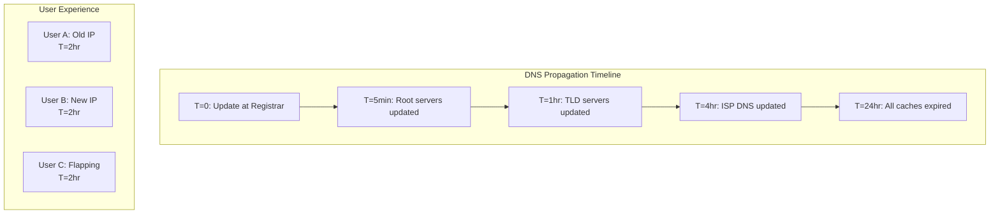
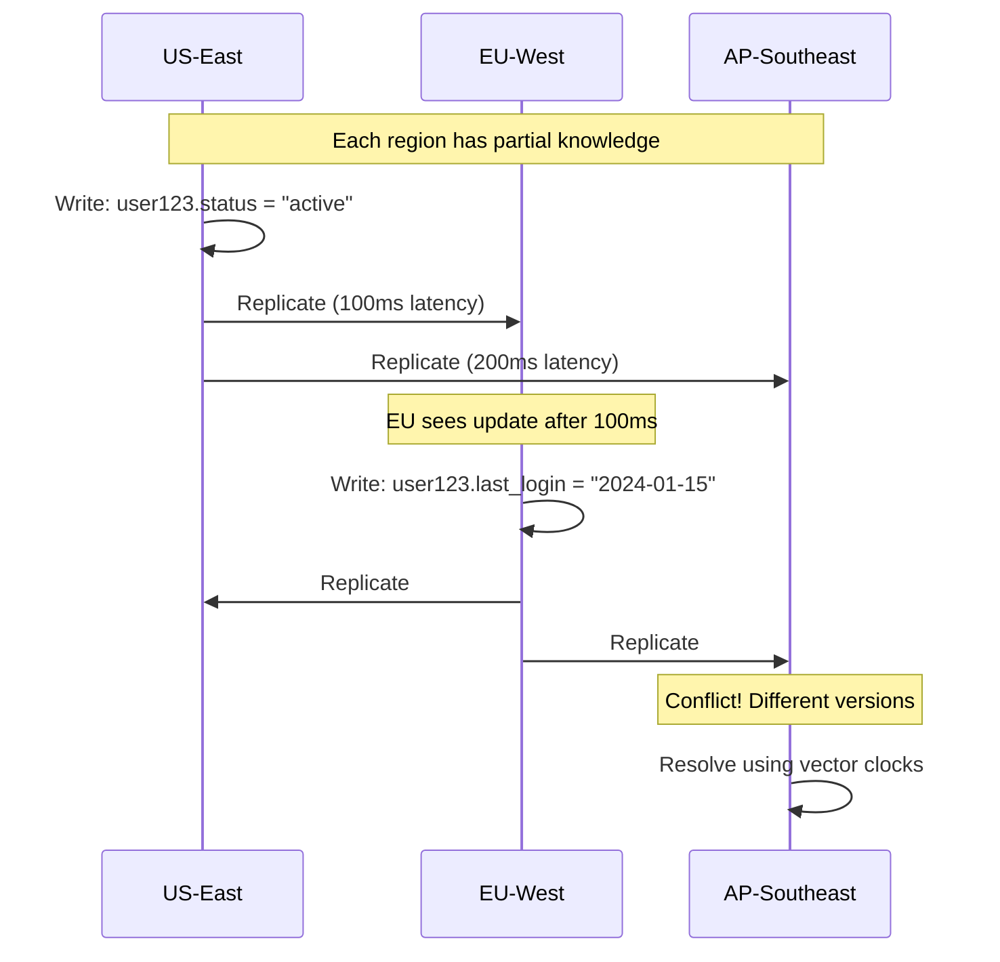
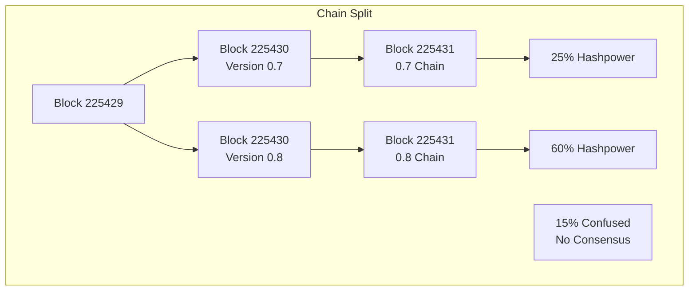
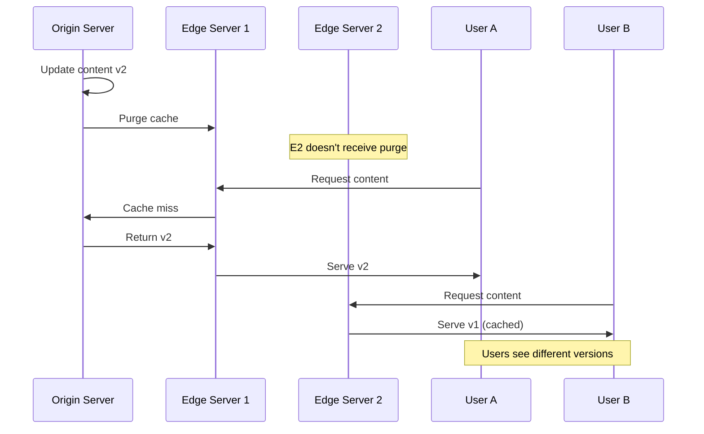

# Real-World Examples: Law of Distributed Knowledge

## Overview

The Law of Distributed Knowledge states that in distributed systems, no single node has complete knowledge of the global state. This fundamental limitation leads to some of the most challenging problems in distributed computing. This page explores real-world examples and case studies that demonstrate how systems handle partial knowledge, uncertainty, and the challenges of achieving consensus.

## Case Study 1: The Great Reddit Outage (2023)

### The Incident

In March 2023, Reddit experienced a major outage caused by a split-brain scenario in their Kubernetes cluster. The incident began when a network partition separated their primary data centers.

### What Happened

```mermaid
graph TB
    subgraph "Before Partition"
        DC1[Data Center 1<br/>Primary]
        DC2[Data Center 2<br/>Secondary]
        DC1 <--> DC2
    end
    
    subgraph "During Partition"
        DC1A[DC1: "I'm Primary"<br/>Accepting Writes]
        DC2A[DC2: "DC1 is down"<br/>"I'm Primary"<br/>Accepting Writes]
        DC1A -.X.- DC2A
    end
    
    subgraph "After Partition"
        DC1B[DC1: Conflicting Data]
        DC2B[DC2: Conflicting Data]
        CONFLICT[Data Conflicts<br/>Manual Resolution]
        DC1B --> CONFLICT
        DC2B --> CONFLICT
    end
```

### Knowledge Problem

Each data center had incomplete knowledge:
- DC1 believed it was still primary and DC2 was down
- DC2 believed DC1 was down and promoted itself to primary
- Both accepted writes, creating divergent state

### Resolution

Reddit had to:
1. Manually reconcile conflicting data
2. Implement stronger split-brain detection
3. Add witness nodes for quorum-based decisions

### Lessons Learned

```python
# Split-brain detection using STONITH (Shoot The Other Node In The Head)
class SplitBrainDetector:
    def __init__(self, witness_nodes):
        self.witnesses = witness_nodes
        self.quorum_size = len(witness_nodes) // 2 + 1
    
    def can_become_primary(self, node_id):
        votes = 0
        for witness in self.witnesses:
            try:
                if witness.vote_for_primary(node_id):
                    votes += 1
            except NetworkError:
# Can't reach witness - no vote
                pass
        
        return votes >= self.quorum_size
```

## Case Study 2: Byzantine Generals at Scale - The Cloudflare Incident (2020)

### The Incident

Cloudflare's backbone network experienced a Byzantine failure where routers disagreed about network topology, causing 50% packet loss globally.

### Byzantine Behavior Observed

```mermaid
graph LR
    subgraph "Cloudflare Network"
        R1[Router 1<br/>"Path A is best"]
        R2[Router 2<br/>"Path B is best"]
        R3[Router 3<br/>"No valid path"]
        R4[Router 4<br/>Flapping between A/B]
    end
    
    R1 -->|Route Update| R2
    R2 -->|Conflicting Update| R3
    R3 -->|Withdrawal| R4
    R4 -->|Oscillating| R1
```

### The Knowledge Problem

- Routers had conflicting views of network state
- BGP protocol propagated inconsistent information
- Some routers "lied" (sent incorrect updates)
- No global consensus on routing paths

### Code Example: Byzantine Fault Tolerant Consensus

```python
# Practical Byzantine Fault Tolerance (PBFT) implementation
class PBFTNode:
    def __init__(self, node_id, total_nodes):
        self.id = node_id
        self.total_nodes = total_nodes
        self.f = (total_nodes - 1) // 3  # Byzantine nodes
        self.view = 0
        self.log = []
        
    def prepare_phase(self, request):
        """Primary broadcasts prepare message"""
        prepare_msg = {
            'view': self.view,
            'sequence': len(self.log),
            'digest': self.hash(request),
            'request': request
        }
        
        responses = self.broadcast(prepare_msg)
        
# Need 2f + 1 matching prepares
        if self.count_matching(responses) >= 2 * self.f + 1:
            return self.commit_phase(prepare_msg)
        return False
    
    def commit_phase(self, prepare_msg):
        """Broadcast commit if prepare succeeded"""
        commit_msg = {
            'view': prepare_msg['view'],
            'sequence': prepare_msg['sequence'],
            'digest': prepare_msg['digest']
        }
        
        responses = self.broadcast(commit_msg)
        
# Need 2f + 1 matching commits
        if self.count_matching(responses) >= 2 * self.f + 1:
            self.log.append(prepare_msg['request'])
            return True
        return False
```

## Case Study 3: DNS Propagation - Knowledge at Internet Scale

### The Challenge

When updating DNS records, changes propagate through a hierarchical system where each node has partial, potentially outdated knowledge.

### Real Example: GitHub Pages DNS Update



### Knowledge Propagation Code

```python
class DNSCache:
    def __init__(self, ttl_default=3600):
        self.cache = {}
        self.ttl_default = ttl_default
        
    def resolve(self, domain):
# Check local knowledge
        if domain in self.cache:
            entry = self.cache[domain]
            if time.time() < entry['expires']:
                return entry['ip']  # Return cached knowledge
        
# Local knowledge expired/missing - query upstream
        try:
            result = self.query_upstream(domain)
            self.cache[domain] = {
                'ip': result['ip'],
                'expires': time.time() + result.get('ttl', self.ttl_default)
            }
            return result['ip']
        except Exception as e:
# Can't update knowledge - use stale if available
            if domain in self.cache:
                return self.cache[domain]['ip']  # Stale knowledge
            raise
```

## Case Study 4: Distributed Database Consistency - DynamoDB Global Tables

### The System

Amazon DynamoDB Global Tables replicate data across multiple AWS regions with eventual consistency.

### Knowledge Synchronization



### Vector Clock Implementation

```python
class VectorClock:
    def __init__(self, node_id):
        self.node_id = node_id
        self.clock = {}
    
    def increment(self):
        """Increment this node's logical time"""
        self.clock[self.node_id] = self.clock.get(self.node_id, 0) + 1
        return self.copy()
    
    def update(self, other_clock):
        """Update knowledge from another node's clock"""
        for node, time in other_clock.items():
            self.clock[node] = max(self.clock.get(node, 0), time)
    
    def happens_before(self, other):
        """Determine causal ordering"""
        for node, time in self.clock.items():
            if time > other.clock.get(node, 0):
                return False
        return True
    
    def concurrent_with(self, other):
        """Detect concurrent updates (partial knowledge)"""
        return not self.happens_before(other) and not other.happens_before(self)

# Usage in distributed database
class DistributedRecord:
    def __init__(self, key, value, vector_clock):
        self.key = key
        self.value = value
        self.clock = vector_clock
    
    def update(self, new_value, node_clock):
        """Update with causality tracking"""
        self.clock.update(node_clock)
        self.clock.increment()
        self.value = new_value
        
    def merge(self, other_record):
        """Merge concurrent updates"""
        if self.clock.happens_before(other_record.clock):
            return other_record
        elif other_record.clock.happens_before(self.clock):
            return self
        else:
# Concurrent updates - need resolution
            return self.resolve_conflict(other_record)
```

## Case Study 5: Blockchain Consensus - The Bitcoin Fork of 2013

### The Incident

In March 2013, Bitcoin experienced an accidental hard fork due to different nodes having different knowledge about valid blocks.

### Knowledge Divergence



### Consensus Recovery Code

```python
class BlockchainNode:
    def __init__(self):
        self.chain = []
        self.pending_blocks = {}
        self.peers = []
        
    def handle_new_block(self, block):
        """Handle knowledge of new block"""
# Validate block
        if not self.validate_block(block):
            return False
            
# Check if we already know this block
        if block.hash in self.pending_blocks:
            return True
            
# Store pending until we have parent
        if block.previous_hash != self.chain[-1].hash:
            self.pending_blocks[block.hash] = block
            self.request_missing_blocks(block.previous_hash)
            return False
            
# Add to our chain
        self.chain.append(block)
        self.process_pending_blocks()
        return True
        
    def resolve_fork(self):
        """Resolve knowledge conflicts with peers"""
        chains = [self.chain]
        
# Gather knowledge from all peers
        for peer in self.peers:
            try:
                peer_chain = peer.get_chain()
                if self.validate_chain(peer_chain):
                    chains.append(peer_chain)
            except NetworkError:
# Partial knowledge - peer unreachable
                pass
        
# Choose longest valid chain (Nakamoto consensus)
        longest_chain = max(chains, key=lambda c: sum(b.difficulty for b in c))
        
        if longest_chain != self.chain:
            self.chain = longest_chain
            self.reorganize()
```

## Case Study 6: CDN Cache Invalidation - The Fastly Outage (2021)

### The Incident

A configuration change caused Fastly's CDN to have inconsistent knowledge about content validity, taking down major websites.

### Cache Coherence Problem



### Cache Invalidation Implementation

```python
class CDNEdgeServer:
    def __init__(self, server_id):
        self.server_id = server_id
        self.cache = {}
        self.invalidation_log = []
        
    def get_content(self, key):
        """Serve content with partial knowledge"""
# Check if we know content is invalid
        if self.is_invalidated(key):
            return self.fetch_from_origin(key)
            
# Check local cache
        if key in self.cache:
            entry = self.cache[key]
            if time.time() < entry['expires']:
                return entry['content']
        
# Knowledge expired - fetch fresh
        return self.fetch_from_origin(key)
    
    def handle_invalidation(self, message):
        """Process cache invalidation message"""
# Record invalidation (even if we don't have the content)
        self.invalidation_log.append({
            'key': message['key'],
            'timestamp': message['timestamp'],
            'version': message.get('version')
        })
        
# Remove from cache if present
        if message['key'] in self.cache:
            del self.cache[message['key']]
    
    def sync_invalidations(self, peer):
        """Sync invalidation knowledge with peer"""
        peer_log = peer.get_invalidation_log()
        
# Merge knowledge - keep all invalidations
        for entry in peer_log:
            if not self.has_invalidation(entry):
                self.handle_invalidation(entry)
```

## CRDT Example: Collaborative Editing with Partial Knowledge

### The Challenge

Multiple users editing a document simultaneously, each with partial knowledge of others' changes.

### CRDT Implementation

```python
class CRDTDocument:
    """Conflict-free Replicated Data Type for text"""
    
    def __init__(self, replica_id):
        self.replica_id = replica_id
        self.characters = []  # List of (char, id, deleted)
        self.counter = 0
        self.vector_clock = VectorClock(replica_id)
        
    def insert(self, position, char):
        """Insert character with unique ID"""
        self.counter += 1
        char_id = (self.replica_id, self.counter)
        
# Find position in CRDT
        crdt_position = self.find_position(position)
        
        self.characters.insert(crdt_position, {
            'char': char,
            'id': char_id,
            'deleted': False
        })
        
        self.vector_clock.increment()
        return char_id
    
    def delete(self, position):
        """Mark character as deleted (tombstone)"""
        crdt_position = self.find_position(position)
        if crdt_position < len(self.characters):
            self.characters[crdt_position]['deleted'] = True
            self.vector_clock.increment()
    
    def merge(self, remote_doc):
        """Merge remote document state"""
# Merge vector clocks for causality
        self.vector_clock.update(remote_doc.vector_clock)
        
# Merge characters
        merged = []
        i, j = 0, 0
        
        while i < len(self.characters) or j < len(remote_doc.characters):
            if i >= len(self.characters):
                merged.append(remote_doc.characters[j])
                j += 1
            elif j >= len(remote_doc.characters):
                merged.append(self.characters[i])
                i += 1
            else:
# Compare character IDs for deterministic ordering
                if self.characters[i]['id'] < remote_doc.characters[j]['id']:
                    merged.append(self.characters[i])
                    i += 1
                elif self.characters[i]['id'] > remote_doc.characters[j]['id']:
                    merged.append(remote_doc.characters[j])
                    j += 1
                else:
# Same character - keep one
                    merged.append(self.characters[i])
                    i += 1
                    j += 1
        
        self.characters = merged
    
    def get_text(self):
        """Get current document text"""
        return ''.join(c['char'] for c in self.characters if not c['deleted'])
```

## Practical Patterns for Handling Distributed Knowledge

### 1. Gossip Protocol for Knowledge Dissemination

```python
class GossipNode:
    def __init__(self, node_id, peers):
        self.node_id = node_id
        self.peers = peers
        self.knowledge = {}
        self.version_vector = {}
        
    def update_knowledge(self, key, value):
        """Update local knowledge"""
        version = self.version_vector.get(key, 0) + 1
        self.knowledge[key] = {
            'value': value,
            'version': version,
            'timestamp': time.time(),
            'source': self.node_id
        }
        self.version_vector[key] = version
        
    def gossip_round(self):
        """Spread knowledge to random peers"""
# Select random subset of peers
        targets = random.sample(self.peers, min(3, len(self.peers)))
        
        for peer in targets:
            try:
# Exchange version vectors
                peer_versions = peer.get_version_vector()
                
# Send updates peer doesn't have
                updates = {}
                for key, version in self.version_vector.items():
                    if peer_versions.get(key, 0) < version:
                        updates[key] = self.knowledge[key]
                
                if updates:
                    peer.receive_gossip(updates)
                    
            except NetworkError:
# Peer unreachable - knowledge remains partial
                pass
```

### 2. Quorum-Based Reads/Writes

```python
class QuorumStorage:
    def __init__(self, replicas, n, r, w):
        """
        n: total replicas
        r: read quorum size
        w: write quorum size
        Constraint: r + w > n (ensures overlap)
        """
        self.replicas = replicas
        self.n = n
        self.r = r
        self.w = w
        
    def write(self, key, value):
        """Write to quorum of replicas"""
        timestamp = time.time()
        success_count = 0
        
        for replica in self.replicas:
            try:
                replica.store(key, value, timestamp)
                success_count += 1
                
                if success_count >= self.w:
                    return True  # Write quorum achieved
                    
            except Exception:
# Replica unreachable
                pass
        
        raise Exception(f"Failed to achieve write quorum: {success_count}/{self.w}")
    
    def read(self, key):
        """Read from quorum and reconcile"""
        responses = []
        
        for replica in self.replicas:
            try:
                value, timestamp = replica.retrieve(key)
                responses.append((value, timestamp))
                
                if len(responses) >= self.r:
# Read quorum achieved - return latest
                    return max(responses, key=lambda x: x[1])[0]
                    
            except Exception:
# Replica unreachable
                pass
        
        raise Exception(f"Failed to achieve read quorum: {len(responses)}/{self.r}")
```

## Summary: Living with Partial Knowledge

These case studies demonstrate that:

1. **Split-brain scenarios** are inevitable when networks partition
2. **Byzantine failures** require explicit protocols to handle lying nodes
3. **Eventual consistency** means accepting temporary knowledge divergence
4. **Consensus protocols** trade off between consistency and availability
5. **CRDTs** enable collaboration despite partial knowledge
6. **Quorums** provide tunable consistency guarantees

The key insight is that distributed systems must be designed to function correctly despite each node having only partial, potentially outdated knowledge of the global state. This is not a bug to be fixed, but a fundamental constraint to be embraced in system design.