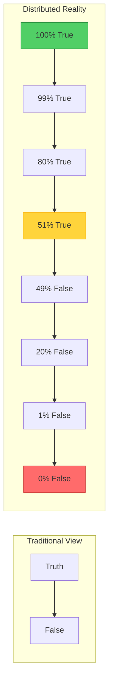
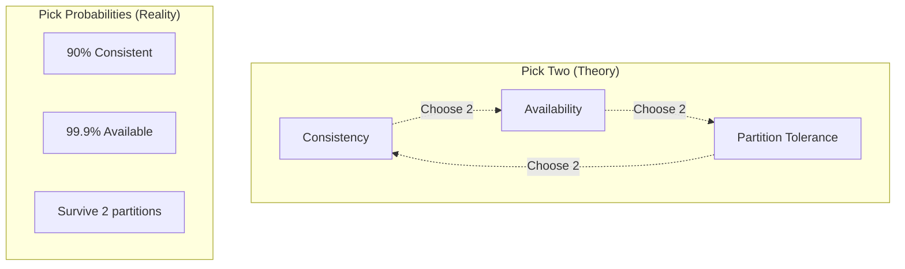
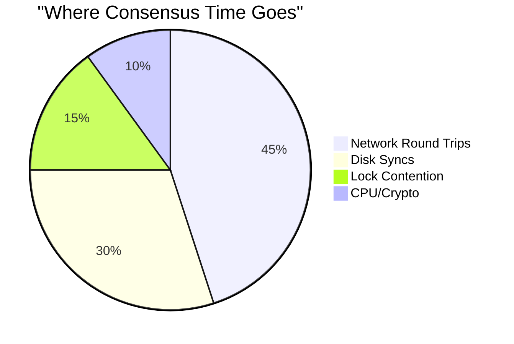

# PAGE 1 – The Lens: *Truth Is a Probability Distribution* 🎭

```text
❌  MYTH                                ✅  LAW 5
════════════════════════════════       ═══════════════════════════════════
"The database knows the truth"         "Every replica knows *a* truth"
"Consensus = certainty"                "Consensus = costly confidence"
"Immutable ledger"                     "Competing ledgers + fork-choice"
```

## ⚡ One-Inch Punch

> **"Your system never has *one* state—it has many simultaneously, each with a confidence score."**

## 3 Root Causes of Uncertainty

| Root        | Inevitable driver               | 67 ms global consensus example      |
| ----------- | ------------------------------- | ----------------------------------- |
| **Latency** | Speed-of-light delay            | 50k API writes race each RTT        |
| **Faults**  | Nodes crash or lie (Byzantine)  | Half routers propagate poisoned BGP |
| **Change**  | Code or schema versions diverge | Knight Capital v1.9.8 vs v2.0.1     |

## Instant Probabilistic Truth Formula

```text
Truth_Confidence = 1 – P(partition) × P(conflict) × P(byzantine)

Adjust quorum / clocks / retries → raise or lower confidence, never 100%.
```

<div class="axiom-box">
<h3>🌍 Physics of Knowledge Distribution</h3>
<ul>
<li><strong>Information speed</strong>: Limited by c (speed of light)</li>
<li><strong>NYC ↔ Singapore</strong>: 15,344 km = minimum 51 ms one-way</li>
<li><strong>During that 51 ms</strong>: 50,000 writes could occur</li>
<li><strong>Result</strong>: Two valid but different truths exist</li>
</ul>
</div>

## The Truth Spectrum



## Breaking the Single-Truth Mindset

| Old Thinking | New Reality | Implementation |
|--------------|-------------|----------------|
| "Master database" | "Multiple valid versions" | Multi-master with vector clocks |
| "Source of truth" | "Sources of truths" | CRDTs with merge semantics |
| "Consistent state" | "Eventually consistent states" | Tunable consistency levels |
| "Transaction complete" | "Transaction confidence 95%" | Probabilistic acknowledgments |

<div class="failure-vignette">
<h3>🚨 Production Horror: Reddit's Split-Brain Crisis</h3>
<p><strong>Reddit Kubernetes Incident, March 2023</strong></p>
<ul>
<li>Network partition split etcd cluster</li>
<li>Both partitions elected leaders</li>
<li>Conflicting pod schedules accepted</li>
<li>Same pods started on multiple nodes</li>
<li>Data corruption across shards</li>
<li>Resolution: 14-hour manual reconciliation</li>
</ul>
</div>

## The CAP Triangle Reality



## Truth Confidence Levels

| Level | Guarantee | Use Case | Example System |
|-------|-----------|----------|----------------|
| **Strong** | Linearizable | Financial ledgers | Spanner |
| **Sequential** | Order preserved | Event streams | Kafka |
| **Causal** | Cause→Effect | Social feeds | Dynamo |
| **Eventual** | Converges someday | View counts | Cassandra |
| **Weak** | Best effort | Metrics | UDP counters |

<div class="decision-box">
<h3>🎯 Quick Decision Tree</h3>
<pre>
Need banking-grade truth?
├─ Yes → Pay for Spanner/CockroachDB
└─ No → Need causal ordering?
         ├─ Yes → Vector clocks + read repair
         └─ No → Need convergence?
                  ├─ Yes → CRDTs
                  └─ No → Best-effort + monitoring
</pre>
</div>

## The Cost of Truth



<div class="truth-box">
<h3>💡 Universal Truth About Truth</h3>
<p>In distributed systems, <strong>truth is not binary but probabilistic</strong>. Every piece of data exists in a superposition of states until observation collapses it into your local view. The cost of certainty is latency; the cost of speed is uncertainty.</p>
</div>

## Embracing Probabilistic Truth

### Before Understanding Law 5
```python
def get_balance(user_id):
    return db.query(f"SELECT balance FROM accounts WHERE id={user_id}")
    # Assumes: single source of truth
```

### After Understanding Law 5
```python
def get_balance(user_id, consistency_level="eventual"):
    balances = []
    confidence = 0
    
    if consistency_level == "strong":
        # Read from majority with vector clock
        responses = read_quorum(user_id, quorum_size=majority)
        balance, vector_clock = merge_with_vector_clocks(responses)
        confidence = len(responses) / total_replicas
    else:
        # Read from nearest replica
        balance = read_local(user_id)
        staleness = time.now() - last_sync_time
        confidence = 1.0 - (staleness / max_staleness)
    
    return {
        "balance": balance,
        "confidence": confidence,
        "staleness_ms": staleness,
        "consistency": consistency_level
    }
```

## Next: [The Five Epistemic Specters →](page2-specters.md)