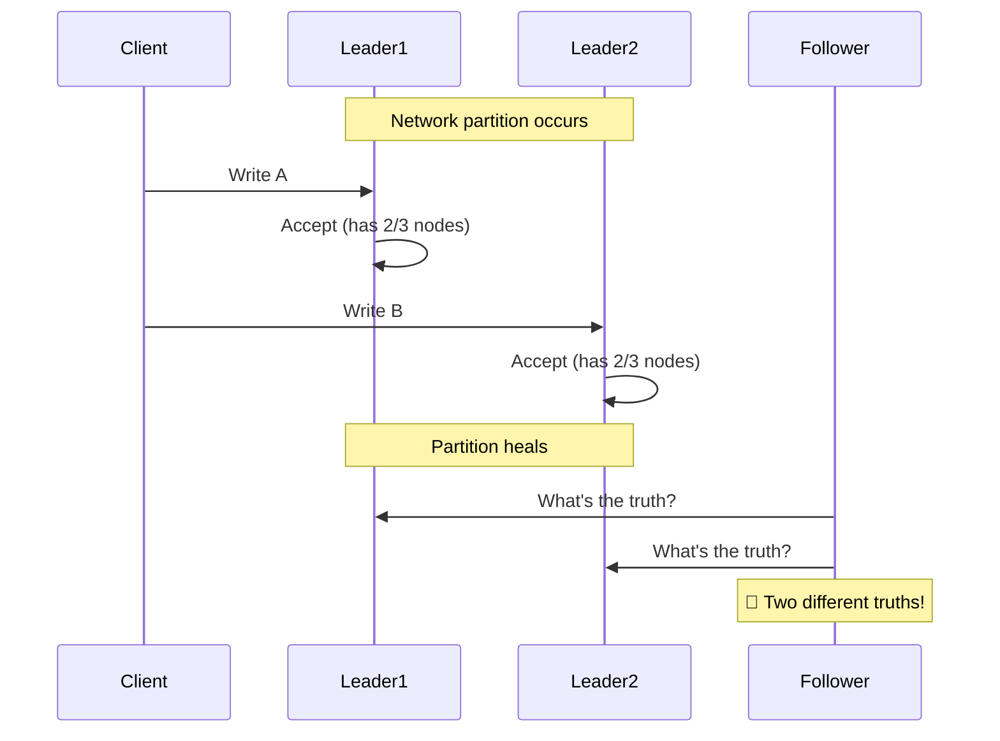
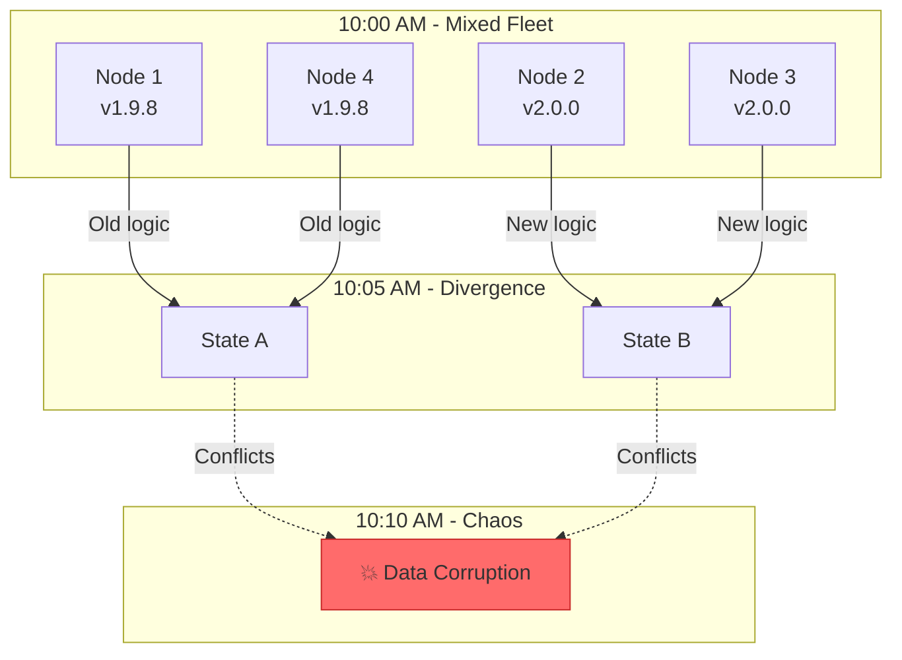
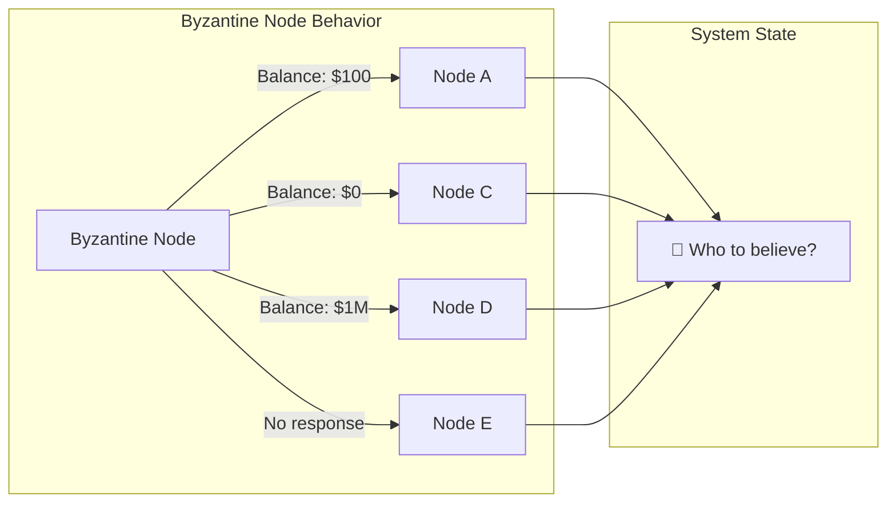
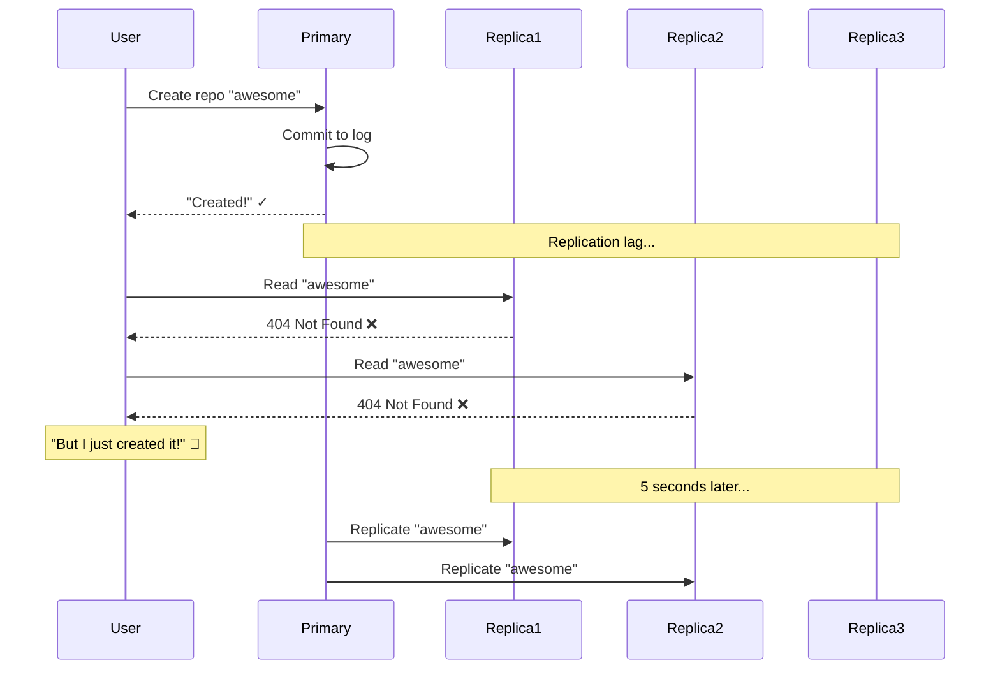
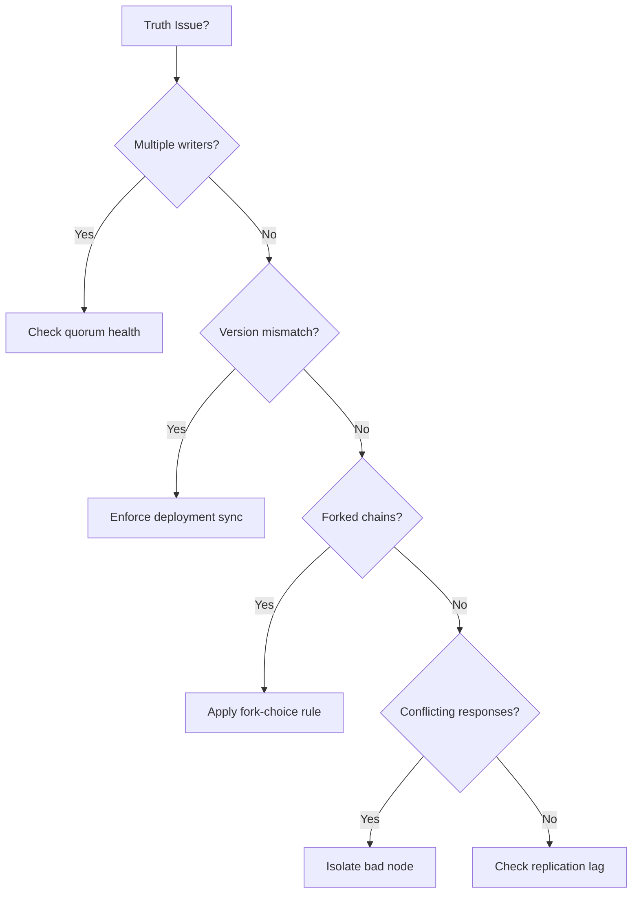

# PAGE 2 – The Specters of Truth Divergence 💀

```text
THE FIVE EPISTEMIC SPECTERS
════════════════════════════
1. SPLIT-BRAIN        🧠  – Two primaries accept writes
2. VERSION SKEW       📦  – Old and new code interpret data differently
3. FORK CHAOS         ⛓️  – Parallel chains in ledgers/logs
4. BYZANTINE MADNESS  🎭  – Nodes emit inconsistent statements
5. TRUTH LAG          🐌  – Commit appears but replicas stale
```

## The Specters: Pattern Recognition Guide

| Specter          | Real Case             | Autopsy Cost        | Fast Antidote                        |
| ---------------- | --------------------- | ------------------- | ------------------------------------ |
| **Split-brain**  | Reddit K8s 2023       | Manual data surgery | Majority quorum + read-only minority |
| **Version skew** | Knight Capital 2012   | $440M / 45 min      | Cluster-wide version beacons         |
| **Fork chaos**   | Bitcoin v0.7/0.8 2013 | Orphaned 6h tx      | Explicit fork-choice rule            |
| **Byzantine**    | Cloudflare BGP 2020   | 50% pkt loss        | Authenticated, multi-sig routes      |
| **Truth lag**    | GitHub phantom repos  | Lost user work      | Vector-clock reconciliation          |

## Specter #1: Split-Brain 🧠



<div class="failure-vignette">
<h3>🚨 Reddit's 14-Hour Split-Brain Marathon</h3>
<ul>
<li><strong>Time</strong>: March 14, 2023, 02:47 UTC</li>
<li><strong>Trigger</strong>: Network maintenance caused etcd partition</li>
<li><strong>Impact</strong>: 
  <ul>
    <li>Dual pod scheduling → resource conflicts</li>
    <li>Duplicate job execution → data corruption</li>
    <li>Inconsistent service discovery → 502 errors</li>
  </ul>
</li>
<li><strong>Recovery</strong>: Manual reconciliation of 2.3M conflicting objects</li>
</ul>
</div>

### Split-Brain Detection Dashboard
```text
┌─────────────────────────────────────────┐
│         SPLIT-BRAIN DETECTOR            │
├─────────────────────────────────────────┤
│ Consensus Groups:  3 detected ⚠️        │
│ Write Conflicts:   1,247/min 📈         │
│ Clock Divergence:  487ms                │
│ Partition Status:  ACTIVE 🔴            │
└─────────────────────────────────────────┘
```

## Specter #2: Version Skew 📦



<div class="axiom-box">
<h3>⚠️ Version Skew Formula</h3>
<pre>
Risk = (Version_Delta × Traffic_Rate × State_Coupling)
     = (2.0 - 1.9) × 50k_req/s × 0.8_coupling
     = 4,000 potential conflicts/second
</pre>
</div>

## Specter #3: Fork Chaos ⛓️

```text
The Bitcoin Fork of 2013
════════════════════════

Chain A (v0.7):  [1]→[2]→[3]→[4A]→[5A]→[6A]
                            ↘
Chain B (v0.8):              [4B]→[5B]→[6B]→[7B]→[8B]

6 hours of transactions on Chain A = orphaned
Merchants who accepted 4A-6A payments = lost money
```

### Fork Detection Metrics
| Metric | Normal | During Fork | Action Threshold |
|--------|--------|-------------|------------------|
| Chain tips | 1 | 2+ | Alert at 2 |
| Reorg depth | 0-1 | 6+ blocks | Page at 3 |
| Uncle rate | <1% | >10% | Investigate at 5% |
| Finality time | 2 min | ∞ | Halt at 10 min |

## Specter #4: Byzantine Madness 🎭



<div class="failure-vignette">
<h3>🚨 Cloudflare's BGP Byzantine Failure</h3>
<ul>
<li><strong>Date</strong>: June 21, 2020</li>
<li><strong>Byzantine behavior</strong>: Router announced conflicting routes</li>
<li><strong>Impact</strong>: 
  <ul>
    <li>Different ISPs saw different Internet topology</li>
    <li>50% packet loss to major sites</li>
    <li>27 minutes of Internet chaos</li>
  </ul>
</li>
<li><strong>Root cause</strong>: Memory corruption caused split personality</li>
</ul>
</div>

### Byzantine Fault Detection
```python
def detect_byzantine(responses):
    # Group identical responses
    groups = defaultdict(list)
    for node, response in responses.items():
        groups[hash(response)].append(node)
    
    # Byzantine if > 2 different answers
    if len(groups) > 2:
        return "BYZANTINE_DETECTED", groups
    
    # Find majority
    majority = max(groups.values(), key=len)
    if len(majority) < (2 * f + 1):  # f = fault tolerance
        return "INSUFFICIENT_MAJORITY", groups
    
    return "CONSENSUS", majority
```

## Specter #5: Truth Lag 🐌



### Truth Lag Monitoring

```text
┌─────────────────────────────────────────────────┐
│           REPLICATION LAG MONITOR               │
├──────────────┬──────────────┬──────────────────┤
│ Replica      │ Lag (ms)     │ Status           │
├──────────────┼──────────────┼──────────────────┤
│ us-east-1a   │ 47          │ ✅ Healthy       │
│ us-east-1b   │ 156         │ ✅ Healthy       │
│ us-west-2a   │ 3,847       │ ⚠️  Warning      │
│ eu-west-1a   │ 45,291      │ 🔴 Critical      │
│ ap-south-1a  │ DISCONNECTED │ ❌ Failed        │
└──────────────┴──────────────┴──────────────────┘
```

## Specter Correlation Matrix

```text
           Split  Version  Fork  Byzantine  Lag
           ─────  ───────  ────  ─────────  ───
Split       1.0    0.7     0.3     0.6     0.8
Version     0.7    1.0     0.5     0.4     0.3
Fork        0.3    0.5     1.0     0.8     0.2
Byzantine   0.6    0.4     0.8     1.0     0.5
Lag         0.8    0.3     0.2     0.5     1.0

🔴 High correlation (>0.6) = Cascading failures likely
```

<div class="truth-box">
<h3>🎯 Universal Detection Pattern</h3>
<p>Watch for these signals in your metrics:</p>
<ul>
<li><strong>Sudden conflict rate spike</strong> → Split-brain</li>
<li><strong>Gradual divergence</strong> → Version skew</li>
<li><strong>Competing branches</strong> → Fork chaos</li>
<li><strong>Inconsistent responses</strong> → Byzantine node</li>
<li><strong>Read-after-write failures</strong> → Truth lag</li>
</ul>
</div>

## Quick Triage Guide



## Next: [Architectural Counter-Patterns →](page3-architecture.md)