# PAGE 3 – Architectural Counter-Patterns ⚙️

## Pattern-Problem Matching Matrix

| Goal                | Counter-Pattern                    | Core Rule                                      | Costs Moved To        |
| ------------------- | ---------------------------------- | ---------------------------------------------- | --------------------- |
| **Prevent Split**   | **Quorum Guardrails**              | Write only with `n ≥ (N/2)+1` reachable       | Availability          |
| **Tolerate Forks**  | **Fork-Choice w/ Rollback Budget** | "Longest-work unless cost > X"                 | Latency, UX surprises |
| **Detect Lies**     | **Byzantine Voting (3f+1)**        | Commit only after 2f+1 matching echoes         | Bandwidth, CPU        |
| **Order Events**    | **TrueTime / Logical Clocks**      | Wait ≤ ε then timestamp                        | Throughput            |
| **Merge Conflicts** | **CRDT / "Keep Both"**             | State = associative ⊔ commutative ⊔ idempotent | Storage, App logic    |

## 🗺️ Truth-Model Decision Grid

| Data type     | Users    | Write rate | Pick                                 |
| ------------- | -------- | ---------- | ------------------------------------ |
| Money         | millions | moderate   | Spanner-style TrueTime (strict)      |
| Social feed   | billions | very high  | Dynamo + vector clocks (merge later) |
| Config flags  | dozens   | low        | Raft / Paxos (strong)                |
| Shopping cart | millions | burst      | Add-Wins OR-Set CRDT                 |

## Pattern #1: Quorum Guardrails 🛡️

```mermaid
graph TB
    subgraph "Write Path"
        W[Write Request] --> Q{Quorum Check}
        Q -->|"≥(N/2)+1"| Accept[Accept Write]
        Q -->|"<(N/2)+1"| Reject[Reject Write]
    end
    
    subgraph "5-Node Example"
        N1[Node 1 ✓]
        N2[Node 2 ✓]
        N3[Node 3 ✓]
        N4[Node 4 ❌]
        N5[Node 5 ❌]
        Count[3/5 = Quorum ✓]
    end
    
    style Accept fill:#51cf66,stroke:#2b8a3e
    style Reject fill:#ff6b6b,stroke:#c92a2a
```



### Implementation Blueprint

```python
class QuorumGuard:
    def __init__(self, nodes, consistency_level="quorum"):
        self.nodes = nodes
        self.levels = {
            "one": 1,
            "quorum": (len(nodes) // 2) + 1,
            "all": len(nodes)
        }
        self.required = self.levels[consistency_level]
    
    async def write(self, key, value):
        # Phase 1: Prepare
        promises = await self.broadcast_prepare(key)
        if len(promises) < self.required:
            raise QuorumFailure(f"Only {len(promises)}/{self.required} nodes responded")
        
        # Phase 2: Accept
        ballot = max(p.ballot for p in promises) + 1
        acks = await self.broadcast_accept(key, value, ballot)
        if len(acks) < self.required:
            raise QuorumFailure("Lost quorum during accept phase")
        
        return {"written": True, "quorum": len(acks), "ballot": ballot}
```

<div class="axiom-box">
<h3>📏 Quorum Math</h3>
<table>
<tr><th>Nodes (N)</th><th>Write Quorum</th><th>Read Quorum</th><th>Fault Tolerance</th></tr>
<tr><td>3</td><td>2</td><td>2</td><td>1 failure</td></tr>
<tr><td>5</td><td>3</td><td>3</td><td>2 failures</td></tr>
<tr><td>7</td><td>4</td><td>4</td><td>3 failures</td></tr>
<tr><td>9</td><td>5</td><td>5</td><td>4 failures</td></tr>
</table>
<p><strong>Rule</strong>: W + R > N guarantees overlap</p>
</div>

## Pattern #2: Fork-Choice Rules ⛓️


### Fork Resolution Strategies

| Strategy | Rule | Pros | Cons | Example |
|----------|------|------|------|---------|
| **Longest Chain** | Most blocks wins | Simple | Vulnerable to attack | Bitcoin |
| **Most Work** | Highest difficulty | Secure | Complex | Ethereum PoW |
| **First Seen** | Timestamp priority | Fast | Timestamp attacks | Some sidechains |
| **Economic Weight** | Most value locked | Incentive aligned | Plutocratic | PoS chains |

### Rollback Budget Implementation

```python
class ForkManager:
    def __init__(self, max_rollback_depth=6, max_rollback_value=10000):
        self.max_depth = max_rollback_depth
        self.max_value = max_rollback_value
        self.canonical_chain = []
        
    def handle_fork(self, new_chain, old_chain):
        fork_point = self.find_fork_point(new_chain, old_chain)
        rollback_depth = len(old_chain) - fork_point
        rollback_value = self.calculate_rollback_cost(old_chain[fork_point:])
        
        if rollback_depth > self.max_depth:
            raise ForkTooDeep(f"Would rollback {rollback_depth} blocks")
        
        if rollback_value > self.max_value:
            raise ForkTooExpensive(f"Would rollback ${rollback_value}")
        
        # Safe to switch
        self.reorg_to(new_chain, fork_point)
```

## Pattern #3: Byzantine Fault Tolerance (BFT) 🎭


### PBFT State Machine

```python
class PBFTNode:
    def __init__(self, node_id, total_nodes):
        self.id = node_id
        self.f = (total_nodes - 1) // 3  # Byzantine fault tolerance
        self.view = 0
        self.log = []
        
    def is_primary(self):
        return self.id == (self.view % self.total_nodes)
    
    def process_request(self, request):
        if self.is_primary():
            # Primary broadcasts pre-prepare
            msg = PrePrepare(self.view, self.next_seq, request)
            self.broadcast(msg)
            self.log.append(msg)
        
    def handle_preprepare(self, msg):
        if self.valid_preprepare(msg):
            # Backup broadcasts prepare
            prepare = Prepare(msg.view, msg.seq, msg.digest)
            self.broadcast(prepare)
            self.prepares[msg.seq].add(msg.node_id)
    
    def handle_prepare(self, msg):
        self.prepares[msg.seq].add(msg.node_id)
        
        # If 2f prepares collected
        if len(self.prepares[msg.seq]) >= 2 * self.f:
            commit = Commit(msg.view, msg.seq, msg.digest)
            self.broadcast(commit)
    
    def handle_commit(self, msg):
        self.commits[msg.seq].add(msg.node_id)
        
        # If 2f+1 commits collected
        if len(self.commits[msg.seq]) >= 2 * self.f + 1:
            self.execute(msg.seq)
```

## Pattern #4: Logical Time Ordering ⏰

```mermaid
graph TD
    subgraph "Physical Time Problems"
        P1[Server A: 10:00:00.000]
        P2[Server B: 10:00:00.100]
        P3[Server C: 09:59:59.900]
        P1 -.->|"Who's first?"| Q[❓]
        P2 -.-> Q
        P3 -.-> Q
    end
    
    subgraph "Logical Time Solution"
        L1[Server A: LC=42]
        L2[Server B: LC=43]
        L3[Server C: LC=41]
        L1 -->|Order: 2nd| Order[41→42→43]
        L2 -->|Order: 3rd| Order
        L3 -->|Order: 1st| Order
    end
```



### TrueTime Implementation

```python
class TrueTimeEmulator:
    def __init__(self, uncertainty_ms=7):
        self.uncertainty = uncertainty_ms
        
    def now(self):
        actual_time = time.time() * 1000
        return TrueTimeInterval(
            earliest=actual_time - self.uncertainty,
            latest=actual_time + self.uncertainty
        )
    
    def wait_until_certain(self, timestamp):
        """Wait until timestamp is definitely in the past"""
        while True:
            tt = self.now()
            if timestamp < tt.earliest:
                return  # Timestamp definitely passed
            time.sleep((timestamp - tt.earliest) / 1000.0)

class SpannerTransaction:
    def commit(self, writes):
        # Get commit timestamp
        commit_ts = self.truetime.now().latest
        
        # Wait for timestamp to be certain
        self.truetime.wait_until_certain(commit_ts)
        
        # Now safe to commit
        return self.storage.commit_at(commit_ts, writes)
```

## Pattern #5: CRDT Merge Semantics 🔄

```mermaid
graph TB
    subgraph "G-Counter CRDT"
        GC1[Node A: {A:5, B:3}]
        GC2[Node B: {A:2, B:7}]
        GCM[Merge: {A:5, B:7}]
        GC1 --> GCM
        GC2 --> GCM
        GCM --> GCR[Sum: 12]
    end
    
    subgraph "OR-Set CRDT"
        OS1["{🍎(a1), 🍌(b1)}"]
        OS2["{🍎(a1), 🍇(c1)}"]
        OSM["{🍎(a1), 🍌(b1), 🍇(c1)}"]
        OS1 --> OSM
        OS2 --> OSM
    end
```

### CRDT Implementation Cookbook

```python
class GCounter:
    """Grow-only counter CRDT"""
    def __init__(self, node_id):
        self.node_id = node_id
        self.counts = defaultdict(int)
    
    def increment(self, delta=1):
        self.counts[self.node_id] += delta
    
    def value(self):
        return sum(self.counts.values())
    
    def merge(self, other):
        for node, count in other.counts.items():
            self.counts[node] = max(self.counts[node], count)

class ORSet:
    """Observed-Remove Set CRDT"""
    def __init__(self, node_id):
        self.node_id = node_id
        self.adds = defaultdict(set)  # elem -> {unique_ids}
        self.removes = defaultdict(set)
    
    def add(self, elem):
        unique_id = f"{self.node_id}:{uuid.uuid4()}"
        self.adds[elem].add(unique_id)
    
    def remove(self, elem):
        # Remove all observed adds
        self.removes[elem] = self.adds[elem].copy()
    
    def elements(self):
        result = set()
        for elem, add_ids in self.adds.items():
            if add_ids - self.removes.get(elem, set()):
                result.add(elem)
        return result
    
    def merge(self, other):
        # Union adds and removes
        for elem, ids in other.adds.items():
            self.adds[elem] |= ids
        for elem, ids in other.removes.items():
            self.removes[elem] |= ids
```

## Architecture Decision Framework

<div class="decision-box">
<h3>🎯 Consistency Model Selector</h3>
<pre>
Is it money or legally binding?
├─ Yes → Strong consistency (Spanner/CockroachDB)
└─ No → Is ordering critical?
         ├─ Yes → Sequential consistency (Kafka)
         └─ No → Can conflicts be merged?
                  ├─ Yes → CRDTs (Riak/Redis)
                  └─ No → Last-write-wins (Cassandra)
</pre>
</div>

## Truth Engineering Checklist

### Design Phase
- [ ] Define consistency requirements per data type
- [ ] Calculate quorum sizes for availability target
- [ ] Choose conflict resolution strategy
- [ ] Design rollback/compensation flows
- [ ] Plan for Byzantine scenarios

### Implementation Phase
- [ ] Add vector clocks to all entities
- [ ] Implement read repair
- [ ] Add conflict metrics
- [ ] Create reconciliation jobs
- [ ] Test split-brain scenarios

### Operation Phase
- [ ] Monitor replication lag
- [ ] Alert on conflict rates
- [ ] Track fork frequencies
- [ ] Measure truth convergence time
- [ ] Audit Byzantine behaviors

<div class="truth-box">
<h3>💡 The Golden Rules of Distributed Truth</h3>
<ol>
<li><strong>Assume conflicts will happen</strong> - Design for merge, not prevention</li>
<li><strong>Make truth eventual</strong> - Immediate consistency is a luxury</li>
<li><strong>Version everything</strong> - History enables reconciliation</li>
<li><strong>Trust but verify</strong> - Assume Byzantine behavior possible</li>
<li><strong>Measure confidence</strong> - Truth is probabilistic, not binary</li>
</ol>
</div>

## Next: [Truth Health Operations →](page4-operations.md)