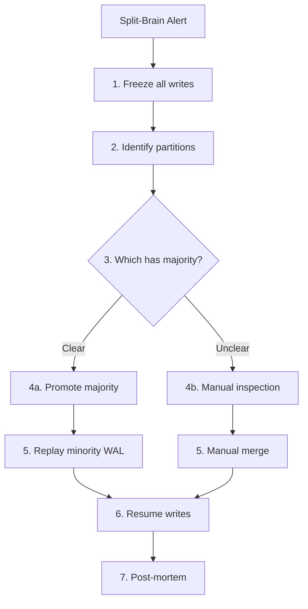

# PAGE 4 – Operations & "Truth Health" 🛠️

## 4.1 Daily Truth Audit ✅

```text
□ Any partitioned nodes?   (simulate ✂️)
□ Any version mismatch?    (hash rollup)
□ Max replica staleness?   (ms)
□ Conflict backlog size?   (# objects)
```

## 4.2 Epistemic Dashboard 📊

```text
┌─────────────────────────── TRUTH HEALTH MONITOR ───────────────────────────┐
│                                                                              │
│  Consensus Health                         Replication Status                 │
│  ┌────────────────────────┐             ┌────────────────────────┐         │
│  │ Write Quorum Failures  │             │ P99 Consistency Lag    │         │
│  │ ▓▓░░░░░░░░ 0.3%       │             │ ▓▓▓▓░░░░░░ 4.2s      │         │
│  │ Target: <1%            │             │ Target: <5s            │         │
│  └────────────────────────┘             └────────────────────────┘         │
│                                                                              │
│  Fork Detection                          Byzantine Monitor                   │
│  ┌────────────────────────┐             ┌────────────────────────┐         │
│  │ Fork Length: 1 block   │             │ Byzantine Alerts: 0    │         │
│  │ ▓░░░░░░░░░ ✓          │             │ ░░░░░░░░░░ ✓          │         │
│  │ Target: ≤1             │             │ Target: 0              │         │
│  └────────────────────────┘             └────────────────────────┘         │
│                                                                              │
│  Conflict Resolution                     Version Distribution                │
│  ┌────────────────────────┐             ┌────────────────────────┐         │
│  │ Daily Conflicts: 8,432 │             │ v2.1.0: ████████ 89%  │         │
│  │ Auto-resolved: 8,419   │             │ v2.0.9: ██░░░░░░ 11%  │         │
│  │ Manual: 13 ⚠️          │             │ Versions: 2 ✓         │         │
│  └────────────────────────┘             └────────────────────────┘         │
└──────────────────────────────────────────────────────────────────────────────┘
```

### Alert Configuration

| Metric | Warn | Page | Auto-Remedy |
|--------|------|------|-------------|
| Write quorum failures | >0.5% | >1% | Increase timeout |
| P99 consistency lag | >3s | >5s | Scale read replicas |
| Fork length | >1 | >2 | Halt non-critical writes |
| Byzantine alerts | 1 | 2 | Quarantine node |
| Manual conflicts | >10/day | >50/day | Review merge logic |

## 4.3 Chaos Menu 🎲

### Truth Divergence Tests

```bash
# 1. Partition Tolerance Test
chaos network partition --duration 60s --nodes 40%
# Expect: Minority goes read-only

# 2. Version Skew Injection  
chaos deploy --version mixed --ratio 50:50
# Expect: Gradual convergence via beacons

# 3. Byzantine Node Simulation
chaos node lie --probability 0.1 --duration 5m
# Expect: Node quarantined within 30s

# 4. Clock Desync Test
chaos time drift --rate +50ms/min --nodes 20%
# Expect: Commit-wait increases, no conflicts

# 5. Replica Lag Injection
chaos throttle replication --latency 10s --replicas 2
# Expect: Read-your-writes failures spike
```

<div class="axiom-box">
<h3>🎯 Chaos Success Criteria</h3>
<ul>
<li>✅ No permanent data loss</li>
<li>✅ Conflicts auto-resolve 99%+</li>
<li>✅ Clear degradation (not failure)</li>
<li>✅ Automatic recovery < 5 min</li>
<li>✅ Audit trail preserved</li>
</ul>
</div>

## 4.4 Truth Divergence Runbook 📖

### ALERT: SPLIT-BRAIN DETECTED



### Quick Commands

```bash
# Detect split brain
kubectl exec -it etcd-0 -- etcdctl endpoint status --cluster

# Freeze writes (emergency)
kubectl patch deployment api-server -p '{"spec":{"replicas":0}}'

# Find divergence point
SELECT MAX(committed_index) FROM raft_log GROUP BY node_id;

# Force leader election
kubectl exec -it etcd-0 -- etcdctl move-leader <node-id>
```

## 4.5 Truth Debt Ledger 💰

```text
┌─────────────────────────── TECHNICAL DEBT: TRUTH ───────────────────────────┐
│                                                                               │
│ Decision: "Skip vector clocks for user profiles"                             │
│ ├─ Principal: 2 weeks faster launch                                          │
│ ├─ Interest Rate: 0.5% conflicts/day (500 manual fixes)                      │
│ ├─ Current Debt: 45,000 unresolved conflicts                                 │
│ └─ Bankruptcy Date: ~90 days until support overwhelmed                       │
│                                                                               │
│ Decision: "Last-write-wins for shopping carts"                               │
│ ├─ Principal: Simple implementation                                           │
│ ├─ Interest Rate: 3% cart corruptions/week                                   │
│ ├─ Current Debt: $12K/month in refunds                                       │
│ └─ Bankruptcy Date: When we IPO and auditors arrive                          │
│                                                                               │
│ Decision: "Trust the database timestamp"                                      │
│ ├─ Principal: No clock sync needed                                           │
│ ├─ Interest Rate: 1 major incident/quarter                                   │
│ ├─ Current Debt: 2 production outages                                        │
│ └─ Bankruptcy Date: Next timezone change                                     │
└───────────────────────────────────────────────────────────────────────────────┘
```

### Debt Calculation Formula

```python
def calculate_truth_debt(decision):
    daily_conflicts = decision.conflict_rate * decision.daily_writes
    manual_effort_hrs = daily_conflicts * 0.1  # 6 min per conflict
    
    cost_per_day = (
        manual_effort_hrs * hourly_rate +
        daily_conflicts * revenue_loss_per_conflict
    )
    
    days_to_bankruptcy = budget_remaining / cost_per_day
    
    return {
        "daily_cost": cost_per_day,
        "total_debt": cost_per_day * days_elapsed,
        "bankruptcy_date": today + timedelta(days=days_to_bankruptcy)
    }
```

## 4.6 Production Truth Queries 🔍

### Morning Health Check SQL

```sql
-- 1. Conflict Detection
WITH conflict_pairs AS (
    SELECT entity_id, 
           COUNT(DISTINCT value_hash) as versions,
           COUNT(DISTINCT node_id) as writers
    FROM write_log
    WHERE timestamp > NOW() - INTERVAL '1 hour'
    GROUP BY entity_id
    HAVING COUNT(DISTINCT value_hash) > 1
)
SELECT COUNT(*) as conflicts,
       AVG(versions) as avg_versions,
       MAX(writers) as max_writers
FROM conflict_pairs;

-- 2. Replication Lag by Region
SELECT 
    replica_region,
    MAX(master_timestamp - replica_timestamp) as max_lag_ms,
    AVG(master_timestamp - replica_timestamp) as avg_lag_ms,
    PERCENTILE_CONT(0.99) WITHIN GROUP (ORDER BY 
        master_timestamp - replica_timestamp) as p99_lag_ms
FROM replication_status
WHERE check_time > NOW() - INTERVAL '5 minutes'
GROUP BY replica_region
ORDER BY max_lag_ms DESC;

-- 3. Version Skew Detection
SELECT 
    app_version,
    COUNT(DISTINCT node_id) as node_count,
    MIN(first_seen) as first_deployed,
    MAX(last_seen) as last_active
FROM node_heartbeats
WHERE last_seen > NOW() - INTERVAL '10 minutes'
GROUP BY app_version
HAVING COUNT(DISTINCT app_version) > 1;
```

## 4.7 Truth Observability Stack

```yaml
# Prometheus alerts
groups:
  - name: truth_health
    rules:
      - alert: SplitBrainDetected
        expr: |
          count(count by (partition_id) (
            up{job="etcd"} == 1
          )) > 1
        for: 30s
        
      - alert: ReplicationLagHigh
        expr: |
          max(mysql_slave_lag_seconds) > 5
        for: 5m
        
      - alert: ConflictRateHigh
        expr: |
          rate(conflicts_total[5m]) > 100
        for: 10m

# Grafana dashboard panels
panels:
  - title: "Truth Confidence Score"
    query: |
      1 - (
        max(rate(conflicts_total[5m])) * 
        max(mysql_slave_lag_seconds) / 1000 *
        (1 - avg(up{job="etcd"}))
      )
```

## 4.8 The "Truth Crisis" Drill 🚨

### Scenario Setup
1. **Inject**: Network partition (40% nodes isolated)
2. **Inject**: Clock skew +5 minutes on 20% nodes  
3. **Inject**: Deploy mixed versions (50/50 split)
4. **Inject**: Byzantine behavior on 1 node
5. **Provide**: Only this page to on-call

### Success Metrics
```text
Detection Time:
  < 2 min  = 🥇 Gold
  < 5 min  = 🥈 Silver  
  < 10 min = 🥉 Bronze
  > 10 min = ❌ Fail

Resolution Time:
  < 10 min = 🥇 Gold
  < 20 min = 🥈 Silver
  < 30 min = 🥉 Bronze
  > 30 min = ❌ Fail

Data Loss:
  None     = 🥇 Gold
  <0.01%   = 🥈 Silver
  <0.1%    = 🥉 Bronze
  >0.1%    = ❌ Fail
```

<div class="decision-box">
<h3>🚨 Emergency Contacts</h3>
<table>
<tr><th>Issue</th><th>Team</th><th>Escalation</th></tr>
<tr><td>Split-brain</td><td>Infrastructure</td><td>@infra-oncall</td></tr>
<tr><td>Data conflicts</td><td>Data Platform</td><td>@data-oncall</td></tr>
<tr><td>Byzantine node</td><td>Security</td><td>@security-oncall</td></tr>
<tr><td>Version skew</td><td>Release Eng</td><td>@release-oncall</td></tr>
</table>
</div>

## Quick Reference Card

```text
╔════════════════════════════════════════════╗
║         TRUTH EMERGENCY CARD               ║
╠════════════════════════════════════════════╣
║ SPLIT-BRAIN:                               ║
║   etcdctl endpoint status --cluster        ║
║   # Promote majority partition             ║
║                                            ║
║ CONFLICTS:                                 ║
║   SELECT * FROM conflicts                  ║
║   WHERE entity_id = ? ORDER BY version;    ║
║                                            ║
║ REPLICATION LAG:                           ║
║   SHOW SLAVE STATUS\G                      ║
║   # Check Seconds_Behind_Master            ║
║                                            ║
║ BYZANTINE NODE:                            ║
║   kubectl cordon node-X                   ║
║   kubectl drain node-X --force             ║
╚════════════════════════════════════════════╝
```

<div class="truth-box">
<h3>🎯 The Truth Operator's Mantra</h3>
<blockquote>
"There is no truth, only confidence intervals.<br>
There is no consistency, only convergence windows.<br>
There is no consensus, only probability thresholds.<br>
In distribution, skepticism is survival."
</blockquote>
</div>

---

[← Back to Architecture](page3-architecture.md) | [Home](../index.md)