# Real-World Examples: Law of Cognitive Load

## Introduction

The Law of Cognitive Load manifests dramatically in production systems, where interface complexity directly translates to operational risk. These case studies demonstrate how cognitive overload leads to catastrophic failures, missed alerts, and degraded incident response.

## Team Topologies: Practical Implementation Guide

### The Four Fundamental Team Types

```
TEAM TOPOLOGIES FRAMEWORK (SKELTON & PAIS)
═════════════════════════════════════════

1. STREAM-ALIGNED TEAMS (The Workhorses)
   │
   ├─ Own: Full slice of business functionality
   ├─ Size: 5-9 people (cognitive limit)
   ├─ Focus: Fast flow of user value
   └─ Example: Checkout Team, Search Team

2. PLATFORM TEAMS (The Enablers)
   │
   ├─ Own: Internal services/tools
   ├─ Size: Similar, but can be larger
   ├─ Focus: Reduce cognitive load for others
   └─ Example: Deployment Platform, Data Platform

3. ENABLING TEAMS (The Teachers)
   │
   ├─ Own: Specialized knowledge
   ├─ Size: Small (3-5 experts)
   ├─ Focus: Growing capabilities in other teams
   └─ Example: SRE Practices, Security Champions

4. COMPLICATED SUBSYSTEM TEAMS (The Specialists)
   │
   ├─ Own: Complex technical domains
   ├─ Size: Varies with complexity
   ├─ Focus: Shield complexity from others
   └─ Example: ML Infrastructure, Video Encoding
```

### Real Implementation: Spotify's Autonomous Squads

```
SPOTIFY MODEL EVOLUTION
══════════════════════

Before (2011): Functional Teams
┌────────────────────────────────────────┐
│ Backend Team │ Frontend Team │ QA Team │ Ops │
└──────────────┴───────────────┴─────────┴─────┘

Problem: Every feature required coordination
across 4+ teams. Cognitive overload from handoffs.

After (2012+): Autonomous Squads
┌────────────────────────────────────────┐
│ Squad: Music Discovery (8 people)          │
│ ├─ Backend engineers (3)                   │
│ ├─ Frontend engineers (2)                  │
│ ├─ Data scientist (1)                      │
│ ├─ Designer (1)                            │
│ └─ Product owner (1)                       │
│                                            │
│ Owns: Complete discovery experience        │
│ Deploys: Independently                     │
│ On-call: For their services only           │
└────────────────────────────────────────┘

Result: 3x faster feature delivery
        90% reduction in coordination overhead
        Cognitive load within human limits
```

### Cognitive Load Boundaries in Practice

```python
class TeamCognitiveLoadCalculator:
    """Calculate if a team has exceeded cognitive capacity"""
    
    def assess_team_load(self, team_data):
        load_factors = {
            'services_owned': team_data['service_count'] * 2,
            'tech_stack_diversity': len(team_data['languages']) * 3,
            'external_dependencies': team_data['external_deps'] * 1.5,
            'meeting_hours_per_week': team_data['meeting_hours'] * 0.5,
            'on_call_frequency': team_data['on_call_days'] * 2,
            'context_switches': team_data['projects_parallel'] * 4
        }
        
        total_load = sum(load_factors.values())
        capacity = team_data['team_size'] * 7  # 7 units per person
        
        return {
            'total_load': total_load,
            'capacity': capacity,
            'utilization': total_load / capacity,
            'recommendation': self.get_recommendation(total_load, capacity)
        }
    
    def get_recommendation(self, load, capacity):
        ratio = load / capacity
        if ratio > 1.2:
            return "CRITICAL: Split team or reduce scope immediately"
        elif ratio > 0.9:
            return "WARNING: Approaching cognitive limits"
        elif ratio > 0.7:
            return "HEALTHY: Good utilization with buffer"
        else:
            return "UNDERUTILIZED: Can take on more responsibility"

# Example: Amazon's Two-Pizza Teams
"""
AMAZON'S TWO-PIZZA TEAM RULE
════════════════════════════

Rule: Team must be small enough to be fed by 2 pizzas
Size: 6-8 people maximum
Why: Beyond this, communication overhead explodes

Communication Paths = n(n-1)/2
5 people: 10 paths (manageable)
10 people: 45 paths (challenging)
20 people: 190 paths (impossible)

Each team owns:
• Their roadmap
• Their architecture
• Their on-call
• Their deployment
• Their metrics

No external dependencies for core functions.
"""
```

### Case Study: Monzo Bank's Team Topology Success

```
MONZO'S COGNITIVE LOAD REDUCTION
═══════════════════════════════

Problem (2018):
• 1 platform team supporting 150+ engineers
• Every change required platform team input
• 3-week deployment queue
• Platform team burnout rate: 67%

Solution: Cognitive Load-Based Reorganization

┌────────────────────────────────────────┐
│ PLATFORM SPLIT INTO DOMAINS            │
├────────────────────────────────────────┤
│ Core Banking Platform (8 people)       │
│ └─ Owns: Transaction processing        │
│                                        │
│ Security Platform (6 people)           │
│ └─ Owns: Auth, encryption, compliance  │
│                                        │
│ Data Platform (7 people)               │
│ └─ Owns: Analytics, warehousing        │
│                                        │
│ Developer Experience (5 people)        │
│ └─ Owns: CI/CD, local dev, tools       │
└────────────────────────────────────────┘

Results after 6 months:
• Deployment time: 3 weeks → 30 minutes
• Platform team turnover: 67% → 0%
• Developer satisfaction: 4.1 → 8.7/10
• Incidents from platform: -73%

Key insight: "We stopped trying to know
everything and started owning something."
```

## Case Study 1: Three Mile Island - Interface Design Failure (1979)

### The Incident

On March 28, 1979, a partial nuclear meltdown occurred due to a cascade of human-computer interface failures.

### Cognitive Load Factors


### Interface Problems

1. **Ambiguous Indicators**
   - Valve position indicator showed "command sent" not "actual position"
   - Operators believed valve was closed when it was stuck open

2. **Information Overload**
   ```
   Time     Alarms Active    Operator Actions    Cognitive Load
   07:00    15              Normal ops          ▓▓░░░░░░░░
   07:30    47              Troubleshooting     ▓▓▓▓▓░░░░░
   08:00    100+            Overwhelmed         ▓▓▓▓▓▓▓▓▓▓
   08:30    100+            Wrong decisions     ▓▓▓▓▓▓▓▓▓▓
   ```

3. **Poor Alarm Design**
   - No prioritization
   - No grouping by subsystem
   - Critical alarms lost in noise

### Lessons Learned

- **Design Principle**: Show actual state, not commanded state
- **Alarm Management**: Prioritize and group related alerts
- **Cognitive Budget**: Reserve capacity for emergency response

## Case Study 2: Knight Capital - $440M UI Confusion (2012)

### The Incident

On August 1, 2012, Knight Capital lost $440 million in 45 minutes due to a deployment UI confusion.

### The Fatal Interface

```
┌─────────────────────────────────────────┐
│ Knight Capital Deployment Tool          │
├─────────────────────────────────────────┤
│ Select Servers:                         │
│ □ PROD-1  □ PROD-2  □ PROD-3  □ PROD-4 │
│ □ PROD-5  □ PROD-6  □ PROD-7  ☑ PROD-8 │
│                                         │
│ Deploy Version: [SMARS-2.0.1    ▼]      │
│                                         │
│ [Deploy Selected] [Deploy All]          │
└─────────────────────────────────────────┘
```

### What Went Wrong

1. **Inconsistent Deployment State**
   - 7 servers had new code
   - 1 server had old test code
   - No visual indication of version mismatch

2. **Missing Safeguards**
   ```python
# What they had
   def deploy_to_servers(servers, version):
       for server in servers:
           deploy(server, version)  # No verification
   
# What they needed
   def deploy_to_servers(servers, version):
# Pre-deployment checks
       current_versions = get_current_versions(servers)
       if not all_versions_match(current_versions):
           show_warning_dialog(current_versions)
           require_explicit_confirmation()
       
# Deploy with verification
       for server in servers:
           deploy(server, version)
           verify_deployment(server, version)
   ```

3. **Cognitive Overload During Crisis**
   - 45 minutes to identify problem
   - Multiple teams involved
   - No "kill switch" in UI
   - $10M lost per minute during confusion

### Improved Design

```
┌─────────────────────────────────────────────────┐
│ Knight Capital Deployment Tool v2.0             │
├─────────────────────────────────────────────────┤
│ Current State:                                  │
│ ┌─────────────────────────────────────────────┐ │
│ │ PROD-1: v2.0.0 ✓  PROD-5: v2.0.0 ✓         │ │
│ │ PROD-2: v2.0.0 ✓  PROD-6: v2.0.0 ✓         │ │
│ │ PROD-3: v2.0.0 ✓  PROD-7: v2.0.0 ✓         │ │
│ │ PROD-4: v2.0.0 ✓  PROD-8: v1.9.5 ⚠️        │ │
│ └─────────────────────────────────────────────┘ │
│                                                 │
│ ⚠️ Version Mismatch Detected!                   │
│                                                 │
│ Deploy Version: [SMARS-2.0.1    ▼]              │
│                                                 │
│ [🚨 EMERGENCY STOP] [Deploy with Confirmation]  │
└─────────────────────────────────────────────────┘
```

## Case Study 3: AWS Console Evolution

### Early AWS Console (2008)

```
AWS Management Console
├── EC2
│   ├── Instances (flat list)
│   ├── AMIs (hundreds in one view)
│   ├── Security Groups (no search)
│   └── Volumes (no filtering)
└── S3 (basic bucket list)

Cognitive Load: ▓▓▓▓▓▓▓▓░░ (High)
```

### Problems
- No search functionality
- All resources in single view
- No tagging or organization
- Manual correlation between services

### Modern AWS Console (2024)

```
AWS Management Console
├── Recently visited ← Personalized
├── Favorites ← User-defined
├── Services
│   ├── Compute
│   │   ├── EC2 (with saved filters)
│   │   ├── Lambda (deployment view)
│   │   └── ECS (cluster overview)
│   └── Storage (categorized)
├── Resource Groups ← Logical grouping
├── Cost Explorer ← Integrated view
└── CloudWatch Dashboard ← Unified monitoring

Cognitive Load: ▓▓▓▓░░░░░░ (Manageable)
```

### Improvements
1. **Progressive Disclosure**
   ```
   Instance View:
   ┌─────────────────────────────────┐
   │ i-1234abcd │ web-server-1      │
   │ Running    │ t3.medium          │
   │ [▼ Show details]                │
   └─────────────────────────────────┘
   ```

2. **Smart Defaults**
   - Recent resources first
   - Intelligent grouping
   - Saved filter sets

3. **Context Preservation**
   - Breadcrumb navigation
   - Multi-tab support
   - Session state persistence

## Case Study 4: Kubernetes Learning Curve

### The Cognitive Load Mountain

```
Expertise Level
    ▲
    │     ┌─────────────┐
    │    ╱│ Operators   │ 
    │   ╱ │ CRDs        │
    │  ╱  │ Advanced    │
    │ ╱   └─────────────┘
    │╱    ┌─────────────┐
    ├─────│ Networking  │
    │     │ Storage     │
    │     │ Security    │
    │     └─────────────┘
    │     ┌─────────────┐
    │     │ Deployments │
    │     │ Services    │
    │     │ Basic ops   │
    │     └─────────────┘
    └─────────────────────────▶
         Time Investment
```

### Operational Burden Examples

1. **Simple Task Complexity**
   
   Traditional deployment:
   ```bash
   scp app.jar server:/apps/
   ssh server "restart app"
   ```
   
   Kubernetes deployment:
   ```yaml
   apiVersion: apps/v1
   kind: Deployment
   metadata:
     name: app
   spec:
     replicas: 3
     selector:
       matchLabels:
         app: myapp
     template:
       metadata:
         labels:
           app: myapp
       spec:
         containers:
         - name: app
           image: myapp:latest
           ports:
           - containerPort: 8080
   ---
   apiVersion: v1
   kind: Service
   metadata:
     name: app-service
   spec:
     selector:
       app: myapp
     ports:
     - port: 80
       targetPort: 8080
   ```

2. **Debugging Complexity**
   ```
   Traditional: Check logs → Check process → Check network
   
   Kubernetes: 
   └── Is pod running?
       ├── Check deployment
       ├── Check replica set  
       ├── Check pod events
       └── Is pod ready?
           ├── Check readiness probe
           ├── Check liveness probe
           └── Container started?
               ├── Check image pull
               ├── Check secrets/configmaps
               └── Check resource limits
   ```

### Cognitive Load Reduction Strategies

1. **Abstraction Layers**
   ```
   Raw Kubernetes → Helm Charts → Operators → Platform Teams
   
   Cognitive Load: ▓▓▓▓▓▓▓▓▓▓ → ▓▓▓▓▓▓░░░░ → ▓▓▓▓░░░░░░ → ▓▓░░░░░░░░
   ```

2. **Tool Evolution**
   - `kubectl` → `k9s` (visual interface)
   - YAML files → Helm templates
   - Manual scaling → HPA/VPA
   - Raw manifests → GitOps operators

## Case Study 5: Alert Fatigue and Missed Critical Issues

### The Problem: Datadog's 2019 Outage

A critical database issue was missed due to alert fatigue:

```
Alert Timeline:
00:00 - 06:00: 847 low-priority alerts
06:15: CRITICAL: Primary DB replication lag (lost in noise)
06:30: 1,247 total alerts active
07:45: Complete database failure
08:00: Service outage detected by customers
```

### Before: Alert Overload

```
┌──────────────────────────────────────────────┐
│ Monitoring Dashboard - 1,247 Active Alerts   │
├──────────────────────────────────────────────┤
│ ⚠️ CPU usage above 60% on web-01            │
│ ⚠️ Disk usage 75% on log-server-03          │
│ ⚠️ Response time spike (501ms) on API       │
│ 🔴 Database replication lag 45 seconds       │ ← Critical, but buried
│ ⚠️ Memory usage 68% on cache-02             │
│ ⚠️ Failed health check on lb-04 (1/3)       │
│ ⚠️ Log processing delay 30 seconds          │
│ ... 1,240 more alerts ...                   │
└──────────────────────────────────────────────┘
```

### After: Intelligent Alert Design

```
┌──────────────────────────────────────────────┐
│ Monitoring Dashboard - Prioritized View      │
├──────────────────────────────────────────────┤
│ 🚨 CRITICAL (2)                              │
│ └─ Database replication lag > 30s [ACK NOW]  │
│ └─ Payment service down [INCIDENT #4521]     │
│                                              │
│ ⚠️ WARNING (45) [Grouped by service]         │
│ ├─ Web tier: 12 alerts [Expand]             │
│ ├─ API tier: 8 alerts [Expand]              │
│ └─ Infrastructure: 25 alerts [Expand]        │
│                                              │
│ ℹ️ INFO (1,200) [Hidden - View All]          │
└──────────────────────────────────────────────┘
```

### Alert Design Principles

1. **Severity-Based Grouping**
   ```python
   class Alert:
       def __init__(self, message, severity, service, impact):
           self.severity = severity  # CRITICAL, WARNING, INFO
           self.service = service    # Service ownership
           self.impact = impact      # Customer-facing?
           self.related = []         # Group related alerts
   
   def display_alerts(alerts):
# Group by severity and service
       critical = [a for a in alerts if a.severity == 'CRITICAL']
       if critical:
           show_modal("CRITICAL ALERTS REQUIRE ATTENTION", critical)
       
# Aggregate related alerts
       grouped = group_by_service(alerts)
       return render_grouped_view(grouped)
   ```

2. **Progressive Alert Escalation**
   ```
   Time    Alert State                Action
   0 min   Anomaly detected          Log only
   5 min   Threshold exceeded        Team notification
   10 min  Still exceeding           Page on-call
   15 min  No acknowledgment         Escalate to secondary
   30 min  No resolution             Incident commander
   ```

## Dashboard Design: Before and After

### Before: Information Dump

```
┌─────────────────────────────────────────────────┐
│ System Metrics Dashboard                        │
├─────────────────────────────────────────────────┤
│ CPU: 72.3% | Memory: 8.2GB/16GB | Disk: 45%   │
│ Network In: 1.2Gbps | Network Out: 890Mbps     │
│ Requests/sec: 12,847 | Errors/sec: 23          │
│ P50: 45ms | P90: 123ms | P99: 502ms           │
│ DB Connections: 234/500 | DB Lag: 0.3s         │
│ Cache Hit Rate: 87.2% | Queue Depth: 1,234     │
│ Active Users: 45,239 | Revenue/min: $1,234     │
│                                                │
│ [Multiple dense graphs with 20+ metrics each]  │
└─────────────────────────────────────────────────┘

Cognitive Load: ▓▓▓▓▓▓▓▓▓▓ (Overwhelming)
```

### After: Focused, Contextual Design

```
┌─────────────────────────────────────────────────┐
│ Service Health Overview          🟢 Healthy     │
├─────────────────────────────────────────────────┤
│ ┌─────────────┐ ┌─────────────┐ ┌─────────────┐│
│ │ 🟢 Frontend │ │ 🟢 API      │ │ 🟡 Database ││
│ │ 45ms P99    │ │ 23ms P99    │ │ 180ms P99  ││
│ │ 0 errors    │ │ 0.01% error │ │ Lag: 0.3s  ││
│ └─────────────┘ └─────────────┘ └─────────────┘│
│                                                 │
│ Key Business Metrics            Last 5 minutes  │
│ ├─ Active Users: 45.2k (▲ 5%)                  │
│ ├─ Revenue Rate: $1.2k/min (▼ 2%)              │
│ └─ Conversion: 3.4% (━ stable)                 │
│                                                 │
│ [Drill down for details ▼]                      │
└─────────────────────────────────────────────────┘

Cognitive Load: ▓▓▓▓░░░░░░ (Manageable)
```

## Stress Multipliers During Incidents

### The Cognitive Load Death Spiral

```mermaid
graph TD
    A[Incident Starts] --> B[Cognitive Load ▓▓▓░░]
    B --> C[Complex UI Slows Diagnosis]
    C --> D[Stress Increases]
    D --> E[Cognitive Load ▓▓▓▓▓]
    E --> F[More Mistakes]
    F --> G[Incident Escalates]
    G --> H[Cognitive Load ▓▓▓▓▓▓▓▓▓▓]
    H --> I[System Thinking Fails]
    
    style D fill:#ff6b6b
    style H fill:#ff0000
    style I fill:#ff0000
```



### Real Incident Timeline

**GitHub's 2018 Database Outage**

```
Time     Event                           Cognitive Load
────────────────────────────────────────────────────────
22:52    Routine maintenance begins      ▓▓░░░░░░░░
22:54    Network partition occurs        ▓▓▓░░░░░░░
22:55    Conflicting database writes     ▓▓▓▓░░░░░░
22:58    Multiple monitoring alerts      ▓▓▓▓▓░░░░░
23:02    Incident declared              ▓▓▓▓▓▓░░░░
23:07    Wrong remediation attempted    ▓▓▓▓▓▓▓░░░
23:13    Data inconsistency discovered  ▓▓▓▓▓▓▓▓░░
23:19    All hands called               ▓▓▓▓▓▓▓▓▓░
23:32    Decision paralysis             ▓▓▓▓▓▓▓▓▓▓
00:05    External help requested        ▓▓▓▓▓▓▓▓▓▓
```

### Incident Response UI Improvements

**Before: Scattered Tools**
- SSH to multiple servers
- Grep through logs manually
- Check 5 different dashboards
- Coordinate via Slack chaos

**After: Unified Incident Console**

```
┌─────────────────────────────────────────────────┐
│ INCIDENT #2451 - Database Replication Failure   │
├─────────────────────────────────────────────────┤
│ Timeline            │ Runbooks     │ Comms      │
├─────────────────────┴──────────────┴────────────┤
│ 22:52 Maintenance started by @alice            │
│ 22:54 Network partition detected               │
│ 22:55 ⚠️ Split brain condition                 │
│                                                │
│ Suggested Actions:                             │
│ 1. [Freeze writes to DB-West] ← One click      │
│ 2. [Promote DB-East to primary]                │
│ 3. [Redirect traffic]                          │
│                                                │
│ Active Responders: @alice @bob @carol          │
│ Status: Executing step 1...                    │
└─────────────────────────────────────────────────┘
```

## Key Lessons

### 1. Design for Cognitive Budget

```python
class CognitiveBudget:
    NORMAL_OPERATIONS = 100
    DURING_INCIDENT = 30  # Stress reduces capacity by 70%
    
    def design_interface(self, complexity_score):
        if complexity_score > self.DURING_INCIDENT:
            raise DesignError("Interface too complex for incident response")
```

### 2. Progressive Disclosure Pattern

```
Level 1: Is it working? ━━━━━━━━━━ 🟢 Yes / 🔴 No
    ↓ (if no)
Level 2: What's broken? ━━━━━━━━━━ Component view
    ↓ (drill down)
Level 3: Why is it broken? ━━━━━━━ Detailed metrics
    ↓ (investigate)
Level 4: Raw data ━━━━━━━━━━━━━━━ Logs, traces, dumps
```

### 3. Automation as Cognitive Load Reduction

```yaml
# Instead of remembering 20 steps:
manual_process:
  steps: 20
  cognitive_load: "HIGH"
  error_rate: "15%"

# Automate to a single decision:
automated_process:
  steps: 1  # "Should I run this?"
  cognitive_load: "LOW"
  error_rate: "1%"
```

### 4. The 3 AM Test

**Can a sleepy on-call engineer understand and act correctly?**

```
Bad:  "Check replication lag, if > threshold && writes > threshold 
       && time_of_day in peak hours, then maybe consider..."

Good: "DATABASE REPLICATION FAILING
      [FREEZE WRITES NOW] [INVESTIGATE]"
```

## Mental Model Visualization Techniques

### The Service Ownership Map

```
VISUAL OWNERSHIP CLARITY
══════════════════════

Before: Who owns what?
┌─────────────────────────────────────┐
│ 173 services in a flat list          │
│ payment-service                      │
│ payment-validator                    │
│ payment-processor                    │
│ ... 170 more ...                     │
└─────────────────────────────────────┘

After: Clear mental model
┌─────────────────────────────────────┐
│ CUSTOMER EXPERIENCE DOMAIN           │
│ Owner: @customer-team                │
│ ┌─────────────────────────────────┐ │
│ │ Checkout Squad                 │ │
│ │ ├─ cart-service               │ │
│ │ ├─ checkout-api               │ │
│ │ └─ order-placement            │ │
│ └─────────────────────────────────┘ │
│ ┌─────────────────────────────────┐ │
│ │ Payment Squad                  │ │
│ │ ├─ payment-api                 │ │
│ │ ├─ payment-processor           │ │
│ │ └─ fraud-detection             │ │
│ └─────────────────────────────────┘ │
└─────────────────────────────────────┘

Cognitive benefit: Find any service in 2 hops
Operational benefit: Clear escalation path
```

### The Interaction Mode Visualizer

```python
class TeamInteractionVisualizer:
    """Visualize and optimize team interactions"""
    
    def analyze_interaction_patterns(self, teams):
        interaction_modes = {
            'collaboration': {
                'description': 'Working closely together',
                'cognitive_cost': 'High',
                'duration': 'Limited time',
                'example': 'Enabling team teaching stream team'
            },
            'x_as_a_service': {
                'description': 'Clear API/interface',
                'cognitive_cost': 'Low',
                'duration': 'Ongoing',
                'example': 'Platform provides deployment API'
            },
            'facilitating': {
                'description': 'Removing blockers',
                'cognitive_cost': 'Medium',
                'duration': 'Temporary',
                'example': 'SRE team helps with monitoring'
            }
        }
        
        # Calculate cognitive load from interactions
        for team in teams:
            load = 0
            for interaction in team.interactions:
                if interaction.mode == 'collaboration':
                    load += 5  # High cost
                elif interaction.mode == 'facilitating':
                    load += 3  # Medium cost
                elif interaction.mode == 'x_as_a_service':
                    load += 1  # Low cost
            
            team.interaction_load = load
            team.recommendation = self.optimize_interactions(team)

# Real example: Adidas' Team API approach
"""
ADIDAS TEAM INTERACTION OPTIMIZATION
═══════════════════════════════════

Before: Everyone talks to everyone
Cognitive load: Extreme

After: Defined interaction modes

┌────────────────────────────────────────┐
│ E-commerce Team ──[API]──> Payment Platform│
│      │                                      │
│ [Collaborate]                              │
│      │                                      │
│      v                                      │
│ Mobile Team <──[Facilitate]── SRE Team     │
└────────────────────────────────────────┘

Results:
• 70% reduction in meetings
• Clear expectations for each interaction
• Cognitive load within limits
"""
```

## Conclusion

These case studies demonstrate that cognitive load isn't just a UX concern—it's a critical operational risk factor. The difference between a confusing interface and a clear one can be measured in millions of dollars, hours of downtime, and in extreme cases, human lives. 

The implementation of Team Topologies, visual mental models, and cognitive load-aware architectures shows that we can build systems that enhance rather than exhaust our human operators. The key is recognizing that our engineers' cognitive capacity is not just a constraint—it's the most critical resource we need to protect and optimize.

Design for the stressed, tired, and overwhelmed operator, because that's who will be using your system when it matters most.