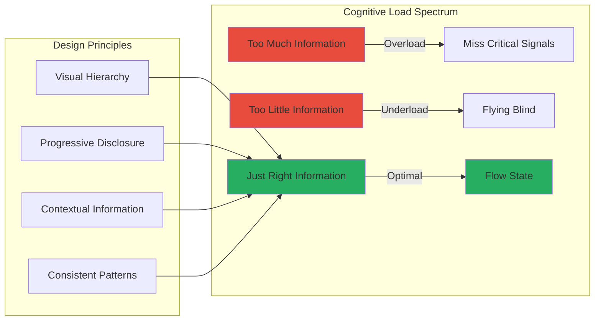

# Law 6: The Law of Cognitive Load 🤯

> A system's complexity must fit within human cognitive limits, or it will fail through misoperation.

## The Naive View

Good documentation and training solve operational complexity. If operators make mistakes, they need more runbooks. Automation eliminates human error. Complex systems just need better dashboards. If we hire smart enough people, they can handle any level of complexity.

## The Reality

Under incident stress, operators revert to mental models. If those models are wrong or the system is too complex to model, mistakes multiply. The "human API"—dashboards, errors, alerts, tools—is as critical as any technical API. Cognitive load isn't just about intelligence; it's about the fundamental limits of human information processing. The most sophisticated systems fail not through technical flaws but through human misunderstanding.

## Deep Structure

### The 7±2 Boundary

George Miller's famous paper revealed a fundamental limit:

```python
class HumanWorkingMemory:
    def __init__(self):
        self.capacity = 7  # ± 2 items
        self.duration = 20  # seconds without rehearsal
        self.chunking_ability = True
        
    def process_dashboard(self, dashboard_elements):
        """Model cognitive load of a dashboard"""
        
        # Can only track 5-9 elements simultaneously
        if len(dashboard_elements) > 9:
            # Cognitive overload - will miss critical signals
            missed_signals = len(dashboard_elements) - 9
            error_probability = 1 - (0.9 ** missed_signals)
            
        # Group related items to fit within limits
        chunks = self.chunk_information(dashboard_elements)
        if len(chunks) <= self.capacity:
            return {'comprehension': 'high', 'error_rate': 0.01}
        else:
            return {'comprehension': 'low', 'error_rate': 0.1}
```

### Mental Models: The Hidden Architecture

```mermaid
graph TD
    subgraph "Operator's Mental Model"
        MM_SIMPLE[Simple Model<br/>"Service talks to DB"] 
        MM_REAL[Actual System]
        
        MM_SIMPLE --> ACTION1[Debug assuming<br/>direct connection]
        MM_REAL --> ACTION2[Need to check<br/>cache, queue, replica]
        
        ACTION1 --> WRONG[Wrong diagnosis]
        ACTION2 --> RIGHT[Correct diagnosis]
    end
    
    subgraph "Model Complexity vs Reality"
        SIMPLE[Oversimplified] -->|Missing details| ERRORS1[Errors of Omission]
        COMPLEX[Too Complex] -->|Can't remember| ERRORS2[Errors of Confusion]
        GOLDILOCKS[Just Right] -->|Accurate & memorable| SUCCESS[Effective Operation]
    end
    
    style WRONG fill:#e74c3c
    style ERRORS1 fill:#e74c3c
    style ERRORS2 fill:#e74c3c
    style SUCCESS fill:#27ae60
```

### Error Messages as Cognitive Interfaces

```python
class CognitivelyOptimizedErrors:
    def __init__(self):
        self.context_window = 3  # Show 3 related pieces of info
        
    def format_error(self, error, context):
        """Design errors for human comprehension"""
        
        # BAD: Cognitive overload
        bad_error = {
            'error': 'ConnectionException',
            'code': 'ERR_5847',
            'stack': '200 lines of stack trace...',
            'timestamp': '1684934400000'
        }
        
        # GOOD: Fits mental model
        good_error = {
            'what_failed': 'Payment Service cannot reach Order Database',
            'why': 'Network partition between us-east-1a and us-east-1b',
            'when': '5 minutes ago (2:30 PM)',
            'impact': '~1,200 pending orders',
            'action': 'Run: kubectl rollout restart -n payments',
            'similar_past_incident': 'INC-2023-04-15 (network flap)',
            'dashboard_link': 'https://dash.internal/payments-db-split'
        }
        
        return good_error
```

### The Incident Stress Multiplier

Under stress, cognitive capacity decreases dramatically:

```python
def cognitive_capacity_under_stress(base_capacity, stress_factors):
    """Model how stress reduces cognitive ability"""
    
    capacity = base_capacity
    
    # Each stressor reduces capacity
    if stress_factors['time_pressure']:
        capacity *= 0.7  # 30% reduction
        
    if stress_factors['high_stakes']:  # Revenue impact
        capacity *= 0.8  # 20% reduction
        
    if stress_factors['sleep_deprivation']:
        capacity *= 0.6  # 40% reduction
        
    if stress_factors['multiple_failures']:
        capacity *= 0.5  # 50% reduction
        
    # Compound effects
    final_capacity = capacity
    
    # At 3 AM during a major outage, operators may have
    # only 20% of their normal cognitive capacity
    return {
        'normal_capacity': base_capacity,
        'stress_capacity': final_capacity,
        'reduction': 1 - (final_capacity / base_capacity)
    }
```

### Dashboard Design as UX



## Practical Application

### 1. Design for Recognition, Not Recall

```python
class RecognitionBasedUI:
    """
    Don't make operators remember; help them recognize
    """
    
    def design_alert(self, alert_data):
        # BAD: Forces recall
        bad_alert = "Error 5847 on node i-0a1b2c3d4e5f"
        
        # GOOD: Enables recognition
        good_alert = Alert(
            title="Payment Service Degraded",
            visual_indicator="🔴",  # Red = bad, instantly recognizable
            context={
                'service': 'payment-api (handles checkout)',
                'node': 'prod-payment-03 (us-east-1a)',
                'last_known_good': '10 minutes ago',
                'similar_to': 'Last Tuesday\'s database connection issue'
            },
            suggested_actions=[
                "1. Check database connectivity",
                "2. Verify payment-api logs",
                "3. Consider failover to us-east-1b"
            ]
        )
        
        return good_alert
```

### 2. Progressive Disclosure

```python
class ProgressiveDisclosureDashboard:
    """
    Show the right information at the right time
    """
    
    def __init__(self):
        self.levels = {
            'glance': 1,  # 1-second look
            'scan': 5,    # 5-second review  
            'study': 60,  # 1-minute analysis
            'deep': 300   # 5-minute investigation
        }
        
    def render_service_status(self, service, attention_level):
        if attention_level == 'glance':
            # Just health indicator
            return {
                'status': '🟢' if service.healthy else '🔴',
                'name': service.name
            }
            
        elif attention_level == 'scan':
            # Key metrics
            return {
                'status': service.health_emoji,
                'name': service.name,
                'latency': f"{service.p99_latency}ms",
                'errors': f"{service.error_rate}%",
                'trend': '📈' if service.degrading else '📊'
            }
            
        elif attention_level == 'study':
            # Detailed metrics + context
            return {
                **self.render_service_status(service, 'scan'),
                'dependencies': service.dependency_health,
                'recent_changes': service.last_deployments,
                'alerts': service.active_alerts,
                'runbook': service.runbook_link
            }
            
        else:  # deep
            # Everything including raw data
            return service.full_telemetry
```

### 3. Automation with Human Override

```python
class HumanInTheLoopAutomation:
    """
    Automate but keep humans in control
    """
    
    def __init__(self):
        self.automation_confidence = {}
        self.human_override_history = []
        
    def execute_remediation(self, issue, context):
        # Calculate automation confidence
        confidence = self.calculate_confidence(issue, context)
        
        if confidence > 0.95:
            # Fully automated
            action = self.determine_action(issue)
            self.notify_human(f"Auto-remediation: {action}")
            return self.execute(action)
            
        elif confidence > 0.7:
            # Propose and wait
            action = self.determine_action(issue)
            message = f"""
            Proposed action: {action}
            Confidence: {confidence:.0%}
            Similar past issues: {self.find_similar(issue)}
            
            Will execute in 30 seconds unless cancelled.
            [Cancel] [Execute Now] [Modify]
            """
            return self.propose_and_wait(message, action)
            
        else:
            # Human decision required
            options = self.generate_options(issue)
            return self.present_options_to_human(options)
```

## Example: Kubernetes Complexity Crisis

### The Problem

```yaml
# What operators need to understand:
apiVersion: apps/v1
kind: Deployment
metadata:
  name: payment-service
  namespace: production
  labels:
    app: payment
    version: v2.1.0
spec:
  replicas: 3
  strategy:
    type: RollingUpdate
    rollingUpdate:
      maxSurge: 1
      maxUnavailable: 0
  selector:
    matchLabels:
      app: payment
  template:
    metadata:
      labels:
        app: payment
    spec:
      containers:
      - name: payment
        image: payment:v2.1.0
        resources:
          requests:
            memory: "512Mi"
            cpu: "500m"
          limits:
            memory: "1Gi"
            cpu: "1000m"
        livenessProbe:
          httpGet:
            path: /health
            port: 8080
          periodSeconds: 10
        readinessProbe:
          httpGet:
            path: /ready
            port: 8080
          periodSeconds: 5
      affinity:
        podAntiAffinity:
          requiredDuringSchedulingIgnoredDuringExecution:
          - labelSelector:
              matchExpressions:
              - key: app
                operator: In
                values:
                - payment
            topologyKey: kubernetes.io/hostname
---
# Plus: Service, ConfigMap, Secret, HPA, PDB, NetworkPolicy...
```

### The Cognitive Load Problem

1. **Too many concepts**: Deployments, ReplicaSets, Pods, Services, ConfigMaps...
2. **Hidden interactions**: How do these affect each other?
3. **Non-obvious failure modes**: Why did my pod get evicted?
4. **Abstraction overload**: Too many layers to reason through

### The Solution: Cognitive Load Reduction

```python
class KubernetesCognitiveInterface:
    """Reduce Kubernetes complexity to human scale"""
    
    def summarize_deployment_status(self, deployment):
        """Transform complex state to simple mental model"""
        
        # Instead of 20+ fields, show what matters
        return {
            'simple_status': self.get_simple_status(deployment),
            'visual': self.generate_visual_representation(deployment),
            'problems': self.detect_problems_in_human_terms(deployment),
            'next_steps': self.suggest_actions(deployment)
        }
        
    def get_simple_status(self, deployment):
        if deployment.ready_replicas == deployment.spec.replicas:
            return "✅ All systems operational"
        elif deployment.ready_replicas > 0:
            return f"⚠️ Partial outage ({deployment.ready_replicas}/{deployment.spec.replicas} working)"
        else:
            return "🔴 Complete outage"
            
    def detect_problems_in_human_terms(self, deployment):
        problems = []
        
        if deployment.status.conditions.get('Progressing') == 'False':
            problems.append({
                'issue': 'Deployment stuck',
                'likely_cause': 'Image pull error or resource limits',
                'fix': 'Check: kubectl describe pod <pod-name>'
            })
            
        # Transform technical issues to human understanding
        return problems
```

## Theoretical Foundations

### Cognitive Psychology
- **Miller's Law**: 7±2 item limit in working memory
- **Fitts's Law**: Time to click = a + b × log₂(distance/size + 1)
- **Hick's Law**: Decision time increases with number of choices

### Human Factors Engineering
- **GOMS Model**: Goals, Operators, Methods, Selection rules
- **Situation Awareness**: Perception → Comprehension → Projection
- **Swiss Cheese Model**: How multiple small failures align

### Information Architecture
- **Information Scent**: Users follow cues to find information
- **Progressive Disclosure**: Reveal complexity gradually
- **Recognition vs Recall**: Recognition is easier than recall

## Design Implications

### 1. **Pattern: Operator Experience (OX) Design**
Treat operators as users who need great UX:

```python
class OperatorExperienceDesign:
    principles = {
        'clarity': 'Every alert should be actionable',
        'context': 'Always show related information',
        'consistency': 'Same problem, same presentation',
        'forgiveness': 'Easy to undo/recover from mistakes',
        'feedback': 'Clear confirmation of actions'
    }
```

### 2. **Anti-pattern: Expert-Only Interfaces**
Don't design for the mythical "expert who knows everything":

```python
# BAD: Assumes perfect knowledge
$ kubectl delete pod payment-7d8f9g-x2kl --force --grace-period=0

# GOOD: Guides safe operation
$ k8s-admin delete-pod payment-service
> This will delete 1 pod from payment-service
> Current replicas: 3 (all healthy)
> After deletion: 2 (temporary reduced capacity)
> New pod will be created automatically
> Continue? [y/N]
```

### 3. **Trade-off: Power vs Usability**
- Raw APIs: Maximum power, maximum cognitive load
- Simplified interfaces: Reduced power, manageable load
- Progressive interfaces: Start simple, reveal power as needed

## Exercises

[**→ Human Interface Design Lab**](./exercises.md) - Build interfaces that respect cognitive limits

## The Ultimate Insight

> "The limiting factor in system complexity is not technology but human comprehension. Build systems that fit in a human head."

Great systems succeed not by eliminating human involvement but by designing for human partnership:
1. **Respect cognitive limits** - 7±2 is not negotiable
2. **Design for stress** - Incidents reduce capacity by 80%
3. **Build recognition** - Don't rely on memory
4. **Progressive complexity** - Simple things simple, complex things possible

## Further Reading

- "The Design of Everyday Things" - Don Norman
- "Information Dashboard Design" - Stephen Few  
- "The Humane Interface" - Jef Raskin
- "Normal Accidents" - Charles Perrow

[**← Previous: Law of Distributed Knowledge**](/part1-axioms/law5-epistemology/) | [**→ Next: Law of Economic Reality**](/part1-axioms/law7-economics/)