# Synthesis: The Meta-Framework

[Home](/) > [The 7 Laws](part1-axioms) > Synthesis

> "The laws don't exist in isolation—they form a complex web where each reinforces and amplifies the others."

## The Law Interaction Matrix

The true complexity of distributed systems emerges from how the laws interact:

```mermaid
graph TD
    subgraph "Primary Interactions"
        F[Failure ⛓️] <--> A[Asynchrony ⏳]
        A <--> E[Emergence 🌪️]
        E <--> T[Trade-offs ⚖️]
        T <--> K[Knowledge 🧠]
        K <--> H[Human API 🤯]
        H <--> EC[Economics 💰]
    end
    
    subgraph "Compound Effects"
        F --> FA[Failure + Asynchrony<br/>= Undetectable Failures]
        A --> AE[Asynchrony + Emergence<br/>= Unpredictable Timing]
        E --> ET[Emergence + Trade-offs<br/>= Non-linear Costs]
        T --> TK[Trade-offs + Knowledge<br/>= Consistency Spectrum]
        K --> KH[Knowledge + Human<br/>= Mental Model Gaps]
        H --> HE[Human + Economics<br/>= Operational Costs]
    end
    
    subgraph "Cascading Consequences"
        FA --> CHAOS[System Chaos]
        AE --> CHAOS
        ET --> CHAOS
        TK --> CHAOS
        KH --> CHAOS
        HE --> CHAOS
    end
    
    style F fill:#e74c3c
    style A fill:#3498db
    style E fill:#f39c12
    style T fill:#9b59b6
    style K fill:#1abc9c
    style H fill:#e67e22
    style EC fill:#27ae60
    style CHAOS fill:#c0392b,color:#fff
```



## The Compounding Effects

### 1. Failure × Asynchrony = The Detection Problem

```python
class FailureAsynchronyCompound:
    """
    When failure meets asynchrony, you can't tell if a node is:
    - Dead (failed)
    - Slow (asynchronous)
    - Partitioned (unreachable)
    """
    
    def detect_failure(self, node, timeout):
# The fundamental impossibility
        response = wait_for_response(node, timeout)
        
        if not response:
# What do we actually know?
            return {
                'node_dead': 'maybe',  # Could have failed
                'node_slow': 'maybe',  # Could be processing
                'network_partitioned': 'maybe',  # Could be isolated
                'action': '???'  # What should we do?
            }
    
    def compound_effect(self):
        """The cascade begins"""
# Uncertain detection leads to:
# - Split brain (two leaders)
# - Data inconsistency
# - Cascading timeouts
# - Human confusion
```

### 2. Emergence × Trade-offs = Optimization Cliffs

```python
def emergence_tradeoff_cliff():
    """
    Trade-offs aren't smooth - emergence creates cliffs
    """
    
# You think you're optimizing linearly
    for utilization in range(0, 100, 5):
        if utilization < 70:
# Linear region - predictable trade-offs
            latency = 50 + utilization * 0.5
            cost = utilization * 10
        else:
# Emergence! Phase transition
            latency = 50 * (2 ** ((utilization - 70) / 10))
            cost = cost * 1.5  # Need more resources to maintain stability
            
        print(f"Utilization: {utilization}%")
        print(f"  Expected latency: {50 + utilization * 0.5}ms")
        print(f"  Actual latency: {latency}ms")
        print(f"  Cost surprise: ${cost}")
```

### 3. Knowledge × Human API = The Understanding Gap

```python
class KnowledgeHumanGap:
    """
    What the system knows vs what humans understand
    """
    
    def __init__(self):
        self.system_knowledge = {
            'node_states': VectorClock(),
            'consistency_level': 'causal',
            'confidence': 0.87,
            'staleness_bounds': '5-15 seconds'
        }
        
        self.human_understanding = {
            'mental_model': 'Its probably consistent',
            'confidence': 'high',  # Unjustified!
            'expected_behavior': 'Like a single database'
        }
        
    def incident_occurs(self):
# The gap becomes critical
        reality = "Causal consistency with 15s staleness window"
        expectation = "Should be immediately consistent"
        
# Result: Wrong debugging path, extended outage
        return {
            'mttr_increase': '4x',
            'wrong_remediation_attempts': 3,
            'customer_impact': 'severe'
        }
```

### 4. Economics × All Others = The Ultimate Constraint

```python
def economics_constrains_everything():
    """
    Money limits all other laws
    """
    
    constraints = {
        'failure_tolerance': {
            'ideal': '5 nines across 3 regions',
            'economic_reality': '3 nines in 1 region',
            'reason': 'Would cost $2M/month'
        },
        'asynchrony_handling': {
            'ideal': 'Full linearizability',
            'economic_reality': 'Eventual consistency',
            'reason': '10x infrastructure cost'
        },
        'emergence_prevention': {
            'ideal': 'Isolated cells per customer',
            'economic_reality': 'Shared multi-tenant',
            'reason': 'Per-customer cost prohibitive'
        },
        'knowledge_certainty': {
            'ideal': 'Strong consistency everywhere',
            'economic_reality': 'Consistency where it matters',
            'reason': 'Performance cost too high'
        }
    }
    
    return constraints
```

## The Irreducible Complexity

Some complexity can't be eliminated, only managed:

### The Fundamental Trilemma


### Why You Can't Win

1. **Simple + Correct = Slow**: Single-threaded, synchronized
2. **Correct + Performant = Complex**: Distributed consensus, elaborate protocols
3. **Simple + Performant = Incorrect**: Race conditions, data loss

## Framework Limitations and Biases

### What This Framework Assumes

```python
class FrameworkAssumptions:
    """
    Hidden assumptions that limit applicability
    """
    
    architectural_bias = {
        'style': 'service-oriented',
        'assumes': [
            'Multiple cooperating services',
            'Network communication',
            'Shared-nothing architecture'
        ],
        'less_applicable_to': [
            'Embedded systems',
            'Single-node databases',
            'Batch processing systems'
        ]
    }
    
    scale_bias = {
        'target': 'web-scale',
        'assumes': [
            'Thousands to millions of users',
            'Geographic distribution',
            'Elastic demand'
        ],
        'less_applicable_to': [
            'Small, fixed deployments',
            'Airgapped systems',
            'Regulated environments'
        ]
    }
    
    failure_model_bias = {
        'assumes': 'fail-stop',
        'reality': 'Byzantine failures exist',
        'gap': 'Framework under-addresses malicious actors'
    }
```

### When to Use Different Models

```python
def choose_framework(context):
    """
    This framework isn't universal - know when to switch
    """
    
    if context.type == 'blockchain':
# Byzantine failures are primary concern
        return 'Byzantine Fault Tolerance frameworks'
        
    elif context.type == 'embedded':
# Real-time constraints dominate
        return 'Real-time systems theory'
        
    elif context.type == 'quantum':
# Quantum effects matter
        return 'Quantum information theory'
        
    elif context.type == 'ml_systems':
# Non-determinism is feature, not bug
        return 'Probabilistic systems frameworks'
        
    else:
# Traditional distributed systems
        return 'This seven-law framework'
```

### Alternative Paradigms Not Covered

1. **Actor Model Systems**
   - Everything is message passing
   - Location transparency
   - Different failure semantics

2. **Blockchain/DLT Systems**
   - Adversarial environment
   - Economic incentives primary
   - Consensus without trust

3. **Edge Computing**
   - Hierarchy not peer-to-peer
   - Intermittent connectivity
   - Resource-constrained nodes

4. **Serverless/FaaS**
   - No server management
   - Extreme elasticity
   - Different cost model

## Navigating the Law Space

### The Master's Intuition

Experienced distributed systems engineers develop intuition for navigating the law interactions:

```python
class DistributedSystemsIntuition:
    def sense_danger(self, system_state):
        """
        Pattern recognition across laws
        """
        
        danger_signals = []
        
# Failure + Asynchrony smell
        if (system_state.timeout_frequency > normal and 
            system_state.retry_rate > normal):
            danger_signals.append('Possible cascading failure brewing')
            
# Emergence + Economics smell
        if (system_state.utilization > 0.7 and
            system_state.cost_trend == 'exponential'):
            danger_signals.append('Approaching phase transition')
            
# Knowledge + Human smell
        if (system_state.consistency_model == 'complex' and
            system_state.new_oncall_engineers > 0):
            danger_signals.append('Incident risk from mental model mismatch')
            
        return danger_signals
```

### The Design Process


## The Path to Mastery

### Level 1: Understanding Individual Laws
- Learn each law in isolation
- Understand the theory
- Recognize patterns

### Level 2: Seeing Interactions
- Notice when laws compound
- Predict cascading effects
- Design for interactions

### Level 3: Intuitive Navigation
- Feel the system's trajectory
- Anticipate phase transitions
- Know which battles to fight

### Level 4: Transcending the Framework
- Recognize when laws don't apply
- Create new models for new domains
- Teach others the journey

## The Final Wisdom

> "The laws are not rules to follow but lenses through which to see. Master them, then forget them, then find them again in every system you build."

The framework succeeds not when you memorize seven laws, but when you:
1. **See the invisible forces** shaping your system
2. **Predict the compound effects** before they manifest
3. **Design with humility** accepting what cannot be overcome
4. **Build with pragmatism** balancing all constraints
5. **Operate with wisdom** knowing which fires to fight

## What Comes Next

This framework opens doors to deeper study:

### Theoretical Directions
- Byzantine fault tolerance
- Quantum distributed systems
- Bio-inspired distributed algorithms
- Economic mechanism design

### Practical Applications
- Applying laws to specific domains
- Building law-aware tools
- Teaching operators law thinking
- Creating law-based metrics

### Philosophical Questions
- Is eventual consistency inevitable?
- Can we build truly autonomous systems?
- What are the ethics of partial knowledge?
- How do we design for post-human operation?

## Conclusion: The Paradox

The ultimate paradox of distributed systems:

> **To build systems that bring order to chaos, we must first accept that perfect order is impossible.**

The laws teach us not how to eliminate complexity, but how to dance with it. They show us not how to achieve perfection, but how to fail gracefully. They guide us not to certainty, but to wisdom in the face of uncertainty.

Master these seven laws, and you master not just distributed systems, but the art of building in an imperfect universe.

---

[**← Back to Framework Overview**](index.md) | [**→ Start Your Journey**](law1-failure/index.md)