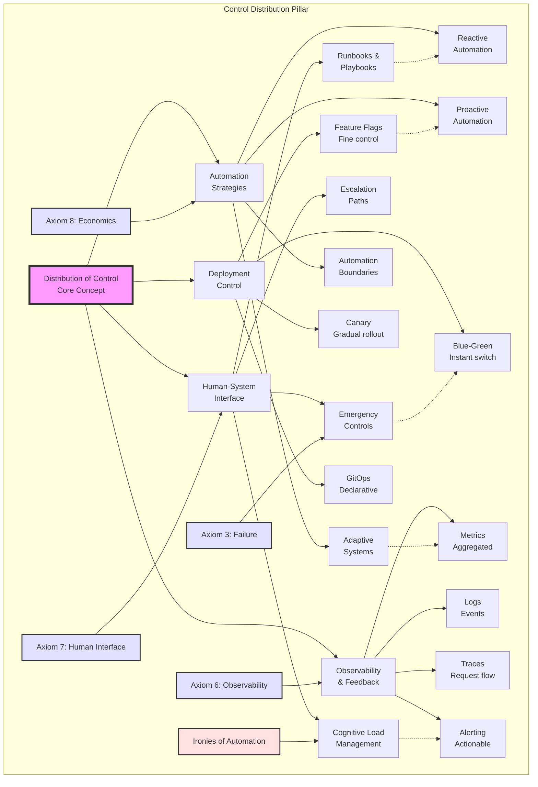
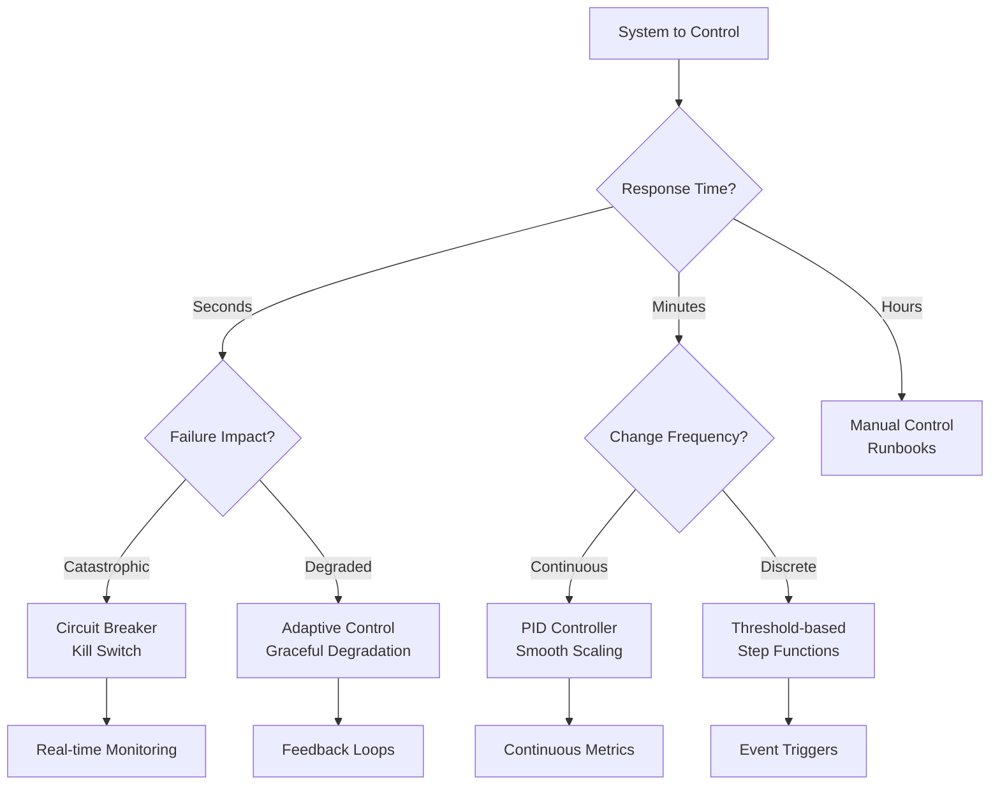

## Level 1: Intuition (Start Here) 🌱

### The Cruise Control Metaphor

Think about driving a car:
- **Manual Control**: You control speed with gas pedal
- **Cruise Control**: Set speed, car maintains it
- **Adaptive Cruise**: Adjusts to traffic automatically
- **Emergency Override**: Brake instantly takes control back
- **Driver Still Essential**: For decisions and emergencies

**This is distributed control**: Automation handles routine, humans handle exceptions.

### Real-World Analogy: Restaurant Kitchen

```yaml
Busy Restaurant Kitchen Control:

Head Chef: "Fire table 12!"
Grill Cook: Starts steaks automatically
Sauce Chef: Begins reduction on cue
Expediter: Coordinates timing

What's the control system?
- Standard procedures (recipes)
- Real-time coordination (expediter)
- Quality checks (head chef)
- Emergency overrides (stop everything!)

When rush hits:
- Procedures scale the operation
- Humans handle exceptions
- Clear escalation paths
- Everyone knows their role
```

### Your First Control Experiment

### The Beginner's Control Stack

```proto
         🧠 Strategic Control
          (Business decisions)
                |
                |
         📊 Tactical Control
           (Service goals)
                |
                |
         ⚙️ Operational Control
           (Day-to-day running)
                |
                |
         🚨 Emergency Control
           (Break glass procedures)
```

---

## 📋 Questions This Pillar Answers

---

## Level 2: Foundation (Understand Why) 🌿

### Core Principle: The Control Paradox

### Control Theory Basics

Control systems in distributed environments follow classic control theory principles adapted for network delays, partial failures, and eventual consistency.

```python
class ControlLoop:
    """Basic control loop structure"""
    
    def __init__(self, setpoint, measure_fn, actuate_fn):
        self.setpoint = setpoint      # Desired state
        self.measure = measure_fn      # How to observe
        self.actuate = actuate_fn      # How to change
        
    def run(self):
        while True:
            # Observe
            current = self.measure()
            
            # Decide
            error = self.setpoint - current
            action = self.compute_action(error)
            
            # Act
            self.actuate(action)
            
            # Wait
            time.sleep(self.control_interval)
```

### The Control Hierarchy

```proto
Strategic Level (Days/Weeks)
├─ Business metrics
├─ Capacity planning
├─ Budget allocation
└─ Architecture decisions

Tactical Level (Hours/Days)
├─ Service objectives
├─ Deployment decisions
├─ Resource allocation
└─ Incident management

Operational Level (Minutes/Hours)
├─ Auto-scaling
├─ Load balancing
├─ Health checks
└─ Alerts

Emergency Level (Seconds)
├─ Circuit breakers
├─ Kill switches
├─ Rollbacks
└─ Failovers
```

### 🎬 Failure Vignette: Knight Capital Meltdown

**Date**: August 1, 2012  
**Loss**: $440 million in 45 minutes  
**Root Cause**: Deployment control failure

```yaml
The Timeline:
07:00 - Team begins deploying new trading software
07:30 - 7 of 8 servers updated successfully
07:31 - 1 server missed, still running old code
09:30 - Market opens
09:31 - Old code activated by new market data
09:32 - Server begins aggressive trading
09:35 - $2M loss per minute accumulating
09:58 - Manual intervention attempted
10:15 - Server finally stopped
10:20 - $440M loss realized

Control Failures:
1. No automated deployment verification
2. No canary deployment
3. No circuit breakers on trading volume
4. No automatic rollback on anomalies
5. Manual kill switch too slow

Lessons:
- Deployment is a control problem
- Partial failures are the worst failures
- Speed of control must match speed of failure
- Human reaction time inadequate for algorithmic trading
```

### Control System Properties

**1. Stability**: System returns to desired state after disturbance  
**2. Responsiveness**: How quickly system reacts to changes  
**3. Accuracy**: How close to setpoint system maintains  
**4. Robustness**: Tolerance to model errors and disturbances

---

## Level 3: Deep Dive (Master the Patterns) 🌳

### PID Controllers: The Workhorses

PID (Proportional-Integral-Derivative) controllers are the backbone of control systems, from thermostats to autoscalers.

```python
class PIDController:
    def __init__(self, kp, ki, kd, setpoint):
        self.kp = kp  # Proportional gain
        self.ki = ki  # Integral gain
        self.kd = kd  # Derivative gain
        self.setpoint = setpoint
        
        self.last_error = 0
        self.integral = 0
        self.last_time = time.time()
    
    def update(self, measured_value):
        """Calculate control output"""
        current_time = time.time()
        dt = current_time - self.last_time
        
        # Calculate error
        error = self.setpoint - measured_value
        
        # Proportional: React to current error
        p_term = self.kp * error
        
        # Integral: Fix accumulated error
        self.integral += error * dt
        i_term = self.ki * self.integral
        
        # Derivative: Predict future error
        if dt > 0:
            derivative = (error - self.last_error) / dt
            d_term = self.kd * derivative
        else:
            d_term = 0
        
        # Update state
        self.last_error = error
        self.last_time = current_time
        
        # Calculate output
        output = p_term + i_term + d_term
        
        return output

# Example: CPU-based autoscaling
class AutoScaler:
    def __init__(self, target_cpu=70):
        self.controller = PIDController(
            kp=0.1,   # Conservative proportional
            ki=0.01,  # Small integral
            kd=0.05,  # Derivative prevents oscillation
            setpoint=target_cpu
        )
    
    def scale(self, current_cpu, current_replicas):
        control_signal = self.controller.update(current_cpu)
        desired_replicas = current_replicas + int(control_signal)
        return max(2, min(100, desired_replicas))  # Bounds
```

### Circuit Breaker Pattern

Stop cascading failures by breaking connections to failing services.

```python
class CircuitBreaker:
    def __init__(self, failure_threshold=5, recovery_timeout=60):
        self.failure_threshold = failure_threshold
        self.recovery_timeout = recovery_timeout
        self.failure_count = 0
        self.last_failure_time = None
        self.state = 'CLOSED'  # CLOSED, OPEN, HALF_OPEN
    
    def call(self, func, *args, **kwargs):
        if self.state == 'OPEN':
            if self._should_attempt_reset():
                self.state = 'HALF_OPEN'
            else:
                raise CircuitOpenError("Circuit breaker is OPEN")
        
        try:
            result = func(*args, **kwargs)
            self._on_success()
            return result
        except Exception as e:
            self._on_failure()
            raise e
    
    def _on_success(self):
        self.failure_count = 0
        if self.state == 'HALF_OPEN':
            self.state = 'CLOSED'
    
    def _on_failure(self):
        self.failure_count += 1
        self.last_failure_time = time.time()
        if self.failure_count >= self.failure_threshold:
            self.state = 'OPEN'
    
    def _should_attempt_reset(self):
        return (time.time() - self.last_failure_time) >= self.recovery_timeout

# Usage example
user_service_breaker = CircuitBreaker()

def get_user_data(user_id):
    return user_service_breaker.call(
        fetch_from_user_service, user_id
    )
```

### Deployment Control Strategies

Control risk during deployments with progressive rollout strategies.

```python
class DeploymentController:
    def __init__(self, total_instances):
        self.total_instances = total_instances
        self.deployment_strategies = {
            'blue_green': self.blue_green_deploy,
            'canary': self.canary_deploy,
            'rolling': self.rolling_deploy
        }
    
    def blue_green_deploy(self, new_version):
        """Instant cutover between versions"""
        # Deploy new version to standby environment
        green_env = self.provision_environment(new_version)
        
        # Run health checks
        if not self.health_check(green_env):
            self.teardown_environment(green_env)
            raise DeploymentError("Green environment unhealthy")
        
        # Switch traffic
        self.switch_traffic(to=green_env)
        
        # Keep blue as backup
        self.mark_as_standby(self.current_env)
        
    def canary_deploy(self, new_version, stages=[1, 5, 10, 50, 100]):
        """Gradual rollout with bake time"""
        for percentage in stages:
            instances = int(self.total_instances * percentage / 100)
            
            # Deploy to subset
            deployed = self.deploy_instances(new_version, instances)
            
            # Monitor metrics
            if not self.monitor_canary(deployed, duration=300):
                self.rollback(deployed)
                raise DeploymentError(f"Canary failed at {percentage}%")
            
            print(f"Canary at {percentage}% healthy")
        
        print("Deployment complete")
    
    def rolling_deploy(self, new_version, batch_size=2):
        """Replace instances in batches"""
        for i in range(0, self.total_instances, batch_size):
            batch = self.instances[i:i+batch_size]
            
            # Take batch out of service
            self.drain_traffic(batch)
            
            # Deploy new version
            self.deploy_to_instances(batch, new_version)
            
            # Health check
            if not self.health_check(batch):
                self.emergency_rollback()
                raise DeploymentError(f"Batch {i} failed")
            
            # Return to service
            self.enable_traffic(batch)
```

### Concept Map: Distribution of Control



This concept map illustrates how control distribution balances human oversight with automation, deployment strategies, and observability. The "Ironies of Automation" remind us that more automation often requires more sophisticated human control.

### Observability: The Eyes of Control

### Control System Decision Framework

### Alert Design Philosophy

---

## Level 4: Expert (Production Patterns) 🌲

### Case Study: Netflix Chaos Engineering

Netflix pioneered using controlled chaos to build resilient systems.

```python
class ChaosMonkey:
    """Randomly terminate instances to test resilience"""
    
    def __init__(self, cluster, probability=0.1):
        self.cluster = cluster
        self.probability = probability
        self.exclusions = set()  # Critical instances
        
    def unleash_chaos(self):
        """Randomly terminate instances during business hours"""
        if not self.is_business_hours():
            return
            
        for instance in self.cluster.instances:
            if instance.id in self.exclusions:
                continue
                
            if random.random() < self.probability:
                print(f"Chaos Monkey terminating {instance.id}")
                instance.terminate()
                self.notify_team(instance)
                
                # Verify system handles failure
                if not self.verify_health():
                    self.emergency_restore(instance)
    
    def is_business_hours(self):
        """Only cause chaos when engineers are awake"""
        hour = datetime.now().hour
        return 9 <= hour <= 17 and datetime.now().weekday() < 5

class ChaosKong:
    """Simulate entire region failures"""
    
    def __init__(self, regions):
        self.regions = regions
        
    def simulate_region_failure(self, region):
        """Take entire region offline"""
        print(f"ChaosKong: Failing region {region}")
        
        # Redirect traffic away
        self.traffic_manager.remove_region(region)
        
        # Verify other regions handle load
        for r in self.regions:
            if r != region:
                if not self.verify_region_health(r):
                    print(f"Region {r} struggling!")
                    self.abort_chaos()
                    return
        
        print(f"System survived {region} failure")
```

**Netflix's Chaos Principles**:
1. **Build confidence through testing** - Regular failures prevent surprise
2. **Fail during optimal conditions** - Business hours with engineers available
3. **Start small, grow scope** - Instance → Service → Region
4. **Automate everything** - Including failure injection

### 🎯 Decision Framework: Control Strategy



### Advanced Pattern: Adaptive Control

Systems that learn and adjust their control parameters based on observed behavior.

```python
class AdaptiveLoadBalancer:
    """Load balancer that learns backend performance"""
    
    def __init__(self, backends):
        self.backends = backends
        self.weights = {b: 1.0 for b in backends}
        self.performance_history = defaultdict(list)
        
    def route_request(self, request):
        # Select backend using weighted random
        backend = self.weighted_choice()
        
        # Measure performance
        start_time = time.time()
        try:
            response = backend.handle(request)
            latency = time.time() - start_time
            self.record_success(backend, latency)
            return response
        except Exception as e:
            self.record_failure(backend)
            raise e
    
    def adapt_weights(self):
        """Adjust weights based on performance"""
        for backend in self.backends:
            history = self.performance_history[backend]
            if not history:
                continue
                
            # Calculate performance score
            recent = history[-100:]  # Last 100 requests
            avg_latency = sum(r['latency'] for r in recent) / len(recent)
            error_rate = sum(1 for r in recent if r['error']) / len(recent)
            
            # Score: Lower latency and errors = higher score
            score = 1.0 / (avg_latency * (1 + error_rate * 10))
            
            # Smooth weight updates
            self.weights[backend] = 0.9 * self.weights[backend] + 0.1 * score

class AdaptiveRateLimiter:
    """Rate limiter that adjusts to backend capacity"""
    
    def __init__(self, initial_rate=1000):
        self.rate = initial_rate
        self.window = []  # Recent request outcomes
        
        # AIMD parameters (Additive Increase, Multiplicative Decrease)
        self.increase_step = 10
        self.decrease_factor = 0.8
        
    def should_allow(self):
        """Token bucket with adaptive rate"""
        self.refill_tokens()
        
        if self.tokens > 0:
            self.tokens -= 1
            return True
        return False
    
    def record_response(self, success, latency):
        """Adapt rate based on responses"""
        self.window.append({
            'time': time.time(),
            'success': success,
            'latency': latency
        })
        
        # Keep sliding window
        cutoff = time.time() - 10  # 10 second window
        self.window = [w for w in self.window if w['time'] > cutoff]
        
        # Adapt rate
        if len(self.window) >= 100:
            success_rate = sum(1 for w in self.window if w['success']) / len(self.window)
            avg_latency = sum(w['latency'] for w in self.window) / len(self.window)
            
            if success_rate < 0.95 or avg_latency > self.target_latency:
                # Decrease rate
                self.rate = int(self.rate * self.decrease_factor)
            else:
                # Increase rate
                self.rate = self.rate + self.increase_step
```

### Production Anti-Patterns

Learn from common control system failures:

```python
class ControlAntiPatterns:
    """What NOT to do in production"""
    
    def anti_pattern_1_aggressive_scaling(self):
        """❌ Overreactive scaling causes oscillation"""
        # Bad: Hair-trigger scaling
        if cpu > 80:
            scale_up(10)  # Too aggressive!
        elif cpu < 20:
            scale_down(10)  # Oscillation guaranteed
        
        # Good: Damped response
        controller = PIDController(kp=0.1, ki=0.01, kd=0.05)
        adjustment = controller.update(cpu)
        scale_by(int(adjustment))
    
    def anti_pattern_2_missing_backpressure(self):
        """❌ No flow control leads to cascading failure"""
        # Bad: Accept everything
        def handle_request(req):
            return process(req)  # What if backend is slow?
        
        # Good: Backpressure
        def handle_request_safe(req):
            if queue.size() > MAX_QUEUE:
                return Response(503, "Service overloaded")
            
            with semaphore:  # Limit concurrent requests
                return process(req)
    
    def anti_pattern_3_binary_health_checks(self):
        """❌ Up/Down is too coarse"""
        # Bad: Binary health
        def health_check():
            try:
                db.ping()
                return "OK"
            except:
                return "FAIL"
        
        # Good: Gradient health
        def health_check_gradient():
            health_score = 100
            
            # Check various subsystems
            if db_latency > 100:
                health_score -= 20
            if error_rate > 0.01:
                health_score -= 30
            if queue_depth > 1000:
                health_score -= 25
                
            return {"score": health_score, "status": get_status(health_score)}
```

**Common Production Mistakes**:
1. **Oscillation** - Control loop reacts too quickly
2. **Cascade failures** - No circuit breakers between services  
3. **Thundering herd** - All instances retry simultaneously
4. **No backpressure** - Accept requests faster than processing
5. **Alert fatigue** - Too many non-actionable alerts

---

## Level 5: Mastery (Push the Boundaries) 🌴

### The Future: Autonomous Operations

Self-healing systems that require minimal human intervention.

```python
class AutonomousOperator:
    """Self-operating system with learning capabilities"""
    
    def __init__(self):
        self.knowledge_base = KnowledgeGraph()
        self.ml_models = {
            'anomaly_detection': AnomalyDetector(),
            'root_cause': RootCauseAnalyzer(),
            'remediation': RemediationPredictor()
        }
        self.action_history = []
        
    def monitor_and_heal(self):
        """Continuous monitoring and self-healing loop"""
        while True:
            # Detect anomalies
            anomalies = self.detect_anomalies()
            
            for anomaly in anomalies:
                # Analyze root cause
                root_cause = self.analyze_root_cause(anomaly)
                
                # Predict best remediation
                action = self.predict_remediation(root_cause)
                
                # Execute with safety checks
                if self.is_safe_action(action):
                    result = self.execute_action(action)
                    self.learn_from_result(action, result)
                else:
                    self.escalate_to_human(anomaly, action)
    
    def predict_remediation(self, root_cause):
        """Use ML to predict best fix"""
        # Find similar past issues
        similar_cases = self.knowledge_base.find_similar(root_cause)
        
        # Extract successful remediations
        successful_actions = [
            case.action for case in similar_cases
            if case.outcome == 'success'
        ]
        
        # Use model to predict best action
        features = self.extract_features(root_cause)
        return self.ml_models['remediation'].predict(features)
    
    def learn_from_result(self, action, result):
        """Update models based on outcome"""
        self.action_history.append({
            'action': action,
            'result': result,
            'timestamp': time.time()
        })
        
        # Retrain models periodically
        if len(self.action_history) % 100 == 0:
            self.retrain_models()
```

### Control Planes at Scale

Managing millions of containers across thousands of nodes.

```python
class GlobalControlPlane:
    """Multi-region, multi-cloud control plane"""
    
    def __init__(self):
        self.regions = {}
        self.global_state = GlobalStateStore()
        self.policy_engine = PolicyEngine()
        
    def add_region(self, region_id, endpoint):
        """Add new region to control plane"""
        region = RegionController(region_id, endpoint)
        self.regions[region_id] = region
        
        # Sync global policies
        region.apply_policies(self.policy_engine.get_policies())
        
        # Start regional monitoring
        region.start_monitoring()
        
    def handle_global_event(self, event):
        """Coordinate response across regions"""
        if event.type == 'REGION_FAILURE':
            # Redistribute load
            failed_region = event.region
            workload = self.regions[failed_region].get_workload()
            
            # Find regions with capacity
            available_regions = self.find_regions_with_capacity(
                workload.requirements
            )
            
            # Distribute workload
            for region in available_regions:
                portion = workload.split(len(available_regions))
                region.accept_workload(portion)
                
        elif event.type == 'GLOBAL_POLICY_UPDATE':
            # Propagate to all regions
            for region in self.regions.values():
                region.apply_policy(event.policy)
                
    def optimize_globally(self):
        """Global optimization across regions"""
        # Collect regional metrics
        metrics = {}
        for region_id, region in self.regions.items():
            metrics[region_id] = region.get_metrics()
            
        # Run optimization algorithm
        optimization_plan = self.compute_optimization(metrics)
        
        # Execute migrations
        for migration in optimization_plan.migrations:
            self.migrate_workload(
                migration.workload,
                from_region=migration.source,
                to_region=migration.destination
            )

class RegionController:
    """Regional control plane"""
    
    def __init__(self, region_id, endpoint):
        self.region_id = region_id
        self.endpoint = endpoint
        self.clusters = {}
        self.scheduler = RegionalScheduler()
        
    def handle_scheduling(self, workload):
        """Schedule workload within region"""
        # Find best cluster
        cluster = self.scheduler.find_best_cluster(
            workload,
            self.clusters.values()
        )
        
        if not cluster:
            # Need to scale up
            new_cluster = self.provision_cluster(workload.requirements)
            self.clusters[new_cluster.id] = new_cluster
            cluster = new_cluster
            
        # Deploy workload
        return cluster.deploy(workload)
```

### The Philosophy of Control

Control in distributed systems is about managing complexity through abstraction and automation while maintaining human agency.

```python
class ControlPhilosophy:
    """Core principles of distributed control"""
    
    def principle_1_autonomy_with_oversight(self):
        """Systems should be autonomous but observable"""
        return {
            'autonomous': 'Handle routine operations independently',
            'observable': 'Provide clear visibility into decisions',
            'overridable': 'Allow human intervention at any point',
            'auditable': 'Record all actions for review'
        }
    
    def principle_2_graceful_degradation(self):
        """Fail partially rather than completely"""
        return {
            'levels': [
                'Full functionality',
                'Reduced functionality',
                'Essential functionality only',
                'Safe mode',
                'Controlled shutdown'
            ],
            'transitions': 'Smooth transitions between levels',
            'communication': 'Clear status to users'
        }
    
    def principle_3_human_in_the_loop(self):
        """Keep humans involved for critical decisions"""
        # Automation handles the mundane
        # Humans handle the exceptional
        # Together they handle the complex
        
    def principle_4_control_as_conversation(self):
        """Control is dialogue, not dictatorship"""
        # System suggests actions
        # Human provides context
        # Together they decide
        # Both learn from outcomes

class IroniesOfAutomation:
    """Lisanne Bainbridge's insights applied to distributed systems"""
    
    def irony_1_skill_atrophy(self):
        """The more reliable automation, the less practice humans get"""
        # Mitigation: Regular drills and chaos engineering
        
    def irony_2_automation_surprises(self):
        """Automation fails in novel ways humans don't expect"""
        # Mitigation: Explainable AI and decision logging
        
    def irony_3_increased_complexity(self):
        """Automation often increases system complexity"""
        # Mitigation: Progressive disclosure and good abstractions
```

## Summary: Key Insights by Level

### 🌱 Beginner
1. **Control frees humans for important decisions**
2. **Automation handles routine, humans handle exceptions**
3. **Good control needs good observability**

### 🌿 Intermediate
1. **Control paradox: More automation = More critical human role**
2. **Feedback loops essential for stability**
3. **Multiple control levels for different timescales**

### 🌳 Advanced
1. **PID control universal pattern**
2. **Circuit breakers prevent cascades**
3. **Progressive deployment reduces risk**

### 🌲 Expert
1. **Chaos engineering builds confidence**
2. **Adaptive control handles changing conditions**
3. **Control strategy depends on failure modes**

### 🌴 Master
1. **Autonomous operations are coming**
2. **Control plane isolation critical at scale**
3. **Best systems make failures boring**

## Practical Exercises

### Exercise 1: Build Your Own Circuit Breaker 🌱

Create a basic circuit breaker to understand state management:

```python
# States: CLOSED (normal) → OPEN (failing) → HALF_OPEN (testing)
# Your implementation should track:
# - Failure count and threshold
# - Timeout for recovery attempts
# - Success/failure metrics
```

### Exercise 2: PID Controller Tuning 🌿

Experiment with PID parameters:

| Parameter | Too Low | Just Right | Too High |
|-----------|---------|------------|----------|
| Kp (Proportional) | Slow response | Quick, stable | Overshoot |
| Ki (Integral) | Steady-state error | No drift | Oscillation |
| Kd (Derivative) | No damping | Smooth | Nervous/jittery |

### Exercise 3: Design a Deployment Strategy 🌳

Match deployment strategy to scenario:

| Scenario | Best Strategy | Why |
|----------|--------------|-----|
| Critical financial system | Blue-Green | Instant rollback |
| Large user base | Canary | Gradual risk |
| Microservices mesh | Rolling | Maintain capacity |
| Experimental feature | Feature Flag | User control |

### Exercise 4: Chaos Engineering Plan 🌲

Design chaos experiments for your system:

1. **Start Small**: Random pod deletion in dev
2. **Increase Scope**: Service failures in staging  
3. **Network Chaos**: Latency injection
4. **Data Chaos**: Corrupt responses
5. **Full Region**: Disaster recovery test

### Exercise 5: Alert Design Workshop 🌴

Create actionable alerts:

```yaml
Bad Alert:
  name: "CPU High"
  condition: "cpu > 80%"
  message: "CPU is high"
  
Good Alert:
  name: "API Latency Degradation - User Impact"
  condition: "p99_latency > 500ms for 5 minutes"
  message: |
    User-facing API latency degraded
    Current p99: {{current_value}}ms (threshold: 500ms)
    Affected endpoints: {{endpoints}}
    Runbook: https://wiki/runbooks/api-latency
  severity: "page"
  team: "api-oncall"
```

## Quick Reference Card

```yaml
Control Strategy Decision Tree:

Need Speed? (Response time)
├─ Seconds → Circuit Breaker
│   └─ Fail fast, protect system
├─ Minutes → PID Controller  
│   └─ Smooth adjustments
└─ Hours → Human Process
    └─ Runbook + automation

Deployment Safety:
├─ Risk Level?
│   ├─ High → Blue-Green (instant rollback)
│   ├─ Medium → Canary (gradual rollout)
│   └─ Low → Rolling (continuous delivery)
│
└─ Rollback Plan?
    ├─ Instant → Keep previous version running
    ├─ Quick → Feature flags + monitoring
    └─ Manual → Not recommended!

Automation Boundaries:
┌─────────────────────────────────┐
│ Fully Automated                 │
│ • Scaling (within limits)       │
│ • Health checks                 │
│ • Load balancing               │
│ • Failover                     │
├─────────────────────────────────┤
│ Human Approval Required         │
│ • Capacity expansion            │
│ • Cross-region failover        │
│ • Major version upgrades       │
│ • Security incidents           │
├─────────────────────────────────┤
│ Human Only                      │
│ • Architecture changes          │
│ • Vendor selection             │
│ • Incident command             │
│ • Business decisions           │
└─────────────────────────────────┘

Control Metrics:
📊 Stability: Time between oscillations
📈 Responsiveness: Time to reach setpoint
📉 Accuracy: Deviation from target
🔄 Efficiency: Resources used
```

### Common Control Patterns

| Pattern | When to Use | Example |
|---------|-------------|---------|
| **Circuit Breaker** | Prevent cascade failures | Database timeouts |
| **Bulkhead** | Isolate failures | Thread pool per service |
| **Retry + Backoff** | Transient failures | Network hiccups |
| **Rate Limiting** | Protect resources | API throttling |
| **Load Shedding** | Overload protection | Drop low-priority requests |
| **Timeout** | Bound wait time | HTTP calls |
| **Deadlines** | End-to-end time limit | Request processing |
| **Compensation** | Undo on failure | Saga pattern |

---

**Next**: [Pillar 5: Intelligence →](../intelligence/index.md)

*"The best control system is one you never notice—until you need it."*
